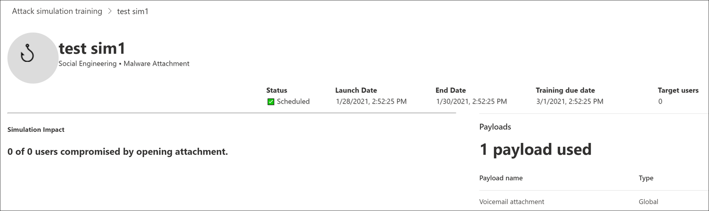

# Überlegungen zur Bereitstellung von Schulungspaketen für Angriffssimulationen und häufig gestellte Fragen

Das Training zur Angriffssimulation ist [jetzt allgemein verfügbar.](https://techcommunity.microsoft.com/t5/microsoft-security-and/attack-simulation-training-in-microsoft-defender-for-office-365/ba-p/2037291) Die Schulung zur Angriffssimulation ermöglicht Microsoft 365 E5- oder Microsoft Defender für Office 365 Plan 2-Organisationen das Messen und Verwalten von Social Engineering-Risiken, indem die Erstellung und Verwaltung von Phishingsimulationen ermöglicht wird, die von realen, entwaffnten Phishing-Nutzlasten unterstützt werden. Hyper gezielte Schulungen, die in Zusammenarbeit mit der Sicherheit von "Teronova" zur Verbesserung von Kenntnissen und zum Ändern des Verhaltens von Mitarbeitern führen.

Weitere Informationen zu den ersten Schritte mit attack simulation training finden Sie unter [Get started using Attack simulation training](attack-simulation-training-get-started.md).

Während die gesamte Simulationserstellungs- und Zeitplanungsumgebung frei fließend und reibungsfrei konzipiert wurde, ist für das Ausführen von Simulationen auf Unternehmensskala häufig eine Planung erforderlich. Dieser Artikel hilft dabei, bestimmte Herausforderungen zu bewältigen, die wir sehen, wenn unsere Kunden Simulationen in ihren eigenen Umgebungen ausführen.

## Probleme mit der Endbenutzererfahrung

### Phishingsimulations-URLs, die von Google Safe Browsing blockiert werden

Ein URL-Reputationsdienst kann eine oder mehrere der URLs identifizieren, die von attack simulation training als unsicher verwendet werden. Google Safe Browsing in Google Chrome blockiert einige der simulierten Phishing-URLs mit einer **trügerischen Website-Vorausmeldung.** Wir arbeiten zwar mit vielen ANBIETER für die URL-Reputation zusammen, um unsere Simulations-URLs immer zu erlauben, aber nicht immer haben wir eine vollständige Abdeckung.

Beachten Sie, dass dieses Problem keine Auswirkungen auf Microsoft Edge hat.

Überprüfen Sie im Rahmen der Planungsphase unbedingt die Verfügbarkeit der URL in Ihren unterstützten Webbrowsern, bevor Sie die URL in einer Phishingkampagne verwenden. Wenn die URLs von Google Safe Browsing blockiert [werden,](https://support.google.com/chrome/a/answer/7532419) befolgen Sie diese Anleitung von Google, um den Zugriff auf die URLs zu ermöglichen.

Informationen zur Liste der URLs, die derzeit von [Attack Simulation Training](attack-simulation-training-get-started.md) verwendet werden, finden Sie unter Erste Schritte bei der Verwendung von Angriffssimulationsschulungen.

### Phishingsimulation und Administrator-URLs, die von Netzwerkproxylösungen und Filtertreibern blockiert werden

Sowohl Phishingsimulations-URLs als auch Administrator-URLs können von Ihren Zwischensicherheitsgeräten oder -filtern blockiert oder verworfen werden. Beispiel:

- Firewalls
- Web Application Firewall (WAF)-Lösungen
- Filtertreiber von Drittanbietern (z. B. Kernelmodusfilter)

Wir haben zwar gesehen, dass auf dieser Ebene nur wenige Kunden blockiert wurden, aber dies geschieht. Wenn Probleme auftreten, sollten Sie die folgenden URLs konfigurieren, um die Überprüfung durch Ihre Sicherheitsgeräte oder Filter nach Bedarf zu umgehen:

- Die simulierten Phishing-URLs, wie unter [Erste Schritte mit Attack Simulation Training beschrieben.](attack-simulation-training-get-started.md)
- <https://security.microsoft.com/attacksimulator>
- <https://security.microsoft.com/attacksimulationreport>
- <https://security.microsoft.com/trainingassignments>

### Simulationsmeldungen, die nicht an alle Zielbenutzer übermittelt werden

Es ist möglich, dass die Anzahl der Benutzer, die die Simulations-E-Mail-Nachrichten tatsächlich empfangen, kleiner ist als die Anzahl der Benutzer, die von der Simulation gezielt wurden. Die folgenden Benutzertypen werden im Rahmen der Zielüberprüfung ausgeschlossen:

- Ungültige Empfänger-E-Mail-Adressen.
- Gastbenutzer.
- Benutzer, die nicht mehr in Azure Active Directory (Azure AD) aktiv sind.

Nur gültige, nicht gastfreie Benutzer mit einem gültigen Postfach werden in Simulationen einbezogen. Wenn Sie Verteilergruppen oder E-Mail-aktivierte Sicherheitsgruppen für Zielbenutzer verwenden, können Sie das [Cmdlet Get-DistributionGroupMember](https://docs.microsoft.com/powershell/module/exchange/get-distributiongroupmember) in [Exchange Online PowerShell](https://docs.microsoft.com/powershell/exchange/connect-to-exchange-online-powershell) verwenden, um Verteilergruppenmitglieder zu anzeigen und zu überprüfen.

## Probleme bei der Berichterstellung für Angriffssimulationsschulungen

### Schulungsberichte zur Angriffssimulation enthalten keine Aktivitätsdetails

Das Training zur Angriffssimulation bietet umfassende, umsetzbare Einblicke, die Sie über den Fortschritt der Bedrohungsbereitschaft Ihrer Mitarbeiter informieren. Wenn Angriffssimulationsschulungsberichte nicht mit Daten gefüllt werden, überprüfen Sie, ob die Überwachungsprotokollsuche in Ihrer Organisation aktiviert ist (standardmäßig aktiviert).

Die Überwachungsprotokollsuche ist für die Attack Simulationsschulung erforderlich, damit Ereignisse erfasst, aufgezeichnet und zurückgelesen werden können. Das Deaktivieren der Überwachungsprotokollsuche hat die folgenden Folgen für das Training der Angriffssimulation:

- Berichtsdaten sind nicht in allen Berichten verfügbar. Die Berichte werden leer angezeigt.
- Schulungszuweisungen werden blockiert, da keine Daten verfügbar sind.

Informationen zum Aktivieren der Überwachungsprotokollsuche finden Sie unter Aktivieren oder Deaktivieren der [Überwachungsprotokollsuche.](../../compliance/turn-audit-log-search-on-or-off.md)

> [!NOTE]
> Leere Aktivitätsdetails können auch dadurch verursacht werden, dass benutzern keine E5-Lizenzen zugewiesen wurden. Überprüfen Sie, ob einem aktiven Benutzer mindestens eine E5-Lizenz zugewiesen ist, um sicherzustellen, dass Berichterstellungsereignisse erfasst und aufgezeichnet werden.

### Simulationsberichte werden nicht sofort aktualisiert

Detaillierte Simulationsberichte werden nicht unmittelbar nach dem Starten einer Kampagne aktualisiert. Machen Sie sich keine Sorgen. dieses Verhalten wird erwartet.

Jede Simulationskampagne hat einen Lebenszyklus. Beim ersten Erstellen befindet sich die Simulation im **Planzustand.** Wenn die Simulation gestartet wird, wird sie in den Status **In Bearbeitung** überwechselt. Nach Abschluss wird die Simulation in den Status **Abgeschlossen** überwechselt.

Während sich eine Simulation im **Planzustand** befindet, sind die Simulationsberichte größtenteils leer. In dieser Phase wird das Simulationsmodul die E-Mail-Adressen des Zielbenutzers auflösen, Verteilergruppen erweitern, Gastbenutzer aus der Liste entfernen usw.:

Sobald die Simulation in die **Phase In Bearbeitung** einschreitet, werden Sie feststellen, dass die Informationen in die Berichterstellung einfingen:

Es kann bis zu 30 Minuten dauern, bis die einzelnen Simulationsberichte nach dem Übergang zum Status **In Bearbeitung aktualisiert** werden. Die Berichtsdaten werden weiter entwickelt, bis die Simulation den Status **Abgeschlossen** erreicht hat. Berichterstellungsupdates erfolgen in den folgenden Intervallen:

- Alle 10 Minuten für die ersten 60 Minuten.
- Alle 15 Minuten nach 60 Minuten bis 2 Tage.
- Alle 30 Minuten nach 2 Tagen bis 7 Tage.
- Alle 60 Minuten nach 7 Tagen.

Widgets auf der **Seite Übersicht** bieten eine kurze Momentaufnahme der simulationsbasierten Sicherheitslage Ihrer Organisation im Laufe der Zeit. Da diese Widgets Ihre allgemeine Sicherheitslage und Denkzeit widerspiegeln, werden sie nach Abschluss jeder Simulationskampagne aktualisiert.

> [!NOTE]
> Sie können die Option **Export auf** den verschiedenen Berichtsseiten verwenden, um Daten zu extrahieren.

### Von Benutzern als Phishing gemeldete Nachrichten werden in Simulationsberichten nicht angezeigt

Simulationsberichte in Attack simulator training enthalten Details zur Benutzeraktivität. Beispiel:

- Benutzer, die auf den Link in der Nachricht geklickt haben.
- Benutzer, die ihre Anmeldeinformationen aufgaben.
- Benutzer, die die Nachricht als Phishing gemeldet haben.

Wenn Nachrichten, die Von Benutzern als Phishing gemeldet wurden, nicht in Simulationsberichten zur Simulation von Angriffen erfasst werden, gibt es möglicherweise eine Exchange-Nachrichtenflussregel (auch als Transportregel bezeichnet), die die Zustellung der gemeldeten Nachrichten an Microsoft blockiert. Stellen Sie sicher, dass Nachrichtenflussregeln die Zustellung an die folgenden E-Mail-Adressen nicht blockieren:

- junk@office365.microsoft.com
- abuse@messaging.microsoft.com
- phish@office365.microsoft.com
- nicht \_ junk@office365.microsoft.com

## Weitere häufig gestellte Fragen

### F: Welche Methode wird empfohlen, um Benutzer für Simulationskampagnen zu verwenden?

A: Für Zielbenutzer stehen mehrere Optionen zur Verfügung:

- Schließen Sie alle Benutzer ein (derzeit für Organisationen mit weniger als 40.000 Benutzern verfügbar).
- Wählen Sie bestimmte Benutzer aus.
- Wählen Sie Benutzer aus einer CSV-Datei aus.
- Gruppenbasiertes Azure AD-Ziel.

Wir haben festgestellt, dass Kampagnen, bei denen die Zielbenutzer von Azure AD-Gruppen identifiziert werden, im Allgemeinen einfacher zu verwalten sind.

### F: Gibt es Einschränkungen bei der Zielgruppensteuerung beim Importieren aus einer CSV oder beim Hinzufügen von Benutzern?

A: Der Grenzwert für das Importieren von Empfängern aus einer CSV-Datei oder das Hinzufügen einzelner Empfänger zu einer Simulation beträgt 40.000.

Ein Empfänger kann ein einzelner Benutzer oder eine Gruppe sein. Eine Gruppe kann Hunderte oder Tausende von Empfängern enthalten, sodass für die Anzahl der einzelnen Benutzer kein tatsächlicher Grenzwert gesetzt wird.

Das Verwalten einer großen CSV-Datei oder das Hinzufügen vieler einzelner Empfänger kann umständlich sein. Die Verwendung von Azure AD-Gruppen vereinfacht die Gesamtverwaltung der Simulation.

### F: Stellt Microsoft Nutzlasten in anderen Sprachen zur Verfügung?

A: Derzeit sind 5 lokalisierte Nutzlasten verfügbar. Es ist uns aufgefallen, dass direkte oder maschinelle Übersetzungen vorhandener Nutzlasten in andere Sprachen zu Ungenauigkeiten und einer verringerten Relevanz führen.

Sie können jedoch ihre eigene Nutzlast in der Sprache Ihrer Wahl mithilfe der benutzerdefinierten Nutzlasterstellungserfahrung erstellen. Außerdem wird dringend empfohlen, vorhandene Nutzlasten zu verwenden, die für Benutzer in einer bestimmten Geografischen Region verwendet wurden. Mit anderen Worten: Lassen Sie die Angreifer den Inhalt für Sie lokalisieren.

### F: Wie kann ich für mein Administratorportal und meine Schulungserfahrung zu anderen Sprachen wechseln?

A: In Microsoft 365 oder Office 365 ist die Sprachkonfiguration für jedes Benutzerkonto spezifisch und zentralisiert. Anweisungen zum Ändern Ihrer Spracheinstellung finden Sie unter Ändern der Anzeigesprache und Zeitzone [in Microsoft 365 for Business](https://support.microsoft.com/office/6f238bff-5252-441e-b32b-655d5d85d15b).

Beachten Sie, dass es bis zu 30 Minuten dauern kann, bis die Konfigurationsänderung für alle Dienste synchronisiert wird.

### F: Kann ich eine Testsimulation auslösen, um zu verstehen, wie sie vor dem Starten einer vollständigen Kampagne aussieht?

A: Ja, sie können! Auf der letzten Seite **Simulation** überprüfen im Assistenten zum Erstellen einer neuen Simulation gibt es eine Option zum Senden **eines Tests**. Diese Option sendet eine Beispielnachricht zur Phishingsimulation an den aktuell angemeldeten Benutzer. Nachdem Sie die Phishingnachricht in Ihrem Posteingang überprüft haben, können Sie die Simulation übermitteln.

### F: Kann ich Benutzer, die zu einem anderen Mandanten gehören, im Rahmen derselben Simulationskampagne gezielt verwenden?

A: Nein. Derzeit werden mandantenübergreifende Simulationen nicht unterstützt. Stellen Sie sicher, dass sich alle Ihre Zielbenutzer im gleichen Mandanten befinden. Mandantenübergreifende Benutzer oder Gastbenutzer werden von der Simulationskampagne ausgeschlossen.

### F: Wie funktioniert die regions bewusste Zustellung?

A: Die regionsorientierte Zustellung verwendet das TimeZone-Attribut des Postfachs des Zielbenutzers und die Logik "nicht vor", um zu bestimmen, wann die Nachricht zu senden ist. Berücksichtigen Sie beispielsweise das folgende Szenario:

- Um 7:00 Uhr in der Pazifischen Zeitzone (UTC-8) erstellt und plant ein Administrator eine Kampagne, die am selben Tag um 9:00 Uhr beginnt.
- UserA befindet sich in der Zeitzone "Ost" (UTC-5).
- UserB befindet sich auch in der Pazifischen Zeitzone.

Um 09:00 Uhr am gleichen Tag wird die Simulationsnachricht an UserB gesendet. Bei der regioninte nen Übermittlung wird die Nachricht nicht am selben Tag an UserA gesendet, da 9:00 Uhr Pazifische Zeit 12:00 Uhr Ostzeit ist. Stattdessen wird die Nachricht am folgenden Tag um 9:00 Uhr Ostzeit an UserA gesendet.

Bei der ersten Ausführung einer Kampagne mit aktivierter Region wird die Simulationsnachricht möglicherweise nur an Benutzer in einer bestimmten Zeitzone gesendet. Doch mit der Zeit und immer mehr Benutzern werden die zielorientierten Benutzer zunehmen.
