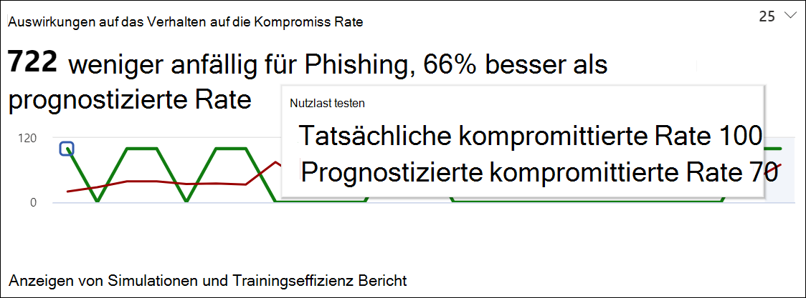

# Gewinnen Sie Erkenntnisse durch Angriffssimulationsschulungen

Im Rahmen von Attack Simulation Training bietet Microsoft Ihnen Einblicke basierend auf den Ergebnissen von Simulationen und Schulungen, die Mitarbeiter durch geführt haben. Diese Einblicke helfen Ihnen, über den Fortschritt der Bedrohungsbereitschaft Ihrer Mitarbeiter auf dem Laufenden zu bleiben, und empfehlen ihnen die nächsten Schritte, um Ihre Mitarbeiter und Ihre Umgebung besser auf Angriffe vorzubereiten.

Wir arbeiten kontinuierlich daran, die Für Sie verfügbaren Einblicke zu erweitern. Verhaltensfolgen und empfohlene Aktionen sind derzeit verfügbar. Beginnen Sie mit attack [simulation training im Microsoft 365 Security Center.](https://security.microsoft.com/attacksimulator?viewid=overview)

## Auswirkungen des Verhaltens auf die Kompromissrate

Auf der **Registerkarte Übersicht** des Angriffssimulationstrainings finden Sie die Auswirkungen des Verhaltens auf die Karte für **die Kompromissrate.** Diese Karte zeigt, wie Mitarbeiter mit den Simulationen umgegangen sind, die Sie im Gegensatz zur **vorhergesagten Kompromissrate ausführen.** Mit diesen Erkenntnissen können Sie den Fortschritt bei der Bereitschaft zur Bedrohung von Mitarbeitern nachverfolgen, indem Sie mehrere Simulationen für die gleichen Mitarbeitergruppen ausführen.

Im Diagramm sehen Sie:

- **Vorhergesagte Kompromissrate,** die die durchschnittliche Kompromissrate für Simulationen mit demselben Nutzlasttyp für andere Microsoft 365-Mandanten widerspiegelt, die Attack Simulation Training verwenden.
- **Die tatsächliche Kompromissrate** spiegelt den Prozentsatz der Mitarbeiter wider, die für die Simulation gefallen sind.

Darüber hinaus wird der Unterschied zwischen der tatsächlichen Anzahl der durch den Angriff gefährdeten Mitarbeiter und der `<number> less susceptible to phishing` vorhergesagten Kompromissrate wider. Diese Anzahl von Mitarbeitern ist in Zukunft weniger wahrscheinlich durch ähnliche Angriffe gefährdet, während sie im Gegensatz zur vorhergesagten Kompromissrate angibt, wie die Mitarbeiter insgesamt `<percent%> better than predicted rate` waren.

> [!div class="mx-imgBorder"]
> 

Klicken Sie auf Simulationen und Schulungseffizienzbericht anzeigen, um einen ausführlicheren **Bericht zu erhalten.** Dieser Bericht enthält dieselben Informationen mit zusätzlichem Kontext aus der Simulation selbst (z. B. Simulationstechnik und Zielbenutzer insgesamt).

## Empfohlene Aktionen

Auf der [ **Registerkarte Simulationen**](https://security.microsoft.com/attacksimulator?viewid=simulations)finden Sie durch Auswählen einer Simulation die Simulationsdetails, in denen Sie den Abschnitt **Empfohlene Aktionen** finden.

Im Abschnitt empfohlene Aktionen werden empfehlungen beschrieben, die in [Microsoft Secure Score verfügbar sind.](../defender/microsoft-secure-score.md) Diese Empfehlungen basieren auf der In der Simulation verwendeten Nutzlast und helfen Ihnen, Ihre Mitarbeiter und Ihre Umgebung zu schützen. Wenn Sie auf jede Verbesserungsaktion klicken, erfahren Sie mehr über die Details.

> [!div class="mx-imgBorder"]
> 

## Links zu verwandten Themen

[Erste Schritte mit dem Angriffssimulationstraining](attack-simulation-training-get-started.md)

[Erstellen einer Phishingangriffssimulation](attack-simulation-training.md)

[Erstellen einer Nutzlast für die Schulung Ihrer Mitarbeiter](attack-simulation-training-payloads.md)
