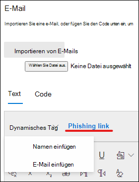

# Erstellen einer benutzerdefinierten Nutzlast für Angriffssimulationsschulungen

Microsoft bietet einen robusten Nutz Last Katalog für verschiedene Social Engineering-Techniken, um mit Ihrem Angriffs Simulationstraining zu koppeln. Möglicherweise möchten Sie jedoch benutzerdefinierte Nutzlasten erstellen, die für Ihre Organisation besser verwendet werden. Im folgenden wird beschrieben, wie Sie eine Nutzlast in Angriffs Simulations Schulungen über Microsoft Defender für Office 365 erstellen.

[!INCLUDE [Prerelease information](../includes/prerelease.md)]

Sie können eine Nutzlast erstellen, indem Sie auf der [Registerkarte dedizierte **Nutzlasten**](https://security.microsoft.com/attacksimulator?viewid=payload) oder im [Simulations Erstellungs-Assistenten](attack-simulation-training.md#selecting-a-payload)auf **Nutzlast erstellen** klicken.

Im ersten Schritt des Assistenten können Sie einen Payload-Typ auswählen. **Derzeit sind nur e-Mails verfügbar**.

Wählen Sie als nächstes eine zugehörige Technik aus. Weitere Informationen finden Sie unter Techniken bei [der Auswahl einer Social Engineering-Technik](attack-simulation-training.md#selecting-a-social-engineering-technique).

Geben Sie im nächsten Schritt den Namen Ihrer Nutzlast ein. Optional können Sie ihm eine Beschreibung geben.

## Konfigurieren der Nutzlast

Jetzt ist es an der Zeit, Ihre Nutzlast zu erstellen. Geben Sie den Namen des Absenders, die e-Mail-Adresse und den Betreff der e-Mail im Abschnitt **Absenderdetails** ein. Wählen Sie eine Phishing-URL aus der bereitgestellten Liste aus. Diese URL wird später in den Text der Nachricht eingebettet.

> [!TIP]
> Sie können eine interne e-Mail-Adresse für den Absender Ihrer Nutzlast auswählen, sodass die Nutzlast als von einem anderen Mitarbeiter des Unternehmens angezeigt wird. Dadurch wird die Anfälligkeit für die Nutzlast erhöht, und die Mitarbeiter werden bei der Gefahr interner Bedrohungen unterrichtet.

Ein Rich-Text-Editor steht zur Verfügung, um Ihre Nutzlast zu erstellen. Sie können auch eine zuvor erstellte e-Mail importieren. Wenn Sie den Textkörper der e-Mail strukturieren, nutzen Sie die **dynamischen Tags** , um die e-Mail an Ihre Ziele zu personalisieren. Klicken Sie auf **Phishing-Link** , um die zuvor ausgewählte Phishing-URL in den Textkörper der e-Mail einzufügen.

> [!TIP]
> Wenn Sie sich etwas Zeit sparen möchten, aktivieren Sie die Option zum **Ersetzen aller Links in der e-Mail-Nachricht durch den Phishing-Link**.

Nachdem Sie die Nutzlast nach Ihren Wünschen gebaut haben, klicken Sie auf **weiter**.

## Hinzufügen von Indikatoren

Mithilfe von Indikatoren können Mitarbeiter, die die Angriffssimulation durchlaufen, den Anhaltspunkt verstehen, nach dem Sie in zukünftigen Angriffen suchen können. Klicken Sie zum Starten auf **Indikator hinzufügen**.

Wählen Sie in der Dropdownliste einen Indikator aus, den Sie verwenden möchten. Diese Liste wird kuratiert, um die häufigsten Hinweise enthalten, die in Phishing-e-Mails angezeigt werden. Nachdem Sie ausgewählt haben, stellen Sie sicher, dass die Indikator Platzierung auf **aus dem Textkörper der e-Mail** festgelegt ist, und klicken Sie auf **Text auswählen**. Markieren Sie den Teil der Nutzlast, in dem dieses Symbol angezeigt wird, und klicken Sie auf **auswählen**.

Fügen Sie eine benutzerdefinierte Beschreibung hinzu, um den Indikator zu beschreiben, und klicken Sie innerhalb des Indikator Vorschau Frames, um eine Vorschau des Indikators anzuzeigen. Klicken Sie nach Abschluss des Vorganges auf **Hinzufügen**. Wiederholen Sie diese Schritte, bis Sie alle Indikatoren in ihrer Nutzlast abgedeckt haben.

## Überprüfen der Nutzlast

Sie haben die Erstellung Ihrer Nutzlast abgeschlossen. Jetzt ist es an der Zeit, die Details zu überprüfen und eine Vorschau Ihrer Nutzlast anzuzeigen. In der Vorschau sind alle von Ihnen erstellten Indikatoren enthalten. Sie können die einzelnen Teile der Nutzlast in diesem Schritt bearbeiten. Sobald Sie zufrieden sind, **senden** Sie Ihre Nutzlast.

> [!IMPORTANT]
> Die von Ihnen erstellten Nutzdaten haben **Mandanten** als Quelle festgelegt. Achten Sie beim Auswählen von Nutzdaten darauf, dass kein **Mandant** herausgefiltert ist.