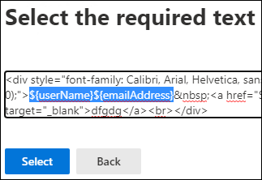

# Erstellen einer benutzerdefinierten Nutzlast für Angriffssimulationsschulungen

Microsoft bietet einen robusten Nutzlastkatalog für verschiedene Social -Engineering-Techniken, die Sie mit Ihrem Training zur Angriffssimulation koppeln können. Möglicherweise möchten Sie jedoch benutzerdefinierte Nutzlasten erstellen, die für Ihre Organisation besser funktionieren. In diesem Artikel wird beschrieben, wie Sie eine Nutzlast in attack simulation training in Microsoft Defender for Office 365.

Sie können eine Nutzlast erstellen, indem Sie auf der Registerkarte Dedizierte Nutzlasten oder im Assistenten zum Erstellen der Simulation auf Nutzlast [erstellen klicken.](attack-simulation-training.md#selecting-a-payload)  

Im ersten Schritt des Assistenten müssen Sie einen Nutzlasttyp auswählen. **Derzeit ist nur E-Mail verfügbar.**

Wählen Sie als Nächstes eine zugeordnete Technik aus. Weitere Informationen zu Techniken finden Sie unter [Selecting a social engineering technique](attack-simulation-training.md#selecting-a-social-engineering-technique).

Nennen Sie im nächsten Schritt Die Nutzlast. Optional können Sie ihm eine Beschreibung geben.

## Konfigurieren der Nutzlast

Jetzt ist es an der Zeit, Ihre Nutzlast zu erstellen. Geben Sie den Namen des Absenders, die E-Mail-Adresse und den Betreff der E-Mail im Abschnitt **Absenderdetails** ein. Wählen Sie eine Phishing-URL aus der bereitgestellten Liste aus. Diese URL wird später in den Nachrichtentext eingebettet.

> [!TIP]
> Sie können eine interne E-Mail für den Absender Ihrer Nutzlast auswählen, wodurch die Nutzlast als von einem anderen Mitarbeiter des Unternehmens stammt. Dies erhöht die Anfälligkeit für die Nutzlast und hilft, Mitarbeiter über das Risiko interner Bedrohungen aufzuklären.

Zum Erstellen Ihrer Nutzlast steht ein Rich-Text-Editor zur Verfügung. Sie können auch eine E-Mail importieren, die Sie zuvor erstellt haben. Wenn Sie den Textkörper der E-Mail erstellen, nutzen Sie die dynamischen Tags, um die E-Mail an Ihre Ziele zu personalisieren.  Klicken **Sie auf Phishinglink,** um die zuvor ausgewählte Phishing-URL dem Nachrichtentext hinzuzufügen.

> [!TIP]
> Um Zeit zu sparen, aktivieren Sie die Option, um alle Links in der E-Mail-Nachricht durch **den Phishinglink zu ersetzen.**

Nachdem Sie die Nutzlast nach Ihren Wünschen erstellen, klicken Sie auf **Weiter**.

## Hinzufügen von Indikatoren

Mithilfe von Indikatoren können Mitarbeiter, die die Angriffssimulation durch führen, den Hinweis verstehen, nach dem sie bei zukünftigen Angriffen suchen können. Klicken Sie zu Beginn auf **Indikator hinzufügen.**

Wählen Sie in der Dropdownliste einen Indikator aus, den Sie verwenden möchten. Diese Liste ist so gehärtet, dass sie die häufigsten Hinweise enthält, die in Phishing-E-Mail-Nachrichten angezeigt werden. Stellen Sie nach der Auswahl sicher, dass die Anzeigeplatzierung auf **Vom Textkörper** der E-Mail festgelegt ist, und klicken Sie auf **Text auswählen.** Markieren Sie den Teil Ihrer Nutzlast, in dem dieser Indikator angezeigt wird, und klicken Sie auf **Auswählen**.

Fügen Sie eine benutzerdefinierte Beschreibung hinzu, um den Indikator zu beschreiben, und klicken Sie im Vorschaurahmen des Indikators, um eine Vorschau des Indikators anzuzeigen. Klicken Sie nach getaner Arbeit auf **Hinzufügen**. Wiederholen Sie diese Schritte, bis Sie alle Indikatoren in Ihrer Nutzlast behandelt haben.

## Überprüfen der Nutzlast

Sie sind damit fertig, Ihre Nutzlast zu erstellen. Jetzt ist es an der Zeit, die Details zu überprüfen und eine Vorschau ihrer Nutzlast anzuzeigen. Die Vorschau enthält alle von Ihnen erstellten Indikatoren. In diesem Schritt können Sie jeden Teil der Nutzlast bearbeiten. Sobald Sie zufrieden sind, können Sie **Ihre** Nutzlast übermitteln.

> [!IMPORTANT]
> Nutzlasten, die Sie erstellt haben, haben **Mandanten** als Quelle. Stellen Sie beim Auswählen von Nutzlasten sicher, dass Sie Mandanten nicht **herausfiltern.**

## Verwandte Links

[Erste Schritte mit dem Angriffssimulationstraining](attack-simulation-training-get-started.md)

[Erstellen einer Phishingangriffssimulation](attack-simulation-training.md)

[Gewinnen Sie Erkenntnisse durch Angriffssimulationsschulungen](attack-simulation-training-insights.md)
