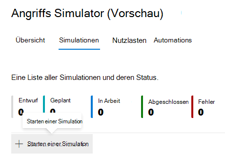
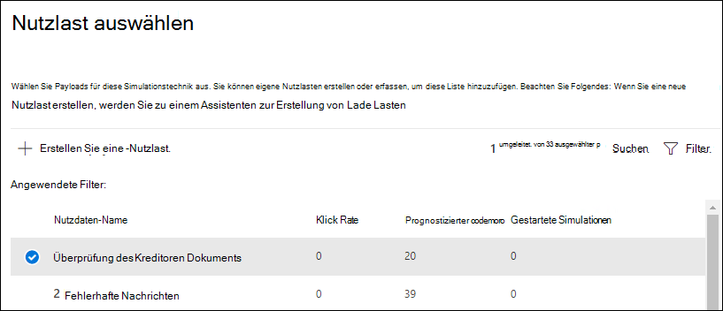
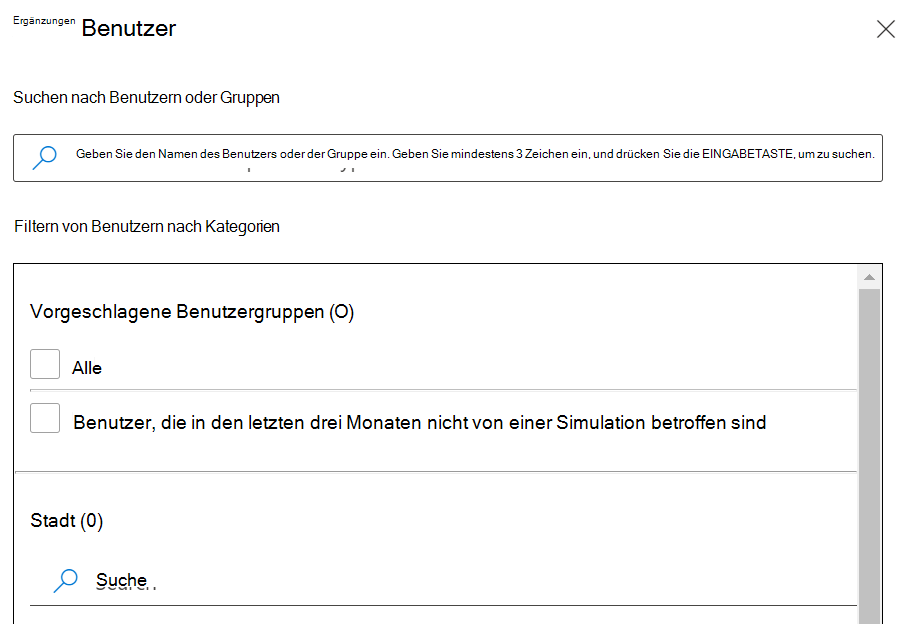
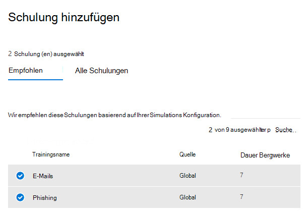

# Simulieren eines Phishingangriffs

Mit dem Training zur Angriffssimulation in Microsoft Defender für Office 365 können Sie gutartige Cyberangriffssimulationen in Ihrer Organisation ausführen, um Ihre Sicherheitsrichtlinien und -praktiken zu testen und Ihre Mitarbeiter zu schulen, um ihr Bewusstsein zu erhöhen und ihre Anfälligkeit für Angriffe zu verringern. Dieser Artikel führt Sie durch die Erstellung eines simulierten Phishingangriffs mithilfe von Angriffssimulationsschulungen.

[!INCLUDE [Prerelease information](../includes/prerelease.md)]

Um einen simulierten Phishingangriff zu starten, öffnen Sie das [Microsoft 365 Security Center,](https://security.microsoft.com/)wechseln Sie zu **"E-Mail &** Zusammenarbeit – \> **Angriffssimulationstraining",** und wechseln Sie zur Registerkarte [**"Simulationen".**](https://security.microsoft.com/attacksimulator?viewid=simulations)

Wählen **Sie unter Simulationen** **+ Starten sie eine Simulation aus.**

> [!NOTE]
> Zu jedem Zeitpunkt während der Simulationserstellung können Sie speichern und sich nähern, um die Konfiguration der Simulation zu einem späteren Zeitpunkt fortzufahren.

## Auswählen einer Social -Engineering-Technik

Wählen Sie aus vier verschiedenen Techniken aus, die aus dem [MITRE ATT&CK® werden.](https://attack.mitre.org/techniques/enterprise/) Für unterschiedliche Techniken stehen unterschiedliche Nutzlasten zur Verfügung:

- **Die Erfassung von** Anmeldeinformationen versucht, Anmeldeinformationen zu sammeln, indem Benutzer zu einer bekannten Website mit Eingabefeldern zum Übermitteln eines Benutzernamens und Kennworts aufgefordert werden.
- **Eine Anlage mit** Schadsoftware fügt einer Nachricht eine bösartige Anlage hinzu. Wenn der Benutzer die Anlage öffnet, wird beliebiger Code ausgeführt, der dem Angreifer dabei hilft, das Gerät des Ziels zu greife.
- **Der Link in der Anlage** ist ein Hybridtyp für die Anmeldeinformationsernte. Ein Angreifer fügt eine URL in eine E-Mail-Anlage ein. Die URL in der Anlage folgt demselben Verfahren wie die Anmeldeinformationsernte.
- **Bei einem Link zu Schadsoftware** wird beliebiger Code aus einer Datei ausgeführt, die auf einem bekannten Dateifreigabedienst gehostet wird. Die an den Benutzer gesendete Nachricht enthält einen Link zu dieser schädlichen Datei. Öffnen sie die Datei, und helfen Sie dem Angreifer, das Gerät des Ziels zu greife.

> [!TIP]
> Wenn Sie in **der Beschreibung der** einzelnen Techniken auf Details anzeigen klicken, werden weitere Informationen und die Simulationsschritte für die Technik angezeigt.
>
> 

Nachdem Sie das Verfahren ausgewählt und auf **"Weiter"** geklickt haben, geben Sie ihrer Simulation einen Namen und optional eine Beschreibung.

## Auswählen einer Nutzlast

Als Nächstes müssen Sie entweder eine Nutzlast aus dem bereits vorhandenen Nutzlastkatalog auswählen.

Nutzlasten verfügen über eine Reihe von Datenpunkten, die Ihnen bei der Auswahl helfen:

- **Die Klickrate** zählt, wie viele Personen auf diese Nutzlast geklickt haben.
- **Die vorhergesagte** Kompromissrate prognostizieren den Prozentsatz der Personen, die von dieser Nutzlast basierend auf historischen Daten für die Nutzlast von Microsoft Defender für Office 365-Kunden gefährdet werden.
- **Bei gestarteten Simulationen** wird ermittelt, wie oft diese Nutzlast in anderen Simulationen verwendet wurde.
- **Die** Komplexität , die über **Filter** verfügbar ist, wird basierend auf der Anzahl der Indikatoren innerhalb der Nutzlast berechnet, die darauf hinweisen, dass es sich um einen Angriff handelt. Mehr Indikatoren führen zu einer geringeren Komplexität.
- **Source**, available through **filters**, indicates whether the payload was created on your tenant or is a part of Microsoft's pre-existing payload catalog (global).

Wählen Sie eine Nutzlast aus der Liste aus, um eine Vorschau der Nutzlast mit zusätzlichen Informationen dazu anzuzeigen.

Wenn Sie Ihre eigene Nutzlast erstellen möchten, lesen Sie die Informationen zum Erstellen einer Nutzlast [für das Training zur Angriffssimulation.](attack-simulation-training-payloads.md)

## Zielgruppenadressierung

Jetzt ist es an der Zeit, die Zielgruppe dieser Simulation auszuwählen. Sie können festlegen, **dass alle Benutzer in Ihrer** Organisation oder nur bestimmte Benutzer und Gruppen enthalten **sind.**

Wenn Sie festlegen, **dass nur bestimmte Benutzer und Gruppen enthalten sind,** haben Sie folgende Möglichkeit:

- **Fügen Sie** Benutzer hinzu, mit denen Sie die Suche nach Ihrem Mandanten sowie erweiterte Such- und Filterfunktionen nutzen können, z. B. für Benutzer, die in den letzten drei Monaten nicht zielgerichtet auf eine Simulation ausgerichtet wurden.
  
- **Mit dem Import** aus csv können Sie eine vordefinierte Gruppe von Benutzern für diese Simulation importieren.

## Zuweisen von Schulungen

Es wird empfohlen, dass Sie für jede Simulation Schulungen zuweisen, da Mitarbeiter, die Schulungen durchgehen, weniger anfällig für ähnliche Angriffe sind.

Sie können entweder eine Schulung für Sie zugewiesen haben oder selbst Schulungskurse und Module auswählen.

Wählen Sie das **Fälligkeitsdatum der Schulung** aus, um sicherzustellen, dass die Mitarbeiter ihre Schulung rechtzeitig beenden.

> [!NOTE]
> Wenn Sie kurse und Module selbst auswählen, können Sie weiterhin die empfohlenen Inhalte sowie alle verfügbaren Kurse und Module anzeigen.
>
> 

In den nächsten Schritten müssen  Sie Schulungen hinzufügen, wenn Sie sich dafür entschieden haben, sie selbst auszuwählen, und Ihre Angebotsseite für Schulungen anpassen. Sie können eine Vorschau der Angebotsseite für Schulungen anzeigen und den Header und textkörper ändern.

## Startdetails und Überprüfung

Nachdem nun alles konfiguriert ist, können Sie diese Simulation sofort starten oder für einen späteren Termin planen. Sie müssen auch auswählen, wann diese Simulation beendet werden soll. Wir beenden die Erfassung von Interaktionen mit dieser Simulation nach dem ausgewählten Zeitpunkt.

**Aktivieren Sie die Regionen-bezogene Zeitzonenzustellung,** um ihren Mitarbeitern während der Arbeitszeiten basierend auf ihrer Region simulierte Angriffsnachrichten zu senden.

Wenn Sie fertig sind, klicken Sie auf **"Weiter",** und überprüfen Sie die Details ihrer Simulation. Klicken Sie **auf "Bearbeiten"** auf einen der Teile, um zurück zu gehen und alle Details zu ändern, die geändert werden müssen. Klicken Sie anschließend auf **"Absenden".**
