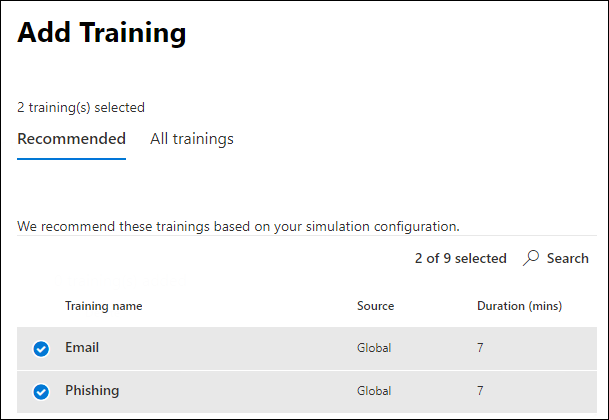

# Simulieren eines PhishingangriffsSimulate a phishing attack

**Gilt** [für Microsoft Defender für Office 365 Plan 2](defender-for-office-365.md)**Applies to** [Microsoft Defender for Office 365 plan 2](defender-for-office-365.md)

Mit der Angriffssimulationsschulung in Microsoft Defender für Office 365 können Sie gutartig Cyberangriffssimulationen in Ihrer Organisation ausführen, um Ihre Sicherheitsrichtlinien und -praktiken zu testen, sowie Ihre Mitarbeiter schulen, um ihr Bewusstsein zu erhöhen und ihre Anfälligkeit für Angriffe zu verringern.Attack simulation training in Microsoft Defender for Office 365 lets you run benign cyberattack simulations on your organization to test your security policies and practices, as well as train your employees to increase their awareness and decrease their susceptibility to attacks. Dieser Artikel führt Sie durch die Erstellung eines simulierten Phishingangriffs mithilfe von Angriffssimulationsschulungen.This article walks you through creating  a simulated phishing attack using attack simulation training.

Informationen zu den ersten Schritten zum Angriffssimulationstraining finden Sie unter ["Erste Schritte mit dem Angriffssimulationstraining".](attack-simulation-training-get-started.md)For getting started information about Attack simulation training, see [Get started using Attack simulation training](attack-simulation-training-get-started.md).

Um einen simulierten Phishingangriff zu starten, öffnen Sie das Microsoft 365 Defender-Portal ( <https://security.microsoft.com/> ), wechseln Sie zu **E-Mail &** \> **Angriffssimulationstraining** für die Zusammenarbeit, und wechseln Sie zur Registerkarte **["Simulationen".](https://security.microsoft.com/attacksimulator?viewid=simulations)**To launch a simulated phishing attack, open the Microsoft 365 Defender portal (<https://security.microsoft.com/>), go to **Email & collaboration** \> **Attack simulation training**, and switch to the **[Simulations](https://security.microsoft.com/attacksimulator?viewid=simulations)** tab.

Wählen Sie unter **"Simulationen"** die Option **+Simulation starten** aus.Under **Simulations**, select **+ Launch a simulation**.

> [!NOTE]
> Zu jedem Zeitpunkt während der Simulationserstellung können Sie speichern und die Konfiguration der Simulation zu einem späteren Zeitpunkt fortsetzen.At any point during simulation creation, you can save and close to continue configuring the simulation at a later time.

## Auswählen eines Social Engineering-VerfahrensSelecting a social engineering technique

Wählen Sie aus vier verschiedenen Techniken aus, die aus dem [MITRE ATT&CK® Framework](https://attack.mitre.org/techniques/enterprise/)zusammengestellt wurden.Select from 4 different techniques, curated from the [MITRE ATT&CK® framework](https://attack.mitre.org/techniques/enterprise/). Für unterschiedliche Techniken stehen unterschiedliche Nutzlasten zur Verfügung:Different payloads are available for different techniques:

- Die Erfassung von **Anmeldeinformationen** versucht, Anmeldeinformationen zu sammeln, indem Benutzer zu einer bekannten Website mit Eingabefeldern weitergeleitet werden, um einen Benutzernamen und ein Kennwort zu übermitteln.**Credential harvest** attempts to collect credentials by taking users to a well-known looking website with input boxes to submit a username and password.
- **Eine Antischadsoftwareanlage** fügt einer Nachricht eine schädliche Anlage hinzu.**Malware attachment** adds a malicious attachment to a message. Wenn der Benutzer die Anlage öffnet, wird beliebiger Code ausgeführt, der dem Angreifer hilft, das Zielgerät zu kompromittieren.When the user opens the attachment, arbitrary code is run that will help the attacker compromise the target's device.
- **Der Link in der Anlage** ist eine Art von Hybridlösung für die Nutzung von Anmeldeinformationen.**Link in attachment** is a type of credential harvest hybrid. Ein Angreifer fügt eine URL in eine E-Mail-Anlage ein.An attacker inserts a URL into an email attachment. Die URL in der Anlage folgt derselben Technik wie die Anmeldeinformationsernte.The URL within the attachment follows the same technique as credential harvest.
- **Links zu Schadsoftware** führen beliebigen Code aus einer Datei aus, die in einem bekannten Dateifreigabedienst gehostet wird.**Link to malware** will run some arbitrary code from a file hosted on a well-known file sharing service. Die an den Benutzer gesendete Nachricht enthält einen Link zu dieser schädlichen Datei.The message sent to the user will contain a link to this malicious file. Öffnen Sie die Datei, und helfen Sie dem Angreifer, das Zielgerät zu kompromittiv zu gestalten.Opening the file and help the attacker compromise the target's device.
- **Drive-by-URL** ist der Ort, an dem die schädliche URL in der Nachricht den Benutzer zu einer vertraut aussehenden Website führt, die automatisch Code auf dem Gerät des Benutzers ausführt und/oder installiert.**Drive-by URL** is where the malicious URL in the message takes the user to a familiar-looking website that silently runs and/or installs code code on the user's device.

> [!TIP]
> Wenn Sie in der Beschreibung der einzelnen Techniken auf **"Details anzeigen"** klicken, werden weitere Informationen und die Simulationsschritte für die Technik angezeigt.Clicking on **View details** within the description of each technique will display further information and the simulation steps for the technique.
>
> 

Nachdem Sie die Technik ausgewählt und auf **"Weiter"** geklickt haben, geben Sie Ihrer Simulation einen Namen und optional eine Beschreibung.After you've selected the technique and clicked on **Next**, give your simulation a name and optionally a description.

## Auswählen einer NutzlastSelecting a payload

Als Nächstes müssen Sie entweder eine Nutzlast aus dem bereits vorhandenen Nutzlastkatalog auswählen.Next, you'll need to either select a payload from the pre-existing payload catalog.

Nutzlasten haben eine Reihe von Datenpunkten, die Ihnen bei der Auswahl helfen:Payloads have a number of data points to help you choose:

- **Die Klickrate** zählt, wie viele Personen auf diese Nutzlast geklickt haben.**Click rate** counts how many people clicked this payload.
- **Die prognostizierte Kompromittierungsrate** prognostiziert den Prozentsatz der Personen, die durch diese Nutzlast kompromittiert werden, basierend auf verlaufsbasierten Daten für die Nutzlast in Microsoft Defender für Office 365 Kunden.**Predicted compromise rate** predicts the percentage of people that will get compromised by this payload based on historical data for the payload across Microsoft Defender for Office 365 customers.
- **Gestartete Simulationen** zählen, wie oft diese Nutzlast in anderen Simulationen verwendet wurde.**Simulations launched** counts the number of times this payload was used in other simulations.
- **Die Komplexität,** die über **Filter** verfügbar ist, wird basierend auf der Anzahl der Indikatoren innerhalb der Nutzlast berechnet, die darauf hinweisen, dass es sich um einen Angriff handelt.**Complexity**, available through **filters**, is calculated based on the number of indicators within the payload that clue targets in on it being an attack. Mehr Indikatoren führen zu einer geringeren Komplexität.More indicators lead to lower complexity.
- **Quelle,** die über **Filter** verfügbar ist, gibt an, ob die Nutzlast auf Ihrem Mandanten erstellt wurde oder Teil des bereits vorhandenen Nutzlastkatalogs (global) von Microsoft ist.**Source**, available through **filters**, indicates whether the payload was created on your tenant or is a part of Microsoft's pre-existing payload catalog (global).

Wählen Sie eine Nutzlast aus der Liste aus, um eine Vorschau der Nutzlast mit zusätzlichen Informationen zu sehen.Select a payload from the list to see a preview of the payload with additional information about it.

Wenn Sie Ihre eigene Nutzlast erstellen möchten, lesen Sie ["Erstellen einer Nutzlast für Angriffssimulationsschulungen".](attack-simulation-training-payloads.md)If you'd like to create your own payload, read [create a payload for attack simulation training](attack-simulation-training-payloads.md).

## ZielgruppenadressierungAudience targeting

Jetzt ist es an der Zeit, die Zielgruppe dieser Simulation auszuwählen.Now it's time to select this simulation's audience. Sie können **alle Benutzer in Ihrer Organisation oder** nur bestimmte Benutzer und Gruppen **einschließen.**You can choose to **include all users in your organization** or **include only specific users and groups**.

Wenn Sie sich dafür entscheiden, **nur bestimmte Benutzer und Gruppen einzuschließen,** können Sie die folgenden Aktionen ausführen:When you choose to **include only specific users and groups** you can either:

- **Fügen Sie Benutzer hinzu,** mit denen Sie die Suche nach Ihrem Mandanten sowie erweiterte Such- und Filterfunktionen nutzen können, z. B. für Benutzer, die in den letzten 3 Monaten nicht für eine Simulation vorgesehen waren.**Add users**, which allows you to leverage search for your tenant, as well as advanced search and filtering capabilities, like targeting users who haven't been targeted by a simulation in the last 3 months.

  

- **Mit dem Import aus CSV** können Sie eine vordefinierte Gruppe von Benutzern für diese Simulation importieren.**Import from CSV** allows you to import a predefined set of users for this simulation.

## Zuweisen von SchulungenAssigning training

Es wird empfohlen, für jede Simulation Schulungen zuzuweisen, da Mitarbeiter, die eine Schulung durchlaufen, weniger anfällig für ähnliche Angriffe sind.We recommend that you assign training for each simulation, as employees who go through training are less susceptible to similar attacks.

Sie können entweder auswählen, ob Ihnen Schulungen zugewiesen wurden, oder selbst Schulungskurse und Module auswählen.You can either choose to have training assigned for you or select training courses and modules yourself.

Wählen Sie das **Fälligkeitsdatum** der Schulung aus, um sicherzustellen, dass die Mitarbeiter ihre Schulung zeitnah abschließen.Select the **training due date** to make sure employees finish their training in a timely manner.

> [!NOTE]
> Wenn Sie selbst Kurse und Module auswählen möchten, können Sie weiterhin die empfohlenen Inhalte sowie alle verfügbaren Kurse und Module anzeigen.If you choose to select courses and modules yourself, you'll still be able to see the recommended content as well as all available courses and modules.
>
> 

In den nächsten Schritten müssen Sie **Schulungen hinzufügen,** wenn Sie sich dafür entschieden haben, sie selbst auszuwählen, und Ihre Schulungszielseite anpassen.In the next steps you'll need to **Add trainings** if you opted to select it yourself, and customize your training landing page. Sie können eine Vorschau der Schulungszielseite anzeigen und die Kopfzeile und den Textkörper ändern.You'll be able to preview the training landing page, as well as change the header and body of it.

## Details zum Starten und ÜberprüfenLaunch details and review

Nachdem alles konfiguriert ist, können Sie diese Simulation sofort starten oder für einen späteren Zeitpunkt planen.Now that everything is configured, you can launch this simulation immediately or schedule it for a later date. Sie müssen auch auswählen, wann diese Simulation beendet werden soll.You will also need to choose when to end this simulation. Wir werden die Aufzeichnung der Interaktion mit dieser Simulation nach der ausgewählten Zeit beenden.We will stop capturing interaction with this simulation past the selected time.

Aktivieren Sie die **Region unterstützende Zeitzonenzustellung,** um simulierte Angriffsmeldungen an Ihre Mitarbeiter während ihrer Arbeitszeiten basierend auf ihrer Region zu übermitteln.**Enable region aware timezone delivery** to deliver simulated attack messages to your employees during their working hours based on their region.

Wenn Sie fertig sind, klicken Sie auf **"Weiter",** und überprüfen Sie die Details Ihrer Simulation.Once you're done, click on **Next** and review the details of your simulation. Klicken Sie auf **"Bearbeiten"** auf einen der Teile, um zurückzugehen und alle Details zu ändern, die geändert werden müssen.Click on **Edit** on any of the parts to go back and change any details that need changing. Nachdem Sie fertig sind, klicken Sie auf **"Absenden".**Once done, click **Submit**.
