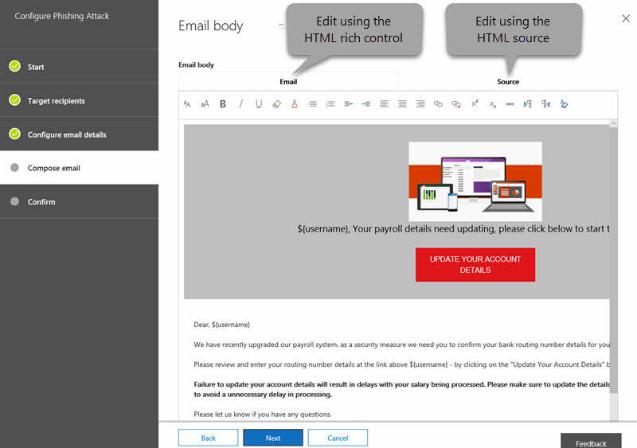

# Angriffssimulator in Microsoft Defender für Office 365

[!INCLUDE [Microsoft 365 Defender rebranding](../includes/microsoft-defender-for-office.md)]

**Gilt für** [Microsoft Defender für Office 365 Plan 2](office-365-atp.md)

Wenn Ihre Organisation über Microsoft Defender für Office 365 Plan 2 verfügt, der Funktionen zur Untersuchung und Reaktion auf Bedrohungen [umfasst,](office-365-ti.md)können Sie den Angriffssimulator im Security & Compliance Center verwenden, um realistische Angriffsszenarien in Ihrer Organisation ausführen zu können. Diese simulierten Angriffe können Ihnen helfen, anfällige Benutzer zu identifizieren und zu finden, bevor sich ein tatsächlicher Angriff auf Ihr Endergebnis aus wirkt. Weitere Informationen finden Sie in diesem Artikel.

> [!NOTE]
>
> Der Angriffssimulator wie in diesem Artikel beschrieben  ist jetzt schreibgeschützt und wurde durch Angriffssimulationsschulungen im Knoten **E-Mail & Zusammenarbeit** im [Microsoft 365 Security Center ersetzt.](https://security.microsoft.com) Weitere Informationen finden Sie unter [Erste Schritte mit attack simulation training](attack-simulation-training-get-started.md).
>
> Die Möglichkeit, neue Simulationen aus dieser Version des Angriffssimulators zu starten, wurde deaktiviert. Sie können jedoch ab dem 24. Januar 2021 bis zu 90 Tage lang auf Berichte zugreifen.

## Was sollten Sie wissen, bevor Sie beginnen?

- Zum Öffnen des Security & Compliance Centers wechseln Sie zu <https://protection.office.com/>. Der Angriffssimulator ist unter **Threat Management** \> **Attack simulator verfügbar.** Wechseln Sie direkt zum Angriffssimulator, öffnen Sie <https://protection.office.com/attacksimulator> .

- Weitere Informationen zur Verfügbarkeit von Attack Simulator für verschiedene Microsoft 365-Abonnements finden Sie unter [Microsoft Defender for Office 365 service description](https://docs.microsoft.com/office365/servicedescriptions/office-365-advanced-threat-protection-service-description).

- Sie müssen Mitglied der Rollengruppen **Organisationsverwaltung** oder **Sicherheitsadministrator** sein. Weitere Informationen zu Rollengruppen im Security & Compliance Center finden Sie unter [Berechtigungen im Security & Compliance Center](permissions-in-the-security-and-compliance-center.md).

- Ihr Konto muss für die mehrstufige Authentifizierung (Multi-Factor Authentication, MFA) konfiguriert werden, um Kampagnen im Angriffssimulator zu erstellen und zu verwalten. Anweisungen finden Sie unter [Einrichten der mehrstufigen Authentifizierung](../../admin/security-and-compliance/set-up-multi-factor-authentication.md).

- Der Angriffssimulator funktioniert nur für cloudbasierte Postfächer.

- Phishingkampagnen sammeln und verarbeiten Ereignisse für 30 Tage. Verlaufskampagnendaten sind bis zu 90 Tage nach dem Starten der Kampagne verfügbar.

- Angriffssimulations- und Schulungsdaten werden mit anderen Kundendaten für Microsoft 365-Dienste gespeichert. Weitere Informationen finden Sie unter [Microsoft 365 Data Locations](/microsoft-365/enterprise/o365-data-locations).

- Es gibt keine entsprechenden PowerShell-Cmdlets für Den Angriffssimulator.

## Phishingkampagnen für Speerer

*Phishing* ist ein allgemeiner Begriff für E-Mail-Angriffe, die versuchen, vertrauliche Informationen in Nachrichten zu stehlen, die von legitimen oder vertrauenswürdigen Absendern zu sein scheinen. *Bei Dem Phishing* handelt es sich um einen gezielten Phishingangriff, bei dem fokussierte und angepasste Inhalte verwendet werden, die speziell auf die Zielempfänger zugeschnitten sind (in der Regel nach der Aufklärung der Empfänger durch den Angreifer).

Im Angriffssimulator stehen zwei verschiedene Arten von Speerphishingkampagnen zur Verfügung:

- **Spear phishing (credentials harvest)**: The attack tries to convince the recipients to click a URL in the message. Wenn sie auf den Link klicken, werden sie aufgefordert, ihre Anmeldeinformationen ein eingeben. In diesem Beispiel werden sie an einen der folgenden Speicherorte übernommen:

  - Eine Standardseite, auf der erklärt wird, dass dies nur ein Test war, und gibt Tipps zum Erkennen von Phishingnachrichten.

    

  - Eine benutzerdefinierte Seite (URL), die Sie angeben.

- **Speerphishing (Anlage)**: Der Angriff versucht, die Empfänger davon zu überzeugen, eine .docx- oder .pdf-Anlage in der Nachricht zu öffnen. Die Anlage enthält den gleichen Inhalt aus dem Standardmäßigen Phishinglink, aber der erste Satz beginnt mit " , Sie sehen diese Nachricht als kürzlich geöffnete \<Display Name\> E-Mail-Nachricht...".

> [!NOTE]
> Derzeit laufen Speerphishingkampagnen im Angriffssimulator nicht ab.

### Erstellen einer Speerphishingkampagne

Ein wichtiger Bestandteil jeder Speerphishingkampagne ist das Aussehen und Gefühl der E-Mail-Nachricht, die an die Zielempfänger gesendet wird. Zum Erstellen und Konfigurieren der E-Mail-Nachricht stehen Ihnen die folgenden Optionen zur Verfügung:

- **Verwenden Sie eine integrierte E-Mail-Vorlage:** Zwei integrierte Vorlagen sind verfügbar: Preiszusend und **Gehaltsabrechnungsupdate**.  Sie können einige, alle oder keine der E-Mail-Eigenschaften aus der Vorlage weiter anpassen, wenn Sie die Kampagne erstellen und starten.

- **Erstellen einer wiederverwendbaren** E-Mail-Vorlage: Nachdem Sie die E-Mail-Vorlage erstellt und gespeichert haben, können Sie sie in zukünftigen Phishingkampagnen erneut verwenden. Sie können einige, alle oder keine der E-Mail-Eigenschaften aus der Vorlage weiter anpassen, wenn Sie die Kampagne erstellen und starten.

- **Erstellen Sie die E-Mail-Nachricht** im Assistenten: Sie können die E-Mail-Nachricht direkt im Assistenten erstellen, während Sie die Speerphishingkampagne erstellen und starten.

#### Schritt 1 (Optional): Erstellen einer benutzerdefinierten E-Mail-Vorlage

Wenn Sie eine der integrierten Vorlagen verwenden oder die E-Mail-Nachricht direkt im Assistenten erstellen möchten, können Sie diesen Schritt überspringen.

1. Wechseln Sie im Security & Compliance Center zu **Angriffssimulator für die Bedrohungsverwaltung.** \> 

2. Klicken Sie **auf der Seite** Angriffe simulieren in den Abschnitten Spear Phishing **(Credentials Harvest)** oder **Spear Phishing (Attachment)** auf **Angriffsdetails**.

   Es spielt keine Rolle, wo Sie die Vorlage erstellen. Die verfügbaren Optionen in der Vorlage sind für beide Arten von Phishingangriffen identisch.

3. Klicken Sie auf der Seite **Angriffsdetails,** die  geöffnet wird, im Abschnitt **Phishingvorlagen** im Bereich Vorlagen erstellen auf **Neue Vorlage**.

4. Der **Assistent zum** Konfigurieren von Phishingvorlagen wird in einem neuen Flyout gestartet. Geben Sie **im Schritt Start** einen eindeutigen Anzeigenamen für die Vorlage ein, und klicken Sie dann auf **Weiter**.

5. Konfigurieren Sie **im Schritt** Konfigurieren von E-Mail-Details die folgenden Einstellungen:

   - **From (Name)**: Der Anzeigename, der für den Nachrichtensender verwendet wird.

   - **From (Email)**: Die E-Mail-Adresse des Absenders.

   - **Phishing-Anmeldeserver-URL:** Klicken Sie auf die Dropdownliste, und wählen Sie eine der verfügbaren URLs aus der Liste aus. Dies ist die URL, auf die Benutzer versucht sind zu klicken. Sie können wie folgt vorgehen:

     - <http://portal.docdeliveryapp.com>
     - <http://portal.docdeliveryapp.net>
     - <http://portal.docstoreinternal.com>
     - <http://portal.docstoreinternal.net>
     - <http://portal.hardwarecheck.net>
     - <http://portal.hrsupportint.com>
     - <http://portal.payrolltooling.com>
     - <http://portal.payrolltooling.net>
     - <http://portal.prizegiveaway.net>
     - <http://portal.prizesforall.com>
     - <http://portal.salarytoolint.com>
     - <http://portal.salarytoolint.net>

     > [!NOTE]
     >
     > Ein URL-Reputationsdienst identifiziert eine oder mehrere dieser URLs möglicherweise als unsicher. Überprüfen Sie die Verfügbarkeit der URL in Ihren unterstützten Webbrowsern, bevor Sie die URL in einer Phishingkampagne verwenden.

   - **Url der benutzerdefinierten** Zielseite: Geben Sie eine optionale Zielseite ein, auf der Benutzer aufgenommen werden, wenn sie auf den Phishinglink klicken und ihre Anmeldeinformationen eingeben. Dieser Link ersetzt die Standardlandeseite. Wenn Sie beispielsweise über ein internes Sensibilisierungstraining verfügen, können Sie diese URL hier angeben.

   - **Kategorie**: Derzeit wird diese Einstellung nicht verwendet (alles, was Sie eingeben, wird ignoriert).

   - **Betreff**: Das **Betrefffeld** der E-Mail-Nachricht.

   Klicken Sie nach Abschluss des Vorgangs auf **Weiter**.

6. Erstellen Sie **im Schritt** E-Mail verfassen den Nachrichtentext der E-Mail-Nachricht. Sie können die Registerkarte **E-Mail** (ein Rich-HTML-Editor) oder die **Registerkarte Quelle** (html-Rohcode) verwenden.

   Die HTML-Formatierung kann so einfach oder komplex sein, wie Sie es benötigen. Sie können Bilder und Text einfügen, um die Glaubhaftigkeit der Nachricht im E-Mail-Client des Empfängers zu verbessern.

   - `${username}` fügt den Namen des Empfängers ein.

   - `${loginserverurl}` fügt den **Wert der Phishing-Anmeldeserver-URL** aus dem vorherigen Schritt ein.

   Klicken Sie nach Abschluss des Vorgangs auf **Weiter**.

7. Klicken Sie **im Schritt** Bestätigen auf **Fertig stellen**.

#### Schritt 2: Erstellen und Starten der Speerphishingkampagne

1. Wechseln Sie im Security & Compliance Center zu **Angriffssimulator für die Bedrohungsverwaltung.** \> 

2. Treffen Sie **auf** der Seite Angriffe simulieren eine der folgenden Auswahlen basierend auf dem Typ der Kampagne, die Sie erstellen möchten:

   - Klicken Sie **im Abschnitt Spear Phishing (Credentials Harvest)** auf Angriff **starten** oder **Angriffsdetails** \> **Starten Angriff**.

   - Klicken Sie **im Abschnitt Speerphishing (Anlage)** auf **Angriff starten** oder **Angriffsdetails** \> **Starten Angriff**.

3. Der **Assistent zum Konfigurieren von Phishingangriffen** wird in einem neuen Flyout gestartet. Gehen Sie **im Schritt** Start wie folgt vor:

   - Geben Sie **im Feld Name** einen eindeutigen Anzeigenamen für die Kampagne ein. Klicken Sie nicht auf **Vorlage verwenden,** da Sie die E-Mail-Nachricht später im Assistenten erstellen.

   - Klicken **Sie auf Vorlage verwenden,** und wählen Sie eine integrierte oder benutzerdefinierte E-Mail-Vorlage aus. Nachdem Sie die Vorlage ausgewählt haben, wird das **Feld Name** basierend auf der Vorlage automatisch gefüllt, Sie können den Namen jedoch ändern.

   > [!div class="mx-imgBorder"]
   > 

   Klicken Sie nach Abschluss des Vorgangs auf **Weiter**.

4. Gehen Sie **im Schritt** Zielempfänger wie folgt vor:

   - Klicken **Sie auf Adressbuch,** um die Empfänger (Benutzer oder Gruppen) für die Kampagne auszuwählen. Jeder Zielempfänger muss über ein Exchange Online-Postfach verfügen. Wenn Sie auf **Filtern** und **Anwenden** klicken, ohne ein Suchkriterium ein eingeben zu müssen, werden alle Empfänger zurückgegeben und der Kampagne hinzugefügt.

   - Klicken **Sie auf Importieren** und anschließend auf **Dateiimport,** um einen durch Kommas getrennten Wert (CSV) oder eine zeilenge trennte Datei mit E-Mail-Adressen zu importieren. Jede Zeile muss die E-Mail-Adresse des Empfängers enthalten.

   Klicken Sie nach Abschluss des Vorgangs auf **Weiter**.

5. Konfigurieren Sie **im Schritt** Konfigurieren von E-Mail-Details die folgenden Einstellungen:

   Wenn Sie im Schritt **Start** eine Vorlage ausgewählt haben, sind die meisten dieser Werte bereits konfiguriert, Sie können sie jedoch ändern.

   - **From (Name)**: Der Anzeigename, der für den Nachrichtensender verwendet wird.

   - **From (Email)**: Die E-Mail-Adresse des Absenders. Sie können eine echte oder gefälschte E-Mail-Adresse aus der E-Mail-Domäne Ihrer Organisation eingeben, oder Sie können eine echte oder gefälschte externe E-Mail-Adresse eingeben. Eine gültige Absender-E-Mail-Adresse aus Ihrer Organisation wird tatsächlich im E-Mail-Client des Empfängers aufgelöst.

   - **Phishing-Anmeldeserver-URL:** Klicken Sie auf die Dropdownliste, und wählen Sie eine der verfügbaren URLs aus der Liste aus. Dies ist die URL, auf die Benutzer versucht sind zu klicken. Sie können wie folgt vorgehen:

     - <http://portal.docdeliveryapp.com>
     - <http://portal.docdeliveryapp.net>
     - <http://portal.docstoreinternal.com>
     - <http://portal.docstoreinternal.net>
     - <http://portal.hardwarecheck.net>
     - <http://portal.hrsupportint.com>
     - <http://portal.payrolltooling.com>
     - <http://portal.payrolltooling.net>
     - <http://portal.prizegiveaway.net>
     - <http://portal.prizesforall.com>
     - <http://portal.salarytoolint.com>
     - <http://portal.salarytoolint.net>

     > [!NOTE]
     >
     > - Alle URLs sind absichtlich http, nicht https.
     >
     > - Ein URL-Reputationsdienst identifiziert eine oder mehrere dieser URLs möglicherweise als unsicher. Überprüfen Sie die Verfügbarkeit der URL in Ihren unterstützten Webbrowsern, bevor Sie die URL in einer Phishingkampagne verwenden.
     >
     > - Sie müssen eine URL auswählen. Bei **Spear Phishing (Attachment)-Kampagnen** können Sie den Link im nächsten Schritt aus dem Nachrichtentext entfernen  (andernfalls enthält die Nachricht sowohl einen Link als auch eine Anlage).

   - **Anlagentyp**: Diese Einstellung ist nur in **Spear Phishing (Attachment)-Kampagnen** verfügbar. Klicken Sie auf die Dropdownliste, und wählen Sie **aus. DOCX** oder **. PDF** aus der Liste.

   - **Anlagenname**: Diese Einstellung ist nur in **Spear Phishing (Attachment)-Kampagnen** verfügbar. Geben Sie einen Dateinamen für die .docx- oder .pdf-Anlage ein.

   - **Url der benutzerdefinierten** Zielseite: Geben Sie eine optionale Zielseite ein, auf der Benutzer aufgenommen werden, wenn sie auf den Phishinglink klicken und ihre Anmeldeinformationen eingeben. Dieser Link ersetzt die Standardlandeseite. Wenn Sie beispielsweise über ein internes Sensibilisierungstraining verfügen, können Sie diese URL hier angeben.

   - **Betreff**: Das **Betrefffeld** der E-Mail-Nachricht.

   Klicken Sie nach Abschluss des Vorgangs auf **Weiter**.

6. Erstellen Sie **im Schritt** E-Mail verfassen den Nachrichtentext der E-Mail-Nachricht. Wenn Sie im Schritt **Start** eine Vorlage ausgewählt haben, ist der Nachrichtentext bereits konfiguriert, Sie können sie jedoch anpassen. Sie können die Registerkarte **E-Mail** (ein Rich-HTML-Editor) oder die **Registerkarte Quelle** (html-Rohcode) verwenden.

   Die HTML-Formatierung kann so einfach oder komplex sein, wie Sie es benötigen. Sie können Bilder und Text einfügen, um die Glaubhaftigkeit der Nachricht im E-Mail-Client des Empfängers zu verbessern.

   - `${username}` fügt den Namen des Empfängers ein.

   - `${loginserverurl}` fügt den **Wert der Phishing-Anmeldeserver-URL** ein.

   Bei **Spear Phishing (Attachment)-Kampagnen** sollten Sie den Link aus dem Nachrichtentext entfernen (andernfalls enthält die Nachricht sowohl einen Link als auch eine Anlage, und Linkklicks werden in einer Anlagenkampagne nicht nachverfolgt). 

   > [!div class="mx-imgBorder"]
   > 

   Klicken Sie nach Abschluss des Vorgangs auf **Weiter**.

7. Klicken Sie **im Schritt Bestätigen** auf Fertig **stellen,** um die Kampagne zu starten. Die Phishingnachricht wird an die Zielempfänger übermittelt.

## Kennwortangriffskampagnen

Ein *Kennwortangriff versucht,* Kennwörter für Benutzerkonten in einer Organisation zu erraten, in der Regel, nachdem der Angreifer ein oder mehrere gültige Benutzerkonten identifiziert hat.

Im Angriffssimulator stehen Ihnen zwei verschiedene Arten von Kennwortangriffskampagnen zur Verfügung, um die Komplexität der Kennwörter Ihrer Benutzer zu testen:

- **Brute Force Password (Wörterbuchangriff):** Ein  *Brute* Force- oder Wörterbuchangriff verwendet eine große Wörterbuchdatei mit Kennwörtern für ein Benutzerkonto mit der Hoffnung, dass eines davon funktioniert (viele Kennwörter für ein Konto). Falsche Kennwortsperrungen helfen, Brute Force-Kennwortangriffe zu verhindern.

  Für den Wörterbuchangriff können Sie ein oder mehrere Kennwörter angeben, die Sie ausprobieren möchten (manuell eingegeben oder in eine hochgeladene Datei), und Sie können einen oder mehrere Benutzer angeben.

- **Kennwort-Spray-Angriff:** Ein *Kennwort-Spray-Angriff* verwendet dasselbe sorgfältig überlegte Kennwort für eine Liste von Benutzerkonten (ein Kennwort für viele Konten). Kennwortschutzangriffe sind schwieriger zu erkennen als Brute-Force-Kennwortangriffe (die Wahrscheinlichkeit eines Erfolgs steigt, wenn ein Angreifer ein Kennwort über Dutzende oder Hunderte von Konten versucht, ohne das Risiko zu riskieren, dass die falsche Kennwortsperre des Benutzers ausreist).

  Für den Kennwort-Spray-Angriff können Sie nur ein Kennwort angeben, das Sie ausprobieren möchten, und Sie können einen oder mehrere Benutzer angeben.

> [!NOTE]
> Die Kennwortangriffe im Angriffssimulator übergeben Benutzernamen und Kennwort Grundlegende Authentifizierungsanforderungen an einen Endpunkt, damit sie auch mit anderen Authentifizierungsmethoden (AD FS, Kennworthashsynchronisierung, Pass-Through, PingFederate usw.) funktionieren. Für Benutzer, für die MFA aktiviert ist, wird der Versuch auch dann, wenn der Kennwortangriff sein **tatsächliches** Kennwort versucht, immer als Fehler registriert (D. h. MFA-Benutzer werden nie in der Anzahl der erfolgreichen Versuche der Kampagne angezeigt). Dies ist das erwartete Ergebnis. MFA ist eine primäre Methode zum Schutz vor Kennwortangriffen.

### Erstellen und Starten einer Kennwortangriffskampagne

1. Wechseln Sie im Security & Compliance Center zu **Angriffssimulator für die Bedrohungsverwaltung.** \> 

2. Treffen Sie **auf** der Seite Angriffe simulieren eine der folgenden Auswahlen basierend auf dem Typ der Kampagne, die Sie erstellen möchten:

   - Klicken Sie **im Abschnitt Brute Force Password (Dictionary Attack)** auf **Angriff starten** oder **Angriffsdetails** \> **Starten Angriff**.

   - Klicken Sie **im Abschnitt Kennwort-Sprayangriff** auf **Angriff starten,** oder klicken Sie auf **Angriffsdetails** \> **Starten Angriff**.

3. Der **Assistent zum Konfigurieren von Kennwortangriffen** wird in einem neuen Flyout gestartet. Geben Sie **im Schritt Start** einen eindeutigen Anzeigenamen für die Kampagne ein, und klicken Sie dann auf **Weiter**.

4. Gehen Sie **im Schritt** Zielbenutzer wie folgt vor:

   - Klicken **Sie auf Adressbuch,** um die Empfänger (Benutzer oder Gruppen) für die Kampagne auszuwählen. Jeder Zielempfänger muss über ein Exchange Online-Postfach verfügen. Wenn Sie auf **Filtern** und **Anwenden** klicken, ohne ein Suchkriterium ein eingeben zu müssen, werden alle Empfänger zurückgegeben und der Kampagne hinzugefügt.

   - Klicken **Sie auf Importieren** und anschließend auf **Dateiimport,** um einen durch Kommas getrennten Wert (CSV) oder eine zeilenge trennte Datei mit E-Mail-Adressen zu importieren. Jede Zeile muss die E-Mail-Adresse des Empfängers enthalten.

   Klicken Sie nach Abschluss des Vorgangs auf **Weiter**.

5. Wählen Sie **im Schritt Angriffseinstellungen** auswählen basierend auf dem Kampagnentyp die schritte aus:

   - **Brute Force Password (Dictionary Attack)**: Gehen Sie wie folgt vor:

     - **Geben Sie Kennwörter manuell** ein: Geben Sie in das Feld **Drücken** Sie die Eingabetaste ein, um ein Kennwort hinzuzufügen, geben Sie ein Kennwort ein, und drücken Sie dann die EINGABETASTE. Wiederholen Sie diesen Schritt so oft wie nötig.

     - **Hochladen von Kennwörtern** aus einer Wörterbuchdatei: Klicken Sie auf **Hochladen,** um eine vorhandene Textdatei zu importieren, die ein Kennwort in jeder Zeile und eine leere letzte Zeile enthält. Die Textdatei muss mindestens 10 MB groß sein und darf nicht mehr als 30.000 Kennwörter enthalten.

   - **Kennwort-Spray-Angriff:** Geben Sie im **Feld Kennwort(en)** ein Kennwort ein.

   Klicken Sie nach Abschluss des Vorgangs auf **Weiter**.

6. Klicken Sie **im Schritt Bestätigen** auf Fertig **stellen,** um die Kampagne zu starten. Die von Ihnen angegebenen Kennwörter werden für Benutzer ausprobiert, die Sie angegeben haben.

## Anzeigen von Kampagnenergebnissen

Nachdem Sie eine Kampagne gestartet haben, können Sie den Fortschritt und die Ergebnisse auf der Hauptseite Simulierte **Angriffe** überprüfen.

Aktive Kampagnen zeigen eine Statusleiste, einen abgeschlossenen Prozentwert und die Anzahl "(abgeschlossene Benutzer) (Gesamtbenutzer)" an. Durch Klicken auf **die Schaltfläche Aktualisieren** wird der Fortschritt aller aktiven Kampagnen aktualisiert. Sie können auch auf **Beenden klicken,** um eine aktive Kampagne zu beenden.

Nach Abschluss der Kampagne wird der Status in **Angriff abgeschlossen geändert.** Sie können die Ergebnisse der Kampagne anzeigen, indem Sie eine der folgenden Aktionen ausführen:

- Klicken Sie auf der **Hauptseite** Angriffe simulieren **unter** dem Namen der Kampagne auf Bericht anzeigen.

- Klicken Sie auf der **Hauptseite** Angriffe simulieren im Abschnitt für den Angriffstyp auf **Angriffsdetails.** Wählen Sie **auf der Seite Angriffsdetails,** die geöffnet wird, die Kampagne im **Abschnitt Angriffsverlauf** aus.

Mit einer der vorherigen Aktionen gelangen Sie zu einer Seite mit dem Namen **Attack details**. Die Informationen, die auf dieser Seite für jeden Kampagnentyp verfügbar sind, werden in den folgenden Abschnitten beschrieben.

### Spear Phishing (Credentials Harvest)-Kampagnenergebnisse

Die folgenden Informationen sind auf der Seite **Angriffsdetails** für jede Kampagne verfügbar:

- Die Dauer (Startdatum/-uhrzeit und Enddatum/-uhrzeit) der Kampagne.

- **Ziel aller Benutzer**

- **Erfolgreiche Versuche:** Die Anzahl der Benutzer,  die auf den Link geklickt und ihre Anmeldeinformationen eingegeben haben *(beliebiger* Benutzername und Kennwortwert).

- **Gesamterfolgsrate:** Ein Prozentsatz, der durch erfolgreiche Versuche berechnet wird  /  **Gesamtbenutzer gezielt**.

- **Schnellster Klick**: Wie lange es dauerte, bis der erste Benutzer auf den Link geklickt hat, nachdem Sie die Kampagne gestartet haben.

- **Durchschnittlicher Klick**: Die Summe der Dauer, die jeder benutzer brauchte, um auf den Link zu klicken, geteilt durch die Anzahl der Benutzer, die auf den Link geklickt haben.

- **Click Success Rate**: A percentage that's calculated by (number of users who clicked the link) / **Total users targeted**.

- **Schnellste Anmeldeinformationen:** Wie lange es dauerte, bis der erste Benutzer seine Anmeldeinformationen eingegeben hat, nachdem Sie die Kampagne gestartet haben.

- **Durchschnittliche** Anmeldeinformationen : Die Summe der Dauer, die jeder für die Eingabe seiner Anmeldeinformationen brauchte, geteilt durch die Anzahl der Benutzer, die seine Anmeldeinformationen eingegeben haben.

- **Erfolgsrate der Anmeldeinformationen**: Ein Prozentsatz, der durch (Anzahl der Benutzer, die ihre Anmeldeinformationen eingegeben haben) / **Zielbenutzer insgesamt berechnet wird.**

- Ein Balkendiagramm, das zeigt, **auf "Link geklickt"** und **"Anmeldeinformationen" zahlen** pro Tag angegeben sind.

- Ein Kreisdiagramm, in dem die Prozentsätze **Link geklickt,** Angegebene Anmeldeinformationen **und** **Keine** für die Kampagne angezeigt werden.

- Im **Abschnitt "Gefährdete Benutzer"** werden die Details der Benutzer aufgeführt, die auf den Link geklickt haben:

  - Die E-Mail-Adresse des Benutzers

  - Datum/Uhrzeit, zu dem sie auf den Link geklickt haben.

  - Die Client-IP-Adresse.

  - Details zur Windows- und Webbrowserversion des Benutzers.

  Sie können auf **Exportieren klicken,** um die Ergebnisse in eine CSV-Datei zu exportieren.

### Spear Phishing (Attachment)-Kampagnenergebnisse

Die folgenden Informationen sind auf der Seite **Angriffsdetails** für jede Kampagne verfügbar:

- Die Dauer (Startdatum/-uhrzeit und Enddatum/-uhrzeit) der Kampagne.

- **Ziel aller Benutzer**

- **Erfolgreiche Versuche:** Die Anzahl der Benutzer, die die Anlage geöffnet oder heruntergeladen und geöffnet haben (vorschau zählt nicht).

- **Gesamterfolgsrate:** Ein Prozentsatz, der durch erfolgreiche Versuche berechnet wird  /  **Gesamtbenutzer gezielt**.

- **Schnellstmögliche Anlagenöffnzeit:** Wie lange der erste Benutzer die Anlage geöffnet hat, nachdem Sie die Kampagne gestartet haben.

- **Durchschnittliche Anlagenöffnzeit:** Die Summe der Dauer, die jeder zum Öffnen der Anlage brauchte, geteilt durch die Anzahl der Benutzer, die die Anlage geöffnet haben.

- **Erfolgsrate für offene Anlagen:** Ein Prozentsatz, der durch (Anzahl der Benutzer, die die Anlage geöffnet haben) / **Zielbenutzer insgesamt berechnet wird.**

### Brute Force Password (Dictionary Attack)-Kampagnenergebnisse

Die folgenden Informationen sind auf der Seite **Angriffsdetails** für jede Kampagne verfügbar:

- Die Dauer (Startdatum/-uhrzeit und Enddatum/-uhrzeit) der Kampagne.

- **Ziel aller Benutzer**

- **Erfolgreiche Versuche:** Die Anzahl der Benutzer, die eines der angegebenen Kennwörter verwendet haben.

- **Gesamterfolgsrate:** Ein Prozentsatz, der durch erfolgreiche Versuche berechnet wird  /  **Gesamtbenutzer gezielt**.

- Im **Abschnitt Gefährdete Benutzer** werden die E-Mail-Adressen der betroffenen Benutzer aufgeführt. Sie können auf **Exportieren klicken,** um die Ergebnisse in eine CSV-Datei zu exportieren.

### Ergebnisse der Kennwort-Spray-Angriffskampagne

Die folgenden Informationen sind auf der Seite **Angriffsdetails** für jede Kampagne verfügbar:

- Die Dauer (Startdatum/-uhrzeit und Enddatum/-uhrzeit) der Kampagne.

- **Ziel aller Benutzer**

- **Erfolgreiche Versuche:** Die Anzahl der Benutzer, die gefunden wurden, dass sie das angegebene Kennwort verwenden.

- **Gesamterfolgsrate:** Ein Prozentsatz, der durch erfolgreiche Versuche berechnet wird  /  **Gesamtbenutzer gezielt**.
