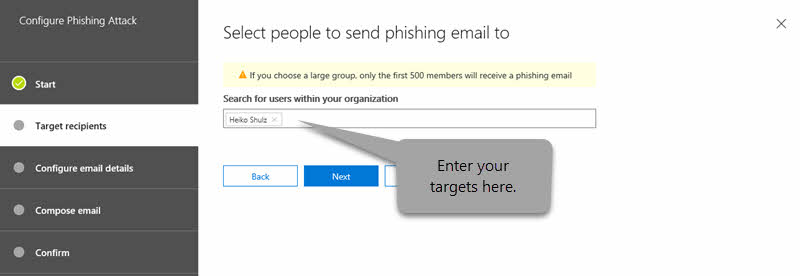
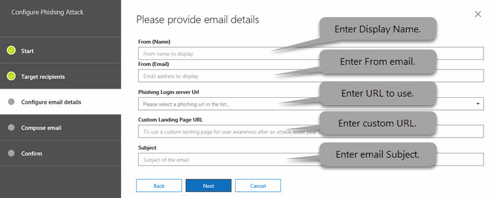

# Angriffssimulator in Office 365Attack Simulator in Office 365

**Zusammenfassung** Wenn Sie ein Office 365 globaler Administrator oder Sicherheitsadministrator sind und Ihre Organisation Office 365 Advanced Threat Protection Plan 2, einschließlich der Funktionen zur [Ermittlung und Reaktion von Bedrohungen](office-365-ti.md), verwendet, können Sie mit dem Angriffs Simulator realistische Angriffsszenarien in Ihrer Organisation ausführen.**Summary** If you are an Office 365 global administrator or a security administrator and your organization has Office 365 Advanced Threat Protection Plan 2, which includes [Threat Investigation and Response capabilities](office-365-ti.md), you can use Attack Simulator to run realistic attack scenarios in your organization. Auf diese Weise können Sie Benutzer mit Sicherheitslücken leichter identifizieren und finden, bevor ein echter Angriff passiert.This can help you identify and find vulnerable users before a real attack impacts your bottom line. Lesen Sie diesen Artikel, um mehr zu erfahren.Read this article to learn more.

## Die AngriffeThe Attacks

Derzeit stehen drei Arten von Angriffssimulationen zur Verfügung:Three kinds of attack simulations are currently available:

- [Anmeldeinformationen: Ernte Speer-Phishing-AngriffCredential harvest spear-phishing attack](#credential-harvest-spear-phishing-attack)

- [Attachment Spear-Phishing-AngriffAttachment spear-phishing attack](#attachment-spear-phishing-attack)

- [Kennwort-Spray-AngriffPassword-spray attack](#password-spray-attack)

- [Brute-Force-KennwortangriffBrute-force password attack](#brute-force-password-attack)

Damit ein Angriff erfolgreich gestartet werden kann, müssen Sie sicherstellen, dass das Konto, mit dem Simulierte Angriffe ausgeführt werden, die mehrstufige Authentifizierung verwendet.For an attack to be successfully launched, make sure that the account you are using to run simulated attacks is using multi-factor authentication. Darüber hinaus müssen Sie ein Office 365 globaler Administrator oder Sicherheitsadministrator sein.In addition, you must be an Office 365 global administrator or a security administrator. (Weitere Informationen zu Rollen und Berechtigungen finden Sie unter [Permissions in the Office 365 Security & Compliance Center](permissions-in-the-security-and-compliance-center.md).)(To learn more about roles and permissions, see [Permissions in the Office 365 Security & Compliance Center](permissions-in-the-security-and-compliance-center.md).)

Um auf &amp; den Angriffs Simulator zuzugreifen, wählen Sie im Security Compliance Center **Threat Management** \> **Attack Simulator**aus.To access Attack Simulator, in the Security &amp; Compliance Center, choose **Threat management** \> **Attack simulator**.

## Bevor Sie beginnen...Before you begin...

Stellen Sie sicher, dass Sie und Ihre Organisation die folgenden Anforderungen für den Angriffs Simulator erfüllen:Make sure that you and your organization meet the following requirements for Attack Simulator:

- Die e-Mail-Adresse Ihrer Organisation wird in Exchange Online gehostet.Your organization's email is hosted in Exchange Online. (Der Angriffs Simulator steht für lokale e-Mail-Server nicht zur Verfügung.)(Attack Simulator is not available for on-premises email servers.)

- Sie sind ein Office 365 globaler Administrator oder SicherheitsadministratorYou are an Office 365 global administrator or security administrator

- Bei Phishing-Kampagnen werden Ereignisse für einen Zeitraum von 30 Tagen gesammelt und verarbeitet, historische Kampagnendaten werden bis zu 90 Tage nach dem Start der Kampagne verfügbar sein.Phishing campaigns will collect and process events for a period of 30 days, historical campaign data will be available for up to 90 days after the campaign is launched.

- [Mehrstufige Authentifizierung/bedingter Zugriff](https://docs.microsoft.com/office365/admin/security-and-compliance/set-up-multi-factor-authentication) ist aktiviert, für mindestens das Office 365 globales Administratorkonto und Sicherheitsadministratoren, die den Angriffs Simulator verwenden werden.[Multi-factor authentication/Conditional Access](https://docs.microsoft.com/office365/admin/security-and-compliance/set-up-multi-factor-authentication) is turned on, for at least the Office 365 global administrator account and security administrators who will be using Attack Simulator. (Im Idealfall ist mehrstufige Authentifizierung/bedingter Zugriff für alle Benutzer in Ihrer Organisation aktiviert.)(Ideally, multi-factor authentication/conditional access is turned on for all users in your organization.)

- Ihre Organisation verfügt über [Office 365 Advanced Threat Protection Plan 2](office-365-atp.md), in dem der Angriffs &amp; Simulator im Security Compliance Center sichtbar ist (zu **Threat Management** \> **Attack Simulator**wechseln).Your organization has [Office 365 Advanced Threat Protection Plan 2](office-365-atp.md), with Attack Simulator visible in the Security &amp; Compliance Center (go to **Threat management** \> **Attack simulator**)

    

## Anmeldeinformationen: Ernte Speer-Phishing-AngriffCredential harvest spear-phishing attack

Phishing ist ein generischer Ausdruck für eine große Sammlung von Angriffen, die als Angriffs für soziale Technik bezeichnet werden.Phishing is a generic term for a broad suite of attacks classed as a social engineering style attack. Dieser Angriff konzentriert sich auf Speer-Phishing, einen gezielteren Angriff, der auf eine bestimmte Gruppe von Personen oder eine Organisation abzielt.This attack is focused on spear phishing, a more targeted attack that is aimed at a specific group of individuals or an organization. Normalerweise wird ein benutzerdefinierter Angriff mit einiger Aufklärung durchgeführt und ein Anzeigename verwendet, der eine Vertrauensstellung für den Empfänger generiert, beispielsweise eine e-Mail-Nachricht, die aussieht, als käme sie von einer Führungskraft in Ihrer Organisation.Typically, a customized attack with some reconnaissance performed and using a display name that will generate trust in the recipient, such as an email message that looks like it came from an executive within your organization.

Dieser Angriff konzentriert sich darauf, dass Sie den Anzeigenamen und die Quelladresse ändern können, aus dem die Nachricht anscheinend entstanden ist.This attack focuses on letting you manipulate who the message appears to have originated from by changing the display name and source address. Wenn Speer-Phishing-Angriffe erfolgreich sind, erhalten cyberattackers Zugriff auf die Anmeldeinformationen von Benutzern.When spear-phishing attacks are successful, cyberattackers gain access to users' credentials.

### So simulieren Sie einen Speer-Phishing-AngriffTo simulate a spear-phishing attack

Sie können den Rich-HTML-Editor direkt im Feld **e-Mail-Textkörper** selbst oder mit HTML-Quelle arbeiten.You can craft the rich HTML editor directly in the **Email body** field itself or work with HTML source.

1. Wählen Sie [im &amp; Security Compliance Center](https://protection.office.com) **Threat Management** \> **Attack Simulator**aus.In the [Security &amp; Compliance Center](https://protection.office.com), choose **Threat management** \> **Attack simulator**.

2. Geben Sie einen aussagekräftigen Kampagnennamen für den Angriff an, oder wählen Sie eine Vorlage aus.Specify a meaningful campaign name for the attack or select a template.

   

3. Geben Sie die Zielempfänger an.Specify the target recipients. Hierbei kann es sich um Einzelpersonen oder Gruppen in Ihrer Organisation handeln.This can be individuals or groups in your organization. Jeder Zielempfänger muss über ein Exchange Online Postfach verfügen, damit der Angriff erfolgreich verläuft.Each targeted recipient must have an Exchange Online Mailbox in order for the attack to be successful.

   

4. Konfigurieren Sie die Phishing-e-Mail-Details.Configure the Phishing email details.

   

   Die HTML-Formatierung kann so komplex oder einfach sein, wie Ihre Kampagne benötigt.The HTML formatting can be as complex or basic as your campaign needs. Da das e-Mail-Format HTML ist, können Sie Bilder und Text einfügen, um die Glaubwürdigkeit erhöhen zu verbessern.As the email format is HTML, you can insert images and text to enhance believability. Sie haben die Kontrolle darüber, wie die empfangene Nachricht im empfangenden e-Mail-Client aussehen wird.You have control on what the received message will look like in the receiving email client.

5. Geben Sie den Text für das Feld **from (Name)** an.Specify text for the **From (Name)** field. Dies ist das Feld, das im empfangenden e-Mail-Client im **Anzeigenamen** angezeigt wird.This is the field that shows in the **Display Name** in the receiving email client.

6. Geben Sie Text oder das Feld **von** an.Specify text or the **From** field. Dies ist das Feld, das als e-Mail-Adresse des Absenders im empfangenden e-Mail-Client angezeigt wird.This is the field that shows as the email address of the sender in the receiving email client.

   Sie können in Ihrer Organisation einen vorhandenen e-Mail-Namespace eingeben (Dadurch wird die e-Mail-Adresse tatsächlich im empfangenden Client aufgelöst, wodurch ein sehr hohes Vertrauensmodell erleichtert wird), oder Sie können eine externe e-Mail-Adresse eingeben.You can enter an existing email namespace within your organization (doing this will make the email address actually resolve in the receiving client, facilitating a very high trust model), or you can enter an external email address. Die angegebene e-Mail-Adresse muss nicht tatsächlich vorhanden sein, Sie muss jedoch dem Format einer gültigen SMTP-Adresse wie `user@domainname.extension`.The email address that you specify does not have to actually exist, but it does need to follow the format of a valid SMTP address, such as `user@domainname.extension`.

7. Wählen Sie mithilfe der Dropdownauswahl eine URL für den Phishing-Anmeldeserver aus, die die Art der Inhalte widerspiegelt, die Sie in ihrem Angriff haben werden.Using the drop-down selector, select a Phishing Login server URL that reflects the type of content you will have within your attack. Es werden mehrere Themen-URLs bereitgestellt, aus denen Sie auswählen können, beispielsweise Dokumentzustellung, technische, Lohnbuchhaltung usw. Dies ist effektiv die URL, auf die Zielbenutzer klicken müssen.Several themed URLs are provided for you to choose from, such as document delivery, technical, payroll etc. This is effectively the URL that targeted users are asked to click.

8. Geben Sie eine benutzerdefinierte URL für die Zielseiten an.Specify a custom landing page URL. Mit dieser Methode werden Benutzer zu einer URL umgeleitet, die Sie am Ende eines erfolgreichen Angriffs angegeben haben.Using this will redirect users to a URL you specify at the end of a successful attack. Wenn Sie beispielsweise ein internes Bewusstseinstraining haben, können Sie dies hier angeben.If you have internal awareness training, for example, you can specify that here.

9. Geben Sie den Text für das Feld **Betreff** an.Specify text for the **Subject** field. Dies ist das Feld, das als **Antragsteller Name** im empfangenden e-Mail-Client angezeigt wird.This is the field that shows as the **Subject Name** in the receiving email client.

10. Erstellen Sie den **e-Mail-Text** , den das Ziel empfangen soll.Compose the **Email body** that the target will receive.

    `${username}`Fügt den Namen Targets in den e-Mail-Text ein.`${username}` inserts the targets name into the Email body.

    `${loginserverurl}`Fügt die URL ein, auf die die Zielbenutzer klicken sollen.`${loginserverurl}` inserts the URL we want target users to click

11. Klicken Sie auf **weiter und** anschließend auf **Fertig stellen** , um den Angriff zu starten.Choose **Next,** then **Finish** to launch the attack. Die Phishing-e-Mail-Nachricht wird an die Postfächer ihrer Zielempfänger übermittelt.The spear phishing email message is delivered to your target recipients' mailboxes.

## Attachment Spear-Phishing-AngriffAttachment spear-phishing attack

Phishing ist ein generischer Ausdruck für eine große Sammlung von Angriffen, die als Angriffs für soziale Technik bezeichnet werden.Phishing is a generic term for a broad suite of attacks classed as a social engineering style attack. Dieser Angriff konzentriert sich auf Attachment Spear Phishing, einen gezielteren Angriff, der auf eine bestimmte Gruppe von Individuen oder eine Organisation abzielt.This attack is focused on attachment spear phishing, a more targeted attack that is aimed at a specific group of individuals or an organization. Normalerweise wird ein benutzerdefinierter Angriff mit einiger Aufklärung durchgeführt und ein Anzeigename verwendet, der eine Vertrauensstellung für den Empfänger generiert, beispielsweise eine e-Mail-Nachricht, die aussieht, als käme sie von einer Führungskraft in Ihrer Organisation.Typically, a customized attack with some reconnaissance performed and using a display name that will generate trust in the recipient, such as an email message that looks like it came from an executive within your organization.

Dieser Angriff konzentriert sich darauf, dass Sie manipulieren können, von wem die Nachricht anscheinend stammt, indem Sie den Anzeigenamen und die Quelladresse ändern, aber diesmal im Gegensatz zum anbieten einer URL, um den Endbenutzer zum Klicken zu locken, bieten wir eine Anlage an, die wir versuchen, t zu erhalten. der Endbenutzer wird geöffnet.This attack focuses on letting you manipulate who the message appears to have originated from by changing the display name and source address, but this time as opposed to offering a URL to try and lure the end user to click, we offer an attachment that we are trying to get the end user to open. 

### So simulieren Sie einen Anlagen Speer-Phishing-AngriffTo simulate a Attachment spear-phishing attack

1. Befolgen Sie die Schritte von oben, wobei dieser Zeitpunkt auf **Attachment Attack** auf der Zielseite geklickt wurde.Follow the steps from above, having this time clicked on **Attachment Attack** on the landing page.

2. Während Sie den Assistenten Fortschreiten, werden zwei Optionen zum Konfigurieren angezeigt.As you progress through the wizard, you see two options to configure. Der **Anlagentyp**, wir unterstützen zwei Anlagentypen, **. docx** oder **. PDF**.The **Attachment Type**, we support two attachment types, **.docx** or **.pdf**. **Name der Anlage**verwenden Sie dieses Feld, um einen aussagekräftigen Anlagennamen für die Kampagne zu erstellen.The **Attachment Name**, use this field to create a meaningful attachment name for the campaign.

## Kennwort-Spray-AngriffPassword-spray attack

Ein Kenn Wort Sprüh Angriff auf eine Organisation wird in der Regel verwendet, nachdem ein schlechter Akteur eine Liste gültiger Benutzer aus dem Mandanten erfolgreich erworben hat.A password spray attack against an organization is typically used after a bad actor has successfully acquired a list of valid users from the tenant. Der fehlerhafte Akteur weiß um häufige Kennwörter, die von Benutzern verwendet werden.The bad actor knows about common passwords that people use. Dies ist ein weit verbreiteter Angriff, da es sich um einen günstigen Angriff handelt und schwerer zu erkennen ist als Brute-Force-Ansätze.This is a widely used attack, as it is a cheap attack to run, and harder to detect than brute force approaches.

Dieser Angriff konzentriert sich darauf, dass Sie ein gemeinsames Kennwort für eine große Zieldatenbank von Benutzern angeben können.This attack focuses on letting you specify a common password against a large target base of users.

**Wichtiger Hinweis** das Durchführen des Kenn Wort Sprüh Angriffs für Endbenutzerkonten, die bereits über mehrstufige Authentifizierung verfügen, führt zu einem erfolglosen Versuch für diese Konten in der Berichterstellung.**Important Note** running the password spray attack against end user accounts that already have multi-factor authentication, will result in a unsuccessful attempt for those accounts in the reporting. Dies ist darauf zurückzuführen, dass die mehrstufige Authentifizierung eine der primären mechanims ist, die zum Schutz vor Kenn Wort Sprüh Angriffen verwendet werden sollen.This is due to multi-factor authentication being one of the primary mechanims to help protect against password spray attacks, so is expected.

### So simulieren Sie einen Kenn Wort Sprüh AngriffTo simulate a password-spray attack

1. Wählen Sie [im &amp; Security Compliance Center](https://protection.office.com) **Threat Management** \> **Attack Simulator**aus.In the [Security &amp; Compliance Center](https://protection.office.com), choose **Threat management** \> **Attack simulator**.

2. Geben Sie einen aussagekräftigen Kampagnennamen für den Angriff an.Specify a meaningful campaign name for the attack.

3. Geben Sie die Zielempfänger an.Specify the target recipients. Hierbei kann es sich um Einzelpersonen oder Gruppen in Ihrer Organisation handeln.This can be individuals or groups in your organization. Ein Zielempfänger muss über ein Exchange Online Postfach verfügen, damit der Angriff erfolgreich verläuft.A targeted recipient must have an Exchange Online mailbox in order for the attack to be successful.

4. Geben Sie ein Kennwort an, das für den Angriff verwendet werden soll.Specify a password to use for the attack. Beispielsweise ist ein gemeinsames, relevantes Kennwort, das `Summer2019`Sie ausprobieren können.For example, one common, relevant password you could try is `Summer2019`. Ein anderer könnte `Fall2019`sein, `Password1`oder.Another might be `Fall2019`, or `Password1`.

5. Wählen Sie **Fertig stellen** aus, um den Angriff zu starten.Choose **Finish** to launch the attack.

## Brute-Force-KennwortangriffBrute-force password attack

Ein Brute-Force-Kennwortangriff auf eine Organisation wird in der Regel verwendet, nachdem ein schlechter Akteur erfolgreich eine Liste mit wichtigen Benutzern aus dem Mandanten abgerufen hat.A brute-force password attack against an organization is typically used after a bad actor has successfully acquired a list of key users from the tenant. Dieser Angriff konzentriert sich auf das Ausprobieren einer Gruppe von Kennwörtern für das Konto eines einzelnen Benutzers.This attack focuses on trying a set of passwords on a single user's account.

**Wichtiger Hinweis** das Durchführen der Brute-Force-Kennwortangriffe für Endbenutzerkonten, die bereits über mehrstufige Authentifizierung verfügen, führt zu einem erfolglosen Versuch für diese Konten in der Berichterstellung.**Important Note** running the brute-force password attacks against end user accounts that already have multi-factor authentication, will result in a unsuccessful attempt for those accounts in the reporting. Dies ist darauf zurückzuführen, dass die mehrstufige Authentifizierung eine der primären mechanims ist, die zum Schutz vor Brute-Force-Kennwortangriffen verwendet werden, was daher erwartet wird.This is due to multi-factor authentication being one of the primary mechanims to help protect against brute-force password attacks, so is expected.

### So simulieren Sie einen Brute-Force-KennwortangriffTo simulate a brute-force password attack

1. Wählen Sie [im &amp; Security Compliance Center](https://protection.office.com) **Threat Management** \> **Attack Simulator**aus.In the [Security &amp; Compliance Center](https://protection.office.com), choose **Threat management** \> **Attack simulator**.

2. Geben Sie einen aussagekräftigen Kampagnennamen für den Angriff an.Specify a meaningful campaign name for the attack.

3. Geben Sie den Zielempfänger an.Specify the target recipient. Ein Zielempfänger muss über ein Exchange Online Postfach verfügen, damit der Angriff erfolgreich verläuft.A targeted recipient must have an Exchange Online mailbox in order for the attack to be successful.

4. Geben Sie eine Gruppe von Kennwörtern an, die für den Angriff verwendet werden sollen.Specify a set of passwords to use for the attack. Zu diesem Zweck können Sie eine Textdatei (txt-Datei) für die Liste der Kennwörter verwenden.To do this, you can use a text (.txt) file for your list of passwords. Die Textdatei darf die Dateigröße von 10 MB nicht überschreiten.The text file cannot exceed 10 MB in file size. Verwenden Sie ein Kennwort pro Zeilen, und stellen Sie sicher, dass Sie nach dem letzten Kennwort in Ihrer Liste eine harte Rückgabe einschließen.Use one password per line, and make sure to include a hard return after the last password in your list.

5. Wählen Sie **Fertig stellen** aus, um den Angriff zu starten.Choose **Finish** to launch the attack.

Besuchen Sie die [Microsoft 365-Roadmap](https://www.microsoft.com/microsoft-365/roadmap) , um zu sehen, was sich in der Entwicklung befindet, was sich ausrollt und was bereits gestartet wurde.Visit the [Microsoft 365 Roadmap](https://www.microsoft.com/microsoft-365/roadmap) to see what's in development, what's rolling out, and what's already launched.

## Siehe auchSee also

[Office 365 Advanced Threat Protection-DienstbeschreibungOffice 365 Advanced Threat Protection Service Description](https://docs.microsoft.com/office365/servicedescriptions/office-365-advanced-threat-protection-service-description)

[Office 365 Advanced Threat ProtectionOffice 365 Advanced Threat Protection](office-365-atp.md)
