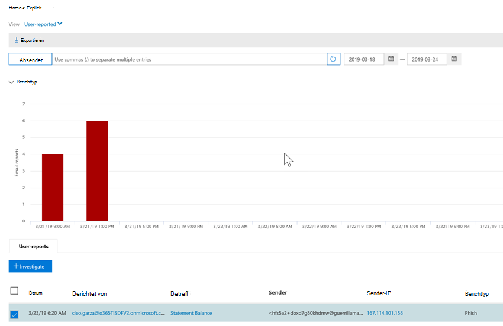

# Automatische Untersuchung und Reaktion (Air) in Office 365

Wenn Sicherheitswarnungen ausgelöst werden, liegt es an Ihrem Sicherheits Betriebsteam, diese Warnungen zu untersuchen und Maßnahmen zum Schutz Ihrer Organisation zu ergreifen. Manchmal können sich Sicherheits Operations Teams von der Menge der ausgelösten Warnungen überfordert fühlen. Die Funktionen für die automatische Untersuchung und Reaktion (Air) in Office 365 können helfen. Mit Air kann Ihr Security Operations-Team effizienter und effektiver arbeiten. Air-Funktionen umfassen automatisierte Ermittlungsprozesse als Reaktion auf bekannte Bedrohungen, die heute vorhanden sind. Geeignete Korrekturaktionen warten auf die Genehmigung, sodass Ihr Sicherheits Betriebsteam auf erkannte Bedrohungen reagieren kann. 

Dieser Artikel bietet eine Übersicht über Air. Wenn Sie mit der Verwendung von Air beginnen möchten, finden Sie weitere Informationen unter [Automatisches untersuchen und reagieren auf Bedrohungen in Office 365](office-365-air.md).

## Auf einer hohen Ebene

Wenn Warnungen ausgelöst werden, treten Sicherheits-Textbuch in Kraft. Je nach Situation kann ein [automatischer Ermittlungsprozess](https://docs.microsoft.com/microsoft-365/security/office-365-security/office-365-air) beginnen. Während und nach einer automatischen Untersuchung werden [Korrekturaktionen](air-remediation-actions.md) empfohlen. In Office 365 Advanced Threat Protection werden keine Aktionen automatisch durchgeführt. Ihr Security Operations-Team überprüft, und [genehmigt oder lehnt dann jede Korrekturaktion](air-remediation-actions.md#approve-or-reject-pending-actions)ab, und wenn dies geschieht, wird jede Untersuchung abgeschlossen. Alle diese Aktivitäten werden nachverfolgt und im Office 365 Security & Compliance Center angezeigt (siehe [Details einer Untersuchung anzeigen](air-view-investigation-results.md#view-details-of-an-investigation)).

Die folgenden Abschnitte enthalten weitere Informationen zu Warnungen, Sicherheits handschreibungen und Beispiele für Luft in Aktion.

## Warnungen

[Warnungen](../../compliance/alert-policies.md#viewing-alerts) stellen Auslöser für Sicherheitsvorgänge-Team Workflows für die Vorfall Antwort dar. Priorisieren des richtigen Warnungs Satzes für die Untersuchung, wobei sichergestellt wird, dass keine Bedrohungen unbehandelt sind, ist eine Herausforderung. Wenn Untersuchungen zu Warnungen manuell durchgeführt werden, müssen Sicherheits Betriebsteams Entitäten (beispielsweise Inhalte, Geräte und Benutzer), die von Bedrohungen bedroht sind, jagen und korrelieren. Solche Aufgaben und Workflows können sehr zeitaufwendig sein und umfassen mehrere Tools und Systeme. Mit Air werden Untersuchungen und Antworten für Office 365 Sicherheitsereignisse automatisiert, indem wichtige Sicherheits-und Bedrohungsmanagement-Warnungen automatisch Sicherheitsantwort-Textbuch auslösen. 

Derzeit werden Warnungen, die aus den folgenden Arten von Warnungsrichtlinien generiert werden, automatisch untersucht:  

- Ein potenziell böswilliger URL-Klick wurde erkannt.
- Vom Benutzer als Phishing gemeldete e-Mail *
- E-Mail-Nachrichten mit Schadsoftware nach der Zustellung entfernt *
- E-Mail-Nachrichten mit gelöschten Phishing-URLs nach der Zustellung *
- Erkannte verdächtige e-Mail-Sende Muster #
- Benutzer vom Senden von e-Mails eingeschränkt #

> [!NOTE]
> Die mit einem Sternchen (*) gekennzeichneten Warnungen werden in den jeweiligen Warnungsrichtlinien im Security & Compliance Center mit einem *Informations* Schweregrad versehen, wobei e-Mail-Benachrichtigungen deaktiviert sind. E-Mail-Benachrichtigungen können über die [Warnungsrichtlinien Konfiguration](../../compliance/alert-policies.md#alert-policy-settings)aktiviert werden. Mit einem Hash (#) gekennzeichnete Warnungen sind allgemein verfügbare Warnungen für öffentliche Vorschau-Textbuch.

Um Warnungen anzuzeigen **, wählen Sie** > im Security & Compliance Center Benachrichtigungen**anzeigen Warnungen**aus. Wählen Sie eine Warnung aus, um die Details anzuzeigen, und verwenden Sie dann den Link **Untersuchung anzeigen** , um zur entsprechenden [Untersuchung](air-view-investigation-results.md#investigation-graph)zu gelangen.  

> [!NOTE]
> Informationswarnungen werden standardmäßig in der Warnungsansicht ausgeblendet. Um diese anzuzeigen, ändern Sie die Warnungsfilterung so, dass Sie Informationswarnungen einschließt.

Wenn Ihre Organisation ihre Sicherheitswarnungen über ein Warnungsverwaltungssystem, ein Dienst Verwaltungssystem oder ein System für die Verwaltung von Sicherheitsinformationen und Ereignissen verwaltet, können Sie Office 365 Warnungen entweder per e-Mail-Benachrichtigung oder über die [Office 365 Verwaltungs Aktivitäts-API](https://docs.microsoft.com/office/office-365-management-api/office-365-management-activity-api-reference)an dieses System senden. Die Untersuchung von Benachrichtigungs Benachrichtigungen per e-Mail oder API enthält Links für den Zugriff auf die Warnungen im Security & Compliance Center, sodass der zugewiesene Sicherheitsadministrator schnell zu der Untersuchung navigieren kann.

 

## Sicherheits-Manuskripte

Sicherheits-Textbuch sind Back-End-Richtlinien, die im Mittelpunkt der Automatisierung in Office Advanced Threat Protection und Microsoft Threat Protection stehen. Die in Air bereitgestellten Sicherheits-Textbuch basieren auf gängigen realen Sicherheitsszenarien und werden auf der Grundlage von Feedback aus Sicherheits Betriebsteams entwickelt. Ein Sicherheits Textbuch wird automatisch gestartet, wenn in Ihrer Organisation bestimmte Warnungen ausgelöst werden. Sobald die Warnung ausgelöst wird, wird das zugehörige Textbuch vom System für die automatische Untersuchung und Reaktion (Air) ausgeführt. Die Untersuchung erfolgt durch eine Analyse der Warnung basierend auf dem Textbuch der jeweiligen Warnung, wobei alle zugehörigen Metadaten (einschließlich e-Mail-Nachrichten, Benutzer, Subjekte, Absender usw.) untersucht werden. Basierend auf den Ergebnissen der Untersuchung des Textbuch empfiehlt Air eine Reihe von Aktionen, die das Sicherheitsteam Ihrer Organisation ausführen kann, um die Bedrohung zu steuern und zu mindern. 

Die Sicherheits-Textbuch-Dokumente, die Sie mit Air erhalten, wurden entwickelt, um die häufigsten Bedrohungen zu bewältigen, mit denen Organisationen heute mit e-Mails konfrontiert sind. Sie basieren auf Eingaben aus Sicherheits-und Vorfall Reaktions Teams, einschließlich derer, die die Verteidigung von Microsoft und den Ressourcen unserer Kunden unterstützen.

### Sicherheits-Textbuch-Rollen in Phasen

Im Rahmen von Air werden Sicherheits-Textbuch in Phasen ausgerollt. Phase 1 ist jetzt allgemein verfügbar und enthält mehrere Textbuch, die Empfehlungen für Aktionen enthalten, die Sicherheitsadministratoren überprüfen und genehmigen können:
- Vom Benutzer gemeldete Phishing-Nachricht
- Änderung des URL-Klick Urteils
- Erkannte Schadsoftware nach der Zustellung (Malware zap)
- Phishing-Erkennung nach der Zustellung zap (Phishing zap)

Phase 1 enthält auch Unterstützung für von Administratoren ausgelöste e-Mail-Untersuchungen (mithilfe von [Threat Explorer](threat-explorer.md)).

Phase 2 wird nun mit den folgenden Textbuch in der **öffentlichen Vorschau**fortgesetzt, wobei Empfehlungen für Aktionen und Sicherheitsadministratoren bei der Untersuchung von Problemen gegeben werden:
- Als kompromittiert gemeldeter Benutzer (öffentliche Vorschau)

Weitere Textbuch werden als abgeschlossen veröffentlicht. Besuchen Sie die [Microsoft 365-Roadmap](https://www.microsoft.com/microsoft-365/roadmap) , um zu sehen, was noch geplant ist und demnächst verfügbar ist.

### Manuskripte umfassen Untersuchungen und Empfehlungen

In der Luft umfasst jedes Sicherheits-Textbuch Folgendes: 
- eine Stamm Untersuchung der Entitäten einer e-Mail (Dateien, URLs, Empfänger, IP-Adressen usw.),
- Weitere Jagd auf ähnliche e-Mails, die von der Organisation empfangen werden 
- Schritte zum Identifizieren und korrelieren anderer potenzieller Bedrohungen und 
- Empfohlene Aktionen zur Behebung von Bedrohungen.

Jeder allgemeine Schritt enthält eine Reihe von unterschritten, die ausgeführt werden, um eine Tiefe, detaillierte und erschöpfende Antwort auf Bedrohungen bereitzustellen.

## Beispiel: eine von einem Benutzer gemeldete Phishing-Nachricht startet eine Untersuchung des Manuskripts

Wenn ein Benutzer in Ihrer Organisation eine e-Mail-Nachricht übermittelt und an Microsoft mithilfe des [Berichtsnachrichten-Add-Ins für Outlook oder Outlook Web App](enable-the-report-message-add-in.md)meldet, wird der Bericht auch an Ihr System gesendet und im Explorer in der vom Benutzer gemeldeten Ansicht angezeigt. Diese vom Benutzer gemeldete Nachricht löst jetzt eine System basierte Informationswarnung aus, die das unter suchbuch automatisch startet.

Während der Stamm Untersuchungsphase werden verschiedene Aspekte der e-Mail bewertet. Zu diesen zählen:
- Eine Bestimmung darüber, welche Art von Bedrohung es sein könnte;
- Absender
- Woher die e-Mail gesendet wurde (sendende Infrastruktur);
- Gibt an, ob andere Instanzen der e-Mail zugestellt oder blockiert wurden;
- Eine Bewertung durch unsere Analysten;
- Gibt an, ob die e-Mail bekannten Kampagnen zugeordnet ist;
- und vieles mehr.

Nachdem die Stamm Untersuchung abgeschlossen ist, enthält das Textbuch eine Liste der empfohlenen Aktionen, die für die ursprünglichen e-Mail-Objekte und zugehörigen Entitäten übernommen werden sollen.
  
Im nächsten Schritt werden mehrere Schritte zur Ermittlung und Jagd von Bedrohungen ausgeführt:

- Ähnliche e-Mail-Nachrichten werden über e-Mail-Cluster Suchvorgänge identifiziert.
- Das Signal wird für andere Plattformen wie [Microsoft Defender ATP](https://docs.microsoft.com/windows/security/threat-protection/microsoft-defender-atp/microsoft-defender-advanced-threat-protection)freigegeben.
- Es wird festgestellt, ob Benutzer in verdächtigen e-Mail-Nachrichten auf böswillige Links geklickt haben.
- Eine Überprüfung erfolgt über Office 365 Exchange Online Protection ([EoP](exchange-online-protection-eop.md)) und Office 365 Advanced Threat Protection ([ATP](office-365-atp.md)), um zu sehen, ob andere ähnliche Nachrichten von Benutzern gemeldet werden.
- Eine Überprüfung wird durchgeführt, um festzustellen, ob ein Benutzer kompromittiert wurde. Bei dieser Überprüfung werden Signale in Bezug auf Office 365, [Microsoft Cloud-App-Sicherheit](https://docs.microsoft.com/cloud-app-security)und [Azure-Active Directory](https://docs.microsoft.com/azure/active-directory)verwendet, sodass alle zugehörigen Anomalien bei Benutzeraktivitäten korreliert werden. 

Während der Jagd Phase werden Risiken und Bedrohungen verschiedenen Jagd Schritten zugeordnet. 

Die Korrektur ist die letzte Phase des Textbuch. In dieser Phase werden korrekturschritte basierend auf den Ermittlungs-und Jagd Phasen durchgeführt. 

## Beispiel: ein Sicherheitsadministrator löst eine Untersuchung mit Threat Explorer aus.

Zusätzlich zu den automatischen Untersuchungen, die durch eine Warnung ausgelöst werden, kann das Sicherheits Betriebsteam Ihrer Organisation eine automatische Untersuchung aus einer Ansicht in [Threat Explorer](threat-explorer.md)auslösen.

Nehmen wir beispielsweise an, dass Sie Daten im Explorer zu vom Benutzer gemeldeten Nachrichten anzeigen. Sie können ein Element in der Ergebnisliste auswählen und dann im Menü Aktion auf **Recherchieren** (vorausgesetzt, Sie verfügen über entsprechende Korrektur Berechtigungen).

Nehmen Sie als weiteres Beispiel an, dass Sie Daten zu e-Mail-Nachrichten anzeigen, die als Schadsoftware erkannt wurden, und dass mehrere e-Mail-Nachrichten als Schadsoftware erkannt werden. Sie können die Registerkarte **e-Mail** auswählen, eine oder mehrere e-Mail-Nachrichten auswählen und dann im Menü **Aktionen** die Option **untersuchen**auswählen. 

Ähnlich wie Textbuch, die durch eine Warnung ausgelöst werden, umfassen automatische Untersuchungen, die aus einer Ansicht im Explorer ausgelöst werden, eine Stamm Ermittlung, Schritte zum Identifizieren und Korrelieren von Bedrohungen sowie Empfohlene Aktionen zur Minderung dieser Bedrohungen.

## Nächste Schritte

- [Erste Schritte mit Air in Office 365](office-365-air.md)

- [Besuchen Sie die Microsoft 365-Roadmap, um zu sehen, was bald kommt und wie Sie Rollen](https://www.microsoft.com/microsoft-365/roadmap?filters=)

