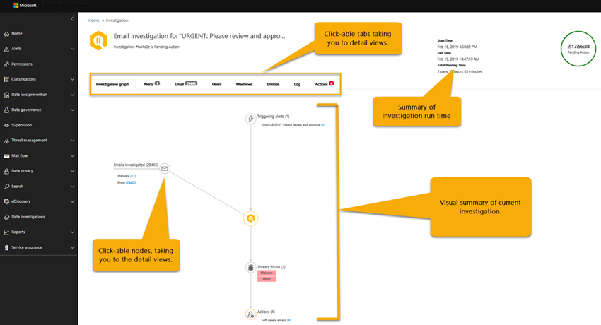
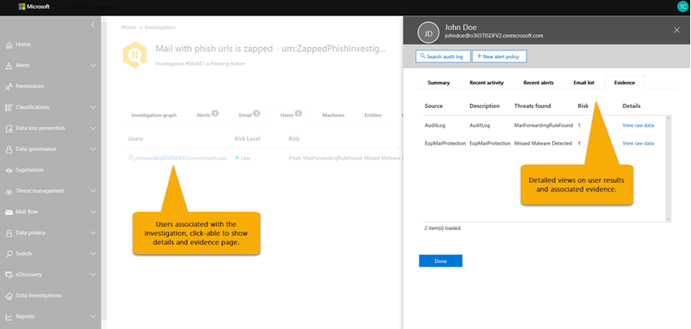

# Automatische Untersuchung und Reaktion (Air) in Office 365

Mit den Funktionen für die automatische Untersuchung und Reaktion (Air) können Sie automatisierte Ermittlungsprozesse als Reaktion auf bekannte Bedrohungen ausführen, die heute vorhanden sind. Mit Air können Sie Ihre Security Operations-Teams effizienter und effektiver betreiben.
- Verwenden Sie diesen Artikel, um einen Überblick über die Funktionsweise von Air zu erhalten.
- Informationen zum Einstieg in die Verwendung von Air finden Sie unter [Automatisches untersuchen und reagieren auf Bedrohungen in Office 365](office-365-air.md).

> [!TIP]
> Verwenden Sie Microsoft 365 E5 oder Microsoft 365 E3 zusammen mit Identitäts- und Bedrohungsschutz? Erwägen Sie, [Microsoft Threat Protection](../mtp/microsoft-threat-protection.md) zu testen.

## Der gesamte Luftstrom

Auf hohem Niveau funktioniert der Luftstrom wie folgt:

|Phase  |Was beteiligt ist  |
|---------|---------|
|1     |Eine [Warnung](#alerts) wird von einem Office-Ereignis ausgelöst, und ein [Sicherheits](#security-playbooks) -Textbuch initiiert eine automatisierte Untersuchung für ausgewählte Warnungen.   Alternativ kann ein Sicherheitsanalytiker eine [Automatische Untersuchung](#example-a-security-administrator-triggers-an-investigation-from-threat-explorer)von einer e-Mail aus dem [Explorer](threat-explorer.md)aus manuell starten.        |
|2     |Während eine automatisierte Untersuchung ausgeführt wird, sammelt Sie zusätzliche Daten über die e-Mail und die Entitäten im Zusammenhang mit dieser e-Mail – Dateien, URLs und Empfänger.  Der Bereich der Untersuchung kann zunehmen, wenn neue zugehörige Warnungen ausgelöst werden.         |
|3     |Während und nach einer automatisierten Untersuchung stehen [Details und Ergebnisse](#investigation-graph) zur Verfügung, die angezeigt werden können. Die Ergebnisse umfassen [Empfohlene Aktionen](#recommended-actions) , die ergriffen werden können, um alle gefundenen Bedrohungen zu reagieren und zu beheben. Darüber hinaus steht ein Textbuch- [Protokoll](#playbook-log) zur Verfügung, das alle Ermittlungsaktivitäten aufspürt.  Wenn Ihre Organisation eine benutzerdefinierte Berichtslösung oder eine Drittanbieterlösung verwendet, können Sie [die API für die Office 365 Verwaltungsaktivität verwenden](office-365-air.md#use-the-office-365-management-activity-api-for-custom-or-third-party-reporting-solutions) , um Informationen zu automatisierten Untersuchungen und Bedrohungen anzuzeigen.         |
|4     |Ihr Security Operations-Team überprüft die Untersuchungsergebnisse und Empfehlungen und genehmigt Korrekturaktionen. In Office 365 werden Abhilfemaßnahmen nur nach Genehmigung durch das Sicherheitsteam Ihrer Organisation ausgeführt.         |

Die folgenden Abschnitte enthalten weitere Details zu Air, einschließlich Details zu Warnungen, Sicherheits handschreibungen und Ermittlungs Details. Darüber hinaus sind in diesem Artikel zwei Beispiele für die Verwendung von Air-Arbeiten enthalten. Informationen zum Einstieg in die Verwendung von Air finden Sie unter [Automatisches untersuchen und reagieren auf Bedrohungen in Office 365](office-365-air.md).

## Warnungen

[Warnungen](../../compliance/alert-policies.md#viewing-alerts) stellen Auslöser für Sicherheitsvorgänge-Team Workflows für die Vorfall Antwort dar. Priorisieren des richtigen Warnungs Satzes für die Untersuchung, wobei sichergestellt wird, dass keine Bedrohungen unbehandelt sind, ist eine Herausforderung. Wenn Untersuchungen zu Warnungen manuell durchgeführt werden, müssen Sicherheits Betriebsteams Entitäten (beispielsweise Inhalte, Geräte und Benutzer), die von Bedrohungen bedroht sind, jagen und korrelieren. Solche Aufgaben und Workflows können sehr zeitaufwendig sein und umfassen mehrere Tools und Systeme. Mit Air werden Untersuchungen und Antworten für Office 365 Sicherheitsereignisse automatisiert, indem wichtige Sicherheits-und Bedrohungsmanagement-Warnungen automatisch Sicherheitsantwort-Textbuch auslösen. 

Derzeit werden Warnungen, die aus den folgenden Arten von Warnungsrichtlinien generiert werden, automatisch untersucht:  

- Ein potenziell böswilliger URL-Klick wurde erkannt.
- Vom Benutzer als Phishing gemeldete e-Mail *
- E-Mail-Nachrichten mit Schadsoftware nach der Zustellung entfernt *
- E-Mail-Nachrichten mit gelöschten Phishing-URLs nach der Zustellung *
- Erkannte verdächtige e-Mail-Sende Muster #
- Benutzer vom Senden von e-Mails eingeschränkt #

> [!NOTE]
> Die mit einem Sternchen (*) gekennzeichneten Warnungen werden in den jeweiligen Warnungsrichtlinien im Security #a0 Compliance Center mit einem *Informations* Schweregrad versehen, wobei e-Mail-Benachrichtigungen deaktiviert sind. E-Mail-Benachrichtigungen können über die [Warnungsrichtlinien Konfiguration](../../compliance/alert-policies.md#alert-policy-settings)aktiviert werden. Mit einem Hash (#) gekennzeichnete Warnungen sind allgemein verfügbare Warnungen für öffentliche Vorschau-Textbuch.

Um Warnungen anzuzeigen **, wählen Sie** > im Security #a0 Compliance Center Benachrichtigungen**anzeigen Warnungen**aus. Wählen Sie eine Warnung aus, um die Details anzuzeigen, und verwenden Sie dann den Link **Untersuchung anzeigen** , um zur entsprechenden [Untersuchung](#investigation-graph)zu gelangen.  

> [!NOTE]
> Informationswarnungen werden standardmäßig in der Warnungsansicht ausgeblendet. Um diese anzuzeigen, ändern Sie die Warnungsfilterung so, dass Sie Informationswarnungen einschließt.

Wenn Ihre Organisation ihre Sicherheitswarnungen über ein Warnungsverwaltungssystem, ein Dienst Verwaltungssystem oder ein System für die Verwaltung von Sicherheitsinformationen und Ereignissen verwaltet, können Sie Office 365 Warnungen entweder per e-Mail-Benachrichtigung oder über die [Office 365 Verwaltungs Aktivitäts-API](https://docs.microsoft.com/office/office-365-management-api/office-365-management-activity-api-reference)an dieses System senden. Die Untersuchung von Benachrichtigungs Benachrichtigungen per e-Mail oder API enthält Links für den Zugriff auf die Warnungen im Security #a0 Compliance Center, sodass der zugewiesene Sicherheitsadministrator schnell zu der Untersuchung navigieren kann.

 

## Sicherheits-Manuskripte

Sicherheits-Textbuch sind Back-End-Richtlinien, die im Mittelpunkt der Automatisierung in Office Advanced Threat Protection und Microsoft Threat Protection stehen. Die in Air bereitgestellten Sicherheits-Textbuch basieren auf gängigen realen Sicherheitsszenarien und werden auf der Grundlage von Feedback aus Sicherheits Betriebsteams entwickelt. Ein Sicherheits Textbuch wird automatisch gestartet, wenn in Ihrer Organisation bestimmte Warnungen ausgelöst werden. Sobald die Warnung ausgelöst wird, wird das zugehörige Textbuch vom System für die automatische Untersuchung und Reaktion (Air) ausgeführt. Die Untersuchung erfolgt durch eine Analyse der Warnung basierend auf dem Textbuch der jeweiligen Warnung, wobei alle zugehörigen Metadaten (einschließlich e-Mail-Nachrichten, Benutzer, Subjekte, Absender usw.) untersucht werden. Basierend auf den Ergebnissen der Untersuchung des Textbuch empfiehlt Air eine Reihe von Aktionen, die das Sicherheitsteam Ihrer Organisation ausführen kann, um die Bedrohung zu steuern und zu mindern. 

Die Sicherheits-Textbuch-Dokumente, die Sie mit Air erhalten, wurden entwickelt, um die häufigsten Bedrohungen zu bewältigen, mit denen Organisationen heute mit e-Mails konfrontiert sind. Sie basieren auf Eingaben aus Sicherheits-und Vorfall Reaktions Teams, einschließlich derer, die die Verteidigung von Microsoft und den Ressourcen unserer Kunden unterstützen.

### Sicherheits-Textbuch-Rollen in Phasen

Im Rahmen von Air werden Sicherheits-Textbuch in Phasen ausgerollt. Phase 1 ist jetzt allgemein verfügbar und enthält mehrere Textbuch, die Empfehlungen für Aktionen enthalten, die Sicherheitsadministratoren überprüfen und genehmigen können:
- Vom Benutzer gemeldete Phishing-Nachricht
- Änderung des URL-Klick Urteils
- Erkannte Schadsoftware nach der Zustellung (Malware zap)
- Phishing-Erkennung nach der Zustellung zap (Phishing zap)

Phase 1 enthält auch Unterstützung für von Administratoren ausgelöste e-Mail-Untersuchungen (mithilfe von [Threat Explorer](threat-explorer.md)).

Phase 2 wird nun mit den folgenden Textbuch in der **öffentlichen Vorschau**fortgesetzt, wobei Empfehlungen für Aktionen und Sicherheitsadministratoren bei der Untersuchung von Problemen gegeben werden:
- Als kompromittiert gemeldeter Benutzer (öffentliche Vorschau)

Weitere Textbuch werden als abgeschlossen veröffentlicht. Besuchen Sie die [Microsoft 365-Roadmap](https://www.microsoft.com/microsoft-365/roadmap) , um zu sehen, was noch geplant ist und demnächst verfügbar ist.

### Manuskripte umfassen Untersuchungen und Empfehlungen

In der Luft umfasst jedes Sicherheits-Textbuch Folgendes: 
- eine Stamm Untersuchung der Entitäten einer e-Mail (Dateien, URLs, Empfänger, IP-Adressen usw.),
- Weitere Jagd auf ähnliche e-Mails, die von der Organisation empfangen werden 
- Schritte zum Identifizieren und korrelieren anderer potenzieller Bedrohungen und 
- Empfohlene Aktionen zur Behebung von Bedrohungen.

Jeder allgemeine Schritt enthält eine Reihe von unterschritten, die ausgeführt werden, um eine Tiefe, detaillierte und erschöpfende Antwort auf Bedrohungen bereitzustellen.

## Automatisierte Untersuchungen

Die Seite Automatische Untersuchungen zeigt die Ermittlungen Ihrer Organisation und ihre aktuellen Status.

 
  
Sie können:
- Navigieren Sie direkt zu einer Untersuchung (Wählen Sie eine **Ermittlungs-ID**aus).
- Anwenden von Filtern. Wählen Sie zwischen **Ermittlungstyp**, **Zeitbereich**, **Status**oder einer Kombination aus diesen aus.
- Exportieren Sie die Daten in eine CSV-Datei.

Der unter Suchstatus gibt den Fortschritt der Analyse und der Aktionen an. Während der Untersuchung wird der Status geändert, um anzugeben, ob Bedrohungen gefunden wurden und ob Aktionen genehmigt wurden. 

|Status  |Bedeutung  |
|---------|---------|
|Wird gestartet | Die Untersuchung wird in Kürze in die Warteschlange gestellt. |
|Wird ausgeführt | Die Untersuchung wurde gestartet und führt die Analyse aus. |
|Keine Bedrohungen gefunden | Die Untersuchung hat ihre Analyse abgeschlossen, und es wurden keine Bedrohungen gefunden. |
|Beendet von System | Die Untersuchung wurde nach 7 Tagen nicht abgeschlossen und ist abgelaufen. |
|Ausstehende Aktion | Bei der Untersuchung wurden Bedrohungen mit empfohlenen Aktionen gefunden.  Die Untersuchung wird fortgesetzt, nachdem die ersten Bedrohungen und empfohlenen Aktionen gefunden wurden, daher sollten Sie das Protokoll vor dem Genehmigen von Aktionen überprüfen, um zu sehen, ob Analyzer noch in Bearbeitung sind. |
|Bedrohungen gefunden | Die Untersuchung hat Bedrohungen festgestellt, aber die Bedrohungen haben keine Aktionen in Air verfügbar.  Hierbei handelt es sich um Benutzeraktionen, bei denen es noch keine Richtungs Luft Aktion gibt. |
|Bereinigt | Die Untersuchung wurde abgeschlossen und wurde vollständig behoben (alle Aktionen wurden genehmigt) |
|Teilweise behoben | Die Untersuchung wurde abgeschlossen, und einige der empfohlenen Aktionen wurden genehmigt. |
|Vom Benutzer beendet | Ein Administrator hat die Untersuchung beendet |
|Fehlgeschlagen | Während der Untersuchung ist ein Fehler aufgetreten, der verhindert, dass er eine Schlussfolgerung zu Bedrohungen erreicht. |
|Durch Drosselung in der Warteschlange | Die Untersuchung wartet aufgrund von Einschränkungen der System Verarbeitung auf die Analyse (zum Schutz der Dienstleistung) |
|Durch Drosselung beendet | Die Untersuchung konnte aufgrund von Einschränkungen bei der Untersuchung von Volumen und System Verarbeitung nicht rechtzeitig abgeschlossen werden. Sie können die Untersuchung erneut auslösen, indem Sie die e-Mail im Explorer auswählen und die Aktion untersuchen auswählen. |

### Untersuchungsdiagramm

Wenn Sie eine bestimmte Untersuchung öffnen, wird die Seite "Ermittlungs Diagramm" angezeigt. Auf dieser Seite werden alle unterschiedlichen Entitäten angezeigt: e-Mail-Nachrichten, Benutzer (und deren Aktivitäten) und Geräte, die automatisch als Teil der ausgelösten Warnung untersuchtwurden.

Sie können:
- Erhalten Sie eine visuelle Übersicht über die aktuelle Untersuchung.
- Hier wird eine Zusammenfassung der Untersuchungsdauer angezeigt.
- Wählen Sie einen Knoten in der Visualisierung aus, um Details zu diesem Knoten anzuzeigen.
- Wählen Sie eine Registerkarte oben aus, um Details für diese Registerkarte anzuzeigen.

### Warnungs Ermittlung

Auf der Registerkarte **Benachrichtigungen** für eine Untersuchung können Sie Warnungen anzeigen, die für die Untersuchung relevant sind. Details umfassen die Warnung, die die Untersuchung ausgelöst hat, und andere korrelierte Warnungen, wie etwa riskante Anmeldungen, DLP-Richtlinienverstöße usw., die mit der Untersuchung korreliert sind. Auf dieser Seite kann ein Sicherheitsanalytiker auch weitere Details zu einzelnen Benachrichtigungen anzeigen.

Sie können:
- Erhalten Sie eine visuelle Übersicht über die aktuelle Auslöse Warnung und alle zugeordneten Warnungen.
- Wählen Sie eine Warnung in der Liste aus, um eine Ausklappseite zu öffnen, auf der vollständige Warnungsdetails angezeigt werden.

### E-Mail-Untersuchung

Auf der Registerkarte **e-Mail** für eine Untersuchung können Sie die ursprünglichen e-Mails und die Cluster ähnlicher e-Mails sehen, die im Rahmen der Untersuchung identifiziert wurden. 

Angesichts der schieren Menge an e-Mails, die Benutzer in einer Organisation senden und empfangen, sowie der mehr Benutzer Natur von e-Mail-Kommunikation und Angriffen, wird der Prozess der 
- Gruppieren von e-Mail-Nachrichten basierend auf ähnlichen Attributen aus einer Nachrichtenkopfzeile, einem Textkörper, einer URL und Anlagen; 
- Trennen von böswilligen e-Mails von der guten e-Mail-Nachricht und 
- Ausführen von Aktionen in böswilligen e-Mail-Nachrichten 

kann erhebliche Zeit in Anspruch nehmen. Dieses Verfahren wird von Air jetzt automatisiert, sodass Zeit und Aufwand für das Sicherheitsteam Ihres Unternehmens gespart werden. 

Während des e-Mail-Analyse Schritts können zwei verschiedene Arten von e-Mail-Clustern identifiziert werden: Ähnlichkeits Cluster und Indikator Cluster. 
- Ähnlichkeits Cluster sind e-Mail-Nachrichten, die durch die Suche nach e-Mails mit ähnlichen Absender-und Inhaltsattributen identifiziert werden. Diese Cluster werden basierend auf den ursprünglichen Entdeckungs Ergebnissen auf schädliche Inhalte ausgewertet. E-Mail-Cluster mit ausreichenden bösartigen e-Mail-Erkennungen werden als böswillig betrachtet.
- Indikator Cluster sind e-Mail-Nachrichten, die durch die Suche nach der gleichen Indikator Entität (Datei Hash oder URL) aus der ursprünglichen e-Mail identifiziert werden. Wenn die ursprüngliche Datei/URL-Entität als bösartig identifiziert wird, wendet Air das Indikator Urteil auf den gesamten Cluster von e-Mail-Nachrichten an, die diese Entität enthalten. Eine als Schadsoftware bezeichnete Datei bedeutet, dass der Cluster von e-Mail-Nachrichten mit dieser Datei als Schadsoftware-e-Mail-Nachrichten behandelt wird.

Das Ziel des Clusterings besteht darin, andere verwandte e-Mail-Nachrichten zu suchen und zu finden, die von demselben Absender als Teil eines Angriffs oder einer Kampagne gesendet werden.  In einigen Fällen kann die legitime e-Mail eine Untersuchung auslösen (beispielsweise meldet ein Benutzer eine Marketing-e-Mail).  In diesen Szenarien sollte das e-Mail-Clustering erkennen, dass e-Mail-Cluster nicht bösartig sind – wenn dies entsprechend erfolgt, wird keine Bedrohung angegeben, und es wird **keine** e-Mail-Entfernung empfohlen.

Auf der Registerkarte **e** -Mail werden auch e-Mail-Elemente im Zusammenhang mit der Untersuchung angezeigt, beispielsweise die e-Mail-Details des Benutzers, die gemeldeten e-Mails, die e-Mail-Nachricht (en), die aufgrund von Malware/Phishing zapped wurden

Die auf der Registerkarte e-Mail angegebene e-Mail-Anzahl stellt derzeit die Gesamtsumme aller e-Mail-Nachrichten dar, die auf der Registerkarte **e-Mail** angezeigt werden. Da e-Mail-Nachrichten in mehreren Clustern vorhanden sind, ist die tatsächliche Gesamtanzahl der identifizierten e-Mail-Nachrichten (und von Korrekturaktionen betroffen) die Anzahl der eindeutigen e-Mail-Nachrichten, die in allen Clustern und e-Mail-Nachrichten der ursprünglichen Empfänger vorhanden sind. 

Sowohl Explorer als auch Air count-e-Mails pro Empfänger, da sich die Sicherheits Urteile, Aktionen und Zustellungsorte pro Empfänger unterscheiden. Eine ursprüngliche e-Mail-Nachricht, die an drei Benutzer gesendet wird, zählt also insgesamt drei e-Mail-Nachrichten statt einer e-Mail. Hinweis Es kann Fälle geben, in denen eine e-Mail zwei oder mehr Mal gezählt wird, da die e-Mail möglicherweise mehrere Aktionen enthält und mehrere Kopien der e-Mail vorhanden sein können, sobald alle Aktionen ausgeführt werden. Beispielsweise kann eine Malware-e-Mail, die bei der Zustellung erkannt wird, sowohl eine blockierte (isolierte) e-Mail-Nachricht als auch eine ersetzte e-Mail verursachen (Bedrohungs Datei wurde durch eine Warnungsdatei ersetzt und dann an das Postfach des Benutzers zugestellt). Da es buchstäblich zwei Kopien der e-Mail im System gibt, werden beide möglicherweise in Cluster Zählungen gezählt. 

E-Mail-Anzahlen werden zum Zeitpunkt der Untersuchung berechnet, und einige Zählungen werden neu berechnet, wenn Sie Ermittlungs Flyouts (basierend auf einer zugrunde liegenden Abfrage) öffnen. Die e-Mail-Anzahl, die für die e-Mail-Cluster auf der Registerkarte e-Mail angezeigt wird, und der Wert für die e-Mail-Menge im Cluster Flyout werden zum Zeitpunkt der Untersuchung berechnet und nicht geändert. Die e-Mail-Anzahl, die am unteren Rand der Registerkarte e-Mail-Nachrichten im e-Mail-Cluster-Flyout und der Anzahl der im Explorer angezeigten e-Mail-Nachrichten angezeigt wird So würde ein e-Mail-Cluster, der eine ursprüngliche Menge von 10 e-Mail-Nachrichten anzeigt, eine e-Mail-Listen Summe von 15 anzeigen, wenn fünf weitere e-Mail-Nachrichten zwischen der Ermittlungs Analysephase und dem Zeitpunkt, zu dem der Administrator  Ebenso können alte Untersuchungen mit größerer Anzahl beginnen, als Forscher Abfragen anzeigen, da ATP P2 Daten nach 7 Tagen für Versuche und 30 Tage für bezahlte Lizenzen abläuft.  Das Anzeigen der Anzahl der historischen und aktuellen Zählungen in unterschiedlichen Ansichten wird durchgeführt, um die e-Mail-Auswirkungen zum Zeitpunkt der Untersuchung und die aktuellen Auswirkungen bis zur Ausführung der Wiederherstellung anzugeben.

Als Beispiel wird das folgende Szenario betrachtet. Der erste Cluster von drei e-Mail-Nachrichten wurde als Phishing betrachtet. Ein weiterer Cluster ähnlicher Nachrichten mit derselben IP und demselben Betreff wurde gefunden und als bösartig eingestuft, da einige von Ihnen während der anfänglichen Erkennung als Phishing identifiziert wurden. 

Sie können:
- Erhalten Sie eine visuelle Übersicht über die aktuellen Clustering-Ergebnisse und Bedrohungen, die gefunden wurden.
- Klicken Sie auf eine Cluster Entität oder eine Bedrohungsliste, um eine Ausklappseite zu öffnen, auf der die vollständigen Warnungsdetails angezeigt werden.
- Untersuchen Sie den e-Mail-Cluster weiter, indem Sie oben auf der Registerkarte "e-Mail-Cluster Details" auf den Link "in Explorer öffnen" klicken.

> [!NOTE]
> Im Zusammenhang mit e-Mails wird möglicherweise als Teil der Untersuchung eine Bedrohungs Fläche für Volumen Anomalien angezeigt. Eine Volumen Anomalie gibt eine Spitze in ähnlichen e-Mail-Nachrichten um die Ermittlungsereignis Zeit im Vergleich zu früheren Zeitrahmen an. Diese Spitze im e-Mail-Datenverkehr mit ähnlichen Merkmalen (z. b. Betreff-und Absenderdomäne, Text Ähnlichkeit und Absender-IP) ist typisch für den Start von e-Mail-Kampagnen oder-Angriffen. Massen-, Spam-und legitime e-Mail-Kampagnen teilen diese Merkmale jedoch häufig. Volumen Anomalien stellen eine potenzielle Bedrohung dar und können dementsprechend im Vergleich zu Malware-oder Phishing-Bedrohungen, die mit Antiviren-Engines, Detonation oder böswilliger Reputation identifiziert werden, eine geringere schwere aufweisen.

### Benutzer Ermittlung

Auf der Registerkarte **Benutzer** werden alle Benutzer angezeigt, die als Teil der Untersuchung identifiziert wurden. Benutzerkonten werden in der Untersuchung angezeigt, wenn ein Ereignis oder ein Hinweis darauf besteht, dass diese Benutzerkonten möglicherweise betroffen oder beeinträchtigt werden.

In der folgenden Abbildung zeigt Air beispielsweise Indikatoren für Kompromisse und Anomalien basierend auf einer neuen Posteingangsregel, die erstellt wurde. Weitere Details (Beweise) der Untersuchung stehen über detaillierte Ansichten auf dieser Registerkarte zur Verfügung. Indikatoren für Kompromisse und Anomalien können auch anomale Erkennungen von [Microsoft Cloud App Security](https://docs.microsoft.com/cloud-app-security)umfassen.

Sie können:
- Erhalten Sie eine visuelle Übersicht über identifizierte Benutzer Ergebnisse und gefundene Risiken.
- Wählen Sie einen Benutzer aus, um eine Ausklappseite zu öffnen, auf der die vollständigen Warnungsdetails angezeigt werden.

### Maschinelle Untersuchung

Auf der Registerkarte " **Computer** " werden alle Computer angezeigt, die als Teil der Untersuchung identifiziert wurden. 

Im Rahmen einiger Textbuch-Elemente korreliert Air e-Mail-Bedrohungen mit Geräten (z. b. gezappte Schadsoftware). Beispielsweise übergibt eine Untersuchung einen bösartigen Datei Hash an [Microsoft Defender ATP](https://docs.microsoft.com/windows/security/threat-protection/microsoft-defender-atp/microsoft-defender-advanced-threat-protection
) , um zu untersuchen. Dies ermöglicht eine automatisierte Untersuchung relevanter Computer für Ihre Benutzer, um sicherzustellen, dass Bedrohungen sowohl in der Cloud als auch in ihren Endpunkten behandelt werden. 

Sie können:
- Erhalten Sie eine visuelle Übersicht über die gefundenen aktuellen Computer und Bedrohungen.
- Wählen Sie einen Computer aus, um eine Ansicht zu öffnen, die in den entsprechenden [Microsoft Defender-ATP-Untersuchungen](https://docs.microsoft.com/windows/security/threat-protection/microsoft-defender-atp/automated-investigations) im Sicherheits Center von Microsoft Defender angezeigt wird.

### Untersuchung von Entitäten

Auf der Registerkarte **Entitäten** werden die Entitäten, die im Rahmen der Untersuchung identifiziert und analysiert wurden, angezeigt. 

Hier sehen Sie die untersuchten Entitäten und Details der Entitätstypen wie e-Mail-Nachrichten, Cluster, IP-Adressen, Benutzer und vieles mehr. Sie können auch sehen, wie viele Entitäten analysiert wurden, und die Bedrohungen, die jedem zugeordnet wurden. 

Sie können:
- Erhalten Sie eine visuelle Übersicht über die gefundenen Ermittlungs Entitäten und-Bedrohungen.
- Wählen Sie eine Entität aus, um eine Ausklappseite zu öffnen, auf der die zugehörigen Entitäts Details angezeigt werden.

### Manuskript Protokoll

Auf der Registerkarte **Protokoll** werden alle Schritte im Textbuch angezeigt, die während der Untersuchung aufgetreten sind. Das Protokoll erfasst einen vollständigen bestand aller Analysatoren und Aktionen, die von Office 365 automatischen Ermittlungsfunktionen als Teil von Air abgeschlossen wurden. Es bietet eine klare Sicht auf alle Schritte, einschließlich der Aktion selbst, eine Beschreibung und die Dauer des tatsächlichen von Anfang bis Ende. 

Sie können:
- Erhalten Sie eine visuelle Übersicht über die ausgeführten Schritte im Textbuch.
- Exportieren Sie die Ergebnisse in eine CSV-Datei.
- Filtern Sie die Ansicht.

|Analyzer | Beschreibung |
|-----|-----|
|Untersuchung der DLP-Verstöße |Untersuchen von von [Office 365 Verhinderung von Datenverlust](../../compliance/data-loss-prevention-policies.md) (DLP) festgestellten Verstößen |
|Extraktion von e-Mail-Indikatoren |Extrahieren von Indikatoren aus der Kopfzeile, dem Textkörper und dem Inhalt einer e-Mail-Nachricht zur Untersuchung |
|Datei Hash Zuverlässigkeit |Erkennen von Anomalien basierend auf Datei Hashes für Benutzer und Computer in Ihrer Organisation |
|E-Mail-Cluster Identifikation |E-Mail-Clusteranalyse basierend auf Kopf, Text, Inhalt und URLs |
|Volume-Analyse des e-Mail-Clusters |E-Mail-Clusteranalyse basierend auf ausgehenden Nachrichtenfluss Volumen Mustern |
|Untersuchung der e-Mail-Delegation |Untersuchen des Zugriffs auf Postfächer für Benutzerpostfächer im Zusammenhang mit dieser Untersuchung |
|Untersuchung von Nachrichten Weiterleitungsregeln |Untersuchen aller e-Mail-Weiterleitungsregeln für Benutzerpostfächer in Bezug auf diese Untersuchung |
|Verpasste Schadsoftware erkannt |Erkennen verpasster Schadsoftware, die dem Postfach des Benutzers in Ihrer Organisation zugestellt wurde |
|Detonation bei Bedarf |Auf-Anforderung-Detonation ausgelöst für e-Mail-Nachrichten, Anlagen und URLs |
|Untersuchung der ausgehenden e-Mail-Anomalie |Erkennen von Anomalien basierend auf Verlaufs Nachrichten Übermittlungs Mustern für Benutzer in Ihrer Organisation |
|Untersuchung der ausgehenden Malware-und Spam Anomalien |Erkennen von Intra-org-und ausgehenden Schadsoftware, Phishing oder Spam, die von Benutzern in Ihrer Organisation stammen |
|Untersuchung der Absenderdomäne |On-Demand-Überprüfung der Domänen Reputation aus dem [Microsoft Intelligent Security Graph](https://www.microsoft.com/security/operations/intelligence) und externen Threat Intelligence-Quellen |
|Untersuchung von Absender-IP | On-Demand-Überprüfung der IP-Reputation aus dem [Microsoft Intelligent Security Graph](https://www.microsoft.com/security/operations/intelligence) und externen Threat Intelligence-Quellen |
|Untersuchung von URL-Klicks | Untersuchen von Klicks von Benutzern, die durch [Office 365 sichere ATP-Links](atp-safe-links.md) in Ihrer Organisation geschützt sind |
|Untersuchung der URL-Reputation |On-Demand-Überprüfung der URL-Reputation aus dem [Microsoft Intelligent Security Graph](https://www.microsoft.com/security/operations/intelligence) und externen Threat Intelligence-Quellen |
|Untersuchung von Benutzeraktivitäten |Analysieren von Anomalien von Benutzeraktivitäten in der [Microsoft Cloud-App-Sicherheit](https://docs.microsoft.com/cloud-app-security/what-is-cloud-app-security) |
|Extraktion von von Benutzern gemeldeten e-Mail-Indikatoren |Extrahieren von Indikatoren aus der Kopfzeile, dem Textkörper und dem Inhalt der von [Benutzern gemeldeten e-Mails](enable-the-report-message-add-in.md) zur Untersuchung |

### Empfohlene Aktionen

Auf der Registerkarte **Aktionen** werden alle Textbuch-Aktionen angezeigt, die nach Abschluss der Untersuchung zur Korrektur empfohlen werden. 

Durch Aktionen werden die Schritte erfasst, die Microsoft am Ende einer Untersuchung empfiehlt. Sie können hier Korrekturaktionen durch Auswählen einer oder mehrerer Aktionen durchführen. Durch Klicken auf **genehmigen** kann die Wiederherstellung beginnen. (Entsprechende Berechtigungen sind erforderlich – die Funktion "suchen und löschen" ist erforderlich, um Aktionen aus Explorer und Air auszuführen). Beispielsweise kann ein Sicherheits Leser Aktionen anzeigen, aber nicht genehmigen. Hinweis: Sie müssen nicht jede Aktion genehmigen. Wenn Sie mit der empfohlenen Aktion nicht einverstanden sind oder Ihre Organisation keine bestimmten Arten von Aktionen ausgewählt hat, können Sie die Aktionen **ablehnen** oder einfach ignorieren und keine Aktionen ausführen. Durch das genehmigen und/oder ablehnen aller Aktionen kann die Untersuchung vollständig abgeschlossen werden (der Status wird korrigiert), während einige Aktionen unvollständig sind und der unter Suchstatus in einen teilweise korrigierten Zustand wechselt.

Sie können:
- Erhalten Sie eine visuelle Übersicht über die empfohlenen Aktionen im Textbuch.
- Wählen Sie eine einzelne Aktion oder mehrere Aktionen aus.
- Genehmigen oder ablehnen von empfohlenen Aktionen mit Kommentaren.
- Exportieren Sie die Ergebnisse in eine CSV-Datei.
- Filtern Sie die Ansicht.

## Wartungsaktionen

Wenn eine automatische Untersuchung ausgeführt oder abgeschlossen wurde, wird in der Regel eine oder mehrere Korrekturaktionen angezeigt. In der folgenden Tabelle sind mögliche Korrekturaktionen in Office 365 Air aufgeführt.

|Aktion | Beschreibung |
|-----|-----|
|URL blockieren (Zeitpunkt des Klickens) |Schutz vor e-Mails und Dokumenten, die bösartige URLs enthalten. Auf diese Weise können böswillige Links und Verwandte Webseiten über [sichere Links](atp-safe-links.md) blockiert werden, wenn der Benutzer auf einen Link in einer vorhandenen Office-Datei oder in einer älteren e-Mail-Nachricht klickt. |
|Weiche e-Mail löschen  |Weiche Löschen bestimmter e-Mail-Nachrichten aus dem Postfach eines Benutzers|
|E-Mail-Cluster mit Soft Delete  |Soft Delete böswillige e-Mail-Nachrichten, die einer Abfrage aus den Postfächern aller Benutzer entsprechen|
|Externe E-Mail-Weiterleitung deaktivieren |Entfernt die Weiterleitungsregel aus dem Postfach eines bestimmten Endbenutzers.|

## Beispiel: eine von einem Benutzer gemeldete Phishing-Nachricht startet eine Untersuchung des Manuskripts

Wenn ein Benutzer in Ihrer Organisation eine e-Mail-Nachricht übermittelt und an Microsoft mithilfe des [Berichtsnachrichten-Add-Ins für Outlook oder Outlook Web App](enable-the-report-message-add-in.md)meldet, wird der Bericht auch an Ihr System gesendet und im Explorer in der vom Benutzer gemeldeten Ansicht angezeigt. Diese vom Benutzer gemeldete Nachricht löst jetzt eine System basierte Informationswarnung aus, die das unter suchbuch automatisch startet.

Während der Stamm Untersuchungsphase werden verschiedene Aspekte der e-Mail bewertet. Zu diesen zählen:
- Eine Bestimmung darüber, welche Art von Bedrohung es sein könnte;
- Absender
- Woher die e-Mail gesendet wurde (sendende Infrastruktur);
- Gibt an, ob andere Instanzen der e-Mail zugestellt oder blockiert wurden;
- Eine Bewertung durch unsere Analysten;
- Gibt an, ob die e-Mail bekannten Kampagnen zugeordnet ist;
- und vieles mehr.

Nachdem die Stamm Untersuchung abgeschlossen ist, enthält das Textbuch eine Liste der empfohlenen Aktionen, die für die ursprünglichen e-Mail-Objekte und zugehörigen Entitäten übernommen werden sollen.
  
Im nächsten Schritt werden mehrere Schritte zur Ermittlung und Jagd von Bedrohungen ausgeführt:

- Ähnliche e-Mail-Nachrichten werden über e-Mail-Cluster Suchvorgänge identifiziert.
- Das Signal wird für andere Plattformen wie [Microsoft Defender ATP](https://docs.microsoft.com/windows/security/threat-protection/microsoft-defender-atp/microsoft-defender-advanced-threat-protection)freigegeben.
- Es wird festgestellt, ob Benutzer in verdächtigen e-Mail-Nachrichten auf böswillige Links geklickt haben.
- Eine Überprüfung erfolgt über Office 365 Exchange Online Protection ([EoP](exchange-online-protection-eop.md)) und Office 365 Advanced Threat Protection ([ATP](office-365-atp.md)), um zu sehen, ob andere ähnliche Nachrichten von Benutzern gemeldet werden.
- Eine Überprüfung wird durchgeführt, um festzustellen, ob ein Benutzer kompromittiert wurde. Bei dieser Überprüfung werden Signale in Bezug auf Office 365, [Microsoft Cloud-App-Sicherheit](https://docs.microsoft.com/cloud-app-security)und [Azure-Active Directory](https://docs.microsoft.com/azure/active-directory)verwendet, sodass alle zugehörigen Anomalien bei Benutzeraktivitäten korreliert werden. 

Während der Jagd Phase werden Risiken und Bedrohungen verschiedenen Jagd Schritten zugeordnet. 

Die Korrektur ist die letzte Phase des Textbuch. In dieser Phase werden korrekturschritte basierend auf den Ermittlungs-und Jagd Phasen durchgeführt. 

## Beispiel: ein Sicherheitsadministrator löst eine Untersuchung mit Threat Explorer aus.

Zusätzlich zu den automatischen Untersuchungen, die durch eine Warnung ausgelöst werden, kann das Sicherheits Betriebsteam Ihrer Organisation eine automatische Untersuchung aus einer Ansicht in [Threat Explorer](threat-explorer.md)auslösen.

Nehmen wir beispielsweise an, dass Sie Daten im Explorer zu vom Benutzer gemeldeten Nachrichten anzeigen. Sie können ein Element in der Ergebnisliste auswählen und dann im Menü Aktion auf **Recherchieren** (vorausgesetzt, Sie verfügen über entsprechende Korrektur Berechtigungen).

Nehmen Sie als weiteres Beispiel an, dass Sie Daten zu e-Mail-Nachrichten anzeigen, die als Schadsoftware erkannt wurden, und dass mehrere e-Mail-Nachrichten als Schadsoftware erkannt werden. Sie können die Registerkarte **e-Mail** auswählen, eine oder mehrere e-Mail-Nachrichten auswählen und dann im Menü **Aktionen** die Option **untersuchen**auswählen. 

Ähnlich wie Textbuch, die durch eine Warnung ausgelöst werden, umfassen automatische Untersuchungen, die aus einer Ansicht im Explorer ausgelöst werden, eine Stamm Ermittlung, Schritte zum Identifizieren und Korrelieren von Bedrohungen sowie Empfohlene Aktionen zur Minderung dieser Bedrohungen.

## So erhalten Sie Luft

Office 365 AIR ist in den folgenden Abonnements enthalten:

- Microsoft 365 E5
- Office 365 E5
- Microsoft Threat Protection
- Office 365 Advanced Threat Protection Plan 2

Wenn Sie keines dieser Abonnements haben, [Starten Sie eine kostenlose Testversion](https://go.microsoft.com/fwlink/p/?LinkID=698279&culture=en-US&country=US).

Weitere Informationen zur Verfügbarkeit von Features finden Sie unter [Verfügbarkeit von Features über erweiterte Threat Protection (ATP)-Pläne](https://docs.microsoft.com/office365/servicedescriptions/office-365-advanced-threat-protection-service-description#feature-availability-across-advanced-threat-protection-atp-plans).

## Erforderliche Berechtigungen für die Verwendung von Air-Funktionen

Berechtigungen werden über bestimmte Rollen erteilt, wie Sie in der folgenden Tabelle beschrieben werden: 

|Aufgabe |Erforderliche Rolle (n) |
|--|--|
|So richten Sie Air-Features ein |Eine der folgenden Rollen:  - **Globaler Administrator** - **Sicherheits Administrator**  Diese Rollen können in [Azure Active Directory](https://docs.microsoft.com/azure/active-directory/users-groups-roles/directory-assign-admin-roles) oder im [Office 365 Security #a0 Compliance Center](https://docs.microsoft.com/microsoft-365/security/office-365-security/permissions-in-the-security-and-compliance-center)zugewiesen werden. |
|So genehmigen oder ablehnen Sie Empfohlene Aktionen|Eine der folgenden Rollen, die in [Azure Active Directory](https://docs.microsoft.com/azure/active-directory/users-groups-roles/directory-assign-admin-roles) oder im [Compliance Center von Office 365 Security #a0](https://docs.microsoft.com/microsoft-365/security/office-365-security/permissions-in-the-security-and-compliance-center)) zugewiesen ist: - **Globaler Administrator**  - **Sicherheits Administrator** - **Sicherheits Leser**  --- und --- - **Suchen und löschen** (diese Rolle wird nur im [Office 365 Security #a0 Compliance Center](https://docs.microsoft.com/microsoft-365/security/office-365-security/permissions-in-the-security-and-compliance-center)zugewiesen. Möglicherweise müssen Sie dort eine neue Rollengruppe erstellen und die Such-und Lösch Rolle dieser neuen Rollengruppe hinzufügen.)

## Nächste Schritte

- [Erste Schritte mit Air in Office 365](office-365-air.md)
- [Informationen zu Air in Microsoft Defender ATP](https://docs.microsoft.com/windows/security/threat-protection/microsoft-defender-atp/automated-investigations) 
- [Besuchen Sie die Microsoft 365-Roadmap, um zu sehen, was bald kommt und wie Sie Rollen](https://www.microsoft.com/microsoft-365/roadmap?filters=)

## Siehe auch

- [Microsoft Threat Protection](../mtp/microsoft-threat-protection.md)
- [Automatische Untersuchung und Behebung (Air) im Microsoft Threat Protection](../mtp/mtp-autoir.md)
