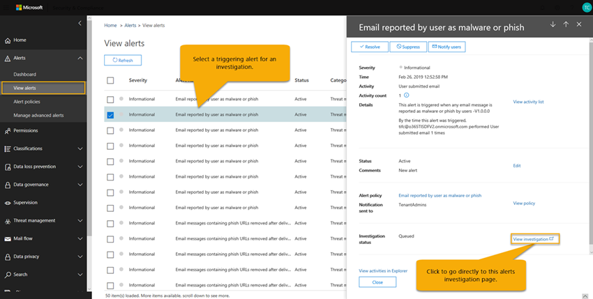

# Automatische Untersuchung und Reaktion (Air) in Office 365Automated investigation and response (AIR) in Office 365

Wenn Sicherheitswarnungen ausgelöst werden, liegt es an Ihrem Sicherheits Betriebsteam, diese Warnungen zu untersuchen und Maßnahmen zum Schutz Ihrer Organisation zu ergreifen.As security alerts are triggered, it's up to your security operations team to look into those alerts and take steps to protect your organization. Manchmal können sich Sicherheits Operations Teams von der Menge der ausgelösten Warnungen überfordert fühlen.Sometimes, security operations teams can feel overwhelmed by the volume of alerts that are triggered. Die Funktionen für die automatische Untersuchung und Reaktion (Air) in Office 365 können helfen.Automated investigation and response (AIR) capabilities in Office 365 can help. Mit Air kann Ihr Security Operations-Team effizienter und effektiver arbeiten.AIR enables your security operations team to operate more efficiently and effectively. Air-Funktionen umfassen automatisierte Ermittlungsprozesse als Reaktion auf bekannte Bedrohungen, die heute vorhanden sind.AIR capabilities include automated investigation processes in response to well known threats that exist today. Geeignete Korrekturaktionen warten auf die Genehmigung, sodass Ihr Sicherheits Betriebsteam auf erkannte Bedrohungen reagieren kann.Appropriate remediation actions await approval, enabling your security operations team to respond to detected threats. 

Dieser Artikel bietet eine Übersicht über Air und die dazugehörigen Komponenten.This article provides an overview of AIR and its components. Wenn Sie mit der Verwendung von Air beginnen möchten, finden Sie weitere Informationen unter [Automatisches untersuchen und reagieren auf Bedrohungen in Office 365](office-365-air.md).When you're ready to get started using AIR, see [Automatically investigate and respond to threats in Office 365](office-365-air.md).

> [!TIP]
> Verwenden Sie Microsoft 365 E5 oder Microsoft 365 E3 zusammen mit Identitäts- und Bedrohungsschutz?Do you have Microsoft 365 E5 or Microsoft 365 E3 together with Identity & Threat Protection? Erwägen Sie, [Microsoft Threat Protection](../mtp/microsoft-threat-protection.md) zu testen.Consider trying [Microsoft Threat Protection](../mtp/microsoft-threat-protection.md).

## Auf einer hohen EbeneAt a high level

Wenn Warnungen ausgelöst werden, treten Sicherheits-Textbuch in Kraft.As alerts are triggered, security playbooks go into effect. Je nach Situation kann ein [automatischer Ermittlungsprozess](https://docs.microsoft.com/microsoft-365/security/office-365-security/office-365-air) beginnen.Depending on the situation, an [automated investigation process](https://docs.microsoft.com/microsoft-365/security/office-365-security/office-365-air) can begin. Während und nach einer automatischen Untersuchung werden [Korrekturaktionen](air-remediation-actions.md) empfohlen.During and after an automated investigation, [remediation actions](air-remediation-actions.md) are recommended. In Office 365 Advanced Threat Protection werden keine Aktionen automatisch durchgeführt.No actions are taken automatically in Office 365 Advanced Threat Protection. Ihr Security Operations-Team überprüft, und [genehmigt oder lehnt dann jede Korrekturaktion](air-remediation-actions.md#approve-or-reject-pending-actions)ab, und wenn dies geschieht, wird jede Untersuchung abgeschlossen.Your security operations team reviews, and then [approves or rejects each remediation action](air-remediation-actions.md#approve-or-reject-pending-actions), and when this is done, each investigation completes. Alle diese Aktivitäten werden nachverfolgt und im Office 365 Security & Compliance Center angezeigt (siehe [Details einer Untersuchung anzeigen](air-view-investigation-results.md#view-details-of-an-investigation)).All of these activities are tracked and viewable in the Office 365 Security & Compliance Center (see [View details of an investigation](air-view-investigation-results.md#view-details-of-an-investigation)).

Die folgenden Abschnitte enthalten weitere Informationen zu Warnungen, Sicherheits handschreibungen und Beispiele für Luft in Aktion.The following sections provide more details about alerts, security playbooks, and examples of AIR in action.

## WarnungenAlerts

[Warnungen](../../compliance/alert-policies.md#viewing-alerts) stellen Auslöser für Sicherheitsvorgänge-Team Workflows für die Vorfall Antwort dar.[Alerts](../../compliance/alert-policies.md#viewing-alerts) represent triggers for security operations team workflows for incident response. Priorisieren des richtigen Warnungs Satzes für die Untersuchung, wobei sichergestellt wird, dass keine Bedrohungen unbehandelt sind, ist eine Herausforderung.Prioritizing the right set of alerts for investigation, while making sure no threats are unaddressed is challenging. Wenn Untersuchungen zu Warnungen manuell durchgeführt werden, müssen Sicherheits Betriebsteams Entitäten (beispielsweise Inhalte, Geräte und Benutzer), die von Bedrohungen bedroht sind, jagen und korrelieren.When investigations into alerts are performed manually, Security Operations teams must hunt and correlate entities (such as content, devices and users) at risk from threats. Solche Aufgaben und Workflows können sehr zeitaufwendig sein und umfassen mehrere Tools und Systeme.Such tasks and workflows can be very time consuming and involve multiple tools and systems. Mit Air werden Untersuchungen und Antworten für Office 365 Sicherheitsereignisse automatisiert, indem wichtige Sicherheits-und Bedrohungsmanagement-Warnungen automatisch Sicherheitsantwort-Textbuch auslösen.With AIR, investigation and response for Office 365 security events are automated by having key security and threat management alerts trigger security response playbooks automatically. 

Derzeit werden Warnungen, die aus den folgenden Arten von Warnungsrichtlinien generiert werden, automatisch untersucht:Currently for AIR, alerts generated from the following kinds of alert policies are auto-investigated:  

- Ein potenziell böswilliger URL-Klick wurde erkannt.A potentially malicious URL click was detected
- Vom Benutzer als Phishing gemeldete e-Mail \*Email reported by user as phish\*
- E-Mail-Nachrichten mit Schadsoftware nach der Zustellung entfernt \*Email messages containing malware removed after delivery\*
- E-Mail-Nachrichten mit gelöschten Phishing-URLs nach der Zustellung \*Email messages containing phish URLs removed after delivery\*
- Erkannte verdächtige e-Mail-Sende Muster #Suspicious email sending patterns detected#
- Benutzer vom Senden von e-Mails eingeschränkt #User restricted from sending email#

> [!NOTE]
> Die mit einem Sternchen (\*) gekennzeichneten Warnungen werden in den jeweiligen Warnungsrichtlinien im Security & Compliance Center mit einem *Informations* Schweregrad versehen, wobei e-Mail-Benachrichtigungen deaktiviert sind.The alerts marked with an asterisk (\*) are assigned an *Informational* severity in the respective alert policies within the Security & Compliance Center, with email notifications turned off. E-Mail-Benachrichtigungen können über die [Warnungsrichtlinien Konfiguration](../../compliance/alert-policies.md#alert-policy-settings)aktiviert werden.Email notifications can be turned on through [Alert policy configuration](../../compliance/alert-policies.md#alert-policy-settings). Mit einem Hash (#) gekennzeichnete Warnungen sind allgemein verfügbare Warnungen für öffentliche Vorschau-Textbuch.Alerts marked with a hash (#) are generally available alerts associated with public preview playbooks.

Um Warnungen anzuzeigen **, wählen Sie** > im Security & Compliance Center Benachrichtigungen**anzeigen Warnungen**aus.To view alerts, in the Security & Compliance Center, choose **Alerts** > **View alerts**. Wählen Sie eine Warnung aus, um die Details anzuzeigen, und verwenden Sie dann den Link **Untersuchung anzeigen** , um zur entsprechenden [Untersuchung](air-view-investigation-results.md#investigation-graph)zu gelangen.Select an alert to view its details, and from there, use the **View investigation** link to go to the corresponding [investigation](air-view-investigation-results.md#investigation-graph).  

> [!NOTE]
> Informationswarnungen werden standardmäßig in der Warnungsansicht ausgeblendet.Informational alerts are hidden in the alert view by default. Um diese anzuzeigen, ändern Sie die Warnungsfilterung so, dass Sie Informationswarnungen einschließt.To see them, change the alert filtering to include informational alerts.

Wenn Ihre Organisation ihre Sicherheitswarnungen über ein Warnungsverwaltungssystem, ein Dienst Verwaltungssystem oder ein System für die Verwaltung von Sicherheitsinformationen und Ereignissen verwaltet, können Sie Office 365 Warnungen entweder per e-Mail-Benachrichtigung oder über die [Office 365 Verwaltungs Aktivitäts-API](https://docs.microsoft.com/office/office-365-management-api/office-365-management-activity-api-reference)an dieses System senden.If your organization manages your security alerts through an alert management system, service management system, or Security Information and Event Management (SIEM) system, you can send Office 365 alerts to that system via either email notification or via the [Office 365 Management Activity API](https://docs.microsoft.com/office/office-365-management-api/office-365-management-activity-api-reference). Die Untersuchung von Benachrichtigungs Benachrichtigungen per e-Mail oder API enthält Links für den Zugriff auf die Warnungen im Security & Compliance Center, sodass der zugewiesene Sicherheitsadministrator schnell zu der Untersuchung navigieren kann.The investigation alert notifications via email or API include links to access the alerts in the Security & Compliance Center, enabling the assigned security administrator to navigate quickly to the investigation.

 

## Sicherheits-ManuskripteSecurity playbooks

Sicherheits-Textbuch sind Back-End-Richtlinien, die im Mittelpunkt der Automatisierung in Office Advanced Threat Protection und Microsoft Threat Protection stehen.Security playbooks are back-end policies that are at the heart of automation in Office Advanced Threat Protection and Microsoft Threat Protection. Die in Air bereitgestellten Sicherheits-Textbuch basieren auf gängigen realen Sicherheitsszenarien und werden auf der Grundlage von Feedback aus Sicherheits Betriebsteams entwickelt.The security playbooks provided in AIR are based on common real-world security scenarios and developed based on feedback from Security Operations teams. Ein Sicherheits Textbuch wird automatisch gestartet, wenn in Ihrer Organisation bestimmte Warnungen ausgelöst werden.A security playbook is launched automatically when specific alerts are triggered within your organization. Sobald die Warnung ausgelöst wird, wird das zugehörige Textbuch vom System für die automatische Untersuchung und Reaktion (Air) ausgeführt.Once the alert triggers, the associated playbook is run by the Automated Investigation and Response (AIR) system. Die Untersuchung erfolgt durch eine Analyse der Warnung basierend auf dem Textbuch der jeweiligen Warnung, wobei alle zugehörigen Metadaten (einschließlich e-Mail-Nachrichten, Benutzer, Subjekte, Absender usw.) untersucht werden.The investigation steps through analysis of the alert based on that particular alert's playbook, looking at all the associated metadata (including email messages, users, subjects, senders, etc.). Basierend auf den Ergebnissen der Untersuchung des Textbuch empfiehlt Air eine Reihe von Aktionen, die das Sicherheitsteam Ihrer Organisation ausführen kann, um die Bedrohung zu steuern und zu mindern.Based on the investigation playbook's findings, AIR recommends a set of actions that your organization's security team can take to control and mitigate the threat. 

Die Sicherheits-Textbuch-Dokumente, die Sie mit Air erhalten, wurden entwickelt, um die häufigsten Bedrohungen zu bewältigen, mit denen Organisationen heute mit e-Mails konfrontiert sind.The security playbooks you'll get with AIR are designed to tackle the most frequent threats that organizations encounter today with email. Sie basieren auf Eingaben aus Sicherheits-und Vorfall Reaktions Teams, einschließlich derer, die die Verteidigung von Microsoft und den Ressourcen unserer Kunden unterstützen.They're based on input from Security Operations and Incident Response teams, including those who help defend Microsoft and our customers' assets.

### Sicherheits-Textbuch-Rollen in PhasenSecurity playbooks are rolling out in phases

Im Rahmen von Air werden Sicherheits-Textbuch in Phasen ausgerollt.As part of AIR, security playbooks are rolling out in phases. Phase 1 ist jetzt allgemein verfügbar und enthält mehrere Textbuch, die Empfehlungen für Aktionen enthalten, die Sicherheitsadministratoren überprüfen und genehmigen können:Phase 1 is now generally available and includes several playbooks that provide recommendations for actions that security administrators can review and approve:
- Vom Benutzer gemeldete Phishing-NachrichtUser-reported phish message
- Änderung des URL-Klick UrteilsURL click verdict change
- Erkannte Schadsoftware nach der Zustellung (Malware zap)Malware detected post-delivery (Malware ZAP)
- Phishing-Erkennung nach der Zustellung zap (Phishing zap)Phish detected post-delivery ZAP (Phish ZAP)

Phase 1 enthält auch Unterstützung für von Administratoren ausgelöste e-Mail-Untersuchungen (mithilfe von [Threat Explorer](threat-explorer.md)).Phase 1 also includes support for administrator triggered e-mail investigations (using [Threat Explorer](threat-explorer.md)).

Phase 2 wird nun mit den folgenden Textbuch in der **öffentlichen Vorschau**fortgesetzt, wobei Empfehlungen für Aktionen und Sicherheitsadministratoren bei der Untersuchung von Problemen gegeben werden:Phase 2 is now progress with the following playbooks in **public preview**, providing recommendations for actions and aiding security administrators in investigating issues:
- Als kompromittiert gemeldeter Benutzer (öffentliche Vorschau)User reported as compromised (public preview)

Weitere Textbuch werden als abgeschlossen veröffentlicht.Further playbooks will be released as they are completed. Besuchen Sie die [Microsoft 365-Roadmap](https://www.microsoft.com/microsoft-365/roadmap) , um zu sehen, was noch geplant ist und demnächst verfügbar ist.Visit the [Microsoft 365 Roadmap](https://www.microsoft.com/microsoft-365/roadmap) to see what else is planned and coming soon.

### Manuskripte umfassen Untersuchungen und EmpfehlungenPlaybooks include investigation and recommendations

In der Luft umfasst jedes Sicherheits-Textbuch Folgendes:In AIR, each security playbook includes: 
- eine Stamm Untersuchung der Entitäten einer e-Mail (Dateien, URLs, Empfänger, IP-Adressen usw.),a root investigation of an email's entities (files, URLs, recipients, IP addresses, etc.),
- Weitere Jagd auf ähnliche e-Mails, die von der Organisation empfangen werdenfurther hunting for similar emails received by the organization 
- Schritte zum Identifizieren und korrelieren anderer potenzieller Bedrohungen undsteps taken to identify and correlate other potential threats, and 
- Empfohlene Aktionen zur Behebung von Bedrohungen.recommended threat remediation actions.

Jeder allgemeine Schritt enthält eine Reihe von unterschritten, die ausgeführt werden, um eine Tiefe, detaillierte und erschöpfende Antwort auf Bedrohungen bereitzustellen.Each high-level step includes a number of substeps that are executed to provide a deep, detailed, and exhaustive response to threats.

## Beispiel: eine von einem Benutzer gemeldete Phishing-Nachricht startet eine Untersuchung des ManuskriptsExample: A user-reported phish message launches an investigation playbook

Wenn ein Benutzer in Ihrer Organisation eine e-Mail-Nachricht übermittelt und an Microsoft mithilfe des [Berichtsnachrichten-Add-Ins für Outlook oder Outlook Web App](enable-the-report-message-add-in.md)meldet, wird der Bericht auch an Ihr System gesendet und im Explorer in der vom Benutzer gemeldeten Ansicht angezeigt.When a user in your organization submits an email message and reports it to Microsoft by using the [Report Message add-in for Outlook or Outlook Web App](enable-the-report-message-add-in.md), the report is also sent to your system and is visible in Explorer in the User-reported view. Diese vom Benutzer gemeldete Nachricht löst jetzt eine System basierte Informationswarnung aus, die das unter suchbuch automatisch startet.This user-reported message now triggers a system-based informational alert, which automatically launches the investigation playbook.

Während der Stamm Untersuchungsphase werden verschiedene Aspekte der e-Mail bewertet.During the root investigation phase, various aspects of the email are assessed. Zu diesen zählen:These include:
- Eine Bestimmung darüber, welche Art von Bedrohung es sein könnte;A determination about what type of threat it might be;
- AbsenderWho sent it;
- Woher die e-Mail gesendet wurde (sendende Infrastruktur);Where the email was sent from (sending infrastructure);
- Gibt an, ob andere Instanzen der e-Mail zugestellt oder blockiert wurden;Whether other instances of the email were delivered or blocked;
- Eine Bewertung durch unsere Analysten;An assessment from our analysts;
- Gibt an, ob die e-Mail bekannten Kampagnen zugeordnet ist;Whether the email is associated with any known campaigns;
- und vieles mehr.and more.

Nachdem die Stamm Untersuchung abgeschlossen ist, enthält das Textbuch eine Liste der empfohlenen Aktionen, die für die ursprünglichen e-Mail-Objekte und zugehörigen Entitäten übernommen werden sollen.After the root investigation is complete, the playbook provides a list of recommended actions to take on the original email and entities associated with it.
  
Im nächsten Schritt werden mehrere Schritte zur Ermittlung und Jagd von Bedrohungen ausgeführt:Next, several threat investigation and hunting steps are executed:

- Ähnliche e-Mail-Nachrichten werden über e-Mail-Cluster Suchvorgänge identifiziert.Similar email messages are identified via email cluster searches.
- Das Signal wird für andere Plattformen wie [Microsoft Defender ATP](https://docs.microsoft.com/windows/security/threat-protection/microsoft-defender-atp/microsoft-defender-advanced-threat-protection)freigegeben.The signal is shared with other platforms, such as [Microsoft Defender ATP](https://docs.microsoft.com/windows/security/threat-protection/microsoft-defender-atp/microsoft-defender-advanced-threat-protection).
- Es wird festgestellt, ob Benutzer in verdächtigen e-Mail-Nachrichten auf böswillige Links geklickt haben.A determination is made on whether any users have clicked through any malicious links in suspicious email messages.
- Eine Überprüfung erfolgt über Office 365 Exchange Online Protection ([EoP](exchange-online-protection-eop.md)) und Office 365 Advanced Threat Protection ([ATP](office-365-atp.md)), um zu sehen, ob andere ähnliche Nachrichten von Benutzern gemeldet werden.A check is done across Office 365 Exchange Online Protection ([EOP](exchange-online-protection-eop.md)) and Office 365 Advanced Threat Protection ([ATP](office-365-atp.md)) to see if there are any other similar messages reported by users.
- Eine Überprüfung wird durchgeführt, um festzustellen, ob ein Benutzer kompromittiert wurde.A check is done to see if a user has been compromised. Bei dieser Überprüfung werden Signale in Bezug auf Office 365, [Microsoft Cloud-App-Sicherheit](https://docs.microsoft.com/cloud-app-security)und [Azure-Active Directory](https://docs.microsoft.com/azure/active-directory)verwendet, sodass alle zugehörigen Anomalien bei Benutzeraktivitäten korreliert werden.This check leverages signals across Office 365, [Microsoft Cloud App Security](https://docs.microsoft.com/cloud-app-security), and [Azure Active Directory](https://docs.microsoft.com/azure/active-directory), correlating any related user activity anomalies. 

Während der Jagd Phase werden Risiken und Bedrohungen verschiedenen Jagd Schritten zugeordnet.During the hunting phase, risks and threats are assigned to various hunting steps. 

Die Korrektur ist die letzte Phase des Textbuch.Remediation is the final phase of the playbook. In dieser Phase werden korrekturschritte basierend auf den Ermittlungs-und Jagd Phasen durchgeführt.During this phase, remediation steps are taken, based on the investigation and hunting phases. 

## Beispiel: ein Sicherheitsadministrator löst eine Untersuchung mit Threat Explorer aus.Example: A security administrator triggers an investigation from Threat Explorer

Zusätzlich zu den automatischen Untersuchungen, die durch eine Warnung ausgelöst werden, kann das Sicherheits Betriebsteam Ihrer Organisation eine automatische Untersuchung aus einer Ansicht in [Threat Explorer](threat-explorer.md)auslösen.In addition to automatic investigations that are triggered by an alert, your organization's security operations team can trigger an automatic investigation from a view in [Threat Explorer](threat-explorer.md).

Nehmen wir beispielsweise an, dass Sie Daten im Explorer zu vom Benutzer gemeldeten Nachrichten anzeigen.For example, suppose that you are viewing data in Explorer about user-reported messages. Sie können ein Element in der Ergebnisliste auswählen und dann im Menü Aktion auf **Recherchieren** (vorausgesetzt, Sie verfügen über entsprechende Korrektur Berechtigungen).You can select an item in the list of results, and then click **Investigate** from the action menu (assuming you have appropriate remediation permissions).

Nehmen Sie als weiteres Beispiel an, dass Sie Daten zu e-Mail-Nachrichten anzeigen, die als Schadsoftware erkannt wurden, und dass mehrere e-Mail-Nachrichten als Schadsoftware erkannt werden.As another example, suppose you are viewing data about email messages detected as containing malware, and there are several email messages detected as containing malware. Sie können die Registerkarte **e-Mail** auswählen, eine oder mehrere e-Mail-Nachrichten auswählen und dann im Menü **Aktionen** die Option **untersuchen**auswählen.You can select the **Email** tab, select one or more email messages, and then, on the **Actions** menu, select **Investigate**. 

Ähnlich wie Textbuch, die durch eine Warnung ausgelöst werden, umfassen automatische Untersuchungen, die aus einer Ansicht im Explorer ausgelöst werden, eine Stamm Ermittlung, Schritte zum Identifizieren und Korrelieren von Bedrohungen sowie Empfohlene Aktionen zur Minderung dieser Bedrohungen.Similar to playbooks triggered by an alert, automatic investigations that are triggered from a view in Explorer include a root investigation, steps to identify and correlate threats, and recommended actions to mitigate those threats.

## So erhalten Sie LuftHow to get AIR

Office 365 AIR ist in den folgenden Abonnements enthalten:Office 365 AIR is included in the following subscriptions:

- Microsoft 365 E5Microsoft 365 E5
- Office 365 E5Office 365 E5
- Microsoft Threat ProtectionMicrosoft Threat Protection
- Office 365 Advanced Threat Protection Plan 2Office 365 Advanced Threat Protection Plan 2

Wenn Sie keines dieser Abonnements haben, [Starten Sie eine kostenlose Testversion](https://go.microsoft.com/fwlink/p/?LinkID=698279&culture=en-US&country=US).If you don't have any of these subscriptions, [start a free trial](https://go.microsoft.com/fwlink/p/?LinkID=698279&culture=en-US&country=US).

Weitere Informationen zur Verfügbarkeit von Features finden Sie unter [Verfügbarkeit von Features über erweiterte Threat Protection (ATP)-Pläne](https://docs.microsoft.com/office365/servicedescriptions/office-365-advanced-threat-protection-service-description#feature-availability-across-advanced-threat-protection-atp-plans).To learn more about feature availability, visit the [Feature availability across Advanced Threat Protection (ATP) plans](https://docs.microsoft.com/office365/servicedescriptions/office-365-advanced-threat-protection-service-description#feature-availability-across-advanced-threat-protection-atp-plans).

## Erforderliche Berechtigungen für die Verwendung von Air-FunktionenRequired permissions to use AIR capabilities

Berechtigungen werden über bestimmte Rollen erteilt, wie Sie in der folgenden Tabelle beschrieben werden:Permissions are granted through certain roles, such as those that are described in the following table: 

|AufgabeTask |Erforderliche Rolle (n)Role(s) required |
|--|--|
|So richten Sie Air-Features einTo set up AIR features |Eine der folgenden Rollen:One of the following roles:  - **Globaler Administrator**- **Global Administrator** - **Sicherheits Administrator**- **Security Administrator**  Diese Rollen können in [Azure Active Directory](https://docs.microsoft.com/azure/active-directory/users-groups-roles/directory-assign-admin-roles) oder im [Office 365 Security & Compliance Center](https://docs.microsoft.com/microsoft-365/security/office-365-security/permissions-in-the-security-and-compliance-center)zugewiesen werden.These roles can be assigned in [Azure Active Directory](https://docs.microsoft.com/azure/active-directory/users-groups-roles/directory-assign-admin-roles) or in the [Office 365 Security & Compliance Center](https://docs.microsoft.com/microsoft-365/security/office-365-security/permissions-in-the-security-and-compliance-center). |
|So genehmigen oder ablehnen Sie Empfohlene AktionenTo approve or reject recommended actions|Eine der folgenden Rollen, die in [Azure Active Directory](https://docs.microsoft.com/azure/active-directory/users-groups-roles/directory-assign-admin-roles) oder im [Compliance Center von Office 365 Security &](https://docs.microsoft.com/microsoft-365/security/office-365-security/permissions-in-the-security-and-compliance-center)) zugewiesen ist:One of the following roles, assigned in [Azure Active Directory](https://docs.microsoft.com/azure/active-directory/users-groups-roles/directory-assign-admin-roles) or in the [Office 365 Security & Compliance Center](https://docs.microsoft.com/microsoft-365/security/office-365-security/permissions-in-the-security-and-compliance-center)): - **Globaler Administrator**- **Global Administrator**  - **Sicherheits Administrator**- **Security Administrator** - **Sicherheits Leser**- **Security Reader**  --- und ------ and --- - **Suchen und löschen** (diese Rolle wird nur im [Office 365 Security & Compliance Center](https://docs.microsoft.com/microsoft-365/security/office-365-security/permissions-in-the-security-and-compliance-center)zugewiesen.- **Search and Purge** (this role is assigned only in the [Office 365 Security & Compliance Center](https://docs.microsoft.com/microsoft-365/security/office-365-security/permissions-in-the-security-and-compliance-center). Möglicherweise müssen Sie dort eine neue Rollengruppe erstellen und die Such-und Lösch Rolle dieser neuen Rollengruppe hinzufügen.)You might have to create a new role group there and add the Search and Purge role to that new role group.)

## Nächste SchritteNext steps

- [Erste Schritte mit Air in Office 365Get started using AIR in Office 365](office-365-air.md)

- [Besuchen Sie die Microsoft 365-Roadmap, um zu sehen, was bald kommt und wie Sie RollenVisit the Microsoft 365 Roadmap to see what's coming soon and rolling out](https://www.microsoft.com/microsoft-365/roadmap?filters=)

