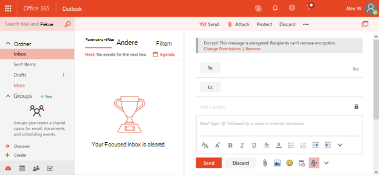

# <a name="protection-features-in-azure-information-protection-rolling-out-to-existing-tenants"></a><span data-ttu-id="8f485-103">Schutzfunktionen in Azure Information Protection, die für vorhandene Mandanten bereitstellen</span><span class="sxs-lookup"><span data-stu-id="8f485-103">Protection features in Azure Information Protection rolling out to existing tenants</span></span>

<span data-ttu-id="8f485-104">Um mit dem ersten Schritt beim Schutz Ihrer Informationen zu helfen, werden ab Juli 2018 alle Azure Information Protection-berechtigten Mandanten die Schutzfunktionen in Azure Information Protection standardmäßig aktiviert haben.</span><span class="sxs-lookup"><span data-stu-id="8f485-104">To help with the initial step in protecting your information, starting July 2018 all Azure Information Protection eligible tenants will have the protection features in Azure Information Protection turned on by default.</span></span> <span data-ttu-id="8f485-105">Die Schutzfunktionen in Azure Information Protection waren früher in Office 365 als Rights Management oder Azure RMS bekannt.</span><span class="sxs-lookup"><span data-stu-id="8f485-105">The protection features in Azure Information Protection were formerly known in Office 365 as Rights Management or Azure RMS.</span></span> <span data-ttu-id="8f485-106">Wenn Ihre Organisation über einen Office E3-Dienstplan oder einen höheren Service Plan verfügt, erhalten Sie jetzt einen Head-Start Schutz für Informationen durch Azure Information Protection, wenn wir diese Features bereitstellen.</span><span class="sxs-lookup"><span data-stu-id="8f485-106">If your organization has an Office E3 service plan or a higher service plan you will now get a head start protecting information through Azure Information Protection when we roll out these features.</span></span>

## <a name="changes-beginning-july-1-2018"></a><span data-ttu-id="8f485-107">Änderungen beginnen am 1. Juli 2018</span><span class="sxs-lookup"><span data-stu-id="8f485-107">Changes beginning July 1, 2018</span></span>

<span data-ttu-id="8f485-108">Ab dem 1. Juli 2018 wird Microsoft die Schutzfunktion in Azure Information Protection für alle Organisationen mit einem der folgenden Abonnement Pläne aktivieren:</span><span class="sxs-lookup"><span data-stu-id="8f485-108">Starting July 1, 2018, Microsoft will enable the protection capability in Azure Information Protection for all organizations with one of the following subscription plans:</span></span>

- <span data-ttu-id="8f485-109">Office 365 Nachrichtenverschlüsselung wird im Rahmen von Office 365 E3 und E5, Microsoft E3 und E5, Office 365 a1, a3 und A5 sowie Office 365 G3 und G5 angeboten.</span><span class="sxs-lookup"><span data-stu-id="8f485-109">Office 365 Message Encryption is offered as part of Office 365 E3 and E5, Microsoft E3 and E5, Office 365 A1, A3, and A5, and Office 365 G3 and G5.</span></span> <span data-ttu-id="8f485-110">Sie benötigen keine zusätzlichen Lizenzen, um die neuen Schutzfunktionen zu erhalten, die von Azure Information Protection betrieben werden.</span><span class="sxs-lookup"><span data-stu-id="8f485-110">You do not need additional licenses to receive the new protection capabilities powered by Azure Information Protection.</span></span>

- <span data-ttu-id="8f485-111">Sie können auch Azure Information Protection Plan 1 zu den folgenden Plänen hinzufügen, um die neuen Office 365 Nachrichten Verschlüsselungsfunktionen zu erhalten: Exchange Online Plan 1, Exchange Online Plan 2, Office 365 F1, Microsoft 365 Business Basic, Microsoft 365 Business Standard oder Office 365 Enterprise E1.</span><span class="sxs-lookup"><span data-stu-id="8f485-111">You can also add Azure Information Protection Plan 1 to the following plans to receive the new Office 365 Message Encryption capabilities: Exchange Online Plan 1, Exchange Online Plan 2, Office 365 F1, Microsoft 365 Business Basic, Microsoft 365 Business Standard, or Office 365 Enterprise E1.</span></span>

- <span data-ttu-id="8f485-112">Jeder Benutzer, der von Office 365 Nachrichtenverschlüsselung profitiert, muss lizenziert sein, damit er von der Funktion abgedeckt wird.</span><span class="sxs-lookup"><span data-stu-id="8f485-112">Each user benefiting from Office 365 Message Encryption needs to be licensed to be covered by the feature.</span></span>

- <span data-ttu-id="8f485-113">Die vollständige Liste finden Sie in den [Exchange Online Dienstbeschreibungen](https://docs.microsoft.com/office365/servicedescriptions/exchange-online-service-description/exchange-online-service-description) für Office 365 Nachrichtenverschlüsselung.</span><span class="sxs-lookup"><span data-stu-id="8f485-113">For the full list, see the [Exchange Online service descriptions](https://docs.microsoft.com/office365/servicedescriptions/exchange-online-service-description/exchange-online-service-description) for Office 365 Message Encryption.</span></span>

<span data-ttu-id="8f485-114">Mandantenadministratoren können den Schutzstatus im Office 365 Administratorportal überprüfen.</span><span class="sxs-lookup"><span data-stu-id="8f485-114">Tenant administrators can check the protection status in the Office 365 administrator portal.</span></span>


## <a name="why-are-we-making-this-change"></a><span data-ttu-id="8f485-116">Warum machen wir diese Änderung?</span><span class="sxs-lookup"><span data-stu-id="8f485-116">Why are we making this change?</span></span>

<span data-ttu-id="8f485-117">Office 365 Nachrichtenverschlüsselung nutzt die Schutzfunktionen in Azure Information Protection.</span><span class="sxs-lookup"><span data-stu-id="8f485-117">Office 365 Message Encryption leverages the protection capabilities in Azure Information Protection.</span></span> <span data-ttu-id="8f485-118">Im Mittelpunkt der jüngsten Verbesserungen an Office 365 Nachrichtenverschlüsselung und unserer umfassenderen Investitionen in den Informationsschutz in Microsoft 365 ist es für Organisationen einfacher, unsere Schutzfunktionen zu aktivieren und zu nutzen, da Verschlüsselungstechnologien historisch gesehen schwer einzurichten sind.</span><span class="sxs-lookup"><span data-stu-id="8f485-118">At the heart of the recent improvements to Office 365 Message Encryption and our broader investments to information protection in Microsoft 365, we are making it easier for organizations to turn on and use our protection capabilities, as historically, encryption technologies have been difficult to set up.</span></span> <span data-ttu-id="8f485-119">Wenn Sie die Schutzfunktionen in Azure Information Protection standardmäßig aktivieren, können Sie schnell mit dem Schutz Ihrer vertraulichen Daten beginnen.</span><span class="sxs-lookup"><span data-stu-id="8f485-119">By turning on the protection features in Azure Information Protection by default, you can quickly get started to protect your sensitive data.</span></span>

## <a name="does-this-impact-me"></a><span data-ttu-id="8f485-120">Wirkt sich dies auf mich aus?</span><span class="sxs-lookup"><span data-stu-id="8f485-120">Does this impact me?</span></span>

<span data-ttu-id="8f485-121">Wenn Ihre Organisation eine berechtigte Office 365 Lizenz erworben hat, wird Ihr Mandant von dieser Änderung betroffen sein.</span><span class="sxs-lookup"><span data-stu-id="8f485-121">If your organization has purchased an eligible Office 365 license, then your tenant will be impacted by this change.</span></span>

 <span data-ttu-id="8f485-122">**Wichtig!**</span><span class="sxs-lookup"><span data-stu-id="8f485-122">**IMPORTANT!**</span></span> <span data-ttu-id="8f485-123">Wenn Sie Active Directory Rights Management Services (AD RMS) in Ihrer lokalen Umgebung verwenden, müssen Sie entweder diese Änderung sofort deaktivieren oder zu Azure Information Protection migrieren, bevor wir diese Änderung innerhalb der nächsten 30 Tage ausführen.</span><span class="sxs-lookup"><span data-stu-id="8f485-123">If you're using Active Directory Rights Management Services (AD RMS) in your on-premises environment, you must either opt-out of this change immediately or migrate to Azure Information Protection before we roll out this change within the next 30 days.</span></span> <span data-ttu-id="8f485-124">Informationen zum Deaktivieren von finden Sie unter "Ich verwende AD RMS, wie kann ich mich abmelden?"</span><span class="sxs-lookup"><span data-stu-id="8f485-124">For information on how to opt-out, see "I use AD RMS, how do I opt out?"</span></span> <span data-ttu-id="8f485-125">weiter unten in diesem Artikel.</span><span class="sxs-lookup"><span data-stu-id="8f485-125">later in this article.</span></span> <span data-ttu-id="8f485-126">Wenn Sie lieber migrieren möchten, lesen Sie [Migrieren von AD RMS zu Azure Information Protection.](https://docs.microsoft.com/azure/information-protection/plan-design/migrate-from-ad-rms-to-azure-rms)</span><span class="sxs-lookup"><span data-stu-id="8f485-126">If you prefer to migrate, see [Migrating from AD RMS to Azure Information Protection.](https://docs.microsoft.com/azure/information-protection/plan-design/migrate-from-ad-rms-to-azure-rms)</span></span>

## <a name="can-i-use-azure-information-protection-with-active-directory-rights-management-services-ad-rms"></a><span data-ttu-id="8f485-127">Kann ich Azure Information Protection mit Active Directory Rights Management Services (AD RMS) verwenden?</span><span class="sxs-lookup"><span data-stu-id="8f485-127">Can I use Azure Information Protection with Active Directory Rights Management Services (AD RMS)?</span></span>

<span data-ttu-id="8f485-128">Nein.</span><span class="sxs-lookup"><span data-stu-id="8f485-128">No.</span></span> <span data-ttu-id="8f485-129">Dies ist kein unterstütztes Bereitstellungsszenario.</span><span class="sxs-lookup"><span data-stu-id="8f485-129">This is not a supported deployment scenario.</span></span> <span data-ttu-id="8f485-130">Ohne die zusätzlichen Opt-out-Schritte verwenden einige Computer möglicherweise automatisch den Azure Rights Management-Dienst und stellen außerdem eine Verbindung mit Ihrem AD RMS-Cluster her.</span><span class="sxs-lookup"><span data-stu-id="8f485-130">Without taking the additional opt-out steps, some computers might automatically start using the Azure Rights Management service and also connect to your AD RMS cluster.</span></span> <span data-ttu-id="8f485-131">Dieses Szenario wird nicht unterstützt und hat unzuverlässige Ergebnisse, daher ist es wichtig, dass Sie diese Änderung innerhalb der nächsten 30 Tage deaktivieren, bevor wir diese neuen Features bereitstellen.</span><span class="sxs-lookup"><span data-stu-id="8f485-131">This scenario isn't supported and has unreliable results, so it's important that you opt out of this change within the next 30 days before we roll out these new features.</span></span> <span data-ttu-id="8f485-132">Informationen zum Deaktivieren von finden Sie unter "Ich verwende AD RMS, wie kann ich mich abmelden?"</span><span class="sxs-lookup"><span data-stu-id="8f485-132">For information on how to opt-out, see "I use AD RMS, how do I opt out?"</span></span> <span data-ttu-id="8f485-133">weiter unten in diesem Artikel.</span><span class="sxs-lookup"><span data-stu-id="8f485-133">later in this article.</span></span> <span data-ttu-id="8f485-134">Wenn Sie lieber migrieren möchten, lesen Sie [Migrieren von AD RMS zu Azure Information Protection.](https://docs.microsoft.com/azure/information-protection/plan-design/migrate-from-ad-rms-to-azure-rms)</span><span class="sxs-lookup"><span data-stu-id="8f485-134">If you prefer to migrate, see [Migrating from AD RMS to Azure Information Protection.](https://docs.microsoft.com/azure/information-protection/plan-design/migrate-from-ad-rms-to-azure-rms)</span></span>

## <a name="how-do-i-know-if-im-using-ad-rms"></a><span data-ttu-id="8f485-135">Wie kann ich feststellen, ob ich AD RMS verwende?</span><span class="sxs-lookup"><span data-stu-id="8f485-135">How do I know if I'm using AD RMS?</span></span>

<span data-ttu-id="8f485-136">Verwenden Sie diese Anweisungen aus [dem Vorbereiten der Umgebung für Azure Rights Management, wenn Sie auch Active Directory Rights Management Services (AD RMS) haben](https://docs.microsoft.com/azure/information-protection/deploy-use/prepare-environment-adrms) , um zu überprüfen, ob Sie AD RMS bereitgestellt haben:</span><span class="sxs-lookup"><span data-stu-id="8f485-136">Use these instructions from [Preparing the environment for Azure Rights Management when you also have Active Directory Rights Management Services (AD RMS)](https://docs.microsoft.com/azure/information-protection/deploy-use/prepare-environment-adrms) to check if you have deployed AD RMS:</span></span>

1. <span data-ttu-id="8f485-137">Obwohl optional, veröffentlichen die meisten AD RMS-Bereitstellungen den Dienstverbindungspunkt (Service Connection Points, SCP) für Active Directory, damit Domänencomputer den AD RMS-Cluster ermitteln können.</span><span class="sxs-lookup"><span data-stu-id="8f485-137">Although optional, most AD RMS deployments publish the service connection point (SCP) to Active Directory so that domain computers can discover the AD RMS cluster.</span></span>

<span data-ttu-id="8f485-138">Verwenden Sie die ADSI-Bearbeitung, um festzustellen, ob ein SCP in Active Directory veröffentlicht wurde: CN = Configuration [Servername], CN = Services, CN = RightsManagementServices, CN = SCP</span><span class="sxs-lookup"><span data-stu-id="8f485-138">Use ADSI Edit to see whether you have an SCP published in Active Directory: CN=Configuration [server name], CN=Services, CN=RightsManagementServices, CN=SCP</span></span>

2. <span data-ttu-id="8f485-139">Wenn Sie keinen SCP verwenden, müssen Windows-Computer, die eine Verbindung mit einem AD RMS-Cluster herstellen, für die clientseitige Dienstermittlung oder die Lizenzierungs Umleitung mithilfe der Windows-Registrierung konfiguriert werden: HKEY_LOCAL_MACHINE \software\microsoft\msipc\servicelocation oder HKEY_LOCAL_MACHINE \software\wow6432node\microsoft\msipc\servicelocation</span><span class="sxs-lookup"><span data-stu-id="8f485-139">If you are not using an SCP, Windows computers that connect to an AD RMS cluster must be configured for client-side service discovery or licensing redirection by using the Windows registry: HKEY_LOCAL_MACHINE\SOFTWARE\Microsoft\MSIPC\ServiceLocation or HKEY_LOCAL_MACHINE\SOFTWARE\Wow6432Node\Microsoft\MSIPC\ServiceLocation</span></span>

<span data-ttu-id="8f485-140">Weitere Informationen zu diesen Registrierungs Konfigurationen finden Sie unter [Aktivieren der clientseitigen Dienstermittlung mithilfe der Windows-Registrierung](https://docs.microsoft.com/azure/information-protection/rms-client/client-deployment-notes#enabling-client-side-service-discovery-by-using-the-windows-registry) und [Umleiten des Lizenzierungsserver Datenverkehrs](https://docs.microsoft.com/azure/information-protection/rms-client/client-deployment-notes#redirecting-licensing-server-traffic).</span><span class="sxs-lookup"><span data-stu-id="8f485-140">For more information about these registry configurations, see [Enabling client-side service discovery by using the Windows registry](https://docs.microsoft.com/azure/information-protection/rms-client/client-deployment-notes#enabling-client-side-service-discovery-by-using-the-windows-registry) and [Redirecting licensing server traffic](https://docs.microsoft.com/azure/information-protection/rms-client/client-deployment-notes#redirecting-licensing-server-traffic).</span></span>

## <a name="i-use-ad-rms-how-do-i-opt-out"></a><span data-ttu-id="8f485-141">Ich verwende AD RMS, wie kann ich mich abmelden?</span><span class="sxs-lookup"><span data-stu-id="8f485-141">I use AD RMS, how do I opt out?</span></span>

<span data-ttu-id="8f485-142">Wenn Sie die bevorstehende Änderung deaktivieren möchten, führen Sie die folgenden Schritte aus:</span><span class="sxs-lookup"><span data-stu-id="8f485-142">To opt out of the upcoming change, complete these steps:</span></span>

1. <span data-ttu-id="8f485-143">Verwenden Sie ein Arbeits-oder Schulkonto, das über globale Administratorberechtigungen in Ihrer Organisation verfügt, starten Sie eine Windows PowerShell Sitzung, und stellen Sie eine Verbindung mit Exchange Online her.</span><span class="sxs-lookup"><span data-stu-id="8f485-143">Using a work or school account that has global administrator permissions in your organization, start a Windows PowerShell session and connect to Exchange Online.</span></span> <span data-ttu-id="8f485-144">Anleitungen finden Sie unter [Herstellen einer Verbindung mit Exchange Online PowerShell](https://docs.microsoft.com/powershell/exchange/exchange-online/connect-to-exchange-online-powershell/connect-to-exchange-online-powershell).</span><span class="sxs-lookup"><span data-stu-id="8f485-144">For instructions, see [Connect to Exchange Online PowerShell](https://docs.microsoft.com/powershell/exchange/exchange-online/connect-to-exchange-online-powershell/connect-to-exchange-online-powershell).</span></span>

2. <span data-ttu-id="8f485-145">Führen Sie das Cmdlet "IRMConfiguration" mit der folgenden Syntax aus:</span><span class="sxs-lookup"><span data-stu-id="8f485-145">Run the Set-IRMConfiguration cmdlet using the following syntax:</span></span>

  ```powershell
  Set-IRMConfiguration -AutomaticServiceUpdateEnabled $false
  ```

## <a name="what-can-i-expect-after-this-change-has-been-made"></a><span data-ttu-id="8f485-146">Was kann ich erwarten, nachdem diese Änderung vorgenommen wurde?</span><span class="sxs-lookup"><span data-stu-id="8f485-146">What can I expect after this change has been made?</span></span>

<span data-ttu-id="8f485-147">Sobald diese Option aktiviert ist, können Sie, vorausgesetzt, Sie haben sich nicht entschieden, die neue Version von Office 365 Nachrichtenverschlüsselung verwenden, die bei [Microsoft Ignite 2017](https://techcommunity.microsoft.com/t5/Security-Privacy-and-Compliance/Email-Encryption-and-Rights-Protection/ba-p/110801) angekündigt wurde und die Verschlüsselungs-und Schutzfunktionen von Azure Information Protection nutzt.</span><span class="sxs-lookup"><span data-stu-id="8f485-147">Once this is enabled, provided you haven't opted out, you can start using the new version of Office 365 Message Encryption which was announced at [Microsoft Ignite 2017](https://techcommunity.microsoft.com/t5/Security-Privacy-and-Compliance/Email-Encryption-and-Rights-Protection/ba-p/110801) and leverages the encryption and protection capabilities of Azure Information Protection.</span></span>



<span data-ttu-id="8f485-149">Weitere Informationen zu den neuen Verbesserungen finden Sie unter [Office 365 Nachrichtenverschlüsselung](../../compliance/ome.md).</span><span class="sxs-lookup"><span data-stu-id="8f485-149">For more information about the new enhancements, see [Office 365 Message Encryption](../../compliance/ome.md).</span></span>
