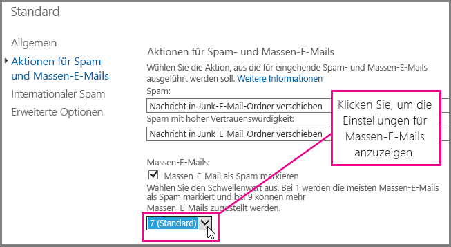
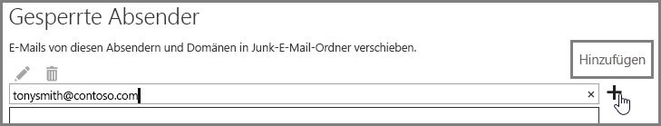

# <a name="customize-the-anti-spam-filter-with-these-settings"></a>Anpassen des Spamfilters mit diesen Einstellungen

Ein Administrator kann mehrere Spamfiltereinstellungen verwenden, um zu verhindern, dass Spam-E-Mails an den Posteingang eines Benutzers gesendet werden. Der Spamfilter ist besser in der Lage, Spam-E-Mail zu blockieren und falsch negative Nachrichten zu verhindern, wenn Sie die hier aufgeführten Optionen verwenden. In diesem Zusammenhang bezieht sich falsch negativ auf Spam-E-Mails oder Junk-Nachrichten, die an den Posteingang eines Benutzers gesendet werden.

## <a name="block-ip-addresses-with-a-connection-filter"></a>Blockieren von IP-Adressen mit einem Verbindungsfilter

Passen Sie Ihren Spamfilter an, indem Sie die Absender-IP-Adresse zur Liste blockierter IP-Adressen für den Verbindungsfilter hinzufügen:

1. Rufen Sie die Kopfzeilen der Nachrichten ab, die Sie in Ihrem E-Mail-Client wie Outlook oder Outlook im Web (früher Outlook Web App) blockieren möchten, wie in [Anzeigen von Internet Nachrichtenkopfzeilen in Outlook](https://support.office.com/article/cd039382-dc6e-4264-ac74-c048563d212c) beschrieben wird.

2. Suchen Sie in der [Nachrichtenkopfanalyse](https://testconnectivity.microsoft.com/?tabid=mha) oder manuell nach der IP-Adresse, die auf das CIP-Tag in der Kopfzeile X-Forefront-Antispam-Report folgt.

3. Fügen Sie die IP-Adresse der IP-Sperrliste hinzu, indem Sie die Schritte unter „Bearbeiten der Standardrichtlinie für Verbindungsfilter mithilfe der Exchange-Verwaltungskonsole“ in [Konfigurieren der Verbindungsfilterrichtlinie](configure-the-connection-filter-policy.md) ausführen.

### <a name="block-bulk-mail-with-mail-flow-rules-transport-rules-or-the-spam-filter"></a>Blockieren von Massensendungen mit E-Mail-Flussregeln (auch als Transportregeln bezeichnet) oder dem Spamfilter

Handelt es sich bei dem Spam in erster Linie um Massensendungen oder um Newsletters oder Werbesendungen? Sie können den Spamfilter anpassen, wenn Sie [E-Mail-Flussregeln verwenden, um das Herausfiltern von Massensendungen zu konfigurieren](use-transport-rules-to-configure-bulk-email-filtering.md), oder die Einstellung **Massensendungen** unter [Erweiterte Einstellungen für den Spamfilter (ASF) in Office 365](advanced-spam-filtering-asf-options.md) des Spamfilters aktivieren. Klicken Sie im Exchange Admin Center zunächst auf **Schutz** \> **Inhaltsfilter**, und doppelklicken Sie dann auf die Filterrichtlinie, die Sie anpassen möchten. Klicken Sie auf **Aktionen für Spam und Massensendungen**, um die Einstellungen wie hier gezeigt anzupassen.



### <a name="block-email-spam-using-spam-filter-block-lists"></a>Blockieren von Spam-E-Mails mithilfe von Spamfilter-Sperrlisten

[Konfigurieren Sie die Antispamrichtlinien in Office 365](configure-your-spam-filter-policies.md), um im Spamfilter die Absenderadresse zur Liste der blockierten Absender bzw. die Domäne zur Liste der blockierten Domänen hinzuzufügen. E-Mails von einem Absender oder einer Domäne auf einer Spamfilter-Sperrliste werden als Spam gekennzeichnet.

## <a name="email-users-can-also-help-ensure-that-false-negative-and-email-spam-is-blocked-with-spam-filter"></a>E-Mail-Benutzer können ebenfalls dazu beitragen, dass falsch negative E-Mails und Spam-E-Mails vom Spamfilter blockiert werden

Sie unterstützen Ihre Antispammaßnahmen zur Vermeidung falsch negativer und Junk-E-Mails, wenn Sie Ihre Benutzer auffordern, die Spam-Absenderadresse ihrer Liste der blockierten Absender in [Outlook](https://support.office.com/article/5ae3ea8e-cf41-4fa0-b02a-3b96e21de089) oder [Outlook im Web](https://support.office.com/article/db786e79-54e2-40cc-904f-d89d57b7f41d) hinzuzufügen. Klicken Sie zunächst in Outlook im Web auf **Einstellungen** \> **Optionen** \> **Blockieren oder zulassen**, und fügen Sie dann die Adresse der Liste **Blockierte Absender** hinzu, wie hier gezeigt.



> [!NOTE]
> Ausführlichere Informationen zu Listen mit sicheren Absendern finden Sie unter [Erstellen von Listen sicherer Absender in Office 365](create-safe-sender-lists-in-office-365.md).

## <a name="eop-only-customers-set-up-directory-synchronization"></a>Kunden, die nur EOP nutzen: Verzeichnissynchronisierung einrichten

Wenn Sie Benutzereinstellungen über die Verzeichnissynchronisierung mit dem Dienst synchronisieren, um sicherzustellen, dass Ihre blockierten Absender beachtet werden, hilft Ihnen dies, falsch negative Spam-E-Mails zu vermeiden. Weitere Informationen finden Sie unter „Verwalten von E-Mail-Benutzern durch Verzeichnissynchronisierung" im Artikel „Verwalten von E-Mail-Benutzern in EOP“.

## <a name="eop-only-customers-who-are-not-using-directory-synchronization"></a>Kunden, die nur EOP verwenden, und die keine Verzeichnissynchronisierung verwenden

Der EOP-Dienst ist darauf ausgelegt, die sicheren und blockierten Absender des Benutzers zu berücksichtigen, wenn die Informationen mit dem Dienst geteilt wurden. Wenn Sie ein EOP-Kunde sind und Outlook verwenden, aber keine Verzeichnissynchronisierung konfiguriert haben, um Ihre Benutzer mit Office 365 zu synchronisieren, können Sie dennoch mithilfe blockierter Absender verhindern, dass Nachrichten an den Posteingang Ihrer Benutzer übermittelt werden. In folgenden Fällen müssen Sie jedoch möglicherweise einige Exchange-Nachrichtenflussregeln einrichten:

- Wenn eine Nachricht den regulären Spamfilter durch EOP durchläuft und dann an einen lokalen Exchange-Server übermittelt wird und EOP die Spambeurteilung SCL 1-4 (kein Spam) zuweist, dann setzt die Liste lokaler blockierter Absender Ihrer Benutzer die EOP-Spam-Filterbeurteilung außer Kraft und sendet sie an den Junk-E-Mail-Ordner.

- Wenn einer Nachricht durch eine Exchange-Nachrichtenflussregel, oder weil sich die IP-Adresse oder Domäne in Ihrer Positivliste befindet, in EOP SCL-1 zugewiesen wird, wird das SCL mit Connectors an den lokalen Exchange-Server weitergegeben. In diesem Fall wird die Liste der blockierten Absender Ihres Benutzers nicht berücksichtigt. Wenn Sie dies ändern möchten, können Sie eine lokale Nachrichtenflussregel erstellen, die den SCL-Wert auf 0 festlegt. Dies bewirkt, dass Outlook die Liste der lokalen blockierten Absender Ihres Benutzers berücksichtigt.

### <a name="to-set-up-a-mail-flow-rule-to-stop-messages-from-being-delivered-to-your-users-inbox-by-using-the-blocked-senders-list"></a>Einrichten einer E-Mail-Flussregel, die die Zustellung von Nachrichten an das Postfach Ihrer Benutzer unter Verwendung der Liste der blockierten Absender stoppt

1. Öffnen Sie auf die Exchange-Verwaltungsshell auf Ihrem lokalen Server. Wie Sie die Shell in Ihrer lokalen Exchange-Organisation öffnen, erfahren Sie unter [Öffnen der Exchange-Verwaltungsshell](https://docs.microsoft.com/powershell/exchange/exchange-server/open-the-exchange-management-shell).

2. Führen Sie den folgenden Befehl aus, um bei der Inhaltsfilterung erkannte Spamnachrichten in den Junk-E-Mail-Ordner weiterzuleiten, um das SCL bei jeder Nachricht zu aktualisieren, die mit SCL -1 gekennzeichnet war:

   ```powershell
   New-TransportRule "NameForRule" -HeaderContainsMessageHeader "X-Forefront-Antispam-Report" -HeaderContainsWords "SCL:-1" -SetSCL 0
   ```

   Da der SCL-Wert auf dem lokalen Exchange-Server 0 ist, werden Nicht-Spam-Nachrichten an die Posteingänge der Benutzer übermittelt, aber es ist dennoch möglich, dass die Liste lokaler blockierter Absender der Benutzer diese an den Junk-E-Mail-Ordner sendet. Wenn Sie Spam-Quarantäne in EOP verwenden, ist es weiterhin möglich, dass Absender, die sich auf der Liste sicherer Absender Ihrer Benutzer befinden, als Spam identifiziert und in Quarantäne gesetzt werden. Wenn Sie allerdings den Junk-E-Mail-Ordner in Ihrem lokalen Postfach verwenden, werden Nachrichten sicherer Absender an den Posteingang übermittelt.

> [!WARNING]
> Wenn Sie eine Nachrichtenflussregel verwenden, um den SCL-Wert in 0 (oder einen anderen Wert als -1) zu ändern, werden alle Outlook-Junk-E-Mail-Optionen auf die Nachricht angewendet. Dies bedeutet, dass Listen mit gesperrten und sicheren Absendern berücksichtigt werden, aber auch, dass Nachrichten von Adressen, die sich auf der Liste blockierter oder sicherer Absender befinden, durch die clientseitige Junk-E-Mail-Filter-Verarbeitung möglicherweise als Junk markiert werden. Wenn Outlook die blockierten und sicheren Listen verarbeiten soll, aber nicht den clientseitigen Junk-E-Mail-Filter verwenden soll, müssen Sie in den Outlook Junk-E-Mail-Optionen die Option auf „Keine automatische Filterung“ festlegen. „Keine automatische Filterung“ ist die Standardoption in den neuesten Versionen von Outlook, aber Sie sollten überprüfen, ob diese Einstellung aktiviert ist, um sicherzustellen, dass auf die Nachrichten nicht der clientseitige Junk-E-Mail-Filter angewendet wird. Als Administrator können Sie die Deaktivierung der Junk-E-Mail-Filterung in Outlook erzwingen, indem Sie die Anleitung in [Outlook: Richtlinieneinstellung zur Deaktivierung der Benutzeroberfläche und des Filtermechanismus für Junk-E-Mails](https://support.microsoft.com/kb/2180568) befolgen.

## <a name="see-also"></a>Siehe auch

[Microsoft Spamabwehrschutz für E-Mails](anti-spam-protection.md)

[Verwenden einer Liste sicherer IP-Adressen oder anderer Techniken, um zu verhindern, dass falsch positive E-Mails als Spam markiert werden](prevent-email-from-being-marked-as-spam.md)
