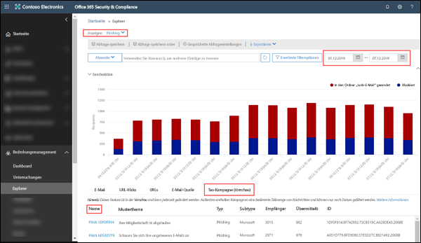
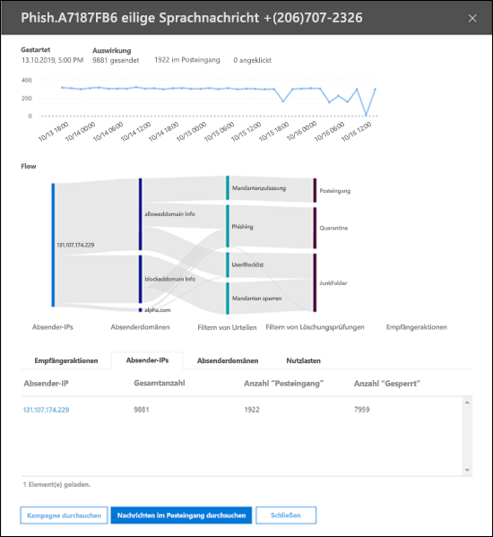
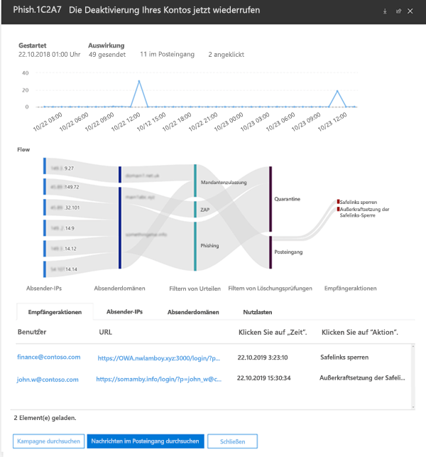

# Kampagnenansichten in Office 365 ATP

> [!NOTE]
> Die in diesem Thema beschriebenen Features sind derzeit als Vorschauversionen verfügbar und können jederzeit geändert werden.

Kampagnenansichten ist ein Feature von Advanced Threat Protection (ATP) im Office 365 Security & Compliance Center, das Phishing-Angriffe im Dienst identifiziert und kategorisiert. Kampagnenansichten können Ihnen bei Folgendem helfen:

- Phishing-Angriffe effektiv untersuchen und darauf reagieren.

- Besseres Verständnis des Umfangs des Angriffs.

- Entscheidungsträgern den Nutzen anzeigen.

Mit Kampagnenansichten können Sie das Gesamtbild eines Angriffs schneller und vollständiger erfassen als jeder Mensch.

## Was ist eine Kampagne?

Eine Kampagne ist ein koordinierter E-Mail-Angriff gegen eine oder mehrere Organisationen. Heutzutage sind E-Mail-Angriffe, mit denen Anmeldeinformationen und Unternehmensdaten gestohlen werden, ein großes und lukratives Geschäft. Zwar werden die Technologien, um Angreifer zu stoppen, immer weiter verbessert, aber die Angreifer sind raffiniert genug, ihre Methoden immer wieder zu ändern und so weiterhin erfolgreich zu sein. 

Microsoft nutzt die riesigen Mengen an Anti-Phishing-, Anti-Spam- und Antischadsoftware-Daten und -Erfahrungen weltweit im gesamten Office 365-Dienst, um Kampagnen zu identifizieren. Die Angriffsinformationen werden analysiert und nach mehreren Faktoren klassifiziert. Zum Beispiel:

- **Angriffsquellen**: Quell-IP-Adressen und E-Mail-Domänen des Absenders.

- **Eigenschaften der Angriffsnachricht**: Inhalt, Art und Grundstimmung der Angriffsnachrichten.

- **Angriffsempfänger**: Empfängerdomänen, Aufgaben des Empfängers (Administratoren, Führungskräfte usw.), Firmentypen (groß, klein, öffentlich, privat usw.) und Branchen.

- **Angriffsnutzlast**: Bösartige Links, Anlagen oder andere Nutzlasten.

## Kampagnenansichten im Office 365 Security & Compliance Center

Kampagnenansichten stehen im [Security & Compliance Center](https://docs.microsoft.com/microsoft-365/compliance/go-to-the-securitycompliance-center) an den folgenden Speicherorten zur Verfügung:

- **Bedrohungsverwaltung** \> **Explorer** \> **Ansicht** \> **Phishing** \> **Top-Kampagne (Vorschau)**

- **Bedrohungsverwaltung** \> **Explorer** \> **Ansicht** \> **Alle E-Mails** \> **Top-Kampagne (Vorschau)**

> [!TIP]
> Derzeit kann nur nach dem Zeitraum gefiltert werden. Wenn keine Kampagnendaten angezeigt werden, versuchen Sie, den Zeitraum zu ändern.

Auf der Seite "Übersicht" werden die folgenden Informationen zur Kampagne angezeigt:

- **Name**

- **Beispiel-Betreff**: Betreffzeile einer der Nachrichten in der Kampagne. Beachten Sie, dass nicht unbedingt _alle_ Nachrichten der Kampagne die gleiche Betreffzeile besitzen.

- **Typ**: Dieser Wert ist derzeit immer **Phishing**.

- **Untertyp**: Wenn verfügbar, die Marke, die von dieser Kampagne ausgespäht wird. Wenn die Erkennung durch die ATP-Technologie gesteuert wird, wird das Präfix **ATP-** zum Wert "Untertyp" hinzugefügt.

- **Empfänger**: Die Anzahl der Benutzer, auf die diese Kampagne abzielt.

- **Zugestellt**: Die Anzahl der Benutzer, die Nachrichten dieser Kampagne in Ihrem Posteingang empfangen haben.

- **ID**: Ein eindeutiger Bezeichner für die Kampagne.

Wenn Sie auf den Namen einer Kampagne klicken, werden die Kampagnendetails in einem Flyout angezeigt.

## Kampagnendetails

In der Ansicht "Kampagnendetails" stehen viele Informationen zu der Kampagne bereit:

- Kampagneninformationen:

  - **ID**: Der eindeutige Bezeichner der Kampagne von der Übersichtsseite.

  - **Begonnen** und **Beendet**: Der ausgewählte Datumsfilter.

  - **Auswirkung**: Die Anzahl der Nachrichten, die in dem von Ihnen ausgewählten Datumsabschnitt gesendet wurden, wie viele Nachrichten in den Posteingang übertragen wurden und wie viele Benutzer auf die URL-Nutzlast in der Phishing-Nachricht geklickt haben.

  - Eine Zeitachse für Kampagnenaktivitäten: Wann die Kampagne begonnen und geendet hat, und die Anzahl der Nachrichten im Zeitverlauf.

### Kampagnenfluss

Wichtige Details zur Kampagne werden in einem horizontalen Flussdiagramm (auch als _Sankey_-Diagramm bezeichnet) im Abschnitt **Fluss** dargestellt. Diese Details helfen Ihnen, die Elemente der Kampagne und die potenziellen Auswirkungen in Ihrer Organisation zu verstehen.

Wenn Sie im Diagramm auf ein horizontales Band zeigen, sehen Sie die Anzahl der verwandten Nachrichten (z. B. Nachrichten aus einer bestimmten Quell-IP, Nachrichten aus der Quell-IP-Adresse, die die angegebene Absenderdomäne verwenden, usw.).

Das Diagramm enthält die folgenden Informationen:

- **Sender-IPs**

- **Absenderdomänen**

- **Filterbewertungen**: Die hier aufgeführten Werte beziehen sich auf die verfügbaren Anti-Phishing- und Anti-Spam-Filterbewertungen, die in [Antispam-Nachrichtenkopfzeilen](anti-spam-message-headers.md) beschrieben sind. Besonders interessant sind hier die Werte **Mandantenzulassung**, was bedeutet, dass eine konfigurierte Einstellung in der Organisation eine Nachricht durchgelassen hat, die andernfalls vom Dienst blockiert worden wäre (z. B. eine Domäne in der Liste der zulässigen Absender).

  - **Mandantensperre**: Dieser Wert gibt an, dass eine Einstellung in Ihrer Organisation (z. B. ein Domäneneintrag in der [Liste der blockierten Absender](create-block-sender-lists-in-office-365.md)) die Nachricht erkannt und ermittelt hat, wo sie zugestellt wurde. Bei Nachrichten, die nicht isoliert wurden, überprüfen Sie die Einstellungen der blockierten Absender, um zu ermitteln, warum die Nachricht zugestellt wurde.

  - **Erkannt**

  - **Mandantenzulassung**

- **Übermittlungsorte**: Sie möchten wahrscheinlich Nachrichten überprüfen, die an Empfänger übermittelt wurden (entweder im Posteingang oder Junk-E-Mail-Ordner), auch wenn Benutzer nicht auf die Nutzlast-URL in der Nachricht geklickt haben. Sie können zudem die isolierten Nachrichten aus den [Quarantäne-E-Mail-Nachrichten in Office 365](quarantine-email-messages.md) entfernen.

  - **Junk-E-Mail-Ordner**

  - **Quarantäne**

  - **Posteingang**

#### URL-Klicks

Es ist immer möglich, dass Nachrichten, die an den Posteingang oder den Junk-E-Mail-Ordner des Empfängers gesendet wurden, vom Benutzer bearbeitet werden (d. h. der Benutzer klickt auf den bösartigen URL in der Nachricht). Wenn dies nicht der Fall ist, ist dies ein kleiner Erfolg, aber Sie müssen dennoch unbedingt ermitteln, warum die schädliche Nachricht an das Postfach übermittelt wurde.

Wenn ein Benutzer auf die bösartige URL geklickt hat, werden die Aktionen im Bereich **URL-Klicks** des Diagramms angezeigt.

- **Sichere Links-Sperre**: Dieser Wert gibt an, dass der Empfänger auf die Nutzlast-URL in der Nachricht geklickt hat, sie jedoch durch die Richtlinien für [ATP-sichere Links](atp-safe-links.md) in Ihrer Organisation blockiert wurde.

- **Sichere Links-Sperre außer Kraft gesetzt**: Dieser Wert gibt an, dass der Empfänger auf die Nutzlast-URL in der Nachricht geklickt hat und ATP-sichere Links versucht haben, diese zu beenden, die Sperre jedoch überschrieben werden konnte. Sie müssen ihre [Richtlinien für sichere Links](set-up-atp-safe-links-policies.md) überprüfen, um herauszufinden, warum Benutzer das Urteil "Sichere Links" außer Kraft setzen und auf bösartige URLs klicken konnten.

### Registerkarten

In der Ansicht „Kampagnendetails“ stehen mehrere Registerkarten zur Verfügung, mit denen Sie die Kampagne weiter untersuchen können.

- **URL-Klicks**: Wenn die Nutzlast-URL in der Phishing-Nachricht nicht angeklickt wurde, ist dieser Abschnitt leer. Wenn ein Benutzer auf die URL klicken konnte, wählen Sie:

  - **Benutzer**\*

  - **URL**\*

  - **Zeit**

  - **Aktion**

- **Sender-IPs**

  - **Sender-IP**\*

  - **Gesamtanzahl**

  - **Anzahl "Posteingang"**

  - **Anzahl "Gesperrt"**

  - **SPF übergeben**

- **Absender**

  - **Absender**

  - **Gesamtanzahl**

  - **Anzahl "Posteingang"**

  - **Anzahl "Gesperrt"**

  - **DKIM übergeben**

  - **DMARC übergeben**

- **Nutzlasten**

  - **URL**\*

  - **Gesamtanzahl**

\* Wenn Sie auf diesen Wert klicken, wird ein neues Flyout geöffnet, das weitere Details zu dem angegebenen Element (Benutzer, URL usw.) oben in der Ansicht "Kampagnendetails" enthält. Wenn Sie zur Ansicht "Kampagnendetails" zurückkehren möchten, klicken Sie im neuen Flyout auf **Fertig**.

### Schaltflächen

Mit den Schaltflächen in der Ansicht "Kampagnendetails" können Sie die Funktionen von Threat Explorer verwenden, um die Kampagne weiter zu untersuchen.

- **Kampagne durchsuchen**: Öffnet eine neue Threat Explorer-Suchregisterkarte mit dem Wert **Kampagnen-ID** als Suchfilter.

- **Nachrichten im Posteingang durchsuchen**: Öffnet eine neue Threat Explorer-Suchregisterkarte mit den Suchfiltern **Kampagnen-ID** und **Übermittlungsort: Posteingang**.
