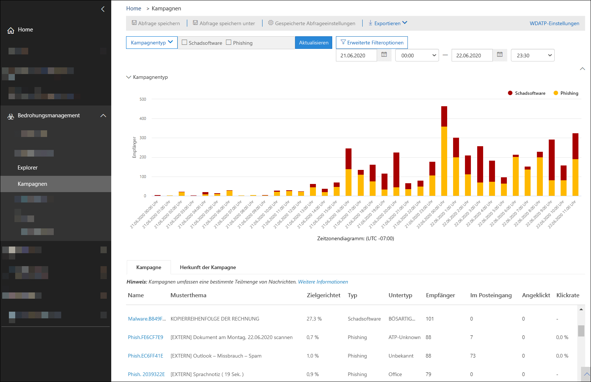
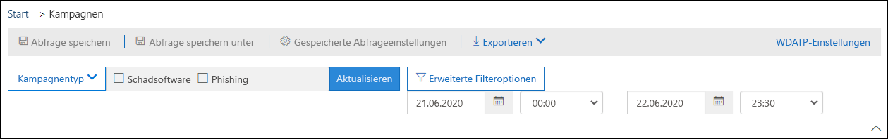
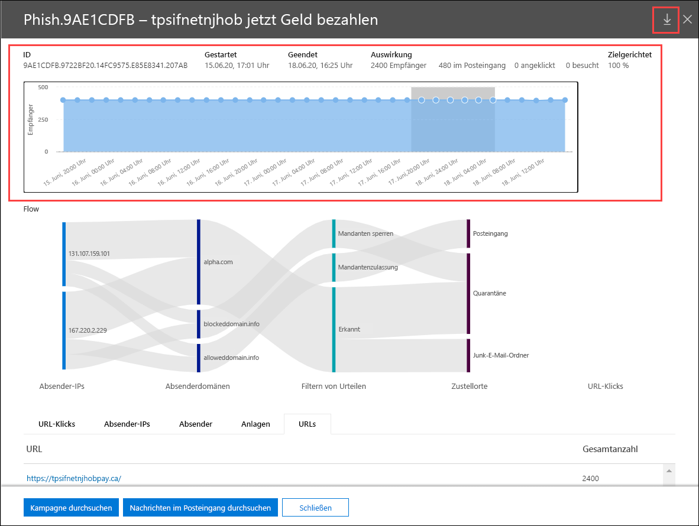
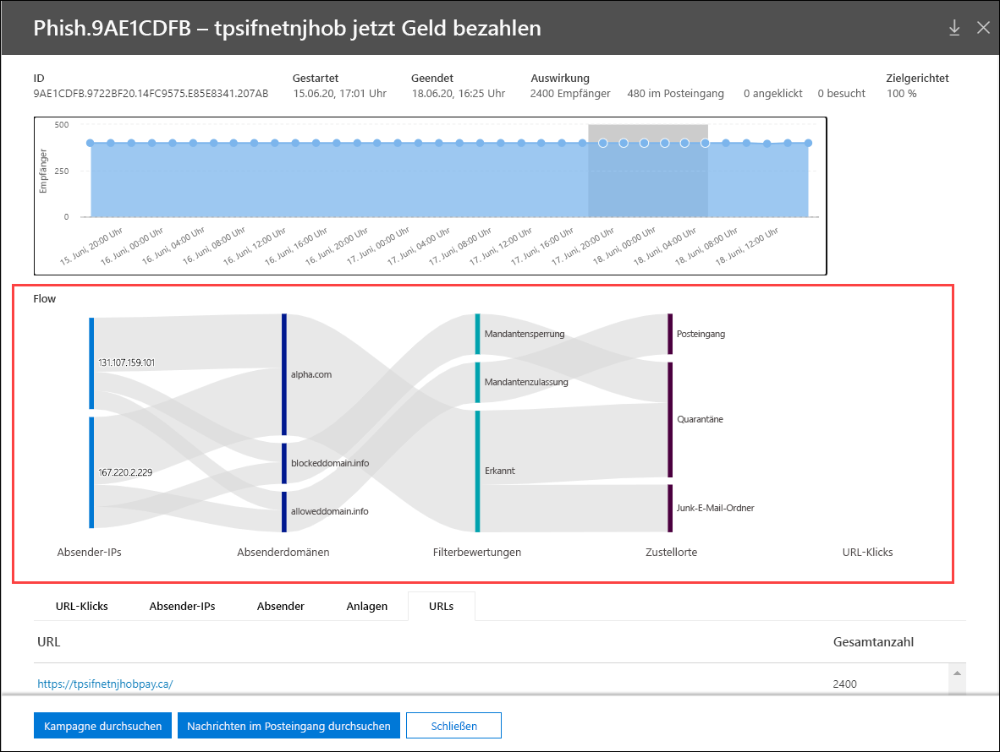

# Kampagnenansichten in Office 365 ATP

[!INCLUDE [Microsoft 365 Defender rebranding](../includes/microsoft-defender-for-office.md)]

Kampagnen Ansichten sind ein Feature in Advanced Threat Protection (ATP) Plan 2 (beispielsweise Microsoft 365 E5 oder Organisationen mit einem ATP Plan 2-Add-on). Kampagnen Ansichten im Security & Compliance Center identifiziert und kategorisiert Phishing-Angriffe im Dienst. Kampagnenansichten können Ihnen bei Folgendem helfen:

- Phishing-Angriffe effektiv untersuchen und darauf reagieren.
- Besseres Verständnis des Umfangs des Angriffs.
- Entscheidungsträgern den Nutzen anzeigen.

Mit Kampagnenansichten können Sie das Gesamtbild eines Angriffs schneller und vollständiger erfassen als jeder Mensch.

## Was ist eine Kampagne?

Eine Kampagne ist ein koordinierter E-Mail-Angriff gegen eine oder mehrere Organisationen. E-Mail-Angriffe, die Anmeldeinformationen und Unternehmensdaten stehlen, sind eine große und lukrative Branche. Wenn Technologien sich anstrengen, um Angriffe zu stoppen, ändern Angreifer Ihre Methoden, um den weiteren Erfolg sicherzustellen.

Microsoft nutzt die großen Mengen an Anti-Phishing-, Antispam-und Antischadsoftware-Daten im gesamten Dienst, um Kampagnen zu identifizieren. Wir analysieren und klassifizieren die Angriffsinformationen anhand verschiedener Faktoren. Zum Beispiel:

- **Angriffsquelle**: die Quell-IP-Adressen und Absender-e-Mail-Domänen.
- **Nachrichteneigenschaften**: der Inhalt, die Formatvorlage und der Ton der Nachrichten.
- **Nachrichtenempfänger**: wie Empfänger verwandt werden. Beispielsweise Empfängerdomänen, Empfänger Auftrags Funktionen (Administratoren, Führungskräfte usw.), Unternehmenstypen (groß, klein, öffentlich, privat usw.) und Branchen.
- **Angriffsnutzlast**: böswillige Links, Anlagen oder andere Nutzlasten in den Nachrichten.

Eine Kampagne kann von kurzer Dauer sein oder mehrere Tage, Wochen oder Monate mit aktiven und inaktiven Zeitspannen umfassen. Möglicherweise wird eine Kampagne für ihre jeweilige Organisation gestartet, oder Ihre Organisation kann Teil einer größeren Kampagne in mehreren Unternehmen sein.

## Kampagnen Ansichten im Security & Compliance Center

Kampagnen Ansichten stehen im [Security & Compliance Center](https://protection.office.com) unter **Threat Management** \> **Campaigns**oder direkt unter zur Verfügung <https://protection.office.com/campaigns> .

Sie können auch Kampagnen Ansichten von abrufen:

- **Threat Management** \> **Explorer** \> **Ansicht anzeigen** \> **Kampagnen**

- **Threat Management** \> **Explorer** \> **Ansicht anzeigen** \> **Alle e-Mails** \> Registerkarte **Kampagne**

- **Threat Management** \> **Explorer** \> **Ansicht anzeigen** \> **Phishing** \> Registerkarte **Kampagne**

- **Threat Management** \> **Explorer** \> **Ansicht anzeigen** \> **Schadsoftware** \> Registerkarte **Kampagne**

Um auf Kampagnen Ansichten zuzugreifen, müssen Sie Mitglied der Rollengruppen **Organisationsverwaltung**, **Sicherheits Administrator**oder **Sicherheits Leser** im Security & Compliance Center sein. Weitere Informationen finden Sie unter [Berechtigungen im Security & Compliance Center](permissions-in-the-security-and-compliance-center.md).

## Übersicht über Kampagnen

Auf der Übersichtsseite werden Informationen zu allen Kampagnen angezeigt.

Auf der Registerkarte Standard **Kampagne** zeigt der Bereich **Kampagnentyp** ein Balkendiagramm an, in dem die Anzahl der Empfänger pro Tag angezeigt wird. Standardmäßig zeigt das Diagramm sowohl **Phishing** -als auch **Schadsoftware** -Daten an.

> [!TIP]
> Wenn keine Kampagnendaten angezeigt werden, ändern Sie den Datumsbereich oder die [Filter](#filters-and-settings).

Auf der Rest der Übersichtsseite werden auf der Registerkarte **Kampagne** die folgenden Informationen angezeigt:

- **Name**

- **Beispiel-Betreff**: Betreffzeile einer der Nachrichten in der Kampagne. Beachten Sie, dass alle Nachrichten in der Kampagne nicht unbedingt den gleichen Betreff haben.

- **Targeted**: der Prozentsatz, der von: (die Anzahl der Kampagnen Empfänger in Ihrer Organisation)/(die Gesamtzahl der Empfänger in der Kampagne für alle Organisationen im Dienst) berechnet wurde. Dieser Wert gibt an, in welchem Ausmaß die Kampagne nur an Ihre Organisation (einen höheren Wert) oder an andere Organisationen im Dienst gerichtet wird (ein niedrigerer Wert).

- **Typ**: dieser Wert ist entweder **Phish** oder **Schadsoftware**.

- **Untertyp**: dieser Wert enthält weitere Details zur Kampagne. Beispiel:

  - **Phishing**: sofern verfügbar, die Marke, die von dieser Kampagne als Phishing bezeichnet wird. Beispielsweise,,, `Microsoft` `365` `Unknown` , `Outlook` , oder `DocuSign` .

  - **Schadsoftware**: beispielsweise `HTML/PHISH` oder `HTML/<MalwareFamilyName>` .

Sofern verfügbar, die Marke, die von dieser Kampagne als Phishing bezeichnet wird. Wenn die Erkennung von der ATP-Technologie gesteuert wird, wird das Präfix **ATP-** dem Untertyp Wert hinzugefügt.

- **Empfänger**: Die Anzahl der Benutzer, auf die diese Kampagne abzielt.

- **Inboxed**: die Anzahl der Benutzer, die Nachrichten von dieser Kampagne in Ihrem Posteingang empfangen haben (nicht an den Junk-e-Mail-Ordner zugestellt).

- **Geklickt**: die Anzahl der Benutzer, die auf die URL geklickt oder die Anlage in der Phishing-Nachricht geöffnet haben.

- **Klicken Sie auf Rate**: den Prozentsatz,**Clicked**der von "auf  /  **Posteingang**geklickt" berechnet wird. Dieser Wert ist ein Indikator für die Effektivität der Kampagne. Das heißt, wenn die Empfänger die Nachricht als Phishing identifizieren konnten, und wenn Sie nicht auf die Nutzlast-URL klicken.

  Beachten Sie, dass die **Klick Rate** in Schadsoftware-Kampagnen nicht verwendet wird.

- **Besucht**: Anzahl der Benutzer, die die Nutzlast-Website tatsächlich durchlaufen haben. Wenn auf Werte **geklickt** wird, aber sichere Links den Zugriff auf die Website blockiert haben, ist dieser Wert gleich NULL.

Auf der Registerkarte **Kampagnen Ursprung** werden die Nachrichtenquellen auf einer Weltkarte angezeigt.

### Filter und Einstellungen

Oben auf der Seite Kampagnen Ansichten stehen verschiedene Filter-und Abfrageeinstellungen zum Auffinden und Isolieren bestimmter Kampagnen zur Verfügung.

Die einfachste Filterung, die Sie ausführen können, sind Startdatum/-Uhrzeit und Enddatum/-Uhrzeit.

Wenn Sie die Ansicht weiter filtern möchten, können Sie eine einzelne Eigenschaft mit mehreren Werten filtern, indem Sie auf die Schaltfläche **Kampagnentyp** klicken, Ihre Auswahl treffen und dann auf **Aktualisieren**klicken.

Die verfügbaren Kampagneneigenschaften werden in der folgenden Liste beschrieben:

- Standard

  - **Kampagnentyp**: Wählen Sie **Schadsoftware** oder **Phishing**aus. Das Löschen der Auswahl hat das gleiche Ergebnis wie das auswählen beider Elemente.
  - **Name der Kampagne**
  - **Kampagnen Untertyp**
  - **Sender**
  - **Recipients**
  - **Absenderdomäne**
  - **Betreff**
  - **Dateiname der Anlage**
  - **Schadsoftware-Familie**
  - **Zustellungs Aktion**
  - **Erkennungstechnologie**
  - **Tags**
  - **System Überschreibungen**

- Erweitert

  - **Internet Nachrichten-ID**: verfügbar im Kopfzeilenfeld nach **richten-ID** im Nachrichtenkopf. Ein Beispielwert ist `<08f1e0f6806a47b4ac103961109ae6ef@server.domain>` (Beachten Sie die spitzen Klammern).
  
  - **Netzwerknachrichten-ID**: ein GUID-Wert, der im Headerfeld **X-MS-Exchange-Organization-Network-Message-ID** im Nachrichtenkopf verfügbar ist.
  
  - **Sender-IP**
  
  - **Attachment SHA256**: um den SHA256-Hashwert einer Datei in Windows zu finden, führen Sie den folgenden Befehl an einer Eingabeaufforderung aus: `certutil.exe -hashfile "<Path>\<Filename>" SHA256` .
  
  - **Cluster-ID**
  
  - **Warnungsrichtlinien-ID**

- URLs

  - **URL-Domäne**
  - **URL-Domäne und Pfad**
  - **URL**
  - **URL-Pfad**
  - **Klicken Sie auf Urteil**

Für eine erweiterte Filterung, einschließlich der Filterung durch mehrere Eigenschaften, können Sie auf die Schaltfläche **Erweiterter Filter** klicken, um eine Abfrage zu erstellen. Die gleichen Kampagneneigenschaften sind verfügbar, jedoch mit den folgenden Verbesserungen:

- Sie können auf **Bedingung hinzufügen** klicken, um mehrere Bedingungen auszuwählen.
- Sie können zwischen Bedingungen den **und-oder-** **Operator auswählen** .
- Sie können das Element **Bedingungsgruppe** unten in der Liste Bedingungen auswählen, um komplexe zusammengesetzte Bedingungen zu bilden.

Wenn Sie fertig sind, klicken Sie auf die Schaltfläche **Abfrage** .

Nachdem Sie einen einfachen oder erweiterten Filter erstellt haben, können Sie ihn speichern, indem Sie **Abfrage speichern** oder **Abfrage speichern**unter verwenden. Wenn Sie später zu Kampagnen Ansichten zurückkehren, können Sie einen gespeicherten Filter laden, indem Sie auf **gespeicherte Abfrageeinstellungen**klicken.

Klicken Sie zum Exportieren des Diagramms oder der Kampagnenliste auf **exportieren** , und wählen Sie **Diagrammdaten exportieren** oder **Kampagnenliste**exportieren aus.

Wenn Sie über ein Microsoft Defender ATP-Abonnement verfügen, können Sie auf **WDATP** klicken, um die Kampagneninformationen mit Microsoft Defender ATP zu verbinden oder zu trennen. Weitere Informationen finden Sie unter [integrieren Office 365 ATP mit Microsoft Defender ATP](https://docs.microsoft.com/microsoft-365/security/office-365-security/integrate-office-365-ti-with-wdatp).

## Kampagnendetails

Wenn Sie auf den Namen einer Kampagne klicken, werden die kampagnendetails in einem Flyout angezeigt.

### Kampagneninformationen

Oben in der Ansicht kampagnendetails stehen die folgenden Kampagneninformationen zur Verfügung:

- **ID**: der eindeutige Kampagnen Bezeichner.

- **Anfang und Ende** **: Startdatum und**Enddatum der Kampagne. Beachten Sie, dass sich diese Datumsangaben möglicherweise weiter ausdehnen als die Filterdaten, die Sie auf der Übersichtsseite ausgewählt haben.

- **Symptom**: Dieser Abschnitt enthält die folgenden Daten für den ausgewählten Datumsbereichsfilter (oder den Sie in der Zeitachse auswählen):
  
  - Die Gesamtzahl der Empfänger.
  - Die Anzahl der Nachrichten, die "Posteingang" (also im Posteingang, nicht an den Junk-e-Mail-Ordner) gesendet wurden.
  - Wie viele Benutzer auf die URL-Nutzlast in der Phishing-Nachricht geklickt haben.
  - Howe viele Benutzer haben die URL besucht.

- **Targeted**: der Prozentsatz, der von: (die Anzahl der Kampagnen Empfänger in Ihrer Organisation)/(die Gesamtzahl der Empfänger in der Kampagne für alle Organisationen im Dienst) berechnet wurde. Beachten Sie, dass dieser Wert über die gesamte Lebensdauer der Kampagne berechnet wird und nicht basierend auf den Datums Filtern geändert wird.

- Eine interaktive Zeitachse der Kampagnenaktivität: die Zeitachse zeigt die Aktivität während der gesamten Lebensdauer der Kampagne an. Standardmäßig enthält der schattierte Bereich den Datumsbereichsfilter, den Sie in der Übersicht ausgewählt haben. Sie können durch Klicken und ziehen einen bestimmten Startpunkt und Endpunkt auswählen, um <u>die Daten zu ändern, die im **IMPACT** -Bereich angezeigt werden, und auf den Rest der Seite, wie in den nächsten Abschnitten beschrieben</u>.

In der Titelleiste können Sie auf die Schaltfläche Download Campaign Write- **up** klicken,  um die kampagnendetails in ein Word-Dokument (standardmäßig mit dem Namen "CampaignReport.docx") herunterzuladen. Beachten Sie, dass der Download Details über die gesamte Lebensdauer der Kampagne enthält (nicht nur die Filterdaten, die Sie ausgewählt haben).

### Kampagnenfluss

In der Mitte der Ansicht kampagnendetails werden wichtige Details zur Kampagne im Abschnitt **Flow** in einem horizontalen Flussdiagramm (als _Sankey_ -Diagramm bezeichnet) dargestellt. Diese Details helfen Ihnen, die Elemente der Kampagne und die potenziellen Auswirkungen in Ihrer Organisation zu verstehen.

> [!TIP]
> Die Informationen, die im **Fluss** Diagramm angezeigt werden, werden wie im vorherigen Abschnitt beschrieben durch den schattierten Datumsbereich in der Zeitachse gesteuert.

Wenn Sie im Diagramm auf ein horizontales Band zeigen, sehen Sie die Anzahl der verwandten Nachrichten (z. B. Nachrichten aus einer bestimmten Quell-IP, Nachrichten aus der Quell-IP-Adresse, die die angegebene Absenderdomäne verwenden, usw.).

Das Diagramm enthält die folgenden Informationen:

- **Sender-IPs**

- **Absenderdomänen**

- **Filter Urteile**: Urteils Werte beziehen sich auf die verfügbaren Phishing-und Spamfilter Urteile, wie unter [Antispam-Nachrichtenkopfzeilen](anti-spam-message-headers.md)beschrieben. Die verfügbaren Werte werden in der folgenden Tabelle beschrieben:

  ****

  |Wert|Spam Filter Urteil|Beschreibung|
  |---|---|---|
  |**Zulässig**|`SFV:SKN`    `SFV:SKI`|Die Nachricht wurde vor der Auswertung durch Spamfilterung als nicht-Spam-und/oder übersprungene Filterung markiert. Beispielsweise wurde die Nachricht von einer e-Mail-Fluss Regel (auch als Transportregel bezeichnet) als nicht Spam gekennzeichnet.  Die Nachricht hat aus anderen Gründen die Spamfilterung übersprungen. Beispielsweise scheint sich der Absender und der Empfänger in derselben Organisation zu befinden.|
  |**Gesperrt**|`SFV:SKS`|Die Nachricht wurde als Spam markiert, bevor Sie von der Spamfilterung ausgewertet wurde. Beispielsweisedurch eine Nachrichtenfluss Regel.|
  |**Erkannt**|`SFV:SPM`|Die Nachricht wurde vom Spamfilter als Spam markiert.|
  |**Nicht erkannt**|`SFV:NSPM`|Die Nachricht wurde durch Spamfilterung als nicht Spam gekennzeichnet.|
  |**Veröffentlicht**|`SFV:SKQ`|Die Nachricht hat die Spamfilterung übersprungen, da Sie aus der Quarantäne freigegeben wurde.|
  |**Mandanten zulässig**\*|`SFV:SKA`|Die Nachricht hat die Spamfilterung aufgrund der Einstellungen in einer Anti-Spam-Richtlinie übersprungen. Beispielsweise war der Absender in der Liste Zugelassene Absender oder zugelassene Domäne.|
  |**Mandanten Block**\*\*|`SFV:SKA`|Die Nachricht wurde aufgrund der Einstellungen in einer Anti-Spam-Richtlinie durch Spamfilterung blockiert. Beispielsweise war der Absender in der Liste Zugelassene Absender oder zugelassene Domäne.|
  |**Benutzer zulassen**\*|`SFV:SFE`|Die Nachricht hat die Spamfilterung übersprungen, da sich der Absender in der Liste sicherer Absender eines Benutzers befand.|
  |**Benutzer Block**\*\*|`SFV:BLK`|Die Nachricht wurde durch die Spamfilterung blockiert, da sich der Absender in der Liste Blockierte Absender eines Benutzers befand.|
  |**ZAP**|n/v|[Zero-Hour Auto Purge (zap)](zero-hour-auto-purge.md) hat die zugestellte Nachricht in den Junk-e-Mail-Ordner oder in die Quarantäne verschoben. Sie konfigurieren die Aktion in ihrer Anti-Spam-Richtlinie.|
  |

  \* Überprüfen Sie Ihre Anti-Spam-Richtlinien, da die zulässige Nachricht wahrscheinlich vom Dienst blockiert wurde.

  \*\* Überprüfen Sie Ihre Anti-Spam-Richtlinien, da diese Nachrichten isoliert und nicht zugestellt werden sollen.

- **Zustellungsorte**: Sie möchten wahrscheinlich Nachrichten untersuchen, die an Empfänger gesendet wurden (entweder an den Posteingang oder den Junk-e-Mail-Ordner), auch wenn Benutzer nicht auf die Nutzlast-URL in der Nachricht klicken. Sie können auch die isolierten Nachrichten aus der Quarantäne entfernen. Weitere Informationen finden Sie unter [Quarantäne-e-Mail-Nachrichten in EoP](quarantine-email-messages.md).

  - **Ordner gelöscht**
  - **Gelöscht**
  - **Extern**: der Empfänger befindet sich in Ihrer lokalen e-Mail-Organisation in Hybrid Umgebungen.
  - **Fehlgeschlagen**
  - **Weitergeleitet**
  - **Posteingang**
  - **Junk-E-Mail-Ordner**
  - **Quarantäne**
  - **Unknown**

- **URL-Klicks**: diese Werte werden im nächsten Abschnitt beschrieben.

> [!NOTE]
> In allen Ebenen, die mehr als 10 Elemente enthalten, werden die oberen 10 Elemente angezeigt, während der Rest in **anderen**zusammengefasst wird.

#### URL-Klicks

Wenn eine Phishing-Nachricht an den Posteingang des Empfängers oder den Junk-e-Mail-Ordner gesendet wird, besteht immer die Möglichkeit, dass der Benutzer auf die Nutzlast-URL klickt. Wenn Sie nicht auf die URL klicken, ist dies ein kleines Maß an Erfolg, aber Sie müssen ermitteln, warum die Phishing-Nachricht sogar an das Postfach übermittelt wurde.

Wenn ein Benutzer in der Phishing-Nachricht auf die Nutzlast-URL geklickt hat, werden die Aktionen im Bereich **URL Klicks** des Diagramms in der Ansicht kampagnendetails angezeigt.

- **Zulässig**

- **BlockPage**: der Empfänger hat auf die Nutzlast-URL geklickt, aber der Zugriff auf die bösartige Website wurde durch eine Richtlinie zu [sicheren Links](atp-safe-links.md) in Ihrer Organisation blockiert.

- **BlockPageOverride**: der Empfänger hat auf die Nutzlast-URL in der Nachricht geklickt, sichere Links haben versucht, diese zu beenden, aber Sie durften den Block außer Kraft setzen. Überprüfen Sie Ihre [Richtlinien für sichere Links](set-up-atp-safe-links-policies.md) , um zu erfahren, warum Benutzer das Urteil "sichere Links" außer Kraft setzen und mit der bösartigen Website fortfahren können.

- **PendingDetonationPage**: sichere Anlagen in Office 365 ATP wird gerade dabei sein, die Nutzlast-URL in einer virtuellen Computerumgebung zu öffnen und zu untersuchen.

- **PendingDetonationPageOverride**: der Empfänger durfte den detonations Prozess für die Nutzlast außer Kraft setzen und die URL öffnen, ohne auf die Ergebnisse zu warten.

### Registerkarten

Auf den Registerkarten in der Ansicht kampagnendetails können Sie die Kampagne weiter untersuchen.

> [!TIP]
> Die Informationen, die auf den Registerkarten angezeigt werden, werden durch den schattierten Datumsbereich in der Zeitleiste gesteuert, wie im Abschnitt [Kampagneninformationen](#campaign-information) beschrieben.

- **URL Klicks**: Wenn Benutzer nicht auf die Nutzlast-URL in der Nachricht geklickt haben, ist dieser Abschnitt leer. Wenn ein Benutzer auf die URL klicken konnte, werden die folgenden Werte aufgefüllt:

  - **Benutzer**\*
  - **URL**\*
  - **Klicken Sie auf Zeit**
  - **Klicken Sie auf Urteil**

- **Sender-IPs**

  - **Sender-IP**\*
  - **Gesamtanzahl**
  - **Posteingang**
  - **Nicht Posteingang**
  - **Weitergegebene SPF**: der Absender wurde vom [SPF (Sender Policy Framework)](how-office-365-uses-spf-to-prevent-spoofing.md)authentifiziert. Ein Absender, der die SPF-Überprüfung nicht übergibt, gibt einen nicht authentifizierten Absender an, oder die Nachricht fälscht einen legitimen Absender.

- **Absender**

  - **Absender**: Dies ist die tatsächliche Absenderadresse im SMTP-Mail von-Befehl, die nicht unbedingt die von:-e-Mail-Adresse ist, die Benutzern in Ihren e-Mail-Clients angezeigt wird.
  - **Gesamtanzahl**
  - **Posteingang**
  - **Nicht Posteingang**
  - **DKIM-Übergabe**: der Absender wurde durch Domänenschlüssel authentifiziert, die [Mail (DKIM) identifiziert](support-for-validation-of-dkim-signed-messages.md)haben. Ein Absender, der die DKIM-Überprüfung nicht übergibt, gibt einen nicht authentifizierten Absender an, oder die Nachricht fälscht einen legitimen Absender.
  - **DMARC wurde übergeben**: der Absender wurde durch [domänenbasierte Nachrichtenauthentifizierung, Berichterstellung und Konformität authentifiziert (DMARC)](use-dmarc-to-validate-email.md). Ein Absender, der die DMARC-Überprüfung nicht übergibt, gibt einen nicht authentifizierten Absender an, oder die Nachricht fälscht einen legitimen Absender.

- **Anlagen**

  - **Filename**
  - **SHA256**
  - **Schadsoftware-Familie**
  - **Gesamtanzahl**

- **URL**

  - **URL**\*
  - **Gesamtanzahl**

\* Wenn Sie auf diesen Wert klicken, wird ein neues Flyout geöffnet, das weitere Details zu dem angegebenen Element (Benutzer, URL usw.) oben in der Ansicht "Kampagnendetails" enthält. Wenn Sie zur Ansicht "Kampagnendetails" zurückkehren möchten, klicken Sie im neuen Flyout auf **Fertig**.

### Schaltflächen

Mit den Schaltflächen in der Ansicht "Kampagnendetails" können Sie die Funktionen von Threat Explorer verwenden, um die Kampagne weiter zu untersuchen.

- **Kampagne durchsuchen**: Öffnet eine neue Threat Explorer-Suchregisterkarte mit dem Wert **Kampagnen-ID** als Suchfilter.

- Untersuchen von **Nachrichten im Posteingang**: öffnet eine neue Suchregisterkarte "Threat Explorer" mithilfe der **Kampagnen-ID** und des **Zustellungs Speicherorts: Posteingang** als Suchfilter.
