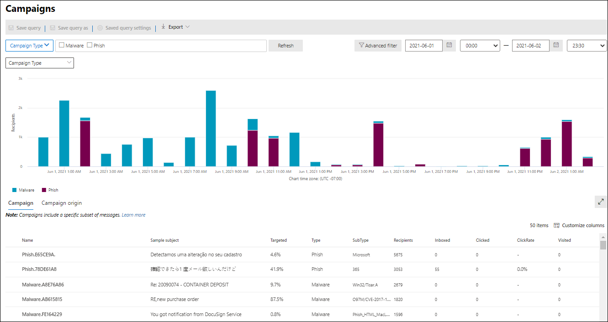

# Kampagnenansichten in Microsoft Defender für Office 365

[!INCLUDE [Microsoft 365 Defender rebranding](../includes/microsoft-defender-for-office.md)]

**Gilt für**
- [Microsoft Defender für Office 365 – Plan 2](defender-for-office-365.md)

Kampagnenansichten sind ein Feature in Microsoft Defender für Office 365 Plan 2 (z. B. Microsoft 365 E5 oder Organisationen mit einem Defender for Office 365 Plan 2-Add-On). Kampagnenansichten im Microsoft 365 Defender-Portal identifiziert und kategorisiert Phishingangriffe im Dienst. Kampagnenansichten können Ihnen bei Folgendem helfen:

- Phishing-Angriffe effektiv untersuchen und darauf reagieren.
- Besseres Verständnis des Umfangs des Angriffs.
- Entscheidungsträgern den Nutzen anzeigen.

Mit Kampagnenansichten können Sie das Gesamtbild eines Angriffs schneller und vollständiger erfassen als jeder Mensch.

## Was ist eine Kampagne?

Eine Kampagne ist ein koordinierter E-Mail-Angriff gegen eine oder mehrere Organisationen. E-Mail-Angriffe, die Anmeldeinformationen und Unternehmensdaten stehlen, sind eine große und lukrative Branche. Da die Technologien immer mehr versuchen, Angriffe zu stoppen, ändern Angreifer ihre Methoden, um einen fortgesetzten Erfolg sicherzustellen.

Microsoft nutzt die großen Mengen an Antiphishing-, Antispam- und Antischadsoftwaredaten über den gesamten Dienst, um Kampagnen zu identifizieren. Wir analysieren und klassifizieren die Angriffsinformationen nach mehreren Faktoren. Beispiel:

- **Angriffsquelle:** Die QUELL-IP-Adressen und E-Mail-Domänen des Absenders.
- **Nachrichteneigenschaften:** Inhalt, Format und Tonfall der Nachrichten.
- **Nachrichtenempfänger:** Beziehung zwischen Empfängern. Beispielsweise Empfängerdomänen, Empfängerauftragsfunktionen (Administratoren, Führungskräfte usw.), Unternehmenstypen (groß, klein, öffentlich, privat usw.) und Branchen.
- **Angriffsnutzlast:** Bösartige Links, Anlagen oder andere Nutzlasten in den Nachrichten.

Eine Kampagne kann kurzlebig sein oder mehrere Tage, Wochen oder Monate mit aktiven und inaktiven Zeiträumen umfassen. Möglicherweise wird eine Kampagne gegen Ihre bestimmte Organisation gestartet, oder Ihre Organisation ist möglicherweise Teil einer größeren Kampagne über mehrere Unternehmen hinweg.

## Kampagnenansichten im Microsoft 365 Defender-Portal

Kampagnenansichten sind im Microsoft 365 Defender-Portal ( <https://security.microsoft.com> ) unter **E-Mail &** \> **Zusammenarbeitskampagnen** oder direkt unter <https://security.microsoft.com/campaigns> verfügbar.

Sie können auch zu Kampagnenansichten wechseln von:

- **E-Mail-& Zusammenarbeit** \> **Explorer** \> **Anzeigen** \> **Kampagnen**
- **E-Mail-& Zusammenarbeit** \> **Explorer** \> **Anzeigen** \> **Alle E-Mails** \> **Registerkarte "Kampagne"**
- **E-Mail-& Zusammenarbeit** \> **Explorer** \> **Anzeigen** \> **Phishing** \> **Registerkarte "Kampagne"**
- **E-Mail-& Zusammenarbeit** \> **Explorer** \> **Anzeigen** \> **Schadsoftware** \> **Registerkarte "Kampagne"**

Um auf Kampagnenansichten zugreifen zu können, müssen Sie Mitglied der Rollengruppen **"Organisationsverwaltung",** **"Sicherheitsadministrator"** oder **"Sicherheitsleseberechtigter"** im Microsoft 365 Defender-Portal sein. Weitere Informationen finden Sie unter [Berechtigungen im Microsoft 365 Defender-Portal.](permissions-microsoft-365-security-center.md)

## Kampagnenübersicht

Auf der Übersichtsseite werden Informationen zu allen Kampagnen angezeigt.

Auf der Standardregisterkarte **"Kampagne"** zeigt der **Kampagnentypbereich** ein Balkendiagramm an, das die Anzahl der Empfänger pro Tag anzeigt. Das Diagramm zeigt standardmäßig sowohl **Phishing-** als auch Schadsoftwaredaten. 

> [!TIP]
> Wenn keine Kampagnendaten angezeigt werden, versuchen Sie, den Datumsbereich oder [filtert](#filters-and-settings)zu ändern.

Die Tabelle unterhalb des Diagramms auf der Übersichtsseite zeigt die folgenden Informationen auf der Registerkarte **"Kampagne":**

- **Name**

- **Beispiel-Betreff**: Betreffzeile einer der Nachrichten in der Kampagne. Beachten Sie, dass alle Nachrichten in der Kampagne nicht notwendigerweise denselben Betreff haben.

- **Gezielt**: Der Prozentsatz, der berechnet wird von: (die Anzahl der Kampagnenempfänger in Ihrer Organisation) / (die Gesamtzahl der Empfänger in der Kampagne in allen Organisationen im Dienst). Dieser Wert gibt den Grad an, in dem die Kampagne nur an Ihre Organisation gerichtet ist (ein höherer Wert) im Vergleich zu anderen Organisationen im Dienst (ein niedrigerer Wert).

- **Typ:** Dieser Wert ist entweder Phishing oder **Schadsoftware.** 

- **Untertyp:** Dieser Wert enthält weitere Details zur Kampagne. Beispiel:
  - **Phishing:** Wenn verfügbar, die Marke, die von dieser Kampagne gephisst wird. Beispiel: `Microsoft` , `365` , , oder `Unknown` `Outlook` `DocuSign` .
  - **Schadsoftware:** `HTML/PHISH` `HTML/<MalwareFamilyName>` z. B. oder .

  Sofern verfügbar, die Marke, die von dieser Kampagne gephisst wird. Wenn die Erkennung von Defender für Office 365 Technologie gesteuert wird, wird dem Untertypwert das Präfix **ATP-** hinzugefügt.

- **Empfänger**: Die Anzahl der Benutzer, auf die diese Kampagne abzielt.

- **Posteingang:** Die Anzahl der Benutzer, die Nachrichten von dieser Kampagne in ihrem Posteingang erhalten haben (nicht an ihren Junk-E-Mail-Ordner übermittelt).

- **Clicked**: The number of users that clicked on the URL or opened the attachment in the phishing message.

- **Klickrate:** Der Prozentsatz, der durch **"Angeklickter**  /  **Posteingang"** berechnet wird. Dieser Wert ist ein Indikator für die Effektivität der Kampagne. Mit anderen Worten, wenn die Empfänger die Nachricht als Phishing identifizieren konnten und nicht auf die Nutzlast-URL geklickt haben.

  Beachten Sie, dass die **Klickrate** nicht in Schadsoftwarekampagnen verwendet wird.

- **Besucht:** Anzahl der Benutzer, die die Nutzlastwebsite tatsächlich aufgerufen haben. Wenn **clicked-Werte** vorhanden sind, aber sichere Links den Zugriff auf die Website blockiert haben, ist dieser Wert Null.

Auf der Registerkarte **"Kampagnenursprung"** werden die Nachrichtenquellen auf einer Karte der Welt angezeigt.

### Filter und Einstellungen

Oben auf der **Kampagnenseite** gibt es mehrere Filter- und Abfrageeinstellungen, die Ihnen helfen, bestimmte Kampagnen zu finden und zu isolieren.

Die einfachste Filterung, die Sie ausführen können, ist das Startdatum/die Startzeit und das Enddatum/die Endzeit.

Um die Ansicht weiter zu filtern, können Sie eine einzelne Eigenschaft mit mehreren Werten filtern, indem Sie auf die Schaltfläche **"Kampagnentyp"** klicken, Ihre Auswahl treffen und dann auf **"Aktualisieren"** klicken.

Die filterbaren Kampagneneigenschaften, die in der Schaltfläche **"Kampagnentyp"** verfügbar sind, werden in der folgenden Liste beschrieben:

- **Einfach:**
  - **Kampagnentyp:** Wählen Sie **Schadsoftware** oder **Phishing aus.** Das Löschen der Auswahl hat das gleiche Ergebnis wie das Auswählen beider Elemente.
  - **Kampagnenname**
  - **Kampagnenuntertyp**
  - **Sender**
  - **Recipients**
  - **Absenderdomäne**
  - **Betreff**
  - **Dateiname der Anlage**
  - **Schadsoftwarefamilie**
  - **Tags:** Benutzer oder Gruppen, auf die das angegebene Benutzertag angewendet wurde (einschließlich Prioritätskonten). Weitere Informationen zu Benutzertags finden Sie unter [Benutzertags.](user-tags.md)
  - **Übermittlungsaktion**
  - **Zusätzliche Aktion**
  - **Directionality**
  - **Erkennungstechnologie**
  - **Ursprünglicher Übermittlungsort**
  - **Aktueller Übermittlungsort**
  - **Systemüberschreibungen**

- **Erweitert:**
  - **Internetnachrichten-ID:** Verfügbar im **Nachrichten-ID-Kopfzeilenfeld** im Nachrichtenkopf. Ein Beispielwert ist `<08f1e0f6806a47b4ac103961109ae6ef@server.domain>` (beachten Sie die spitzen Klammern).
  - **Netzwerknachrichten-ID:** Ein GUID-Wert, der im **Headerfeld "X-MS-Exchange-Organization-Network-Message-Id"** im Nachrichtenkopf verfügbar ist.
  - **Sender-IP**
  - **Anlage SHA256:** Um den SHA256-Hashwert einer Datei in Windows zu finden, führen Sie den folgenden Befehl an einer Eingabeaufforderung aus: `certutil.exe -hashfile "<Path>\<Filename>" SHA256` .
  - **Cluster-ID**
  - **Warnungs-ID**
  - **Warnungsrichtlinien-ID**
  - **Kampagnen-ID**
  - **ZAP-URL-Signal**

- **URLs:**
  - **URL-Domäne**
  - **URL-Domäne und Pfad**
  - **URL**
  - **URL-Pfad**
  - **Klicken Sie auf "Bewertung".**

Für eine erweiterte Filterung, einschließlich der Filterung nach mehreren Eigenschaften, können Sie auf die Schaltfläche **"Erweiterter Filter"** klicken, um eine Abfrage zu erstellen. Die gleichen Kampagneneigenschaften sind verfügbar, jedoch mit den folgenden Verbesserungen:

- Sie können auf **"Bedingung hinzufügen"** klicken, um mehrere Bedingungen auszuwählen.
- Sie können den **Operator "And"** oder **"Or"** zwischen Bedingungen auswählen.
- Sie können das **Bedingungsgruppenelement** am Ende der Bedingungsliste auswählen, um komplexe verbundbedingungen zu bilden.

Wenn Sie fertig sind, klicken Sie auf die Schaltfläche **"Abfrage".**

Nachdem Sie einen einfachen oder erweiterten Filter erstellt haben, können Sie ihn mithilfe der **Save-Abfrage** oder der **Save-Abfrage unter** speichern speichern. Später, wenn Sie zur **Kampagnenseite** zurückkehren, können Sie einen gespeicherten Filter laden, indem Sie auf **gespeicherte Abfrageeinstellungen** klicken.

Klicken Sie zum Exportieren des Diagramms oder der Liste der Kampagnen auf **"Exportieren",** und wählen Sie **"Diagrammdaten exportieren"** oder **"Kampagnenliste exportieren"** aus.

Wenn Sie über ein Microsoft Defender für Endpunkt-Abonnement verfügen, können Sie auf **MDE Einstellungen** klicken, um die Kampagneninformationen mit Microsoft Defender für Endpunkt zu verbinden oder zu trennen. Weitere Informationen finden Sie unter [Integrieren von Microsoft Defender für Office 365 in Microsoft Defender für Endpunkt.](integrate-office-365-ti-with-mde.md)

## Kampagnendetails

Wenn Sie auf den Namen einer Kampagne klicken, werden die Kampagnendetails in einem Flyout angezeigt.

### Kampagneninformationen

Oben in der Detailansicht der Kampagne stehen die folgenden Kampagneninformationen zur Verfügung:

- **Kampagnen-ID:** Die eindeutige Kampagnen-ID.
- **Aktivität:** Dauer und Aktivität der Kampagne.
- Die folgenden Daten für den ausgewählten Datumsbereichsfilter (oder den Sie auf der Zeitachse auswählen):
- **Auswirkung**
- **Nachrichten:** Die Gesamtzahl der Empfänger.
- **Posteingang:** Die Anzahl der Nachrichten, die an den Posteingang übermittelt wurden, nicht an den Junk-E-Mail-Ordner.
- **Link geklickt:** Anzahl der Benutzer, die auf die URL-Nutzlast in der Phishing-Nachricht geklickt haben.
- **Besuchter Link:** Anzahl der Benutzer, die die URL besucht haben.
- **Targeted(%)**: Der Prozentsatz, der berechnet wird von: (die Anzahl der Kampagnenempfänger in Ihrer Organisation) / (die Gesamtzahl der Empfänger in der Kampagne in allen Organisationen im Dienst). Beachten Sie, dass dieser Wert über die gesamte Lebensdauer der Kampagne berechnet wird und sich basierend auf Datumsfiltern nicht ändert.
- Filter für Startdatum/-uhrzeit und -enddaten/-uhrzeit für den Kampagnenfluss, wie im nächsten Abschnitt beschrieben.
- Eine interaktive Zeitachse der Kampagnenaktivität: Die Zeitachse zeigt Aktivitäten über die gesamte Lebensdauer der Kampagne an. Sie können mit dem Mauszeiger über die Datenpunkte im Diagramm zeigen, um die Anzahl der erkannten Nachrichten anzuzeigen.

### Kampagnenfluss

In der Mitte der Detailansicht der Kampagne werden wichtige Details zur Kampagne in einem horizontalen Flussdiagramm (auch als _Sankey-Diagramm_ bezeichnet) dargestellt. Diese Details helfen Ihnen, die Elemente der Kampagne und die potenziellen Auswirkungen in Ihrer Organisation zu verstehen.

> [!TIP]
> Die im Flussdiagramm angezeigten Informationen werden durch den Datumsbereichsfilter auf der Zeitachse gesteuert, wie im vorherigen Abschnitt beschrieben.

Wenn Sie im Diagramm auf ein horizontales Band zeigen, sehen Sie die Anzahl der verwandten Nachrichten (z. B. Nachrichten aus einer bestimmten Quell-IP, Nachrichten aus der Quell-IP-Adresse, die die angegebene Absenderdomäne verwenden, usw.).

Das Diagramm enthält die folgenden Informationen:

- **Sender-IPs**
- **Absenderdomänen**
- **Filterbewertungen:** Bewertungswerte beziehen sich auf die verfügbaren Phishing- und Spamfilterbewertungen, wie in [Antispamnachrichtenkopfzeilen](anti-spam-message-headers.md)beschrieben. Die verfügbaren Werte werden in der folgenden Tabelle beschrieben:

   

  ****

  |Wert|Spamfilterbewertung|Beschreibung|
  |---|---|---|
  |**Zulässig**|`SFV:SKN` 
 `SFV:SKI`|Die Nachricht wurde als keine Spam- und/oder übersprungene Filterung gekennzeichnet, bevor sie von der Spamfilterung ausgewertet wurde. Beispielsweise wurde die Nachricht von einer Nachrichtenflussregel (auch als Transportregel bezeichnet) als kein Spam gekennzeichnet. 
 Die Nachricht hat die Spamfilterung aus anderen Gründen übersprungen. Beispielsweise scheinen sich Absender und Empfänger in derselben Organisation zu befinden.|
  |**Gesperrt**|`SFV:SKS`|Die Nachricht wurde vor der Auswertung durch die Spamfilterung als Spam gekennzeichnet. Beispielsweise durch eine Nachrichtenflussregel.|
  |**Erkannt**|`SFV:SPM`|Die Nachricht wurde vom Spamfilter als Spam markiert.|
  |**Nicht erkannt**|`SFV:NSPM`|Die Nachricht wurde durch die Spamfilterung als kein Spam gekennzeichnet.|
  |**Freigegeben**|`SFV:SKQ`|Die Nachricht hat die Spamfilterung übersprungen, da sie aus der Quarantäne freigegeben wurde.|
  |**Mandanten zulassen**\*|`SFV:SKA`|Die Nachricht hat die Spamfilterung aufgrund der Einstellungen in einer Antispamrichtlinie übersprungen. Beispielsweise befand sich der Absender in der Liste der zulässigen Absender oder in der Liste der zulässigen Domänen.|
  |**Mandantenblock**\*\*|`SFV:SKA`|Die Nachricht wurde aufgrund der Einstellungen in einer Antispamrichtlinie durch die Spamfilterung blockiert. Beispielsweise befand sich der Absender in der Liste der zulässigen Absender oder in der Liste der zulässigen Domänen.|
  |**Benutzer zulassen**\*|`SFV:SFE`|Die Nachricht hat die Spamfilterung übersprungen, da sich der Absender in der Liste der sicheren Absender eines Benutzers befand.|
  |**Benutzerblockierung**\*\*|`SFV:BLK`|Die Nachricht wurde durch die Spamfilterung blockiert, da sich der Absender in der Liste blockierter Absender eines Benutzers befand.|
  |**ZAP**|n/v|[Zap (Zero-Hour Auto Purge)](zero-hour-auto-purge.md) hat die zugestellte Nachricht in den Junk-E-Mail-Ordner oder in die Quarantäne verschoben. Sie konfigurieren die Aktion in Ihrer Antispamrichtlinie.|
  |

  \* Überprüfen Sie Ihre Antispamrichtlinien, da die zulässige Nachricht wahrscheinlich vom Dienst blockiert worden wäre.

  \*\* Überprüfen Sie Ihre Antispamrichtlinien, da diese Nachrichten unter Quarantäne gestellt und nicht zugestellt werden sollten.

- **Nachrichtenziele:** Sie sollten Nachrichten untersuchen, die an Empfänger übermittelt wurden (entweder an den Posteingang oder den Junk-E-Mail-Ordner), auch wenn Benutzer nicht auf die Nutzlast-URL in der Nachricht geklickt haben. Sie können die isolierten Nachrichten auch aus der Quarantäne entfernen. Weitere Informationen finden Sie unter [Quarantäne gestellte E-Mail-Nachrichten in EOP.](quarantine-email-messages.md)
  - **Ordner gelöscht**
  - **Gelöscht**
  - **Extern:** Der Empfänger befindet sich in Ihrer lokalen E-Mail-Organisation in Hybridumgebungen.
  - **Fehlgeschlagen**
  - **Weitergeleitet**
  - **Posteingang**
  - **Junk-E-Mail-Ordner**
  - **Quarantäne**
  - **Unknown**

- **URL-Klicks:** Diese Werte werden im nächsten Abschnitt beschrieben.

> [!NOTE]
> In allen Ebenen, die mehr als 10 Elemente enthalten, werden die obersten 10 Elemente angezeigt, während die restlichen in **"Andere"** gebündelt sind.

#### URL-Klicks

Wenn eine Phishingnachricht an den Posteingang oder Junk-E-Mail-Ordner eines Empfängers übermittelt wird, besteht immer die Möglichkeit, dass der Benutzer auf die Nutzlast-URL klickt. Das Nichtklicken auf die URL ist ein kleines Maß an Erfolg, Aber Sie müssen ermitteln, warum die Phishing-Nachricht überhaupt an das Postfach übermittelt wurde.

Wenn ein Benutzer auf die Nutzlast-URL in der Phishing-Nachricht geklickt hat, werden die Aktionen im **URL-Klickbereich** des Diagramms in der Ansicht "Kampagnendetails" angezeigt.

- **Zulässig**
- **BlockPage:** Der Empfänger hat auf die Nutzlast-URL geklickt, aber sein Zugriff auf die schädliche Website wurde durch eine [Richtlinie für sichere Links](safe-links.md) in Ihrer Organisation blockiert.
- **BlockPageOverride:** Der Empfänger hat auf die Nutzlast-URL in der Nachricht geklickt, "Sichere Links" versucht, sie zu beenden, aber er konnte den Block außer Kraft setzen. Überprüfen Sie Ihre [Richtlinien für sichere Links,](set-up-safe-links-policies.md) um zu sehen, warum Benutzer die Bewertung für sichere Links außer Kraft setzen und zur schädlichen Website fortfahren dürfen.
- **PendingDetonationPage:** Sichere Anlagen in Microsoft Defender für Office 365 ist dabei, die Nutzlast-URL in einer virtuellen Computerumgebung zu öffnen und zu untersuchen.
- **PendingDetonationPageOverride:** Der Empfänger konnte den Nutzlast-Detonationsprozess außer Kraft setzen und die URL öffnen, ohne auf die Ergebnisse zu warten.

### Registerkarten

Mithilfe der Registerkarten in der Ansicht "Kampagnendetails" können Sie die Kampagne weiter untersuchen.

> [!TIP]
> Die Informationen, die auf den Registerkarten angezeigt werden, werden durch den Datumsbereichsfilter in der Zeitachse gesteuert, wie im Abschnitt ["Kampagneninformationen"](#campaign-information) beschrieben.

- **URL-Klicks:** Wenn Benutzer nicht auf die Nutzlast-URL in der Nachricht geklickt haben, ist dieser Abschnitt leer. Wenn ein Benutzer auf die URL klicken konnte, werden die folgenden Werte aufgefüllt:
  - **Benutzer**\*
  - **URL**\*
  - **Klickzeit**
  - **Klicken Sie auf "Bewertung".**

- **Sender-IPs**
  - **Sender-IP**\*
  - **Gesamtanzahl**
  - **Posteingang**
  - **Nicht posteingang**
  - **SPF übergeben:** Der Absender wurde vom [Sender Policy Framework (SPF)](how-office-365-uses-spf-to-prevent-spoofing.md)authentifiziert. Ein Absender, der die SPF-Überprüfung nicht besteht, weist auf einen nicht authentifizierten Absender hin, oder die Nachricht spooft einen seriösen Absender.

- **Absender**
  - **Absender:** Dies ist die tatsächliche Absenderadresse im SMTP MAIL FROM-Befehl, bei der es sich nicht unbedingt um die Absender-E-Mail-Adresse handelt, die Benutzern in ihren E-Mail-Clients angezeigt wird.
  - **Gesamtanzahl**
  - **Posteingang**
  - **Nicht posteingang**
  - **DKIM übergeben:** Der Absender wurde von [Domain Keys Identified Mail (DKIM)](support-for-validation-of-dkim-signed-messages.md)authentifiziert. Ein Absender, der die DKIM-Überprüfung nicht besteht, weist auf einen nicht authentifizierten Absender hin, oder die Nachricht spooft einen seriösen Absender.
  - **DMARC übergeben:** Der Absender wurde durch [domänenbasierte Nachrichtenauthentifizierung, Berichterstellung und Konformität (DMARC)](use-dmarc-to-validate-email.md)authentifiziert. Ein Absender, der die DMARC-Überprüfung nicht besteht, weist auf einen nicht authentifizierten Absender hin, oder die Nachricht spooft einen seriösen Absender.

- **Anlagen**
  - **Filename**
  - **SHA256**
  - **Schadsoftwarefamilie**
  - **Gesamtanzahl**

- **URL**
  - **URL**\*
  - **Gesamtanzahl**

\* Wenn Sie auf diesen Wert klicken, wird ein neues Flyout geöffnet, das weitere Details zu dem angegebenen Element (Benutzer, URL usw.) oben in der Ansicht "Kampagnendetails" enthält. Wenn Sie zur Ansicht "Kampagnendetails" zurückkehren möchten, klicken Sie im neuen Flyout auf **Fertig**.

### Schaltflächen

Mit den Schaltflächen unten in der Ansicht "Kampagnendetails" können Sie Details zur Kampagne untersuchen und aufzeichnen:

- **Erkunden Sie Nachrichten:** Nutzen Sie die Leistungsfähigkeit des Bedrohungs-Explorers, um die Kampagne weiter zu untersuchen:
  - **Alle Nachrichten:** Öffnet eine neue Suchregisterkarte des Bedrohungs-Explorers mithilfe des **Kampagnen-ID-Werts** als Suchfilter.
  - **Posteingangsnachrichten:** Öffnet eine neue Suchregisterkarte für den Bedrohungs-Explorer mithilfe der **Kampagnen-ID** und des **Übermittlungsorts: Posteingang** als Suchfilter.
  - **Interne Nachrichten:** Öffnet eine neue Suchregisterkarte für den Bedrohungs-Explorer mithilfe der **Kampagnen-ID** und der **Direktionalität: Organisationsinterner** Suchfilter.

- **Bedrohungsbericht herunterladen:** Laden Sie die Kampagnendetails in ein Word-Dokument herunter (standardmäßig mit dem Namen CampaignReport.docx). Beachten Sie, dass der Download Details über die gesamte Lebensdauer der Kampagne enthält (nicht nur die ausgewählten Filterdaten).
