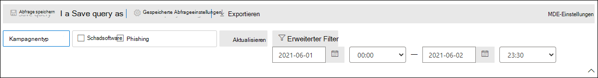

# Kampagnenansichten in Microsoft Defender für Office 365Campaign Views in Microsoft Defender for Office 365

[!INCLUDE [Microsoft 365 Defender rebranding](../includes/microsoft-defender-for-office.md)]

**Gilt für****Applies to**
- [Microsoft Defender für Office 365 – Plan 2Microsoft Defender for Office 365 plan 2](defender-for-office-365.md)

Kampagnenansichten sind ein Feature in Microsoft Defender für Office 365 Plan 2 (z. B. Microsoft 365 E5 oder Organisationen mit einem Defender for Office 365 Plan 2-Add-On).Campaign Views is a feature in Microsoft Defender for Office 365 Plan 2 (for example, Microsoft 365 E5 or organizations with an Defender for Office 365 Plan 2 add-on). Kampagnenansichten im Microsoft 365 Defender-Portal identifiziert und kategorisiert Phishingangriffe im Dienst.Campaign Views in the Microsoft 365 Defender portal identifies and categorizes phishing attacks in the service. Kampagnenansichten können Ihnen bei Folgendem helfen:Campaign Views can help you to:

- Phishing-Angriffe effektiv untersuchen und darauf reagieren.Efficiently investigate and respond to phishing attacks.
- Besseres Verständnis des Umfangs des Angriffs.Better understand the scope of the attack.
- Entscheidungsträgern den Nutzen anzeigen.Show value to decision makers.

Mit Kampagnenansichten können Sie das Gesamtbild eines Angriffs schneller und vollständiger erfassen als jeder Mensch.Campaign Views lets you see the big picture of an attack faster and more complete than any human.

## Was ist eine Kampagne?What is a campaign?

Eine Kampagne ist ein koordinierter E-Mail-Angriff gegen eine oder mehrere Organisationen.A campaign is a coordinated email attack against one or many organizations. E-Mail-Angriffe, die Anmeldeinformationen und Unternehmensdaten stehlen, sind eine große und lukrative Branche.Email attacks that steal credentials and company data are a large and lucrative industry. Da die Technologien immer mehr versuchen, Angriffe zu stoppen, ändern Angreifer ihre Methoden, um einen fortgesetzten Erfolg sicherzustellen.As technologies increase in an effort to stop attacks, attackers modify their methods in an effort to ensure continued success.

Microsoft nutzt die großen Mengen an Antiphishing-, Antispam- und Antischadsoftwaredaten über den gesamten Dienst, um Kampagnen zu identifizieren.Microsoft leverages the vast amounts of anti-phishing, anti-spam, and anti-malware data across the entire service to help identify campaigns. Wir analysieren und klassifizieren die Angriffsinformationen nach mehreren Faktoren.We analyze and classify the attack information according to several factors. Beispiel:For example:

- **Angriffsquelle:** Die QUELL-IP-Adressen und E-Mail-Domänen des Absenders.**Attack source**: The source IP addresses and sender email domains.
- **Nachrichteneigenschaften:** Inhalt, Format und Tonfall der Nachrichten.**Message properties**: The content, style, and tone of the messages.
- **Nachrichtenempfänger:** Beziehung zwischen Empfängern.**Message recipients**: How recipients are related. Beispielsweise Empfängerdomänen, Empfängerauftragsfunktionen (Administratoren, Führungskräfte usw.), Unternehmenstypen (groß, klein, öffentlich, privat usw.) und Branchen.For example, recipient domains, recipient job functions (admins, executives, etc.), company types (large, small, public, private, etc.), and industries.
- **Angriffsnutzlast:** Bösartige Links, Anlagen oder andere Nutzlasten in den Nachrichten.**Attack payload**: Malicious links, attachments, or other payloads in the messages.

Eine Kampagne kann kurzlebig sein oder mehrere Tage, Wochen oder Monate mit aktiven und inaktiven Zeiträumen umfassen.A campaign might be short-lived, or could span several days, weeks, or months with active and inactive periods. Möglicherweise wird eine Kampagne gegen Ihre bestimmte Organisation gestartet, oder Ihre Organisation ist möglicherweise Teil einer größeren Kampagne über mehrere Unternehmen hinweg.A campaign might be launched against your specific organization, or your organization might be part of a larger campaign across multiple companies.

## Kampagnenansichten im Microsoft 365 Defender-PortalCampaign Views in the Microsoft 365 Defender portal

Kampagnenansichten sind im Microsoft 365 Defender-Portal ( <https://security.microsoft.com> ) unter **E-Mail &** \> **Zusammenarbeitskampagnen** oder direkt unter <https://security.microsoft.com/campaigns> verfügbar.Campaign Views is available in the Microsoft 365 Defender portal (<https://security.microsoft.com>) at **Email & collaboration** \> **Campaigns**, or directly at <https://security.microsoft.com/campaigns>.

Sie können auch zu Kampagnenansichten wechseln von:You can also get to Campaign Views from:

- **E-Mail-& Zusammenarbeit** \> **Explorer** \> **Anzeigen** \> **Kampagnen****Email & collaboration** \> **Explorer** \> **View** \> **Campaigns**
- **E-Mail-& Zusammenarbeit** \> **Explorer** \> **Anzeigen** \> **Alle E-Mails** \> **Registerkarte "Kampagne"****Email & collaboration** \> **Explorer** \> **View** \> **All email** \> **Campaign** tab
- **E-Mail-& Zusammenarbeit** \> **Explorer** \> **Anzeigen** \> **Phishing** \> **Registerkarte "Kampagne"****Email & collaboration** \> **Explorer** \> **View** \> **Phish** \> **Campaign** tab
- **E-Mail-& Zusammenarbeit** \> **Explorer** \> **Anzeigen** \> **Schadsoftware** \> **Registerkarte "Kampagne"****Email & collaboration** \> **Explorer** \> **View** \> **Malware** \> **Campaign** tab

Um auf Kampagnenansichten zugreifen zu können, müssen Sie Mitglied der Rollengruppen **"Organisationsverwaltung",** **"Sicherheitsadministrator"** oder **"Sicherheitsleseberechtigter"** im Microsoft 365 Defender-Portal sein.To access Campaign Views, you need to be a member of the **Organization Management**, **Security Administrator**, or **Security Reader** role groups in the Microsoft 365 Defender portal. Weitere Informationen finden Sie unter [Berechtigungen im Microsoft 365 Defender-Portal.](permissions-microsoft-365-security-center.md)For more information, see [Permissions in the Microsoft 365 Defender portal](permissions-microsoft-365-security-center.md).

## KampagnenübersichtCampaigns overview

Auf der Übersichtsseite werden Informationen zu allen Kampagnen angezeigt.The overview page shows information about all campaigns.

Auf der Standardregisterkarte **"Kampagne"** zeigt der **Kampagnentypbereich** ein Balkendiagramm an, das die Anzahl der Empfänger pro Tag anzeigt.On the default **Campaign** tab, the **Campaign type** area shows a bar graph that shows the number of recipients per day. Das Diagramm zeigt standardmäßig sowohl **Phishing-** als auch Schadsoftwaredaten. By default, the graph shows both **Phish** and **Malware** data.

> [!TIP]
> Wenn keine Kampagnendaten angezeigt werden, versuchen Sie, den Datumsbereich oder [filtert](#filters-and-settings)zu ändern.If you don't see any campaign data, try changing the date range or [filters](#filters-and-settings).

Die Tabelle unterhalb des Diagramms auf der Übersichtsseite zeigt die folgenden Informationen auf der Registerkarte **"Kampagne":**The table below the graph on the overview page shows the following information on the **Campaign** tab:

- **Name****Name**

- **Beispiel-Betreff**: Betreffzeile einer der Nachrichten in der Kampagne.**Sample subject**: The subject line of one of the messages in the campaign. Beachten Sie, dass alle Nachrichten in der Kampagne nicht notwendigerweise denselben Betreff haben.Note that all messages in the campaign will not necessarily have the same subject.

- **Gezielt**: Der Prozentsatz, der berechnet wird von: (die Anzahl der Kampagnenempfänger in Ihrer Organisation) / (die Gesamtzahl der Empfänger in der Kampagne in allen Organisationen im Dienst).**Targeted**: The percentage as calculated by: (the number of campaign recipients in your organization) / (the total number of recipients in the campaign across all organizations in the service). Dieser Wert gibt den Grad an, in dem die Kampagne nur an Ihre Organisation gerichtet ist (ein höherer Wert) im Vergleich zu anderen Organisationen im Dienst (ein niedrigerer Wert).This value indicates the degree to which the campaign is directed only at your organization (a higher value) vs. also directed at other organizations in the service (a lower value).

- **Typ:** Dieser Wert ist entweder Phishing oder **Schadsoftware.** **Type**: This value is either **Phish** or **Malware**.

- **Untertyp:** Dieser Wert enthält weitere Details zur Kampagne.**Subtype**: This value contains more details about the campaign. Beispiel:For example:
  - **Phishing:** Wenn verfügbar, die Marke, die von dieser Kampagne gephisst wird.**Phish**: Where available, the brand that is being phished by this campaign. Beispiel: `Microsoft` , `365` , , oder `Unknown` `Outlook` `DocuSign` .For example, `Microsoft`, `365`, `Unknown`, `Outlook`, or `DocuSign`.
  - **Schadsoftware:** `HTML/PHISH` `HTML/<MalwareFamilyName>` z. B. oder .**Malware**: For example, `HTML/PHISH` or `HTML/<MalwareFamilyName>`.

  Sofern verfügbar, die Marke, die von dieser Kampagne gephisst wird.Where available, the brand that is being phished by this campaign. Wenn die Erkennung von Defender für Office 365 Technologie gesteuert wird, wird dem Untertypwert das Präfix **ATP-** hinzugefügt.When the detection is driven by Defender for Office 365 technology, the prefix **ATP-** is added to the subtype value.

- **Empfänger**: Die Anzahl der Benutzer, auf die diese Kampagne abzielt.**Recipients**: The number of users that were targeted by this campaign.

- **Posteingang:** Die Anzahl der Benutzer, die Nachrichten von dieser Kampagne in ihrem Posteingang erhalten haben (nicht an ihren Junk-E-Mail-Ordner übermittelt).**Inboxed**: The number of users that received messages from this campaign in their Inbox (not delivered to their Junk Email folder).

- **Clicked**: The number of users that clicked on the URL or opened the attachment in the phishing message.**Clicked**: The number of users that clicked on the URL or opened the attachment in the phishing message.

- **Klickrate:** Der Prozentsatz, der durch **"Angeklickter**  /  **Posteingang"** berechnet wird.**Click rate**: The percentage as calculated by "**Clicked** / **Inboxed**". Dieser Wert ist ein Indikator für die Effektivität der Kampagne.This value is an indicator of the effectiveness of the campaign. Mit anderen Worten, wenn die Empfänger die Nachricht als Phishing identifizieren konnten und nicht auf die Nutzlast-URL geklickt haben.In other words, if the recipients were able to identify the message as phishing, and if they didn't click on the payload URL.

  Beachten Sie, dass die **Klickrate** nicht in Schadsoftwarekampagnen verwendet wird.Note that **Click rate** isn't used in malware campaigns.

- **Besucht:** Anzahl der Benutzer, die die Nutzlastwebsite tatsächlich aufgerufen haben.**Visited**: How many users actually made it through to the payload website. Wenn **clicked-Werte** vorhanden sind, aber sichere Links den Zugriff auf die Website blockiert haben, ist dieser Wert Null.If there are **Clicked** values, but Safe Links blocked access to the website, this value will be zero.

Auf der Registerkarte **"Kampagnenursprung"** werden die Nachrichtenquellen auf einer Karte der Welt angezeigt.The **Campaign origin** tab shows the message sources on a map of the world.

### Filter und EinstellungenFilters and settings

Oben auf der **Kampagnenseite** gibt es mehrere Filter- und Abfrageeinstellungen, die Ihnen helfen, bestimmte Kampagnen zu finden und zu isolieren.At the top of the **Campaign** page, there are several filter and query settings to help you find and isolate specific campaigns.

Die einfachste Filterung, die Sie ausführen können, ist das Startdatum/die Startzeit und das Enddatum/die Endzeit.The most basic filtering that you can do is the start date/time and the end date/time.

Um die Ansicht weiter zu filtern, können Sie eine einzelne Eigenschaft mit mehreren Werten filtern, indem Sie auf die Schaltfläche **"Kampagnentyp"** klicken, Ihre Auswahl treffen und dann auf **"Aktualisieren"** klicken.To further filter the view, you can do single property with multiple values filtering by clicking the **Campaign type** button, making your selection, and then clicking **Refresh**.

Die filterbaren Kampagneneigenschaften, die in der Schaltfläche **"Kampagnentyp"** verfügbar sind, werden in der folgenden Liste beschrieben:The filterable campaign properties that are available in the **Campaign type** button are described in the following list:

- **Einfach:****Basic**:
  - **Kampagnentyp:** Wählen Sie **Schadsoftware** oder **Phishing aus.****Campaign type**: Select **Malware** or **Phish**. Das Löschen der Auswahl hat das gleiche Ergebnis wie das Auswählen beider Elemente.Clearing the selections has the same result as selecting both.
  - **Kampagnenname****Campaign name**
  - **Kampagnenuntertyp****Campaign subtype**
  - **Sender****Sender**
  - **Recipients****Recipients**
  - **Absenderdomäne****Sender domain**
  - **Betreff****Subject**
  - **Dateiname der Anlage****Attachment filename**
  - **Schadsoftwarefamilie****Malware family**
  - **Tags:** Benutzer oder Gruppen, auf die das angegebene Benutzertag angewendet wurde (einschließlich Prioritätskonten).**Tags**: Users or groups that have had the specified user tag applied (including priority accounts). Weitere Informationen zu Benutzertags finden Sie unter [Benutzertags.](user-tags.md)For more information about user tags, see [User tags](user-tags.md).
  - **Übermittlungsaktion****Delivery action**
  - **Zusätzliche Aktion****Additional action**
  - **Directionality****Directionality**
  - **Erkennungstechnologie****Detection technology**
  - **Ursprünglicher Übermittlungsort****Original delivery location**
  - **Aktueller Übermittlungsort****Latest delivery location**
  - **Systemüberschreibungen****System overrides**

- **Erweitert:****Advanced**:
  - **Internetnachrichten-ID:** Verfügbar im **Nachrichten-ID-Kopfzeilenfeld** im Nachrichtenkopf.**Internet message ID**: Available in the **Message-ID** header field in the message header. Ein Beispielwert ist `<08f1e0f6806a47b4ac103961109ae6ef@server.domain>` (beachten Sie die spitzen Klammern).An example value is `<08f1e0f6806a47b4ac103961109ae6ef@server.domain>` (note the angle brackets).
  - **Netzwerknachrichten-ID:** Ein GUID-Wert, der im **Headerfeld "X-MS-Exchange-Organization-Network-Message-Id"** im Nachrichtenkopf verfügbar ist.**Network message ID**: A GUID value that's available in the **X-MS-Exchange-Organization-Network-Message-Id** header field in the message header.
  - **Sender-IP****Sender IP**
  - **Anlage SHA256:** Um den SHA256-Hashwert einer Datei in Windows zu finden, führen Sie den folgenden Befehl an einer Eingabeaufforderung aus: `certutil.exe -hashfile "<Path>\<Filename>" SHA256` .**Attachment SHA256**: To find the SHA256 hash value of a file in Windows, run the following command in a Command Prompt: `certutil.exe -hashfile "<Path>\<Filename>" SHA256`.
  - **Cluster-ID****Cluster ID**
  - **Warnungs-ID****Alert ID**
  - **Warnungsrichtlinien-ID****Alert Policy ID**
  - **Kampagnen-ID****Campaign ID**
  - **ZAP-URL-Signal****ZAP URL signal**

- **URLs:****URLs**:
  - **URL-Domäne****URL domain**
  - **URL-Domäne und Pfad****URL domain and path**
  - **URL****URL**
  - **URL-Pfad****URL path**
  - **Klicken Sie auf "Bewertung".****Click verdict**

Für eine erweiterte Filterung, einschließlich der Filterung nach mehreren Eigenschaften, können Sie auf die Schaltfläche **"Erweiterter Filter"** klicken, um eine Abfrage zu erstellen.For more advanced filtering, including filtering by multiple properties, you can click the **Advanced filter** button to build a query. Die gleichen Kampagneneigenschaften sind verfügbar, jedoch mit den folgenden Verbesserungen:The same campaign properties are available, but with the following enhancements:

- Sie können auf **"Bedingung hinzufügen"** klicken, um mehrere Bedingungen auszuwählen.You can click **Add a condition** to select multiple conditions.
- Sie können den **Operator "And"** oder **"Or"** zwischen Bedingungen auswählen.You can choose the **And** or **Or** operator between conditions.
- Sie können das **Bedingungsgruppenelement** am Ende der Bedingungsliste auswählen, um komplexe verbundbedingungen zu bilden.You can select the **Condition group** item at the bottom of the conditions list to form complex compound conditions.

Wenn Sie fertig sind, klicken Sie auf die Schaltfläche **"Abfrage".**When you're finished, click the **Query** button.

Nachdem Sie einen einfachen oder erweiterten Filter erstellt haben, können Sie ihn mithilfe der **Save-Abfrage** oder der **Save-Abfrage unter** speichern speichern.After you create a basic or advanced filter, you can save it by using **Save query** or **Save query as**. Später, wenn Sie zur **Kampagnenseite** zurückkehren, können Sie einen gespeicherten Filter laden, indem Sie auf **gespeicherte Abfrageeinstellungen** klicken.Later, when you return to the **Campaigns** page, you can load a saved filter by clicking **Saved query settings**.

Klicken Sie zum Exportieren des Diagramms oder der Liste der Kampagnen auf **"Exportieren",** und wählen Sie **"Diagrammdaten exportieren"** oder **"Kampagnenliste exportieren"** aus.To export the graph or the list of campaigns, click **Export** and select **Export chart data** or **Export campaign list**.

Wenn Sie über ein Microsoft Defender für Endpunkt-Abonnement verfügen, können Sie auf **MDE Einstellungen** klicken, um die Kampagneninformationen mit Microsoft Defender für Endpunkt zu verbinden oder zu trennen.If you have a Microsoft Defender for Endpoint subscription, you can click **MDE Settings** to connect or disconnect the campaigns information with Microsoft Defender for Endpoint. Weitere Informationen finden Sie unter [Integrieren von Microsoft Defender für Office 365 in Microsoft Defender für Endpunkt.](integrate-office-365-ti-with-mde.md)For more information, see [Integrate Microsoft Defender for Office 365 with Microsoft Defender for Endpoint](integrate-office-365-ti-with-mde.md).

## KampagnendetailsCampaign details

Wenn Sie auf den Namen einer Kampagne klicken, werden die Kampagnendetails in einem Flyout angezeigt.When you click on the name of a campaign, the campaign details appear in a flyout.

### KampagneninformationenCampaign information

Oben in der Detailansicht der Kampagne stehen die folgenden Kampagneninformationen zur Verfügung:At the top of the campaign details view, the following campaign information is available:

- **Kampagnen-ID:** Die eindeutige Kampagnen-ID.**Campaign ID**: The unique campaign identifier.
- **Aktivität:** Dauer und Aktivität der Kampagne.**Activity**: The duration and activity of the campaign.
- Die folgenden Daten für den ausgewählten Datumsbereichsfilter (oder den Sie auf der Zeitachse auswählen):The following data for the date range filter you selected (or that you select in the timeline):
- **Auswirkung****Impact**
- **Nachrichten:** Die Gesamtzahl der Empfänger.**Messages**: The total number of recipients.
- **Posteingang:** Die Anzahl der Nachrichten, die an den Posteingang übermittelt wurden, nicht an den Junk-E-Mail-Ordner.**Inboxed**: The number of messages that were delivered to the Inbox, not to the Junk Email folder.
- **Link geklickt:** Anzahl der Benutzer, die auf die URL-Nutzlast in der Phishing-Nachricht geklickt haben.**Clicked link**: How many users clicked on the URL payload in the phishing message.
- **Besuchter Link:** Anzahl der Benutzer, die die URL besucht haben.**Visited link**: How many users visited the URL.
- **Targeted(%)**: Der Prozentsatz, der berechnet wird von: (die Anzahl der Kampagnenempfänger in Ihrer Organisation) / (die Gesamtzahl der Empfänger in der Kampagne in allen Organisationen im Dienst).**Targeted(%)**: The percentage as calculated by: (the number of campaign recipients in your organization) / (the total number of recipients in the campaign across all organizations in the service). Beachten Sie, dass dieser Wert über die gesamte Lebensdauer der Kampagne berechnet wird und sich basierend auf Datumsfiltern nicht ändert.Note that this value is calculated over the entire lifetime of the campaign, and doesn't change based on date filters.
- Filter für Startdatum/-uhrzeit und -enddaten/-uhrzeit für den Kampagnenfluss, wie im nächsten Abschnitt beschrieben.Start date/time and end data/time filters for the campaign flow as described in the next section.
- Eine interaktive Zeitachse der Kampagnenaktivität: Die Zeitachse zeigt Aktivitäten über die gesamte Lebensdauer der Kampagne an.An interactive timeline of campaign activity: The timeline shows activity over the entire lifetime of the campaign. Sie können mit dem Mauszeiger über die Datenpunkte im Diagramm zeigen, um die Anzahl der erkannten Nachrichten anzuzeigen.You can hover over the data points in the graph to see the amount of detected messages.

### KampagnenflussCampaign flow

In der Mitte der Detailansicht der Kampagne werden wichtige Details zur Kampagne in einem horizontalen Flussdiagramm (auch als _Sankey-Diagramm_ bezeichnet) dargestellt.In the middle of the campaign details view, important details about the campaign are presented in a horizontal flow diagram (known as a _Sankey_ diagram). Diese Details helfen Ihnen, die Elemente der Kampagne und die potenziellen Auswirkungen in Ihrer Organisation zu verstehen.These details will help you to understand the elements of the campaign and the potential impact in your organization.

> [!TIP]
> Die im Flussdiagramm angezeigten Informationen werden durch den Datumsbereichsfilter auf der Zeitachse gesteuert, wie im vorherigen Abschnitt beschrieben.The information that's displayed in the flow diagram is controlled by the date range filter in the timeline as described in the previous section.

Wenn Sie im Diagramm auf ein horizontales Band zeigen, sehen Sie die Anzahl der verwandten Nachrichten (z. B. Nachrichten aus einer bestimmten Quell-IP, Nachrichten aus der Quell-IP-Adresse, die die angegebene Absenderdomäne verwenden, usw.).If you hover over a horizontal band in the diagram, you'll see the number of related messages (for example, messages from a particular source IP, messages from the source IP using the specified sender domain, etc.).

Das Diagramm enthält die folgenden Informationen:The diagram contains the following information:

- **Sender-IPs****Sender IPs**
- **Absenderdomänen****Sender domains**
- **Filterbewertungen:** Bewertungswerte beziehen sich auf die verfügbaren Phishing- und Spamfilterbewertungen, wie in [Antispamnachrichtenkopfzeilen](anti-spam-message-headers.md)beschrieben.**Filter verdicts**: Verdict values are related to the available phishing and spam filtering verdicts as described in [Anti-spam message headers](anti-spam-message-headers.md). Die verfügbaren Werte werden in der folgenden Tabelle beschrieben:The available values are described in the following table:

   

  ****

  |WertValue|SpamfilterbewertungSpam filter verdict|BeschreibungDescription|
  |---|---|---|
  |**Zulässig****Allowed**|`SFV:SKN` 
 `SFV:SKI`|Die Nachricht wurde als keine Spam- und/oder übersprungene Filterung gekennzeichnet, bevor sie von der Spamfilterung ausgewertet wurde.The message was marked as not spam and/or skipped filtering before being evaluated by spam filtering. Beispielsweise wurde die Nachricht von einer Nachrichtenflussregel (auch als Transportregel bezeichnet) als kein Spam gekennzeichnet.For example, the message was marked as not spam by a mail flow rule (also known as a transport rule). 
 Die Nachricht hat die Spamfilterung aus anderen Gründen übersprungen.The message skipped spam filtering for other reasons. Beispielsweise scheinen sich Absender und Empfänger in derselben Organisation zu befinden.For example, the sender and recipient appear to be in the same organization.|
  |**Gesperrt****Blocked**|`SFV:SKS`|Die Nachricht wurde vor der Auswertung durch die Spamfilterung als Spam gekennzeichnet.The message was marked as spam before being evaluated by spam filtering. Beispielsweise durch eine Nachrichtenflussregel.For example, by a mail flow rule.|
  |**Erkannt****Detected**|`SFV:SPM`|Die Nachricht wurde vom Spamfilter als Spam markiert.The message was marked as spam by spam filtering.|
  |**Nicht erkannt****Not Detected**|`SFV:NSPM`|Die Nachricht wurde durch die Spamfilterung als kein Spam gekennzeichnet.The message was marked as not spam by spam filtering.|
  |**Freigegeben****Released**|`SFV:SKQ`|Die Nachricht hat die Spamfilterung übersprungen, da sie aus der Quarantäne freigegeben wurde.The message skipped spam filtering because it was released from quarantine.|
  |**Mandanten zulassen**\***Tenant Allow**\*|`SFV:SKA`|Die Nachricht hat die Spamfilterung aufgrund der Einstellungen in einer Antispamrichtlinie übersprungen.The message skipped spam filtering because of the settings in an anti-spam policy. Beispielsweise befand sich der Absender in der Liste der zulässigen Absender oder in der Liste der zulässigen Domänen.For example, the sender was in the allowed sender list or allowed domain list.|
  |**Mandantenblock**\*\***Tenant Block**\*\*|`SFV:SKA`|Die Nachricht wurde aufgrund der Einstellungen in einer Antispamrichtlinie durch die Spamfilterung blockiert.The message was blocked by spam filtering because of the settings in an anti-spam policy. Beispielsweise befand sich der Absender in der Liste der zulässigen Absender oder in der Liste der zulässigen Domänen.For example, the sender was in the allowed sender list or allowed domain list.|
  |**Benutzer zulassen**\***User Allow**\*|`SFV:SFE`|Die Nachricht hat die Spamfilterung übersprungen, da sich der Absender in der Liste der sicheren Absender eines Benutzers befand.The message skipped spam filtering because the sender was in a user's Safe Senders list.|
  |**Benutzerblockierung**\*\***User Block**\*\*|`SFV:BLK`|Die Nachricht wurde durch die Spamfilterung blockiert, da sich der Absender in der Liste blockierter Absender eines Benutzers befand.The message was blocked by spam filtering because the sender was in a user's Blocked Senders list.|
  |**ZAP****ZAP**|n/vn/a|[Zap (Zero-Hour Auto Purge)](zero-hour-auto-purge.md) hat die zugestellte Nachricht in den Junk-E-Mail-Ordner oder in die Quarantäne verschoben.[Zero-hour auto purge (ZAP)](zero-hour-auto-purge.md) moved the delivered message to the Junk Email folder or quarantine. Sie konfigurieren die Aktion in Ihrer Antispamrichtlinie.You configure the action in your anti-spam policy.|
  |

  \* Überprüfen Sie Ihre Antispamrichtlinien, da die zulässige Nachricht wahrscheinlich vom Dienst blockiert worden wäre.\* Review your anti-spam policies, because the allowed message would have likely been blocked by the service.

  \*\* Überprüfen Sie Ihre Antispamrichtlinien, da diese Nachrichten unter Quarantäne gestellt und nicht zugestellt werden sollten.\*\* Review your anti-spam policies, because these messages should be quarantined, not delivered.

- **Nachrichtenziele:** Sie sollten Nachrichten untersuchen, die an Empfänger übermittelt wurden (entweder an den Posteingang oder den Junk-E-Mail-Ordner), auch wenn Benutzer nicht auf die Nutzlast-URL in der Nachricht geklickt haben.**Message destinations**: You'll likely want to investigate messages that were delivered to recipients (either to the Inbox or the Junk Email folder), even if users didn't click on the payload URL in the message. Sie können die isolierten Nachrichten auch aus der Quarantäne entfernen.You can also remove the quarantined messages from quarantine. Weitere Informationen finden Sie unter [Quarantäne gestellte E-Mail-Nachrichten in EOP.](quarantine-email-messages.md)For more information, see [Quarantined email messages in EOP](quarantine-email-messages.md).
  - **Ordner gelöscht****Deleted folder**
  - **Gelöscht****Dropped**
  - **Extern:** Der Empfänger befindet sich in Ihrer lokalen E-Mail-Organisation in Hybridumgebungen.**External**: The recipient is located in your on-premises email organization in hybrid environments.
  - **Fehlgeschlagen****Failed**
  - **Weitergeleitet****Forwarded**
  - **Posteingang****Inbox**
  - **Junk-E-Mail-Ordner****Junk folder**
  - **Quarantäne****Quarantine**
  - **Unknown****Unknown**

- **URL-Klicks:** Diese Werte werden im nächsten Abschnitt beschrieben.**URL clicks**: These values are described in the next section.

> [!NOTE]
> In allen Ebenen, die mehr als 10 Elemente enthalten, werden die obersten 10 Elemente angezeigt, während die restlichen in **"Andere"** gebündelt sind.In all layers that contain more than 10 items, the top 10 items are shown, while the rest are bundled together in **Others**.

#### URL-KlicksURL clicks

Wenn eine Phishingnachricht an den Posteingang oder Junk-E-Mail-Ordner eines Empfängers übermittelt wird, besteht immer die Möglichkeit, dass der Benutzer auf die Nutzlast-URL klickt.When a phishing message is delivered to a recipient's Inbox or Junk Email folder, there's always a chance that the user will click on the payload URL. Das Nichtklicken auf die URL ist ein kleines Maß an Erfolg, Aber Sie müssen ermitteln, warum die Phishing-Nachricht überhaupt an das Postfach übermittelt wurde.Not clicking on the URL is a small measure of success, but you need to determine why the phishing message was even delivered to the mailbox.

Wenn ein Benutzer auf die Nutzlast-URL in der Phishing-Nachricht geklickt hat, werden die Aktionen im **URL-Klickbereich** des Diagramms in der Ansicht "Kampagnendetails" angezeigt.If a user clicked on the payload URL in the phishing message, the actions are displayed in the **URL clicks** area of the diagram in the campaign details view.

- **Zulässig****Allowed**
- **BlockPage:** Der Empfänger hat auf die Nutzlast-URL geklickt, aber sein Zugriff auf die schädliche Website wurde durch eine [Richtlinie für sichere Links](safe-links.md) in Ihrer Organisation blockiert.**BlockPage**: The recipient clicked on the payload URL, but their access to the malicious website was blocked by a [Safe Links](safe-links.md) policy in your organization.
- **BlockPageOverride:** Der Empfänger hat auf die Nutzlast-URL in der Nachricht geklickt, "Sichere Links" versucht, sie zu beenden, aber er konnte den Block außer Kraft setzen.**BlockPageOverride**: The recipient clicked on the payload URL in the message, Safe Links tried to stop them, but they were allowed to override the block. Überprüfen Sie Ihre [Richtlinien für sichere Links,](set-up-safe-links-policies.md) um zu sehen, warum Benutzer die Bewertung für sichere Links außer Kraft setzen und zur schädlichen Website fortfahren dürfen.Inspect your [Safe Links policies](set-up-safe-links-policies.md) to see why users are allowed to override the Safe Links verdict and continue to the malicious website.
- **PendingDetonationPage:** Sichere Anlagen in Microsoft Defender für Office 365 ist dabei, die Nutzlast-URL in einer virtuellen Computerumgebung zu öffnen und zu untersuchen.**PendingDetonationPage**: Safe Attachments in Microsoft Defender for Office 365 is in the process of opening and investigating the payload URL in a virtual computer environment.
- **PendingDetonationPageOverride:** Der Empfänger konnte den Nutzlast-Detonationsprozess außer Kraft setzen und die URL öffnen, ohne auf die Ergebnisse zu warten.**PendingDetonationPageOverride**: The recipient was allowed to override the payload detonation process and open the URL without waiting for the results.

### RegisterkartenTabs

Mithilfe der Registerkarten in der Ansicht "Kampagnendetails" können Sie die Kampagne weiter untersuchen.The tabs in the campaign details view allow you to further investigate the campaign.

> [!TIP]
> Die Informationen, die auf den Registerkarten angezeigt werden, werden durch den Datumsbereichsfilter in der Zeitachse gesteuert, wie im Abschnitt ["Kampagneninformationen"](#campaign-information) beschrieben.The information that's displayed on the tabs is controlled by the date range filter in the timeline as described in [Campaign information](#campaign-information) section.

- **URL-Klicks:** Wenn Benutzer nicht auf die Nutzlast-URL in der Nachricht geklickt haben, ist dieser Abschnitt leer.**URL clicks**: If users didn't click on the payload URL in the message, this section will be blank. Wenn ein Benutzer auf die URL klicken konnte, werden die folgenden Werte aufgefüllt:If a user was able to click on the URL, the following values will be populated:
  - **Benutzer**\***User**\*
  - **URL**\***URL**\*
  - **Klickzeit****Click time**
  - **Klicken Sie auf "Bewertung".****Click verdict**

- **Sender-IPs****Sender IPs**
  - **Sender-IP**\***Sender IP**\*
  - **Gesamtanzahl****Total count**
  - **Posteingang****Inboxed**
  - **Nicht posteingang****Not Inboxed**
  - **SPF übergeben:** Der Absender wurde vom [Sender Policy Framework (SPF)](how-office-365-uses-spf-to-prevent-spoofing.md)authentifiziert.**SPF passed**: The sender was authenticated by the [Sender Policy Framework (SPF)](how-office-365-uses-spf-to-prevent-spoofing.md). Ein Absender, der die SPF-Überprüfung nicht besteht, weist auf einen nicht authentifizierten Absender hin, oder die Nachricht spooft einen seriösen Absender.A sender that doesn't pass SPF validation indicates an unauthenticated sender, or the message is spoofing a legitimate sender.

- **Absender****Senders**
  - **Absender:** Dies ist die tatsächliche Absenderadresse im SMTP MAIL FROM-Befehl, bei der es sich nicht unbedingt um die Absender-E-Mail-Adresse handelt, die Benutzern in ihren E-Mail-Clients angezeigt wird.**Sender**: This is the actual sender address in the SMTP MAIL FROM command, which is not necessarily the From: email address that users see in their email clients.
  - **Gesamtanzahl****Total count**
  - **Posteingang****Inboxed**
  - **Nicht posteingang****Not Inboxed**
  - **DKIM übergeben:** Der Absender wurde von [Domain Keys Identified Mail (DKIM)](support-for-validation-of-dkim-signed-messages.md)authentifiziert.**DKIM passed**: The sender was authenticated by [Domain Keys Identified Mail (DKIM)](support-for-validation-of-dkim-signed-messages.md). Ein Absender, der die DKIM-Überprüfung nicht besteht, weist auf einen nicht authentifizierten Absender hin, oder die Nachricht spooft einen seriösen Absender.A sender that doesn't pass DKIM validation indicates an unauthenticated sender, or the message is spoofing a legitimate sender.
  - **DMARC übergeben:** Der Absender wurde durch [domänenbasierte Nachrichtenauthentifizierung, Berichterstellung und Konformität (DMARC)](use-dmarc-to-validate-email.md)authentifiziert.**DMARC passed**: The sender was authenticated by [Domain-based Message Authentication, Reporting, and Conformance (DMARC)](use-dmarc-to-validate-email.md). Ein Absender, der die DMARC-Überprüfung nicht besteht, weist auf einen nicht authentifizierten Absender hin, oder die Nachricht spooft einen seriösen Absender.A sender that doesn't pass DMARC validation indicates an unauthenticated sender, or the message is spoofing a legitimate sender.

- **Anlagen****Attachments**
  - **Filename****Filename**
  - **SHA256****SHA256**
  - **Schadsoftwarefamilie****Malware family**
  - **Gesamtanzahl****Total count**

- **URL****URL**
  - **URL**\***URL**\*
  - **Gesamtanzahl****Total Count**

\* Wenn Sie auf diesen Wert klicken, wird ein neues Flyout geöffnet, das weitere Details zu dem angegebenen Element (Benutzer, URL usw.) oben in der Ansicht "Kampagnendetails" enthält.\* Clicking on this value opens a new flyout that contains more details about the specified item (user, URL, etc.) on top of the campaign details view. Wenn Sie zur Ansicht "Kampagnendetails" zurückkehren möchten, klicken Sie im neuen Flyout auf **Fertig**.To return to the campaign details view, click **Done** in the new flyout.

### SchaltflächenButtons

Mit den Schaltflächen unten in der Ansicht "Kampagnendetails" können Sie Details zur Kampagne untersuchen und aufzeichnen:The buttons at the bottom the campaign details view allow you to investigate and record details about the campaign:

- **Erkunden Sie Nachrichten:** Nutzen Sie die Leistungsfähigkeit des Bedrohungs-Explorers, um die Kampagne weiter zu untersuchen:**Explore messages**: Use the power of Threat Explorer to further investigate the campaign:
  - **Alle Nachrichten:** Öffnet eine neue Suchregisterkarte des Bedrohungs-Explorers mithilfe des **Kampagnen-ID-Werts** als Suchfilter.**All messages**: Opens a new Threat Explorer search tab using the **Campaign ID** value as the search filter.
  - **Posteingangsnachrichten:** Öffnet eine neue Suchregisterkarte für den Bedrohungs-Explorer mithilfe der **Kampagnen-ID** und des **Übermittlungsorts: Posteingang** als Suchfilter.**Inboxed messages**: Opens a new Threat Explorer search tab using the **Campaign ID** and **Delivery location: Inbox** as the search filter.
  - **Interne Nachrichten:** Öffnet eine neue Suchregisterkarte für den Bedrohungs-Explorer mithilfe der **Kampagnen-ID** und der **Direktionalität: Organisationsinterner** Suchfilter.**Internal messages**: Opens a new Threat Explorer search tab using the **Campaign ID** and **Directionality: Intra-org** as the search filter.

- **Bedrohungsbericht herunterladen:** Laden Sie die Kampagnendetails in ein Word-Dokument herunter (standardmäßig mit dem Namen CampaignReport.docx).**Download threat report**: Download the campaign details to a Word document (by default, named CampaignReport.docx). Beachten Sie, dass der Download Details über die gesamte Lebensdauer der Kampagne enthält (nicht nur die ausgewählten Filterdaten).Note that the download contains details over the entire lifetime of the campaign (not just the filter dates you selected).
