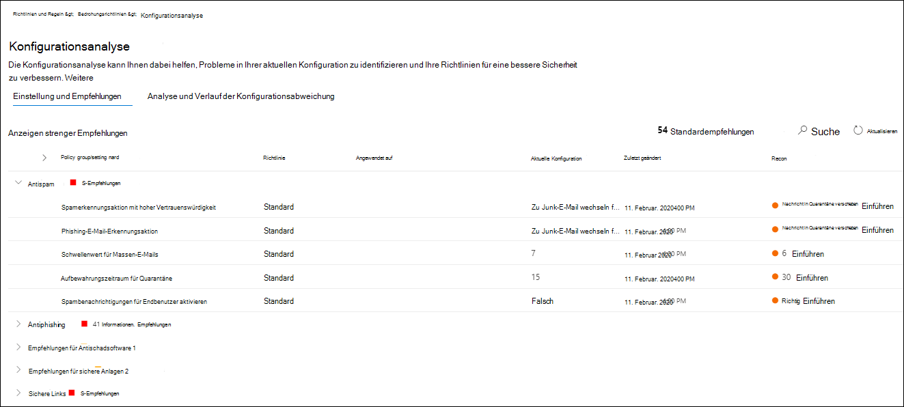
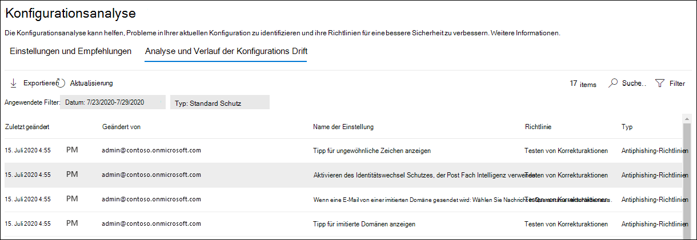

# Konfigurationsanalyse für Schutzrichtlinien in EOP und Microsoft Defender für Office 365Configuration analyzer for protection policies in EOP and Microsoft Defender for Office 365

[!INCLUDE [Microsoft 365 Defender rebranding](../includes/microsoft-defender-for-office.md)]

**Gilt für****Applies to**
- [Exchange Online ProtectionExchange Online Protection](exchange-online-protection-overview.md)
- [Microsoft Defender für Office 365 Plan 1 und Plan 2Microsoft Defender for Office 365 plan 1 and plan 2](defender-for-office-365.md)
- [Microsoft 365 DefenderMicrosoft 365 Defender](../defender/microsoft-365-defender.md)

Configuration Analyzer im Microsoft 365 Defender-Portal bietet einen zentralen Ort zum Suchen und Beheben von Sicherheitsrichtlinien, in denen sich die Einstellungen unter den Standardschutz- und Strict Protection-Profileinstellungen in [vordefinierten Sicherheitsrichtlinien](preset-security-policies.md)befinden.Configuration analyzer in the Microsoft 365 Defender portal provides a central location to find and fix security policies where the settings are below the Standard protection and Strict protection profile settings in [preset security policies](preset-security-policies.md).

Die folgenden Richtlinientypen werden vom Konfigurationsanalyseprogramm analysiert:The following types of policies are analyzed by the configuration analyzer:

- **Exchange Online Protection (EOP)-Richtlinien:** Dazu gehören Microsoft 365 Organisationen mit Exchange Online Postfächern und eigenständige EOP-Organisationen ohne Exchange Online Postfächer:**Exchange Online Protection (EOP) policies**: This includes Microsoft 365 organizations with Exchange Online mailboxes and standalone EOP organizations without Exchange Online mailboxes:

  - [Antispamrichtlinien.](configure-your-spam-filter-policies.md)[Anti-spam policies](configure-your-spam-filter-policies.md).
  - [Antischadsoftwarerichtlinien](configure-anti-malware-policies.md).[Anti-malware policies](configure-anti-malware-policies.md).
  - [EOP-Antiphishingrichtlinien](set-up-anti-phishing-policies.md#spoof-settings).[EOP anti-phishing policies](set-up-anti-phishing-policies.md#spoof-settings).

- **Microsoft Defender für Office 365-Richtlinien:** Dies umfasst Organisationen mit Microsoft 365 E5 oder Defender für Office 365-Add-On-Abonnements:**Microsoft Defender for Office 365 policies**: This includes organizations with Microsoft 365 E5 or Defender for Office 365 add-on subscriptions:

  - Antiphishingrichtlinien in Microsoft Defender für Office 365, die Folgendes umfassen:Anti-phishing policies in Microsoft Defender for Office 365, which include:
    - Die gleichen [Spoofingeinstellungen,](set-up-anti-phishing-policies.md#spoof-settings) die in den EOP-Antiphishingrichtlinien verfügbar sind.The same [spoof settings](set-up-anti-phishing-policies.md#spoof-settings) that are available in the EOP anti-phishing policies.
    - [IdentitätswechseleinstellungenImpersonation settings](set-up-anti-phishing-policies.md#impersonation-settings-in-anti-phishing-policies-in-microsoft-defender-for-office-365)
    - [Erweiterte Phishing-SchwellenwerteAdvanced phishing thresholds](set-up-anti-phishing-policies.md#advanced-phishing-thresholds-in-anti-phishing-policies-in-microsoft-defender-for-office-365)
  - [Richtlinien für sichere Links](set-up-safe-links-policies.md).[Safe Links policies](set-up-safe-links-policies.md).
  - [Richtlinien für sichere Anlagen.](set-up-safe-attachments-policies.md)[Safe Attachments policies](set-up-safe-attachments-policies.md).

Die Standard- und **Strict-Richtlinieneinstellungswerte,** die als Basislinien verwendet werden, werden in [den empfohlenen Einstellungen für EOP und Microsoft Defender für Office 365 Sicherheit](recommended-settings-for-eop-and-office365.md)beschrieben. The **Standard** and **Strict** policy setting values that are used as baselines are described in [Recommended settings for EOP and Microsoft Defender for Office 365 security](recommended-settings-for-eop-and-office365.md).

## Was sollten Sie wissen, bevor Sie beginnen?What do you need to know before you begin?

- Sie öffnen das Microsoft 365 Defender-Portal unter <https://security.microsoft.com> .You open the Microsoft 365 Defender portal at <https://security.microsoft.com>. To go directly to the **Configuration analyzer** page, use <https://security.microsoft.com/configurationAnalyzer> .To go directly to the **Configuration analyzer** page, use <https://security.microsoft.com/configurationAnalyzer>.

- Wie Sie eine Verbindung mit Exchange Online PowerShell herstellen, finden Sie unter [Herstellen einer Verbindung mit Exchange Online PowerShell](/powershell/exchange/connect-to-exchange-online-powershell).To connect to Exchange Online PowerShell, see [Connect to Exchange Online PowerShell](/powershell/exchange/connect-to-exchange-online-powershell).

- Bevor Sie die Verfahren in diesem Artikel ausführen können, müssen Ihnen im Microsoft 365 Defender-Portal Berechtigungen zugewiesen werden:You need to be assigned permissions in the Microsoft 365 Defender portal before you can do the procedures in this article:
  - Um die Konfigurationsanalyse zu verwenden **und** Aktualisierungen an Sicherheitsrichtlinien vorzunehmen, müssen Sie Mitglied der Rollengruppen **"Organisationsverwaltung"** oder **"Sicherheitsadministrator"** sein.To use the configuration analyzer **and** make updates to security policies, you need to be a member of the **Organization Management** or **Security Administrator** role groups.
  - Für den schreibgeschützten Zugriff auf die Konfigurationsanalyse müssen Sie Mitglied der Rollengruppe **"Globaler Leser"** oder **"Sicherheitsleseberechtigter"** sein.For read-only access to the configuration analyzer, you need to be a member of the **Global Reader** or **Security Reader** role groups.

  Weitere Informationen finden Sie unter [Berechtigungen im Microsoft 365 Defender-Portal.](permissions-microsoft-365-security-center.md)For more information, see [Permissions in the Microsoft 365 Defender portal](permissions-microsoft-365-security-center.md).

  > [!NOTE]
  >  
  > - Wenn Sie Benutzer zur entsprechenden Azure Active Directory Rolle hinzufügen, erhalten Benutzer die erforderlichen Berechtigungen im Microsoft 365 Defender-Portal _und_ Berechtigungen für andere Features in Microsoft 365.Adding users to the corresponding Azure Active Directory role gives users the required permissions in the Microsoft 365 Defender portal _and_ permissions for other features in Microsoft 365. Weitere Informationen finden Sie unter [Informationen zu Administratorrollen](../../admin/add-users/about-admin-roles.md).For more information, see [About admin roles](../../admin/add-users/about-admin-roles.md).
  >
  > - Die Rollengruppe **Organisationsverwaltung mit Leserechten** in [Exchange Online](/Exchange/permissions-exo/permissions-exo#role-groups) ermöglicht auch einen schreibgeschützten Zugriff auf das Feature.The **View-Only Organization Management** role group in [Exchange Online](/Exchange/permissions-exo/permissions-exo#role-groups) also gives read-only access to the feature.

## Verwenden der Konfigurationsanalyse im Microsoft 365 Defender-PortalUse the configuration analyzer in the Microsoft 365 Defender portal

Wechseln Sie im Microsoft 365 **Defender-Portal zu E-Mail-& Richtlinien** für die Zusammenarbeit \> **& Regeln** \> **Bedrohungsrichtlinien** \> **Vorlagenrichtlinien** Abschnitt Configuration \> **Analyzer**.In the Microsoft 365 Defender portal, go to **Email & collaboration** \> **Policies & rules** \> **Threat policies** \> **Templated policies** section \> **Configuration analyzer**.

Die **Seite "Konfigurationsanalyse"** verfügt über zwei Hauptregisterkarten:The **Configuration analyzer** page has two main tabs:

- **Einstellungen und Empfehlungen:** Wählen Sie **"Standard"** oder **"Streng"** aus, und vergleichen Sie diese Einstellungen mit Ihren vorhandenen Sicherheitsrichtlinien.**Settings and recommendations**: You pick **Standard** or **Strict** and compare those settings to your existing security policies. In den Ergebnissen können Sie die Werte Ihrer Einstellungen anpassen, um sie auf die gleiche Ebene wie Standard oder Strict zu bringen.In the results, you can adjust the values of your settings to bring them up to the same level as Standard or Strict.
- Analyse und Verlauf der **Konfigurationsverwehung:** Mit dieser Ansicht können Sie Richtlinienänderungen im Laufe der Zeit nachverfolgen.**Configuration drift analysis and history**: This view allows you to track policy changes over time.

### Registerkarte "Einstellungen und Empfehlungen" in der KonfigurationsanalyseSetting and recommendations tab in the configuration analyzer

Standardmäßig wird die Registerkarte für den Vergleich mit dem Standardschutzprofil geöffnet.By default, the tab opens on the comparison to the Standard protection profile. Sie können zum Vergleich des Streng-Schutzprofils wechseln, indem Sie die **Empfehlungen "Streng anzeigen"** auswählen.You can switch to the comparison of the Strict protection profile by selecting **View Strict recommendations**. Um zurück zu wechseln, wählen Sie **"Standardempfehlungen anzeigen" aus.**To switch back, select **View Standard recommendations**.

Standardmäßig enthält die Spalte **"Richtliniengruppe/Einstellungsname"** eine reduzierte Ansicht der verschiedenen Typen von Sicherheitsrichtlinien und der Anzahl der Einstellungen, die verbessert werden müssen (sofern vorhanden).By default, the **Policy group/setting name** column contains a collapsed view of the different types of security policies and the number of settings that need improvement (if any). Die Arten von Richtlinien sind:The types of policies are:

- **Antispam****Anti-spam**
- **Antiphishing****Anti-phishing**
- **Antischadsoftware****Anti-malware**
- **Sichere Anlagen** (wenn Ihr Abonnement Microsoft Defender für Office 365 enthält)**Safe Attachments** (if your subscription includes Microsoft Defender for Office 365)
- **Sichere Links** (wenn Ihr Abonnement Microsoft Defender für Office 365 enthält)**Safe Links** (if your subscription includes Microsoft Defender for Office 365)

In der Standardansicht ist alles reduziert.In the default view, everything is collapsed. Neben jeder Richtlinie gibt es eine Zusammenfassung der Vergleichsergebnisse aus Ihren Richtlinien (die Sie ändern können) und den Einstellungen in den entsprechenden Richtlinien für die Standard- oder Strict-Schutzprofile (die Sie nicht ändern können).Next to each policy, there's a summary of comparison results from your policies (which you can modify) and the settings in the corresponding policies for the Standard or Strict protection profiles (which you can't modify). Sie sehen die folgenden Informationen für das Schutzprofil, mit dem Sie vergleichen:You'll see the following information for the protection profile that you're comparing to:

- **Grün:** Alle Einstellungen in allen vorhandenen Richtlinien sind mindestens so sicher wie das Schutzprofil.**Green**: All settings in all existing policies are at least as secure as the protection profile.
- **Gelb:** Eine kleine Anzahl von Einstellungen in den vorhandenen Richtlinien ist nicht so sicher wie das Schutzprofil.**Amber**: A small number of settings in the existing policies are not as secure as the protection profile.
- **Rot:** Eine erhebliche Anzahl von Einstellungen in den vorhandenen Richtlinien ist nicht so sicher wie das Schutzprofil.**Red**: A significant number of settings in the existing policies are not as secure as the protection profile. Dies können einige Einstellungen in vielen Richtlinien oder viele Einstellungen in einer Richtlinie sein.This could be a few settings in many policies or many settings in one policy.

Für vergleiche werden Sie den Text sehen: **Alle Einstellungen folgen** \<**Standard** or **Strict**\> **Empfehlungen.**For favorable comparisons, you'll see the text: **All settings follow** \<**Standard** or **Strict**\> **recommendations**. Andernfalls wird die Anzahl der empfohlenen Einstellungen angezeigt, die Sie ändern müssen.Otherwise, you'll see the number of recommended settings to change.

Wenn Sie den **Richtliniengruppen-/Einstellungsnamen** erweitern, werden alle Richtlinien und die zugehörigen Einstellungen in jeder bestimmten Richtlinie, die Aufmerksamkeit erfordern, offengelegt.If you expand **Policy group/setting name**, all of the policies and the associated settings in each specific policy that require attention are revealed. Sie können auch einen bestimmten Richtlinientyp (z. B. **Antispam)** erweitern, um nur die Einstellungen in den Richtlinientypen anzuzeigen, die Ihre Aufmerksamkeit erfordern.Or, you can expand a specific type of policy (for example, **Anti-spam**) to see just those settings in those types of policies that require your attention.

Wenn der Vergleich keine Verbesserungsempfehlungen enthält (grün), zeigt das Erweitern der Richtlinie nichts an.If the comparison has no recommendations for improvement (green), expanding the policy reveals nothing. Wenn es eine Reihe von Verbesserungsempfehlungen gibt (gelb oder rot), werden die Einstellungen, die Aufmerksamkeit erfordern, angezeigt, und entsprechende Informationen werden in den folgenden Spalten angezeigt:If there are any number of recommendations for improvement (amber or red), the settings that require attention are revealed, and corresponding information is revealed in the following columns:

- **Richtliniengruppe/Einstellungsname:** Der Name der Einstellung, der Ihre Aufmerksamkeit erfordert.**Policy group/setting name**: The name of the setting that requires your attention. Im vorherigen Screenshot sind dies beispielsweise die Einstellungen in der Standardmäßigen Antispamrichtlinie.For example, in the previous screenshot, it's the settings in the default anti-spam policy.
- **Richtlinie:** Der Name der betroffenen Richtlinie, die die Einstellung enthält.**Policy**: The name of the affected policy that contains the setting.
- **Angewendet auf**: Die Anzahl der Benutzer, auf die die betroffenen Richtlinien angewendet werden.**Applied to**: The number of users that the affected policies are applied to.
- **Aktuelle Konfiguration:** Der aktuelle Wert der Einstellung.**Current configuration**: The current value of the setting. Für die Standardrichtlinie dieses Typs, die für alle Empfänger gilt, ist dieser Wert leer.For the default policy of that type that applies to all recipients, this value is blank.
- **Zuletzt geändert:** Das Datum, an dem die Richtlinie zuletzt geändert wurde.**Last modified**: The date that the policy was last modified.
- **Empfehlungen:** Der Wert der Einstellung im Standard- oder Strict-Schutzprofil.**Recommendations**: The value of the setting in the Standard or Strict protection profile. Klicken Sie auf **"Übernehmen",** um den Wert der Einstellung in Ihrer Richtlinie so zu ändern, dass er dem empfohlenen Wert im Schutzprofil entspricht.To change the value of the setting in your policy to match the recommended value in the protection profile, click **Adopt**. Wenn die Änderung erfolgreich ist, wird die Meldung angezeigt: **Empfehlungen erfolgreich übernommen.**If the change is successful, you'll see the message: **Recommendations successfully adopted**. Klicken Sie auf **"Aktualisieren",** um die reduzierte Anzahl von Empfehlungen und das Entfernen der spezifischen Einstellungs-/Richtlinienzeile aus den Ergebnissen anzuzeigen.Click **Refresh** to see the reduced number of recommendations, and the removal of the specific setting/policy row from the results.

### Registerkarte "Analyse und Verlauf der Konfiguration" in der KonfigurationsanalyseConfiguration drift analysis and history tab in the configuration analyzer

Auf dieser Registerkarte können Sie die Änderungen nachverfolgen, die Sie an Ihren benutzerdefinierten Sicherheitsrichtlinien vorgenommen haben.This tab allows you to track the changes that you've made to your custom security policies. Standardmäßig werden die folgenden Informationen angezeigt:By default, the following information is displayed:

- **Zuletzt geändert****Last modified**
- **Geändert von****Modified by**
- **Einstellungsname****Setting Name**
- **Richtlinie****Policy**
- **Typ****Type**
- **Konfigurationsänderung****Configuration change**
- **Konfigurationsabweichung:** Der Wert **"Erhöhen"** oder **"Verkleinern".****Configuration drift**: The value **Increase** or **Decrease**.

Klicken Sie auf **Filter**, um die Ergebnisse zu filtern.To filter the results, click **Filter**. Im  angezeigten Filter-Flyout können Sie aus den folgenden Filtern auswählen:In the **Filters** flyout that appears, you can select from the following filters:

- **Startzeit** und **Endzeit** (Datum)**Start time** and **End time** (date)
- **Standardschutz** oder **strenger Schutz****Standard protection** or **Strict protection**

Klicken Sie auf **"Exportieren",** um die Ergebnisse in eine .csv Datei zu exportieren.To export the results to a .csv file, click **Export**.

