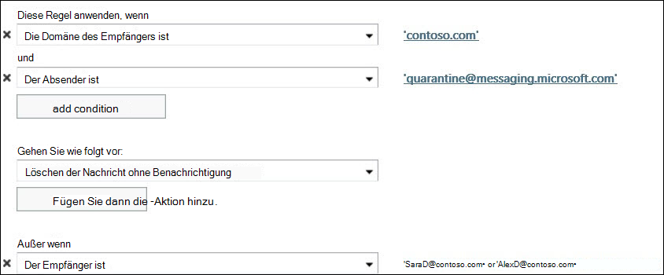

# Konfigurieren von Spambenachrichtigungen für Endbenutzer in EOPConfigure end-user spam notifications in EOP
  
> [!IMPORTANT]
> Dieses Thema betrifft die Kunden einer eigenständigen Lösung von Exchange Online Protection (EOP), die lokale Postfächer schützen möchten.This topic is for Exchange Online Protection (EOP) standalone customers who are protecting on-premises mailboxes. Exchange Online Kunden, die in der Cloud gehostete Postfächer schützen, sollten stattdessen das folgende Thema lesen: [configure End-User Spam Notifications in Exchange Online](configure-end-user-spam-notifications-in-exchange-online.md).Exchange Online customers who are protecting cloud-hosted mailboxes should read the following topic instead: [Configure end-user spam notifications in Exchange Online](configure-end-user-spam-notifications-in-exchange-online.md). 
  
Sie können Spambenachrichtigungen für Endbenutzer für die standardmäßige unternehmensweite Spamfilter Richtlinie oder für benutzerdefinierte Spamfilter Richtlinien konfigurieren.You can configure end-user spam notifications for the default company-wide spam filter policy or for custom spam filter policies. Durch die Aktivierung von Spambenachrichtigungen für Endbenutzer können Ihre Benutzer ihre eigenen isolierten Spam-, Massen-und Phishing-Nachrichten verwalten.Enabling end-user spam notification messages lets your users manage their own quarantined spam, bulk, and phishing messages. 
  
Spambenachrichtigungen für Endbenutzer enthalten eine Liste aller Nachrichten in der Spamquarantäne, die der Endbenutzer in dem von Ihnen konfigurierten Zeitraum (zwischen 1 und 15 Tagen) erhalten hat. Sie können auch die Sprache festlegen, in der die Benachrichtigung geschrieben wird.End-user spam notifications contain a list of all spam-quarantined messages that the end user has received during a time period that you configure (you can specify a value between 1 and 15 days). You can also configure the language in which the notification message is written.
  
Nach dem Empfang einer Benachrichtigung können Endbenutzer eine der folgenden Optionen auswählen:After receiving a notification message, end users can choose from the following options:

**Absender blockieren** , wenn Office 365 den Absender zu Ihrer Liste blockierter Absender hinzufügen möchten.**Block Sender** if you want Office 365 to add the sender to your blocked senders list.

**Release** wenn es sich bei der Nachricht nicht um Spam handelt und Sie möchten, dass Office 365 die Nachricht an Ihr Postfach sendet.**Release** if the message isn't spam and you want Office 365 to send the message to your mailbox.

**Überprüfen** Sie, um zum Quarantäne Portal innerhalb des Security and Compliance Centers zu navigieren, wenn Sie andere Aktionen wie Preview oder Release durchführen möchten.**Review** to navigate to the Quarantine Portal within the Security and Compliance Center if you want to take other actions, such as Preview or Release.
  
## Was sollten Sie wissen, bevor Sie beginnen?What do you need to know before you begin?

Geschätzte Zeit bis zum Abschließen des Vorgangs: 5 MinutenEstimated time to complete: 5 minutes
  
Bevor Sie diese Verfahren ausführen können, müssen Ihnen die entsprechenden Berechtigungen zugewiesen werden. Informationen zu den von Ihnen benötigten Berechtigungen finden Sie unter "Antispam" im Thema [Featureberechtigungen in EOP](feature-permissions-in-eop.md).You need to be assigned permissions before you can perform this procedure or procedures. To see what permissions you need, see the "Anti-spam" entry in the [Feature permissions in EOP](feature-permissions-in-eop.md) topic. 
  
Informationen zu Tastenkombinationen, die möglicherweise für die Verfahren in diesem Thema gelten, finden Sie unter [Tastenkombinationen für das Exchange Admin Center in Exchange Online](https://docs.microsoft.com/Exchange/accessibility/keyboard-shortcuts-in-admin-center).For information about keyboard shortcuts that may apply to the procedures in this topic, see [Keyboard shortcuts for the Exchange admin center in Exchange Online](https://docs.microsoft.com/Exchange/accessibility/keyboard-shortcuts-in-admin-center).
  
## Konfigurieren von Spambenachrichtigungen für Endbenutzer über die Exchange-VerwaltungskonsoleUse the EAC to configure end-user spam notifications

1. Navigieren Sie in der Exchange-Verwaltungskonsole zu **Schutz** > -**Spam Filter**.In the Exchange Admin Center (EAC), navigate to **Protection** > **Spam filter**.
    
2. Wählen Sie die Inhaltsfilterrichtlinie aus, für die Sie Spambenachrichtigungen für Endbenutzer aktivieren möchten (sie sind standardmäßig deaktiviert).Select the content filter policy for which you want to enable end-user spam notifications (they are disabled by default).
    
3. Klicken Sie im rechten Teilfenster, in dem eine Übersicht über Ihre Richtlinie angezeigt wird, auf den Link **Configure End-user spam notifications** (Spambenachrichtigungen für Endbenutzer konfigurieren).In the right pane, where the summary information about your policy appears, click the **Configure End-user spam notifications** link. 
    
4. Konfigurieren Sie im daraufhin angezeigten Dialogfeld die folgenden Optionen:In the subsequent dialog box, you can configure the following options:
    
1. **Enable end-user spam notifications** (Spambenachrichtigungen für Endbenutzer aktivieren) Markieren Sie dieses Kontrollkästchen, um Benachrichtigungen an Endbenutzer für diese Richtlinie zu aktivieren. (Wenn diese Richtlinie aktiviert ist, können Sie auf das Kontrollkästchen klicken, um Spambenachrichtigungen an Endbenutzer für diese Richtlinie zu deaktivieren.)**Enable end-user spam notifications** Select this check box in order to enable end-user spam notifications for this policy. (Conversely, if this policy is enabled, you can clear this check box in order to disable end-user spam notifications for this policy.) 
    
2. **Send end-user spam notifications every (days)** (Spambenachrichtigungen an Endbenutzer senden alle ... Tage) Gibt an, wie oft Spambenachrichtigungen an Endbenutzer gesendet werden sollen. Der Standardwert beträgt 3 Tage. Sie können zwischen 1 und 15 Tagen angeben. Wenn Sie beispielsweise 7 Tage angeben, enthält die Benachrichtigung eine Liste aller Nachrichten der letzten 7 Tage für diesen Benutzer, die stattdessen in die Spamquarantäne verschoben wurden.**Send end-user spam notifications every (days)** Specify how often to send end-user spam notifications. The default is 3 days. You can specify between 1 and 15 days. If you specify 7 days, for example, the notification will include a list of all messages intended for that user within the past 7 days that were sent to the spam quarantine instead. 
    
3. **Notification language** (Benachrichtigungssprache) Wählen Sie in der Dropdown-Liste die Sprache aus, in der Endbenutzer-Spambenachrichtigungen für diese Richtlinie geschrieben werden sollen.**Notification language** Using the drop-down list, select the language in which to write end-user spam notifications for this policy. 
    
5. Klicken Sie auf **Speichern**. Im Bereich auf der rechten Seite wird eine Zusammenfassung der Inhaltsfilter-Richtlinieneinstellungen angezeigt, einschließlich der Einstellungen für Endbenutzer-Spambenachrichtigungen.Click **save**. A summary of your content filter policy settings, including your end-user spam notification settings, appears in the right pane.
    
> [!NOTE]
>  Spambenachrichtigungen für Endbenutzer können nur bei Inhaltsfilterrichtlinien verwendet werden, die aktiviert sind. >  Spam Endbenutzerbenachrichtigungen sind nur einmal pro Tag versendet. Die Zustellungszeit der Benachrichtigung kann für einen bestimmten Kunden nicht garantiert werden und kann nicht konfiguriert werden.End-user spam notifications will only be functional for content filter policies that are enabled. >  End-user spam notifications are only sent once per day. The delivery time of the notification cannot be guaranteed for any specific customer and is not configurable. 
  
 **Tipp:** Wenn Sie Spambenachrichtigungen für Endbenutzer testen möchten, indem Sie sie an eine begrenzte Gruppe von Benutzern senden, bevor Sie sie implementieren, erstellen Sie eine benutzerdefinierte Inhaltsfilterrichtlinie, die Spambenachrichtigungen für Endbenutzer für die Domänen aktiviert, in denen sich die Benutzer befinden.**Tip:** If you want to test end-user spam notifications by sending them to a limited set of users before fully implementing them, create a custom content filter policy that enables end-user spam notifications for the domains in which the users reside. Erstellen Sie dann in der Exchange-Verwaltungskonsole unter **Nachrichtenfluss \> Regeln**eine Nachrichtenfluss Regel (auch als Transportregel bezeichnet), um Nachrichten von Quarantine@Messaging.Microsoft.com (der e-Mail-Adresse, die Benachrichtigungen sendet) mit Ausnahmen für die Benutzer zu blockieren, die die Benachrichtigungen erhalten sollen.Then, in the EAC, under **Mail flow \> rules**, create a mail flow rule (also known as a transport rule) to block messages from quarantine@messaging.microsoft.com (the email address that sends notifications) with exceptions for the users who you want to receive the notifications. Die folgende Abbildung zeigt ein Beispiel für die Erstellung einer Ausnahme für zwei Benutzer (SaraD and AlexD) in der Domäne Contoso.com:The following image is an example of creating an exception for two users (SaraD and AlexD) from domain Contoso.com: 
  

  
## Weitere InformationenFor more information

[Konfigurieren von SpamfilterrichtlinienConfigure your spam filter policies](configure-your-spam-filter-policies.md)
  
