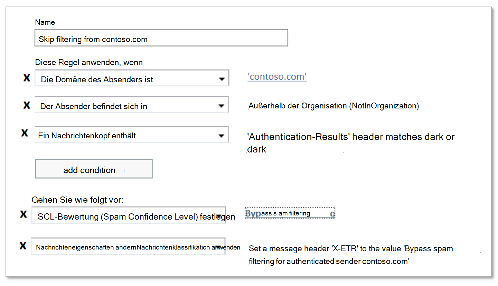

# Erstellen sicherer Absenderlisten in Office 365

Wenn Sie ein Office 365er Kunde mit Postfächern in Exchange Online oder einem eigenständigen Exchange Online Schutz-Kunden (EoP) ohne Exchange Online Postfächer sind, bietet EoP mehrere Möglichkeiten, um sicherzustellen, dass Benutzer e-Mails von vertrauenswürdigen Absendern empfangen können. Zu diesen Optionen gehören Exchange-Nachrichtenfluss Regeln (auch als Transportregeln bezeichnet), Outlook-sichere Absender, die IP-Zulassungsliste (Verbindungsfilterung) und zugelassene Absenderlisten oder zugelassene Domänenlisten in den Antispam-Richtlinien. Sie können diese Optionen gemeinsam als _sichere Absenderlisten_betrachten.

Die verfügbaren Listen für sichere Absender werden in der folgenden Liste beschrieben, um von den meisten empfohlenen empfohlen zu werden:

1. Nachrichtenflussregeln

2. Outlook-sichere Absender

3. IP-Zulassungsliste (Verbindungsfilterung)

4. Zugelassene Absenderlisten oder zugelassene Domänenlisten (Anti-Spam-Richtlinien)

Nachrichtenfluss Regeln ermöglichen die größtmögliche Flexibilität, um sicherzustellen, dass nur die richtigen Nachrichten zulässig sind. Zugelassene Absender und zugelassene Domänenlisten in Anti-Spam-Richtlinien sind nicht so sicher wie die IP-Zulassungsliste, da die e-Mail-Domäne des Absenders leicht gefälscht ist. Die IP-Zulassungsliste stellt jedoch auch ein Risiko dar, da e-Mails von _jeder_ Domäne, die von dieser IP-Adresse gesendet wird, die Spamfilterung umgehen.

> [!IMPORTANT]
> <ul><li>Achten Sie darauf, dass Sie *alle* Ausnahmen, die Sie für die Spamfilterung verwenden, über sichere Absenderlisten überwachen.</li><li>Sie können zwar sichere Absenderlisten verwenden, um bei falsch positiven Ergebnissen zu helfen (gute e-Mail-Nachrichten, die als Spam gekennzeichnet sind), aber Sie sollten die Verwendung von Listen sicherer Absender als eine vorübergehende Lösung in Betracht nehmen, die möglichst vermieden werden sollte. Es wird nicht empfohlen, falsch positive Ergebnisse mithilfe von Listen sicherer Absender zu verwalten, da Ausnahmen bei der Spamfilterung Ihre Organisation für Spoofing und andere Angriffe öffnen können. Wenn Sie auf der Verwendung sicherer Absenderlisten zum Verwalten von falsch positiven Ergebnissen beharren, müssen Sie wachsam sein und das Thema für das [Senden von Spam-, nicht-Spam-und Phishing-e-Mails an Microsoft zur Analyse](submit-spam-non-spam-and-phishing-scam-messages-to-microsoft-for-analysis.md) parat halten.</li><li>Wenn Sie zulassen möchten, dass eine Domäne nicht authentifizierte e-Mails sendet (Schutz vor Spoofing schützt), aber keine Anti-Spam-und Anti-Malware-Überprüfungen umgeht, können Sie Sie der [Liste sicherer Absender von AllowedToSpoof](walkthrough-spoof-intelligence-insight.md) hinzufügen.</li><li>EoP und Outlook prüfen unterschiedliche Nachrichteneigenschaften, um den Absender der Nachricht zu ermitteln. Weitere Informationen finden Sie im Abschnitt [Überlegungen für Massen-e-Mails](#considerations-for-bulk-email) weiter unten in diesem Thema.</li></ul>

Im Gegensatz dazu stehen Ihnen mehrere Optionen zur Verhinderung von e-Mails aus bestimmten Quellen mit _blockierten Absenderlisten_zur Ver, Weitere Informationen finden Sie unter [Create Block Sender Lists in Office 365](create-block-sender-lists-in-office-365.md).

## Empfohlen Verwenden von Nachrichtenfluss Regeln

Nachrichtenfluss Regeln in Exchange Online und eigenständigen EoP verwenden Sie Bedingungen und Ausnahmen zum Identifizieren von Nachrichten und Aktionen, um anzugeben, was für diese Nachrichten ausgeführt werden soll. Weitere Informationen finden Sie unter [Mail flow rules (transport rules) in Exchange Online](https://docs.microsoft.com/Exchange/security-and-compliance/mail-flow-rules/mail-flow-rules).

Im folgenden Beispiel wird davon ausgegangen, dass Sie e-Mails von contoso.com benötigen, um die Spamfilterung zu überspringen. Konfigurieren Sie dazu die folgenden Einstellungen:

1. **Bedingung**: **die Absender** \> **Domäne ist** \> contoso.com.

2. Konfigurieren Sie eine der folgenden Einstellungen:

   - Nachrichten **Fluss Regelbedingung**: **eine Nachrichtenkopfzeile** \> **enthält alle folgenden Wörter** \> **Kopfzeilenname**: `Authentication-Results` \> **Kopfzeilenwert** `dmarc=pass` : `dmarc=bestguesspass`oder.

     Diese Bedingung überprüft den Absender Authentifizierungsstatus der sendenden e-Mail-Domäne, um sicherzustellen, dass die sendende Domäne nicht gefälscht wird. Weitere Informationen zur e-Mail-Authentifizierung finden Sie unter [SPF](set-up-spf-in-office-365-to-help-prevent-spoofing.md), [DKIM](use-dkim-to-validate-outbound-email.md)und [DMARC](use-dmarc-to-validate-email.md).

   - **IP-Zulassungsliste**: Geben Sie die Quell-IP-Adresse oder den Adressbereich in der Verbindungsfilter Richtlinie an.
  
     Verwenden Sie diese Einstellung, wenn die sendende Domäne keine Authentifizierung aufweist. So restriktiv wie möglich sein, wenn es um die Quell-IP-Adressen in der IP-Zulassungsliste geht. Wir empfehlen einen IP-Adressbereich von/24 oder kleiner (kleiner ist besser). Verwenden Sie keine IP-Adressbereiche, die zu Verbraucher Diensten (beispielsweise Outlook.com) oder gemeinsam genutzten Infrastrukturen gehören.

   > [!IMPORTANT]
   > <ul><li>Konfigurieren Sie nie configure-Nachrichtenfluss Regeln *nur* mit der Absenderdomäne als Bedingung zum Überspringen der Spamfilterung. Dadurch wird die Wahrscheinlichkeit *erheblich* erhöht, dass Angreifer die sendende Domäne spoofen können (oder die vollständige e-Mail-Adresse imitieren), die gesamte Spamfilterung überspringen und Absender Authentifizierungsprüfungen überspringen, damit die Nachricht im Posteingang des Empfängers eingeht.</li><li>Verwenden Sie keine Domänen, die Sie besitzen (auch als akzeptierte Domänen bezeichnet) oder beliebte Domänen (beispielsweise Microsoft.com) als Bedingungen in Nachrichtenfluss Regeln. Dies wird als hohes Risiko betrachtet, da dadurch Möglichkeiten für Angreifer zum Senden von e-Mails geschaffen werden, die ansonsten gefiltert würden.</li><li>Wenn Sie eine IP-Adresse zulassen, die hinter einem NAT-Gateway (Network Address Translation, Netzwerkadressübersetzung) liegt, müssen Sie die Server kennen, die am NAT-Pool beteiligt sind, um den Bereich Ihrer IP-Zulassungsliste zu kennen. IP-Adressen und NAT-Teilnehmer können sich ändern. Sie müssen die Einträge in der IP-Zulassungsliste regelmäßig als Teil Ihrer standardmäßigen Wartungsverfahren überprüfen.</li></ul>

3. **Optionale Bedingungen**:

   - **Der Absender** \> **ist intern/extern** \> **außerhalb der Organisation**: Diese Bedingung ist implizit, aber Sie kann nicht verwendet werden, um lokale e-Mail-Server zu berücksichtigen, die möglicherweise nicht ordnungsgemäß konfiguriert sind.

   - **Der Betreff oder** \> Textkörper des Betreffs oder Text **Körpers enthält eines der folgenden** \> \<Wörter Schlüsselwörter\>: Wenn Sie die Nachrichten nach Stichwörtern oder Ausdrücken in der Betreffzeile oder im Nachrichtentext weiter einschränken können, können Sie diese Wörter als Bedingung verwenden.

4. **Aktion**: beide Aktionen in der Regel konfigurieren:

   a. **Ändern der Nachrichteneigenschaften** \> **legen Sie die Spam Confidence Level (SCL) Bypass-** \> **Spamfilterung**fest.

   b. **Eine Nachrichtenkopfzeile** \> **enthält alle folgenden Wörter** \> **Kopfzeilenname**: \<CustomHeaderName\> - **Headerwert**: \<CustomHeaderValue\>.

      Beispiel: `X-ETR: Bypass spam filtering for authenticated sender 'contoso.com'`. Wenn in der Regel mehr als eine Domäne vorhanden ist, können Sie den Kopfzeilentext nach Bedarf anpassen.

      Wenn eine Nachricht Spamfilterung aufgrund einer Nachrichtenfluss Regel überspringt, wird der `SFV:SKN` Wert in der Kopfzeile **X-Forefront-Antispam-Report** gestempelt. Wenn die Nachricht aus einer Quelle stammt, die sich in der Liste der zugelassenen IP `IPV:CAL` -Adressen befindet, wird der Wert ebenfalls hinzugefügt. Diese Werte können Ihnen bei der Problembehandlung helfen.

## Verwenden von sicheren Outlook-Absendern

Anstelle einer Organisations Einstellung können Benutzer oder Administratoren die Absender-e-Mail-Adressen der Liste sicherer Absender im Postfach hinzufügen. Anweisungen finden Sie unter [Konfigurieren von Junk-e-Mail-Einstellungen für Exchange Online Postfächer in Office 365](configure-junk-email-settings-on-exo-mailboxes.md).

Wenn Nachrichten Spamfilterung aufgrund der Liste sicherer Absender eines Benutzers überspringen, enthält das Kopfzeilenfeld **X-Forefront-Antispam-Report** den Wert `SFV:SFE`, der angibt, dass die Spam-, spoof-und Phishing-Filterung umgangen wurde.

## Verwenden der IP-Zulassungsliste

Wenn Sie Nachrichtenfluss Regeln nicht wie zuvor beschrieben verwenden können, ist die nächste beste Option das Hinzufügen des Quell-e-Mail-Servers oder der Server zur IP-Zulassungsliste in der Verbindungsfilter Richtlinie. Ausführliche Informationen finden Sie unter [Konfigurieren der Verbindungsfilterung in Office 365](configure-the-connection-filter-policy.md).

**Hinweise**:

- Es ist wichtig, dass Sie die Anzahl der zulässigen IP-Adressen auf ein Minimum beschränken, daher sollten Sie möglichst keine ganzen IP-Adressbereiche verwenden.

- Verwenden Sie keine IP-Adressbereiche, die zu Verbraucher Diensten (beispielsweise Outlook.com) oder gemeinsam genutzten Infrastrukturen gehören.

- Überprüfen Sie die Einträge in der Liste der zugelassenen IP-Adressen regelmäßig, und entfernen Sie die Einträge, die Sie nicht mehr benötigen.

> [!CAUTION]
> Ohne zusätzliche Überprüfung wie Nachrichtenfluss Regeln überprüfen e-Mails aus Quellen in der Liste der zugelassenen IP-Adressen die Spamfilterung und Absenderauthentifizierung (SPF, DKIM, DMARC). Dadurch wird ein hohes Risiko geschaffen, dass Angreifer erfolgreich e-Mails an den Posteingang übermitteln, die ansonsten gefiltert werden.

## Zugelassene Absenderlisten oder zugelassene Domänenlisten verwenden

Die am wenigsten wünschenswerte Option besteht darin, die Liste Zugelassene Absender oder zugelassene Domänen in den Antispam-Richtlinien zu verwenden. Sie sollten diese Option möglichst vermeiden, da Absender den gesamten Spam-, spoof-und Phishing-Schutz *sowie die Absender* Authentifizierung (SPF, DKIM, DMARC) umgehen. Diese Methode wird am besten nur für temporäre Tests verwendet. Die detaillierten Schritte finden Sie unter [configure Anti-Spam Policies in Office 365](configure-your-spam-filter-policies.md) Topic.

Die Höchstgrenze für diese Listen beträgt ungefähr 1000 Einträge; Sie können jedoch nur 30 Einträge in das Portal eingeben. Sie müssen PowerShell verwenden, um mehr als 30 Einträge hinzuzufügen.

> [!CAUTION]
> <ul><li>Diese Methode führt zu einem hohen Risiko, dass Angreifer erfolgreich e-Mails an den Posteingang übermitteln, die andernfalls gefiltert würden.</li><li>Verwenden Sie keine Domänen, die Sie besitzen (auch als akzeptierte Domänen bezeichnet) oder beliebte Domänen (beispielsweise Microsoft.com) in zugelassenen Domänenlisten.</li></ul>

## Überlegungen zu Massen-e-Mails

Eine standardmäßige SMTP-E-Mail besteht aus einem *Nachrichten-Envelope* und dem Nachrichteninhalt. Der Nachrichtenumschlag enthält Informationen, die für die Übermittlung und Zustellung der Nachricht zwischen SMTP-Servern erforderlich sind. Der Nachrichteninhalt enthält Nachrichtenkopffelder (zusammenfassend als *Nachrichtenkopf* bezeichnet) sowie den Nachrichtentext. Der Nachrichtenumschlag wird in RFC 5321 beschrieben, und der Nachrichtenkopf wird in RFC 5322 beschrieben. Empfänger sehen den tatsächlichen Nachrichtenumschlag nie, da er vom Nachrichtenübertragungsprozess generiert wird und nicht tatsächlich Teil der Nachricht ist.

- Die `5321.MailFrom` Adresse (auch bekannt als **Mail from** Address, P1 Sender oder Envelope Sender) ist die e-Mail-Adresse, die in der SMTP-Übertragung der Nachricht verwendet wird. Diese e-Mail-Adresse wird in der Regel im Headerfeld **Return-Path** in der Nachrichtenkopfzeile aufgezeichnet (obwohl es möglich ist, dass der Absender eine andere e-Mail-Adresse für den **Rückgabepfad** festlegt). Diese e-Mail-Adresse wird für Absender Authentifizierungsprüfungen (SPF, DKIM, DMARC) verwendet, und wenn die Nachricht nicht zugestellt werden kann, ist Sie der Empfänger für den Unzustellbarkeitsbericht (auch bekannt als NDR-oder Bounce-Nachricht). 

- Die `5322.From` (auch bekannt als **von** -Adresse oder P2-Absender bezeichnet) ist die e-Mail-Adresse im Feld **von** -Kopfzeile und die e-Mail-Adresse des Absenders, die in e-Mail-Clients angezeigt wird.

Häufig sind die `5321.MailFrom` und `5322.From` -Adressen identisch (Kommunikation zwischen Mensch und Person). Wenn allerdings die E-Mail im Auftrag eines anderen Benutzers gesendet wird, sind die Adressen häufig verschieden. Dies ist am häufigsten bei Massen-E-Mail-Nachrichten der Fall.

Nehmen wir beispielsweise an, dass die Blue Yonder Airlines Margie es Travel angeheuert hat, um Ihre e-Mail-Werbung zu senden. Die Nachricht, die Sie in Ihrem Posteingang erhalten, verfügt über die folgenden Eigenschaften:

- Die `5321.MailFrom` Adresse lautet blueyonder.Airlines@margiestravel.com.

- Die `5322.From` Adresse lautet blueyonder@News.blueyonderairlines.com, was Sie in Outlook sehen.

Listen für sichere Absender und sichere Domänen in antispamregeln in EoP untersuchen sowohl die `5321.MailFrom` - `5322.From` als auch-Adressen. Outlook-sichere Absender verwenden nur die `5322.From` Adresse.

Um zu verhindern, dass diese Nachricht gefiltert wird, können Sie die folgenden Schritte ausführen:

- Fügen Sie blueyonder@News.blueyonderairlines.com ( `5322.From` die Adresse) als Outlook-sicherer Absender hinzu.

- [Verwenden Sie eine e-Mail-Fluss Regel](#recommended-use-mail-flow-rules) mit einer Bedingung, die nach nach `5322.From` richten von blueyonder@News.blueyonderairlines.com sucht ( `5321.MailFrom`Adresse, blueyonder.Airlines@margiestravel.com () oder beides.

Weitere Informationen finden Sie unter [Erstellen sicherer Absenderlisten in Office 365](create-safe-sender-lists-in-office-365.md).
