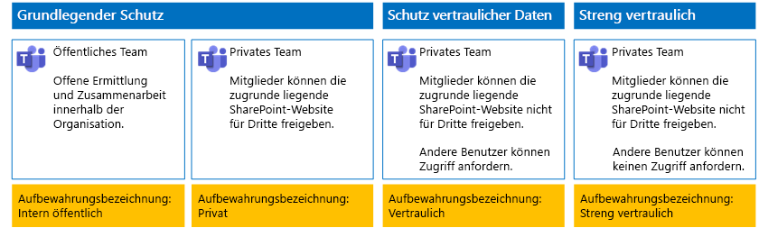
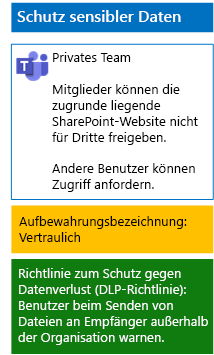
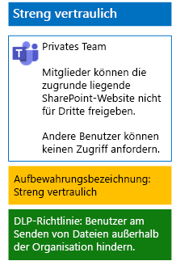

# Schützen von Dateien in Teams mit Aufbewahrungsbezeichnungen und Schutz vor Datenverlust (DLP)

 
Verwenden Sie die Schritte in diesem Artikel, um Richtlinien für Aufbewahrungsbezeichnungen und der Verhinderung von Datenverlust (DLP) für grundlegende, vertrauliche und streng vertrauliche Teams und deren zugrunde liegende SharePoint-Websites zu entwerfen und bereitzustellen. Weitere Informationen zu diesen drei Schutzebenen finden Sie unter [Sichern von Dateien in Microsoft Teams](secure-files-in-teams.md).
  
## Funktionsweise

1. Erstellen Sie die gewünschten Aufbewahrungsbezeichnungen, und veröffentlichen Sie diese. Es kann bis zu 12 Stunden dauern, bis diese veröffentlicht werden.
2. Bearbeiten Sie für die gewünschten zugrunde liegenden SharePoint-Websites die Einstellungen für die Dokumentbibliothek, um die gewünschten Aufbewahrungsbezeichnungen auf Elemente in der Bibliothek anzuwenden.
3. Erstellen Sie DLP-Richtlinien, um Aktionen basierend auf den Aufbewahrungsbezeichnungen auszuführen.

Wenn Benutzer ein Dokument zu der zugrunde liegenden SharePoint-Websitebibliothek hinzufügen, erhält das Dokument standardmäßig die zugewiesene Aufbewahrungsrichtlinie. Benutzer können das die Bezeichnung bei Bedarf ändern. Wenn ein Benutzer ein Dokument außerhalb der Organisation freigibt, prüft DLP, ob eine Bezeichnung zugewiesen ist und ergreift entsprechende Maßnahmen, wenn eine DLP-Richtlinie der Bezeichnung entspricht. DLP sucht auch nach weiteren Richtlinienübereinstimmungen, z. B. das Schützen von Dateien mit Kreditkartennummern, wenn dieser Typ von Richtlinie konfiguriert ist. 

## Aufbewahrungsbezeichnungen für Ihre zugrunde liegenden SharePoint Online-Websites

Es gibt drei Phasen beim Erstellen und anschließenden Zuweisen von Aufbewahrungbezeichnungen zu zugrunde liegenden SharePoint Online-Teamwebsites.
  
### Schritt 1: Bestimmen der Namen der Aufbewahrungsbezeichnung

In dieser Phase bestimmen Sie die Namen Ihrer Aufbewahrungsbezeichnungen für die vier Ebenen des Informationsschutzes, der auf zugrunde liegende SharePoint Online-Teamwebsites angewendet wird. Die folgende Tabelle listet die empfohlenen Namen für jede Ebene auf.
  
|**Schutzebene von zugrunde liegenden SharePoint-Websites**|**Bezeichnungsname**|
|:-----|:-----|
|Grundlegend-Öffentlich    |Intern Öffentlich    |
|Grundlegend-Privat    |Private    |
|Vertraulich    |Vertraulich    |
|Streng vertraulich    |Streng vertraulich    |
   
### Schritt 2: Erstellen der Aufbewahrungsbezeichnungen

In dieser Phase erstellen und veröffentlichen Sie Ihre bestimmten Bezeichnungen für die unterschiedlichen Ebenen des Informationsschutzes.
  
1. Melden Sie sich mit einem Konto beim [Microsoft 365 Compliance-Portal](https://compliance.microsoft.com) an, das über die Rolle „Sicherheitsadministrator“ oder „Unternehmensadministrator“ verfügt.
    
2. Klicken Sie auf der Registerkarte **Start – Microsoft 365 Compliance ** im Browser auf **Klassifizierungen > Bezeichnungen**.
    
3. Klicken Sie auf **Aufbewahrungsbezeichnung > Erstellen einer Bezeichnung**.
    
4. Geben Sie im Bereich zum **Benennen der Bezeichnung** den Namen für die Bezeichnung und eine Beschreibung für Administratoren und Benutzer ein, und klicken Sie auf **Weiter**.

5. Tragen Sie im Bereich **Dateiplanbeschreibungen** die erforderlichen Informationen ein, und klicken Sie dann auf **Weiter**.
    
6. Legen Sie im Bereich **Bezeichnungseigenschaften**, falls erforderlich, **Aufbewahrung** auf **Ein**, und konfigurieren Sie die Aufbewahrungseinstellungen. Klicken Sie auf **Weiter**.
    
7. Klicken Sie im Bereich **Einstellungen überprüfen** auf **Beschriftung erstellen**.
    
8. Für die zusätzlichen Beschriftungen klicken Sie auf **Beschriftung erstellen**, und wiederholen Sie dann bei Bedarf die Schritte 3 bis 7 in diesem Verfahren.
    

### Veröffentlichen neuer Bezeichnungen

Führen Sie dann diese Schritte aus, um die neuen Aufbewahrungsbezeichnungen zu veröffentlichen.
  
1. Klicken Sie im Bereich **Bezeichnungen** auf die Registerkarte **Aufbewahrungsbezeichnungen**, und klicken Sie dann auf **Bezeichnungen veröffentlichen**.
    
2. Klicken Sie im Bereich **Zu veröffentlichende Bezeichnungen wählen** auf **Zu veröffentlichende Bezeichnungen wählen**.
    
3. Klicken Sie im Bereich **Bezeichnungen auswählen** auf **Hinzufügen**, wählen Sie alle vier Bezeichnungen aus, und klicken Sie auf **Hinzufügen**.
    
4. Klicken Sie auf **Fertig**.
    
5. Klicken Sie im Bereich **Zu veröffentlichende Bezeichnungen wählen** auf **Weiter**.
    
6. Klicken Sie im Bereich **Speicherorte auswählen** auf **Weiter**.
    
7. Geben Sie im Bereich zum **Benennen der Richtlinie** einen Namen für den Bezeichnungssatz unter **Name** ein, und klicken Sie dann auf **Weiter**.
    
8. Klicken Sie im Bereich **Einstellungen überprüfen** auf **Bezeichnungen veröffentlichen**, und klicken Sie dann auf **Schließen**.

    
### Schritt 3: Anwenden der Aufbewahrungsbezeichnungen auf Ihre zugrunde liegenden SharePoint Online-Websites

Verwenden Sie die Schritte, um die Aufbewahrungsbezeichnungen auf die Dokumentordner Ihrer zugrunde liegenden SharePoint Online-Websites anzuwenden.
  
1.  Klicken Sie im Team auf **Dateien**, und klicken Sie dann auf **In SharePoint** öffnen.

2. Klicken Sie auf der Registerkarte für die SharePoint-Website Ihres Browsers auf **Dokumente**.
    
3. Klicken Sie auf das Symbol „Einstellungen“, und klicken Sie dann auf **Bibliothekseinstellungen**.
    
4. Klicken Sie unter **Berechtigungen und Verwaltung** auf **Bezeichnung auf Elemente in dieser Bibliothek anwenden**.
    
5. Wählen Sie unter **Einstellungen – Bezeichnung anwenden** die entsprechende Aufbewahrungsbezeichnung, und klicken Sie dann auf **Speichern**.
    
6. Schließen Sie die Registerkarte für die SharePoint-Website.
    
7. Wiederholen Sie die Schritte 1 bis 6, um Ihren zusätzlichen zugrunde liegenden SharePoint-Websites Aufbewahrungsbezeichnungen hinzuzufügen.
    
Nachfolgend sehen Sie die daraus resultierende Konfiguration.
  

  
## DLP-Richtlinien für Ihre zugrunde liegenden SharePoint-Websites

Gehen Sie wie folgt vor, um eine DLP-Richtlinie zu konfigurieren, die Benutzer benachrichtigt, wenn sie ein Dokument auf einer zugrunde liegenden SharePoint-Website mit Benutzern außerhalb der Organisation teilen.

1. Melden Sie sich mit einem Konto beim [Microsoft 365 Compliance-Portal](https://compliance.microsoft.com/) an, das über die Rolle „Sicherheitsadministrator“ oder „Unternehmensadministrator“ verfügt.
    
2. Klicken Sie auf der Registerkarte **Microsoft 365 Compliance** in Ihrem Browser auf **Richtlinien > Verhinderung von Datenverlust**.
    
3. Klicken Sie im Bereich **Verhinderung von Datenverlust** auf **Richtlinie erstellen**.
    
4. Klicken Sie im Bereich **Mit einer Vorlage beginnen oder eine benutzerdefinierte Richtlinie erstellen** auf **Benutzerdefiniert**, und klicken Sie dann auf **Weiter**.
    
5. Geben Sie im Bereich **Benennen Sie Ihre Richtlinie** unter **Name** den Namen der DLP-Richtlinie für die Vertraulichkeitsebene ein, und klicken Sie dann auf **Weiter**.
    
6. Klicken Sie im Bereich **Speicherorte auswählen** auf **Bestimmte Speicherorte auswählen**, und klicken Sie dann auf **Weiter**.
    
7. Deaktivieren Sie in der Liste der Speicherorte **Exchange-E-Mail**, **OneDrive-Konten** und **Teams-Chat- und Kanalnachrichten**, und klicken Sie dann auf **Weiter**.
    
8. Klicken Sie im Bereich **Anpassen des zu schützenden Inhaltstyps** auf **Bearbeiten**.
    
9. In der **wählen Sie die Typen der Inhalte zum Schutz** Bereich, klicken Sie auf **hinzufügen** im Dropdown-Listenfeld, und klicken Sie dann auf **Aufbewahrungsbezeichnungen**.
    
10. Klicken Sie im Bereich **Aufbewahrungsbezeichnungen** auf **Hinzufügen**, wählen Sie die Bezeichnung **Vertraulich** aus, klicken Sie auf **Hinzufügen**, und klicken Sie dann auf **Fertig**.
    
11. Klicken Sie im Bereich **Typen des zu schützenden Inhalts auswählen** auf **Speichern**.
    
12. Klicken Sie im Bereich **Anpassen des zu schützenden Inhaltstyps** auf **Weiter**.

13. Klicken Sie im Bereich **Was möchten Sie tun, wenn vertrauliche Informationen erkannt werden?** auf **Richtlinientipptext anpassen**.
    
14. Klicken Sie im Bereich **Customize policy tips and email notifications** (Anpassen der Richtlinientipps und der E-Mail-Benachrichtigungen) auf **Customize the policy tip text** (Den Tipptext der Richtlinie als nächstes anpassen).
    
15. Geben Sie im Textfeld einen der folgenden Tipps ein:
    
  - Wenn Sie eine Datei für einen Benutzer außerhalb der Organisation freigeben möchten, laden Sie die Datei herunter, und öffnen Sie sie. Klicken Sie auf „Datei“ > „Dokument schützen“ > „Mit Kennwort verschlüsseln“, und geben Sie dann ein sicheres Kennwort ein. Senden Sie das Kennwort in einer separaten E-Mail oder auf andere Weise.
  - Streng vertrauliche Dateien werden durch Verschlüsselung geschützt. Nur externe Benutzer, die Berechtigungen für diese Dateien von Ihrer IT-Abteilung erhalten haben, können diese lesen.
    
    Sie können auch einen eigenen Tipp in Bezug auf die Richtlinie eingeben oder einfügen, der den Benutzern erläutert, wie sie Dateien außerhalb der Organisation freigeben.
    
16. Klicken Sie auf **OK**.
    
17. Klicken Sie im Bereich **Was möchten Sie tun, wenn vertrauliche Informationen erkannt werden?** auf **Weiter**.
    
18. Klicken Sie im Bereich **Möchten Sie die Richtlinie aktivieren oder zunächst testen?** auf **Ja, Richtlinie aktivieren**, und klicken Sie dann auf **Weiter**.
    
19. Klicken Sie im Bereich **Einstellungen überprüfen** auf **Erstellen**, und klicken Sie dann auf **Schließen**.
    
Hier sehen Sie die sich ergebende Konfiguration für vertrauliche Teams.
  

  
Gehen Sie wie folgt vor, um eine DLP-Richtlinie zu konfigurieren, die Benutzer blockiert, wenn sie ein Dokument auf einer zugrunde liegenden SharePoint-Website mit Benutzern außerhalb der Organisation teilen.
  
1. Klicken Sie auf der Registerkarte **Microsoft 365 Compliance** in Ihrem Browser auf **Richtlinien > Verhinderung von Datenverlust**.
    
2. Klicken Sie im Bereich **Verhinderung von Datenverlust** auf **Richtlinie erstellen**.
    
3. Klicken Sie im Bereich **Mit einer Vorlage beginnen oder eine benutzerdefinierte Richtlinie erstellen** auf **Benutzerdefiniert**, und klicken Sie dann auf **Weiter**.
    
4. Geben Sie im Bereich **Benennen Sie Ihre Richtlinie** unter **Name** den Namen der DLP-Richtlinie für die streng vertrauliche Ebene ein, und klicken Sie dann auf **Weiter**.
    
5. Klicken Sie im Bereich **Speicherorte auswählen** auf **Bestimmte Speicherorte auswählen**, und klicken Sie dann auf **Weiter**.
    
6. Deaktivieren Sie in der Liste der Speicherorte **Exchange-E-Mail**, **OneDrive-Konten** und **Teams-Chat- und Kanalnachrichten**, und klicken Sie dann auf **Weiter**.
    
7. Klicken Sie im Bereich **Typen von vertraulichen Informationen anpassen, die geschützt werden sollen** auf **Bearbeiten**.
    
8. In der **wählen Sie die Typen der Inhalte zum Schutz** Bereich, klicken Sie auf **hinzufügen** im Dropdown-Listenfeld, und klicken Sie dann auf **Aufbewahrungsbezeichnungen**.
    
9. Klicken Sie im Bereich **Aufbewahrungsbezeichnungen** auf **Hinzufügen**, wählen Sie die Bezeichnung **Streng vertraulich** aus, klicken Sie auf **Hinzufügen**, und klicken Sie dann auf **Fertig**.
    
10. Klicken Sie im Bereich **Typen des zu schützenden Inhalts auswählen** auf **Speichern**.
    
12. Klicken Sie im Bereich **Customize the types of sensitive info you want to protect** (Anpassen der Typen an vertraulichen Informationen, die Sie schützen möchten) auf **Weiter**.
    
13. Klicken Sie im Bereich **What do you want to do if we detect sensitive info?** (Was möchten Sie tun, wenn vertrauliche Informationen erkannt werden?) auf **Customize the tip and email** (Den Tipp und die E-Mail anpassen).
    
14. Klicken Sie im Bereich **Customize policy tips and email notifications** (Anpassen der Richtlinientipps und der E-Mail-Benachrichtigungen) auf **Customize the policy tip text** (Den Tipptext der Richtlinie als nächstes anpassen).
    
15. Geben Sie Folgendes in das Textfeld ein, oder fügen Sie es ein:
    
  - Wenn Sie eine Datei für einen Benutzer außerhalb der Organisation freigeben möchten, laden Sie die Datei herunter, und öffnen Sie sie. Klicken Sie auf „Datei“ > „Dokument schützen“ > „Mit Kennwort verschlüsseln“, und geben Sie dann ein sicheres Kennwort ein. Senden Sie das Kennwort in einer separaten E-Mail oder auf andere Weise.
    
    Sie können auch einen eigenen Tipp in Bezug auf die Richtlinie eingeben oder einfügen, der den Benutzern erläutert, wie sie Dateien außerhalb der Organisation freigeben.
    
16. Klicken Sie auf **OK**.
    
17. Klicken Sie im Bereich **Was möchten Sie tun, wenn vertrauliche Informationen erkannt werden?** unter **Erkennen, wenn eine bestimmte Menge personenbezogener Informationen auf einmal freigegeben wird** auf **Zugriff einschränken oder Inhalt verschlüsseln** und dann auf **Weiter**.
    
18. Klicken Sie im Bereich **Möchten Sie die Richtlinie aktivieren oder zunächst testen?** auf **Ja, Richtlinie aktivieren**, und klicken Sie dann auf **Weiter**.
    
19. Klicken Sie im Bereich **Einstellungen überprüfen** auf **Erstellen**, und klicken Sie dann auf **Schließen**.
    
Hier sehen Sie die sich ergebende Konfiguration für streng vertrauliche Teams an.
  

  
## Nächster Schritt

[Schützen von Dateien in Teams mit Vertraulichkeitsbezeichnungen](deploy-teams-sensitivity-labels.md)
    
## Siehe auch

[Sichern von Dateien in Microsoft Teams](secure-files-in-teams.md)
  
[Cloudakzeptanz und Hybridlösungen](https://docs.microsoft.com/office365/enterprise/cloud-adoption-and-hybrid-solutions)

