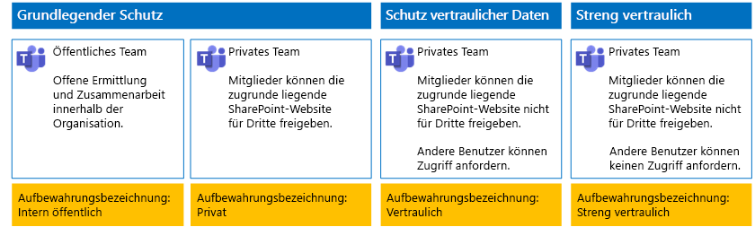
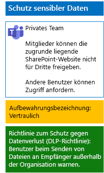
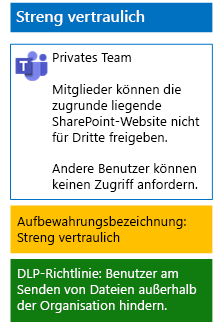

# Schützen von Dateien in Teams mit Aufbewahrungsbezeichnungen und Schutz vor Datenverlust (DLP)Protect files in teams with retention labels and DLP

 
Verwenden Sie die Schritte in diesem Artikel, um Richtlinien für Aufbewahrungsbezeichnungen und der Verhinderung von Datenverlust (DLP) für grundlegende, vertrauliche und streng vertrauliche Teams und deren zugrunde liegende SharePoint-Websites zu entwerfen und bereitzustellen.Use the steps in this article to design and deploy retention labels and data loss prevention (DLP) policies for baseline, sensitive, and highly confidential teams and their underlying SharePoint sites. Weitere Informationen zu diesen drei Schutzebenen finden Sie unter [Sichern von Dateien in Microsoft Teams](secure-files-in-teams.md).For more information about these three tiers of protection, see [Secure files in Microsoft Teams](secure-files-in-teams.md).
  
## FunktionsweiseHow this works

1. Erstellen Sie die gewünschten Aufbewahrungsbezeichnungen, und veröffentlichen Sie diese.Create the desired retention labels and publish these. Es kann bis zu 12 Stunden dauern, bis diese veröffentlicht werden.It can take up to 12 hours for these to be published.
2. Bearbeiten Sie für die gewünschten zugrunde liegenden SharePoint-Websites die Einstellungen für die Dokumentbibliothek, um die gewünschten Aufbewahrungsbezeichnungen auf Elemente in der Bibliothek anzuwenden.For the desired underlying SharePoint sites, edit the document library settings to apply the desired retention labels to items in the library.
3. Erstellen Sie DLP-Richtlinien, um Aktionen basierend auf den Aufbewahrungsbezeichnungen auszuführen.Create DLP policies to take action based on the retention labels.

Wenn Benutzer ein Dokument zu der zugrunde liegenden SharePoint-Websitebibliothek hinzufügen, erhält das Dokument standardmäßig die zugewiesene Aufbewahrungsrichtlinie.When users add a document to the underlying SharePoint site library for the team, the document will receive the assigned retention label by default. Benutzer können das die Bezeichnung bei Bedarf ändern.Users can change the label, if needed. Wenn ein Benutzer ein Dokument außerhalb der Organisation freigibt, prüft DLP, ob eine Bezeichnung zugewiesen ist und ergreift entsprechende Maßnahmen, wenn eine DLP-Richtlinie der Bezeichnung entspricht.When a user shares a document outside the organization, DLP will check to see if a label is assigned and take action if a DLP policy matches the label. DLP sucht auch nach weiteren Richtlinienübereinstimmungen, z. B. das Schützen von Dateien mit Kreditkartennummern, wenn dieser Typ von Richtlinie konfiguriert ist.DLP will look for other policy matches as well, such as protecting files with credit card numbers if this type of policy is configured. 

## Aufbewahrungsbezeichnungen für Ihre zugrunde liegenden SharePoint Online-WebsitesRetention labels for your underlying SharePoint sites

Es gibt drei Phasen beim Erstellen und anschließenden Zuweisen von Aufbewahrungbezeichnungen zu zugrunde liegenden SharePoint Online-Teamwebsites.There are three phases to creating and then assigning retention labels to underlying SharePoint sites.
  
### Schritt 1: Bestimmen der Namen der AufbewahrungsbezeichnungStep 1: Determine the retention label names

In dieser Phase bestimmen Sie die Namen Ihrer Aufbewahrungsbezeichnungen für die vier Ebenen des Informationsschutzes, der auf zugrunde liegende SharePoint Online-Teamwebsites angewendet wird.In this phase, you determine the names of your retention labels for the four levels of information protection applied to underlying SharePoint sites. Die folgende Tabelle listet die empfohlenen Namen für jede Ebene auf.The following table lists the recommended names for each level.
  
|**Schutzebene von zugrunde liegenden SharePoint-Websites****underlying SharePoint sites protection level**|**Bezeichnungsname****Label name**|
|:-----|:-----|
|Grundlegend-ÖffentlichBaseline-Public    |Intern ÖffentlichInternal public    |
|Grundlegend-PrivatBaseline-Private    |PrivatePrivate    |
|VertraulichSensitive    |VertraulichSensitive    |
|Streng vertraulichHighly Confidential    |Streng vertraulichHighly Confidential    |
   
### Schritt 2: Erstellen der AufbewahrungsbezeichnungenStep 2: Create the retention labels

In dieser Phase erstellen und veröffentlichen Sie Ihre bestimmten Bezeichnungen für die unterschiedlichen Ebenen des Informationsschutzes.In this phase, you create and then publish your determined labels for the different levels of information protection.
  
1. Melden Sie sich mit einem Konto beim [Microsoft 365 Compliance-Portal](https://compliance.microsoft.com) an, das über die Rolle „Sicherheitsadministrator“ oder „Unternehmensadministrator“ verfügt.Sign in to the [Microsoft 365 compliance portal](https://compliance.microsoft.com) with an account that has the Security Administrator or Company Administrator role.
    
2. Klicken Sie auf der Registerkarte \*\*Start – Microsoft 365 Compliance \*\* im Browser auf **Klassifizierungen > Bezeichnungen**.From the **Home - Microsoft 365 compliance** tab of your browser, click **Classifications > Labels**.
    
3. Klicken Sie auf **Aufbewahrungsbezeichnung > Erstellen einer Bezeichnung**.Click **Retention labels > Create a label**.
    
4. Geben Sie im Bereich zum **Benennen der Bezeichnung** den Namen für die Bezeichnung und eine Beschreibung für Administratoren und Benutzer ein, und klicken Sie auf **Weiter**.On the **Name your label** pane, type the name of the label and a description for admins and users, and then click **Next**.

5. Tragen Sie im Bereich **Dateiplanbeschreibungen** die erforderlichen Informationen ein, und klicken Sie dann auf **Weiter**.On the **File plan descriptors** pane, fill in as needed, and then click **Next**.
    
6. Legen Sie im Bereich **Bezeichnungseigenschaften**, falls erforderlich, **Aufbewahrung** auf **Ein**, und konfigurieren Sie die Aufbewahrungseinstellungen.On the **Label settings** pane, if needed, set **Retention** to **On** and configure retention settings. Klicken Sie auf **Weiter**.Click **Next**.
    
7. Klicken Sie im Bereich **Einstellungen überprüfen** auf **Beschriftung erstellen**.On the **Review your settings** pane, click **Create the label**.
    
8. Für die zusätzlichen Beschriftungen klicken Sie auf **Beschriftung erstellen**, und wiederholen Sie dann bei Bedarf die Schritte 3 bis 7 in diesem Verfahren.For your additional labels, click **Create a label**, and then repeat steps 3-7 in this procedure as needed.
    

### Veröffentlichen neuer BezeichnungenPublish your new labels

Führen Sie dann diese Schritte aus, um die neuen Aufbewahrungsbezeichnungen zu veröffentlichen.Next, use these steps to publish the new retention labels.
  
1. Klicken Sie im Bereich **Bezeichnungen** auf die Registerkarte **Aufbewahrungsbezeichnungen**, und klicken Sie dann auf **Bezeichnungen veröffentlichen**.From the **Labels** pane, click the **Retention labels** tab, and then click **Publish labels**.
    
2. Klicken Sie im Bereich **Zu veröffentlichende Bezeichnungen wählen** auf **Zu veröffentlichende Bezeichnungen wählen**.On the **Choose labels to publish** pane, click **Choose labels to publish**.
    
3. Klicken Sie im Bereich **Bezeichnungen auswählen** auf **Hinzufügen**, wählen Sie alle vier Bezeichnungen aus, und klicken Sie auf **Hinzufügen**.On the **Choose labels** pane, click **Add**, select all four labels, click **Add**.
    
4. Klicken Sie auf **Fertig**.Click **Done**.
    
5. Klicken Sie im Bereich **Zu veröffentlichende Bezeichnungen wählen** auf **Weiter**.On the **Choose labels to publish** pane, click **Next**.
    
6. Klicken Sie im Bereich **Speicherorte auswählen** auf **Weiter**.On the **Choose locations** pane, click **Next**.
    
7. Geben Sie im Bereich zum **Benennen der Richtlinie** einen Namen für den Bezeichnungssatz unter **Name** ein, und klicken Sie dann auf **Weiter**.On the **Name your policy** pane, type a name for your set of labels in **Name**, and then click **Next**.
    
8. Klicken Sie im Bereich **Einstellungen überprüfen** auf **Bezeichnungen veröffentlichen**, und klicken Sie dann auf **Schließen**.On the **Review your settings** pane, click **Publish labels**, and then click **Close**.

    
### Schritt 3: Anwenden der Aufbewahrungsbezeichnungen auf Ihre zugrunde liegenden SharePoint Online-WebsitesStep 3: Apply the retention labels to your underlying SharePoint sites

Verwenden Sie die Schritte, um die Aufbewahrungsbezeichnungen auf die Dokumentordner Ihrer zugrunde liegenden SharePoint Online-Websites anzuwenden.Use these steps to apply the retention labels to the documents folders of your underlying SharePoint sites.
  
1.  Klicken Sie im Team auf **Dateien**, und klicken Sie dann auf **In SharePoint** öffnen.From the team, click **Files**, and then click **Open in SharePoint**.

2. Klicken Sie auf der Registerkarte für die SharePoint-Website Ihres Browsers auf **Dokumente**.In the new SharePoint site tab of your browser, click **Documents**.
    
3. Klicken Sie auf das Symbol „Einstellungen“, und klicken Sie dann auf **Bibliothekseinstellungen**.Click the settings icon, and then click **Library settings**.
    
4. Klicken Sie unter **Berechtigungen und Verwaltung** auf **Bezeichnung auf Elemente in dieser Bibliothek anwenden**.Under **Permissions and Management**, click **Apply label to items in this library**.
    
5. Wählen Sie unter **Einstellungen – Bezeichnung anwenden** die entsprechende Aufbewahrungsbezeichnung, und klicken Sie dann auf **Speichern**.In **Settings-Apply Label**, select the appropriate retention label, and then click **Save**.
    
6. Schließen Sie die Registerkarte für die SharePoint-Website.Close the tab for the SharePoint site.
    
7. Wiederholen Sie die Schritte 1 bis 6, um Ihren zusätzlichen zugrunde liegenden SharePoint-Websites Aufbewahrungsbezeichnungen hinzuzufügen.Repeat steps 1-6 to assign retention labels to your additional underlying SharePoint sites.
    
Nachfolgend sehen Sie die daraus resultierende Konfiguration.Here is your resulting configuration.
  

  
## DLP-Richtlinien für Ihre zugrunde liegenden SharePoint-WebsitesDLP policies for your underlying SharePoint sites

Gehen Sie wie folgt vor, um eine DLP-Richtlinie zu konfigurieren, die Benutzer benachrichtigt, wenn sie ein Dokument auf einer zugrunde liegenden SharePoint-Website mit Benutzern außerhalb der Organisation teilen.Use these steps to configure a DLP policy that notifies users when they share a document on an underlying SharePoint site outside the organization.

1. Melden Sie sich mit einem Konto beim [Microsoft 365 Compliance-Portal](https://compliance.microsoft.com/) an, das über die Rolle „Sicherheitsadministrator“ oder „Unternehmensadministrator“ verfügt.Sign in to the [Microsoft 365 compliance portal](https://compliance.microsoft.com/) with an account that has the Security Administrator or Company Administrator role.
    
2. Klicken Sie auf der Registerkarte **Microsoft 365 Compliance** in Ihrem Browser auf **Richtlinien > Verhinderung von Datenverlust**.On the new **Microsoft 365 compliance** tab in your browser, click **Policies > Data loss prevention**.
    
3. Klicken Sie im Bereich **Verhinderung von Datenverlust** auf **Richtlinie erstellen**.In the **Home > Data loss prevention** pane, click **Create a policy**.
    
4. Klicken Sie im Bereich **Mit einer Vorlage beginnen oder eine benutzerdefinierte Richtlinie erstellen** auf **Benutzerdefiniert**, und klicken Sie dann auf **Weiter**.In the **Start with a template or create a custom policy** pane, click **Custom**, and then click **Next**.
    
5. Geben Sie im Bereich **Benennen Sie Ihre Richtlinie** unter **Name** den Namen der DLP-Richtlinie für die Vertraulichkeitsebene ein, und klicken Sie dann auf **Weiter**.In the **Name your policy** pane, type the name for the sensitive level DLP policy in **Name**, and then click **Next**.
    
6. Klicken Sie im Bereich **Speicherorte auswählen** auf **Bestimmte Speicherorte auswählen**, und klicken Sie dann auf **Weiter**.In the **Choose locations** pane, click **Let me choose specific locations**, and then click **Next**.
    
7. Deaktivieren Sie in der Liste der Speicherorte **Exchange-E-Mail**, **OneDrive-Konten** und **Teams-Chat- und Kanalnachrichten**, und klicken Sie dann auf **Weiter**.In the list of locations, disable the **Exchange email**, **OneDrive accounts**, and **Teams chat and channel messages** locations, and then click **Next**.
    
8. Klicken Sie im Bereich **Anpassen des zu schützenden Inhaltstyps** auf **Bearbeiten**.In the **Customize the type of content you want to protect** pane, click **Edit**.
    
9. In der **wählen Sie die Typen der Inhalte zum Schutz** Bereich, klicken Sie auf **hinzufügen** im Dropdown-Listenfeld, und klicken Sie dann auf **Aufbewahrungsbezeichnungen**.In the **Choose the types of content to protect** pane, click **Add** in the drop-down box, and then click **Retention labels**.
    
10. Klicken Sie im Bereich **Aufbewahrungsbezeichnungen** auf **Hinzufügen**, wählen Sie die Bezeichnung **Vertraulich** aus, klicken Sie auf **Hinzufügen**, und klicken Sie dann auf **Fertig**.In the **Retention labels** pane, click **Add**, select the **Sensitive** label, click **Add**, and then click **Done**.
    
11. Klicken Sie im Bereich **Typen des zu schützenden Inhalts auswählen** auf **Speichern**.In the **Choose the types of content to protect** pane, click **Save**.
    
12. Klicken Sie im Bereich **Anpassen des zu schützenden Inhaltstyps** auf **Weiter**.In the **Customize the type of content you want to protect** pane, click **Next**.

13. Klicken Sie im Bereich **Was möchten Sie tun, wenn vertrauliche Informationen erkannt werden?** auf **Richtlinientipptext anpassen**.In the **What do you want to do if we detect sensitive info?** pane, click **Customize the tip and email**.
    
14. Klicken Sie im Bereich **Customize policy tips and email notifications** (Anpassen der Richtlinientipps und der E-Mail-Benachrichtigungen) auf **Customize the policy tip text** (Den Tipptext der Richtlinie als nächstes anpassen).In the **Customize policy tips and email notifications** pane, click **Customize the policy tip text**.
    
15. Geben Sie im Textfeld einen der folgenden Tipps ein:In the text box, type or paste in one of the following tips:
    
  - Wenn Sie eine Datei für einen Benutzer außerhalb der Organisation freigeben möchten, laden Sie die Datei herunter, und öffnen Sie sie. Klicken Sie auf „Datei“ > „Dokument schützen“ > „Mit Kennwort verschlüsseln“, und geben Sie dann ein sicheres Kennwort ein. Senden Sie das Kennwort in einer separaten E-Mail oder auf andere Weise.To share with a user outside the organization, download the file and then open it. Click File, then Protect Document, and then Encrypt with Password, and then specify a strong password. Send the password in a separate email or other means of communication.
  - Streng vertrauliche Dateien werden durch Verschlüsselung geschützt. Nur externe Benutzer, die Berechtigungen für diese Dateien von Ihrer IT-Abteilung erhalten haben, können diese lesen.Highly confidential files are protected with encryption. Only external users who are granted permissions to these files by your IT department can read them.
    
    Sie können auch einen eigenen Tipp in Bezug auf die Richtlinie eingeben oder einfügen, der den Benutzern erläutert, wie sie Dateien außerhalb der Organisation freigeben.Alternately, type or paste in your own policy tip that instructs users on how to share a file outside your organization.
    
16. Klicken Sie auf **OK**.Click **OK**.
    
17. Klicken Sie im Bereich **Was möchten Sie tun, wenn vertrauliche Informationen erkannt werden?** auf **Weiter**.In the **What do you want to do if we detect sensitive info?** pane, click **Next**.
    
18. Klicken Sie im Bereich **Möchten Sie die Richtlinie aktivieren oder zunächst testen?** auf **Ja, Richtlinie aktivieren**, und klicken Sie dann auf **Weiter**.In the **Do you want to turn on the policy or test things out first?** pane, click **Yes, turn it on right away**, and then click **Next**.
    
19. Klicken Sie im Bereich **Einstellungen überprüfen** auf **Erstellen**, und klicken Sie dann auf **Schließen**.In the **Review your settings** pane, click **Create**, and then click **Close**.
    
Hier sehen Sie die sich ergebende Konfiguration für vertrauliche Teams.Here is your resulting configuration for sensitive teams.
  

  
Gehen Sie wie folgt vor, um eine DLP-Richtlinie zu konfigurieren, die Benutzer blockiert, wenn sie ein Dokument auf einer zugrunde liegenden SharePoint-Website mit Benutzern außerhalb der Organisation teilen.Next, use these steps to configure a DLP policy that blocks users when they share a document on an underlying SharePoint site outside the organization.
  
1. Klicken Sie auf der Registerkarte **Microsoft 365 Compliance** in Ihrem Browser auf **Richtlinien > Verhinderung von Datenverlust**.On the new **Microsoft 365 compliance** tab in your browser, click **Policies > Data loss prevention**.
    
2. Klicken Sie im Bereich **Verhinderung von Datenverlust** auf **Richtlinie erstellen**.In the **Data loss prevention** pane, click **Create a policy**.
    
3. Klicken Sie im Bereich **Mit einer Vorlage beginnen oder eine benutzerdefinierte Richtlinie erstellen** auf **Benutzerdefiniert**, und klicken Sie dann auf **Weiter**.In the **Start with a template or create a custom policy** pane, click **Custom**, and then click **Next**.
    
4. Geben Sie im Bereich **Benennen Sie Ihre Richtlinie** unter **Name** den Namen der DLP-Richtlinie für die streng vertrauliche Ebene ein, und klicken Sie dann auf **Weiter**.In the **Name your policy** pane, type the name for the highly sensitive level DLP policy in **Name**, and then click **Next**.
    
5. Klicken Sie im Bereich **Speicherorte auswählen** auf **Bestimmte Speicherorte auswählen**, und klicken Sie dann auf **Weiter**.In the **Choose locations** pane, click **Let me choose specific locations**, and then click **Next**.
    
6. Deaktivieren Sie in der Liste der Speicherorte **Exchange-E-Mail**, **OneDrive-Konten** und **Teams-Chat- und Kanalnachrichten**, und klicken Sie dann auf **Weiter**.In the list of locations, disable the **Exchange email**, **OneDrive accounts**, and **Teams chat and channel messages** locations, and then click **Next**.
    
7. Klicken Sie im Bereich **Typen von vertraulichen Informationen anpassen, die geschützt werden sollen** auf **Bearbeiten**.In the **Customize the types of sensitive info you want to protect** pane, click **Edit**.
    
8. In der **wählen Sie die Typen der Inhalte zum Schutz** Bereich, klicken Sie auf **hinzufügen** im Dropdown-Listenfeld, und klicken Sie dann auf **Aufbewahrungsbezeichnungen**.In the **Choose the types of content to protect** pane, click **Add** in the drop-down box, and then click **Retention labels**.
    
9. Klicken Sie im Bereich **Aufbewahrungsbezeichnungen** auf **Hinzufügen**, wählen Sie die Bezeichnung **Streng vertraulich** aus, klicken Sie auf **Hinzufügen**, und klicken Sie dann auf **Fertig**.In the **Retention labels** pane, click **Add**, select the **Highly Confidential** label, click **Add**, and then click **Done**.
    
10. Klicken Sie im Bereich **Typen des zu schützenden Inhalts auswählen** auf **Speichern**.In the **Choose the types of content to protect** pane, click **Save**.
    
12. Klicken Sie im Bereich **Customize the types of sensitive info you want to protect** (Anpassen der Typen an vertraulichen Informationen, die Sie schützen möchten) auf **Weiter**.In the **Customize the types of sensitive info you want to protect** pane, click **Next**.
    
13. Klicken Sie im Bereich **What do you want to do if we detect sensitive info?** (Was möchten Sie tun, wenn vertrauliche Informationen erkannt werden?) auf **Customize the tip and email** (Den Tipp und die E-Mail anpassen).In the **What do you want to do if we detect sensitive info?** pane, click **Customize the tip and email**.
    
14. Klicken Sie im Bereich **Customize policy tips and email notifications** (Anpassen der Richtlinientipps und der E-Mail-Benachrichtigungen) auf **Customize the policy tip text** (Den Tipptext der Richtlinie als nächstes anpassen).In the **Customize policy tips and email notifications** pane, click **Customize the policy tip text**.
    
15. Geben Sie Folgendes in das Textfeld ein, oder fügen Sie es ein:In the text box, type or paste in the following:
    
  - Wenn Sie eine Datei für einen Benutzer außerhalb der Organisation freigeben möchten, laden Sie die Datei herunter, und öffnen Sie sie. Klicken Sie auf „Datei“ > „Dokument schützen“ > „Mit Kennwort verschlüsseln“, und geben Sie dann ein sicheres Kennwort ein. Senden Sie das Kennwort in einer separaten E-Mail oder auf andere Weise.To share with a user outside the organization, download the file and then open it. Click File, then Protect Document, and then Encrypt with Password, and then specify a strong password. Send the password in a separate email or other means of communication.
    
    Sie können auch einen eigenen Tipp in Bezug auf die Richtlinie eingeben oder einfügen, der den Benutzern erläutert, wie sie Dateien außerhalb der Organisation freigeben.Alternately, type or paste in your own policy tip that instructs users on how to share a file outside your organization.
    
16. Klicken Sie auf **OK**.Click **OK**.
    
17. Klicken Sie im Bereich **Was möchten Sie tun, wenn vertrauliche Informationen erkannt werden?** unter **Erkennen, wenn eine bestimmte Menge personenbezogener Informationen auf einmal freigegeben wird** auf **Zugriff einschränken oder Inhalt verschlüsseln** und dann auf **Weiter**.In the **What do you want to do if we detect sensitive info?** pane, under **Detect when a specific amount of sensitive info is being shared at one time**, click **Restrict access or encrypt the content**, and then click **Next**.
    
18. Klicken Sie im Bereich **Möchten Sie die Richtlinie aktivieren oder zunächst testen?** auf **Ja, Richtlinie aktivieren**, und klicken Sie dann auf **Weiter**.In the **Do you want to turn on the policy or test things out first?** pane, click **Yes, turn it on right away**, and then click **Next**.
    
19. Klicken Sie im Bereich **Einstellungen überprüfen** auf **Erstellen**, und klicken Sie dann auf **Schließen**.In the **Review your settings** pane, click **Create**, and then click **Close**.
    
Hier sehen Sie die sich ergebende Konfiguration für streng vertrauliche Teams an.Here is your resulting configuration for high confidentiality team.
  

  
## Nächster SchrittNext step

[Schützen von Dateien in Teams mit VertraulichkeitsbezeichnungenProtect files in teams with sensitivity labels](deploy-teams-sensitivity-labels.md)
    
## Siehe auchSee Also

[Sichern von Dateien in Microsoft TeamsSecure files in Microsoft Teams](secure-files-in-teams.md)
  
[Cloudakzeptanz und HybridlösungenCloud adoption and hybrid solutions](https://docs.microsoft.com/office365/enterprise/cloud-adoption-and-hybrid-solutions)

