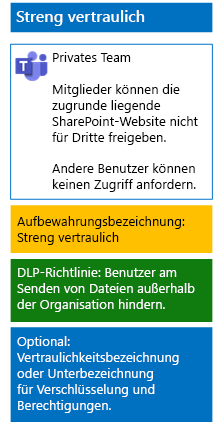

# Schützen von Dateien in Teams mit Vertraulichkeitsbezeichnungen

Im Gegensatz zu einer Vertraulichkeitsbezeichnung für streng regulierte Daten, die von jedem auf eine beliebige Datei angewendet werden kann, benötigt ein streng vertrauliches Team eine eigene Bezeichnung oder Unterbezeichnung, damit für Dateien, denen diese Bezeichnung oder Unterbezeichnung zugeordnet ist, Folgendes gilt:

- Die Dateien werden einzeln verschlüsselt.
- Die Dateien enthalten benutzerdefinierte Berechtigungen, sodass sie nur von Mitgliedern des Teams geöffnet werden können.

Um diese zusätzliche Sicherheitsstufe für die in der zugrunde liegenden SharePoint-Website gespeicherten Dateien zu erreichen, müssen Sie eine benutzerdefinierte Vertraulichkeitsbezeichnung konfigurieren, bei der es sich entweder um eine eigene Bezeichnung oder um eine Unterbezeichnung der allgemeinen Bezeichnung für stark regulierte Daten handelt. Nur Teammitglieder können die benutzerdefinierte Bezeichnung oder Unterbezeichnung in der Liste der Bezeichnungen sehen.

Verwenden Sie eine Vertraulichkeitsbezeichnung, wenn Sie nur eine kleine Anzahl von Bezeichnungen für die globale Nutzung und für einzelne private Teams benötigen. 

Verwenden Sie eine Vertraulichkeitsunterbezeichnung, wenn Sie über eine große Anzahl von Bezeichnungen verfügen oder Bezeichnungen für streng vertrauliche Teams unter der streng regulierten Bezeichnung organisieren möchten.

Verwenden Sie [diese Anweisungen ](https://docs.microsoft.com/microsoft-365/compliance/encryption-sensitivity-labels) zum Konfigurieren einer separaten Bezeichnung oder einer Unterbezeichnung mit den folgenden Einstellungen:

- Der Name der Bezeichnung oder Unterbezeichnung enthält den Namen des Teams.
- Die Verschlüsselung ist aktiviert.
- Die Office 365-Gruppe für das Team verfügt über Berechtigungen für die gemeinsame Dokumenterstellung.

Veröffentlichen Sie nach dem Erstellen die neue Bezeichnung oder die neue Unterbezeichnung für Ihre Benutzer, die diese dann auf Dateien entweder lokal vor dem Hochladen in das Team oder später nach dem Speichern der Datei im Team anwenden können.

Hier ist die Konfiguration des streng vertraulichen Teams, das Vertraulichkeitsbezeichnungen für Dateiverschlüsselung und-Berechtigungen verwendet.

## Siehe auch

[Sichern von Dateien in Microsoft Teams](secure-files-in-teams.md)
  
[Cloudakzeptanz und Hybridlösungen](https://docs.microsoft.com/office365/enterprise/cloud-adoption-and-hybrid-solutions)
