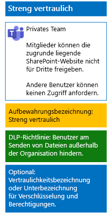

# Schützen von Dateien in Teams mit VertraulichkeitsbezeichnungenProtect files in teams with sensitivity labels

Im Gegensatz zu einer Vertraulichkeitsbezeichnung für streng regulierte Daten, die von jedem auf eine beliebige Datei angewendet werden kann, benötigt ein streng vertrauliches Team eine eigene Bezeichnung oder Unterbezeichnung, damit für Dateien, denen diese Bezeichnung oder Unterbezeichnung zugeordnet ist, Folgendes gilt:Unlike a sensitivity label for highly regulated data that anyone can apply to any file, a highly confidential team needs its own label or sublabel so that assigned files:

- Die Dateien werden einzeln verschlüsselt.Are individually encrypted.
- Die Dateien enthalten benutzerdefinierte Berechtigungen, sodass sie nur von Mitgliedern des Teams geöffnet werden können.Contain custom permissions so that only members of the team can open it.

Um diese zusätzliche Sicherheitsstufe für die in der zugrunde liegenden SharePoint-Website gespeicherten Dateien zu erreichen, müssen Sie eine benutzerdefinierte Vertraulichkeitsbezeichnung konfigurieren, bei der es sich entweder um eine eigene Bezeichnung oder um eine Unterbezeichnung der allgemeinen Bezeichnung für stark regulierte Daten handelt.To accomplish this additional level of security for files stored in the underlying SharePoint site of a team, you must configure a customized sensitivity label that is either its own label or a sublabel of the general label for highly regulated data. Nur Teammitglieder können die benutzerdefinierte Bezeichnung oder Unterbezeichnung in der Liste der Bezeichnungen sehen.Only team members will see the customized label or sublabel in their list of labels.

Verwenden Sie eine Vertraulichkeitsbezeichnung, wenn Sie nur eine kleine Anzahl von Bezeichnungen für die globale Nutzung und für einzelne private Teams benötigen.Use a sensitivity label when you need a small number of labels for both global use and individual private teams. 

Verwenden Sie eine Vertraulichkeitsunterbezeichnung, wenn Sie über eine große Anzahl von Bezeichnungen verfügen oder Bezeichnungen für streng vertrauliche Teams unter der streng regulierten Bezeichnung organisieren möchten.Use a sensitivity sublabel when you have a large number of labels or want to organize labels for highly confidential teams under the highly regulated label.

Verwenden Sie [diese Anweisungen ](https://docs.microsoft.com/microsoft-365/compliance/encryption-sensitivity-labels) zum Konfigurieren einer separaten Bezeichnung oder einer Unterbezeichnung mit den folgenden Einstellungen:Use [these instructions](https://docs.microsoft.com/microsoft-365/compliance/encryption-sensitivity-labels) to configure a separate label or a sublabel with the following settings:

- Der Name der Bezeichnung oder Unterbezeichnung enthält den Namen des Teams.The name of the label or sublabel contains the name of the team
- Die Verschlüsselung ist aktiviert.Encryption is enabled
- Die Microsoft 365-Gruppe für das Team verfügt über Berechtigungen für die gemeinsame Dokumenterstellung.The Microsoft 365 group for the team has Co-Author permissions

Veröffentlichen Sie nach dem Erstellen die neue Bezeichnung oder die neue Unterbezeichnung für Ihre Benutzer, die diese dann auf Dateien entweder lokal vor dem Hochladen in das Team oder später nach dem Speichern der Datei im Team anwenden können.After creating, publish the new label or sublabel for your users, who can then apply them to files either locally before uploading them to the team or later once the file is stored in the team.

Hier ist die Konfiguration des streng vertraulichen Teams, das Vertraulichkeitsbezeichnungen für Dateiverschlüsselung und-Berechtigungen verwendet.Here is the configuration of the highly confidential team that uses sensitivity labels for file encryption and permissions.

## Siehe auchSee Also

[Sichern von Dateien in Microsoft TeamsSecure files in Microsoft Teams](secure-files-in-teams.md)
  
[Cloudakzeptanz und HybridlösungenCloud adoption and hybrid solutions](https://docs.microsoft.com/office365/enterprise/cloud-adoption-and-hybrid-solutions)
