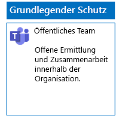
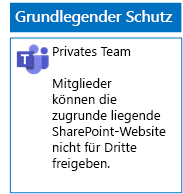
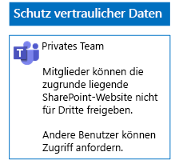
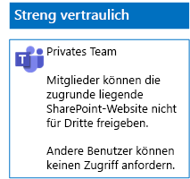

# Bereitstellen von Teams für drei Schutzebenen für DateienDeploy teams for three tiers of protection for files

Verwenden Sie die Schritte in diesem Artikel, um Richtlinien für grundlegende, vertrauliche und streng vertrauliche Teams zu entwerfen.Use the steps in this article to design and deploy baseline, sensitive, and highly confidential teams. Weitere Informationen zu diesen drei Schutzebenen finden Sie unter [Sichern von Dateien in Microsoft Teams](secure-files-in-teams.md).For more information about these three tiers of protection, see [Secure files in Microsoft Teams](secure-files-in-teams.md).

## Grundlegende TeamsBaseline teams

Der grundlegende Schutz enthält jeweils öffentliche und private Teams.Baseline protection includes both public and private teams. Öffentliche Teams können von allen Benutzern in der Organisation ermittelt werden und alle haben Zugriff auf diese.Public teams can be discovered and accessed by anybody in the organization. Nur Mitglieder der Office 365-Gruppe, die mit dem Team verknüpft sind, können die privaten Websites ermitteln und auf diese zugreifen.Private sites can only be discovered and accessed by members of the Office 365 group associated with the team. Bei diesen beiden Typen von Teams können Mitglieder die Website mit anderen Benutzern teilen.Both of these types of teams allow members to share the site with others.

### ÖffentlichPublic

Befolgen Sie die Anweisungen in [diesem Artikel](https://support.office.com/article/174adf5f-846b-4780-b765-de1a0a737e2b), um ein grundlegendes Team mit öffentlichem Zugriff und öffentlichen Berechtigungen zu erstellen.Follow the instructions in [this article](https://support.office.com/article/174adf5f-846b-4780-b765-de1a0a737e2b) to create a baseline team with public access and permissions.

Nachfolgend sehen Sie die daraus resultierende Konfiguration.Here is your resulting configuration.

### PrivatPrivate

Befolgen Sie die Anweisungen in [diesem Artikel](https://support.office.com/article/174adf5f-846b-4780-b765-de1a0a737e2b), um ein grundlegendes Team mit privatem Zugriff und privaten Berechtigungen zu erstellen.Follow the instructions in [this article](https://support.office.com/article/174adf5f-846b-4780-b765-de1a0a737e2b) to create a baseline team with private access and permissions.

Nachfolgend sehen Sie die daraus resultierende Konfiguration.Here is your resulting configuration.

## Vertrauliche TeamsSensitive teams

Für ein vertrauliches Team beginnen Sie mit dem [Erstellen eines privaten Teams](https://support.office.com/article/174adf5f-846b-4780-b765-de1a0a737e2b).For a sensitive team, you start by [creating a private team](https://support.office.com/article/174adf5f-846b-4780-b765-de1a0a737e2b).

Als Nächstes konfigurieren Sie die zugrunde liegende SharePoint-Website, um die Freigabe durch Teammitglieder zu verhindern.Next, you configure the underlying SharePoint site to prevent sharing by team members.

1. Klicken Sie auf der Symbolleiste des Teams auf **Dateien**.In the tool bar for the team, click **Files**.

2. Klicken Sie auf die drei Punkte "(…)" und dann auf **In SharePoint öffnen**.Click the ellipsis, and then click **Open in SharePoint**.

3. Klicken Sie in der Symbolleiste der zugrunde liegenden SharePoint-Website auf das Symbol "Einstellungen" und anschließend auf **Websiteberechtigungen**.In the tool bar of the underlying SharePoint site, click the settings icon, and then click **Site permissions**.

4. Klicken Sie im Bereich **Websiteberechtigungen** unter **Freigabeeinstellungen** auf **Freigabeeinstellungen ändern**.In the **Site permissions** pane, under **Sharing Settings**, click **Change sharing settings**.

5. Wählen Sie unter **Freigabeberechtigungen** die Option **Nur Websitebesitzer können Dateien, Ordner und die Website teilen** aus, und klicken Sie dann auf **Speichern**.Under **Sharing permissions**, choose **Only site owners can share files, folders, and the site**, and then click **Save**.

Nachfolgend sehen Sie die daraus resultierende Konfiguration.Here is your resulting configuration.

## Streng vertrauliche TeamsHighly confidential teams

Für ein streng vertrauliches Team beginnen Sie mit dem [Erstellen eines privaten Teams](https://support.office.com/article/174adf5f-846b-4780-b765-de1a0a737e2b).With a highly confidential team, you start by [creating a private team](https://support.office.com/article/174adf5f-846b-4780-b765-de1a0a737e2b).

Als Nächstes konfigurieren Sie die zugrunde liegende SharePoint-Website, um die Freigabe durch Teammitglieder und das Anfordern von Zugriff von Nicht-Mitgliedern des Teams zu verhindern.Next, you configure the underlying SharePoint site to prevent sharing by team members and the requesting of access by non-members of the team.

1. Klicken Sie auf der Symbolleiste des Teams auf **Dateien**.In the tool bar for the team, click **Files**.

2. Klicken Sie auf die drei Punkte "(…)" und dann auf **In SharePoint öffnen**.Click the ellipsis, and then click **Open in SharePoint**.

3. Klicken Sie in der Symbolleiste der zugrunde liegenden SharePoint-Website auf das Symbol "Einstellungen" und anschließend auf **Websiteberechtigungen**.In the tool bar of the underlying SharePoint site, click the settings icon, and then click **Site permissions**.

4. Klicken Sie im Bereich **Websiteberechtigungen** unter **Freigabeeinstellungen** auf **Freigabeeinstellungen ändern**.In the **Site permissions** pane, under **Sharing Settings**, click **Change sharing settings**.

5. Wählen Sie unter **Freigabeberechtigungen** die Option **Nur Websitebesitzer können Dateien, Ordner und die Website teilen** aus.Under **Sharing permissions**, choose **Only site owners can share files, folders, and the site**.

6. Deaktivieren Sie **Zugriffsanforderungen zulassen**, und klicken Sie dann auf **Speichern**.Turn off **Allow access requests**, and then click **Save**.

Nachfolgend sehen Sie die daraus resultierende Konfiguration.Here is your resulting configuration.

## Nächster SchrittNext step

[Schützen von Dateien in Teams mit Aufbewahrungsbezeichnungen und Schutz vor Datenverlust (DLP)Protect files in teams with retention labels and DLP](deploy-teams-retention-DLP.md)

## Siehe auchSee also

[Sichern von Dateien in Microsoft TeamsSecure files in Microsoft Teams](secure-files-in-teams.md)

[Cloudakzeptanz und HybridlösungenCloud adoption and hybrid solutions](https://docs.microsoft.com/office365/enterprise/cloud-adoption-and-hybrid-solutions)
