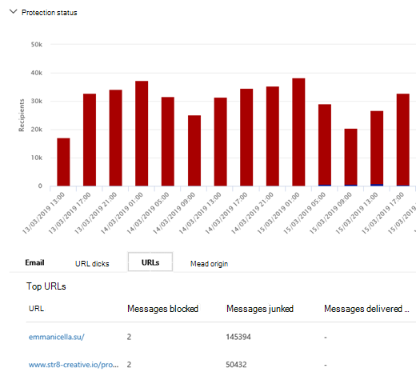

# E-Mail-Sicherheit mit Threat Explorer in Microsoft Defender für Office 365

Inhalt dieses Artikels:

- [Anzeigen von Schadsoftware, die in E-Mails erkannt wurde](#view-malware-detected-in-email)
- [Anzeigen der Phishing-URL und Klicken auf Verdingungsdaten](#view-phishing-url-and-click-verdict-data)
- [Starten einer automatisierten Untersuchung und Reaktion](#start-automated-investigation-and-response)

> [!NOTE]
> Dies ist Teil einer **3-Artikel-Reihe** über Threat **Explorer (Explorer),** **E-Mail-Sicherheit** **und** Explorer- und Echtzeiterkennungsgrund grundlagen (z. B. Unterschiede zwischen den Tools und Berechtigungen, die für deren Betrieb erforderlich sind). Die anderen beiden Artikel in dieser Reihe sind Die Suche nach Bedrohungen [im Bedrohungs-Explorer](threat-hunting-in-threat-explorer.md) und im [Bedrohungs-Explorer](real-time-detections.md)sowie Grundlagen der Echtzeiterkennung. 

In diesem Artikel wird erläutert, wie Sie Schadsoftware- und Phishingversuche anzeigen und untersuchen, die in E-Mails von Microsoft 365 erkannt werden. 

**Gilt für**

- [Microsoft Defender für Office 365 Plan 1 und Plan 2](defender-for-office-365.md)
- [Microsoft 365 Defender](../defender/microsoft-365-defender.md)

## Anzeigen von Schadsoftware, die in E-Mails erkannt wurde

Um Schadsoftware in E-Mails nach Microsoft 365 zu sehen, verwenden Sie die Ansicht E-Mail [> Schadsoftware](threat-explorer-views.md#email--malware) des Explorers (oder Echtzeiterkennungen). Schadsoftware ist die Standardansicht, daher kann sie ausgewählt werden, sobald Sie Explorer öffnen.

1. Wählen Sie im Security & Compliance Center ( <https://protection.office.com> ) die Option Bedrohungsverwaltungs-Explorer  \>  (oder **Echtzeiterkennungen) aus.** (In diesem Beispiel wird Explorer verwendet.) Wenn Sie sich im konvergenten Microsoft 365 sicherheitscenter ( https://security.microsoft.com/) Scrollen Sie zu **E-Mail & Zusammenarbeit**  >  **Explorer**.

   Beginnen Sie hier mit der Ansicht, wählen Sie einen bestimmten Zeitrahmen für die Untersuchung (falls erforderlich) aus, und konzentrieren Sie Ihre Filter, wie im [Explorer-Walk-Through gezeigt.](threat-hunting-in-threat-explorer.md#threat-explorer-walk-through)

2. Wählen Sie **im** Menü Ansicht die Option **E-Mail-Schadsoftware** \> **aus.**

   > [!div class="mx-imgBorder"]
   > 

3. Klicken **Sie auf Absender,** und wählen Sie **dann Grundlegende** \> **Erkennungstechnologie aus.**

   Ihre Erkennungstechnologien sind jetzt als Filter für den Bericht verfügbar.

   > [!div class="mx-imgBorder"]
   > 

4. Wählen Sie eine Option aus. Wählen Sie dann die **Schaltfläche Aktualisieren** aus, um diesen Filter anzuwenden.

   > [!div class="mx-imgBorder"]
   > 

   Der Bericht wird aktualisiert, um die Ergebnisse zu zeigen, die Schadsoftware in E-Mails mithilfe der von Ihnen ausgewählten Technologieoption erkannt hat. Von hier aus können Sie weitere Analysen durchführen. 

## Anzeigen der Phishing-URL und Klicken auf Verdingungsdaten

Sie können Phishingversuche über URLs in E-Mails anzeigen, einschließlich einer Liste der URLs, die zugelassen, blockiert und außer Kraft gesetzt wurden. Zum Identifizieren von URLs, auf die geklickt wurde, müssen [sichere](safe-links.md) Links konfiguriert werden. Stellen Sie sicher, dass Sie [Richtlinien](set-up-safe-links-policies.md) für sichere Links für den Schutz und die Protokollierung von Klickverdingen durch sichere Links einrichten.

Verwenden Sie zum Überprüfen von Phish-URLs in Nachrichten und Klicken auf URLs in Phishingnachrichten die E-Mail-Phish-Ansicht von Explorer oder Echtzeiterkennungen. [   >   ](threat-explorer-views.md#email--phish)

1. Wählen Sie im Security & Compliance Center ( <https://protection.office.com> ) die Option Bedrohungsverwaltungs-Explorer  \>  (oder **Echtzeiterkennungen) aus.** (In diesem Beispiel wird Explorer verwendet.)

2. Wählen Sie **im** Menü Ansicht die Option **E-Mail-Phish** \> **aus.**

   > [!div class="mx-imgBorder"]
   > 

3. Klicken **Sie auf Absender,** und wählen Sie **dann URLs Klicken** Sie auf \> **Urteil**.

4. Wählen Sie eine oder  mehrere Optionen aus, z. B. Blockiert und außer Kraft **gesetzt,** und wählen Sie dann die Schaltfläche **Aktualisieren** in derselben Zeile wie die Optionen aus, um diesen Filter anzuwenden. (Aktualisieren Sie das Browserfenster nicht.)

   > [!div class="mx-imgBorder"]
   > 

   Der Bericht wird aktualisiert, um zwei unterschiedliche URL-Tabellen auf der Registerkarte URL unter dem Bericht zu zeigen:

   - **Die obersten URLs** sind die URLs in den Nachrichten, in die Sie gefiltert haben, und die Anzahl der E-Mail-Zustellungsaktion für jede URL. In der Phish-E-Mail-Ansicht enthält diese Liste in der Regel legitime URLs. Angreifer enthalten eine Mischung aus guten und schlechten URLs in ihren Nachrichten, um zu versuchen, sie zu liefern, aber sie machen die schädlichen Links interessanter. Die Tabelle der URLs wird nach der Gesamtzahl der E-Mails sortiert, diese Spalte ist jedoch ausgeblendet, um die Ansicht zu vereinfachen.

   - **Top clicks** are the Safe Links-wrapped URLs that were clicked, sorted by total click count. Diese Spalte wird auch nicht angezeigt, um die Ansicht zu vereinfachen. Die Gesamtzahlen nach Spalte geben die Anzahl der Klicks auf sichere Links für jede geklickte URL an. In der Phish-E-Mail-Ansicht handelt es sich in der Regel um verdächtige oder bösartige URLs. Die Ansicht kann jedoch URLs enthalten, die keine Bedrohungen sind, aber in Phishnachrichten enthalten sind. URL-Klicks auf unverpackte Links werden hier nicht angezeigt.

   Die beiden URL-Tabellen zeigen die besten URLs in Phishing-E-Mail-Nachrichten nach Zustellungsaktion und Speicherort. In den Tabellen werden URL-Klicks angezeigt, die trotz einer Warnung blockiert oder besucht wurden, sodass Sie sehen können, welche potenziellen ungültigen Links benutzern angezeigt wurden und auf die die Benutzer geklickt haben. Von hier aus können Sie weitere Analysen durchführen. Unterhalb des Diagramms werden beispielsweise die obersten URLs in E-Mail-Nachrichten angezeigt, die in der Umgebung Ihrer Organisation blockiert wurden.

   > [!div class="mx-imgBorder"]
   > 

   Wählen Sie eine URL aus, um ausführlichere Informationen anzeigen zu können.

   > [!NOTE]
   > Im Dialogfeld URL-Flyout wird die Filterung für E-Mail-Nachrichten entfernt, um die vollständige Ansicht der Belichtung der URL in Ihrer Umgebung anzuzeigen. Auf diese Weise können Sie nach E-Mail-Nachrichten filtern, über die Sie im Explorer besorgt sind, bestimmte URLs finden, die potenzielle Bedrohungen sind, und dann Ihr Verständnis der URL-Belichtung in Ihrer Umgebung (über das Dialogfeld URL-Details) erweitern, ohne der Exploreransicht selbst URL-Filter hinzufügen zu müssen.

### Interpretation von Klickverkündungen

In den Flyouts "E-Mail" oder "URL", "Top Clicks" und in unseren Filterfunktionen werden unterschiedliche Werte für das Klicken angezeigt:

- **Keine:** Das Urteil für die URL kann nicht erfasst werden. Der Benutzer hat möglicherweise durch die URL geklickt.
- **Zulässig:** Der Benutzer konnte zur URL navigieren.
- **Blockiert:** Der Benutzer konnte nicht zur URL navigieren.
- **Ausstehendes Urteil:** Dem Benutzer wurde die Seite zum Ausstehen der Detonation angezeigt.
- **Überschreibend blockiert:** Der Benutzer konnte nicht direkt zur URL navigieren. Der Benutzer übernimmt jedoch den Block, um zur URL zu navigieren.
- **Ausstehendes Urteil umgangen:** Dem Benutzer wurde die Detonationsseite angezeigt. Der Benutzer übernimmt jedoch die Nachricht, um auf die URL zu zugreifen.
- **Fehler:** Dem Benutzer wurde die Fehlerseite angezeigt, oder beim Erfassen des Urteils ist ein Fehler aufgetreten.
- **Fehler:** Beim Erfassen des Urteils ist eine unbekannte Ausnahme aufgetreten. Der Benutzer hat möglicherweise durch die URL geklickt.

## Starten einer automatisierten Untersuchung und Reaktion

> [!NOTE]
> Automatisierte Untersuchungs- und Reaktionsfunktionen sind in Microsoft Defender für Office 365 *Plan 2* und *Office 365 E5 verfügbar.*

[Automatisierte Untersuchung und Reaktion können](automated-investigation-response-office.md) Ihrem Sicherheitsteam Zeit und Aufwand für die Untersuchung und Minderung von Cyberangriffen sparen. Zusätzlich zum Konfigurieren von Warnungen, die ein Sicherheitsspielbuch auslösen können, können Sie einen automatisierten Untersuchungs- und Reaktionsprozess aus einer Ansicht im Explorer starten. Weitere Informationen finden Sie [unter Beispiel: Ein Sicherheitsadministrator löst eine Untersuchung aus Explorer aus.](automated-investigation-response-office.md#example-a-security-administrator-triggers-an-investigation-from-threat-explorer)

## Weitere Artikel

[Untersuchen von E-Mails mit der Seite "E-Mail-Entität"](mdo-email-entity-page.md)
