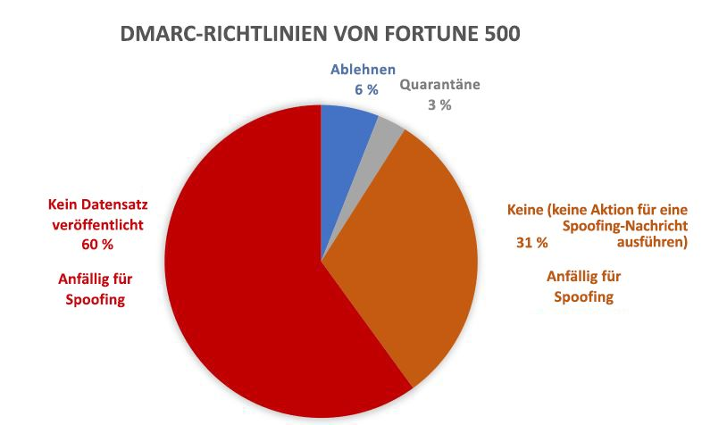
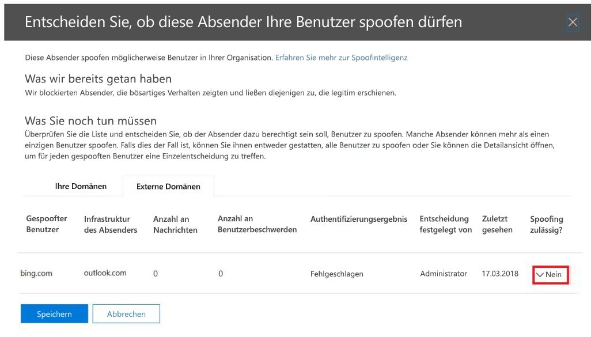

# <a name="email-authentication-in-eop"></a><span data-ttu-id="b4e1f-103">E-Mail-Authentifizierung in EOP</span><span class="sxs-lookup"><span data-stu-id="b4e1f-103">Email authentication in EOP</span></span>

[!INCLUDE [Microsoft 365 Defender rebranding](../includes/microsoft-defender-for-office.md)]

<span data-ttu-id="b4e1f-104">**Gilt für**</span><span class="sxs-lookup"><span data-stu-id="b4e1f-104">**Applies to**</span></span>
- [<span data-ttu-id="b4e1f-105">Exchange Online Protection</span><span class="sxs-lookup"><span data-stu-id="b4e1f-105">Exchange Online Protection</span></span>](exchange-online-protection-overview.md)
- [<span data-ttu-id="b4e1f-106">Microsoft Defender für Office 365 Plan 1 und Plan 2</span><span class="sxs-lookup"><span data-stu-id="b4e1f-106">Microsoft Defender for Office 365 plan 1 and plan 2</span></span>](defender-for-office-365.md)
- [<span data-ttu-id="b4e1f-107">Microsoft 365 Defender</span><span class="sxs-lookup"><span data-stu-id="b4e1f-107">Microsoft 365 Defender</span></span>](../defender/microsoft-365-defender.md)


<span data-ttu-id="b4e1f-108">E-Mail-Authentifizierung (auch als E-Mail-Validierung bezeichnet) ist eine Gruppe von Standards, die versucht, Spoofing (E-Mail-Nachrichten von gefälschten Absendern) entgegen zu wirken.</span><span class="sxs-lookup"><span data-stu-id="b4e1f-108">Email authentication (also known as email validation) is a group of standards that tries to stop spoofing (email messages from forged senders).</span></span> <span data-ttu-id="b4e1f-109">In allen Microsoft 365-Organisationen nutzt EOP folgende Standards, um eingehende e-Mails zu überprüfen:</span><span class="sxs-lookup"><span data-stu-id="b4e1f-109">In all Microsoft 365 organizations, EOP uses these standards to verify inbound email:</span></span>

- [<span data-ttu-id="b4e1f-110">SPF</span><span class="sxs-lookup"><span data-stu-id="b4e1f-110">SPF</span></span>](set-up-spf-in-office-365-to-help-prevent-spoofing.md)

- [<span data-ttu-id="b4e1f-111">DKIM</span><span class="sxs-lookup"><span data-stu-id="b4e1f-111">DKIM</span></span>](use-dkim-to-validate-outbound-email.md)

- [<span data-ttu-id="b4e1f-112">DMARC</span><span class="sxs-lookup"><span data-stu-id="b4e1f-112">DMARC</span></span>](use-dmarc-to-validate-email.md)

<span data-ttu-id="b4e1f-113">Die E-Mail-Authentifizierung überprüft, ob E-Mail-Nachrichten eines Absenders (z.B. laura@contoso.com) seriös sind und aus den erwarteten Quellen für diese E-Mail-Domäne stammen (z.B. contoso.com.)</span><span class="sxs-lookup"><span data-stu-id="b4e1f-113">Email authentication verifies that email messages from a sender (for example, laura@contoso.com) are legitimate and come from expected sources for that email domain (for example, contoso.com.)</span></span>

<span data-ttu-id="b4e1f-114">Der weitere Artikel erläutert, wie diese Technologien funktionieren und wie EOP sie verwendet, um eingehende E-Mails zu prüfen.</span><span class="sxs-lookup"><span data-stu-id="b4e1f-114">The rest of this article explains how these technologies work, and how EOP uses them to check inbound email.</span></span>

## <a name="use-email-authentication-to-help-prevent-spoofing"></a><span data-ttu-id="b4e1f-115">Verwenden von E-Mail-Authentifizierung, um Spoofing zu verhindern</span><span class="sxs-lookup"><span data-stu-id="b4e1f-115">Use email authentication to help prevent spoofing</span></span>

<span data-ttu-id="b4e1f-116">DMARC verhindert Spoofing, indem die **Von**-Adresse in Nachrichten überprüft wird.</span><span class="sxs-lookup"><span data-stu-id="b4e1f-116">DMARC prevents spoofing by examining the **From** address in messages.</span></span> <span data-ttu-id="b4e1f-117">Die **Von**-Adresse ist die E-Mail-Adresse des Absenders, die Benutzer in ihrem E-Mail-Client sehen.</span><span class="sxs-lookup"><span data-stu-id="b4e1f-117">The **From** address is the sender's email address that users see in their email client.</span></span> <span data-ttu-id="b4e1f-118">Die Ziel-E-Mail-Organisationen können auch überprüfen, ob die E-Mail-Domäne SPF oder DKIM erfolgreich bestanden hat.</span><span class="sxs-lookup"><span data-stu-id="b4e1f-118">Destination email organizations can also verify that the email domain has passed SPF or DKIM.</span></span> <span data-ttu-id="b4e1f-119">Anders ausgedrückt: Die Domäne wurde authentifiziert, daher wird die E-Mail-Adresse des Absenders nicht gespoofed.</span><span class="sxs-lookup"><span data-stu-id="b4e1f-119">In other words, the domain has been authenticated and therefore the sender's email address is not spoofed.</span></span>

<span data-ttu-id="b4e1f-120">DNS-Einträge für SPF, DKIM und DMARC (gemeinsam als "E-Mail-Authentifizierungsrichtlinien" bekannt) sind jedoch optional.</span><span class="sxs-lookup"><span data-stu-id="b4e1f-120">However, DNS records for SPF, DKIM, and DMARC (collectively known as email authentication policies) are optional.</span></span> <span data-ttu-id="b4e1f-121">Domänen mit starken E-Mail-Authentifizierungsrichtlinien wie microsoft.com und skype.com sind vor Spoofing geschützt.</span><span class="sxs-lookup"><span data-stu-id="b4e1f-121">Domains with strong email authentication policies like microsoft.com and skype.com are protected from spoofing.</span></span> <span data-ttu-id="b4e1f-122">Aber Domänen mit schwächeren E-Mail-Authentifizierungsrichtlinien oder ohne jede Richtlinie sind hervorragende Ziele für Spoofing.</span><span class="sxs-lookup"><span data-stu-id="b4e1f-122">But domains with weaker email authentication policies, or no policy at all, are prime targets for being spoofed.</span></span>

<span data-ttu-id="b4e1f-123">Im März 2018 verfügten nur 9 % der Domänen der Fortune 500-Unternehmen über sichere E-Mail-Authentifizierungsrichtlinien.</span><span class="sxs-lookup"><span data-stu-id="b4e1f-123">As of March 2018, only 9% of domains of companies in the Fortune 500 publish strong email authentication policies.</span></span> <span data-ttu-id="b4e1f-124">Die verbleibenden 91% der Unternehmen können möglicherweise mithilfe von Spoofing angegriffen werden.</span><span class="sxs-lookup"><span data-stu-id="b4e1f-124">The remaining 91% of companies might be spoofed by an attacker.</span></span> <span data-ttu-id="b4e1f-125">Falls kein anderer E-Mail-Filtermechanismus aktiviert ist, werden E-Mails von gefälschten Absendern in diesen Domänen möglicherweise an die Benutzer übermittelt.</span><span class="sxs-lookup"><span data-stu-id="b4e1f-125">Unless some other email filtering mechanism is in-place, email from spoofed senders in these domains might be delivered to users.</span></span>



<span data-ttu-id="b4e1f-127">Der Anteil von kleinen und mittelständischen Unternehmen, die sichere E-Mail-Authentifizierungsrichtlinien verfügen, ist kleiner.</span><span class="sxs-lookup"><span data-stu-id="b4e1f-127">The proportion of small-to-medium sized companies that publish strong email authentication policies is smaller.</span></span> <span data-ttu-id="b4e1f-128">Und die Zahl der E-Mail-Domänen außerhalb von Nordamerika und Westeuropa ist sogar noch geringer.</span><span class="sxs-lookup"><span data-stu-id="b4e1f-128">And the number is even smaller for email domains outside North America and western Europe.</span></span>

<span data-ttu-id="b4e1f-129">Das Fehlen sicherer E-Mail-Authentifizierungsrichtlinien stellt ein großes Problem dar.</span><span class="sxs-lookup"><span data-stu-id="b4e1f-129">Lack of strong email authentication policies is a large problem.</span></span> <span data-ttu-id="b4e1f-130">Während Organisationen möglicherweise nicht verstehen, wie die E-Mail-Authentifizierung funktioniert, sind sich Angreifer darüber sehr wohl im Klaren und nutzen dies zu ihrem Vorteil aus.</span><span class="sxs-lookup"><span data-stu-id="b4e1f-130">While organizations might not understand how email authentication works, attackers fully understand, and they take advantage.</span></span> <span data-ttu-id="b4e1f-131">Wegen der Sorge vor Phishing und der unzureichenden Einführung sicherer E-Mail-Authentifizierungsrichtlinien, verwendet Microsoft *implizite E-Mail-Authentifizierung*, um eingehende E-Mails zu überprüfen.</span><span class="sxs-lookup"><span data-stu-id="b4e1f-131">Because of phishing concerns and the limited adoption of strong email authentication policies, Microsoft uses *implicit email authentication* to check inbound email.</span></span>

<span data-ttu-id="b4e1f-132">Die implizite E-Mail-Authentifizierung ist eine Erweiterung der regulären E-Mail-Authentifizierungsrichtlinien.</span><span class="sxs-lookup"><span data-stu-id="b4e1f-132">Implicit email authentication is an extension of regular email authentication policies.</span></span> <span data-ttu-id="b4e1f-133">Zu diesen Erweiterungen gehören: Absenderzuverlässigkeit, Absenderhistorie, Empfängerhistorie, Verhaltensanalysen und weitere fortgeschrittene Techniken.</span><span class="sxs-lookup"><span data-stu-id="b4e1f-133">These extensions include: sender reputation, sender history, recipient history, behavioral analysis, and other advanced techniques.</span></span> <span data-ttu-id="b4e1f-134">Beim Fehlen weiterer Signale dieser Erweiterungen werden Nachrichten, die von Domänen gesendet ohne E-Mail-Authentifizierungsrichtlinien gesendet werden, als Spoof gekennzeichnet.</span><span class="sxs-lookup"><span data-stu-id="b4e1f-134">In the absence of other signals from these extensions, messages sent from domains that don't use email authentication policies will be marked as spoof.</span></span>

<span data-ttu-id="b4e1f-135">Eine allgemeine Ankündigung von Microsoft finden Sie unter [A Sea of Phish Part 2 – Enhanced Anti-spoofing in Microsoft 365](https://techcommunity.microsoft.com/t5/Security-Privacy-and-Compliance/Schooling-A-Sea-of-Phish-Part-2-Enhanced-Anti-spoofing/ba-p/176209).</span><span class="sxs-lookup"><span data-stu-id="b4e1f-135">To see Microsoft's general announcement, see [A Sea of Phish Part 2 - Enhanced Anti-spoofing in Microsoft 365](https://techcommunity.microsoft.com/t5/Security-Privacy-and-Compliance/Schooling-A-Sea-of-Phish-Part-2-Enhanced-Anti-spoofing/ba-p/176209).</span></span>

## <a name="composite-authentication"></a><span data-ttu-id="b4e1f-136">Zusammengesetzte Authentifizierung</span><span class="sxs-lookup"><span data-stu-id="b4e1f-136">Composite authentication</span></span>

<span data-ttu-id="b4e1f-137">Wenn eine Domäne nicht über herkömmliche SPF-, DKIM- und DMARC-Einträge verfügt, vermitteln diese Datensatzprüfungen nicht genügend Informationen zum Authentifizierungsstatus.</span><span class="sxs-lookup"><span data-stu-id="b4e1f-137">If a domain doesn't have traditional SPF, DKIM, and DMARC records, those record checks don't communicate enough authentication status information.</span></span> <span data-ttu-id="b4e1f-138">Deshalb hat Microsoft einen Algorithmus für die implizite E-Mail-Authentifizierung entwickelt.</span><span class="sxs-lookup"><span data-stu-id="b4e1f-138">Therefore, Microsoft has developed an algorithm for implicit email authentication.</span></span> <span data-ttu-id="b4e1f-139">Dieser Algorithmus kombiniert mehrere Signale in einem einzelnen Wert, der auch als _Composite Authentication_ (zusammengesetzte Authentifizierung) oder `compauth` bezeichnet wird.</span><span class="sxs-lookup"><span data-stu-id="b4e1f-139">This algorithm combines multiple signals into a single value called _composite authentication_, or `compauth` for short.</span></span> <span data-ttu-id="b4e1f-140">Der `compauth`-Wert wird im Header der **Authentifizierungsergebnisse** im Nachrichtenheader vermerkt.</span><span class="sxs-lookup"><span data-stu-id="b4e1f-140">The `compauth` value is stamped into the **Authentication-Results** header in the message headers.</span></span>

```text
Authentication-Results:
   compauth=<fail | pass | softpass | none> reason=<yyy>
```

<span data-ttu-id="b4e1f-141">Diese Werte werden in der [Nachrichtenkopfzeile „Authentication-results“](anti-spam-message-headers.md#authentication-results-message-header) erklärt.</span><span class="sxs-lookup"><span data-stu-id="b4e1f-141">These values are explained at [Authentication-results message header](anti-spam-message-headers.md#authentication-results-message-header).</span></span>

<span data-ttu-id="b4e1f-142">Durch Untersuchung der Nachrichtenkopfzeilen können Administratoren oder sogar Endbenutzer ermitteln, wie Microsoft 365 ermittelt hat, dass der Absender gefälscht ist.</span><span class="sxs-lookup"><span data-stu-id="b4e1f-142">By examining the message headers, admins or even end users can determine how Microsoft 365 determined that the sender is spoofed.</span></span>

## <a name="why-email-authentication-is-not-always-enough-to-stop-spoofing"></a><span data-ttu-id="b4e1f-143">Warum E-Mail-Authentifizierung nicht immer ausreicht, um Spoofing zu stoppen</span><span class="sxs-lookup"><span data-stu-id="b4e1f-143">Why email authentication is not always enough to stop spoofing</span></span>

<span data-ttu-id="b4e1f-144">Falls Sie sich nur auf die Aufzeichnungen der E-Mail-Authentifizierung verlassen, um zu beurteilen, ob eine eingehende Nachricht gefälscht ist, unterliegt ihr Urteilsvermögen den folgenden Einschränkungen:</span><span class="sxs-lookup"><span data-stu-id="b4e1f-144">Relying only on email authentication records to determine if an incoming message is spoofed has the following limitations:</span></span>

- <span data-ttu-id="b4e1f-145">Die sendende Domäne könnte nicht über die erforderlichen DNS-Aufzeichnungen verfügen oder die Aufzeichnungen sind falsch konfiguriert.</span><span class="sxs-lookup"><span data-stu-id="b4e1f-145">The sending domain might lack the required DNS records, or the records are incorrectly configured.</span></span>

- <span data-ttu-id="b4e1f-146">Die Quelldomäne hat DNS-Einträge zwar ordnungsgemäß konfiguriert, aber diese Domäne entspricht nicht der Domäne in der Von-Adresse.</span><span class="sxs-lookup"><span data-stu-id="b4e1f-146">The source domain has correctly configured DNS records, but that domain doesn't match the domain in the From address.</span></span> <span data-ttu-id="b4e1f-147">SPF und DKIM machen es nicht erforderlich, dass die Domäne in der Von-Adresse verwendet wird.</span><span class="sxs-lookup"><span data-stu-id="b4e1f-147">SPF and DKIM don't require the domain to be used in the From address.</span></span> <span data-ttu-id="b4e1f-148">Angreifer oder legitime Dienste können eine Domäne registrieren, SPF und DKIM für die Domäne konfigurieren und eine vollkommen andere Domäne in der “Von”-Adresse verwenden.</span><span class="sxs-lookup"><span data-stu-id="b4e1f-148">Attackers or legitimate services can register a domain, configure SPF and DKIM for the domain, and use a completely different domain in the From address.</span></span> <span data-ttu-id="b4e1f-149">Nachrichten von Absendern in dieser Domäne werden von SPF und DKIM nicht beanstandet.</span><span class="sxs-lookup"><span data-stu-id="b4e1f-149">Messages from senders in this domain will pass SPF and DKIM.</span></span>

<span data-ttu-id="b4e1f-150">Die zusammengesetzte Authentifizierung kann diesen Einschränkungen abhelfen, indem sie Nachrichten weitergibt, die E-Mail-Authentifizierungsprüfungen andernfalls nicht bestanden hätten.</span><span class="sxs-lookup"><span data-stu-id="b4e1f-150">Composite authentication can address these limitations by passing messages that would otherwise fail email authentication checks.</span></span>

<span data-ttu-id="b4e1f-151">Die folgenden Beispiele konzentrieren sich zur Vereinfachung auf E-Mail-Authentifizierungsergebnisse.</span><span class="sxs-lookup"><span data-stu-id="b4e1f-151">For simplicity, the following examples concentrate on email authentication results.</span></span> <span data-ttu-id="b4e1f-152">Andere Back-End-Intelligenz-Faktoren könnten Nachrichten, die durch die E-Mail-Authentifizierung als gefälscht eingestuft werden, passieren lassen oder Nachrichten, die durch die E-Mail-Authentifizierung als legitim eingestuft werden, als gefälscht identifizieren.</span><span class="sxs-lookup"><span data-stu-id="b4e1f-152">Other back-end intelligence factors could identify messages that pass email authentication as spoofed, or messages that fail email email authentication as legitimate.</span></span>

<span data-ttu-id="b4e1f-153">So hat beispielsweise die fabrikam.com-Domäne keine SPF-, DKIM- oder DMARC-Einträge.</span><span class="sxs-lookup"><span data-stu-id="b4e1f-153">For example, the fabrikam.com domain has no SPF, DKIM, or DMARC records.</span></span> <span data-ttu-id="b4e1f-154">Nachrichten von Absendern in der Domäne fabrikam.com können die zusammengesetzte Authentifizierung ggfs. nicht durchlaufen (beachten Sie den `compauth`-Wert und den Grund):</span><span class="sxs-lookup"><span data-stu-id="b4e1f-154">Messages from senders in the fabrikam.com domain can fail composite authentication (note the `compauth` value and reason):</span></span>

```text
Authentication-Results: spf=none (sender IP is 10.2.3.4)
  smtp.mailfrom=fabrikam.com; contoso.com; dkim=none
  (message not signed) header.d=none; contoso.com; dmarc=none
  action=none header.from=fabrikam.com; compauth=fail reason=001
From: chris@fabrikam.com
To: michelle@contoso.com
```

<span data-ttu-id="b4e1f-155">Wenn fabrikam.com einen SPF ohne einen DKIM-Eintrag konfiguriert, kann die Nachricht eine kombinierte Authentifizierung weitergeben.</span><span class="sxs-lookup"><span data-stu-id="b4e1f-155">If fabrikam.com configures an SPF without a DKIM record, the message can pass composite authentication.</span></span> <span data-ttu-id="b4e1f-156">Die Domäne, die SPF-Prüfungen übergeben hat, wird an der Domäne in der “Von”-Adresse ausgerichtet:</span><span class="sxs-lookup"><span data-stu-id="b4e1f-156">The domain that passed SPF checks is aligned with the domain in the From address:</span></span>

```text
Authentication-Results: spf=pass (sender IP is 10.2.3.4)
  smtp.mailfrom=fabrikam.com; contoso.com; dkim=none
  (message not signed) header.d=none; contoso.com; dmarc=bestguesspass
  action=none header.from=fabrikam.com; compauth=pass reason=109
From: chris@fabrikam.com
To: michelle@contoso.com
```

<span data-ttu-id="b4e1f-157">Wenn fabrikam.com einen SP-Eintrag ohne einen DKIM-Eintrag konfiguriert, kann die Nachricht eine kombinierte Authentifizierung weitergeben.</span><span class="sxs-lookup"><span data-stu-id="b4e1f-157">If fabrikam.com configures a DKIM record without an SPF record, the message can pass composite authentication.</span></span> <span data-ttu-id="b4e1f-158">Die Domäne in der DKIM-Signatur, wird an der Domäne in der “Von”-Adresse ausgerichtet:</span><span class="sxs-lookup"><span data-stu-id="b4e1f-158">The domain in the DKIM signature is aligned with the domain in the From address:</span></span>

```text
Authentication-Results: spf=none (sender IP is 10.2.3.4)
  smtp.mailfrom=fabrikam.com; contoso.com; dkim=pass
  (signature was verified) header.d=outbound.fabrikam.com;
  contoso.com; dmarc=bestguesspass action=none
  header.from=fabrikam.com; compauth=pass reason=109
From: chris@fabrikam.com
To: michelle@contoso.com
```

<span data-ttu-id="b4e1f-159">Wenn die Domäne in SPF oder der DKIM-Signatur nicht mit der Domäne in der “Von”-Adresse übereinstimmt, kann die Nachricht eine zusammengesetzte Authentifizierung ggfs. nicht bestehen:</span><span class="sxs-lookup"><span data-stu-id="b4e1f-159">If the domain in SPF or the DKIM signature doesn't align with the domain in the From address, the message can fail composite authentication:</span></span>

```text
Authentication-Results: spf=none (sender IP is 192.168.1.8)
  smtp.mailfrom=maliciousdomain.com; contoso.com; dkim=pass
  (signature was verified) header.d=maliciousdomain.com;
  contoso.com; dmarc=none action=none header.from=contoso.com;
  compauth=fail reason=001
From: chris@contoso.com
To: michelle@fabrikam.com
```

## <a name="solutions-for-legitimate-senders-who-are-sending-unauthenticated-email"></a><span data-ttu-id="b4e1f-160">Lösungen für legitime Absender, die nicht-authentifizierte E-Mails senden</span><span class="sxs-lookup"><span data-stu-id="b4e1f-160">Solutions for legitimate senders who are sending unauthenticated email</span></span>

<span data-ttu-id="b4e1f-161">Microsoft 365 verfolgt, wer nicht authentifizierte E-Mails an Ihre Organisation sendet.</span><span class="sxs-lookup"><span data-stu-id="b4e1f-161">Microsoft 365 keeps track of who is sending unauthenticated email to your organization.</span></span> <span data-ttu-id="b4e1f-162">Wenn der Dienst annimmt, dass der Absender nicht seriös ist, werden die Nachrichten dieses Absenders als Fehlschlag bei der zusammengesetzten Authentifizierung markiert.</span><span class="sxs-lookup"><span data-stu-id="b4e1f-162">If the service thinks the sender is not legitimate, it will mark messages from this sender as a composite authentication failure.</span></span> <span data-ttu-id="b4e1f-163">Um dies zu vermeiden, können Sie die Empfehlungen in diesem Abschnitt verwenden.</span><span class="sxs-lookup"><span data-stu-id="b4e1f-163">To avoid this verdict, you can use the recommendations in this section.</span></span>

### <a name="configure-email-authentication-for-domains-you-own"></a><span data-ttu-id="b4e1f-164">Konfigurieren der E-Mail-Authentifizierung für Domänen, die Sie besitzen</span><span class="sxs-lookup"><span data-stu-id="b4e1f-164">Configure email authentication for domains you own</span></span>

<span data-ttu-id="b4e1f-165">Sie können diese Methode verwenden, um Probleme mit organisationsinternem und domänenübergreifendem Spoofing zu beheben, wenn Sie mehrere Mandanten besitzen oder mit diesen interagieren.</span><span class="sxs-lookup"><span data-stu-id="b4e1f-165">You can use this method to resolve intra-org spoofing and cross-domain spoofing in cases where you own or interact with multiple tenants.</span></span> <span data-ttu-id="b4e1f-166">Sie kann auch zum Beheben von Problemen mit domänenübergreifendem Spoofing verwendet werden, wenn Sie Nachrichten an andere Kunden innerhalb von Microsoft 365 oder an Drittanbieter senden, die von anderen Anbietern gehostet werden.</span><span class="sxs-lookup"><span data-stu-id="b4e1f-166">It also helps resolve cross-domain spoofing where you send to other customers within Microsoft 365 or third parties that are hosted by other providers.</span></span>

- <span data-ttu-id="b4e1f-167">[Konfiguration von SPF-Einträgen](set-up-spf-in-office-365-to-help-prevent-spoofing.md) für Ihre Domänen.</span><span class="sxs-lookup"><span data-stu-id="b4e1f-167">[Configure SPF records](set-up-spf-in-office-365-to-help-prevent-spoofing.md) for your domains.</span></span>

- <span data-ttu-id="b4e1f-168">[Konfiguration von DKIM-Einträgen](use-dkim-to-validate-outbound-email.md) für Ihre primären Domänen.</span><span class="sxs-lookup"><span data-stu-id="b4e1f-168">[Configure DKIM records](use-dkim-to-validate-outbound-email.md) for your primary domains.</span></span>

- <span data-ttu-id="b4e1f-169">[Ziehen Sie es in Erwägung, DMARC-Einträge für Ihre Domäne](use-dmarc-to-validate-email.md) einzurichten, um Ihre seriösen Absender zu ermitteln.</span><span class="sxs-lookup"><span data-stu-id="b4e1f-169">[Consider setting up DMARC records](use-dmarc-to-validate-email.md) for your domain to determine your legitimate senders.</span></span>

<span data-ttu-id="b4e1f-170">Microsoft bietet keine detaillierten Implementierungsrichtlinien für SPF, DKIM und DMARC-Einträge.</span><span class="sxs-lookup"><span data-stu-id="b4e1f-170">Microsoft doesn't provide detailed implementation guidelines for SPF, DKIM, and DMARC records.</span></span> <span data-ttu-id="b4e1f-171">Es gibt jedoch viele Informationen, die online verfügbar sind.</span><span class="sxs-lookup"><span data-stu-id="b4e1f-171">However, there's many information available online.</span></span> <span data-ttu-id="b4e1f-172">Es gibt auch Drittanbieter, die Ihrer Organisation dabei helfen, E-Mail-Authentifizierungsdatensätze einzurichten.</span><span class="sxs-lookup"><span data-stu-id="b4e1f-172">There are also third party companies dedicated to helping your organization set up email authentication records.</span></span>

#### <a name="you-dont-know-all-sources-for-your-email"></a><span data-ttu-id="b4e1f-173">Sie kennen nicht alle Quellen Ihrer E-Mails</span><span class="sxs-lookup"><span data-stu-id="b4e1f-173">You don't know all sources for your email</span></span>

<span data-ttu-id="b4e1f-174">Viele Domänen veröffentlichen keine SPF-Einträge, da Sie nicht alle E-Mail-Quellen für Nachrichten in Ihrer Domäne kennen.</span><span class="sxs-lookup"><span data-stu-id="b4e1f-174">Many domains don't publish SPF records because they don't know all of the email sources for messages in their domain.</span></span> <span data-ttu-id="b4e1f-175">Beginnen Sie damit, einen SPF-Eintrag für all jene E-Mail-Quellen zu veröffentlichen, die Sie kennen (insbesondere diejenigen, bei denen sich der Datenverkehr Ihres Unternehmens befindet), und veröffentlichen Sie eine neutrale SPF-Richtlinie `?all`:</span><span class="sxs-lookup"><span data-stu-id="b4e1f-175">Start by publishing an SPF record that contains all of the email sources you know about (especially where your corporate traffic is located), and publish the neutral SPF policy `?all`.</span></span> <span data-ttu-id="b4e1f-176">Zum Beispiel:</span><span class="sxs-lookup"><span data-stu-id="b4e1f-176">For example:</span></span>

```text
fabrikam.com IN TXT "v=spf1 include:spf.fabrikam.com ?all"
```

<span data-ttu-id="b4e1f-177">Dieses Beispiel bedeutet, dass E-Mails aus Ihrer Unternehmensinfrastruktur die E-Mail-Authentifizierung passieren, aber E-Mails aus unbekannten Quellen auf neutral zurückfallen.</span><span class="sxs-lookup"><span data-stu-id="b4e1f-177">This example means that email from your corporate infrastructure will pass email authentication, but email from unknown sources will fall back to neutral.</span></span>

<span data-ttu-id="b4e1f-178">Microsoft 365 behandelt eingehende E-Mails aus Ihrer Unternehmensinfrastruktur als authentifiziert.</span><span class="sxs-lookup"><span data-stu-id="b4e1f-178">Microsoft 365 will treat inbound email from your corporate infrastructure as authenticated.</span></span> <span data-ttu-id="b4e1f-179">E-Mails von unbekannten Quellen sind möglicherweise weiterhin als Spoof gekennzeichnet, wenn die implizite Authentifizierung fehlschlägt.</span><span class="sxs-lookup"><span data-stu-id="b4e1f-179">Email from unidentified sources might still be marked as spoof if it fails implicit authentication.</span></span> <span data-ttu-id="b4e1f-180">Dies stellt jedoch immer noch eine Verbesserung dazu dar, dass alle E-Mails von Microsoft 365 als Spoofing markiert wurden.</span><span class="sxs-lookup"><span data-stu-id="b4e1f-180">However, this is still an improvement from all email being marked as spoof by Microsoft 365.</span></span>

<span data-ttu-id="b4e1f-181">Sobald Sie mit einer SPF-Fallback-Richtlinie von `?all`begonnen haben, können Sie nach und nach weitere E-Mail-Quellen für Ihre Nachrichten entdecken und dann Ihren SPF-Eintrag mit einer strikteren Richtlinie aktualisieren.</span><span class="sxs-lookup"><span data-stu-id="b4e1f-181">Once you've gotten started with an SPF fallback policy of `?all`, you can gradually discover and include more email sources for your messages, and then update your SPF record with a stricter policy.</span></span>

### <a name="use-spoof-intelligence-to-configure-permitted-senders-of-unauthenticated-email"></a><span data-ttu-id="b4e1f-182">Verwenden der Spoofingintelligenz zum Konfigurieren zulässiger Absender nicht authentifizierter E-Mails</span><span class="sxs-lookup"><span data-stu-id="b4e1f-182">Use spoof intelligence to configure permitted senders of unauthenticated email</span></span>

<span data-ttu-id="b4e1f-183">Sie können Sie auch [Spoofingintelligenz](learn-about-spoof-intelligence.md) verwenden, damit Absender nicht authentifizierte Nachrichten an Ihre Organisation senden können.</span><span class="sxs-lookup"><span data-stu-id="b4e1f-183">You can also use [spoof intelligence](learn-about-spoof-intelligence.md) to permit senders to transmit unauthenticated messages to your organization.</span></span>

<span data-ttu-id="b4e1f-184">Bei externen Domänen handelt es sich bei dem gefälschten Benutzer um die Domäne in der Von-Adresse, während es sich bei der sendenden Infrastruktur entweder um die Quell-IP-Adresse (aufgeteilt in /24 CIDR-Bereiche) oder um die Organisationsdomäne des Reverse DNS-Eintrags (PTR) handelt.</span><span class="sxs-lookup"><span data-stu-id="b4e1f-184">For external domains, the spoofed user is the domain in the From address, while the sending infrastructure is either the source IP address (divided up into /24 CIDR ranges), or the organizational domain of the reverse DNS (PTR) record.</span></span>

<span data-ttu-id="b4e1f-185">Im folgenden Screenshot kann die IP 131.107.18.4 lauten und den PTR-Eintrag outbound.mail.protection.outlook.com aufweisen.</span><span class="sxs-lookup"><span data-stu-id="b4e1f-185">In the screenshot below, the source IP might be 131.107.18.4 with the PTR record outbound.mail.protection.outlook.com.</span></span> <span data-ttu-id="b4e1f-186">Dies würde als Outlook.com als sendende Infrastruktur annzeigen.</span><span class="sxs-lookup"><span data-stu-id="b4e1f-186">This would show up as outlook.com for the sending infrastructure.</span></span>

<span data-ttu-id="b4e1f-187">Damit dieser Absender nicht authentifizierte E-Mails senden kann, ändern Sie die Einstellung von **No** zu **Yes**.</span><span class="sxs-lookup"><span data-stu-id="b4e1f-187">To permit this sender to send unauthenticated email, change the **No** to a **Yes**.</span></span>



### <a name="create-an-allow-entry-for-the-senderrecipient-pair"></a><span data-ttu-id="b4e1f-189">Erstellen eines Zulassungseintrags für das Absender/Empfänger-Paar</span><span class="sxs-lookup"><span data-stu-id="b4e1f-189">Create an allow entry for the sender/recipient pair</span></span>

<span data-ttu-id="b4e1f-190">Wenn Sie die Spamfilterung, einige Teile der Phishing-Filterung, aber nicht die Malware-Filterung für bestimmte Absender umgehen möchten, lesen Sie [Erstellen von Listen sicherer Absender in Microsoft 365](create-safe-sender-lists-in-office-365.md).</span><span class="sxs-lookup"><span data-stu-id="b4e1f-190">To bypass spam filtering, some parts of filtering for phishing, but not malware filtering for specific senders, see [Create safe sender lists in Microsoft 365](create-safe-sender-lists-in-office-365.md).</span></span>

### <a name="ask-the-sender-to-configure-email-authentication-for-domains-you-dont-own"></a><span data-ttu-id="b4e1f-191">Bitten Sie den Absender, die E-Mail-Authentifizierung für Domänen, die Sie nicht besitzen, zu konfigurieren</span><span class="sxs-lookup"><span data-stu-id="b4e1f-191">Ask the sender to configure email authentication for domains you don't own</span></span>

<span data-ttu-id="b4e1f-192">Aufgrund des Problems mit Spam und Phishing empfiehlt Microsoft die E-Mail-Authentifizierung für alle E-Mail-Organisationen.</span><span class="sxs-lookup"><span data-stu-id="b4e1f-192">Because of the problem of spam and phishing, Microsoft recommends email authentication for all email organizations.</span></span> <span data-ttu-id="b4e1f-193">Statt manuelle Außerkraftsetzungen in Ihrer Organisation zu konfigurieren, können Sie einen Administrator in der sendenden Domäne bitten, ihre E-Mail-Authentifizierungseinträge zu konfigurieren.</span><span class="sxs-lookup"><span data-stu-id="b4e1f-193">Instead of configuring manual overrides in your organization, you can ask an admin in the sending domain to configure their email authentication records.</span></span>

- <span data-ttu-id="b4e1f-194">Auch wenn sie in der Vergangenheit keine E-Mail-Authentifizierungseinträge veröffentlichen mussten, sollten sie dies tun, wenn sie E-Mails an Microsoft senden.</span><span class="sxs-lookup"><span data-stu-id="b4e1f-194">Even if they didn't need to publish email authentication records in the past, they should do so if they send email to Microsoft.</span></span>

- <span data-ttu-id="b4e1f-195">Richten Sie SPF ein, um die sendenden IP-Adressen Ihrer Domäne zu veröffentlichen, und DKIM (falls verfügbar) zum digitalen Signieren von Nachrichten.</span><span class="sxs-lookup"><span data-stu-id="b4e1f-195">Set up SPF to publish the domain's sending IP addresses, and set up DKIM (if available) to digitally sign messages.</span></span> <span data-ttu-id="b4e1f-196">Sie sollten auch das Einrichten von DMARC-Einträgen in Erwägung ziehen.</span><span class="sxs-lookup"><span data-stu-id="b4e1f-196">They should also consider setting up DMARC records.</span></span>

- <span data-ttu-id="b4e1f-197">Wenn sie zum Senden von E-Mails Massenversender verwenden, überprüfen Sie, ob die Domäne in der Von-Adresse (sofern sie ihnen gehört) mit der Domäne übereinstimmt, die SPF oder DMARC passiert.</span><span class="sxs-lookup"><span data-stu-id="b4e1f-197">If they use bulk senders to send email on their behalf, verify that the domain in the From address (if it belongs to them) aligns with the domain that passes SPF or DMARC.</span></span>

- <span data-ttu-id="b4e1f-198">Überprüfen Sie, ob die folgenden Speicherorte (sofern sie diese verwenden) Bestandteil des SPF-Eintrags sind:</span><span class="sxs-lookup"><span data-stu-id="b4e1f-198">Verify the following locations (if they use them) are included in the SPF record:</span></span>

  - <span data-ttu-id="b4e1f-199">Lokale E-Mail-Server.</span><span class="sxs-lookup"><span data-stu-id="b4e1f-199">On-premises email servers.</span></span>
  - <span data-ttu-id="b4e1f-200">E-Mail-Nachrichten von einem SaaS-Anbieter (Software-as-a-Service) versendet wurde.</span><span class="sxs-lookup"><span data-stu-id="b4e1f-200">Email sent from a software-as-a-service (SaaS) provider.</span></span>
  - <span data-ttu-id="b4e1f-201">E-Mail-Nachrichten, die von einem Cloud-Hostingdienst (Microsoft Azure, GoDaddy, Rackspace, Amazon Web Services usw.) versendet wurden</span><span class="sxs-lookup"><span data-stu-id="b4e1f-201">Email sent from a cloud-hosting service (Microsoft Azure, GoDaddy, Rackspace, Amazon Web Services, etc.).</span></span>

- <span data-ttu-id="b4e1f-202">Konfigurieren Sie für kleine Domänen, die von einem ISP gehostet werden, den SPF-Eintrag gemäß den Anweisungen des ISPs.</span><span class="sxs-lookup"><span data-stu-id="b4e1f-202">For small domains that are hosted by an ISP, configure the SPF record according to the instructions from the ISP.</span></span>

<span data-ttu-id="b4e1f-203">Obwohl es am Anfang möglicherweise schwierig wird, sendende Domänen zur Authentifizierung zu veranlassen, werden sie im Laufe der Zeit, da immer mehr E-Mail-Filter die Nachrichten dieser Domänen als Junk einstufen oder sie sogar ablehnen, die entsprechenden Datensätze einrichten, um eine bessere Zustellung sicherzustellen.</span><span class="sxs-lookup"><span data-stu-id="b4e1f-203">While it may be difficult at first to get sending domains to authenticate, over time, as more and more email filters start junking or even rejecting their email, it will cause them to set up the proper records to ensure better delivery.</span></span> <span data-ttu-id="b4e1f-204">Außerdem kann ihre Beteiligung im Kampf gegen Phishing helfen und die Möglichkeit von Phishing-Angriffen in ihrer Organisation oder ihren Organisationen verringern, an die sie e-Mails senden.</span><span class="sxs-lookup"><span data-stu-id="b4e1f-204">Also, their participation can help in the fight against phishing, and can reduce the possibility of phishing in their organization or organizations that they send email to.</span></span>

#### <a name="information-for-infrastructure-providers-isps-esps-or-cloud-hosting-services"></a><span data-ttu-id="b4e1f-205">Informationen für Infrastrukturanbieter (ISPs, ESPs oder Cloud-Hostinganbieter)</span><span class="sxs-lookup"><span data-stu-id="b4e1f-205">Information for infrastructure providers (ISPs, ESPs, or cloud hosting services)</span></span>

<span data-ttu-id="b4e1f-206">Wenn Sie E-Mails einer Domäne hosten oder eine Hostinginfrastruktur anbieten, die E-Mails senden kann, sollten Sie wie folgt vorgehen:</span><span class="sxs-lookup"><span data-stu-id="b4e1f-206">If you host a domain's email or provide hosting infrastructure that can send email, you should do the following steps:</span></span>

- <span data-ttu-id="b4e1f-207">Stellen Sie sicher, dass Ihre Kunden über Dokumentationen verfügen, die erläutern, wie Ihre Kunden ihre SPF-Einträge konfigurieren sollten.</span><span class="sxs-lookup"><span data-stu-id="b4e1f-207">Ensure your customers have documentation that explains how your customers should configure their SPF records</span></span>

- <span data-ttu-id="b4e1f-208">Ziehen Sie in Erwägung, ausgehende E-Mails mit DKIM-Signaturen zu signieren, selbst wenn der Kunde dies nicht explizit eingerichtet hat (Signieren mit Standarddomäne).</span><span class="sxs-lookup"><span data-stu-id="b4e1f-208">Consider signing DKIM-signatures on outbound email, even if the customer doesn't explicitly set it up (sign with a default domain).</span></span> <span data-ttu-id="b4e1f-209">Sie können die E-Mail sogar doppelt mit DKIM-Signaturen signieren (mit der Domäne des Kunden, falls eingerichtet, und mit der DKIM-Signatur Ihres Unternehmens).</span><span class="sxs-lookup"><span data-stu-id="b4e1f-209">You can even double-sign the email with DKIM signatures (once with the customer's domain if they have set it up, and a second time with your company's DKIM signature)</span></span>

<span data-ttu-id="b4e1f-210">Die Zustellbarkeit an Microsoft ist auch nicht garantiert, wenn Sie E-Mails, die von Ihrer Plattform stammen, authentifizieren. Es wird jedoch zumindest sichergestellt, dass Ihre E-Mail nicht als Junk-E-Mail von Microsoft eingestuft wird, weil sie nicht authentifiziert ist.</span><span class="sxs-lookup"><span data-stu-id="b4e1f-210">Deliverability to Microsoft is not guaranteed even if you authenticate email originating from your platform, but at least it ensures that Microsoft does not junk your email because it isn't authenticated.</span></span>

## <a name="related-links"></a><span data-ttu-id="b4e1f-211">Verwandte Links</span><span class="sxs-lookup"><span data-stu-id="b4e1f-211">Related links</span></span>

<span data-ttu-id="b4e1f-212">Weitere Informationen zu bewährten Methoden für Dienstanbieter finden Sie unter [M3AAWG Mobile Messaging Best Practices for Service Providers](https://www.m3aawg.org/sites/default/files/m3aawg-mobile-messaging-best-practices-service-providers-2015-08_0.pdf).</span><span class="sxs-lookup"><span data-stu-id="b4e1f-212">For more information about service providers best practices, see [M3AAWG Mobile Messaging Best Practices for Service Providers](https://www.m3aawg.org/sites/default/files/m3aawg-mobile-messaging-best-practices-service-providers-2015-08_0.pdf).</span></span>

<span data-ttu-id="b4e1f-213">Erfahren Sie, wie Office 365 SPF verwendet und die DKIM-Überprüfung unterstützt:</span><span class="sxs-lookup"><span data-stu-id="b4e1f-213">Learn how Office 365 uses SPF and supports DKIM validation:</span></span>

- [<span data-ttu-id="b4e1f-214">Weitere Informationen zu SPF</span><span class="sxs-lookup"><span data-stu-id="b4e1f-214">More about SPF</span></span>](how-office-365-uses-spf-to-prevent-spoofing.md)

- [<span data-ttu-id="b4e1f-215">Weitere Informationen zu DKIM</span><span class="sxs-lookup"><span data-stu-id="b4e1f-215">More about DKIM</span></span>](support-for-validation-of-dkim-signed-messages.md)
