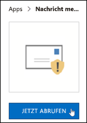
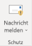
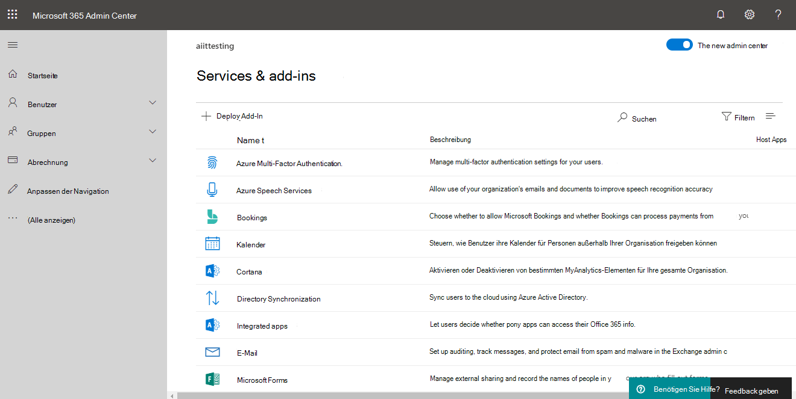
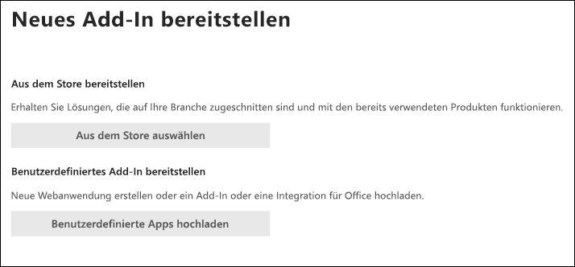
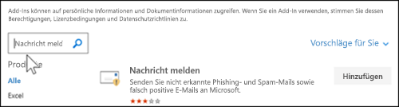
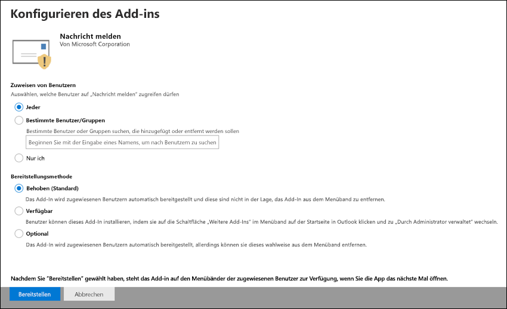
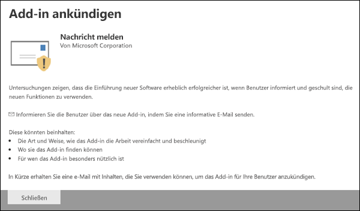
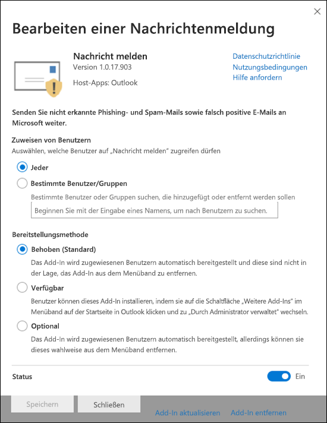

# Aktivieren des Add-Ins „Nachrichten melden“

> [!NOTE]
> Wenn Sie ein Administrator in einer Microsoft 365-Organisation mit Exchange Online Postfächern sind, wird empfohlen, das Übermittlungen-Portal im Security & Compliance Center zu verwenden. Weitere Informationen finden Sie unter [Verwenden der Administrator Übermittlung zum Übermitteln von verdächtigen Spam, Phishing, URLs und Dateien an Microsoft](admin-submission.md).

Das Berichtsnachrichten-Add-in für Outlook und Outlook im Internet (früher bekannt als Outlook Web App) ermöglicht Benutzern das einfache Melden von falsch positiven Ergebnissen (gute e-Mail-Nachrichten als "schlecht" gekennzeichnet) oder von falschen negativen (ungültige e-Mail-Nachrichten) an Microsoft und seine Partner zur Analyse. Microsoft verwendet diese Übermittlungen, um die Effektivität von e-Mail-Schutztechnologien zu verbessern.

Nehmen wir beispielsweise an, dass Personen viele Nachrichten als Phishing melden. Diese Informationen werden im [Sicherheits Dashboard](security-dashboard.md) und in anderen Berichten unter Oberflächen angezeigt. Das Sicherheitsteam Ihrer Organisation kann diese Informationen als Anhaltspunkt dafür verwenden, dass Anti-Phishing-Richtlinien möglicherweise aktualisiert werden müssen. Oder wenn Personen viele Nachrichten melden, die als Junk-e-Mail als nicht-Junk mithilfe des Berichtsnachrichten-Add-ins gekennzeichnet wurden, muss das Sicherheitsteam Ihrer Organisation möglicherweise [Anti-Spam-Richtlinien](configure-your-spam-filter-policies.md)anpassen.

Wenn Ihre Organisation [Office 365 Advanced Threat Protection Plan 1](office-365-atp.md) oder [Plan 2](office-365-ti.md)verwendet, bietet das Add-in "Berichtsnachricht" außerdem nützliche Informationen zum Überprüfen und Aktualisieren von Sicherheitsrichtlinien, die dem Sicherheitsteam Ihrer Organisation zur Verfügung stehen.

Administratoren können das Add-in "Berichtsnachricht" für die Organisation aktivieren, und einzelne Benutzer können es für sich selbst installieren.

Wenn Sie ein einzelner Benutzer sind, können Sie [das Add-in "Berichtsnachricht" für sich selbst aktivieren](#get-the-report-message-add-in-for-yourself).

Wenn Sie globaler Administrator oder Exchange Online Administrator sind und Exchange für die Verwendung der OAuth-Authentifizierung konfiguriert ist, können Sie [das Add-in "Berichtsnachricht" für Ihre Organisation aktivieren](#get-and-enable-the-report-message-add-in-for-your-organization). Das Add-in "Berichtsnachricht" ist jetzt über eine [zentralisierte Bereitstellung](https://docs.microsoft.com/microsoft-365/admin/manage/centralized-deployment-of-add-ins)verfügbar.

## Was sollten Sie wissen, bevor Sie beginnen?

- Das Add-in "Berichtsnachricht" funktioniert mit den meisten Microsoft 365-Abonnements und den folgenden Produkten:

  - Outlook im Web
  - Outlook 2013 SP1 oder höher
  - Outlook 2016 für Mac
  - Outlook im Lieferumfang von Microsoft 365-Apps für Unternehmen

- Das Add-in "Berichtsnachricht" steht für Postfächer in lokalen Exchange-Organisationen nicht zur Verfügung.

- Sie können gemeldete Nachrichten so konfigurieren, dass Sie kopiert oder an ein von Ihnen angegebenes Postfach umgeleitet werden. Weitere Informationen finden Sie unter [Angeben eines Postfachs für Benutzer Übermittlungen von Spam-und Phishing-Nachrichten in Exchange Online](user-submission.md).

- Ihr vorhandener Webbrowser sollte mit dem Add-in "Berichtsnachricht" funktionieren. Wenn Sie jedoch feststellen, dass das Add-in nicht verfügbar ist oder nicht wie erwartet funktioniert, versuchen Sie es mit einem anderen Browser.

- Für organisatorische Installationen muss die Organisation für die Verwendung der OAuth-Authentifizierung konfiguriert werden. Weitere Informationen finden Sie unter [bestimmen, ob die zentrale Bereitstellung von Add-Ins für Ihre Organisation funktioniert](../../admin/manage/centralized-deployment-of-add-ins.md).

- Administratoren müssen Mitglied der Rollengruppe "globale Administratoren" sein. Weitere Informationen finden Sie unter [Berechtigungen im Security & Compliance Center](permissions-in-the-security-and-compliance-center.md).

## Abrufen des Berichtsnachrichten-Add-Ins für sich selbst

1. Wechseln Sie zum Microsoft-AppSource, <https://appsource.microsoft.com/marketplace/apps> und suchen Sie nach dem Add-in "Berichtsnachricht". Wechseln Sie zu, um direkt zum Add-in "Berichtsnachricht" zu wechseln <https://appsource.microsoft.com/product/office/wa104381180> .

2. Klicken Sie auf **Jetzt abrufen**.

   

3. Lesen Sie im daraufhin angezeigten Dialogfeld Nutzungsbedingungen und Datenschutzrichtlinie, und klicken Sie dann auf **weiter**.

4. Melden Sie sich mit Ihrem Geschäfts-oder Schulkonto (für geschäftliche Zwecke) oder Ihrem Microsoft-Konto (zur persönlichen Verwendung) an.

Nachdem das Add-in installiert und aktiviert wurde, werden die folgenden Symbole angezeigt:

- In Outlook sieht das Symbol wie folgt aus:

  

- In Outlook im Internet sieht das Symbol wie folgt aus:

  

Informationen zur Verwendung des Add-Ins finden Sie unter [Verwenden des Berichtsnachrichten-Add-ins](https://support.microsoft.com/office/b5caa9f1-cdf3-4443-af8c-ff724ea719d2).

## Abrufen und Aktivieren des Berichtsnachrichten-Add-Ins für Ihre Organisation

> [!NOTE]
> Es kann bis zu 12 Stunden dauern, bis das Add-in in Ihrer Organisation angezeigt wird.

1. Wechseln Sie im Microsoft 365 Admin Center zur Seite **Dienste &-Add-ins** <https://admin.microsoft.com/AdminPortal/Home#/Settings/ServicesAndAddIns> , und klicken Sie dann auf **Add-in bereitstellen**.

   

2. Überprüfen Sie im angezeigten **neuen Add-in-** Flyout, das angezeigt wird, die Informationen, und klicken Sie dann auf **weiter**.

3. Klicken Sie auf der nächsten Seite im **Store auf auswählen**.

   

4. Klicken Sie auf der Seite **Add-in auswählen** , die angezeigt wird, auf das **Suchfeld** , geben Sie **Berichtsnachricht**ein, und klicken Sie dann auf Suchsymbol **Suchen**  . Suchen Sie in der Ergebnisliste nach **Berichtnachricht** , und klicken Sie dann auf **Hinzufügen**.

   

5. Überprüfen Sie im angezeigten Dialogfeld die Informationen zu Lizenzierung und Datenschutz, und klicken Sie dann auf **weiter**.

6. Konfigurieren Sie auf der Seite **Add-in konfigurieren** , die angezeigt wird, die folgenden Einstellungen:

   - **Zugewiesene Benutzer**: Wählen Sie einen der folgenden Werte aus:

     - **Jeder** (Standard)
     - **Bestimmte Benutzer/Gruppen**
     - **Nur ich**

   - **Bereitstellungsmethode**: Wählen Sie einen der folgenden Werte aus:

     - **Fixed (Standard)**: das Add-in wird automatisch für die angegebenen Benutzer bereitgestellt und kann nicht entfernt werden.
     - **Verfügbar**: Benutzer können das Add-in zu **Hause** installieren \> **Get Add-ins** \> **Administrator verwaltet**.
     - **Optional**: das Add-in wird automatisch für die angegebenen Benutzer bereitgestellt, aber es kann ausgewählt werden, es zu entfernen.

   

   Wenn Sie fertig sind, klicken Sie auf **Bereitstellen**.

7. Auf der angezeigten Seite **Berichtnachricht bereitstellen** sehen Sie einen Fortschrittsbericht, gefolgt von einer Bestätigung, dass das Add-in bereitgestellt wurde. Nachdem Sie die Informationen gelesen haben, klicken Sie auf **weiter**.

   

8. Überprüfen Sie auf der Seite **Add-in kündigen** , die angezeigt wird, die Informationen, und klicken Sie dann auf **Schließen**.

   

## Informationen zur Verwendung des Berichtsnachrichten-Add-ins

Personen, denen das Add-in zugewiesen ist, werden die folgenden Symbole angezeigt:

- In Outlook sieht das Symbol wie folgt aus:

  

- In Outlook im Internet sieht das Symbol wie folgt aus:

  

Wenn Sie Benutzer über das Add-in "Berichtsnachricht" informieren, fügen Sie einen Link zur [Verwendung des Berichtsnachrichten-Add-ins](https://support.microsoft.com/office/b5caa9f1-cdf3-4443-af8c-ff724ea719d2)hinzu.

## Überprüfen oder Bearbeiten der Einstellungen für das Add-in "Berichtsnachricht"

1. Wechseln Sie im Microsoft 365 Admin Center zur Seite **Dienste &-Add-ins** unter <https://admin.microsoft.com/AdminPortal/Home#/Settings/ServicesAndAddIns> .

   

2. Suchen Sie das Add-in **Berichtsnachricht** , und wählen Sie es aus.

3. Überprüfen und bearbeiten Sie in der angezeigten Dropdown- **Meldung zum Bearbeiten des Berichtsnachrichten** die Einstellungen entsprechend Ihrer Organisation. Klicken Sie nach Abschluss des Vorgangs auf **Speichern**.

   

## Anzeigen und Überprüfen von gemeldeten Nachrichten

Sie haben folgende Möglichkeiten, um Nachrichten zu überprüfen, die Benutzer an Microsoft melden:

- Verwenden Sie das Portal für Übermittlungen von Administratoren. Weitere Informationen finden Sie unter [View User Submissions to Microsoft](admin-submission.md#view-user-submissions-to-microsoft).

- Erstellen Sie eine e-Mail-Fluss Regel (auch als Transportregel bezeichnet), um Kopien gemeldeter Nachrichten zu senden. Anweisungen finden Sie unter [Verwenden von Nachrichtenfluss Regeln, um zu sehen, was Ihre Benutzer an Microsoft melden](use-mail-flow-rules-to-see-what-your-users-are-reporting-to-microsoft.md).
