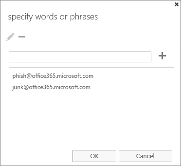
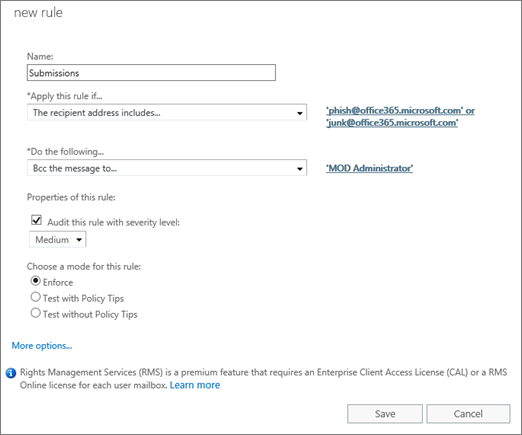

# Aktivieren des Berichtsnachrichts-Add-InsEnable the Report Message add-in

> [!NOTE]
> Das Berichtsnachrichten-Add-in für Outlook und Outlook im Internet ist nicht genau dasselbe wie der [Outlook-Junk-e-Mail-Filter](https://support.office.com/article/5ae3ea8e-cf41-4fa0-b02a-3b96e21de089), obwohl beide dazu verwendet werden können, e-Mails als Junk-e-Mail, nicht als Junk-oder als Phishing-Versuch zu kennzeichnen.The Report Message add-in for Outlook and Outlook on the web is not exactly the same thing as the [Outlook Junk Email Filter](https://support.office.com/article/5ae3ea8e-cf41-4fa0-b02a-3b96e21de089), although both can be used to mark email as junk, not junk, or a phishing attempt. Der Unterschied besteht darin, dass das Add-in "Berichtsnachricht" für Outlook und Outlook im Internet Microsoft über falsch klassifizierte e-Mails benachrichtigt, während der Outlook-Junk-e-Mail-Filter zum Organisieren von e-Mail-Nachrichten im Postfach eines Benutzers verwendet wird.The difference is, the Report Message add-in for Outlook and Outlook on the web notifies Microsoft about misclassified email, whereas the Outlook Junk Email Filter is used to organize email messages in a user's mailbox.

## ÜbersichtOverview

Das Berichtsnachrichten-Add-in für Outlook und Outlook im Internet ermöglicht Benutzern das einfache Melden von vertraulichen oder böswilligen e-Mail-Nachrichten an Microsoft und seine Partnerunternehmen zur Analyse.The Report Message add-in for Outlook and Outlook on the web enables people to easily report misclassified email, whether safe or malicious, to Microsoft and its affiliates for analysis. Microsoft verwendet diese Übermittlungen, um die Effektivität von e-Mail-Schutztechnologien zu verbessern.Microsoft uses these submissions to improve the effectiveness of email protection technologies. Wenn Ihre Organisation [Office 365 Advanced Threat Protection Plan 1](office-365-atp.md) oder [Plan 2](office-365-ti.md)verwendet, bietet das Add-in "Berichtsnachricht" außerdem nützliche Informationen zum Überprüfen und Aktualisieren von Sicherheitsrichtlinien, die dem Sicherheitsteam Ihrer Organisation zur Verfügung stehen.In addition, if your organization is using [Office 365 Advanced Threat Protection Plan 1](office-365-atp.md) or [Plan 2](office-365-ti.md), the Report Message add-in provides your organization's security team with useful information they can use to review and update security policies.

Nehmen wir beispielsweise an, dass Personen viele Nachrichten als Phishing melden.For example, suppose that people are reporting a lot of messages as phishing. Diese Informationen werden im [Sicherheits Dashboard](security-dashboard.md) und in anderen Berichten unter Oberflächen angezeigt.This information surfaces in the [Security Dashboard](security-dashboard.md) and other reports. Das Sicherheitsteam Ihrer Organisation kann diese Informationen als Anhaltspunkt dafür verwenden, dass Anti-Phishing-Richtlinien möglicherweise aktualisiert werden müssen.Your organization's security team can use this information as an indication that anti-phishing policies might need to be updated. Oder wenn Personen viele Nachrichten melden, die als Junk-e-Mail als nicht-Junk mithilfe des Berichtsnachrichten-Add-ins gekennzeichnet wurden, muss das Sicherheitsteam Ihrer Organisation möglicherweise [Anti-Spam-Richtlinien](configure-the-anti-spam-policies.md)anpassen.Or, if people are reporting a lot of messages that were flagged as junk mail as Not Junk by using the Report Message add-in, your organization's security team might need to adjust [anti-spam policies](configure-the-anti-spam-policies.md).

Das Add-in "Berichtsnachricht" kann mit Ihrem Office 365-Abonnement und den folgenden Produkten verwendet werden:The Report Message add-in works with your Office 365 subscription and the following products:
 - Outlook im WebOutlook on the web
 - Outlook 2013 SP1Outlook 2013 SP1
 - Outlook 2016Outlook 2016
 - Outlook 2016 für MacOutlook 2016 for Mac
 - Outlook im Lieferumfang von Office 365 ProPlusOutlook included with Office 365 ProPlus

Ihr vorhandener Webbrowser sollte ausreichen, damit das Add-in "Berichtsnachricht" funktioniert. Wenn Sie jedoch feststellen, dass das Add-in nicht verfügbar ist oder nicht wie erwartet funktioniert, versuchen Sie es mit einem anderen Browser.Your existing web browser should suffice for the Report Message add-in to work; however, if you notice the add-in is not available or not working as expected, try a different browser.

Wenn Sie ein einzelner Benutzer sind, können Sie [das Add-in "Berichtsnachricht" für sich selbst aktivieren](#get-the-report-message-add-in-for-yourself).If you're an individual user, you can [enable the Report Message add-in for yourself](#get-the-report-message-add-in-for-yourself).

Wenn Sie ein Office 365 globaler Administrator oder ein Exchange Online Administrator sind und Exchange für die Verwendung der OAuth-Authentifizierung konfiguriert ist, können Sie [das Add-in "Berichtsnachricht" für Ihre Organisation aktivieren](#get-and-enable-the-report-message-add-in-for-your-organization).If you're an Office 365 global administrator or an Exchange Online administrator, and Exchange is configured to use OAuth authentication, you can [enable the Report Message add-in for your organization](#get-and-enable-the-report-message-add-in-for-your-organization). Das Add-in "Berichtsnachricht" ist jetzt über eine [zentralisierte Bereitstellung](https://docs.microsoft.com/office365/admin/manage/centralized-deployment-of-add-ins)verfügbar.The Report Message Add-In is now available through [Centralized Deployment](https://docs.microsoft.com/office365/admin/manage/centralized-deployment-of-add-ins).

## Abrufen des Berichtsnachrichten-Add-Ins für sich selbstGet the Report Message add-in for yourself

1. Suchen Sie in [Microsoft AppSource](https://appsource.microsoft.com/marketplace/apps)nach dem [Add-in "Berichtsnachricht](https://appsource.microsoft.com/product/office/wa104381180)".In [Microsoft AppSource](https://appsource.microsoft.com/marketplace/apps), search for the [Report Message add-in](https://appsource.microsoft.com/product/office/wa104381180).

2. Wählen Sie **get it now**aus.Choose **GET IT NOW**.

   

3. Lesen Sie die Nutzungsbedingungen und Datenschutzrichtlinien.Review the terms of use and privacy policy. Wählen Sie dann **Continue** aus.Then choose **Continue**.

4. Melden Sie sich bei Office 365 mit Ihrem Geschäfts-oder Schulkonto (für geschäftliche Zwecke) oder Ihrem Microsoft-Konto (zur persönlichen Verwendung) an.Sign in to Office 365 using your work or school account (for business use) or your Microsoft account (for personal use).

Nachdem das Add-in installiert und aktiviert wurde, werden die folgenden Symbole angezeigt:After the add-in is installed and enabled, you'll see the following icons:

- In Outlook sieht das Symbol wie folgt aus:In Outlook, the icon looks like this:

  

- In Outlook im Internet (früher bekannt als Outlook Web App) sieht das Symbol wie folgt aus:In Outlook on the web (formerly known as Outlook Web App), the icon looks like this:

  

> [!TIP]
> Im nächsten Schritt erfahren Sie, wie Sie [das Add-in "Berichtsnachricht" verwenden](https://support.office.com/article/b5caa9f1-cdf3-4443-af8c-ff724ea719d2).As a next step, learn how to [Use the Report Message add-in](https://support.office.com/article/b5caa9f1-cdf3-4443-af8c-ff724ea719d2).

## Abrufen und Aktivieren des Berichtsnachrichten-Add-Ins für Ihre OrganisationGet and enable the Report Message add-in for your organization

> [!IMPORTANT]
> Sie müssen ein Office 365 globaler Administrator oder ein Exchange Online Administrator sein, um diese Aufgabe ausführen zu können.You must be an Office 365 global administrator or an Exchange Online Administrator to complete this task. Darüber hinaus muss Exchange für die Verwendung der OAuth-Authentifizierung konfiguriert sein, um weitere Informationen zu erhalten, siehe [Exchange-Anforderungen (zentralisierte Bereitstellung von Add-Ins)](https://docs.microsoft.com/office365/admin/manage/centralized-deployment-of-add-ins).In addition, Exchange must be configured to use OAuth authentication To learn more, see [Exchange requirements (Centralized Deployment of add-ins)](https://docs.microsoft.com/office365/admin/manage/centralized-deployment-of-add-ins).

1. Wechseln Sie zur [Seite Dienste #a0-Add-ins](https://admin.microsoft.com/AdminPortal/Home#/Settings/ServicesAndAddIns) im Microsoft 365 Admin Center.Go to the [Services & add-ins page](https://admin.microsoft.com/AdminPortal/Home#/Settings/ServicesAndAddIns) in the Microsoft 365 admin center.

   

2. Wählen Sie **+ Deploy Add-in aus**.Choose **+ Deploy Add-in**.

   

3. Überprüfen Sie im **neuen Add-in-** Bildschirm die Informationen, und wählen Sie dann **weiter**aus.In the **New Add-In** screen, review the information, and then choose **Next**.

   

4. Wählen Sie **Ich möchte ein Add-in aus dem Office Store hinzufügen aus**, und klicken Sie dann auf **weiter**.Select **I want to add an Add-In from the Office Store**, and then choose **Next**.

   

5. Suchen Sie nach **Berichtsnachricht**, und wählen Sie in der Ergebnisliste neben dem **Add-in "Berichtsnachricht**" die Option **Hinzufügen**aus.Search for **Report Message**, and in the list of results, next to the **Report Message Add-In**, choose **Add**.

   

6. Überprüfen Sie auf dem Bildschirm **Bericht Meldung** die Informationen, und wählen Sie dann **weiter**aus.On the **Report Message** screen, review the information, and then choose **Next**.

   

7. Geben Sie die Standardeinstellungen des Benutzers für Outlook an, und klicken Sie dann auf **weiter**.Specify the user default settings for Outlook, and  then choose **Next**.

   

8. Geben Sie an, wer das Add-in "Berichtsnachricht" abruft, und wählen Sie dann **Speichern**aus.Specify who gets the Report Message Add-in, and then choose **Save**.

   

> [!TIP]
> Es [wird empfohlen, eine Regel einzurichten, um eine Kopie der von Ihren Benutzern gemeldeten e-Mail-Nachrichten zu erhalten](#set-up-a-rule-to-get-a-copy-of-email-messages-reported-by-your-users).We recommend [setting up a rule to get a copy of email messages reported by your users](#set-up-a-rule-to-get-a-copy-of-email-messages-reported-by-your-users).

Je nachdem, was Sie beim Einrichten des Add-Ins (Schritte 7-8 oben) ausgewählt haben, ist das [Add-in "Berichtsnachricht](https://support.office.com/article/b5caa9f1-cdf3-4443-af8c-ff724ea719d2) " für Personen in Ihrer Organisation verfügbar.Depending on what you selected when you set up the add-in (steps 7-8 above), people in your organization will have the [Report Message add-in](https://support.office.com/article/b5caa9f1-cdf3-4443-af8c-ff724ea719d2) available. Personen in Ihrer Organisation werden die folgenden Symbole angezeigt:People in your organization will see the following icons:

- In Outlook sieht das Symbol wie folgt aus:In Outlook, the icon looks like this:

  

- In Outlook im Internet sieht das Symbol wie folgt aus:In Outlook on the web, the icon looks like this:

  

> [!TIP]
> Wenn Sie Benutzer über das Add-in "Berichtsnachricht" informieren, fügen Sie einen Link zur [Verwendung des Berichtsnachrichten-Add-ins](https://support.office.com/article/b5caa9f1-cdf3-4443-af8c-ff724ea719d2)hinzu.When you notify users about the Report Message add-in, include a link to [Use the Report Message add-in](https://support.office.com/article/b5caa9f1-cdf3-4443-af8c-ff724ea719d2).

## Einrichten einer Regel zum Abrufen einer Kopie von von Ihren Benutzern gemeldeten e-Mail-NachrichtenSet up a rule to get a copy of email messages reported by your users

> [!IMPORTANT]
> Sie müssen ein Exchange Online Administrator sein, um diese Aufgabe ausführen zu können.You must be an Exchange Online Administrator to perform this task.

Sie können eine Regel einrichten, um eine Kopie der von Benutzern in Ihrer Organisation gemeldeten e-Mail-Nachrichten zu erhalten.You can set up a rule to get a copy of email messages reported by users in your organization. Dies tun Sie, nachdem Sie das Add-in "Berichtsnachricht" für Ihre Organisation heruntergeladen und aktiviert haben.You do this after you have downloaded and enabled the Report Message add-in for your organization.

1. Wählen Sie in der Exchange-Verwaltungskonsole **Nachrichtenfluss** \> **Regeln**aus.In the Exchange admin center, choose **mail flow** \> **rules**.

2. Wählen **+** \> Sie **neue Regel erstellen**aus.Choose **+** \> **Create a new rule**.

3. Geben Sie im Feld **Name** einen Namen ein, beispielsweise Übermittlungen.In the **Name** box, type a name, such as Submissions.

4. Wählen Sie in der Liste **diese Regel anwenden, wenn** **die Option Empfängeradresse enthält...** aus.In the **Apply this rule if** list, choose **The recipient address includes...**.

5. Klicken Sie im Bildschirm **Wörter oder Ausdrücke angeben** auf Hinzufügen `junk@office365.microsoft.com` , und `phish@office365.microsoft.com`wählen Sie dann **OK**aus.In the **specify words or phrases** screen, add `junk@office365.microsoft.com` and `phish@office365.microsoft.com`, and then choose **OK**.

   

6. Wählen Sie in der Liste **ausführen die folgende...** die Option **Bcc die Nachricht an...** aus.In the **Do the following...** list, choose **Bcc the message to...**.

7. Fügen Sie einen globalen Administrator, Sicherheitsadministrator und/oder Sicherheits Leser hinzu, der eine Kopie jeder e-Mail-Nachricht erhalten soll, die Personen an Microsoft melden, und wählen Sie dann **OK**aus.Add a global administrator, security administrator, and/or security reader who should receive a copy of each email message that people report to Microsoft, and then choose **OK**.

   

8. Wählen Sie **diese Regel mit Schweregrad überwachen**aus, und wählen Sie **Medium**aus.Select **Audit this rule with severity level**, and choose **Medium**.

9. Wählen Sie unter **Modus für diese Regel auswählen die**Option **erzwingen**aus.Under **Choose a mode for this rule**, choose **Enforce**.

   

10. Wählen Sie **Speichern** aus.Choose **Save**.

Wenn diese Regel erfüllt ist, erhält Ihr globaler Administrator, Sicherheitsadministrator und/oder Sicherheits Leser eine Kopie dieser Nachricht, wenn jemand in Ihrer Organisation eine e-Mail-Nachricht mithilfe des Berichtsnachrichten-Add-ins meldet.With this rule in place, whenever someone in your organization reports an email message using the Report Message add-in, your global administrator, security administrator, and/or security reader will receive a copy of that message. Diese Informationen können Ihnen das Einrichten oder Anpassen von Richtlinien ermöglichen, beispielsweise Office 365 Richtlinien für [ATP-sichere Links](atp-safe-links.md) oder Ihre [Anti-Spam-](anti-spam-protection.md) Einstellungen.This information can enable you to set up or adjust policies, such as [Office 365 ATP Safe Links](atp-safe-links.md) policies, or your [anti-spam](anti-spam-protection.md) settings.

## Informationen zur Verwendung des Berichtsnachrichten-Add-insLearn how to use the Report Message add-in

Siehe [Verwenden des Berichtsnachrichten-Add-ins](https://support.office.com/article/b5caa9f1-cdf3-4443-af8c-ff724ea719d2).See [Use the Report Message add-in](https://support.office.com/article/b5caa9f1-cdf3-4443-af8c-ff724ea719d2).

## Überprüfen oder Bearbeiten der Einstellungen für das Add-in "Berichtsnachricht"Review or edit settings for the Report Message add-in

Sie können die Standardeinstellungen für das Add-in "Berichtsnachricht" auf der [Seite Dienste #a0-Add-ins](https://admin.microsoft.com/AdminPortal/Home#/Settings/ServicesAndAddIns)überprüfen und bearbeiten.You can review and edit the default settings for the Report Message add-in on the [Services & Add-Ins page](https://admin.microsoft.com/AdminPortal/Home#/Settings/ServicesAndAddIns).

> [!IMPORTANT]
> Sie müssen ein Office 365 globaler Administrator oder ein Exchange Online Administrator sein, um diese Aufgabe ausführen zu können.You must be an Office 365 global administrator or an Exchange Online Administrator to complete this task.

1. Wechseln Sie zur [Seite Dienste #a0-Add-ins](https://admin.microsoft.com/AdminPortal/Home#/Settings/ServicesAndAddIns) im Microsoft 365 Admin Center.Go to the [Services & add-ins page](https://admin.microsoft.com/AdminPortal/Home#/Settings/ServicesAndAddIns) in the Microsoft 365 admin center.

   

2. Suchen Sie das Add-in Berichtsnachricht, und wählen Sie es aus.Find and select the Report Message add-in.

   

3. Überprüfen und bearbeiten Sie auf dem Bildschirm Bericht Meldung die Einstellungen entsprechend Ihrer Organisation.On the Report Message screen, review and edit settings as appropriate for your organization.

   

## Verwandte ThemenRelated topics

[Verwenden des Add-Ins "Berichtsnachricht"Use the Report Message add-in](https://support.office.com/article/b5caa9f1-cdf3-4443-af8c-ff724ea719d2)

[Anzeigen von e-Mail-Sicherheits &amp; Berichten im Security Compliance CenterView email security reports in the Security &amp; Compliance Center](../../compliance/view-email-security-reports.md)

[Anzeigen von Berichten für Office 365 Advanced Threat ProtectionView reports for Office 365 Advanced Threat Protection](view-reports-for-atp.md)

[Verwenden des Explorers im Security &amp; Compliance CenterUse Explorer in the Security &amp; Compliance Center](threat-explorer.md)
