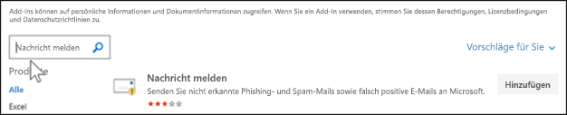

# Aktivieren der Berichtsnachricht oder der Phishing-Add-Ins meldenEnable the Report Message or the Report Phishing add-ins

[!INCLUDE [Microsoft 365 Defender rebranding](../includes/microsoft-defender-for-office.md)]

**Gilt für****Applies to**
- [Exchange Online ProtectionExchange Online Protection](exchange-online-protection-overview.md)
- [Microsoft Defender für Office 365 Plan 1 und Plan 2Microsoft Defender for Office 365 plan 1 and plan 2](defender-for-office-365.md)
- [Microsoft 365 DefenderMicrosoft 365 Defender](../defender/microsoft-365-defender.md)

> [!NOTE]
> Wenn Sie ein Administrator in einer Microsoft 365 mit Exchange Online Postfächern sind, wird empfohlen, das Übermittlungsportal im Security & Compliance Center zu verwenden.If you're an admin in a Microsoft 365 organization with Exchange Online mailboxes, we recommend that you use the Submissions portal in the Security & Compliance Center. Weitere Informationen finden Sie unter [Use Admin Submission to submit suspected spam, phish, URLs, and files to Microsoft](admin-submission.md).For more information, see [Use Admin Submission to submit suspected spam, phish, URLs, and files to Microsoft](admin-submission.md).

Die Phishing-Add-Ins "Nachricht melden" und "Phishing melden" für Outlook und Outlook im Web (früher als Outlook Web App bezeichnet) ermöglichen es Benutzern, falsch positive Ergebnisse (gute E-Mails, die als ungültig gekennzeichnet sind) oder falsch negative (ungültige E-Mails sind zulässig) an Microsoft und seine Partner zur Analyse zu melden.The Report Message and Report Phishing add-ins for Outlook and Outlook on the web (formerly known as Outlook Web App) enable people to easily report false positives (good email marked as bad) or false negatives (bad email allowed) to Microsoft and its affiliates for analysis. 

Microsoft verwendet diese Übermittlungen, um die Effektivität von E-Mail-Schutztechnologien zu verbessern.Microsoft uses these submissions to improve the effectiveness of email protection technologies. Angenommen, die Benutzer melden viele Nachrichten mithilfe des Phishing-Add-Ins Melden.For example, suppose that people are reporting many messages using the Report Phishing add-in. Diese Informationen werden im Sicherheitsdashboard und anderen Berichten angezeigt.This information surfaces in the Security Dashboard and other reports. Das Sicherheitsteam Ihrer Organisation kann diese Informationen als Hinweis darauf verwenden, dass Antiphishingrichtlinien möglicherweise aktualisiert werden müssen.Your organization's security team can use this information as an indication that anti-phishing policies might need to be updated. 

Sie können entweder das Add-In "Nachricht melden" oder "Phishing melden" installieren.You can install either the Report Message or Report Phishing add-in. Wenn Ihre Benutzer Spam- und Phishingnachrichten melden sollen, stellen Sie das Report Message-Add-In in Ihrer Organisation zur Verfügung.If you want your users to report both spam and phishing messages, deploy the Report Message add-in in your organization. Weitere Informationen finden Sie unter Aktivieren des Berichtsnachrichten-Add-Ins.For more information, see Enable the Report Message add-in. 

Das Add-In Report Message bietet die Möglichkeit, Sowohl Spam- als auch Phishingnachrichten zu melden.The Report Message add-in provides the option to report both spam and phishing messages. Administratoren können das Report Message-Add-In für die Organisation aktivieren, und einzelne Benutzer können es für sich selbst installieren.Admins can enable the Report Message add-in for the organization, and individual users can install it for themselves. 

Das Phishing-Add-In "Phishing melden" bietet die Möglichkeit, nur Phishingnachrichten zu melden.The Report Phishing add-in provides the option to report only phishing messages. Administratoren können das Phishing-Add-In melden für die Organisation aktivieren, und einzelne Benutzer können es für sich selbst installieren.Admins can enable the Report Phishing add-in for the organization, and individual users can install it for themselves. 

Wenn Sie ein einzelner Benutzer sind, können Sie beide Add-Ins für sich selbst aktivieren.If you're an individual user, you can enable both the add-ins for yourself.

f Sie ein globaler Administrator oder ein Exchange Online-Administrator sind und Exchange für die Verwendung der OAuth-Authentifizierung konfiguriert ist, können Sie das Add-In Nachricht melden und das Phishing-Add-In melden für Ihre Organisation aktivieren.f you're a global administrator or an Exchange Online administrator, and Exchange is configured to use OAuth authentication, you can enable the Report Message add-in and the Report Phishing add-in for your organization. Beide Add-Ins sind jetzt über die zentrale [Bereitstellung verfügbar.](../../admin/manage/centralized-deployment-of-add-ins.md)Both add-ins are now available through [Centralized Deployment](../../admin/manage/centralized-deployment-of-add-ins.md).

## Was sollten Sie wissen, bevor Sie beginnen?What do you need to know before you begin?

- Sowohl das Report Message-Add-In als auch das Phishing-Add-In Report funktioniert mit den meisten Microsoft 365 und den folgenden Produkten:Both the Report Message add-in and the Report Phishing add-in works with most Microsoft 365 subscriptions and the following products:

  - Outlook im WebOutlook on the web
  - Outlook 2013 SP1 oder höherOutlook 2013 SP1 or later
  - Outlook 2016 für MacOutlook 2016 for Mac
  - Outlook in Microsoft 365 apps for EnterpriseOutlook included with Microsoft 365 apps for Enterprise
  - Outlook App für iOS und AndroidOutlook app for iOS and Android

- Beide Add-Ins sind nicht für freigegebene Postfächer oder Postfächer in lokalen Organisationen Exchange verfügbar.Both add-ins are not available for shared mailboxes or mailboxes in on-premises Exchange organizations.

- Ihr vorhandener Webbrowser sollte sowohl mit den Add-Ins "Nachricht melden" als auch "Phishing melden" funktionieren. Wenn Sie jedoch feststellen, dass das Add-In nicht verfügbar ist oder nicht wie erwartet funktioniert, versuchen Sie es mit einem anderen Browser.Your existing web browser should work with both the Report Message and Report Phishing add-ins. But, if you notice the add-in is not available or not working as expected, try a different browser.

- Für Organisationsinstallationen muss die Organisation für die Verwendung der OAuth-Authentifizierung konfiguriert werden.For organizational installs, the organization needs to be configured to use OAuth authentication. Weitere Informationen finden Sie unter [Determine if Centralized Deployment of add-ins works for your organization](../../admin/manage/centralized-deployment-of-add-ins.md).For more information, see [Determine if Centralized Deployment of add-ins works for your organization](../../admin/manage/centralized-deployment-of-add-ins.md).

- Administratoren müssen Mitglied der Rollengruppe Globale Administratoren sein.Admins need to be a member of the Global admins role group. Weitere Informationen finden Sie unter [Berechtigungen im Security & Compliance Center](permissions-in-the-security-and-compliance-center.md).For more information, see [Permissions in the Security & Compliance Center](permissions-in-the-security-and-compliance-center.md).

- Weitere Informationen zum Melden einer Nachricht mithilfe des Berichtsnachrichtenfeatures finden Sie unter Melden falsch positiver und falsch negativer [Outlook](report-false-positives-and-false-negatives.md).For more information on how to report a message using the Report Message feature, see [Report false positives and false negatives in Outlook](report-false-positives-and-false-negatives.md).

## Get the Report Message add-inGet the Report Message add-in

### Das Add-In für sich selbstGet the add-in for yourself

1. Wechseln Sie zur Microsoft AppSource <https://appsource.microsoft.com/marketplace/apps> unter, und suchen Sie nach dem Add-In Nachricht melden.Go to the Microsoft AppSource at <https://appsource.microsoft.com/marketplace/apps> and search for the Report Message add-in. Um direkt zum Add-In "Nachricht melden" zu wechseln, wechseln Sie zu <https://appsource.microsoft.com/product/office/wa104381180> .To go directly to the Report Message add-in, go to <https://appsource.microsoft.com/product/office/wa104381180>.

2. Klicken Sie **auf JETZT GET IT**.Click **GET IT NOW**.

   

3. Überprüfen Sie im angezeigten Dialogfeld die Nutzungsbedingungen und die Datenschutzrichtlinie, und klicken Sie dann auf **Weiter**.In the dialog that appears, review the terms of use and privacy policy, and then click **Continue**.

4. Melden Sie sich mit Ihrem Geschäfts- oder Schulkonto (für geschäftliche Nutzung) oder Ihrem Microsoft-Konto (für den persönlichen Gebrauch) an.Sign in using your work or school account (for business use) or your Microsoft account (for personal use).

Nachdem das Add-In installiert und aktiviert wurde, werden die folgenden Symbole angezeigt:After the add-in is installed and enabled, you'll see the following icons:

- In Outlook sieht das Symbol wie dies aus:In Outlook, the icon looks like this:

  > [!div class="mx-imgBorder"]
  > 

- In Outlook im Web sieht das Symbol wie dies aus:In Outlook on the web, the icon looks like this:

  > [!div class="mx-imgBorder"]
  > 

### Das Add-In für Ihre Organisation erhaltenGet the add-in for your organization

> [!NOTE]
> Es kann bis zu 12 Stunden dauern, bis das Add-In in Ihrer Organisation angezeigt wird.It could take up to 12 hours for the add-in to appear in your organization.

1. Wechseln Sie Microsoft 365 Admin Center zur Seite Einstellungen  \> **Add-Ins** unter <https://admin.microsoft.com/AdminPortal/Home#/Settings/AddIns> .In the Microsoft 365 admin center, go to the go to the **Settings** \> **Add-ins** page at <https://admin.microsoft.com/AdminPortal/Home#/Settings/AddIns>. Wenn die **Add-In-Seite** nicht angezeigt wird, wechseln Sie zum Link **Einstellungen** Integrierte \>  \> **Apps-Add-Ins**  oben auf der Seite Integrierte Apps.If you don't see the **Add-in** Page, go to the **Settings** \> **Integrated apps** \> **Add-ins** link on the top of the **Integrated apps** page.

2. Wählen **Sie add-in** bereitstellen oben auf der Seite aus, und wählen Sie dann **Weiter aus.**Select **Deploy Add-in** at the top of the page, and then select **Next**.

   

3. Überprüfen Sie im angezeigten Flyout Bereitstellen eines neuen **Add-Ins** die Informationen, und klicken Sie dann auf **Weiter**.In the **Deploy a new add-in** flyout that appears, review the information, and then click **Next**.

4. Klicken Sie auf der nächsten Seite auf **Auswählen aus Store**.On the next page, click **Choose from the Store**.

   

5. Klicken Sie auf der angezeigten Seite  **Add-In** auswählen in das Feld Suchen, geben Sie **Meldung** melden ein, und klicken Sie dann auf **Suchsymbol**  .In the **Select add-in** page that appears, click in the **Search** box, enter **Report Message**, and then click **Search** . Suchen Sie in der Liste der Ergebnisse nach **Berichtnachricht,** und klicken Sie dann auf **Hinzufügen**.In the list of results, find **Report Message** and then click **Add**.

   

6. Überprüfen Sie im angezeigten Dialogfeld die Lizenzierungs- und Datenschutzinformationen, und klicken Sie dann auf **Weiter**.In the dialog that appears, review the licensing and privacy information, and then click **Continue**.

7. Konfigurieren Sie auf der angezeigten Seite **Add-In** konfigurieren die folgenden Einstellungen:In the **Configure add-in** page that appears, configure the following settings:

   - **Zugewiesene** Benutzer : Wählen Sie einen der folgenden Werte aus:**Assigned users**: Select one of the following values:

     - **Jeder** (Standard)**Everyone** (default)
     - **Bestimmte Benutzer/Gruppen****Specific users / groups**
     - **Nur ich****Just me**

   - **Bereitstellungsmethode**: Wählen Sie einen der folgenden Werte aus:**Deployment method**: Select one of the following values:

     - **Fixed (Standard):** Das Add-In wird automatisch für die angegebenen Benutzer bereitgestellt und kann nicht entfernt werden.**Fixed (Default)**: The add-in is automatically deployed to the specified users and they can't remove it.
     - **Verfügbar:** Benutzer können das Add-In unter **Home** \> **Get add-ins** \> **Admin-managed installieren.****Available**: Users can install the add-in at **Home** \> **Get add-ins** \> **Admin-managed**.
     - **Optional:** Das Add-In wird automatisch für die angegebenen Benutzer bereitgestellt, kann es jedoch entfernen.**Optional**: The add-in is automatically deployed to the specified users, but they can choose to remove it.

   

   Klicken Sie nach Abschluss des Abschlusses auf **Bereitstellen**.When you're finished, click **Deploy**.

8. Auf der **angezeigten** Seite Berichtsnachricht bereitstellen wird ein Fortschrittsbericht angezeigt, gefolgt von der Bestätigung, dass das Add-In bereitgestellt wurde.In the **Deploy Report Message** page that appears, you'll see a progress report followed by a confirmation that the add-in was deployed. Klicken Sie nach dem Lesen der Informationen auf **Weiter**.After you read the information, click **Next**.

   

9. Überprüfen Sie auf der angezeigten Seite **Add-In** ankündigen die Informationen, und klicken Sie dann auf **Schließen**.On the **Announce add-in** page that appears, review the information, and then click **Close**.

   

## Überprüfen oder Bearbeiten von Einstellungen für das Report Message-Add-InReview or edit settings for the Report Message add-in

1. Wechseln Sie Microsoft 365 Admin Center zur Seite Einstellungen  \> **Add-Ins** unter <https://admin.microsoft.com/AdminPortal/Home#/Settings/AddIns> .In the Microsoft 365 admin center, go to the go to the **Settings** \> **Add-ins** page at <https://admin.microsoft.com/AdminPortal/Home#/Settings/AddIns>. Wenn die **Add-In-Seite** nicht angezeigt wird, wechseln Sie zum Link **Einstellungen** Integrierte \>  \> **Apps-Add-Ins**  oben auf der Seite Integrierte Apps.If you don't see the **Add-in** Page, go to the **Settings** \> **Integrated apps** \> **Add-ins** link on the top of the **Integrated apps** page.

   

2. Suchen Sie das **Add-In Nachricht** melden, und wählen Sie es aus.Find and select the **Report Message** add-in.

3. Überprüfen **und** bearbeiten Sie im angezeigten Flyout Berichtsnachricht bearbeiten die Einstellungen, die für Ihre Organisation geeignet sind.In the **Edit Report Message** flyout that appears, review and edit settings as appropriate for your organization. Klicken Sie nach Abschluss des Vorgangs auf **Speichern**.When you're finished, click **Save**.

   

## Das Phishing-Add-In meldenGet the Report Phishing add-in

### Das Add-In für sich selbstGet the add-in for yourself

1. Wechseln Sie zur Microsoft AppSource <https://appsource.microsoft.com/marketplace/apps> unter, und suchen Sie nach dem Phishing-Add-In Melden.Go to the Microsoft AppSource at <https://appsource.microsoft.com/marketplace/apps> and search for the Report Phishing add-in.

2. Klicken Sie **auf JETZT GET IT**.Click **GET IT NOW**.

3. Überprüfen Sie im angezeigten Dialogfeld die Nutzungsbedingungen und die Datenschutzrichtlinie, und klicken Sie dann auf **Weiter**.In the dialog that appears, review the terms of use and privacy policy, and then click **Continue**.

4. Melden Sie sich mit Ihrem Geschäfts- oder Schulkonto (für geschäftliche Nutzung) oder Ihrem Microsoft-Konto (für den persönlichen Gebrauch) an.Sign in using your work or school account (for business use) or your Microsoft account (for personal use).

Nachdem das Add-In installiert und aktiviert wurde, werden die folgenden Symbole angezeigt:After the add-in is installed and enabled, you'll see the following icons:

- In Outlook sieht das Symbol wie dies aus:In Outlook, the icon looks like this:

  

- In Outlook im Web sieht das Symbol wie dies aus:In Outlook on the web, the icon looks like this:

  > [!div class="mx-imgBorder"]
  > 

### Das Add-In für Ihre Organisation erhaltenGet the add-in for your organization

> [!NOTE]
> Es kann bis zu 12 Stunden dauern, bis das Add-In in Ihrer Organisation angezeigt wird.It could take up to 12 hours for the add-in to appear in your organization.

1. Wechseln Sie Microsoft 365 Admin Center zur Seite Einstellungen  \> **Add-Ins** unter <https://admin.microsoft.com/AdminPortal/Home#/Settings/AddIns> .In the Microsoft 365 admin center, go to the go to the **Settings** \> **Add-ins** page at <https://admin.microsoft.com/AdminPortal/Home#/Settings/AddIns>. Wenn die **Add-In-Seite** nicht angezeigt wird, wechseln Sie zum Link **Einstellungen** Integrierte \>  \> **Apps-Add-Ins**  oben auf der Seite Integrierte Apps.If you don't see the **Add-in** Page, go to the **Settings** \> **Integrated apps** \> **Add-ins** link on the top of the **Integrated apps** page.

2. Wählen **Sie add-in** bereitstellen oben auf der Seite aus, und wählen Sie dann **Weiter aus.**Select **Deploy Add-in** at the top of the page, and then select **Next**.

   

3. Überprüfen Sie im angezeigten Flyout Bereitstellen eines neuen **Add-Ins** die Informationen, und klicken Sie dann auf **Weiter**.In the **Deploy a new add-in** flyout that appears, review the information, and then click **Next**.

4. Klicken Sie auf der nächsten Seite auf **Auswählen aus Store**.On the next page, click **Choose from the Store**.

   

5. Klicken Sie auf der angezeigten Seite  **Add-In** auswählen in das Feld Suchen, geben Sie **Phishing** melden ein, und klicken Sie dann auf **Suchsymbol**  .In the **Select add-in** page that appears, click in the **Search** box, enter **Report Phishing**, and then click **Search** . Suchen Sie in der Liste der Ergebnisse nach **Phishing melden,** und klicken Sie dann auf **Hinzufügen**.In the list of results, find **Report Phishing** and then click **Add**.

6. Überprüfen Sie im angezeigten Dialogfeld die Lizenzierungs- und Datenschutzinformationen, und klicken Sie dann auf **Weiter**.In the dialog that appears, review the licensing and privacy information, and then click **Continue**.

7. Konfigurieren Sie auf der angezeigten Seite **Add-In** konfigurieren die folgenden Einstellungen:In the **Configure add-in** page that appears, configure the following settings:

   - **Zugewiesene** Benutzer : Wählen Sie einen der folgenden Werte aus:**Assigned users**: Select one of the following values:

     - **Jeder** (Standard)**Everyone** (default)
     - **Bestimmte Benutzer/Gruppen****Specific users / groups**
     - **Nur ich****Just me**

   - **Bereitstellungsmethode**: Wählen Sie einen der folgenden Werte aus:**Deployment method**: Select one of the following values:

     - **Fixed (Standard):** Das Add-In wird automatisch für die angegebenen Benutzer bereitgestellt und kann nicht entfernt werden.**Fixed (Default)**: The add-in is automatically deployed to the specified users and they can't remove it.
     - **Verfügbar:** Benutzer können das Add-In unter **Home** \> **Get add-ins** \> **Admin-managed installieren.****Available**: Users can install the add-in at **Home** \> **Get add-ins** \> **Admin-managed**.
     - **Optional:** Das Add-In wird automatisch für die angegebenen Benutzer bereitgestellt, kann es jedoch entfernen.**Optional**: The add-in is automatically deployed to the specified users, but they can choose to remove it.

   Klicken Sie nach Abschluss des Abschlusses auf **Bereitstellen**.When you're finished, click **Deploy**.

8. Auf der **angezeigten Seite Phishingbericht** bereitstellen sehen Sie einen Fortschrittsbericht, gefolgt von einer Bestätigung, dass das Add-In bereitgestellt wurde.In the **Deploy Report Phishing** page that appears, you'll see a progress report followed by a confirmation that the add-in was deployed. Klicken Sie nach dem Lesen der Informationen auf **Weiter**.After you read the information, click **Next**.

9. Überprüfen Sie auf der angezeigten Seite **Add-In** ankündigen die Informationen, und klicken Sie dann auf **Schließen**.On the **Announce add-in** page that appears, review the information, and then click **Close**.

## Überprüfen oder Bearbeiten von Einstellungen für das Phishing-Add-In meldenReview or edit settings for the Report Phishing add-in

1. Wechseln Sie Microsoft 365 Admin Center zur Seite Einstellungen  \> **Add-Ins** unter <https://admin.microsoft.com/AdminPortal/Home#/Settings/AddIns> .In the Microsoft 365 admin center, go to the go to the **Settings** \> **Add-ins** page at <https://admin.microsoft.com/AdminPortal/Home#/Settings/AddIns>. Wenn die **Add-In-Seite** nicht angezeigt wird, wechseln Sie zum Link **Einstellungen** Integrierte \>  \> **Apps-Add-Ins**  oben auf der Seite Integrierte Apps.If you don't see the **Add-in** Page, go to the **Settings** \> **Integrated apps** \> **Add-ins** link on the top of the **Integrated apps** page.

2. Suchen Sie das **Phishing-Add-In melden,** und wählen Sie es aus.Find and select the **Report Phishing** add-in.

3. In the **Edit Report Phishing** flyout that appears, review, and edit settings as appropriate for your organization.In the **Edit Report Phishing** flyout that appears, review, and edit settings as appropriate for your organization. Wenn Sie die gewünschten Einstellungen vorgenommen haben, klicken Sie auf **Speichern**.When you're finished, click **Save**.
