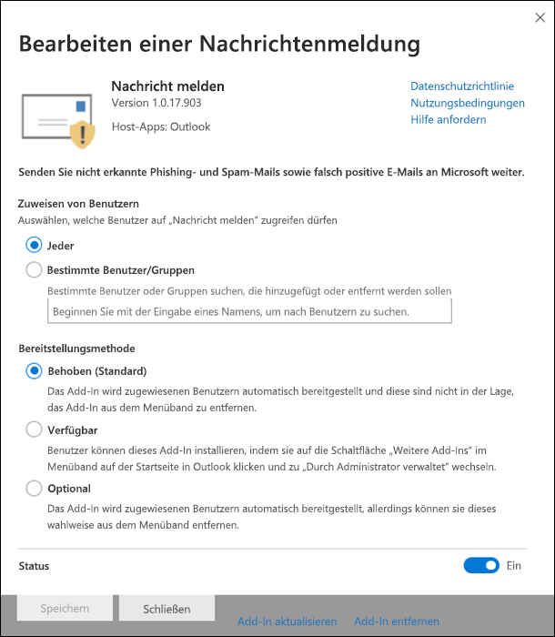

# Aktivieren des Add-Ins „Nachrichten melden“Enable the Report Message add-in

[!INCLUDE [Microsoft 365 Defender rebranding](../includes/microsoft-defender-for-office.md)]

**Gilt für****Applies to**
- [Exchange Online ProtectionExchange Online Protection](exchange-online-protection-overview.md)
- [Microsoft Defender für Office 365 Plan 1 und Plan 2Microsoft Defender for Office 365 plan 1 and plan 2](defender-for-office-365.md)
- [Microsoft 365 DefenderMicrosoft 365 Defender](../defender/microsoft-365-defender.md)

> [!NOTE]
> Wenn Sie ein Administrator in einer Microsoft 365-Organisation mit Exchange Online-Postfächern sind, wird empfohlen, das Übermittlungsportal im Security & Compliance Center zu verwenden.If you're an admin in a Microsoft 365 organization with Exchange Online mailboxes, we recommend that you use the Submissions portal in the Security & Compliance Center. Weitere Informationen finden Sie unter [Use Admin Submission to submit suspected spam, phish, URLs, and files to Microsoft](admin-submission.md).For more information, see [Use Admin Submission to submit suspected spam, phish, URLs, and files to Microsoft](admin-submission.md).

Mit den Phishing-Add-Ins für Outlook und Outlook im Web (früher als Outlook Web App bezeichnet) können Benutzer falsch positive Ergebnisse (gute E-Mails, die als schlecht gekennzeichnet sind) oder falsch negative (ungültige E-Mails sind zulässig) für die Analyse an Microsoft und seine Partner melden.The Report Message and Report Phishing add-ins for Outlook and Outlook on the web (formerly known as Outlook Web App) enables people to easily report false positives (good email marked as bad) or false negatives (bad email allowed) to Microsoft and its affiliates for analysis.

Microsoft verwendet diese Übermittlungen, um die Effektivität von E-Mail-Schutztechnologien zu verbessern.Microsoft uses these submissions to improve the effectiveness of email protection technologies. Wenn z. B. viele Nachrichten gemeldet werden, die mithilfe des Berichtsnachrichten-Add-Ins als Junk-E-Mail gekennzeichnet wurden, muss das Sicherheitsteam Ihrer Organisation möglicherweise [Antispamrichtlinien anpassen.](configure-your-spam-filter-policies.md)For example, if people are reporting a lot of messages that were flagged as junk mail as Not Junk by using the Report Message add-in, your organization's security team might need to adjust [anti-spam policies](configure-your-spam-filter-policies.md).

Sie können entweder das Add-In "Nachricht melden" oder "Phishing melden" installieren.You can install either the Report Message or Report Phishing add-in. Wenn Ihre Benutzer nur Phishingnachrichten melden sollen, stellen Sie das Phishing-Add-In Melden in Ihrer Organisation zur Verfügung.If you want your users to report only phishing messages, deploy the Report Phishing add-in in your organization. Weitere Informationen finden Sie unter [Enable the Report Phishing add-in](enable-the-report-phish-add-in.md).For more information, see [Enable the Report Phishing add-in](enable-the-report-phish-add-in.md).

Das Add-In Report Message bietet die Möglichkeit, Sowohl Spam- als auch Phishingnachrichten zu melden.The Report Message add-in provides the option to report both spam and phishing messages. Administratoren können das Report Message-Add-In für die Organisation aktivieren, und einzelne Benutzer können es für sich selbst installieren.Admins can enable the Report Message add-in for the organization, and individual users can install it for themselves.

Wenn Sie ein einzelner Benutzer sind, können Sie das [Add-In](#get-the-report-message-add-in-for-yourself)Nachricht melden für sich selbst aktivieren.If you're an individual user, you can [enable the Report Message add-in for yourself](#get-the-report-message-add-in-for-yourself).

Wenn Sie ein globaler Administrator oder Exchange Online-Administrator sind und Exchange für die Verwendung der OAuth-Authentifizierung konfiguriert ist, können Sie das [Add-In](#get-and-enable-the-report-message-add-in-for-your-organization)Nachricht melden für Ihre Organisation aktivieren.If you're a global administrator or an Exchange Online administrator, and Exchange is configured to use OAuth authentication, you can [enable the Report Message add-in for your organization](#get-and-enable-the-report-message-add-in-for-your-organization). Die Berichtsnachricht Add-In ist jetzt über die zentrale [Bereitstellung verfügbar.](../../admin/manage/centralized-deployment-of-add-ins.md)The Report Message Add-In is now available through [Centralized Deployment](../../admin/manage/centralized-deployment-of-add-ins.md).

## Was sollten Sie wissen, bevor Sie beginnen?What do you need to know before you begin?

- Das Berichtsnachrichten-Add-In funktioniert mit den meisten Microsoft 365-Abonnements und den folgenden Produkten:The Report Message add-in works with most Microsoft 365 subscriptions and the following products:

  - Outlook im WebOutlook on the web
  - Outlook 2013 SP1 oder höherOutlook 2013 SP1 or later
  - Outlook 2016 für MacOutlook 2016 for Mac
  - Outlook in Microsoft 365-Apps für Unternehmen enthaltenOutlook included with Microsoft 365 apps for Enterprise
  - Outlook-App für iOS und AndroidOutlook app for iOS and Android

- Das Berichtsnachrichten-Add-In ist für freigegebene Postfächer oder Postfächer in lokalen Exchange-Organisationen nicht verfügbar.The Report Message add-in is not available for shared mailboxes or mailboxes in on-premises Exchange organizations.

- Sie können gemeldete Nachrichten so konfigurieren, dass sie in ein von Ihnen festgelegtes Postfach kopiert oder umgeleitet werden.You can configure reported messages to be copied or redirected to a mailbox that you specify. Weitere Informationen finden Sie unter [Benutzerübermittlungsrichtlinien](user-submission.md).For more information, see [User submissions policies](user-submission.md).

- Ihr vorhandener Webbrowser sollte mit dem Report Message-Add-In funktionieren.Your existing web browser should work with the Report Message add-in. Wenn Sie jedoch feststellen, dass das Add-In nicht verfügbar ist oder nicht wie erwartet funktioniert, versuchen Sie es mit einem anderen Browser.But, if you notice the add-in is not available or not working as expected, try a different browser.

- Für Organisationsinstallationen muss die Organisation für die Verwendung der OAuth-Authentifizierung konfiguriert werden.For organizational installs, the organization needs to be configured to use OAuth authentication. Weitere Informationen finden Sie unter [Determine if Centralized Deployment of add-ins works for your organization](../../admin/manage/centralized-deployment-of-add-ins.md).For more information, see [Determine if Centralized Deployment of add-ins works for your organization](../../admin/manage/centralized-deployment-of-add-ins.md).

- Administratoren müssen Mitglied der Rollengruppe Globale Administratoren sein.Admins need to be a member of the Global admins role group. Weitere Informationen finden Sie unter [Berechtigungen im Security & Compliance Center](permissions-in-the-security-and-compliance-center.md).For more information, see [Permissions in the Security & Compliance Center](permissions-in-the-security-and-compliance-center.md).

## Erstellen des Berichtsnachrichten-Add-Ins für sich selbstGet the Report Message add-in for yourself

1. Wechseln Sie zur Microsoft AppSource <https://appsource.microsoft.com/marketplace/apps> unter, und suchen Sie nach dem Add-In Nachricht melden.Go to the Microsoft AppSource at <https://appsource.microsoft.com/marketplace/apps> and search for the Report Message add-in. Um direkt zum Add-In "Nachricht melden" zu wechseln, wechseln Sie zu <https://appsource.microsoft.com/product/office/wa104381180> .To go directly to the Report Message add-in, go to <https://appsource.microsoft.com/product/office/wa104381180>.

2. Klicken Sie **auf JETZT GET IT**.Click **GET IT NOW**.

   

3. Überprüfen Sie im angezeigten Dialogfeld die Nutzungsbedingungen und die Datenschutzrichtlinie, und klicken Sie dann auf **Weiter**.In the dialog that appears, review the terms of use and privacy policy, and then click **Continue**.

4. Melden Sie sich mit Ihrem Geschäfts- oder Schulkonto (für geschäftliche Nutzung) oder Ihrem Microsoft-Konto (für den persönlichen Gebrauch) an.Sign in using your work or school account (for business use) or your Microsoft account (for personal use).

Nachdem das Add-In installiert und aktiviert wurde, werden die folgenden Symbole angezeigt:After the add-in is installed and enabled, you'll see the following icons:

- In Outlook sieht das Symbol wie dies aus:In Outlook, the icon looks like this:

  

- In Outlook im Web sieht das Symbol wie dies aus:In Outlook on the web, the icon looks like this:

  

Informationen zur Verwendung des Add-Ins finden Sie unter [Use the Report Message add-in](https://support.microsoft.com/office/b5caa9f1-cdf3-4443-af8c-ff724ea719d2).To learn how to use the add-in, see [Use the Report Message add-in](https://support.microsoft.com/office/b5caa9f1-cdf3-4443-af8c-ff724ea719d2).

## Get and enable the Report Message add-in for your organizationGet and enable the Report Message add-in for your organization

> [!NOTE]
> Es kann bis zu 12 Stunden dauern, bis das Add-In in Ihrer Organisation angezeigt wird.It could take up to 12 hours for the add-in to appear in your organization.

1. Wechseln Sie im Microsoft 365 Admin Center  zur Seite Einstellungen-Add-Ins unter , Wenn die \>  <https://admin.microsoft.com/AdminPortal/Home#/Settings/AddIns> **Add-In-Seite**  nicht angezeigt wird, wechseln Sie zum Link Integrierte \>  \> **Apps-Add-Ins**  einstellungen oben auf der Seite Integrierte Apps.In the Microsoft 365 admin center, go to the go to the **Settings** \> **Add-ins** page at <https://admin.microsoft.com/AdminPortal/Home#/Settings/AddIns>, If you don't see the **Add-in** Page, go to the **Settings** \> **Integrated apps** \> **Add-ins** link on the top of the **Integrated apps** page.

2. Wählen **Sie add-in** bereitstellen oben auf der Seite aus, und wählen Sie dann **Weiter aus.**Select **Deploy Add-in** at the top of the page, and then select **Next**.

   

3. Überprüfen Sie im angezeigten Flyout Bereitstellen eines neuen **Add-Ins** die Informationen, und klicken Sie dann auf **Weiter**.In the **Deploy a new add-in** flyout that appears, review the information, and then click **Next**.

4. Klicken Sie auf der nächsten Seite im **Store auf Auswählen.**On the next page, click **Choose from the Store**.

   

5. Klicken Sie auf der angezeigten Seite  **Add-In** auswählen in das Feld Suchen, geben Sie **Meldung** melden ein, und klicken Sie dann auf **Suchsymbol**  .In the **Select add-in** page that appears, click in the **Search** box, enter **Report Message**, and then click **Search** . Suchen Sie in der Liste der Ergebnisse nach **Berichtnachricht,** und klicken Sie dann auf **Hinzufügen**.In the list of results, find **Report Message** and then click **Add**.

   

6. Überprüfen Sie im angezeigten Dialogfeld die Lizenzierungs- und Datenschutzinformationen, und klicken Sie dann auf **Weiter**.In the dialog that appears, review the licensing and privacy information, and then click **Continue**.

7. Konfigurieren Sie auf der angezeigten Seite **Add-In** konfigurieren die folgenden Einstellungen:In the **Configure add-in** page that appears, configure the following settings:

   - **Zugewiesene** Benutzer : Wählen Sie einen der folgenden Werte aus:**Assigned users**: Select one of the following values:

     - **Jeder** (Standard)**Everyone** (default)
     - **Bestimmte Benutzer/Gruppen****Specific users / groups**
     - **Nur ich****Just me**

   - **Bereitstellungsmethode**: Wählen Sie einen der folgenden Werte aus:**Deployment method**: Select one of the following values:

     - **Fixed (Standard):** Das Add-In wird automatisch für die angegebenen Benutzer bereitgestellt und kann nicht entfernt werden.**Fixed (Default)**: The add-in is automatically deployed to the specified users and they can't remove it.
     - **Verfügbar:** Benutzer können das Add-In unter **Home** \> **Get add-ins** \> **Admin-managed installieren.****Available**: Users can install the add-in at **Home** \> **Get add-ins** \> **Admin-managed**.
     - **Optional:** Das Add-In wird automatisch für die angegebenen Benutzer bereitgestellt, kann es jedoch entfernen.**Optional**: The add-in is automatically deployed to the specified users, but they can choose to remove it.

   

   Klicken Sie nach Abschluss des Abschlusses auf **Bereitstellen**.When you're finished, click **Deploy**.

8. Auf der **angezeigten** Seite Berichtsnachricht bereitstellen wird ein Fortschrittsbericht angezeigt, gefolgt von der Bestätigung, dass das Add-In bereitgestellt wurde.In the **Deploy Report Message** page that appears, you'll see a progress report followed by a confirmation that the add-in was deployed. Klicken Sie nach dem Lesen der Informationen auf **Weiter**.After you read the information, click **Next**.

   

9. Überprüfen Sie auf der angezeigten Seite **Add-In** ankündigen die Informationen, und klicken Sie dann auf **Schließen**.On the **Announce add-in** page that appears, review the information, and then click **Close**.

   

## Informationen zur Verwendung des Berichtsnachrichten-Add-InsLearn how to use the Report Message add-in

Personen, denen das Add-In zugewiesen ist, werden die folgenden Symbole angezeigt:People who have the add-in assigned to them will see the following icons:

- In Outlook sieht das Symbol wie dies aus:In Outlook, the icon looks like this:

  

- In Outlook im Web sieht das Symbol wie dies aus:In Outlook on the web, the icon looks like this:

  

Wenn Sie Benutzer über das Add-In "Nachricht melden" benachrichtigen, fügen Sie einen Link zum Verwenden des [Berichtsnachricht-Add-Ins hinzu.](https://support.microsoft.com/office/b5caa9f1-cdf3-4443-af8c-ff724ea719d2)When you notify users about the Report Message add-in, include a link to [Use the Report Message add-in](https://support.microsoft.com/office/b5caa9f1-cdf3-4443-af8c-ff724ea719d2).

## Überprüfen oder Bearbeiten von Einstellungen für das Report Message-Add-InReview or edit settings for the Report Message add-in

1. Wechseln Sie im Microsoft 365 Admin Center  zur Seite Einstellungen-Add-Ins unter , Wenn die \>  <https://admin.microsoft.com/AdminPortal/Home#/Settings/AddIns> **Add-In-Seite**  nicht angezeigt wird, wechseln Sie zum Link Integrierte \>  \> **Apps-Add-Ins**  einstellungen oben auf der Seite Integrierte Apps.In the Microsoft 365 admin center, go to the go to the **Settings** \> **Add-ins** page at <https://admin.microsoft.com/AdminPortal/Home#/Settings/AddIns>, If you don't see the **Add-in** Page, go to the **Settings** \> **Integrated apps** \> **Add-ins** link on the top of the **Integrated apps** page.

   

2. Suchen Sie das **Add-In Nachricht** melden, und wählen Sie es aus.Find and select the **Report Message** add-in.

3. Überprüfen **und** bearbeiten Sie im angezeigten Flyout Berichtsnachricht bearbeiten die Einstellungen, die für Ihre Organisation geeignet sind.In the **Edit Report Message** flyout that appears, review and edit settings as appropriate for your organization. Klicken Sie nach Abschluss des Vorgangs auf **Speichern**.When you're finished, click **Save**.

   

## Anzeigen und Überprüfen von gemeldeten NachrichtenView and review reported messages

Zum Überprüfen von Nachrichten, die Benutzer an Microsoft melden, haben Sie die folgenden Optionen:To review messages that users report to Microsoft, you have these options:

- Verwenden Sie das Administrator-Übermittlungsportal.Use the Admin Submissions portal. Weitere Informationen finden Sie unter [Anzeigen von Benutzerübermittlungen an Microsoft](admin-submission.md#view-user-submissions-to-microsoft).For more information, see [View user submissions to Microsoft](admin-submission.md#view-user-submissions-to-microsoft).

- Erstellen Sie eine Nachrichtenflussregel (auch als Transportregel bezeichnet), um Kopien von gemeldeten Nachrichten zu senden.Create a mail flow rule (also known as a transport rule) to send copies of reported messages. Anweisungen finden Sie unter [Verwenden von Nachrichtenflussregeln, um zu sehen, was Ihre Benutzer an Microsoft melden.](use-mail-flow-rules-to-see-what-your-users-are-reporting-to-microsoft.md)For instructions, see [Use mail flow rules to see what your users are reporting to Microsoft](use-mail-flow-rules-to-see-what-your-users-are-reporting-to-microsoft.md).
