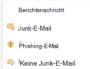

# Aktivieren des Add-Ins „Phishing melden“Enable the Report Phishing add-in

[!INCLUDE [Microsoft 365 Defender rebranding](../includes/microsoft-defender-for-office.md)]

> [!NOTE]
> Wenn Sie ein Administrator in einer Microsoft 365-Organisation mit Exchange Online-Postfächern sind, empfehlen wir die Verwendung des Übermittlungsportals im Security & Compliance Center.If you're an admin in a Microsoft 365 organization with Exchange Online mailboxes, we recommend that you use the Submissions portal in the Security & Compliance Center. Weitere Informationen finden Sie unter ["Use Admin Submission to submit suspected spam, phish, URLs, and files to Microsoft ".](admin-submission.md)For more information, see [Use Admin Submission to submit suspected spam, phish, URLs, and files to Microsoft](admin-submission.md).

Die "Nachricht melden" und "Phishing melden"-Add-Ins für Outlook und Outlook im Web (früher als Outlook Web App bezeichnet) ermöglichen Es Benutzern, falsch positive Ergebnisse (eine gute E-Mail als schlecht markiert) oder falsch negative Ergebnisse (ungültige E-Mails sind zulässig) einfach zur Analyse an Microsoft und seine Partner zu melden.The Report Message and Report Phishing add-ins for Outlook and Outlook on the web (formerly known as Outlook Web App) enable people to easily report false positives (good email marked as bad) or false negatives (bad email allowed) to Microsoft and its affiliates for analysis.

Microsoft verwendet diese Übermittlungen, um die Effektivität von E-Mail-Schutztechnologien zu verbessern.Microsoft uses these submissions to improve the effectiveness of email protection technologies. Nehmen wir beispielsweise an, dass Benutzer viele Nachrichten mit dem Phishing-Add-In "Melden" melden.For example, suppose that people are reporting many messages using the Report Phishing add-in. Diese Informationen werden im [Sicherheitsdashboard und](security-dashboard.md) anderen Berichten angezeigt.This information surfaces in the [Security Dashboard](security-dashboard.md) and other reports. Das Sicherheitsteam Ihrer Organisation kann diese Informationen als Hinweis darauf verwenden, dass Antiphishingrichtlinien möglicherweise aktualisiert werden müssen.Your organization's security team can use this information as an indication that anti-phishing policies might need to be updated.

Sie können entweder das Add-In "Nachricht melden" oder "Phishing melden" installieren.You can install either the Report Message or Report Phishing add-in. Wenn Ihre Benutzer Sowohl Spam- als auch Phishingnachrichten melden sollen, stellen Sie das Report Message-Add-In in Ihrer Organisation zur Verfügung.If you want your users to report both spam and phishing messages, deploy the Report Message add-in in your organization. Weitere Informationen finden Sie unter [Aktivieren des Berichtsnachrichten-Add-Ins.](enable-the-report-message-add-in.md)For more information, see [Enable the Report Message add-in](enable-the-report-message-add-in.md).

Das Phishing-Add-In "Melden" bietet die Möglichkeit, nur Phishingnachrichten zu melden.The Report Phishing add-in provides the option to report only phishing messages. Administratoren können das Phishing-Add-In "Melden" für die Organisation aktivieren, und einzelne Benutzer können es für sich selbst installieren.Admins can enable the Report Phishing add-in for the organization, and individual users can install it for themselves.

Wenn Sie ein einzelner Benutzer sind, können Sie das [Phishing-Add-In "Melden" für sich selbst aktivieren.](#get-the-report-phishing-add-in-for-yourself)If you're an individual user, you can [enable the Report Phishing add-in for yourself](#get-the-report-phishing-add-in-for-yourself).

Wenn Sie ein globaler Administrator oder Exchange Online-Administrator sind und Exchange für die Verwendung der OAuth-Authentifizierung konfiguriert ist, können Sie das [Phishing-Add-In](#get-and-enable-the-report-phishing-add-in-for-your-organization)"Melden" für Ihre Organisation aktivieren.If you're a global administrator or an Exchange Online administrator, and Exchange is configured to use OAuth authentication, you can [enable the Report Phishing add-in for your organization](#get-and-enable-the-report-phishing-add-in-for-your-organization). Der Phishingbericht Add-In ist jetzt über die [zentrale Bereitstellung verfügbar.](https://docs.microsoft.com/microsoft-365/admin/manage/centralized-deployment-of-add-ins)The Report Phishing Add-In is now available through [Centralized Deployment](https://docs.microsoft.com/microsoft-365/admin/manage/centralized-deployment-of-add-ins).

## Was sollten Sie wissen, bevor Sie beginnen?What do you need to know before you begin?

- Das Phishing-Add-In "Melden" funktioniert mit den meisten Microsoft 365-Abonnements und den folgenden Produkten:The Report Phishing add-in works with most Microsoft 365 subscriptions and the following products:

  - Outlook im WebOutlook on the web
  - Outlook 2013 SP1 oder höherOutlook 2013 SP1 or later
  - Outlook 2016 für MacOutlook 2016 for Mac
  - Outlook im Lieferumfang von Microsoft 365 Apps for EnterpriseOutlook included with Microsoft 365 apps for Enterprise
  - Outlook-App für iOS und AndroidOutlook app for iOS and Android

- Das Phishing-Add-In "Melden" ist für Postfächer in lokalen Exchange-Organisationen nicht verfügbar.The Report Phishing add-in is not available for mailboxes in on-premises Exchange organizations.

- Sie können gemeldete Nachrichten so konfigurieren, dass sie kopiert oder an ein von Ihnen festgelegtes Postfach umgeleitet werden.You can configure reported messages to be copied or redirected to a mailbox that you specify. Weitere Informationen finden Sie unter [Benutzerübermittlungsrichtlinien.](user-submission.md)For more information, see [User submissions policies](user-submission.md).

- Ihr vorhandener Webbrowser sollte mit dem Phishing-Add-In "Melden" funktionieren.Your existing web browser should work with the Report Phishing add-in. Wenn Sie jedoch feststellen, dass das Add-in nicht verfügbar ist oder nicht wie erwartet funktioniert, versuchen Sie es in einem anderen Browser.But, if you notice the add-in is not available or not working as expected, try a different browser.

- Für Organisationsinstallationen muss die Organisation für die Verwendung der OAuth-Authentifizierung konfiguriert werden.For organizational installs, the organization needs to be configured to use OAuth authentication. Weitere Informationen finden Sie unter Ermitteln, ob die zentrale Bereitstellung von [Add-Ins für Ihre Organisation funktioniert.](../../admin/manage/centralized-deployment-of-add-ins.md)For more information, see [Determine if Centralized Deployment of add-ins works for your organization](../../admin/manage/centralized-deployment-of-add-ins.md).

- Administratoren müssen Mitglied der Rollengruppe "Globale Administratoren" sein.Admins need to be a member of the Global admins role group. Weitere Informationen finden Sie unter [Berechtigungen im Security & Compliance Center](permissions-in-the-security-and-compliance-center.md).For more information, see [Permissions in the Security & Compliance Center](permissions-in-the-security-and-compliance-center.md).

## Das Phishing-Add-In "Melden" für sich selbst erhaltenGet the Report Phishing add-in for yourself

1. Wechseln Sie zu Microsoft AppSource, <https://appsource.microsoft.com/marketplace/apps> und suchen Sie nach dem Phishing-Add-In "Melden".Go to the Microsoft AppSource at <https://appsource.microsoft.com/marketplace/apps> and search for the Report Phishing add-in.

2. Klicken **Sie auf "JETZT GET IT".**Click **GET IT NOW**.

3. Überprüfen Sie im angezeigten Dialogfeld die Nutzungsbedingungen und die Datenschutzrichtlinie, und klicken Sie dann auf **"Weiter".**In the dialog that appears, review the terms of use and privacy policy, and then click **Continue**.

4. Melden Sie sich mit Ihrem Geschäfts-, Schul- oder Firmenkonto (zur geschäftlichen Nutzung) oder Ihrem Microsoft-Konto (zur persönlichen Nutzung) an.Sign in using your work or school account (for business use) or your Microsoft account (for personal use).

Nachdem das Add-in installiert und aktiviert wurde, werden die folgenden Symbole angezeigt:After the add-in is installed and enabled, you'll see the following icons:

- In Outlook sieht das Symbol wie hier dargestellt aus:In Outlook, the icon looks like this:

  

- In Outlook im Web sieht das Symbol wie hier dargestellt aus:In Outlook on the web, the icon looks like this:

  

## Erhalten und Aktivieren des Phishing-Add-Ins "Melden" für Ihre OrganisationGet and enable the Report Phishing add-in for your organization

> [!NOTE]
> Es kann bis zu 12 Stunden dauern, bis das Add-in in Ihrer Organisation angezeigt wird.It could take up to 12 hours for the add-in to appear in your organization.

1. Wechseln Sie im Microsoft 365 Admin Center  zur Seite \> **"Einstellungen-Add-Ins".** Wenn die <https://admin.microsoft.com/AdminPortal/Home#/Settings/AddIns> **Add-In-Seite**  nicht angezeigt wird, wechseln \>  \>   Sie oben auf der Seite "Integrierte Apps" zum Link "Integrierte Apps".In the Microsoft 365 admin center, go to the go to the **Settings** \> **Add-ins** page at <https://admin.microsoft.com/AdminPortal/Home#/Settings/AddIns>, If you don't see the **Add-in** Page, go to the **Settings** \> **Integrated apps** \> **Add-ins** link on the top of the **Integrated apps** page.

2. Wählen Sie oben auf der Seite **"Add-In** bereitstellen" und dann **"Weiter" aus.**Select **Deploy Add-in** at the top of the page, and then select **Next**.

   

3. Überprüfen Sie **im angezeigten Flyout** "Neues Add-In bereitstellen" die Informationen, und klicken Sie dann auf **"Weiter".**In the **Deploy a new add-in** flyout that appears, review the information, and then click **Next**.

4. Klicken Sie auf der nächsten Seite auf **"Aus Store auswählen".**On the next page, click **Choose from the Store**.

   

5. Klicken Sie auf **der angezeigten Seite "Add-In** auswählen" in das  Suchfeld, geben **Sie "Phishing** melden" ein, und klicken Sie dann auf das Suchsymbol   .In the **Select add-in** page that appears, click in the **Search** box, enter **Report Phishing**, and then click **Search** . Suchen Sie in der Ergebnisliste nach **"Phishing melden",** und klicken Sie dann auf **"Hinzufügen".**In the list of results, find **Report Phishing** and then click **Add**.

6. Überprüfen Sie im angezeigten Dialogfeld die Lizenzierungs- und Datenschutzinformationen, und klicken Sie dann auf **"Weiter".**In the dialog that appears, review the licensing and privacy information, and then click **Continue**.

7. Konfigurieren Sie auf der angezeigten Seite **"Add-In** konfigurieren" die folgenden Einstellungen:In the **Configure add-in** page that appears, configure the following settings:

   - **Zugewiesene Benutzer:** Wählen Sie einen der folgenden Werte aus:**Assigned users**: Select one of the following values:

     - **Jeder** (Standard)**Everyone** (default)
     - **Bestimmte Benutzer/Gruppen****Specific users / groups**
     - **Nur ich****Just me**

   - **Bereitstellungsmethode:** Wählen Sie einen der folgenden Werte aus:**Deployment method**: Select one of the following values:

     - **Fixed (Standard):** Das Add-in wird automatisch für die angegebenen Benutzer bereitgestellt und kann nicht entfernt werden.**Fixed (Default)**: The add-in is automatically deployed to the specified users and they can't remove it.
     - **Verfügbar:** Benutzer können das Add-in unter **"Home** \> **Get add-ins** \> **Admin-managed" installieren.****Available**: Users can install the add-in at **Home** \> **Get add-ins** \> **Admin-managed**.
     - **Optional:** Das Add-in wird automatisch für die angegebenen Benutzer bereitgestellt, kann aber entfernt werden.**Optional**: The add-in is automatically deployed to the specified users, but they can choose to remove it.

   Klicken Sie nach Abschluss des Abschlusses auf **"Bereitstellen".**When you're finished, click **Deploy**.

8. Auf der **angezeigten Seite "Phishingbericht** bereitstellen" wird ein Fortschrittsbericht angezeigt, gefolgt von einer Bestätigung, dass das Add-in bereitgestellt wurde.In the **Deploy Report Phishing** page that appears, you'll see a progress report followed by a confirmation that the add-in was deployed. Klicken Sie nach dem Lesen der Informationen auf **"Weiter".**After you read the information, click **Next**.

9. Überprüfen Sie **auf der angezeigten** Seite "Add-In ankündigen" die Informationen, und klicken Sie dann auf **"Schließen".**On the **Announce add-in** page that appears, review the information, and then click **Close**.

## Informationen zur Verwendung des Phishing-Add-Ins "Melden"Learn how to use the Report Phishing add-in

Personen, denen das Add-In zugewiesen ist, werden die folgenden Symbole angezeigt:People who have the add-in assigned to them will see the following icons:

- In Outlook sieht das Symbol wie hier dargestellt aus:In Outlook, the icon looks like this:

  

- In Outlook im Web sieht das Symbol wie hier dargestellt aus:In Outlook on the web, the icon looks like this:

  

## Überprüfen oder Bearbeiten von Einstellungen für das Phishing-Add-In "Melden"Review or edit settings for the Report Phishing add-in

1. Wechseln Sie im Microsoft 365 Admin Center  zur Seite \> **"Einstellungen-Add-Ins".** Wenn die <https://admin.microsoft.com/AdminPortal/Home#/Settings/AddIns> **Add-In-Seite**  nicht angezeigt wird, wechseln \>  \>   Sie oben auf der Seite "Integrierte Apps" zum Link "Integrierte Apps".In the Microsoft 365 admin center, go to the go to the **Settings** \> **Add-ins** page at <https://admin.microsoft.com/AdminPortal/Home#/Settings/AddIns>, If you don't see the **Add-in** Page, go to the **Settings** \> **Integrated apps** \> **Add-ins** link on the top of the **Integrated apps** page.

2. Suchen Sie das **Phishing-Add-In "Melden",** und wählen Sie es aus.Find and select the **Report Phishing** add-in.

3. In the **Edit Report Phishing** flyout that appears, review, and edit settings as appropriate for your organization.In the **Edit Report Phishing** flyout that appears, review, and edit settings as appropriate for your organization. Klicken Sie nach Abschluss des Vorgangs auf **Speichern**.When you're finished, click **Save**.

## Anzeigen und Überprüfen von gemeldeten NachrichtenView and review reported messages

Zum Überprüfen von Nachrichten, die Benutzer an Microsoft melden, haben Sie die folgenden Optionen:To review messages that users report to Microsoft, you have these options:

- Verwenden Sie das Verwaltungsübermittlungsportal.Use the Admin Submissions portal. Weitere Informationen finden Sie unter [Anzeigen von Benutzerübermittlungen an Microsoft](admin-submission.md#view-user-submissions-to-microsoft).For more information, see [View user submissions to Microsoft](admin-submission.md#view-user-submissions-to-microsoft).

- Erstellen Sie eine Nachrichtenflussregel (auch als Transportregel bezeichnet), um Kopien der gemeldeten Nachrichten zu senden.Create a mail flow rule (also known as a transport rule) to send copies of reported messages. Anweisungen finden Sie unter [Verwenden von Nachrichtenflussregeln, um zu sehen, was Ihre Benutzer an Microsoft melden.](use-mail-flow-rules-to-see-what-your-users-are-reporting-to-microsoft.md)For instructions, see [Use mail flow rules to see what your users are reporting to Microsoft](use-mail-flow-rules-to-see-what-your-users-are-reporting-to-microsoft.md).
