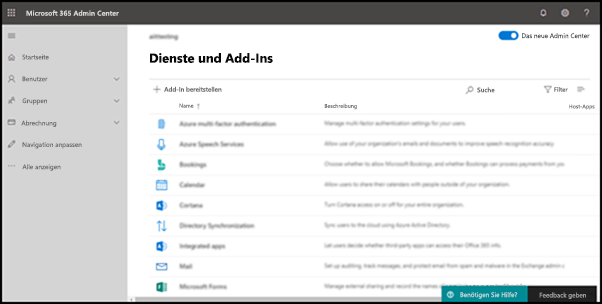

# Aktivieren des Add-Ins „Phishing melden“

[!INCLUDE [Microsoft 365 Defender rebranding](../includes/microsoft-defender-for-office.md)]

> [!NOTE]
> Wenn Sie ein Administrator in einer Microsoft 365 mit Exchange Online Postfächern sind, wird empfohlen, das Übermittlungsportal im Security & Compliance Center zu verwenden. Weitere Informationen finden Sie unter [Use Admin Submission to submit suspected spam, phish, URLs, and files to Microsoft](admin-submission.md).

Die Phishing-Add-Ins "Nachricht melden" und "Phishing melden" für Outlook und Outlook im Web (früher als Outlook Web App bezeichnet) ermöglichen es Benutzern, falsch positive Ergebnisse (gute E-Mails, die als ungültig gekennzeichnet sind) oder falsch negative (ungültige E-Mails sind zulässig) an Microsoft und seine Partner zur Analyse zu melden.

Microsoft verwendet diese Übermittlungen, um die Effektivität von E-Mail-Schutztechnologien zu verbessern. Angenommen, die Benutzer melden viele Nachrichten mithilfe des Phishing-Add-Ins Melden. Diese Informationen werden im [Sicherheitsdashboard und](security-dashboard.md) anderen Berichten angezeigt. Das Sicherheitsteam Ihrer Organisation kann diese Informationen als Hinweis darauf verwenden, dass Antiphishingrichtlinien möglicherweise aktualisiert werden müssen.

Sie können entweder das Add-In "Nachricht melden" oder "Phishing melden" installieren. Wenn Ihre Benutzer Spam- und Phishingnachrichten melden sollen, stellen Sie das Report Message-Add-In in Ihrer Organisation zur Verfügung. Weitere Informationen finden Sie unter [Enable the Report Message add-in](enable-the-report-message-add-in.md).

Das Phishing-Add-In "Phishing melden" bietet die Möglichkeit, nur Phishingnachrichten zu melden. Administratoren können das Phishing-Add-In melden für die Organisation aktivieren, und einzelne Benutzer können es für sich selbst installieren.

Wenn Sie ein einzelner Benutzer sind, können Sie das [Phishing-Add-In](#get-the-report-phishing-add-in-for-yourself)melden für sich selbst aktivieren.

Wenn Sie ein globaler Administrator oder ein Exchange Online-Administrator sind und Exchange für die Verwendung der OAuth-Authentifizierung konfiguriert ist, können Sie das [Phishing-Add-In](#get-and-enable-the-report-phishing-add-in-for-your-organization)melden für Ihre Organisation aktivieren. Der Phishingbericht Add-In jetzt über die zentrale [Bereitstellung verfügbar.](../../admin/manage/centralized-deployment-of-add-ins.md)

## Was sollten Sie wissen, bevor Sie beginnen?

- Das Phishing-Add-In "Phishing melden" kann mit den meisten Microsoft 365 und den folgenden Produkten verwendet werden:

  - Outlook im Web
  - Outlook 2013 SP1 oder höher
  - Outlook 2016 für Mac oder höher
  - Outlook in Microsoft 365 apps for Enterprise
  - Outlook App für iOS und Android

- Das Phishing-Add-In melden ist für freigegebene Postfächer oder Postfächer in lokalen Organisationen Exchange verfügbar.

- Sie können gemeldete Nachrichten so konfigurieren, dass sie in ein von Ihnen festgelegtes Postfach kopiert oder umgeleitet werden. Weitere Informationen finden Sie unter [Benutzerübermittlungsrichtlinien](user-submission.md).

- Ihr vorhandener Webbrowser sollte mit dem Phishing-Add-In Melden funktionieren. Wenn Sie jedoch feststellen, dass das Add-In nicht verfügbar ist oder nicht wie erwartet funktioniert, versuchen Sie es mit einem anderen Browser.

- Für Organisationsinstallationen muss die Organisation für die Verwendung der OAuth-Authentifizierung konfiguriert werden. Weitere Informationen finden Sie unter [Determine if Centralized Deployment of add-ins works for your organization](../../admin/manage/centralized-deployment-of-add-ins.md).

- Administratoren müssen Mitglied der Rollengruppe Globale Administratoren sein. Weitere Informationen finden Sie unter [Berechtigungen im Security & Compliance Center](permissions-in-the-security-and-compliance-center.md).

## Melden Des Phishing-Add-Ins für sich selbst

1. Wechseln Sie zur Microsoft AppSource <https://appsource.microsoft.com/marketplace/apps> unter, und suchen Sie nach dem Phishing-Add-In Melden.

2. Klicken Sie **auf JETZT GET IT**.

3. Überprüfen Sie im angezeigten Dialogfeld die Nutzungsbedingungen und die Datenschutzrichtlinie, und klicken Sie dann auf **Weiter**.

4. Melden Sie sich mit Ihrem Geschäfts- oder Schulkonto (für geschäftliche Nutzung) oder Ihrem Microsoft-Konto (für den persönlichen Gebrauch) an.

Nachdem das Add-In installiert und aktiviert wurde, werden die folgenden Symbole angezeigt:

- In Outlook sieht das Symbol wie dies aus:

  

- In Outlook im Web sieht das Symbol wie dies aus:

  

## Erhalten und Aktivieren des Phishing-Add-Ins "Phishing melden" für Ihre Organisation

> [!NOTE]
> Es kann bis zu 12 Stunden dauern, bis das Add-In in Ihrer Organisation angezeigt wird.

1. Wechseln Sie im Microsoft 365 Admin Center zu der Seite **Einstellungen-Add-Ins** unter , Wenn die \>  <https://admin.microsoft.com/AdminPortal/Home#/Settings/AddIns> **Add-In-Seite** nicht angezeigt wird, wechseln Sie zum Link **Einstellungen** Integrierte \>  \> **Apps-Add-Ins**  oben auf der Seite Integrierte Apps.

2. Wählen **Sie add-in** bereitstellen oben auf der Seite aus, und wählen Sie dann **Weiter aus.**

   

3. Überprüfen Sie im angezeigten Flyout Bereitstellen eines neuen **Add-Ins** die Informationen, und klicken Sie dann auf **Weiter**.

4. Klicken Sie auf der nächsten Seite auf **Auswählen aus Store**.

   

5. Klicken Sie auf der angezeigten Seite  **Add-In** auswählen in das Feld Suchen, geben Sie **Phishing** melden ein, und klicken Sie dann auf **Suchsymbol**  . Suchen Sie in der Liste der Ergebnisse nach **Phishing melden,** und klicken Sie dann auf **Hinzufügen**.

6. Überprüfen Sie im angezeigten Dialogfeld die Lizenzierungs- und Datenschutzinformationen, und klicken Sie dann auf **Weiter**.

7. Konfigurieren Sie auf der angezeigten Seite **Add-In** konfigurieren die folgenden Einstellungen:

   - **Zugewiesene** Benutzer : Wählen Sie einen der folgenden Werte aus:

     - **Jeder** (Standard)
     - **Bestimmte Benutzer/Gruppen**
     - **Nur ich**

   - **Bereitstellungsmethode**: Wählen Sie einen der folgenden Werte aus:

     - **Fixed (Standard):** Das Add-In wird automatisch für die angegebenen Benutzer bereitgestellt und kann nicht entfernt werden.
     - **Verfügbar:** Benutzer können das Add-In unter **Home** \> **Get add-ins** \> **Admin-managed installieren.**
     - **Optional:** Das Add-In wird automatisch für die angegebenen Benutzer bereitgestellt, kann es jedoch entfernen.

   Klicken Sie nach Abschluss des Abschlusses auf **Bereitstellen**.

8. Auf der **angezeigten Seite Phishingbericht** bereitstellen sehen Sie einen Fortschrittsbericht, gefolgt von einer Bestätigung, dass das Add-In bereitgestellt wurde. Klicken Sie nach dem Lesen der Informationen auf **Weiter**.

9. Überprüfen Sie auf der angezeigten Seite **Add-In** ankündigen die Informationen, und klicken Sie dann auf **Schließen**.

## Erfahren Sie, wie Sie das Phishing-Add-In "Phishing melden" verwenden

Personen, denen das Add-In zugewiesen ist, werden die folgenden Symbole angezeigt:

- In Outlook sieht das Symbol wie dies aus:

  

- In Outlook im Web sieht das Symbol wie dies aus:

  

## Überprüfen oder Bearbeiten von Einstellungen für das Phishing-Add-In melden

1. Wechseln Sie im Microsoft 365 Admin Center zu der Seite **Einstellungen-Add-Ins** unter , Wenn die \>  <https://admin.microsoft.com/AdminPortal/Home#/Settings/AddIns> **Add-In-Seite** nicht angezeigt wird, wechseln Sie zum Link **Einstellungen** Integrierte \>  \> **Apps-Add-Ins**  oben auf der Seite Integrierte Apps.

2. Suchen Sie das **Phishing-Add-In melden,** und wählen Sie es aus.

3. In the **Edit Report Phishing** flyout that appears, review, and edit settings as appropriate for your organization. Klicken Sie nach Abschluss des Vorgangs auf **Speichern**.

## Anzeigen und Überprüfen von gemeldeten Nachrichten

Zum Überprüfen von Nachrichten, die Benutzer an Microsoft melden, haben Sie die folgenden Optionen:

- Verwenden Sie das Administrator-Übermittlungsportal. Weitere Informationen finden Sie unter [Anzeigen von Benutzerübermittlungen an Microsoft](admin-submission.md#view-user-submissions-to-microsoft).

- Erstellen Sie eine Nachrichtenflussregel (auch als Transportregel bezeichnet), um Kopien von gemeldeten Nachrichten zu senden. Anweisungen finden Sie unter [Verwenden von Nachrichtenflussregeln, um zu sehen, welche Benutzer Microsoft melden.](/exchange/security-and-compliance/mail-flow-rules/use-rules-to-see-what-users-are-reporting-to-microsoft)
