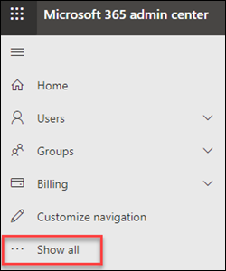

# Exchange Admin Center in eigenständigen EoP

Das Exchange Admin Center (EAC) ist eine webbasierte Verwaltungskonsole für eigenständige Exchange Online Schutz (EoP).

Suchen Sie die Exchange Online-Version dieses Themas? Weitere Informationen finden Sie unter [Exchange admin center in Exchange Online](https://docs.microsoft.com/exchange/exchange-admin-center).

## Öffnen der Exchange-Verwaltungskonsole in EoP

Eigenständige EoP-Kunden können mithilfe der folgenden Methoden auf die Exchange-Verwaltungskonsole zugreifen:

- **Aus dem Microsoft 365 Admin Center**:

  1. Wechseln Sie zu, <https://admin.microsoft.com> und klicken Sie auf **Alle anzeigen**.

     

  2. Klicken Sie im angezeigten Abschnitt **Admin Centers** auf **alle Admin Center**.

     

  3. Klicken Sie auf der Seite **alle Admin Center** , die angezeigt wird, auf **Exchange Online Schutz**.

- Wechseln Sie direkt zu `https://admin.protection.outlook.com/ecp/` .

## Allgemeine Elemente der Benutzeroberfläche in der Exchange-Verwaltungskonsole in EoP

In diesem Abschnitt werden die Elemente der Benutzeroberfläche der Exchange-Verwaltungskonsole beschrieben.

### Featurebereich

Dies ist die erste Navigationsebene für die meisten Aufgaben, die Sie in der Exchange-Verwaltungskonsole ausführen. Der Featurebereich ist nach Funktionsbereichen organisiert.

- **Recipients**: Hier werden Gruppen und externe Kontakte angezeigt.

- **Berechtigungen**: Hier können Sie Administratorrollen verwalten.

- **Compliance-Verwaltung**: Hier finden Sie den Administrator-Rollengruppen Bericht und den Bericht admin-Überwachungsprotokoll.

- **Schutz**: Hier können Sie Antischadsoftware-Richtlinien, die standardmäßige Verbindungsfilter Richtlinie und DKIM verwalten.

  > [!NOTE]
  > Sie sollten Antischadsoftware-Richtlinien und die standardmäßige Verbindungsfilter Richtlinie im Security & Compliance Center verwalten. Weitere Informationen finden Sie unter [configure Anti-Malware Policies in EoP](configure-anti-malware-policies.md) und [Konfigurieren der Verbindungsfilterung in EoP](configure-the-connection-filter-policy.md).

- **Nachrichtenfluss**: Hier können Sie Nachrichtenfluss Regeln (auch bekannt als Transportregeln), akzeptierte Domänen und Connectors verwalten sowie den Weg zur Ausführung der Nachrichtenablaufverfolgung.

- **Hybrid**: Dies ist der Ort, an dem Sie den [Assistenten für die Hybrid Konfiguration](https://docs.microsoft.com/Exchange/hybrid-configuration-wizard)ausführen können und auf dem Sie das [Exchange Online-PowerShell-Modul](https://docs.microsoft.com/powershell/exchange/exchange-online/connect-to-exchange-online-powershell/mfa-connect-to-exchange-online-powershell)installieren können.

### Registerkarten

Die Registerkarten sind Ihre zweite Ebene der Navigation. Alle Featurebereiche enthalten verschiedene Registerkarten, die jeweils ein Feature repräsentieren.

### Symbolleiste

Für die meisten Registerkarten wird eine Symbolleiste angezeigt, nachdem Sie auf sie geklickt haben. Die Symbolleiste enthält Symbole, die jeweils eine bestimmte Aktion auslösen. Die folgende Tabelle beschreibt die Symbole und deren Aktionen.

||||
|---|---|---|
|**Symbol**|**Name**|**Action**|
||Hinzufügen, Neu|Über dieses Symbol können Sie ein neues Objekt erstellen. Bei einigen dieser Symbole gibt es einen dazugehörigen nach unten zeigenden Pfeil, auf den Sie klicken können, um weitere Objekte anzuzeigen, die Sie erstellen können.|
||Bearbeiten|Über dieses Symbol können Sie ein Objekt bearbeiten.|
||Delete|Über dieses Symbol können Sie ein Objekt löschen. Bei einigen Löschsymbolen gibt es einen nach unten zeigenden Pfeil, auf den Sie zum Einblenden weiterer Optionen klicken können.|
||Suche|Über dieses Symbol können Sie ein Suchfeld öffnen, in das Sie den Suchbegriff für ein zu suchendes Objekt eingeben können.|
||Aktualisieren|Über dieses Symbol können Sie die Listenansicht aktualisieren.|
||Weitere Optionen|Über dieses Symbol können Sie mehrere Aktionen anzeigen, die Sie auf die Objekte dieser Registerkarte anwenden können. Wenn Sie z. B. unter **Empfänger \> Benutzer** auf dieses Symbol klicken, wird die Option **Erweiterte Suche** angezeigt.  |
||Pfeil nach oben und Pfeil nach unten|Mithilfe dieser Symbole können Sie die Priorität eines Objekts nach oben oder unten verschieben.|
||Entfernen|Über dieses Symbol können Sie Objekte aus einer Liste entfernen.|
|

### Listenansicht

Wenn Sie auf eine Registerkarte klicken, sehen Sie in den meisten Fällen eine Listenansicht. In der Listenansicht der Exchange-Verwaltungskonsole können ungefähr 10.000 Objekte angezeigt werden. Darüber hinaus können Sie die Ergebnisse seitenweise anzeigen.

### Bereich "Details"

Wenn Sie in der Listenansicht ein Objekt auswählen, werden Informationen zu diesem Objekt im Detailbereich angezeigt. In einigen Fällen enthält der Detailbereich Verwaltungsaufgaben.

### Ich-Kachel und Hilfe

Über die **Ich**-Kachel können Sie sich bei der Exchange-Verwaltungskonsole abmelden und als ein anderer Benutzer anmelden. Über das Dropdownmenü der **Hilfe** können Sie folgende Aktionen ausführen:

- **Hilfe**: Klicken Sie auf  , um den Inhalt der Online Hilfe anzuzeigen.

- **Feedback**: hinterlassen Sie Feedback.

- **Community**: Stellen Sie eine Frage für Find Answers in den Community-Foren bereit.

- **Hilfe Blase deaktivieren**: in der Hilfe-Sprechblase wird Kontexthilfe für Felder angezeigt, wenn Sie ein Objekt erstellen oder bearbeiten. Sie können die Hilfe Blase deaktivieren oder aktivieren, wenn Sie deaktiviert wurde.

- **Befehlsprotokollierung anzeigen**: Es wird ein neues Fenster geöffnet, in dem die entsprechenden PowerShell-Befehle basierend auf den in der Exchange-Verwaltungskonsole konfigurierten angezeigt werden.

## Unterstützte Browser

Für eine optimale Nutzung des EAC sollten Sie immer die neuesten Browser, Office-Clients und Apps verwenden. Zudem wird empfohlen, dass Sie Softwareupdates installieren, sobald sie verfügbar werden. Weitere Informationen zu den unterstützten Browsern und Systemanforderungen für den Dienst finden Sie unter [System Requirements for Office](https://products.office.com/office-system-requirements).

## Unterstützte Sprachen

Die folgenden Sprachen werden für die Exchange-Verwaltungskonsole in eigenständigen EoP unterstützt und zur Verfügung gestellt.

- Amharisch

- Arabisch

- Baskisch (Baskisch)

- Bengali (Indien)

- Bulgarisch

- Katalanisch

- Chinesisch (vereinfacht)

- Chinesisch (traditionell)

- Kroatisch

- Tschechisch

- Dänisch

- Niederländisch

- Niederländisch

- Englisch

- Estnisch

- Filipino (Philippinen)

- Finnisch

- Französisch

- Galizisch

- Deutsch

- Griechisch

- Gujarati

- Hebräisch

- Hindi

- Ungarisch

- Isländisch

- Indonesisch

- Italienisch

- Japanisch

- Kannada

- Kasachisch

- Kisuaheli

- Koreanisch

- Lettisch

- Litauisch

- Malaiisch (Brunei Darussalam)

- Malaiisch (Malaysia)

- Malayalam

- Marathi

- Norwegisch (Bokmål)

- Norwegisch (Nynorsk)

- Odia

- Persisch

- Polnisch

- Portugiesisch (Brasilien)

- Portugiesisch (Portugal)

- Rumänisch

- Russisch

- Serbisch (Kyrillisch, Serbien)

- Serbisch (Lateinisch)

- Slowakisch

- Slowenisch

- Spanisch

- Schwedisch

- Tamil

- Telugu

- Thailändisch

- Türkisch

- Ukrainisch

- Urdu

- Vietnamesisch

- Walisisch
