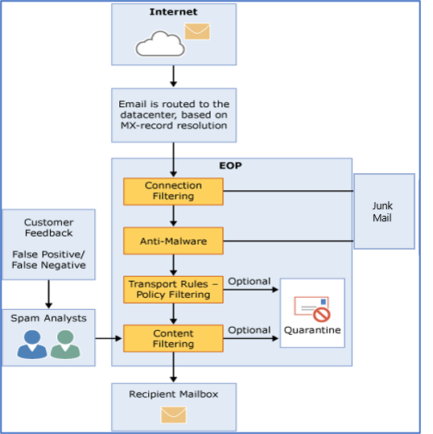

# Exchange Online Protection im Überblick

Microsoft Exchange Online Protection (EOP) ist ein cloudbasierter Dienst zum Filtern von E-Mails, mit dem Sie Ihre Organisation vor Spam und Schadsoftware schützen können. EOP kann die Verwaltung Ihrer Messagingumgebung und viele der beschwerlichen Aufgaben bei der Verwaltung lokaler Hardware und Software vereinfachen.

In der folgenden Liste wird beschrieben, wie Sie EoP für den Messagingschutz verwenden können:

- **In einem eigenständigen Szenario**: EoP bietet Cloud-basierten e-Mail-Schutz für Ihre lokale Exchange-Organisation oder eine andere lokale SMTP-e-Mail-Lösung.

- Im **Rahmen Exchange Online**: EoP ist der integrierte Schutz für in der Cloud gehostete Postfächer in Exchange Online und Office 365. Informationen zum Konfigurieren dieser Exchange Online Funktionen finden Sie unter [Protect Against Threats](protect-against-threats.md) for help.

- **In einer hybridbereitstellung**: EoP kann konfiguriert werden, um Ihre Messaging-Umgebung zu schützen und das e-Mail-Routing zu steuern, wenn Sie eine Mischung aus lokalen und Cloud-Postfächern haben.

> [!NOTE]
> Diese Exchange Online Schutz Artikel gelten für hybride und lokale Umgebungen.

## Funktionsweise von EOP

Die Funktionsweise von EOP lässt sich am besten an der Verarbeitung eingehender E-Mails veranschaulichen:

Eine eingehende Nachricht übergibt zunächst die Verbindungsfilterung, die die Reputation des Absenders überprüft und die Nachricht auf Schadsoftware überprüft. Die Mehrzahl der Spam-Mails wird an dieser Position angehalten und von EoP gelöscht. Nachrichten werden durch die Richtlinienfilterung fortgesetzt, wobei Nachrichten anhand von benutzerdefinierten Nachrichtenfluss Regeln (auch bekannt als Transportregeln) ausgewertet werden, die Sie aus einer Vorlage erstellen oder erzwingen. Beispielsweise können Sie eine Regel haben, die eine Benachrichtigung an einen Vorgesetzten sendet, wenn e-Mails von einem bestimmten Absender eintreffen. (Verhinderung von Datenverlust-Überprüfungen treten auch zu diesem Zeitpunkt auf, wenn Sie dieses Feature haben; Informationen zur Verfügbarkeit von Features finden Sie in der [Beschreibung des Exchange Online Protection-Diensts](https://docs.microsoft.com/office365/servicedescriptions/exchange-online-protection-service-description/exchange-online-protection-service-description)). Anschließend passieren Nachrichten die Inhaltsfilterung, wobei der Inhalt auf die Terminologie oder die Eigenschaften überprüft wird, die für Spam häufig verwendet werden. Eine Nachricht, die vom Inhaltsfilter als Spam eingestuft wurde, kann basierend auf Ihren Einstellungen an den Junk-e-Mail-Ordner eines Benutzers oder an die Quarantäne gesendet werden, neben anderen Optionen (einschließlich Posteingang oder benutzerdefinierter Ordner). Nachdem eine Nachricht alle diese Schutzschichten erfolgreich übergeben hat, wird Sie an den Empfänger übermittelt.

### EOP-Datencenter

EOP wird in einem weltweiten Rechenzentrennetzwerk ausgeführt, das für eine optimale Verfügbarkeit entworfen wurde. Wenn ein Rechenzentrum ausfällt, werden E-Mails ohne jegliche Dienstunterbrechung automatisch an ein anderes Rechenzentrum weitergeleitet. Die Server in den einzelnen Rechenzentren akzeptieren Nachrichten in Ihrem Namen und trennen Ihre Organisation dadurch vom Internet. So wird die Last Ihrer Server gesenkt. Mit diesem hochverfügbaren Netzwerk kann Microsoft sicherstellen, dass E-Mails rasch an Ihre Organisation übermittelt werden.

EOP führt einen Lastenausgleich zwischen Rechenzentren aus, jedoch nur innerhalb einer Region. Wenn Sie über eine Bereitstellung in einer bestimmten Region verfügen, werden alle Nachrichten mit dem E-Mail-Routing für diese Region verarbeitet. Die folgende Liste zeigt, wie regionales E-Mail-Routing für die EOP-Datencenter funktioniert:

- In Europa, dem Nahen Osten und Afrika (EMEA) befinden sich alle Exchange Online-Postfächer in EMEA-Rechenzentren, und alle Nachrichten werden zur EOP-Filterung über EMEA-Rechenzentren geleitet.

- Im asiatisch-pazifischen Raum (APAC) befinden sich alle Exchange Online Postfächer in APAC-Rechenzentren, und Nachrichten werden derzeit über APAC-Rechenzentren für die EoP-Filterung weitergeleitet.

- In Nord-und Südamerika befinden sich alle Exchange Online Postfächer in US-Rechenzentren, mit Ausnahme von Südamerika, in dem Rechenzentren in Brasilien und Chile verwendet werden, und in Kanada, in dem Rechenzentren in Kanada verwendet werden. Alle e-Mail-Nachrichten, einschließlich Nachrichten für Kunden in Südamerika und Kanada, werden über lokale Rechenzentren für die EoP-Filterung weitergeleitet. in Quarantäne befindliche e-Mails werden im Rechenzentrum gespeichert, in dem sich der Mandant befindet.

- Alle Exchange Online-Postfächer für die Government Community Cloud (GCC) befinden sich in US-Rechenzentren, und alle Nachrichten werden zur EOP-Filterung über US-Rechenzentren geleitet.

## EOP-Dienste und -Funktionen

Die verfügbaren EoP-Abonnement Pläne lauten wie folgt:

- **EoP Standalone**: Sie registrieren sich in EoP, um Ihre lokale e-Mail-Organisation zu schützen.

- **EoP-Features in Exchange Online**: jedes Abonnement, das Exchange Online enthält (eigenständig oder als Teil Office 365), verwendet EoP zum Schutz Ihrer Exchange Online Postfächer.

- **Exchange Enterprise CAL mit Diensten**: Wenn Sie über eine lokale Exchange-Organisation verfügen, in der Sie zusätzliche Lizenzen für Exchange Enterprise CAL mit Diensten erworben haben, ist EoP Teil der enthaltenen Dienste.

Informationen zu Anforderungen, wichtigen Grenzwerten und Verfügbarkeit von Funktionen in allen EoP-Abonnement Plänen finden Sie in der [Beschreibung des Exchange Online Protection-Diensts](https://docs.microsoft.com/office365/servicedescriptions/exchange-online-protection-service-description/exchange-online-protection-service-description).

## Einrichten von EOP

EOP-Bereitstellungen können einfach sein. Dies gilt insbesondere für kleine Organisationen mit einer Handvoll Regeln für die Richtlinientreue. Verfügen Sie jedoch über eine große Organisation mit mehreren Domänen, benutzerdefinierten Richtlinienregeln oder Hybridnachrichtenübermittlung, kann die Einrichtung einen höheren Planungs- und Zeitaufwand erfordern.

Sollten Sie bereits EOP erworben haben, können Sie mit den Hinweisen unter [Einrichten Ihres EOP-Diensts](set-up-your-eop-service.md) sicherstellen, dass Sie alle für die Konfiguration von EOP zum Schutz Ihrer Nachrichtenumgebung erforderlichen Schritte ausgeführt haben.

## Weitere Informationen

[EOP-Features](eop-features.md)

[EOP – Allgemeine häufig gestellte Fragen](eop-general-faq.md)

[Häufig gestellte Fragen zu durch EOP in Warteschlangen eingereihten, verzögerten oder nicht zugestellten Nachrichten](eop-queued-deferred-and-bounced-messages-faq.md)

[Häufig gestellte Fragen zur delegierten Verwaltung](delegated-administration-faq.md)

[Verschieben von Domänen und Einstellungen zwischen EOP-Organisationen](move-domains-and-settings-from-one-eop-organization-to-another-eop-organization.md)
