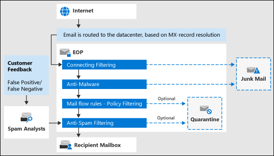

# Exchange Online Protection im ÜberblickExchange Online Protection overview

Exchange Online Protection (EoP) ist ein Cloud-basierter Filterdienst, der Ihre Organisation vor Spam und Schadsoftware schützen kann.Exchange Online Protection (EOP) is the cloud-based filtering service that helps protect your organization against spam and malware. EoP ist in allen Microsoft 365-Organisationen mit Exchange Online-Postfächern enthalten.EOP is included in all Microsoft 365 organizations with Exchange Online mailboxes.

EoP ist jedoch auch in den folgenden lokalen Szenarien verfügbar:But, EOP is also available in the following on-premises scenarios:

- **In einem eigenständigen Szenario**: EoP bietet Cloud-basierten e-Mail-Schutz für Ihre lokale Exchange-Organisation oder eine andere lokale SMTP-e-Mail-Lösung.**In a standalone scenario**: EOP provides cloud-based email protection for your on-premises Exchange organization or for any other on-premises SMTP email solution.

- **In einer hybridbereitstellung**: EoP kann konfiguriert werden, um Ihre e-Mail-Umgebung zu schützen und das e-Mail-Routing zu steuern, wenn Sie eine Mischung aus lokalen und Cloud-Postfächern haben.**In a hybrid deployment**: EOP can be configured to protect your email environment and control mail routing when you have a mix of on-premises and cloud mailboxes.

In diesen Szenarien kann EoP die Verwaltung Ihrer e-Mail-Umgebung vereinfachen und viele der Belastungen verringern, die mit der Wartung lokaler Hardware und Software verbunden sind.In these scenarios, EOP can simplify the management of your email environment and alleviate many of the burdens that come with maintaining on-premises hardware and software.

Im weiteren Verlauf dieses Themas wird erläutert, wie EoP in eigenständigen und Hybriden Umgebungen funktioniert.The rest of this topic explains how EOP works in standalone and hybrid environments.

## Funktionsweise von EOPHow EOP works

Die Funktionsweise von EOP lässt sich am besten an der Verarbeitung eingehender E-Mails veranschaulichen:To understand how EOP works, it helps to see how it processes incoming email:

- Eine eingehende Nachricht übergibt zunächst die Verbindungsfilterung, die die Reputation des Absenders überprüft und die Nachricht auf Schadsoftware überprüft.An incoming message initially passes through connection filtering, which checks the sender's reputation and inspects the message for malware. Die Mehrzahl der Spam-Mails wird an dieser Position angehalten und von EoP gelöscht.The majority of spam is stopped at this point and deleted by EOP. Weitere Informationen finden Sie unter [Konfigurieren der Richtlinie für Verbindungsfilter](configure-the-connection-filter-policy.md).For more information, see [Configure connection filtering](configure-the-connection-filter-policy.md).

- Nachrichten werden durch die Richtlinienfilterung fortgesetzt, wobei Nachrichten anhand von benutzerdefinierten Nachrichtenfluss Regeln (auch bekannt als Transportregeln) ausgewertet werden, die Sie aus einer Vorlage erstellen oder erzwingen.Messages continue through policy filtering, where messages are evaluated against custom mail flow rules (also known as transport rules) that you create or enforce from a template. Beispielsweise können Sie eine Regel haben, die eine Benachrichtigung an einen Vorgesetzten sendet, wenn e-Mails von einem bestimmten Absender eintreffen.For example, you can have a rule that sends a notification to a manager when mail arrives from a specific sender. An dieser Position (Exchange Enterprise CAL with Services) treten auch DLP-Prüfungen (Data Loss Prevention, Verhinderung von Datenverlust) auf.Data loss prevention (DLP) checks also occur at this point (Exchange Enterprise CAL with Services).

- Als nächstes passieren Nachrichten die Anti-Spam-Filterung (auch bekannt als Inhaltsfilterung).Next, messages pass through anti-spam filtering (also known as content filtering). Eine Nachricht, die als Spam festgelegt wurde, kann unter anderem an den Junk-e-Mail-Ordner eines Benutzers oder an die Quarantäne gesendet werden.A message that's determined to be spam can be sent to a user's Junk Email folder or to the quarantine, among other options. Weitere Informationen finden Sie unter [Konfigurieren von Anti-Spam-Richtlinien](configure-your-spam-filter-policies.md).For more information, see [Configure anti-spam policies](configure-your-spam-filter-policies.md).

- Nachdem eine Nachricht alle diese Schutzschichten erfolgreich übergeben hat, wird Sie an den Empfänger übermittelt.After a message passes all of these protection layers successfully, it's delivered to the recipient.

Weitere Informationen finden Sie unter [Reihenfolge und Rangfolge des e-Mail-Schutzes](how-policies-and-protections-are-combined.md).For more information, see [Order and precedence of email protection](how-policies-and-protections-are-combined.md).

### EOP-DatencenterEOP datacenters

EoP wird in einem weltweiten Netzwerk von Rechenzentren ausgeführt, die für die beste Verfügbarkeit vorgesehen sind.EOP runs on a worldwide network of datacenters that are designed to provide the best availability. Wenn beispielsweise ein Rechenzentrum nicht mehr verfügbar ist, werden e-Mail-Nachrichten ohne Unterbrechung des Diensts automatisch an ein anderes Rechenzentrum weitergeleitet.For example, if a datacenter becomes unavailable, email messages are automatically routed to another datacenter without any interruption in service. Server in jedem Datencenter akzeptieren Nachrichten in Ihrem Namen und bieten eine Schicht Trennung zwischen Ihrer Organisation und dem Internet, wodurch die Last auf Ihren Servern reduziert wird.Servers in each datacenter accept messages on your behalf, providing a layer of separation between your organization and the internet, thereby reducing load on your servers. Mithilfe dieses hoch verfügbaren Netzwerks kann Microsoft sicherstellen, dass e-Mails in Ihrer Organisation rechtzeitig erreicht werden.Through this highly available network, Microsoft can ensure that email reaches your organization in a timely manner.

EOP führt einen Lastenausgleich zwischen Rechenzentren aus, jedoch nur innerhalb einer Region. Wenn Sie über eine Bereitstellung in einer bestimmten Region verfügen, werden alle Nachrichten mit dem E-Mail-Routing für diese Region verarbeitet. Die folgende Liste zeigt, wie regionales E-Mail-Routing für die EOP-Datencenter funktioniert:EOP performs load balancing between datacenters but only within a region. If you're provisioned in one region all your messages will be processed using the mail routing for that region. The following list shows the how regional mail routing works for the EOP datacenters:

- In Europa, dem Nahen Osten und Afrika (EMEA) befinden sich alle Exchange Online-Postfächer in EMEA-Rechenzentren, und alle Nachrichten werden zur EOP-Filterung über EMEA-Rechenzentren geleitet.In Europe, the Middle East, and Africa (EMEA), all Exchange Online mailboxes are located in EMEA datacenters, and all messages are routed through EMEA datacenters for EOP filtering.

- Im asiatisch-pazifischen Raum (APAC) befinden sich alle Exchange Online Postfächer in APAC-Rechenzentren, und Nachrichten werden derzeit über APAC-Rechenzentren für die EoP-Filterung weitergeleitet.In Asia-Pacific (APAC), all Exchange Online mailboxes are located in APAC datacenters, and messages are currently routed through APAC datacenters for EOP filtering.

- In Nord-und Südamerika werden die Dienste an den folgenden Orten verteilt:In the Americas, services are distributed in the following locations:

  - Südamerika: Exchange Online Postfächer befinden sich in den Rechenzentren in Brasilien und Chile.South America: Exchange Online mailboxes are located in datacenters in Brazil and Chile. Alle Nachrichten werden über lokale Rechenzentren für die EoP-Filterung weitergeleitet.All messages are routed through local datacenters for EOP filtering. In Quarantäne befindliche Nachrichten werden im Rechenzentrum gespeichert, in dem sich der Mandant befindet.Quarantined messages are stored in the datacenter where the tenant is located.

  - Kanada: Exchange Online Postfächer befinden sich in Rechenzentren in Kanada.Canada: Exchange Online mailboxes are located in datacenters in Canada. Alle Nachrichten werden über lokale Rechenzentren für die EoP-Filterung weitergeleitet.All messages are routed through local datacenters for EOP filtering. In Quarantäne befindliche Nachrichten werden im Rechenzentrum gespeichert, in dem sich der Mandant befindet.Quarantined messages are stored in the datacenter where the tenant is located.

  - Vereinigte Staaten: Exchange Online Postfächer befinden sich in US-Rechenzentren.United States: Exchange Online mailboxes are located in U.S. datacenters. Alle Nachrichten werden über lokale Rechenzentren für die EoP-Filterung weitergeleitet.All messages are routed through local datacenters for EOP filtering. In Quarantäne befindliche Nachrichten werden im Rechenzentrum gespeichert, in dem sich der Mandant befindet.Quarantined messages are stored in the datacenter where the tenant is located.

- Alle Exchange Online-Postfächer für die Government Community Cloud (GCC) befinden sich in US-Rechenzentren, und alle Nachrichten werden zur EOP-Filterung über US-Rechenzentren geleitet.For the Government Community Cloud (GCC), all Exchange Online mailboxes are located in U.S. datacenters and all messages are routed through U.S. datacenters for EOP filtering.

## EoP-Pläne und-Features für lokale e-Mail-OrganisationenEOP plans and features for on-premises email organizations

Die verfügbaren EoP-Abonnement Pläne lauten wie folgt:The available EOP subscription plans are:

- **EoP Standalone**: Sie registrieren sich in EoP, um Ihre lokale e-Mail-Organisation zu schützen.**EOP standalone**: You enroll in EOP to protect your on-premises email organization.

- **EoP-Features in Exchange Online**: jedes Abonnement, das Exchange Online enthält (eigenständig oder als Teil von Microsoft 365), verwendet EoP, um Ihre Exchange Online Postfächer zu schützen.**EOP features in Exchange Online**: Any subscription that includes Exchange Online (standalone or as part of Microsoft 365) uses EOP to protect your Exchange Online mailboxes.

- **Exchange Enterprise CAL mit Diensten**: Wenn Sie über eine lokale Exchange-Organisation verfügen, in der Sie zusätzliche Lizenzen für Exchange Enterprise CAL mit Diensten erworben haben, ist EoP Teil der enthaltenen Dienste.**Exchange Enterprise CAL with Services**: If you have an on-premises Exchange organization where you've purchased additional Exchange Enterprise CAL with Services licenses, EOP is part of the included services.

Informationen zu Anforderungen, wichtigen Grenzwerten und Verfügbarkeit von Funktionen in allen EoP-Abonnement Plänen finden Sie in der [Beschreibung des Exchange Online Protection-Diensts](https://docs.microsoft.com/office365/servicedescriptions/exchange-online-protection-service-description/exchange-online-protection-service-description).For information about requirements, important limits, and feature availability across all EOP subscription plans, see the [Exchange Online Protection service description](https://docs.microsoft.com/office365/servicedescriptions/exchange-online-protection-service-description/exchange-online-protection-service-description).

## Einrichten von EoP für lokale e-Mail-OrganisationenSetting up EOP for on-premises email organizations

EOP-Bereitstellungen können einfach sein. Dies gilt insbesondere für kleine Organisationen mit einer Handvoll Regeln für die Richtlinientreue. Verfügen Sie jedoch über eine große Organisation mit mehreren Domänen, benutzerdefinierten Richtlinienregeln oder Hybridnachrichtenübermittlung, kann die Einrichtung einen höheren Planungs- und Zeitaufwand erfordern.Setting up EOP can be simple, especially in the case of a small organization with a handful of compliance rules. However, if you have a large organization with multiple domains, custom compliance rules, or hybrid mail flow, set up can take more planning and time.

Sollten Sie bereits EOP erworben haben, können Sie mit den Hinweisen unter [Einrichten Ihres EOP-Diensts](set-up-your-eop-service.md) sicherstellen, dass Sie alle für die Konfiguration von EOP zum Schutz Ihrer Nachrichtenumgebung erforderlichen Schritte ausgeführt haben.If you've already purchased EOP, see [Set up your EOP service](set-up-your-eop-service.md) to ensure that you complete all the steps necessary to configure EOP to protect your messaging environment.

## EoP-Hilfe für AdministratorenEOP Help for admins

Der Hilfeinhalt für EOP-Administratoren umfasst die folgenden übergeordneten Kategorien:The Help content for EOP administrators consists of the following top-level categories:

- [Übersicht über den Exchange Online Schutz](exchange-online-protection-overview.md): Einführung in die Funktionsweise von EoP und Links zu zusätzlichen Informationen.[Exchange Online Protection overview](exchange-online-protection-overview.md): Introduces how EOP works and provides links to additional information.

- [EoP-Features](eop-features.md): enthält eine Liste der in EoP verfügbaren Features.[EOP features](eop-features.md): Provides a list of features that are available in EOP.

- [Richten Sie Ihren EoP-Dienst ein](set-up-your-eop-service.md): Hier finden Sie eine schrittweise Anleitung zum Einrichten Ihres EoP-Diensts sowie Links zu weiteren Informationen.[Set up your EOP service](set-up-your-eop-service.md): Provides steps for setting up your EOP service, and links to additional information.

- [Wechseln Sie zu EoP von Google Postini, der Barracuda Spam and Virus Firewall oder Cisco IronPort](switch-to-eop-from-google-postini-the-barracuda-spam-and-virus-firewall-or-cisco.md): Beschreibt den Vorgang für das Wechseln zu EoP von einem anderen e-Mail-Schutz Produkt.[Switch to EOP from Google Postini, the Barracuda Spam and Virus Firewall, or Cisco IronPort](switch-to-eop-from-google-postini-the-barracuda-spam-and-virus-firewall-or-cisco.md): Describes the process for switching to EOP from another email protection product.

- [Verwalten von Empfängern in eigenständigen EoP](manage-recipients-in-eop.md): Beschreibt, wie e-Mail-Benutzer und-Gruppen in EoP verwaltet werden.[Manage recipients in standalone EOP](manage-recipients-in-eop.md): Describes how to manage mail users and groups in EOP.

- [Nachrichtenfluss in EoP](mail-flow-in-eop.md): Beschreibt, wie benutzerdefinierte Nachrichtenübermittlungsszenarien mithilfe von Connectors konfiguriert werden, wie Domänen im Zusammenhang mit dem Dienst verwaltet werden und wie Sie das Feature für die verzeichnisbasierte Edge-Blockierung (Blockierung) aktivieren.[Mail flow in EOP](mail-flow-in-eop.md): Describes how to configure custom mail flow scenarios using connectors, how to manage domains associated with the service, and how to enable the Directory Based Edge Blocking (DBEB) feature.

- [Bewährte Methoden für das Konfigurieren von EoP](best-practices-for-configuring-eop.md): Beschreibt Empfohlene Konfigurationseinstellungen und Überlegungen für nach dem Einrichten und der Dienstbereitstellung.[Best practices for configuring EOP](best-practices-for-configuring-eop.md): Describes recommended configuration settings and considerations for after you set up and provision your service.

- [Überwachungsberichte in eigenständigen EoP](auditing-reports-in-eop.md): Beschreibt die Verwendung von Überwachungsberichten zum Nachverfolgen von Konfigurationsänderungen am Dienst.[Auditing reports in standalone EOP](auditing-reports-in-eop.md): Describes how to use auditing reports to track configuration changes to the service.

- [Antispam-und Antischadsoftware-Schutz in EoP](anti-spam-and-anti-malware-protection.md): Beschreibung der Spamfilterung und der Malware Filterung und zeigt, wie diese angepasst werden, um die Anforderungen Ihrer Organisation optimal zu erfüllen.[Anti-spam and anti-malware protection in EOP](anti-spam-and-anti-malware-protection.md): Describes spam filtering and malware filtering and shows how to customize them to best meet the needs of your organization. Beschreibt außerdem Aufgaben, die Administratoren und Endbenutzer für isolierte Nachrichten ausführen können.Also describes tasks that administrators and end users can perform on quarantined messages.

- [Berichterstellung und Nachrichtenablaufverfolgung in Exchange Online Protection](reporting-and-message-trace-in-exchange-online-protection.md): Beschreibt die verfügbaren Berichte und Problembehandlungstools.[Reporting and message trace in Exchange Online Protection](reporting-and-message-trace-in-exchange-online-protection.md): Describes the reports and troubleshooting tools that are available.

- [Exchange Admin Center in eigenständiger EoP](exchange-admin-center-in-exchange-online-protection-eop.md): Beschreibt, wie auf die Verwaltungsschnittstelle der Exchange-Verwaltungskonsole zugegriffen und diese navigiert wird, um den EoP-Dienst zu verwalten.[Exchange admin center in standalone EOP](exchange-admin-center-in-exchange-online-protection-eop.md): Describes how to access and navigate through the Exchange admin center (EAC) management interface in order to manage your EOP service.

- [Exchange Online Protection PowerShell](https://docs.microsoft.com/powershell/exchange/exchange-online-protection-powershell): enthält Informationen zur Remote-PowerShell, mit der Sie Ihren EoP-Dienst über die Befehlszeile verwalten können.[Exchange Online Protection PowerShell](https://docs.microsoft.com/powershell/exchange/exchange-online-protection-powershell): Provides information about remote PowerShell, which lets you manage your EOP service from the command line.

- [Hilfe und Support für EOP](help-and-support-for-eop.md) Informationen zum Anfordern von Hilfe und technischem Support.[Help and support for EOP](help-and-support-for-eop.md) Provides information about obtaining help and technical support.
