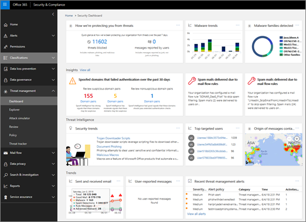

# Exemplarische Vorgehensweise – Vom Dashboard zum Einblick

Wenn Sie noch keine [Erfahrung mit Berichten und Einblicken im &amp; Office 365 Security Compliance Center](reports-and-insights-in-security-and-compliance.md)haben, kann es hilfreich sein, zu sehen, wie Sie einfach von einem Dashboard zu einer Einblicke und empfohlenen Aktionen navigieren können. 
  
Dies ist eine von mehreren exemplarischen Vorgehens &amp; weisen für das Security Compliance Center. Weitere Exemplarische Vorgehensweisen finden Sie im Abschnitt " [Verwandte Themen](#related-topics) ". 
  
## Exemplarische Vorgehensweise: von einem Dashboard zu einer Einblicke

Lassen Sie uns den Fluss vom Dashboard zu einem Bericht zu einem Einblick und einer Aktion durchgehen. (Dies ist ein kurzes [Spoof Intelligence](learn-about-spoof-intelligence.md) -Beispiel.) 
  
1. Wir beginnen mit dem Sicherheits Dashboard im [ &amp; Security Compliance Center](https://protection.office.com). (Wechseln Sie zu **Threat Management** \> **Dashboard**.)  
  
2. In der Zeile **Insights** wird eine Erkenntnis angezeigt, die besagt, dass einige Domänen überprüft werden müssen, die möglicherweise verdächtig sind. (Klicken Sie in der Zeile **Insights** auf **Domänen Paare**.)  
  
3. Wir erhalten eine Liste der Aktivitäten im Zusammenhang mit spoof Intelligence. Hierbei handelt es sich um Fälle, in denen e-Mail-Nachrichten gesendet wurden, die aussehen, als kämen Sie aus unserer Organisation, aber tatsächlich von einer anderen Organisation gesendet wurden. Das Ziel besteht darin zu ermitteln, ob die gefälschten Nachrichten autorisiert sind oder nicht.  In dieser Liste können wir die Informationen nach Nachrichtenanzahl, Datum, an dem die Spoofing zuletzt erkannt wurde, und vieles mehr sortieren. (Klicken Sie auf Spaltenüberschriften wie **Nachrichtenanzahl** oder **zuletzt gesehen** , um zu sehen, wie die Sortierung funktioniert.) 
    
4. Wenn Sie ein Element in der Liste auswählen, wird ein Detailbereich geöffnet, in dem zusätzliche Informationen angezeigt werden können, einschließlich ähnlicher e-Mail-Nachrichten, die erkannt wurden. (Klicken Sie auf ein Element in der Liste, und überprüfen Sie die Informationen und Empfehlungen.)  
  
5. Beachten Sie, dass oben im Bereich die Option zum Hinzufügen des Absenders zur Liste der zulässigen Absender der Organisation vorhanden ist. (Wählen Sie **Add to ' AllowedtoSpoof ' Sender Allow List** erst aus, wenn Sie sicher sind, dass Sie dies tun möchten. [Konfigurieren von Spoof Intelligence in Office 365](learn-about-spoof-intelligence.md).) 
  
Auf diese Weise können wir von einem Dashboard zu Insights und empfohlenen Aktionen übergehen.
  
## Verwandte Themen

[Exemplarische Vorgehensweise: von einem Einblick zu einem detaillierten Bericht](from-an-insight-to-a-detailed-report.md)
  
[Exemplarische Vorgehensweise: von einem detaillierten Bericht zur Einblicke](from-a-detailed-report-to-an-insight.md)
  

