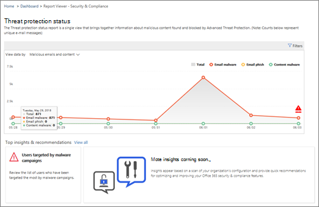

# Exemplarische Vorgehensweise – Vom detaillierten Bericht zum EinblickWalkthrough - From a detailed report to an insight

Wenn Sie noch keine [Erfahrung mit Berichten und Einblicken im &amp; Office 365 Security Compliance Center](reports-and-insights-in-security-and-compliance.md)haben, können Sie sehen, wie Sie problemlos von einem detaillierten Bericht zu einer Einblicke und empfohlenen Aktionen navigieren können.If you're new to [reports and insights in the Office 365 Security &amp; Compliance Center](reports-and-insights-in-security-and-compliance.md), it might help to see how you can easily navigate from a detailed report to an insight and recommended actions. 
  
Dies ist eine von mehreren exemplarischen Vorgehens &amp; weisen für das Security Compliance Center.This is one of several walkthroughs for the Security &amp; Compliance Center. Weitere Exemplarische Vorgehensweisen finden Sie im Abschnitt " [Verwandte Themen](#related-topics) ".To see additional walkthroughs, see the [Related topics](#related-topics) section. 
  
## Exemplarische Vorgehensweise: von einem detaillierten Bericht zur EinblickeWalkthrough: From a detailed report to an insight

Lassen Sie uns den Fluss von einem detaillierten Bericht zu einer Einblicke und Aktionen durchgehen.Let's walk through the flow from a detailed report to an insight and actions. (Dies ist ein kurzes [Anti-Spam-und Anti-Malware-](anti-spam-and-anti-malware-protection.md) Beispiel.)(This is a brief [anti-spam and anti-malware](anti-spam-and-anti-malware-protection.md) example.) 
  
1. Wir beginnen mit [Security &amp; Compliance Center](https://protection.office.com) -Berichten.We begin with [Security &amp; Compliance Center](https://protection.office.com) reports. (Wechseln Sie zum **Dashboard** **Berichte** \> .)(Go to **Reports** \> **Dashboard**.)  
  
2. Wir wählen einen Bericht aus, um eine detailliertere Ansicht zu erhalten.We choose a report to get a more detailed view. (Wählen Sie einen Bericht aus, beispielsweise den Status Bericht über den **Bedrohungsschutz** .)(Choose a report, such as the **Threat Protection Status** report.) 
  
3. Es wird ein Insights-Indikator im Diagramm sowie unter dem Bericht angezeigt.We notice an insights indicator in the chart as well as below the report. Das Positionieren des Mauszeigers auf der Einblicke-Markierung gibt einige zusätzliche Details.Positioning the mouse pointer on the insights marker gives some additional details. (Bewegen Sie den Mauszeiger über den Insights-Marker, um weitere Details anzuzeigen.)(Hover over the insights marker to see additional details.)
    
4. Wenn Sie auf die Einblicke-Markierung im Diagramm oder das Einblicke-widget über Schadsoftware unter dem Diagramm klicken, wird ein Detailbereich geöffnet.Clicking either the insights marker in the chart or the insights widget about malware below the chart opens a details pane. (Wählen Sie unter dem Diagramm das Widget Einblicke aus.)(Below the chart, select the insights widget.)  Der Detailbereich enthält Informationen und Empfehlungen, die Sie prüfen sollten, einschließlich der Überprüfung von Richtlinien, der Durchführung weiterer Untersuchungen und des Bearbeitungsstatus.The details pane provides information and recommendations to consider, including reviewing policies, conducting further exploration, and editing status. ([Weitere Informationen zu Antispam-und Antischadsoftware-Schutz in Office 365](anti-spam-and-anti-malware-protection.md).)([Learn more about anti-spam and anti-malware protection in Office 365](anti-spam-and-anti-malware-protection.md).)
    
Auf diese Weise können wir von einem detaillierten Bericht zu einer Einblicke und empfohlenen Aktionen übergehen.In this way, we can move from a detailed report to an insight and recommended actions. 
  
## Verwandte ThemenRelated topics

[Exemplarische Vorgehensweise: von einem Einblick zu einem detaillierten BerichtWalkthrough: From an insight to a detailed report](from-an-insight-to-a-detailed-report.md)
  
[Exemplarische Vorgehensweise: von einem Dashboard zu einer EinblickeWalkthrough: From a dashboard to an insight](from-a-dashboard-to-an-insight.md)
  

