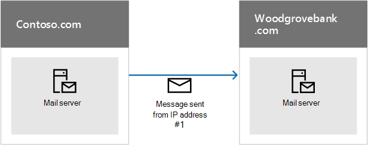
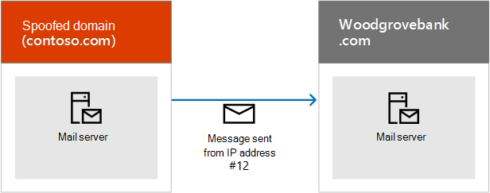

# <a name="how-microsoft-365-uses-sender-policy-framework-spf-to-prevent-spoofing"></a><span data-ttu-id="f9d47-103">Verwenden des Sender Policy Framework (SPF) durch Microsoft 365 zum Verhindern von Spoofing</span><span class="sxs-lookup"><span data-stu-id="f9d47-103">How Microsoft 365 uses Sender Policy Framework (SPF) to prevent spoofing</span></span>

[!INCLUDE [Microsoft 365 Defender rebranding](../includes/microsoft-defender-for-office.md)]

<span data-ttu-id="f9d47-104">**Gilt für**</span><span class="sxs-lookup"><span data-stu-id="f9d47-104">**Applies to**</span></span>
- [<span data-ttu-id="f9d47-105">Exchange Online Protection</span><span class="sxs-lookup"><span data-stu-id="f9d47-105">Exchange Online Protection</span></span>](exchange-online-protection-overview.md)
- [<span data-ttu-id="f9d47-106">Microsoft Defender für Office 365 Plan 1 und Plan 2</span><span class="sxs-lookup"><span data-stu-id="f9d47-106">Microsoft Defender for Office 365 plan 1 and plan 2</span></span>](office-365-atp.md)
- [<span data-ttu-id="f9d47-107">Microsoft 365 Defender</span><span class="sxs-lookup"><span data-stu-id="f9d47-107">Microsoft 365 Defender</span></span>](../mtp/microsoft-threat-protection.md)

 <span data-ttu-id="f9d47-108">**Zusammenfassung:** In diesem Artikel wird beschrieben, wie Microsoft 365 den SPF (Sender Policy Framework)-TXT-Eintrag in DNS verwendet, um sicherzustellen, dass Ziel-E-Mail-Systeme Nachrichten vertrauen, die von Ihrer benutzerdefinierten Domäne gesendet werden.</span><span class="sxs-lookup"><span data-stu-id="f9d47-108">**Summary:** This article describes how Microsoft 365 uses the Sender Policy Framework (SPF) TXT record in DNS to ensure that destination email systems trust messages sent from your custom domain.</span></span> <span data-ttu-id="f9d47-109">Dies gilt für ausgehende E-Mails, die von Microsoft 365 gesendet werden.</span><span class="sxs-lookup"><span data-stu-id="f9d47-109">This applies to outbound mail sent from Microsoft 365.</span></span> <span data-ttu-id="f9d47-110">Nachrichten, die von Microsoft 365 an einen Empfänger innerhalb von Microsoft 365 gesendet werden, übergeben immer SPF.</span><span class="sxs-lookup"><span data-stu-id="f9d47-110">Messages sent from Microsoft 365 to a recipient within Microsoft 365 will always pass SPF.</span></span>

<span data-ttu-id="f9d47-p102">Ein SPF TXT-Eintrag ist ein DNS-Eintrag, der Ihnen hilft, Spoofing und Phishing zu verhindern, indem der Name der Domäne überprüft wird, von der aus E-Mail-Nachrichten gesendet werden. SPF überprüft den Ursprung von E-Mails, indem die IP-Adresse des Absenders mit dem vorgeblichen Besitzer der Absenderdomäne verglichen wird.</span><span class="sxs-lookup"><span data-stu-id="f9d47-p102">An SPF TXT record is a DNS record that helps prevent spoofing and phishing by verifying the domain name from which email messages are sent. SPF validates the origin of email messages by verifying the IP address of the sender against the alleged owner of the sending domain.</span></span>

> [!NOTE]
> <span data-ttu-id="f9d47-p103">SPF-Eintragstypen wurden von der Internet Engineering Task Force (IETF) 2014 als veraltet eingestuft. Stellen Sie stattdessen sicher, dass Sie zum Veröffentlichen von SPF-Informationen TXT-Einträge in DNS verwenden. Der Rest dieses Artikels verwendet aus Gründen der Klarheit den Begriff SPF TXT-Eintrag.</span><span class="sxs-lookup"><span data-stu-id="f9d47-p103">SPF record types were deprecated by the Internet Engineering Task Force (IETF) in 2014. Instead, ensure that you use TXT records in DNS to publish your SPF information. The rest of this article uses the term SPF TXT record for clarity.</span></span>

<span data-ttu-id="f9d47-116">Domänenadministratoren veröffentlichen SPF-Informationen in TXT-Einträgen in DNS.</span><span class="sxs-lookup"><span data-stu-id="f9d47-116">Domain administrators publish SPF information in TXT records in DNS.</span></span> <span data-ttu-id="f9d47-117">Durch die SPF-Informationen werden autorisierte Server für ausgehende E-Mails identifiziert.</span><span class="sxs-lookup"><span data-stu-id="f9d47-117">The SPF information identifies authorized outbound email servers.</span></span> <span data-ttu-id="f9d47-118">Von Ziel-E-Mail-Systemen wird überprüft, ob die Nachrichten von autorisierten Servern für ausgehende E-Mails stammen.</span><span class="sxs-lookup"><span data-stu-id="f9d47-118">Destination email systems verify that messages originate from authorized outbound email servers.</span></span> <span data-ttu-id="f9d47-119">Wenn Sie bereits mit SPF vertraut sind oder eine einfache Bereitstellung haben und nur wissen müssen, was in Ihren SPF -TXT-Eintrag in DNS für Microsoft 365 enthalten sein muss, können Sie zu "Einrichten von [SPF in Microsoft 365"](set-up-spf-in-office-365-to-help-prevent-spoofing.md)wechseln, um Spoofing zu verhindern.</span><span class="sxs-lookup"><span data-stu-id="f9d47-119">If you are already familiar with SPF, or you have a simple deployment, and just need to know what to include in your SPF TXT record in DNS for Microsoft 365, you can go to [Set up SPF in Microsoft 365 to help prevent spoofing](set-up-spf-in-office-365-to-help-prevent-spoofing.md).</span></span> <span data-ttu-id="f9d47-120">Wenn Sie nicht über eine vollständig in Microsoft 365 gehostete Bereitstellung verfügen oder weitere Informationen zur Funktionsweise von SPF oder zur Problembehandlung von SPF für Microsoft 365 wünschen, lesen Sie weiter.</span><span class="sxs-lookup"><span data-stu-id="f9d47-120">If you do not have a deployment that is fully-hosted in Microsoft 365, or you want more information about how SPF works or how to troubleshoot SPF for Microsoft 365, keep reading.</span></span>

> [!NOTE]
> <span data-ttu-id="f9d47-121">Zuvor mussten Sie Ihrer benutzerdefinierten Domäne einen anderen SPF -TXT-Eintrag hinzufügen, wenn Sie auch SharePoint Online verwendet haben.</span><span class="sxs-lookup"><span data-stu-id="f9d47-121">Previously, you had to add a different SPF TXT record to your custom domain if you also used SharePoint Online.</span></span> <span data-ttu-id="f9d47-122">Dies ist nicht mehr erforderlich.</span><span class="sxs-lookup"><span data-stu-id="f9d47-122">This is no longer required.</span></span> <span data-ttu-id="f9d47-123">Diese Änderung sollte das Risiko reduzieren, dass SharePoint Online-Benachrichtigungsnachrichten im Junk-E-Mail-Ordner landen.</span><span class="sxs-lookup"><span data-stu-id="f9d47-123">This change should reduce the risk of SharePoint Online notification messages ending up in the Junk Email folder.</span></span> <span data-ttu-id="f9d47-124">Sie müssen keine Änderungen sofort vornehmen, aber wenn Sie den Fehler "Zu viele Nachschlagefehler" erhalten, ändern Sie Ihren SPF TXT-Eintrag, wie unter Set [up SPF in Microsoft 365](set-up-spf-in-office-365-to-help-prevent-spoofing.md)beschrieben, um Spoofing zu verhindern.</span><span class="sxs-lookup"><span data-stu-id="f9d47-124">You do not need to make any changes immediately, but if you receive the "too many lookups" error, modify your SPF TXT record as described in [Set up SPF in Microsoft 365 to help prevent spoofing](set-up-spf-in-office-365-to-help-prevent-spoofing.md).</span></span>

## <a name="how-spf-works-to-prevent-spoofing-and-phishing-in-microsoft-365"></a><span data-ttu-id="f9d47-125">Funktionsweise von SPF zur Verhinderung von Spoofing und Phishing in Microsoft 365</span><span class="sxs-lookup"><span data-stu-id="f9d47-125">How SPF works to prevent spoofing and phishing in Microsoft 365</span></span>
<span data-ttu-id="f9d47-126"><a name="HowSPFWorks"> </a></span><span class="sxs-lookup"><span data-stu-id="f9d47-126"><a name="HowSPFWorks"> </a></span></span>

<span data-ttu-id="f9d47-p106">SPF ermittelt, ob ein Absender im Auftrag einer Domäne senden darf. Wenn der Absender dazu nicht berechtigt ist, wenn die E-Mail also die SPF-Prüfung auf dem empfangenden Server nicht besteht, ermittelt die Spamrichtlinie, die auf diesem Server konfiguriert ist, was mit der Nachricht geschieht.</span><span class="sxs-lookup"><span data-stu-id="f9d47-p106">SPF determines whether or not a sender is permitted to send on behalf of a domain. If the sender is not permitted to do so, that is, if the email fails the SPF check on the receiving server, the spam policy configured on that server determines what to do with the message.</span></span>

<span data-ttu-id="f9d47-129">Jeder SPF -TXT-Eintrag enthält drei Teile: die Deklaration, dass es sich um einen SPF TXT-Eintrag handelt, die IP-Adressen, die E-Mails von Ihrer Domäne senden dürfen, und die externen Domänen, die im Auftrag Ihrer Domäne senden können, und eine Erzwingungsregel.</span><span class="sxs-lookup"><span data-stu-id="f9d47-129">Each SPF TXT record contains three parts: the declaration that it is an SPF TXT record, the IP addresses that are allowed to send mail from your domain and the external domains that can send on your domain's behalf, and an enforcement rule.</span></span> <span data-ttu-id="f9d47-130">Sie benötigen alle drei in einem gültigen SPF TXT-Eintrag.</span><span class="sxs-lookup"><span data-stu-id="f9d47-130">You need all three in a valid SPF TXT record.</span></span> <span data-ttu-id="f9d47-131">In diesem Artikel wird beschrieben, wie Sie Ihren SPF -TXT-Eintrag erstellen, und es werden bewährte Methoden für die Arbeit mit den Diensten in Microsoft 365 beschrieben.</span><span class="sxs-lookup"><span data-stu-id="f9d47-131">This article describes how you form your SPF TXT record and provides best practices for working with the services in Microsoft 365.</span></span> <span data-ttu-id="f9d47-132">Links zu Anweisungen zum Arbeiten mit Ihrer Domänenregistrierungsstelle zum Veröffentlichen Ihres Eintrags in DNS werden ebenfalls bereitgestellt.</span><span class="sxs-lookup"><span data-stu-id="f9d47-132">Links to instructions on working with your domain registrar to publish your record to DNS are also provided.</span></span>

### <a name="spf-basics-ip-addresses-allowed-to-send-from-your-custom-domain"></a><span data-ttu-id="f9d47-133">SPF-Grundlagen: IP-Adressen, die von Ihrer benutzerdefinierten Domäne aus senden dürfen</span><span class="sxs-lookup"><span data-stu-id="f9d47-133">SPF basics: IP addresses allowed to send from your custom domain</span></span>
<span data-ttu-id="f9d47-134"><a name="SPFBasicsIPaddresses"> </a></span><span class="sxs-lookup"><span data-stu-id="f9d47-134"><a name="SPFBasicsIPaddresses"> </a></span></span>

<span data-ttu-id="f9d47-135">Sehen Sie sich die allgemeine Syntax für eine SPF-Regel an:</span><span class="sxs-lookup"><span data-stu-id="f9d47-135">Take a look at the basic syntax for an SPF rule:</span></span>

<span data-ttu-id="f9d47-136">v=spf1 \<IP\>\<enforcement rule\></span><span class="sxs-lookup"><span data-stu-id="f9d47-136">v=spf1 \<IP\> \<enforcement rule\></span></span>

<span data-ttu-id="f9d47-137">Nehmen wir z. B. an, dass die folgende SPF-Regel für „contoso.com“ vorhanden ist:</span><span class="sxs-lookup"><span data-stu-id="f9d47-137">For example, let's say the following SPF rule exists for contoso.com:</span></span>

<span data-ttu-id="f9d47-138">v=spf1 \<IP address #1\> \<IP address #2\> \<IP address #3\>\<enforcement rule\></span><span class="sxs-lookup"><span data-stu-id="f9d47-138">v=spf1 \<IP address #1\> \<IP address #2\> \<IP address #3\> \<enforcement rule\></span></span>

<span data-ttu-id="f9d47-139">In diesem Beispiel weist die SPF-Regel den empfangenden E-Mail-Server an, nur E-Mail-Nachrichten von diesen IP-Adressen für die Domäne „contoso.com“ zu akzeptieren:</span><span class="sxs-lookup"><span data-stu-id="f9d47-139">In this example, the SPF rule instructs the receiving email server to only accept mail from these IP addresses for the domain contoso.com:</span></span>

- <span data-ttu-id="f9d47-140">IP-Adresse #1</span><span class="sxs-lookup"><span data-stu-id="f9d47-140">IP address #1</span></span>

- <span data-ttu-id="f9d47-141">IP-Adresse #2</span><span class="sxs-lookup"><span data-stu-id="f9d47-141">IP address #2</span></span>

- <span data-ttu-id="f9d47-142">IP-Adresse #3</span><span class="sxs-lookup"><span data-stu-id="f9d47-142">IP address #3</span></span>

<span data-ttu-id="f9d47-p108">Diese SPF-Regel weist den empfangenden E-Mail-Server an, dass er, wenn eine Nachricht von „contoso.com", aber nicht von einer dieser drei IP-Adressen kommt, die Durchsetzungsregel auf die Nachricht anwenden soll. Die Durchsetzungsregel bietet normalerweise eine der folgenden Optionen:</span><span class="sxs-lookup"><span data-stu-id="f9d47-p108">This SPF rule tells the receiving email server that if a message comes from contoso.com, but not from one of these three IP addresses, the receiving server should apply the enforcement rule to the message. The enforcement rule is usually one of these options:</span></span>

- <span data-ttu-id="f9d47-p109">**Hard fail** (schwerer Fehler). Markieren Sie die Nachricht mit „Hard fail" im Nachrichtenumschlag, und folgen Sie dann der konfigurierten Spamrichtlinie des empfangenden Server für diese Art von Nachricht.</span><span class="sxs-lookup"><span data-stu-id="f9d47-p109">**Hard fail.** Mark the message with 'hard fail' in the message envelope and then follow the receiving server's configured spam policy for this type of message.</span></span>

- <span data-ttu-id="f9d47-p110">**Soft fail** (nicht schwerwiegender Fehler). Markieren Sie die Nachricht mit „Soft fail" im Nachrichtenumschlag. E-Mail-Server sind in der Regel so konfiguriert, dass diese Nachrichten trotzdem übermittelt werden. Die meisten Endbenutzer sehen diese Markierung nicht.</span><span class="sxs-lookup"><span data-stu-id="f9d47-p110">**Soft fail.** Mark the message with 'soft fail' in the message envelope. Typically, email servers are configured to deliver these messages anyway. Most end users do not see this mark.</span></span>

- <span data-ttu-id="f9d47-p111">**Neutral.** Keine Aktion, d. h. markieren Sie den Nachrichtenumschlag nicht. Dies ist normalerweise für Testzwecke reserviert und wird nur selten verwendet.</span><span class="sxs-lookup"><span data-stu-id="f9d47-p111">**Neutral.** Do nothing, that is, do not mark the message envelope. This is usually reserved for testing purposes and is rarely used.</span></span>

<span data-ttu-id="f9d47-p112">Die folgenden Beispiele zeigen, wie SPF in unterschiedlichen Situationen funktioniert. In diesen Beispielen ist „contoso.com“ der Absender und „woodgrovebank.com“ der Empfänger.</span><span class="sxs-lookup"><span data-stu-id="f9d47-p112">The following examples show how SPF works in different situations. In these examples, contoso.com is the sender and woodgrovebank.com is the receiver.</span></span>

### <a name="example-1-email-authentication-of-a-message-sent-directly-from-sender-to-receiver"></a><span data-ttu-id="f9d47-156">Beispiel 1: E-Mail-Authentifizierung einer Nachricht, die direkt vom Absender an den Empfänger gesendet wird</span><span class="sxs-lookup"><span data-stu-id="f9d47-156">Example 1: Email authentication of a message sent directly from sender to receiver</span></span>
<span data-ttu-id="f9d47-157"><a name="spfExample1"> </a></span><span class="sxs-lookup"><span data-stu-id="f9d47-157"><a name="spfExample1"> </a></span></span>

<span data-ttu-id="f9d47-158">SPF funktioniert am besten, wenn der Pfad vom Absender zum Empfänger direkt ist, z. B.:</span><span class="sxs-lookup"><span data-stu-id="f9d47-158">SPF works best when the path from sender to receiver is direct, for example:</span></span>



<span data-ttu-id="f9d47-160">Wenn „woodgrovebank.com“ die Nachricht empfängt, wenn IP-Adresse #1 im SPF TXT-Eintrag für „contoso.com“ vorhanden ist, besteht die Meldung die SPF-Prüfung und wird authentifiziert.</span><span class="sxs-lookup"><span data-stu-id="f9d47-160">When woodgrovebank.com receives the message, if IP address #1 is in the SPF TXT record for contoso.com, the message passes the SPF check and is authenticated.</span></span>

### <a name="example-2-spoofed-sender-address-fails-the-spf-check"></a><span data-ttu-id="f9d47-161">Beispiel 2: Gefälschte Absenderadresse besteht die SPF-Prüfung nicht</span><span class="sxs-lookup"><span data-stu-id="f9d47-161">Example 2: Spoofed sender address fails the SPF check</span></span>
<span data-ttu-id="f9d47-162"><a name="spfExample2"> </a></span><span class="sxs-lookup"><span data-stu-id="f9d47-162"><a name="spfExample2"> </a></span></span>

<span data-ttu-id="f9d47-163">Nehmen wir an, ein Phisher findet eine Möglichkeit zum Spoofing in „contoso.com":</span><span class="sxs-lookup"><span data-stu-id="f9d47-163">Suppose a phisher finds a way to spoof contoso.com:</span></span>



<span data-ttu-id="f9d47-165">Da die IP-Adresse #12 nicht im SPF TXT-Eintrag von „contoso.com" enthalten ist, besteht die Meldung die SPF-Prüfung nicht, und der Empfänger kann sie als Spam markieren.</span><span class="sxs-lookup"><span data-stu-id="f9d47-165">Since IP address #12 is not in contoso.com's SPF TXT record, the message fails the SPF check and the receiver may choose to mark it as spam.</span></span>

### <a name="example-3-spf-and-forwarded-messages"></a><span data-ttu-id="f9d47-166">Beispiel 3: SPF und weitergeleitete Nachrichten</span><span class="sxs-lookup"><span data-stu-id="f9d47-166">Example 3: SPF and forwarded messages</span></span>
<span data-ttu-id="f9d47-167"><a name="spfExample3"> </a></span><span class="sxs-lookup"><span data-stu-id="f9d47-167"><a name="spfExample3"> </a></span></span>

<span data-ttu-id="f9d47-p113">Ein Nachteil von SPF liegt darin, dass es nicht funktioniert, wenn eine E-Mail-Nachricht weitergeleitet wurde. Nehmen Sie beispielsweise an, dass der Benutzer in „woodgrovebank.com" eine Weiterleitungsregel eingerichtet hat, um alle E-Mail-Nachrichten an ein „outlook.com"-Konto zu senden:</span><span class="sxs-lookup"><span data-stu-id="f9d47-p113">One drawback of SPF is that it doesn't work when an email has been forwarded. For example, suppose the user at woodgrovebank.com has set up a forwarding rule to send all email to an outlook.com account:</span></span>


<span data-ttu-id="f9d47-p114">Die Nachricht besteht ursprünglich die SPF-Prüfung von „woodgrovebank.com", besteht aber nicht die SPF-Prüfung von „outlook.com", da IP-Adresse #25 nicht im SPF TXT-Eintrag von „contoso.com" vorhanden ist. „Outlook.com" kann dann die Nachricht als Spam markieren. Um dieses Problem zu umgehen, verwenden Sie SPF in Verbindung mit anderen E-Mail-Authentifizierungsmethoden, z. B. DKIM und DMARC.</span><span class="sxs-lookup"><span data-stu-id="f9d47-p114">The message originally passes the SPF check at woodgrovebank.com but it fails the SPF check at outlook.com because IP #25 is not in contoso.com's SPF TXT record. Outlook.com might then mark the message as spam. To work around this problem, use SPF in conjunction with other email authentication methods such as DKIM and DMARC.</span></span>

### <a name="spf-basics-including-third-party-domains-that-can-send-mail-on-behalf-of-your-domain"></a><span data-ttu-id="f9d47-174">SPF-Grundlagen: Einschließlich von Drittanbieterdomänen, die E-Mails im Auftrag Ihrer Domäne senden können</span><span class="sxs-lookup"><span data-stu-id="f9d47-174">SPF basics: Including third-party domains that can send mail on behalf of your domain</span></span>
<span data-ttu-id="f9d47-175"><a name="SPFBasicsIncludes"> </a></span><span class="sxs-lookup"><span data-stu-id="f9d47-175"><a name="SPFBasicsIncludes"> </a></span></span>

<span data-ttu-id="f9d47-p115">Zusätzlich zu den IP-Adressen können Sie auch Ihren SPF TXT-Eintrag zum Einschließen von Domänen als Absender konfigurieren. Diese werden als dem SPF TXT-Eintrag als „include"-Anweisungen hinzugefügt. „contoso.com" möchte beispielsweise alle IP-Adressen der E-Mail-Server aus „contoso.net" und „contoso.org", die es auch besitzt, einschließen. Zu diesem Zweck veröffentlicht „contoso.com" einen SPF TXT-Eintrag, der etwa wie folgt aussieht:</span><span class="sxs-lookup"><span data-stu-id="f9d47-p115">In addition to IP addresses, you can also configure your SPF TXT record to include domains as senders. These are added to the SPF TXT record as "include" statements. For example, contoso.com might want to include all of the IP addresses of the mail servers from contoso.net and contoso.org which it also owns. To do this, contoso.com publishes an SPF TXT record that looks like this:</span></span>

```text
v=spf1 include:contoso.net include:contoso.org -all
```

<span data-ttu-id="f9d47-180">Wenn der empfangende Server diesen Eintrag in DNS sieht, führt er auch eine DNS-Suche für den SPF -TXT-Eintrag für contoso.net und dann für contoso.org. Wenn eine zusätzliche include-Anweisung in den Datensätzen für contoso.net oder contoso.org gefunden wird, folgen diese ebenfalls diesen.</span><span class="sxs-lookup"><span data-stu-id="f9d47-180">When the receiving server sees this record in DNS, it also performs a DNS lookup on the SPF TXT record for contoso.net and then for contoso.org. If it finds an additional include statement within the records for contoso.net or contoso.org, it will follow those too.</span></span> <span data-ttu-id="f9d47-181">Um DOS-Angriffe zu verhindern, beträgt die maximale Anzahl von DNS-Suchen für eine einzelne E-Mail-Nachricht 10.</span><span class="sxs-lookup"><span data-stu-id="f9d47-181">In order to help prevent denial of service attacks, the maximum number of DNS lookups for a single email message is 10.</span></span> <span data-ttu-id="f9d47-182">Jede „include“-Anweisung stellt eine zusätzliche DNS-Suche dar.</span><span class="sxs-lookup"><span data-stu-id="f9d47-182">Each include statement represents an additional DNS lookup.</span></span> <span data-ttu-id="f9d47-183">Wenn eine Nachricht das Limit von 10 überschreitet, schlägt die Nachricht für SPF fehl.</span><span class="sxs-lookup"><span data-stu-id="f9d47-183">If a message exceeds the 10 limit, the message fails SPF.</span></span> <span data-ttu-id="f9d47-184">Sobald eine Nachricht diesen Grenzwert erreicht, erhält der Absender je nach Konfiguration des empfangenden Servers möglicherweise eine Nachricht, dass die Nachricht "zu viele Suchschritte" generiert hat oder dass die maximale Hopanzahl für die Nachricht überschritten wurde (dies kann passieren, wenn die Suchschleife ausgeführt wird und das DNS-Timeout überschreitet).</span><span class="sxs-lookup"><span data-stu-id="f9d47-184">Once a message reaches this limit, depending on the way the receiving server is configured, the sender may get a message that says the message generated "too many lookups" or that the "maximum hop count for the message has been exceeded" (which can happen when the lookups loop and surpass the DNS timeout).</span></span> <span data-ttu-id="f9d47-185">Tipps dazu, wie Sie dies vermeiden, finden Sie unter [Problembehandlung: Bewährte Methoden für SPF in Microsoft 365](how-office-365-uses-spf-to-prevent-spoofing.md#SPFTroubleshoot).</span><span class="sxs-lookup"><span data-stu-id="f9d47-185">For tips on how to avoid this, see [Troubleshooting: Best practices for SPF in Microsoft 365](how-office-365-uses-spf-to-prevent-spoofing.md#SPFTroubleshoot).</span></span>

## <a name="requirements-for-your-spf-txt-record-and-microsoft-365"></a><span data-ttu-id="f9d47-186">Anforderungen für Ihren SPF -TXT-Eintrag und Microsoft 365</span><span class="sxs-lookup"><span data-stu-id="f9d47-186">Requirements for your SPF TXT record and Microsoft 365</span></span>
<span data-ttu-id="f9d47-187"><a name="SPFReqsinO365"> </a></span><span class="sxs-lookup"><span data-stu-id="f9d47-187"><a name="SPFReqsinO365"> </a></span></span>

<span data-ttu-id="f9d47-188">Wenn Sie E-Mails beim Einrichten von Microsoft 365 einrichten, haben Sie bereits einen SPF -TXT-Eintrag erstellt, der die Microsoft -Messagingserver als legitime E-Mail-Quelle für Ihre Domäne identifiziert.</span><span class="sxs-lookup"><span data-stu-id="f9d47-188">If you set up mail when you set up Microsoft 365, you already created an SPF TXT record that identifies the Microsoft messaging servers as a legitimate source of mail for your domain.</span></span> <span data-ttu-id="f9d47-189">Dieser Eintrag sieht wahrscheinlich wie folgt aus:</span><span class="sxs-lookup"><span data-stu-id="f9d47-189">This record probably looks like this:</span></span>

```text
v=spf1 include:spf.protection.outlook.com -all
```

<span data-ttu-id="f9d47-190">Wenn Sie ein vollständig gehosteter Kunde sind, d. h., Sie haben keine lokalen E-Mail-Server, die ausgehende E-Mails senden, ist dies der einzige SPF TXT-Eintrag, den Sie für Office 365 veröffentlichen müssen.</span><span class="sxs-lookup"><span data-stu-id="f9d47-190">If you're a fully-hosted customer, that is, you have no on-premises mail servers that send outbound mail, this is the only SPF TXT record that you need to publish for Office 365.</span></span>

<span data-ttu-id="f9d47-191">Wenn Sie über eine Hybridbereitstellung verfügen (d. h. einige Postfächer lokal und einige in Microsoft 365 gehostet), oder wenn Sie ein eigenständiger Exchange Online Protection (EOP)-Kunde sind (d. h. Ihre Organisation verwendet EOP, um Ihre lokalen Postfächer zu schützen), sollten Sie die ausgehende IP-Adresse für jeden Ihrer lokalen Edge-E-Mail-Server dem SPF -TXT-Eintrag in DNS hinzufügen.</span><span class="sxs-lookup"><span data-stu-id="f9d47-191">If you have a hybrid deployment (that is, you have some mailboxes on-premises and some hosted in Microsoft 365), or if you're an Exchange Online Protection (EOP) standalone customer (that is, your organization uses EOP to protect your on-premises mailboxes), you should add the outbound IP address for each of your on-premises edge mail servers to the SPF TXT record in DNS.</span></span>

## <a name="form-your-spf-txt-record-for-microsoft-365"></a><span data-ttu-id="f9d47-192">Erstellen des SPF -TXT-Eintrags für Microsoft 365</span><span class="sxs-lookup"><span data-stu-id="f9d47-192">Form your SPF TXT record for Microsoft 365</span></span>
<span data-ttu-id="f9d47-193"><a name="FormYourSPF"> </a></span><span class="sxs-lookup"><span data-stu-id="f9d47-193"><a name="FormYourSPF"> </a></span></span>

<span data-ttu-id="f9d47-p118">Verwenden Sie die Syntaxinformationen in diesem Artikel, um den SPF TXT-Eintrag für Ihre benutzerdefinierte Domäne zu erstellen. Obwohl es auch andere Optionen gibt, die hier nicht genannt werden, sind dies die am häufigsten verwendeten Syntaxoptionen. Nachdem Sie Ihren Eintrag erstellt haben, müssen Sie den Eintrag bei Ihrer Domänenregistrierungsstelle aktualisieren.</span><span class="sxs-lookup"><span data-stu-id="f9d47-p118">Use the syntax information in this article to form the SPF TXT record for your custom domain. Although there are other syntax options that are not mentioned here, these are the most commonly used options. Once you have formed your record, you need to update the record at your domain registrar.</span></span>

<span data-ttu-id="f9d47-197">Informationen zu den Domänen, die Sie für Microsoft 365 hinzufügen müssen, finden Sie unter ["Für SPF erforderliche externe DNS-Einträge".](../../enterprise/external-domain-name-system-records.md)</span><span class="sxs-lookup"><span data-stu-id="f9d47-197">For information about the domains you will need to include for Microsoft 365, see [External DNS records required for SPF](../../enterprise/external-domain-name-system-records.md).</span></span> <span data-ttu-id="f9d47-198">Verwenden Sie die [schrittweisen Anweisungen](../../admin/get-help-with-domains/create-dns-records-at-any-dns-hosting-provider.md#add-or-edit-an-spf-txt-record-to-help-prevent-email-spam-outlook-exchange-online) zur Aktualisierung von SPF (TXT)-Einträgen für Ihre Domänenregistrierungsstelle.</span><span class="sxs-lookup"><span data-stu-id="f9d47-198">Use the [step-by-step instructions](../../admin/get-help-with-domains/create-dns-records-at-any-dns-hosting-provider.md#add-or-edit-an-spf-txt-record-to-help-prevent-email-spam-outlook-exchange-online) for updating SPF (TXT) records for your domain registrar.</span></span>

### <a name="spf-txt-record-syntax-for-microsoft-365"></a><span data-ttu-id="f9d47-199">Syntax des SPF #A0 für Microsoft 365</span><span class="sxs-lookup"><span data-stu-id="f9d47-199">SPF TXT record syntax for Microsoft 365</span></span>
<span data-ttu-id="f9d47-200"><a name="SPFSyntaxO365"> </a></span><span class="sxs-lookup"><span data-stu-id="f9d47-200"><a name="SPFSyntaxO365"> </a></span></span>

<span data-ttu-id="f9d47-201">Ein typischer SPF #A0 für Microsoft 365 hat die folgende Syntax:</span><span class="sxs-lookup"><span data-stu-id="f9d47-201">A typical SPF TXT record for Microsoft 365 has the following syntax:</span></span>

```text
v=spf1 [<ip4>|<ip6>:<IP address>] [include:<domain name>] <enforcement rule>
```

<span data-ttu-id="f9d47-202">Beispiel:</span><span class="sxs-lookup"><span data-stu-id="f9d47-202">For example:</span></span>

```text
v=spf1 ip4:192.168.0.1 ip4:192.168.0.2 include:spf.protection.outlook.com -all
```

<span data-ttu-id="f9d47-203">Dabei gilt:</span><span class="sxs-lookup"><span data-stu-id="f9d47-203">where:</span></span>

- <span data-ttu-id="f9d47-p120">**v=spf1** ist erforderlich. Dies definiert den TXT-Eintrag als SPF TXT-Eintrag.</span><span class="sxs-lookup"><span data-stu-id="f9d47-p120">**v=spf1** is required. This defines the TXT record as an SPF TXT record.</span></span>

- <span data-ttu-id="f9d47-p121">**ip4** gibt an, dass Sie IP-Adressen der Version 4 verwenden. **ip6** gibt an, dass Sie IP-Adressen der Version 6 verwenden. Wenn Sie IPv6-IP-Adressen verwenden, ersetzen Sie in den Beispielen in diesem Artikel **ip4** durch **ip6**. Sie können auch IP-Adressbereiche in CIDR-Schreibweise angeben, z. B. **ip4:192.168.0.1/26**.</span><span class="sxs-lookup"><span data-stu-id="f9d47-p121">**ip4** indicates that you are using IP version 4 addresses. **ip6** indicates that you are using IP version 6 addresses. If you are using IPv6 IP addresses, replace **ip4** with **ip6** in the examples in this article. You can also specify IP address ranges using CIDR notation, for example **ip4:192.168.0.1/26**.</span></span>

- <span data-ttu-id="f9d47-210">_IP address_ ist die IP-Adresse, die Sie dem SPF TXT-Eintrag hinzufügen möchten.</span><span class="sxs-lookup"><span data-stu-id="f9d47-210">_IP address_ is the IP address that you want to add to the SPF TXT record.</span></span> <span data-ttu-id="f9d47-211">Normalerweise ist dies die IP-Adresse des Servers für ausgehende E-Mails für Ihre Organisation.</span><span class="sxs-lookup"><span data-stu-id="f9d47-211">Usually, this is the IP address of the outbound mail server for your organization.</span></span> <span data-ttu-id="f9d47-212">Sie können mehrere ausgehende Mailserver auflisten.</span><span class="sxs-lookup"><span data-stu-id="f9d47-212">You can list multiple outbound mail servers.</span></span> <span data-ttu-id="f9d47-213">Weitere Informationen finden Sie im Beispiel: SPF TXT-Eintrag für mehrere ausgehende [lokale E-Mail-Server und Microsoft 365](how-office-365-uses-spf-to-prevent-spoofing.md#ExampleSPFMultipleMailServerO365).</span><span class="sxs-lookup"><span data-stu-id="f9d47-213">For more information, see [Example: SPF TXT record for multiple outbound on-premises mail servers and Microsoft 365](how-office-365-uses-spf-to-prevent-spoofing.md#ExampleSPFMultipleMailServerO365).</span></span>

- <span data-ttu-id="f9d47-214">_domain name_ ist die Domäne, die Sie als legitimen Absender hinzufügen möchten.</span><span class="sxs-lookup"><span data-stu-id="f9d47-214">_domain name_ is the domain you want to add as a legitimate sender.</span></span> <span data-ttu-id="f9d47-215">Eine Liste der Domänennamen, die Sie für Microsoft 365 hinzufügen sollten, finden Sie unter ["Für SPF erforderliche externe DNS-Einträge".](../../enterprise/external-domain-name-system-records.md)</span><span class="sxs-lookup"><span data-stu-id="f9d47-215">For a list of domain names you should include for Microsoft 365, see [External DNS records required for SPF](../../enterprise/external-domain-name-system-records.md).</span></span>

- <span data-ttu-id="f9d47-216">Die Durchsetzungsregel bietet normalerweise eine der folgenden Optionen:</span><span class="sxs-lookup"><span data-stu-id="f9d47-216">Enforcement rule is usually one of the following:</span></span>

  - <span data-ttu-id="f9d47-217">-all</span><span class="sxs-lookup"><span data-stu-id="f9d47-217">-all</span></span>

    <span data-ttu-id="f9d47-p124">Zeigt einen schweren Fehler an. Wenn Sie alle autorisierten IP-Adressen für Ihre Domäne kennen, listen Sie diese im SPF TXT-Eintrag auf, und verwenden Sie die Option „-all“ (schwerer Fehler). Wenn Sie nur SPF verwenden, wenn sie also weder DMARC noch DKIM verwenden, sollten Sie ebenfalls die Option „-all“ verwenden. Es wird empfohlen, immer diese Option zu verwenden.</span><span class="sxs-lookup"><span data-stu-id="f9d47-p124">Indicates hard fail. If you know all of the authorized IP addresses for your domain, list them in the SPF TXT record and use the -all (hard fail) qualifier. Also, if you are only using SPF, that is, you are not using DMARC or DKIM, you should use the -all qualifier. We recommend that you use always this qualifier.</span></span>

  - <span data-ttu-id="f9d47-222">~all</span><span class="sxs-lookup"><span data-stu-id="f9d47-222">~all</span></span>

    <span data-ttu-id="f9d47-p125">Zeigt einen nicht schwerwiegenden Fehler an. Wenn Sie nicht sicher sind, ob Sie die vollständige Liste der IP-Adressen haben, sollten Sie die Option „~all" (nicht schwerwiegender Fehler) verwenden. Auch bei Verwendung von DMARC mit „p=quarantine" oder „p=reject" können Sie „~all" verwenden. Verwenden Sie andernfalls „-all".</span><span class="sxs-lookup"><span data-stu-id="f9d47-p125">Indicates soft fail. If you're not sure that you have the complete list of IP addresses, then you should use the ~all (soft fail) qualifier. Also, if you are using DMARC with p=quarantine or p=reject, then you can use ~all. Otherwise, use -all.</span></span>

  - <span data-ttu-id="f9d47-227">?all</span><span class="sxs-lookup"><span data-stu-id="f9d47-227">?all</span></span>

    <span data-ttu-id="f9d47-p126">Zeigt neutral an. Wird verwendet, um SPF zu testen. Wir empfehlen nicht, diese Option in Ihrer Livebereitstellung zu verwenden.</span><span class="sxs-lookup"><span data-stu-id="f9d47-p126">Indicates neutral. This is used when testing SPF. We do not recommend that you use this qualifier in your live deployment.</span></span>

### <a name="example-spf-txt-record-to-use-when-all-of-your-mail-is-sent-by-microsoft-365"></a><span data-ttu-id="f9d47-231">Beispiel: SPF TXT-Eintrag, der verwendet werden soll, wenn alle Ihre E-Mails von Microsoft 365 gesendet werden</span><span class="sxs-lookup"><span data-stu-id="f9d47-231">Example: SPF TXT record to use when all of your mail is sent by Microsoft 365</span></span>
<span data-ttu-id="f9d47-232"><a name="ExampleSPFNoSP"> </a></span><span class="sxs-lookup"><span data-stu-id="f9d47-232"><a name="ExampleSPFNoSP"> </a></span></span>

<span data-ttu-id="f9d47-233">Wenn alle Ihre E-Mails von Microsoft 365 gesendet werden, verwenden Sie dies in Ihrem SPF TXT-Eintrag:</span><span class="sxs-lookup"><span data-stu-id="f9d47-233">If all of your mail is sent by Microsoft 365, use this in your SPF TXT record:</span></span>

```text
v=spf1 include:spf.protection.outlook.com -all
```

### <a name="example-spf-txt-record-for-a-hybrid-scenario-with-one-on-premises-exchange-server-and-microsoft-365"></a><span data-ttu-id="f9d47-234">Beispiel: SPF -TXT-Eintrag für ein Hybridszenario mit einer lokalen Exchange Server und Microsoft 365</span><span class="sxs-lookup"><span data-stu-id="f9d47-234">Example: SPF TXT record for a hybrid scenario with one on-premises Exchange Server and Microsoft 365</span></span>
<span data-ttu-id="f9d47-235"><a name="ExampleSPFHybridOneExchangeServer"> </a></span><span class="sxs-lookup"><span data-stu-id="f9d47-235"><a name="ExampleSPFHybridOneExchangeServer"> </a></span></span>

<span data-ttu-id="f9d47-236">Wenn in einer Hybridumgebung die IP-Adresse des lokalen Exchange-Servers „192.168.0.1" lautet, um die SPF-Durchsetzungsregel auf einen schweren Fehler festzulegen, erstellen Sie den SPF TXT-Eintrag wie folgt:</span><span class="sxs-lookup"><span data-stu-id="f9d47-236">In a hybrid environment, if the IP address of your on-premises Exchange Server is 192.168.0.1, in order to set the SPF enforcement rule to hard fail, form the SPF TXT record as follows:</span></span>

```text
v=spf1 ip4:192.168.0.1 include:spf.protection.outlook.com -all
```

### <a name="example-spf-txt-record-for-multiple-outbound-on-premises-mail-servers-and-microsoft-365"></a><span data-ttu-id="f9d47-237">Beispiel: SPF -TXT-Eintrag für mehrere ausgehende lokale E-Mail-Server und Microsoft 365</span><span class="sxs-lookup"><span data-stu-id="f9d47-237">Example: SPF TXT record for multiple outbound on-premises mail servers and Microsoft 365</span></span>
<span data-ttu-id="f9d47-238"><a name="ExampleSPFMultipleMailServerO365"> </a></span><span class="sxs-lookup"><span data-stu-id="f9d47-238"><a name="ExampleSPFMultipleMailServerO365"> </a></span></span>

<span data-ttu-id="f9d47-p127">Wenn Sie über mehrere ausgehende E-Mail-Server verfügen, schließen Sie die IP-Adresse für jeden E-Mail-Server in den SPF TXT-Eintrag ein, und trennen Sie die IP-Adressen mit einem Leerzeichen, gefolgt von „ip4:". Beispiel:</span><span class="sxs-lookup"><span data-stu-id="f9d47-p127">If you have multiple outbound mail servers, include the IP address for each mail server in the SPF TXT record and separate each IP address with a space followed by an "ip4:" statement. For example:</span></span>

```text
v=spf1 ip4:192.168.0.1 ip4:192.168.0.2 ip4:192.168.0.3 include:spf.protection.outlook.com -all
```

## <a name="next-steps-set-up-spf-for-microsoft-365"></a><span data-ttu-id="f9d47-241">Nächste Schritte: Einrichten von SPF für Microsoft 365</span><span class="sxs-lookup"><span data-stu-id="f9d47-241">Next steps: Set up SPF for Microsoft 365</span></span>
<span data-ttu-id="f9d47-242"><a name="SPFNextSteps"> </a></span><span class="sxs-lookup"><span data-stu-id="f9d47-242"><a name="SPFNextSteps"> </a></span></span>

<span data-ttu-id="f9d47-243">Nachdem Sie Ihren SPF -TXT-Eintrag erstellt haben, führen Sie die Schritte unter "Einrichten von [SPF in Microsoft 365"](set-up-spf-in-office-365-to-help-prevent-spoofing.md) aus, um Spoofing zu verhindern, um es Ihrer Domäne hinzuzufügen.</span><span class="sxs-lookup"><span data-stu-id="f9d47-243">Once you have formulated your SPF TXT record, follow the steps in [Set up SPF in Microsoft 365 to help prevent spoofing](set-up-spf-in-office-365-to-help-prevent-spoofing.md) to add it to your domain.</span></span>

<span data-ttu-id="f9d47-244">Obwohl SPF Spoofing verhindern soll, gibt es Spoofingtechniken, gegen die SPF nicht schützen kann.</span><span class="sxs-lookup"><span data-stu-id="f9d47-244">Although SPF is designed to help prevent spoofing, but there are spoofing techniques that SPF cannot protect against.</span></span> <span data-ttu-id="f9d47-245">Um diese zu schützen, sollten Sie nach dem Einrichten von SPF auch DKIM und DMARC für Microsoft 365 konfigurieren.</span><span class="sxs-lookup"><span data-stu-id="f9d47-245">In order to protect against these, once you have set up SPF, you should also configure DKIM and DMARC for Microsoft 365.</span></span> <span data-ttu-id="f9d47-246">Informationen zu den ersten Schritte finden Sie unter Verwenden von DKIM zum Überprüfen ausgehender E-Mails, die von Ihrer benutzerdefinierten [Domäne in Microsoft 365 gesendet werden.](use-dkim-to-validate-outbound-email.md)</span><span class="sxs-lookup"><span data-stu-id="f9d47-246">To get started, see [Use DKIM to validate outbound email sent from your custom domain in Microsoft 365](use-dkim-to-validate-outbound-email.md).</span></span> <span data-ttu-id="f9d47-247">Lesen Sie danach [Verwenden von DMARC zur Überprüfung von E-Mails in Microsoft 365](use-dmarc-to-validate-email.md).</span><span class="sxs-lookup"><span data-stu-id="f9d47-247">Next, see [Use DMARC to validate email in Microsoft 365](use-dmarc-to-validate-email.md).</span></span>

## <a name="troubleshooting-best-practices-for-spf-in-microsoft-365"></a><span data-ttu-id="f9d47-248">Problembehandlung: Bewährte Methoden für SPF in Microsoft 365</span><span class="sxs-lookup"><span data-stu-id="f9d47-248">Troubleshooting: Best practices for SPF in Microsoft 365</span></span>
<span data-ttu-id="f9d47-249"><a name="SPFTroubleshoot"> </a></span><span class="sxs-lookup"><span data-stu-id="f9d47-249"><a name="SPFTroubleshoot"> </a></span></span>

<span data-ttu-id="f9d47-p129">Sie dürfen nur einen SPF TXT-Eintrag für Ihre benutzerdefinierte Domäne erstellen. Das Erstellen von mehreren Einträgen führt zu einer Roundrobin-Situation, und SPF verursacht einen Fehler. Um dies zu vermeiden, können Sie separate Einträge für jede Unterdomäne erstellen. Erstellen Sie z. B. einen Eintrag für „contoso.com" und einen anderen für „bulkmail.contoso.com".</span><span class="sxs-lookup"><span data-stu-id="f9d47-p129">You can only create one SPF TXT record for your custom domain. Creating multiple records causes a round robin situation and SPF will fail. To avoid this, you can create separate records for each subdomain. For example, create one record for contoso.com and another record for bulkmail.contoso.com.</span></span>

<span data-ttu-id="f9d47-p130">Wenn eine E-Mail-Nachricht mehr als 10 DNS-Suchvorgänge verursacht, bevor sie zugestellt wird, antwortet der empfangende E-Mail-Server mit einem permanenten Fehler, der auch als  _permerror_ bezeichnet wird und dazu führt, dass die Nachricht die SPF-Prüfung nicht besteht. Der empfangende Server kann auch mit einem Unzustellbarkeitsbericht (NDR) antworten, der eine Fehlermeldung ähnlich der folgenden enthält:</span><span class="sxs-lookup"><span data-stu-id="f9d47-p130">If an email message causes more than 10 DNS lookups before it is delivered, the receiving mail server will respond with a permanent error, also called a  _permerror_, and cause the message to fail the SPF check. The receiving server may also respond with a non-delivery report (NDR) that contains an error similar to these:</span></span>

- <span data-ttu-id="f9d47-256">Die Nachricht hat die Hop-Anzahl überschritten.</span><span class="sxs-lookup"><span data-stu-id="f9d47-256">The message exceeded the hop count.</span></span>

- <span data-ttu-id="f9d47-257">Die Nachricht hat zu viele Suchvorgänge benötigt.</span><span class="sxs-lookup"><span data-stu-id="f9d47-257">The message required too many lookups.</span></span>

## <a name="avoiding-the-too-many-lookups-error-when-you-use-third-party-domains-with-microsoft-365"></a><span data-ttu-id="f9d47-258">Vermeiden des Fehlers "Zu viele Nachschlagefehler", wenn Sie Domänen von Drittanbietern mit Microsoft 365 verwenden</span><span class="sxs-lookup"><span data-stu-id="f9d47-258">Avoiding the "too many lookups" error when you use third-party domains with Microsoft 365</span></span>
<span data-ttu-id="f9d47-259"><a name="SPFTroubleshoot"> </a></span><span class="sxs-lookup"><span data-stu-id="f9d47-259"><a name="SPFTroubleshoot"> </a></span></span>

<span data-ttu-id="f9d47-p131">Einige SPF TXT-Einträge für Drittanbieterdomänen weisen den empfangenden Server an, eine große Anzahl von DNS-Suchvorgängen auszuführen. „salesforce.com" enthält z. B. zum Zeitpunkt der Erstellung dieses Dokuments im Eintrag fünf „include"-Anweisungen:</span><span class="sxs-lookup"><span data-stu-id="f9d47-p131">Some SPF TXT records for third-party domains direct the receiving server to perform a large number of DNS lookups. For example, at the time of this writing, Salesforce.com contains 5 include statements in its record:</span></span>

```text
v=spf1 include:_spf.google.com
include:_spfblock.salesforce.com
include:_qa.salesforce.com
include:_spfblock1.salesforce.com
include:spf.mandrillapp.com mx ~all
```

<span data-ttu-id="f9d47-p132">Um den Fehler zu vermeiden, können Sie eine Richtlinie implementieren, bei der jeder, der z. B. Massen-E-Mails sendet, eine speziell für diesen Zweck eingerichtete Unterdomäne verwenden muss. Dann definieren Sie einen unterschiedlichen SPF TXT-Eintrag für die Unterdomäne, die die Massen-E-Mails enthält.</span><span class="sxs-lookup"><span data-stu-id="f9d47-p132">To avoid the error, you can implement a policy where anyone sending bulk email, for example, has to use a subdomain specifically for this purpose. You then define a different SPF TXT record for the subdomain that includes the bulk email.</span></span>

 <span data-ttu-id="f9d47-p133">In einigen Fällen, wie im Beispiel „salesforce.com", müssen Sie die Domäne in Ihrem SPF TXT-Eintrag verwenden, aber in anderen Fällen hat der Drittanbieter möglicherweise bereits eine Unterdomäne erstellt, die Sie zu diesem Zweck verwenden können. „exacttarget.com" hat beispielsweise eine Unterdomäne erstellt, die Sie für Ihren SPF TXT-Eintrag verwenden müssen:</span><span class="sxs-lookup"><span data-stu-id="f9d47-p133">In some cases, like the salesforce.com example, you have to use the domain in your SPF TXT record, but in other cases, the third-party may have already created a subdomain for you to use for this purpose. For example, exacttarget.com has created a subdomain that you need to use for your SPF TXT record:</span></span>

```text
cust-spf.exacttarget.com
```

<span data-ttu-id="f9d47-266">Wenn Sie in Ihren SPF TXT-Eintrag Drittanbieterdomänen einschließen, müssen Sie mit dem Drittanbieter absprechen, welche Domäne oder Unterdomäne verwendet werden soll, um das Erreichen des Limits der 10 Suchvorgänge zu vermeiden.</span><span class="sxs-lookup"><span data-stu-id="f9d47-266">When you include third-party domains in your SPF TXT record, you need to confirm with the third-party which domain or subdomain to use in order to avoid running into the 10 lookup limit.</span></span>

## <a name="how-to-view-your-current-spf-txt-record-and-determine-the-number-of-lookups-that-it-requires"></a><span data-ttu-id="f9d47-267">Anzeigen des aktuellen SPF TXT-Eintrags und Ermitteln der benötigten Anzahl der Suchvorgänge</span><span class="sxs-lookup"><span data-stu-id="f9d47-267">How to view your current SPF TXT record and determine the number of lookups that it requires</span></span>
<span data-ttu-id="f9d47-268"><a name="SPFTroubleshoot"> </a></span><span class="sxs-lookup"><span data-stu-id="f9d47-268"><a name="SPFTroubleshoot"> </a></span></span>

<span data-ttu-id="f9d47-p134">Sie können nslookup zum Anzeigen der DNS-Einträge verwenden, einschließlich des SPF TXT-Eintrags. Es gibt aber auch eine Reihe von kostenlosen Tools, die Sie verwenden können, um den Inhalt Ihres SPF TXT-Eintrags anzuzeigen. Durch das Überprüfen des SPF TXT-Eintrags und durch Folgen der Kette der „include"-Anweisungen und -Umleitungen können Sie ermitteln, wie viele DNS-Suchvorgänge für den Eintrag erforderlich sind. Einige Onlinetools können diese Suchvorgänge sogar zählen und anzeigen. Das Überwachen dieser Anzahl verhindert, dass Nachrichten, die von Ihrer Organisation gesendet werden, auf dem empfangenden Server einen permanenten Fehler auslösen, der auch als permerror bezeichnet wird.</span><span class="sxs-lookup"><span data-stu-id="f9d47-p134">You can use nslookup to view your DNS records, including your SPF TXT record. Or, if you prefer, there are a number of free, online tools available that you can use to view the contents of your SPF TXT record. By looking at your SPF TXT record and following the chain of include statements and redirects, you can determine how many DNS lookups the record requires. Some online tools will even count and display these lookups for you. Keeping track of this number will help prevent messages sent from your organization from triggering a permanent error, called a permerror, from the receiving server.</span></span>

## <a name="for-more-information"></a><span data-ttu-id="f9d47-274">Weitere Informationen</span><span class="sxs-lookup"><span data-stu-id="f9d47-274">For more information</span></span>
<span data-ttu-id="f9d47-275"><a name="SPFTroubleshoot"> </a></span><span class="sxs-lookup"><span data-stu-id="f9d47-275"><a name="SPFTroubleshoot"> </a></span></span>

<span data-ttu-id="f9d47-276">Benötigen Sie Hilfe beim Hinzufügen des SPF-TXT-Eintrags?</span><span class="sxs-lookup"><span data-stu-id="f9d47-276">Need help adding the SPF TXT record?</span></span> <span data-ttu-id="f9d47-277">Ausführliche Informationen zur Verwendung von Sender Policy Framework mit Ihrer benutzerdefinierten Domäne in Microsoft [365](../../admin/get-help-with-domains/create-dns-records-at-any-dns-hosting-provider.md#add-or-edit-an-spf-txt-record-to-help-prevent-email-spam-outlook-exchange-online) finden Sie im Artikel "Erstellen von DNS-Einträgen bei einem beliebigen DNS-Hostinganbieter für Microsoft 365".</span><span class="sxs-lookup"><span data-stu-id="f9d47-277">Read the article [Create DNS records at any DNS hosting provider for Microsoft 365](../../admin/get-help-with-domains/create-dns-records-at-any-dns-hosting-provider.md#add-or-edit-an-spf-txt-record-to-help-prevent-email-spam-outlook-exchange-online) for detailed information about usage of Sender Policy Framework with your custom domain in Microsoft 365.</span></span> <span data-ttu-id="f9d47-278">[Antispamnachrichtenkopfzeilen](anti-spam-message-headers.md) enthalten die Syntax- und Kopfzeilenfelder, die von Microsoft 365 für #A0 verwendet werden.</span><span class="sxs-lookup"><span data-stu-id="f9d47-278">[Anti-spam message headers](anti-spam-message-headers.md) includes the syntax and header fields used by Microsoft 365 for SPF checks.</span></span>
