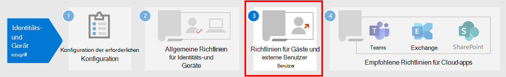

# Allgemeine Identitäts- und GerätezugriffsrichtlinienCommon identity and device access policies

In diesem Artikel werden die allgemeinen empfohlenen Richtlinien für die Sicherung des Zugriffs auf Microsoft 365 Cloud-Dienste, einschließlich lokaler Anwendungen, die mit Azure Active Directory (Azure AD)-Anwendungs Proxy veröffentlicht wurden, beschrieben.This article describes the common recommended policies for securing access to Microsoft 365 cloud services, including on-premises applications published with Azure Active Directory (Azure AD) Application Proxy.

In diesem Leitfaden wird erläutert, wie die empfohlenen Richtlinien in einer neu bereitgestellten Umgebung bereitgestellt werden.This guidance discusses how to deploy the recommended policies in a newly-provisioned environment. Durch das Einrichten dieser Richtlinien in einer separaten Lab-Umgebung können Sie die empfohlenen Richtlinien vor dem Staging in ihren Vorprodukt-und Produktionsumgebungen verstehen und auswerten.Setting up these policies in a separate lab environment allows you to understand and evaluate the recommended policies before staging the rollout to your preproduction and production environments. Ihre neu bereitgestellte Umgebung kann Cloud-only oder Hybrid sein, um Ihre Evaluierungs Anforderungen widerzuspiegeln.Your newly provisioned environment can be cloud-only or hybrid to reflect your evaluation needs.

## RichtliniengruppePolicy set

Das folgende Diagramm zeigt die empfohlenen Richtlinien.The following diagram illustrates the recommended set of policies. Es wird angezeigt, auf welcher Schutzebene jede Richtlinie angewendet wird und ob die Richtlinien auf PCs oder Telefone und Tablets oder auf beide Gerätekategorien zutreffen.It shows which tier of protections each policy applies to and whether the policies apply to PCs or phones and tablets, or both categories of devices. Außerdem wird angegeben, wo Sie diese Richtlinien konfigurieren.It also indicates where you configure these policies.

[Anzeigen einer größeren Version dieses BildsSee a larger version of this image](https://github.com/MicrosoftDocs/microsoft-365-docs/raw/public/microsoft-365/media/microsoft-365-policies-configurations/Identity_device_access_policies_byplan.png)

Hier finden Sie eine einseitige PDF-Zusammenfassung mit Links zu den einzelnen Richtlinien:Here's a one-page PDF summary with links to the individual policies:

   [Als PDF anzeigen](../../downloads/MSFT-cloud-architecture-identity-device-protection-handout.pdf) \| [Als PDF herunterladen](https://github.com/MicrosoftDocs/microsoft-365-docs/raw/public/microsoft-365/downloads/MSFT-cloud-architecture-identity-device-protection-handout.pdf)[View as a PDF](../../downloads/MSFT-cloud-architecture-identity-device-protection-handout.pdf) \| [Download as a PDF](https://github.com/MicrosoftDocs/microsoft-365-docs/raw/public/microsoft-365/downloads/MSFT-cloud-architecture-identity-device-protection-handout.pdf)

Im Rest dieses Artikels wird beschrieben, wie Sie diese Richtlinien konfigurieren.The rest of this article describes how to configure these policies.

> [!NOTE]
> Das Erfordernis der Verwendung von mehrstufiger Authentifizierung (MFA) wird empfohlen, bevor Geräte in InTune registriert werden, um sicherzustellen, dass das Gerät im Besitz des beabsichtigten Benutzers ist.Requiring the use of multi-factor authentication (MFA) is recommended before enrolling devices in Intune to assure that the device is in the possession of the intended user. Sie müssen Geräte in InTune registrieren, bevor Sie Geräte Konformitätsrichtlinien erzwingen können.You must enroll devices in Intune before you can enforce device compliance policies.

Um Ihnen Zeit zum Ausführen dieser Aufgaben zu geben, empfehlen wir, die Basisrichtlinien in der in dieser Tabelle aufgeführten Reihenfolge zu implementieren.To give you time to accomplish these tasks, we recommend implementing the baseline policies in the order listed in this table. Die MFA-Richtlinien für vertrauliche und hochgradig geregelte Schutzniveaus können jedoch jederzeit implementiert werden.However, the MFA policies for sensitive and highly regulated levels of protection can be implemented at any time.

|SchutzebeneProtection level|RichtlinienPolicies|Weitere InformationenMore information|
|---|---|---|
|**Basisplan****Baseline**|[MFA erforderlich, wenn das Anmelde Risiko *Mittel* groß oder *hoch* istRequire MFA when sign-in risk is *medium* or *high*](#require-mfa-based-on-sign-in-risk)||
||[Blockieren von Clients, die die moderne Authentifizierung nicht unterstützenBlock clients that don't support modern authentication](#block-clients-that-dont-support-modern-authentication)|Clients, die keine moderne Authentifizierung verwenden, können Richtlinien für bedingten Zugriff umgehen, daher ist es wichtig, diese zu blockieren.Clients that do not use modern authentication can bypass Conditional Access policies, so it's important to block these.|
||[Nutzer mit hohem Risiko müssen das Kennwort ändernHigh risk users must change password](#high-risk-users-must-change-password)|Zwingt Benutzer, Ihr Kennwort zu ändern, wenn Sie sich anmelden, wenn hochriskante Aktivitäten für Ihr Konto erkannt werden.Forces users to change their password when signing in if high-risk activity is detected for their account.|
||[Anwenden von App-DatenschutzrichtlinienApply app data protection policies](#apply-app-data-protection-policies)|Eine InTune-App-Schutzrichtlinie pro Plattform (Windows, IOS/iPads, Android).One Intune App Protection policy per platform (Windows, iOS/iPadOS, Android).|
||[Erfordern von genehmigten apps und App-SchutzRequire approved apps and app protection](#require-approved-apps-and-app-protection)|Erzwingt Mobile App Schutz für Telefone und Tablets mit IOS, iPads oder Android.Enforces mobile app protection for phones and tablets using iOS, iPadOS, or Android.|
||[Definieren von Geräte KonformitätsrichtlinienDefine device compliance policies](#define-device-compliance-policies)|Eine Richtlinie für jede Plattform.One policy for each platform.|
||[Kompatible PCs erforderlichRequire compliant PCs](#require-compliant-pcs-but-not-compliant-phones-and-tablets)|Erzwingt die Intune-Verwaltung von PCs mithilfe von Windows oder MacOS.Enforces Intune management of PCs using Windows or MacOS.|
|**Vertraulich****Sensitive**|[MFA erforderlich, wenn das Anmelde Risiko *niedrig*, *Mittel* oder *hoch* istRequire MFA when sign-in risk is *low*, *medium*, or *high*](#require-mfa-based-on-sign-in-risk)||
||[Erfordern von kompatiblen PCs *und* mobilen GerätenRequire compliant PCs *and* mobile devices](#require-compliant-pcs-and-mobile-devices)|Erzwingt die Intune-Verwaltung für PCs (Windows oder MacOS) sowie für Telefone oder Tablets (Ios, iPads oder Android).Enforces Intune management for both PCs (Windows or MacOS) and phones or tablets (iOS, iPadOS, or Android).|
|**Streng geregelt****Highly regulated**|[*Immer* MFA erforderlich*Always* require MFA](#require-mfa-based-on-sign-in-risk)|
|

## Zuweisen von Richtlinien zu Gruppen und BenutzernAssigning policies to groups and users

Identifizieren Sie vor dem Konfigurieren von Richtlinien die Azure Ad Gruppen, die Sie für jede Schutzebene verwenden.Before configuring policies, identify the Azure AD groups you are using for each tier of protection. Normalerweise gilt der Basisplan-Schutz für alle in der Organisation.Typically, baseline protection applies to everybody in the organization. Für einen Benutzer, der sowohl für den grundlegenden als auch für den vertraulichen Schutz enthalten ist, werden alle grundlegenden Richtlinien sowie die vertraulichen Richtlinien angewendet.A user who is included for both baseline and sensitive protection will have all the baseline policies applied plus the sensitive policies. Der Schutz ist kumulativ, und die restriktivste Richtlinie wird erzwungen.Protection is cumulative and the most restrictive policy is enforced.

Eine empfohlene Vorgehensweise besteht darin, eine Azure Ad Gruppe für bedingten Zugriffs Ausschluss zu erstellen.A recommended practice is to create an Azure AD group for Conditional Access exclusion. Fügen Sie diese Gruppe allen Richtlinien für bedingten Zugriff im Abschnitt **Zuweisungen** der Einstellung **Benutzer und Gruppen** **ausschließen** hinzu.Add this group to all of your Conditional Access policies in the **Exclude** value of the **Users and groups** setting in the **Assignments** section. Dadurch erhalten Sie eine Methode zum Bereitstellen des Zugriffs auf einen Benutzer, während Sie Zugriffsprobleme beheben.This gives you a method to provide access to a user while you troubleshoot access issues. Dies wird nur als temporäre Lösung empfohlen.This is recommended as a temporary solution only. Überwachen Sie diese Gruppe auf Änderungen, und stellen Sie sicher, dass die Ausschlussgruppe nur wie beabsichtigt verwendet wird.Monitor this group for changes and be sure the exclusion group is being used only as intended.

Im folgenden finden Sie ein Beispiel für Gruppenzuweisung und-Ausschlüsse für die Notwendigkeit eines MFA.Here's an example of group assignment and exclusions for requiring MFA.

Hier sind die Ergebnisse:Here are the results:

- Alle Benutzer müssen MFA verwenden, wenn das Anmelde Risiko Mittel oder hoch ist.All users are required to use MFA when the sign-in risk is medium or high.

- Mitglieder der Gruppe "Führungskräfte" müssen MFA verwenden, wenn das Anmelde Risiko niedrig, Mittel oder hoch ist.Members of the Executive Staff group are required to use MFA when the sign-in risk is low, medium, or high.

  In diesem Fall entsprechen Mitglieder der Gruppe der Führungskräfte sowohl den grundlegenden als auch den vertraulichen Richtlinien für bedingten Zugriff.In this case, members of the Executive Staff group match both the baseline and sensitive Conditional Access policies. Die Zugriffssteuerung für beide Richtlinien wird kombiniert, was in diesem Fall der Richtlinie für vertraulichen bedingten Zugriff entspricht.The access controls for both policies are combined, which in this case is equivalent to the sensitive Conditional Access policy.

- Mitglieder der streng geheimen Project X-Gruppe sind immer für die Verwendung von MFA erforderlich.Members of the Top Secret Project X group are always required to use MFA

  In diesem Fall entsprechen Mitglieder der streng geheimen Projekt X-Gruppe sowohl den grundlegenden als auch streng regulierten Richtlinien für bedingten Zugriff.In this case, members of the Top Secret Project X group match both the baseline and highly-regulated Conditional Access policies. Die Zugriffssteuerung für beide Richtlinien wird kombiniert.The access controls for both policies are combined. Da die Zugriffssteuerung für die streng geregelte Richtlinie für den bedingten Zugriff restriktiver ist, wird Sie verwendet.Because the access control for the highly-regulated Conditional Access policy is more restrictive, it is used.

Seien Sie vorsichtig, wenn Sie Gruppen und Benutzern höhere Schutzebenen zuweisen.Be careful when applying higher levels of protection to groups and users. Mitglieder der streng geheimen Projekt x-Gruppe müssen beispielsweise jedes Mal, wenn Sie sich anmelden, MFA verwenden, auch wenn Sie nicht an hoch regulierten Inhalten für Project x arbeiten.For example, members of the Top Secret Project X group will be required to use MFA every time they sign in, even if they are not working on the highly-regulated content for Project X.

Alle Azure Ad Gruppen, die als Teil dieser Empfehlungen erstellt wurden, müssen als Microsoft 365-Gruppen erstellt werden.All Azure AD groups created as part of these recommendations must be created as Microsoft 365 groups. Dies ist wichtig für die Bereitstellung von Sensitivitäts Bezeichnungen beim Sichern von Dokumenten in Microsoft Teams und SharePoint.This is important for the deployment of sensitivity labels when securing documents in Microsoft Teams and SharePoint.

## MFA basierend auf dem Anmelde Risiko erforderlichRequire MFA based on sign-in risk

Sie sollten Ihre Benutzer für MFA registrieren lassen, bevor Sie Ihre Verwendung benötigen.You should have your users register for MFA prior to requiring its use. Wenn Sie Microsoft 365 E5, Microsoft 365 E3 mit dem Identity & Threat Protection-Add-on, Office 365 mit EMS E5 oder einzelnen Azure AD Premium P2-Lizenzen haben, können Sie die MFA-Registrierungsrichtlinie mit Azure AD Identitätsschutz verwenden, um die Registrierung von Benutzern für MFA zu verlangen.If you have Microsoft 365 E5, Microsoft 365 E3 with the Identity & Threat Protection add-on, Office 365 with EMS E5, or individual Azure AD Premium P2 licenses, you can use the MFA registration policy with Azure AD Identity Protection to require that users register for MFA. Die [erforderliche Arbeit](identity-access-prerequisites.md) umfasst das Registrieren aller Benutzer mit MFA.The [prerequisite work](identity-access-prerequisites.md) includes registering all users with MFA.

Nachdem Ihre Benutzer registriert wurden, können Sie MFA für die Anmeldung mit einer neuen Richtlinie für den bedingten Zugriff benötigen.After your users are registered, you can require MFA for sign-in with a new Conditional Access policy.

1. Navigieren Sie zum [Azure-Portal](https://portal.azure.com), und melden Sie sich mit Ihren Anmeldeinformationen an.Go to the [Azure portal](https://portal.azure.com), and sign in with your credentials.
2. Wählen Sie in der Liste der Azure-Dienste die Option **Azure Active Directory** aus.In the list of Azure services, choose **Azure Active Directory**.
3. Wählen Sie in der Liste **Verwalten** die Option **Sicherheit** aus, und wählen Sie dann **bedingter Zugriff** aus.In the **Manage** list, choose **Security**, and then choose **Conditional Access**.
4. Wählen Sie **neue Richtlinie** aus, und geben Sie den Namen der neuen Richtlinie ein.Choose **New policy** and type the new policy's name.

In den folgenden Tabellen werden die Richtlinieneinstellungen für den bedingten Zugriff beschrieben, um MFA basierend auf dem Anmelde Risiko zu erfordern.The following tables describes the Conditional Access policy settings to require MFA based on sign-in risk.

Im Abschnitt **Zuweisungen** :In the **Assignments** section:

|EinstellungSetting|EigenschaftenProperties|WerteValues|HinweiseNotes|
|---|---|---|---|
|Benutzer und GruppenUsers and groups|EinschließenInclude|**Wählen Sie Benutzer und Gruppen > Benutzer und Gruppen** aus: bestimmte Gruppen mit Zielbenutzer Konten auswählen.**Select users and groups > Users and groups**:  Select specific groups containing targeted user accounts.|Beginnen Sie mit der Gruppe, die Pilotbenutzer Konten enthält.Start with the group that includes pilot user accounts.|
||AusschließenExclude|**Benutzer und Gruppen**: Wählen Sie die Ausnahmegruppe für bedingten Zugriff aus. Dienstkonten (app-Identitäten).**Users and groups**: Select your Conditional Access exception group; service accounts (app identities).|Die Mitgliedschaft sollte auf der Grundlage der erforderlichen, temporären Änderungen geändert werden.Membership should be modified on an as-needed, temporary basis.|
|Cloud-Apps oder-AktionenCloud apps or actions|**Cloud-apps > include****Cloud apps > Include**|**Auswählen von apps**: Wählen Sie die Apps aus, auf die diese Richtlinie angewendet werden soll.**Select apps**: Select the apps you want this policy to apply to. Wählen Sie beispielsweise Exchange Online aus.For example, select Exchange Online.||
|BedingungenConditions|||Konfigurieren Sie Bedingungen, die für Ihre Umgebung und Ihre Anforderungen spezifisch sind.Configure conditions that are specific to your environment and needs.|
||AnmelderisikoSign-in risk||Lesen Sie den Leitfaden in der folgenden Tabelle.See the guidance in the following table.|
|

### Einstellungen für die Anmeldungs RisikobedingungSign-in risk condition settings

Wenden Sie die Einstellungen für die Risikostufe basierend auf der Schutzebene an, auf die Sie Zielen.Apply the risk level settings based on the protection level you are targeting.

|SchutzniveauLevel of protection|Erforderliche Risikostufen WerteRisk level values needed|AktionAction|
|---|---|---|
|BaselineBaseline|Hoch, MmittelHigh, medium|Überprüfen Sie beides.Check both.|
|VertraulichSensitive|Hoch, Mittel, niedrigHigh, medium, low|Überprüfen Sie alle drei.Check all three.|
|Streng geregeltHighly regulated||Lassen Sie alle Optionen deaktiviert, damit MFA immer erzwungen wird.Leave all options unchecked to always enforce MFA.|
|

Im Abschnitt **Zugriffssteuerungen** :In the **Access controls** section:

|EinstellungSetting|EigenschaftenProperties|WerteValues|AktionAction|
|---|---|---|---|
|GewährenGrant|**Grant access****Grant access**||AuswählenSelect|
|||**Mehrstufige Authentifizierung erforderlich****Require Multi-factor authentication**|PrüfenCheck|
||**Alle ausgewählten Steuerelemente erforderlich****Require all the selected controls**||AuswählenSelect|
|

Wählen **Sie auswählen aus** , um die **Berechtigungs** Einstellungen zu speichern.Choose **Select** to save the **Grant** settings.

Wählen Sie schließlich **auf** für **Richtlinie aktivieren** aus, und wählen Sie dann **Erstellen** aus.Finally, select **On** for **Enable policy**, and then choose **Create**.

In diesem Fall sollten Sie auch das [What-if](https://docs.microsoft.com/azure/active-directory/active-directory-conditional-access-whatif) -Tool zum Testen der Richtlinie verwenden.Also consider using the [What if](https://docs.microsoft.com/azure/active-directory/active-directory-conditional-access-whatif) tool to test the policy.

## Sperrt Clients, die moderne Authentifizierung nicht unterstützenBlock clients that don't support modern authentication

Verwenden Sie die Einstellungen in diesen Tabellen für eine Richtlinie für den bedingten Zugriff, um Clients zu blockieren, die die moderne Authentifizierung nicht unterstützen.Use the settings in these tables for a Conditional Access policy to block clients that don't support modern authentication.

In [diesem Artikel](../../enterprise/microsoft-365-client-support-modern-authentication.md) finden Sie eine Liste der Clients in Microsoft 365, die Stützung moderne Authentifizierung durchführen.See [this article](../../enterprise/microsoft-365-client-support-modern-authentication.md) for a list of clients in Microsoft 365 that do suppport modern authentication.

Im Abschnitt **Zuweisungen** :In the **Assignments** section:

|EinstellungSetting|EigenschaftenProperties|WerteValues|HinweiseNotes|
|---|---|---|---|
|Benutzer und GruppenUsers and groups|EinschließenInclude|**Wählen Sie Benutzer und Gruppen > Benutzer und Gruppen** aus: bestimmte Gruppen mit Zielbenutzer Konten auswählen.**Select users and groups > Users and groups**:  Select specific groups containing targeted user accounts.|Beginnen Sie mit der Gruppe, die Pilotbenutzer Konten enthält.Start with the group that includes pilot user accounts.|
||AusschließenExclude|**Benutzer und Gruppen**: Wählen Sie die Ausnahmegruppe für bedingten Zugriff aus. Dienstkonten (app-Identitäten).**Users and groups**: Select your Conditional Access exception group; service accounts (app identities).|Die Mitgliedschaft sollte auf der Grundlage der erforderlichen, temporären Änderungen geändert werden.Membership should be modified on an as-needed, temporary basis.|
|Cloud-Apps oder-AktionenCloud apps or actions|**Cloud-apps > include****Cloud apps > Include**|**Auswählen von apps**: Wählen Sie die Apps aus, die den Clients entsprechen, die die moderne Authentifizierung nicht unterstützen.**Select apps**: Select the apps corresponding to the clients that do not support modern authentication.||
|BedingungenConditions|**Client-Apps****Client apps**|Wählen Sie **Ja** für **configure** aus.Choose **Yes** for **Configure** 
 Deaktivieren Sie die Häkchen für **Browser** und **Mobile Apps und Desktop Clients**Clear the check marks for **Browser** and **Mobile apps and desktop clients**||
|

Im Abschnitt **Zugriffssteuerungen** :In the **Access controls** section:

|EinstellungSetting|EigenschaftenProperties|WerteValues|AktionAction|
|---|---|---|---|
|GewährenGrant|**Zugriff blockieren****Block access**||AuswählenSelect|
||**Alle ausgewählten Steuerelemente erforderlich****Require all the selected controls**||AuswählenSelect|
|

Wählen **Sie auswählen aus** , um die **Berechtigungs** Einstellungen zu speichern.Choose **Select** to save the **Grant** settings.

Wählen Sie schließlich **auf** für **Richtlinie aktivieren** aus, und wählen Sie dann **Erstellen** aus.Finally, select **On** for **Enable policy**, and then choose **Create**.

Verwenden Sie dazu das Tool [What if](https://docs.microsoft.com/azure/active-directory/active-directory-conditional-access-whatif) , um die Richtlinie zu testen.Consider using the [What if](https://docs.microsoft.com/azure/active-directory/active-directory-conditional-access-whatif) tool to test the policy.

Für Exchange Online können Sie Authentifizierungsrichtlinien verwenden, um die [Standardauthentifizierung zu deaktivieren](https://docs.microsoft.com/exchange/clients-and-mobile-in-exchange-online/disable-basic-authentication-in-exchange-online), wodurch alle Clientzugriffs Anforderungen für die Verwendung der modernen Authentifizierung erzwungen werden.For Exchange Online, you can use authentication policies to [disable Basic authentication](https://docs.microsoft.com/exchange/clients-and-mobile-in-exchange-online/disable-basic-authentication-in-exchange-online), which forces all client access requests to use modern authentication.

## Nutzer mit hohem Risiko müssen das Kennwort ändernHigh risk users must change password

Um sicherzustellen, dass alle gefährdeten Benutzerkonten mit hohem Risiko gezwungen werden, beim Anmelden eine Kennwortänderung durchzuführen, müssen Sie die folgende Richtlinie anwenden.To ensure that all high-risk users' compromised accounts are forced to perform a password change when signing-in, you must apply the following policy.

Melden Sie sich im [Microsoft Azure-Portal (https://portal.azure.com)](https://portal.azure.com/) mit Ihren Administratoranmeldeinformationen an, und wechseln Sie dann zu **Azure AD Identity Protection > Richtlinie zum Benutzerrisiko**.Log in to the [Microsoft Azure portal (https://portal.azure.com)](https://portal.azure.com/) with your administrator credentials, and then navigate to **Azure AD Identity Protection > User Risk Policy**.

Im Abschnitt **Zuweisungen** :In the **Assignments** section:

|TypType|EigenschaftenProperties|WerteValues|AktionAction|
|---|---|---|---|
|UsersUsers|EinschließenInclude|**Alle Benutzer****All users**|AuswählenSelect|
|BenutzerrisikoUser risk|**High****High**||AuswählenSelect|
|

Im zweiten Abschnitt " **Zuweisungen** ":In the second **Assignments** section:

|TypType|EigenschaftenProperties|WerteValues|AktionAction|
|---|---|---|---|
|ZugriffAccess|**Zugriff zulassen****Allow access**||AuswählenSelect|
|||**Kennwortänderung erforderlich****Require password change**|PrüfenCheck|
|

Wählen Sie **Fertig** aus, um die **Zugriffs** Einstellungen zu speichern.Choose **Done** to save the **Access** settings.

Wählen Sie schließlich **auf** für **Richtlinie erzwingen** aus, und wählen Sie dann **Speichern** aus.Finally, select **On** for **Enforce policy**, and then choose **Save**.

Verwenden Sie dazu das Tool [What if](https://docs.microsoft.com/azure/active-directory/active-directory-conditional-access-whatif) , um die Richtlinie zu testen.Consider using the [What if](https://docs.microsoft.com/azure/active-directory/active-directory-conditional-access-whatif) tool to test the policy.

Verwenden Sie diese Richtlinie in Verbindung mit dem [Konfigurieren Azure AD Kennwortschutzes](https://docs.microsoft.com/azure/active-directory/authentication/concept-password-ban-bad), mit dem bekannte schwache Kennwörter und ihre Varianten sowie zusätzliche schwache Ausdrücke, die für Ihre Organisation spezifisch sind, erkannt und blockiert werden.Use this policy in conjunction with [Configure Azure AD password protection](https://docs.microsoft.com/azure/active-directory/authentication/concept-password-ban-bad), which detects and blocks known weak passwords and their variants and additional weak terms that are specific to your organization. Durch die Verwendung Azure AD Kennwortschutzes wird sichergestellt, dass geänderte Kennwörter stark sind.Using Azure AD password protection ensures that changed passwords are strong ones.

## Anwenden von App-DatenschutzrichtlinienApply APP data protection policies

App-Schutzrichtlinien (app) definieren, welche apps zulässig sind und welche Aktionen Sie mit den Daten Ihrer Organisation durchführen können.App Protection Policies (APP) define which apps are allowed and the actions they can take with your organization's data. Mit den in App verfügbaren Auswahlmöglichkeiten können Organisationen den Schutz ihren spezifischen Anforderungen anpassen.The choices available in APP enable organizations to tailor the protection to their specific needs. Für einige ist es möglicherweise nicht offensichtlich, welche Richtlinieneinstellungen erforderlich sind, um ein vollständiges Szenario zu implementieren.For some, it may not be obvious which policy settings are required to implement a complete scenario. Um Organisationen die Priorisierung mobiler Clientendpunkte zu erleichtern, hat Microsoft die Taxonomie für das App-Datenschutz Framework für IOS-und Android-Mobile App Verwaltung eingeführt.To help organizations prioritize mobile client endpoint hardening, Microsoft has introduced taxonomy for its APP data protection framework for iOS and Android mobile app management.

Das App Data Protection-Framework ist in drei unterschiedliche Konfigurationsebenen unterteilt, wobei jede Ebene die vorherige Ebene abbaut:The APP data protection framework is organized into three distinct configuration levels, with each level building off the previous level:

- **Enterprise Basic Data Protection** (Level 1) stellt sicher, dass apps mit einer PIN geschützt und verschlüsselt und selektive Löschvorgänge ausgeführt werden.**Enterprise basic data protection** (Level 1) ensures that apps are protected with a PIN and encrypted and performs selective wipe operations. Für Android-Geräte überprüft diese Stufe die Beglaubigung von Android-Geräten.For Android devices, this level validates Android device attestation. Hierbei handelt es sich um eine Einstiegskonfiguration, die eine ähnliche Datenschutz Steuerung in Exchange Online Postfachrichtlinien bereitstellt und die Benutzerpopulation in die APP einführt.This is an entry level configuration that provides similar data protection control in Exchange Online mailbox policies and introduces IT and the user population to APP.
- **Unter Enterprise Enhanced Data Protection** (Level 2) werden Präventionsmechanismen für App-Daten Leckagen und Mindestanforderungen für BS eingeführt.**Enterprise enhanced data protection** (Level 2) introduces APP data leakage prevention mechanisms and minimum OS requirements. Dies ist die Konfiguration, die für die meisten mobilen Benutzer gilt, die auf Arbeits-oder Schuldaten zugreifen.This is the configuration that is applicable to most mobile users accessing work or school data.
- **Unter Enterprise High Data Protection** (Stufe 3) werden erweiterte Datenschutzmechanismen, erweiterte Pin-Konfiguration und Verteidigung der mobilen App-Bedrohungen eingeführt.**Enterprise high data protection** (Level 3) introduces advanced data protection mechanisms, enhanced PIN configuration, and APP Mobile Threat Defense. Diese Konfiguration ist für Benutzer, die auf Daten mit hohem Risiko zugreifen, wünschenswert.This configuration is desirable for users that are accessing high risk data.

Informationen zu den spezifischen Empfehlungen für jede Konfigurationsebene und zu den minimalen apps, die geschützt werden müssen, finden Sie unter [Data Protection Framework mithilfe von App-Schutzrichtlinien](https://docs.microsoft.com/mem/intune/apps/app-protection-framework).To see the specific recommendations for each configuration level and the minimum apps that must be protected, review [Data protection framework using app protection policies](https://docs.microsoft.com/mem/intune/apps/app-protection-framework).

Anhand der in den Konfigurationen für den [Identitäts-und Geräte Zugriff](microsoft-365-policies-configurations.md)beschriebenen Prinzipien werden die grundlegenden und sensiblen Schutzebenen eng mit den Einstellungen der Stufe 2 Enterprise Enhanced Data Protection zugeordnet.Using the principles outlined in [Identity and device access configurations](microsoft-365-policies-configurations.md), the Baseline and Sensitive protection tiers map closely with the Level 2 enterprise enhanced data protection settings. Die hochregulierte Schutzebene ordnet sich eng mit den Einstellungen der Stufe 3 Enterprise High Data Protection an.The Highly regulated protection tier maps closely to the Level 3 enterprise high data protection settings.

|SchutzebeneProtection level|App-SchutzrichtlinieApp Protection Policy|Weitere InformationenMore information|
|---|---|---|
|BaselineBaseline|[Stufe 2 erweiterter DatenschutzLevel 2 enhanced data protection](https://docs.microsoft.com/mem/intune/apps/app-protection-framework#level-2-enterprise-enhanced-data-protection)|Die Richtlinieneinstellungen in Ebene 2 enthalten alle Richtlinieneinstellungen, die für Stufe 1 empfohlen werden, und die folgenden Richtlinieneinstellungen werden nur hinzugefügt oder aktualisiert, um weitere Steuerelemente und eine anspruchsvollere Konfiguration als Ebene 1 zu implementieren.The policy settings enforced in level 2 include all the policy settings recommended for level 1 and only adds to or updates the below policy settings to implement more controls and a more sophisticated configuration than level 1.|
|VertraulichSensitive|[Stufe 2 erweiterter DatenschutzLevel 2 enhanced data protection](https://docs.microsoft.com/mem/intune/apps/app-protection-framework#level-2-enterprise-enhanced-data-protection)|Die Richtlinieneinstellungen in Ebene 2 enthalten alle Richtlinieneinstellungen, die für Stufe 1 empfohlen werden, und die folgenden Richtlinieneinstellungen werden nur hinzugefügt oder aktualisiert, um weitere Steuerelemente und eine anspruchsvollere Konfiguration als Ebene 1 zu implementieren.The policy settings enforced in level 2 include all the policy settings recommended for level 1 and only adds to or updates the below policy settings to implement more controls and a more sophisticated configuration than level 1.|
|Stark reguliertHighly Regulated|[Stufe 3 Enterprise High Data ProtectionLevel 3 enterprise high data protection](https://docs.microsoft.com/mem/intune/apps/app-protection-framework#level-3-enterprise-high-data-protection)|Die Richtlinieneinstellungen in Stufe 3 umfassen alle Richtlinieneinstellungen, die für Stufe 1 und 2 empfohlen werden, und nur die unten aufgeführten Richtlinieneinstellungen hinzugefügt oder aktualisiert, um weitere Steuerelemente und eine anspruchsvollere Konfiguration als Ebene 2 zu implementieren.The policy settings enforced in level 3 include all the policy settings recommended for level 1 and 2 and only adds to or updates the below policy settings to implement more controls and a more sophisticated configuration than level 2.|
|

Um eine neue APP-Schutzrichtlinie für jede Plattform (IOS und Android) in Microsoft Endpoint Manager mithilfe der Data Protection Framework-Einstellungen zu erstellen, haben Sie folgende Möglichkeiten:To create a new app protection policy for each platform (iOS and Android) within Microsoft Endpoint Manager using the data protection framework settings, you can:

1. Erstellen Sie die Richtlinien manuell, indem Sie die Schritte unter [Vorgehensweise erstellen und Bereitstellen von App-Schutzrichtlinien mit Microsoft InTune](https://docs.microsoft.com/mem/intune/apps/app-protection-policies)ausführen.Manually create the policies by following the steps in [How to create and deploy app protection policies with Microsoft Intune](https://docs.microsoft.com/mem/intune/apps/app-protection-policies).
2. Importieren Sie die JSON-Vorlagen für das Beispiel [InTune-App-Schutzrichtlinien-Konfigurations Framework](https://github.com/microsoft/Intune-Config-Frameworks/tree/master/AppProtectionPolicies) mit [InTune-PowerShell-Skripts](https://github.com/microsoftgraph/powershell-intune-samples).Import the sample [Intune App Protection Policy Configuration Framework JSON templates](https://github.com/microsoft/Intune-Config-Frameworks/tree/master/AppProtectionPolicies) with [Intune's PowerShell scripts](https://github.com/microsoftgraph/powershell-intune-samples).

## Erfordern von genehmigten apps und App-SchutzRequire approved apps and APP protection

Zum Erzwingen der APP-Schutzrichtlinien, die Sie in InTune angewendet haben, müssen Sie eine Richtlinie für den bedingten Zugriff erstellen, um genehmigte Client-apps und die in den App-Schutzrichtlinien festgelegten Bedingungen zu erfordern.To enforce the APP protection policies you applied in Intune, you must create a Conditional Access policy to require approved client apps and the conditions set in the APP protection policies.

Das Erzwingen von App-Schutzrichtlinien erfordert eine Reihe von Richtlinien, die unter in [erfordern von App-Schutzrichtlinien für Cloud-App-Zugriff mit bedingtem Zugriff](https://docs.microsoft.com/azure/active-directory/conditional-access/app-protection-based-conditional-access)beschrieben werden.Enforcing APP protection policies requires a set of policies described in in [Require app protection policy for cloud app access with Conditional Access](https://docs.microsoft.com/azure/active-directory/conditional-access/app-protection-based-conditional-access). Diese Richtlinien sind jeweils in dieser empfohlenen Gruppe von Richtlinien für Identitäts-und Zugriffs Konfigurationen enthalten.These policies are each included in this recommended set of identity and access configuration policies.

Um die Richtlinie für den bedingten Zugriff zu erstellen, für die genehmigte apps und der APP-Schutz erforderlich sind, führen Sie "Schritt 1: Konfigurieren einer Azure AD Richtlinie für den bedingten Zugriff für Microsoft 365" in [Szenario 1: Microsoft 365-apps erfordern genehmigte apps mit App-Schutzrichtlinien](https://docs.microsoft.com/azure/active-directory/conditional-access/app-protection-based-conditional-access#scenario-1-office-365-apps-require-approved-apps-with-app-protection-policies), die Outlook für IOS und Android ermöglichen, aber verhindert, dass OAuth-fähige Exchange ActiveSync-Exchange Online ClientsTo create the Conditional Access policy that requires approved apps and APP protection, follow "Step 1: Configure an Azure AD Conditional Access policy for Microsoft 365" in [Scenario 1: Microsoft 365 apps require approved apps with app protection policies](https://docs.microsoft.com/azure/active-directory/conditional-access/app-protection-based-conditional-access#scenario-1-office-365-apps-require-approved-apps-with-app-protection-policies), which allows Outlook for iOS and Android, but blocks OAuth capable Exchange ActiveSync clients from connecting to Exchange Online.

   > [!NOTE]
   > Diese Richtlinie stellt sicher, dass Mobile Benutzer mithilfe der entsprechenden apps auf alle Office-Endpunkte zugreifen können.This policy ensures mobile users can access all Office endpoints using the applicable apps.

Wenn Sie mobilen Zugriff auf Exchange Online ermöglichen, implementieren Sie [Blockieren von ActiveSync-Clients](secure-email-recommended-policies.md#block-activesync-clients), wodurch verhindert wird, dass Exchange ActiveSync-Clients die Standardauthentifizierung für die Verbindung mit Exchange Online nutzen.If you are enabling mobile access to Exchange Online, implement [Block ActiveSync clients](secure-email-recommended-policies.md#block-activesync-clients), which prevents Exchange ActiveSync clients leveraging basic authentication from connecting to Exchange Online. Diese Richtlinie wird in der Abbildung oben in diesem Artikel nicht abgebildet.This policy is not pictured in the illustration at the top of this article. Sie wird in [Richtlinien Empfehlungen zum Sichern von e-Mails](secure-email-recommended-policies.md)beschrieben und abgebildet.It is described and pictured in [Policy recommendations for securing email](secure-email-recommended-policies.md).

 Diese Richtlinien nutzen die Grant-Steuerelemente [erfordern eine genehmigte Client-App](https://docs.microsoft.com/azure/active-directory/conditional-access/concept-conditional-access-grant#require-approved-client-app) und [erfordern eine APP-Schutzrichtlinie](https://docs.microsoft.com/azure/active-directory/conditional-access/concept-conditional-access-grant#require-app-protection-policy).These policies leverage the grant controls [Require approved client app](https://docs.microsoft.com/azure/active-directory/conditional-access/concept-conditional-access-grant#require-approved-client-app) and [Require app protection policy](https://docs.microsoft.com/azure/active-directory/conditional-access/concept-conditional-access-grant#require-app-protection-policy).

Schließlich wird durch das Blockieren der Legacy Authentifizierung für andere Client-apps auf IOS-und Android-Geräten sichergestellt, dass diese Clients keine bedingten Zugriffsrichtlinien umgehen können.Finally, blocking legacy authentication for other client apps on iOS and Android devices ensures that these clients cannot bypass Conditional Access policies. Wenn Sie die Anleitungen in diesem Artikel befolgen, haben Sie bereits [Blockierte Clients konfiguriert, die die moderne Authentifizierung nicht unterstützen](#block-clients-that-dont-support-modern-authentication).If you're following the guidance in this article, you've already configured [Block clients that don't support modern authentication](#block-clients-that-dont-support-modern-authentication).

<!---
With Conditional Access, organizations can restrict access to approved (modern authentication capable) iOS and Android client apps with Intune app protection policies applied to them. Several Conditional Access policies are required, with each policy targeting all potential users. Details on creating these policies can be found in [Require app protection policy for cloud app access with Conditional Access](https://docs.microsoft.com/azure/active-directory/conditional-access/app-protection-based-conditional-access).

1. Follow "Step 1: Configure an Azure AD Conditional Access policy for Microsoft 365" in [Scenario 1: Microsoft 365 apps require approved apps with app protection policies](https://docs.microsoft.com/azure/active-directory/conditional-access/app-protection-based-conditional-access#scenario-1-office-365-apps-require-approved-apps-with-app-protection-policies), which allows Outlook for iOS and Android, but blocks OAuth capable Exchange ActiveSync clients from connecting to Exchange Online.

   > [!NOTE]
   > This policy ensures mobile users can access all Office endpoints using the applicable apps.

2. If enabling mobile access to Exchange Online, implement [Block ActiveSync clients](secure-email-recommended-policies.md#block-activesync-clients), which prevents Exchange ActiveSync clients leveraging basic authentication from connecting to Exchange Online.

   The above policies leverage the grant controls [Require approved client app](https://docs.microsoft.com/azure/active-directory/conditional-access/concept-conditional-access-grant#require-approved-client-app) and [Require app protection policy](https://docs.microsoft.com/azure/active-directory/conditional-access/concept-conditional-access-grant#require-app-protection-policy).

3. Disable legacy authentication for other client apps on iOS and Android devices. For more information, see [Block clients that don't support modern authentication](#block-clients-that-dont-support-modern-authentication).
-->

## Definieren von Geräte KompatibilitätsrichtlinienDefine device-compliance policies

Geräte Konformitätsrichtlinien definieren die Anforderungen, die Geräte erfüllen müssen, um als konform festzulegen.Device-compliance policies define the requirements that devices must meet to be determined as compliant. Sie erstellen InTune-Geräte Konformitätsrichtlinien in Microsoft Endpoint Manager Admin Center.You create Intune device compliance policies from within the Microsoft Endpoint Manager admin center.

Sie müssen für jede PC-, Telefon-oder Tablet-Plattform eine Richtlinie erstellen:You must create a policy for each PC, phone, or tablet platform:

- Android-GeräteadministratorAndroid device administrator
- Android EnterpriseAndroid Enterprise
- IOS/iPadsiOS/iPadOS
- macOSmacOS
- Windows 8.1 und höherWindows 8.1 and later
- Windows 10 und höherWindows 10 and later

Um Geräte Konformitätsrichtlinien zu erstellen, melden Sie sich mit Ihren Administratoranmeldeinformationen beim [Microsoft Endpoint Manager Admin Center](https://endpoint.microsoft.com) an, und navigieren Sie dann zu Richtlinien für  \> **Konformitätsrichtlinien** für Geräte \> .To create device compliance policies, log in to the [Microsoft Endpoint Manager Admin Center](https://endpoint.microsoft.com) with your administrator credentials, and then navigate to **Devices** \> **Compliance policies** \> **Policies**. Wählen Sie **Richtlinie erstellen** aus.Select **Create Policy**.

Damit Geräte Konformitätsrichtlinien bereitgestellt werden, müssen Sie Benutzergruppen zugewiesen werden.For device compliance policies to be deployed, they must be assigned to user groups. Sie weisen eine Richtlinie zu, nachdem Sie Sie erstellt und gespeichert haben.You assign a policy after you create and save it. Wählen Sie im Admin Center die Richtlinie aus, und wählen Sie dann **Zuweisungen** aus.In the admin center, select the policy and then select **Assignments**. Nachdem Sie die Gruppen ausgewählt haben, für die Sie die Richtlinie erhalten möchten, wählen Sie **Speichern** aus, um diese Gruppenzuweisung zu speichern und die Richtlinie bereitzustellen.After selecting the groups that you want to receive the policy, select **Save** to save that group assignment and deploy the policy.

Eine Schritt-für-Schritt-Anleitung zum Erstellen von Konformitätsrichtlinien in InTune finden Sie unter [Create a Compliance Policy in Microsoft InTune](https://docs.microsoft.com/mem/intune/protect/create-compliance-policy) in der InTune-Dokumentation.For step-by-step guidance on creating compliance policies in Intune, see [Create a compliance policy in Microsoft Intune](https://docs.microsoft.com/mem/intune/protect/create-compliance-policy) in the Intune documentation.

### Empfohlene Einstellungen für Windows 10 und höherRecommended settings for Windows 10 and later

Die folgenden Einstellungen werden für PCs mit Windows 10 und höher, wie in **Schritt 2: Kompatibilitätseinstellungen** konfiguriert, des Richtlinien Erstellungsprozesses empfohlen.The following settings are recommended for PCs running Windows 10 and later, as configured in **Step 2: Compliance settings**, of the policy creation process.

Informationen zum **Geräte Integritäts > Windows-Integritäts Prüfungsdienst** finden Sie in dieser Tabelle.For **Device health > Windows Health Attestation Service evaluation rules**, see this table.

|EigenschaftenProperties|WertValue|AktionAction|
|---|---|---|
|BitLocker erforderlichRequire BitLocker|ErforderlichRequire|AuswählenSelect|
|Sicheres Booten muss auf dem Gerät aktiviert seinRequire Secure Boot to be enabled on the device|ErforderlichRequire|AuswählenSelect|
|Codeintegrität erforderlichRequire code integrity|ErforderlichRequire|AuswählenSelect|
|

Geben Sie für **Geräteeigenschaften** die entsprechenden Werte für Betriebssystemversionen basierend auf Ihren IT-und Sicherheitsrichtlinien an.For **Device properties**, specify appropriate values for operating system versions based on your IT and security policies.

Wählen Sie für die **Configuration Manager-Kompatibilität** die Option **erforderlich** aus.For **Configuration Manager Compliance**, select **Require**.

Informationen zur **System Sicherheit** finden Sie in dieser Tabelle.For **System security**, see this table.

|TypType|EigenschaftenProperties|WertValue|AktionAction|
|---|---|---|---|
|KennwortPassword|Anfordern eines Kennworts zum Entsperren mobiler GeräteRequire a password to unlock mobile devices|ErforderlichRequire|AuswählenSelect|
||Einfache KennwörterSimple passwords|BlockierenBlock|AuswählenSelect|
||Kennwort-TypPassword type|Geräte StandardDevice default|AuswählenSelect|
||Minimale KennwortlängeMinimum password length|6 6|TypType|
||Maximale Anzahl von Minuten Inaktivität, bevor Kennwort erforderlich istMaximum minutes of inactivity before password is required|15 15|TypType 
 Diese Einstellung wird für die Android-Versionen 4,0 und höher oder für Knox 4,0 und höher unterstützt.This setting is supported for Android versions 4.0 and above or KNOX 4.0 and above. Für IOS-Geräte wird dieser für IOS 8,0 und höher unterstützt.For iOS devices, it's supported for iOS 8.0 and above.|
||Kennwortablauf (Tage)Password expiration (days)|4141|TypType|
||Anzahl der vorherigen Kennwörter zur Verhinderung der WiederverwendungNumber of previous passwords to prevent reuse|5 5|TypType|
||Kennwort anfordern, wenn das Gerät vom Leerlaufzustand zurückkehrt (Mobil und holographisch)Require password when device returns from idle state (Mobile and Holographic)|ErforderlichRequire|Verfügbar für Windows 10 und höherAvailable for Windows 10 and later|
|VerschlüsselungEncryption|Verschlüsselung der Datenspeicherung auf dem GerätEncryption of data storage on device|ErforderlichRequire|AuswählenSelect|
|GerätesicherheitDevice Security|FirewallFirewall|ErforderlichRequire|AuswählenSelect|
||AntivirusAntivirus|ErforderlichRequire|AuswählenSelect|
||AntiSpywareAntispyware|ErforderlichRequire|AuswählenSelect 
 Für diese Einstellung ist eine Anti-Spyware-Lösung erforderlich, die beim Windows Security Center registriert ist.This setting requires an Anti-Spyware solution registered with Windows Security Center.|
|DefenderDefender|Antischadsoftware für Microsoft DefenderMicrosoft Defender Antimalware|ErforderlichRequire|AuswählenSelect|
||Mindestversion von Microsoft Defender AntischadsoftwareMicrosoft Defender Antimalware minimum version||TypType 
 Wird nur für Windows 10-Desktop unterstützt.Only supported for Windows 10 desktop. Microsoft empfiehlt Versionen von nicht mehr als fünf hinter der neuesten Version.Microsoft recommends versions no more than five behind from the most recent version.|
||Microsoft Defender-Antischadsoftware-Signatur auf dem neuesten StandMicrosoft Defender Antimalware signature up to date|ErforderlichRequire|AuswählenSelect|
||EchtzeitschutzReal-time protection|ErforderlichRequire|AuswählenSelect 
 Wird nur für Windows 10-Desktop unterstütztOnly supported for Windows 10 desktop|
|

#### Microsoft Defender für EndpointMicrosoft Defender for Endpoint

|TypType|EigenschaftenProperties|WertValue|AktionAction|
|---|---|---|---|
|Microsoft Defender für Endpunkt RegelnMicrosoft Defender for Endpoint rules|Erfordern, dass das Gerät auf oder unter dem Computer-Risk-Score liegtRequire the device to be at or under the machine-risk score|MittelMedium|AuswählenSelect|
|

## Erfordern Sie kompatible PCs (aber keine kompatiblen Telefone und Tablets)Require compliant PCs (but not compliant phones and tablets)

Bevor Sie eine Richtlinie hinzufügen, die kompatible PCs erfordert, müssen Sie die Geräte für die Verwaltung in InTune registrieren.Before adding a policy to require compliant PCs, be sure to enroll devices for management into Intune. Die Verwendung der mehrstufigen Authentifizierung wird empfohlen, bevor Geräte in InTune registriert werden, um sicher zu sein, dass das Gerät im Besitz des beabsichtigten Benutzers ist.Using multi-factor authentication is recommended before enrolling devices into Intune for assurance that the device is in the possession of the intended user.

So benötigen Sie kompatible PCs:To require compliant PCs:

1. Navigieren Sie zum [Azure-Portal](https://portal.azure.com), und melden Sie sich mit Ihren Anmeldeinformationen an.Go to the [Azure portal](https://portal.azure.com), and sign in with your credentials.
2. Wählen Sie in der Liste der Azure-Dienste die Option **Azure Active Directory** aus.In the list of Azure services, choose **Azure Active Directory**.
3. Wählen Sie in der Liste **Verwalten** die Option **Sicherheit** aus, und wählen Sie dann **bedingter Zugriff** aus.In the **Manage** list, choose **Security**, and then choose **Conditional Access**.
4. Wählen Sie **neue Richtlinie** aus, und geben Sie den Namen der neuen Richtlinie ein.Choose **New policy** and type the new policy's name.

5. Wählen Sie unter **Zuweisungen** die Option **Benutzer und Gruppen** aus, und geben Sie ein, auf wen die Richtlinie angewendet werden soll.Under **Assignments**, choose **Users and groups** and include who you want the policy to apply to. Schließen Sie auch die Ausschlussgruppe für bedingten Zugriff aus.Also exclude your Conditional Access exclusion group.

6. Wählen Sie unter **Zuweisungen** die Option **Cloud Apps oder Aktionen** aus.Under **Assignments**, choose **Cloud apps or actions**.

7. Wählen Sie für **einschließen** die Option **apps >** auswählen aus, und wählen Sie dann in der Liste **Cloud apps** die gewünschten Apps aus.For **Include**, choose **Select apps > Select**, and then select the desired apps from the **Cloud apps** list. Wählen Sie beispielsweise Exchange Online aus.For example, select Exchange Online. Wählen **Sie** , wenn Sie fertig sind.Choose **Select** when done.

8. Wenn Sie kompatible PCs (aber nicht kompatible Telefone und Tablets) benötigen, wählen Sie unter **Zuweisungen** die Option **Bedingungen > Geräteplattformen** aus.To require compliant PCs (but not compliant phones and tablets), under **Assignments**, choose **Conditions > Device platforms**. Wählen Sie **Ja** für **configure** aus.Select **Yes** for **Configure**. Wählen  **Sie Geräteplattformen auswählen** aus, wählen Sie **Windows** und **macOS** aus, und wählen Sie dann **Fertig** aus.Choose  **Select device platforms**, select **Windows** and **macOS**, and then choose **Done**.

9. Wählen Sie unter **Zugriffssteuerung** die Option **erteilen** aus.Under **Access controls**, choose **Grant** .

10. Wählen Sie **Zugriff gewähren** aus, und überprüfen Sie **, dass Gerät als konform gekennzeichnet werden soll**.Choose **Grant access** and then check **Require device to be marked as compliant**. Wählen Sie für mehrere Steuerelemente **die Option alle ausgewählten Steuerelemente erfordern** aus.For multiple controls, select **Require all the selected controls**. Klicken Sie nach Abschluss auf **auswählen**.When complete, choose **Select**.

11. Wählen **Sie** für **Richtlinie aktivieren** aus, und wählen Sie dann **Erstellen** aus.Select **On** for **Enable policy**, and then choose **Create**.

> [!NOTE]
> Stellen Sie sicher, dass Ihr Gerät konform ist, bevor Sie diese Richtlinie aktivieren.Make sure that your device is compliant before enabling this policy. Andernfalls können Sie gesperrt werden und können diese Richtlinie erst ändern, wenn Ihr Benutzerkonto zur Ausschlussgruppe für bedingten Zugriff hinzugefügt wurde.Otherwise, you could get locked out and will be unable to change this policy until your user account has been added to the Conditional Access exclusion group.

## Erfordern von kompatiblen PCs *und* mobilen GerätenRequire compliant PCs *and* mobile devices

So erfordern Sie die Kompatibilität für alle Geräte:To require compliance for all devices:

1. Navigieren Sie zum [Azure-Portal](https://portal.azure.com), und melden Sie sich mit Ihren Anmeldeinformationen an.Go to the [Azure portal](https://portal.azure.com), and sign in with your credentials.
2. Wählen Sie in der Liste der Azure-Dienste die Option **Azure Active Directory** aus.In the list of Azure services, choose **Azure Active Directory**.
3. Wählen Sie in der Liste **Verwalten** die Option **Sicherheit** aus, und wählen Sie dann **bedingter Zugriff** aus.In the **Manage** list, choose **Security**, and then choose **Conditional Access**.
4. Wählen Sie **neue Richtlinie** aus, und geben Sie den Namen der neuen Richtlinie ein.Choose **New policy** and type the new policy's name.

5. Wählen Sie unter **Zuweisungen** die Option **Benutzer und Gruppen** aus, und geben Sie ein, auf wen die Richtlinie angewendet werden soll.Under **Assignments**, choose **Users and groups** and include who you want the policy to apply to. Schließen Sie auch die Ausschlussgruppe für bedingten Zugriff aus.Also exclude your Conditional Access exclusion group.

6. Wählen Sie unter **Zuweisungen** die Option **Cloud Apps oder Aktionen** aus.Under **Assignments**, choose **Cloud apps or actions**.

7. Wählen Sie für **einschließen** die Option **apps >** auswählen aus, und wählen Sie dann in der Liste **Cloud apps** die gewünschten Apps aus.For **Include**, choose **Select apps > Select**, and then select the desired apps from the **Cloud apps** list. Wählen Sie beispielsweise Exchange Online aus.For example, select Exchange Online. Wählen **Sie** , wenn Sie fertig sind.Choose **Select** when done.

8. Wählen Sie unter **Zugriffssteuerung** die Option **erteilen** aus.Under **Access controls**, choose **Grant** .

9. Wählen Sie **Zugriff gewähren** aus, und überprüfen Sie **, dass Gerät als konform gekennzeichnet werden soll**.Choose **Grant access** and then check **Require device to be marked as compliant**. Wählen Sie für mehrere Steuerelemente **die Option alle ausgewählten Steuerelemente erfordern** aus.For multiple controls, select **Require all the selected controls**. Klicken Sie nach Abschluss auf **auswählen**.When complete, choose **Select**.

10. Wählen **Sie** für **Richtlinie aktivieren** aus, und wählen Sie dann **Erstellen** aus.Select **On** for **Enable policy**, and then choose **Create**.

> [!NOTE]
> Stellen Sie sicher, dass Ihr Gerät konform ist, bevor Sie diese Richtlinie aktivieren.Make sure that your device is compliant before enabling this policy. Andernfalls können Sie gesperrt werden und können diese Richtlinie erst ändern, wenn Ihr Benutzerkonto zur Ausschlussgruppe für bedingten Zugriff hinzugefügt wurde.Otherwise, you could get locked out and will be unable to change this policy until your user account has been added to the Conditional Access exclusion group.

## Nächster SchrittNext step

[Informationen zu Richtlinien Empfehlungen für Gast-und externe BenutzerLearn about policy recommendations for guest and external users](identity-access-policies-guest-access.md)
