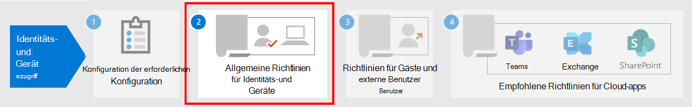

# Erforderliche Arbeit für die Implementierung von Identitäts- und Gerätezugriffsrichtlinien

In diesem Artikel werden die Voraussetzungen beschrieben, die Administratoren erfüllen müssen, um empfohlene Identitäts- und Gerätezugriffsrichtlinien zu verwenden und bedingten Zugriff zu verwenden. Außerdem werden die empfohlenen Standardwerte für die Konfiguration von Clientplattformen für die beste SSO (Single Sign-On)-Erfahrung erläutert.

## Voraussetzungen

Bevor Sie die empfohlenen Identitäts- und Gerätezugriffsrichtlinien verwenden, muss Ihre Organisation die Voraussetzungen erfüllen. Die Anforderungen für die verschiedenen aufgeführten Identitäts- und Authentifizierungsmodelle unterscheiden sich:

- Rein cloudbasiert
- Hybrid mit #A0 (Password Hash Sync, Kennworthashsynchronisierung)
- Hybrid mit Pass-Through-Authentifizierung (PTA)
- Verbund

In der folgenden Tabelle sind die erforderlichen Features und deren Konfiguration aufgeführt, die für alle Identitätsmodelle gelten, sofern nicht angegeben.

|Konfiguration|Ausnahmen|
|---|:---:|
|[Konfigurieren sie PHS](https://docs.microsoft.com/azure/active-directory/hybrid/how-to-connect-password-hash-synchronization).  Dies muss aktiviert sein, um nicht gespeicherte Anmeldeinformationen zu erkennen und für risikobasierten bedingten Zugriff darauf zu handeln. **Hinweis:** Dies ist unabhängig davon erforderlich, ob Ihre Organisation verbundbasierte Authentifizierung verwendet.|Rein cloudbasiert|
|[Ermöglichen Sie das nahtlose einmalige Anmelden,](https://docs.microsoft.com/azure/active-directory/connect/active-directory-aadconnect-sso) um Benutzer automatisch zu anmelden, wenn sie sich auf ihren Organisationsgeräten befinden, die mit Ihrem Organisationsnetzwerk verbunden sind.|Nur-Cloud und Verbund|
|[Konfigurieren sie benannte Netzwerke.](https://docs.microsoft.com/azure/active-directory/active-directory-known-networks-azure-portal) Azure AD Identity Protection sammelt und analysiert alle verfügbaren Sitzungsdaten, um eine Risikobewertung zu generieren. Es wird empfohlen, die öffentlichen IP-Bereiche Ihrer Organisation für Ihr Netzwerk in der Konfiguration mit benannten Azure AD-Netzwerken anzugeben. Datenverkehr, der aus diesen Bereichen kommt, wird mit einer reduzierten Risikobewertung und Datenverkehr von außerhalb der Unternehmensumgebung mit einer höheren Risikobewertung benotet.||
|[Registrieren Sie alle Benutzer für die Self-Service-Kennwortzurücksetzung (Self-Service Password Reset, SSPR) und die mehrstufige Authentifizierung (MFA).](https://docs.microsoft.com/azure/active-directory/authentication/concept-registration-mfa-sspr-converged) Es wird empfohlen, Benutzer im Voraus für die mehrstufige Azure AD-Authentifizierung zu registrieren. Azure AD Identity Protection verwendet azure AD Multi-Factor Authentication, um eine zusätzliche Sicherheitsüberprüfung durchzuführen. Darüber hinaus empfehlen wir Benutzern, die Microsoft [Authenticator-App](https://docs.microsoft.com/azure/active-directory/user-help/microsoft-authenticator-app-how-to) und die Microsoft Company Portal-App auf ihren Geräten zu installieren, um eine optimale Anmeldeerfahrung zu bieten. Diese können aus dem App Store für jede Plattform installiert werden.||
|[Aktivieren Sie die automatische Geräteregistrierung für in die Domäne beigetretene Windows-Computer.](https://docs.microsoft.com/azure/active-directory/active-directory-conditional-access-automatic-device-registration-setup) Der bedingte Zugriff sorgt dafür, dass Geräte, die eine Verbindung mit Apps herstellen, domänenverbindet oder kompatibel sind. Um dies auf Windows-Computern zu unterstützen, muss das Gerät bei Azure AD registriert werden.  In diesem Artikel wird die Konfiguration der automatischen Geräteregistrierung erläutert.|Rein cloudbasiert|
|**Vorbereiten Ihres Supportteams**: Sie sollten vorausplanen, wie Sie mit Benutzern umgehen, die keine MFA durchführen können. Sie können sie z.B. Dies kann das Hinzufügen zu einer Richtlinienausschlussgruppe oder das Registrieren neuer MFA-Informationen sein. Bevor Sie eine dieser sicherheitssensiblen Änderungen vornehmen, müssen Sie sicherstellen, dass der tatsächliche Benutzer die Anforderung stellt. Es kann hilfreich sein, den Vorgesetzten des Benutzers bei der Genehmigung mit einzubeziehen.||
|[Konfigurieren Sie das Kennwortrückschreiben in lokales AD](https://docs.microsoft.com/azure/active-directory/active-directory-passwords-getting-started). Mit dem Kennwortrückschreiben kann Azure AD festlegen, dass Benutzer ihre lokalen Kennwörter ändern müssen, wenn eine Gefährdung des Kontos mit hohem Risiko erkannt wird. Sie können dieses Feature mithilfe von Azure AD Connect  auf eine von zwei Arten aktivieren: Aktivieren Sie entweder das Kennwortrückschreiben im Bildschirm mit den optionalen Features des Azure AD Connect-Setup-Assistenten, oder aktivieren Sie es über Windows PowerShell.|Rein cloudbasiert|
|[Konfigurieren Sie den Azure AD-Kennwortschutz.](https://docs.microsoft.com/azure/active-directory/authentication/concept-password-ban-bad) Der Azure AD-Kennwortschutz erkennt und blockiert als schwach bekannte Kennwörter und deren Varianten und kann zusätzlich für Ihre Organisation spezifische schwache Ausdrücke blockieren. Listen standardmäßig global gesperrter Kennwörter werden automatisch auf alle Benutzer in einem Azure AD-Mandanten angewendet. Sie können zusätzliche Einträge in einer benutzerdefinierten Liste gesperrter Kennwörter angeben. Wenn Benutzer ihre Kennwörter ändern oder zurücksetzen, werden diese Listen gesperrter Kennwörter überprüft, um die Verwendung von sicheren Kennwörtern zu erzwingen.||
|[Aktivieren Sie Azure Active Directory Identity Protection.](https://docs.microsoft.com/azure/active-directory/identity-protection/overview-identity-protection) Azure AD Identity Protection ermöglicht es Ihnen, potenzielle Sicherheitsrisiken zu erkennen, die sich auf die IdentitätEn Ihrer Organisation auszunutzen, und eine automatisierte Wartungsrichtlinie für ein niedriges, mittleres und hohes Anmelde- und Benutzerrisiko zu konfigurieren.||
|**Aktivieren Sie die moderne** [Authentifizierung für Exchange Online](https://docs.microsoft.com/Exchange/clients-and-mobile-in-exchange-online/enable-or-disable-modern-authentication-in-exchange-online) und Skype for Business [Online.](https://social.technet.microsoft.com/wiki/contents/articles/34339.skype-for-business-online-enable-your-tenant-for-modern-authentication.aspx) Die moderne Authentifizierung ist eine Voraussetzung für die Verwendung von MFA. Die moderne Authentifizierung ist standardmäßig für Office 2016- und 2019-Clients, SharePoint und OneDrive for Business aktiviert.||
|

## Empfohlene Clientkonfigurationen

In diesem Abschnitt werden die von uns empfohlenen Standardkonfigurationen für Plattformclients beschrieben, um ihren Benutzern die beste SSO-Erfahrung sowie die technischen Voraussetzungen für bedingten Zugriff zu bieten.

### Windows-Geräte

Wir empfehlen Windows 10 (Version 2004 oder höher), da Azure für die reibungsloseste SSO-Erfahrung konzipiert ist, die sowohl für lokale als auch für Azure AD möglich ist. Von Arbeits- oder Schuleinrichtungen ausgestellte Geräte sollten so konfiguriert werden, dass sie Azure AD direkt beitreten, oder wenn die Organisation den lokalen Ad-Domänen-Beitritt verwendet, sollten diese Geräte für die automatische und automatische Registrierung bei Azure AD konfiguriert [werden.](https://docs.microsoft.com/azure/active-directory/active-directory-conditional-access-automatic-device-registration-setup)

Für BYOD -Windows-Geräte können Benutzer das Konto **"Arbeits- oder Schulkonto hinzufügen" verwenden.** Beachten Sie, dass Benutzer des Google Chrome-Browsers  auf Windows 10-Geräten eine Erweiterung installieren müssen, um die gleiche reibungslose Anmeldeerfahrung wie Microsoft Edge-Benutzer zu erhalten. Wenn Ihre Organisation über Domänengeräte Windows 8 oder 8.1-Geräte verfügt, können Sie Microsoft Workplace Join auch für Nicht-Windows 10-Computer installieren. [Laden Sie das Paket herunter, um die](https://www.microsoft.com/download/details.aspx?id=53554) Geräte bei Azure AD zu registrieren.

### iOS-Geräte

Es wird empfohlen, die [Microsoft Authenticator-App](https://docs.microsoft.com/azure/multi-factor-authentication/end-user/microsoft-authenticator-app-how-to) auf Benutzergeräten zu installieren, bevor Sie Richtlinien für bedingten Zugriff oder MFA bereitstellen. Die App sollte mindestens installiert werden, wenn Benutzer aufgefordert werden, ihr Gerät bei Azure AD zu registrieren, indem sie ein Firmen- oder Schulkonto hinzufügen oder wenn sie die Intune-Unternehmensportal-App installieren, um ihr Gerät für die Verwaltung zu registrieren. Dies hängt von der konfigurierten Richtlinie für bedingten Zugriff ab.

### Android-Geräte

Es wird empfohlen, dass Benutzer die [Intune-Unternehmensportal-App](https://play.google.com/store/apps/details?id=com.microsoft.windowsintune.companyportal&hl=en) und [die Microsoft Authenticator-App](https://docs.microsoft.com/azure/multi-factor-authentication/end-user/microsoft-authenticator-app-how-to) installieren, bevor Richtlinien für bedingten Zugriff bereitgestellt werden oder wenn dies bei bestimmten Authentifizierungsversuchen erforderlich ist. Nach der Installation der App können Benutzer aufgefordert werden, sich mit Azure AD zu registrieren oder ihr Gerät bei Intune zu registrieren. Dies hängt von der konfigurierten Richtlinie für bedingten Zugriff ab.

Es wird außerdem empfohlen, geräte im Besitz der Organisation auf OEMs und Versionen zu standardisieren, die Android for Work oder Samsung Knox unterstützen, damit E-Mail-Konten verwaltet und durch intune-MDM-Richtlinien geschützt werden können.

### Empfohlene E-Mail-Clients

Die folgenden E-Mail-Clients unterstützen moderne Authentifizierung und bedingten Zugriff.

|Plattform|Client|Version/Hinweise|
|---|---|---|
|**Windows**|Outlook|2019, 2016, 2013 
 [Aktivieren der modernen Authentifizierung](https://docs.microsoft.com/microsoft-365/admin/security-and-compliance/enable-modern-authentication) 
 [Erforderliche Updates](https://support.office.com/article/Outlook-Updates-472c2322-23a4-4014-8f02-bbc09ad62213)|
|**iOS**|Outlook für iOS|[Neueste Version](https://itunes.apple.com/us/app/microsoft-outlook-email-and-calendar/id951937596?mt=8)|
|**Android**|Outlook für Android|[Neueste Version](https://play.google.com/store/apps/details?id=com.microsoft.office.outlook&hl=en)|
|**macOS**|Outlook|2019 und 2016|
|**Linux**|Nicht unterstützt||
|

### Empfohlene Clientplattformen für den Schutz von Dokumenten

Die folgenden Clients werden empfohlen, wenn eine Richtlinie für sichere Dokumente angewendet wurde.

|Plattform|Word/Excel/PowerPoint|OneNote|OneDrive-App|SharePoint-App|[OneDrive-Synchronisierungsclient](https://docs.microsoft.com/onedrive/enable-conditional-access)|
|---|---|---|---|---|---|
|Windows 8.1|Unterstützt|Unterstützt|Nicht zutreffend|Nicht zutreffend|Unterstützt|
|Windows 10|Unterstützt|Unterstützt|Nicht zutreffend|Nicht zutreffend|Unterstützt|
|Android|Unterstützt|Unterstützt|Unterstützt|Unterstützt|N/V|
|iOS|Unterstützt|Unterstützt|Unterstützt|Unterstützt|N/V|
|macOS|Unterstützt|Unterstützt|Nicht zutreffend|Nicht zutreffend|Nicht unterstützt|
|Linux|Nicht unterstützt|Nicht unterstützt|Nicht unterstützt|Nicht unterstützt|Nicht unterstützt|
|

### Microsoft 365-Clientunterstützung

Weitere Informationen zur Clientunterstützung in Microsoft 365 finden Sie in den folgenden Artikeln:

- [Microsoft 365-Client-App-Unterstützung – Bedingter Zugriff](../../enterprise/microsoft-365-client-support-conditional-access.md)
- [Microsoft 365-Client-App-Unterstützung – Mehrstufige Authentifizierung](../../enterprise/microsoft-365-client-support-multi-factor-authentication.md)

## Schützen von Administratorkonten

Für Microsoft 365 E3 oder E5 oder mit separaten Azure AD Premium P1- oder P2-Lizenzen können Sie MFA für Administratorkonten mit einer manuell erstellten Richtlinie für bedingten Zugriff festlegen. Weitere [Informationen finden Sie unter "Bedingter Zugriff:MFA für Administratoren](https://docs.microsoft.com/azure/active-directory/conditional-access/howto-conditional-access-policy-admin-mfa) erforderlich".

Für Editionen von Microsoft 365 oder Office 365,  die bedingten Zugriff nicht unterstützen, können Sie für Sicherheitseinstellungen MFA für alle Konten aktivieren.

Hier sind einige zusätzliche Empfehlungen:

- Verwenden [Sie Azure AD Privileged Identity Management,](https://docs.microsoft.com/azure/active-directory/privileged-identity-management/pim-getting-started) um die Anzahl beständiger Administratorkonten zu reduzieren.
- [Verwenden Sie privileged Access Management,](../../compliance/privileged-access-management-overview.md) um Ihre Organisation vor Sicherheitsverletzungen zu schützen, die vorhandene privilegierte Administratorkonten mit ständigem Zugriff auf vertrauliche Daten oder Zugriff auf kritische Konfigurationseinstellungen verwenden.
- Erstellen und verwenden Sie separate Konten, denen [Microsoft 365-Administratorrollen](https://docs.microsoft.com/microsoft-365/admin/add-users/about-admin-roles) nur für die *Verwaltung zugewiesen sind.* Administratoren sollten über ein eigenes Benutzerkonto für die regelmäßige nicht administrative Verwendung verfügen und nur bei Bedarf ein Administratorkonto verwenden, um eine Aufgabe auszuführen, die mit ihrer Rolle oder Jobfunktion verknüpft ist.
- Befolgen [Sie bewährte Methoden](https://docs.microsoft.com/azure/active-directory/admin-roles-best-practices) zum Sichern privilegierter Konten in Azure AD.

## Nächster Schritt

[Konfigurieren der allgemeinen Identitäts- und Gerätezugriffsrichtlinien](identity-access-policies.md)
