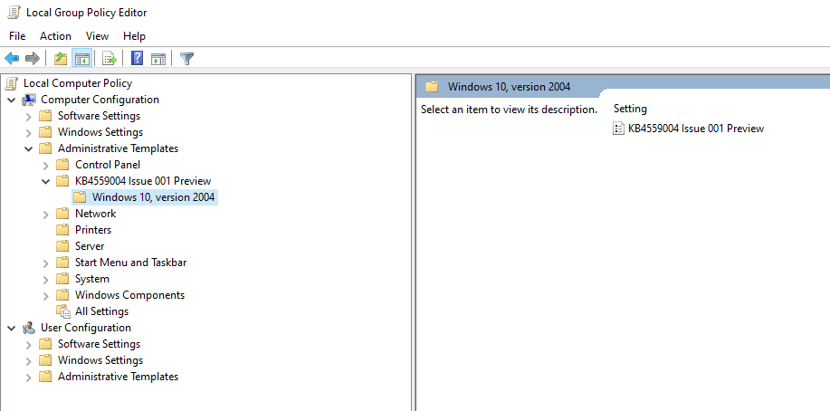

# <a name="application-guard-for-office-public-preview-for-admins"></a><span data-ttu-id="714a1-105">Application Guard für Office (Public Preview) für Administratoren</span><span class="sxs-lookup"><span data-stu-id="714a1-105">Application Guard for Office (public preview) for admins</span></span>


<span data-ttu-id="714a1-106">**Gilt für:** Word, Excel und PowerPoint für Microsoft 365, Windows 10 Enterprise</span><span class="sxs-lookup"><span data-stu-id="714a1-106">**Applies to:** Word, Excel, and PowerPoint for Microsoft 365, Windows 10 Enterprise</span></span>

>[!IMPORTANT]
><span data-ttu-id="714a1-107">Einige Informationen beziehen sich auf ein vorab veröffentlichtes Produkt, das vor der kommerziellen Veröffentlichung erheblich geändert werden kann.</span><span class="sxs-lookup"><span data-stu-id="714a1-107">Some information relates to a prereleased product which may be substantially modified before it's commercially released.</span></span> <span data-ttu-id="714a1-108">Microsoft übernimmt mit diesen Informationen keinerlei Gewährleistung, sei sie ausdrücklich oder konkludent.</span><span class="sxs-lookup"><span data-stu-id="714a1-108">Microsoft makes no warranties, express or implied, with respect to the information provided here.</span></span>


<span data-ttu-id="714a1-109">Microsoft Defender Application Guard für Office (Application Guard für Office) hilft zu verhindern, dass nicht vertrauenswürdige Dateien auf vertrauenswürdige Ressourcen zugreifen, sodass Ihr Unternehmen vor neuen und neu auftretenden Angriffen geschützt ist.</span><span class="sxs-lookup"><span data-stu-id="714a1-109">Microsoft Defender Application Guard for Office (Application Guard for Office) helps prevent untrusted files from accessing trusted resources, keeping your enterprise safe from new and emerging attacks.</span></span> <span data-ttu-id="714a1-110">In diesem Artikel werden die Administratoren durch das Einrichten von Geräten für eine Vorschau des Application Guard für Office unterwandert.</span><span class="sxs-lookup"><span data-stu-id="714a1-110">This article walks admins through setting up devices for a preview of Application Guard for Office.</span></span> <span data-ttu-id="714a1-111">Es enthält Informationen zu Systemanforderungen und Installationsschritten, um Application Guard für Office auf einem Gerät zu aktivieren.</span><span class="sxs-lookup"><span data-stu-id="714a1-111">It provides information about system requirements and installation steps to enable Application Guard for Office on a device.</span></span>

## <a name="prerequisites"></a><span data-ttu-id="714a1-112">Voraussetzungen</span><span class="sxs-lookup"><span data-stu-id="714a1-112">Prerequisites</span></span>

### <a name="minimum-hardware-requirements"></a><span data-ttu-id="714a1-113">Minimale Hardwareanforderungen</span><span class="sxs-lookup"><span data-stu-id="714a1-113">Minimum hardware requirements</span></span>

* <span data-ttu-id="714a1-114">**CPU**: 64-Bit, 4 Kerne (physisch oder virtuell), Virtualization Extensions (Intel VT-x oder AMD-V), Core i5 Äquivalent oder höher empfohlen</span><span class="sxs-lookup"><span data-stu-id="714a1-114">**CPU**: 64-bit, 4 cores (physical or virtual), virtualization extensions   (Intel VT-x OR AMD-V), Core i5 equivalent or higher recommended</span></span>
* <span data-ttu-id="714a1-115">**Physischer Arbeitsspeicher**: 8 GB RAM</span><span class="sxs-lookup"><span data-stu-id="714a1-115">**Physical memory**: 8-GB RAM</span></span>
* <span data-ttu-id="714a1-116">**Festplatte**: 10 GB freier Speicherplatz auf dem Systemlaufwerk (SSD empfohlen)</span><span class="sxs-lookup"><span data-stu-id="714a1-116">**Hard disk**: 10 GB of free space on the system drive (SSD recommended)</span></span>

### <a name="minimum-software-requirements"></a><span data-ttu-id="714a1-117">Mindestanforderungen an die Software</span><span class="sxs-lookup"><span data-stu-id="714a1-117">Minimum software requirements</span></span>

* <span data-ttu-id="714a1-118">**Windows 10**: Windows 10 Enterprise Edition, Client Build Version 2004 (20H1) Build 19041</span><span class="sxs-lookup"><span data-stu-id="714a1-118">**Windows 10**: Windows 10 Enterprise edition, Client Build version 2004 (20H1) build 19041</span></span>
* <span data-ttu-id="714a1-119">**Office**: Office Beta Channel Build Version 2008 16.0.13212 oder höher</span><span class="sxs-lookup"><span data-stu-id="714a1-119">**Office**: Office Beta Channel Build version 2008 16.0.13212 or later</span></span>
* <span data-ttu-id="714a1-120">**Update Paket**: kumulative monatliche Sicherheitsupdates für Windows 10 [KB4566782](https://support.microsoft.com/help/4566782/windows-10-update-kb4566782)</span><span class="sxs-lookup"><span data-stu-id="714a1-120">**Update package**: Windows 10 cumulative monthly security updates [KB4566782](https://support.microsoft.com/help/4566782/windows-10-update-kb4566782)</span></span> 

<span data-ttu-id="714a1-121">Ausführliche Systemanforderungen finden Sie unter [System Requirements for Microsoft Defender Application Guard](https://docs.microsoft.com/windows/security/threat-protection/microsoft-defender-application-guard/reqs-md-app-guard).</span><span class="sxs-lookup"><span data-stu-id="714a1-121">For detailed system requirements, refer to [System requirements for Microsoft Defender Application Guard](https://docs.microsoft.com/windows/security/threat-protection/microsoft-defender-application-guard/reqs-md-app-guard).</span></span> <span data-ttu-id="714a1-122">Weitere Informationen zu Builds für Office-Insider-Vorschau finden Sie unter [Erste Schritte bei der Bereitstellung von Office-Insider-Builds](https://insider.office.com/business/deploy).</span><span class="sxs-lookup"><span data-stu-id="714a1-122">To learn more about Office Insider Preview builds, refer to [Getting started on deploying Office Insider builds](https://insider.office.com/business/deploy).</span></span>

### <a name="licensing-requirements"></a><span data-ttu-id="714a1-123">Lizenzierungsanforderungen</span><span class="sxs-lookup"><span data-stu-id="714a1-123">Licensing requirements</span></span>
* <span data-ttu-id="714a1-124">Microsoft 365 E5 oder Microsoft 365 E5-Sicherheit</span><span class="sxs-lookup"><span data-stu-id="714a1-124">Microsoft 365 E5 or Microsoft 365 E5 Security</span></span>

## <a name="deploy-application-guard-for-office"></a><span data-ttu-id="714a1-125">Bereitstellen von Application Guard für Office</span><span class="sxs-lookup"><span data-stu-id="714a1-125">Deploy Application Guard for Office</span></span>

### <a name="enable-application-guard-for-office"></a><span data-ttu-id="714a1-126">Aktivieren von Application Guard für Office</span><span class="sxs-lookup"><span data-stu-id="714a1-126">Enable Application Guard for Office</span></span>

1.  <span data-ttu-id="714a1-127">Herunterladen und Installieren von **kumulativen monatlichen Sicherheitsupdates für Windows 10 KB4566782**.</span><span class="sxs-lookup"><span data-stu-id="714a1-127">Download and install **Windows 10 cumulative monthly security updates KB4566782**.</span></span> 

2. <span data-ttu-id="714a1-128">Herunterladen und installieren [**von Application Guard für Office-Feature-Aktivierungspaket**](https://download.microsoft.com/download/e/4/c/e4c1180a-fcff-462a-8324-4151c44973a8/Windows%20Preview%20-%20WDAG%20Office%20070920%2001.msi).</span><span class="sxs-lookup"><span data-stu-id="714a1-128">Download and install [**Application Guard for Office Feature enablement package**](https://download.microsoft.com/download/e/4/c/e4c1180a-fcff-462a-8324-4151c44973a8/Windows%20Preview%20-%20WDAG%20Office%20070920%2001.msi).</span></span> <span data-ttu-id="714a1-129">Dieses Paket installiert eine Gruppenrichtlinie namens "KB4559004 Issue 001 Preview" unter **Computer Benutzerkonfiguration\Administrative Templates**.</span><span class="sxs-lookup"><span data-stu-id="714a1-129">This package installs a group policy called "KB4559004 Issue 001 Preview" under **Computer Configuration\Administrative Templates**.</span></span> <span data-ttu-id="714a1-130">Legen Sie diese Gruppenrichtlinie auf **aktiviert**fest.</span><span class="sxs-lookup"><span data-stu-id="714a1-130">Set this group policy  to **Enabled**.</span></span>
     <span data-ttu-id="714a1-131"></span><span class="sxs-lookup"><span data-stu-id="714a1-131"></span></span>

     

    <span data-ttu-id="714a1-133">Sie können auch die folgenden reg-Schlüssel direkt festlegen:</span><span class="sxs-lookup"><span data-stu-id="714a1-133">You can also directly set the following reg keys:</span></span> 
    
    ```
    reg add HKLM\SYSTEM\CurrentControlSet\Policies\Microsoft\FeatureManagement\Overrides /v 3457697930 /t REG_DWORD /d 1 
    ```
    ```
    reg add HKLM\SYSTEM\CurrentControlSet\Policies\Microsoft\FeatureManagement\Overrides /v 94539402 /t REG_DWORD /d 1 
    ```
    <span data-ttu-id="714a1-134">Führen Sie dann diesen PowerShell-Befehl aus:</span><span class="sxs-lookup"><span data-stu-id="714a1-134">Then, run this PowerShell command:</span></span> 
    
    ```powershell
    Get-ScheduledTask -TaskName "ReconcileFeatures" -TaskPath "\Microsoft\Windows\Flighting\FeatureConfig\" | Start-ScheduledTask 
    ```

3.  <span data-ttu-id="714a1-135">Wählen Sie **Microsoft Defender Application Guard** unter Windows-Features aus, und klicken Sie auf **OK**.</span><span class="sxs-lookup"><span data-stu-id="714a1-135">Select **Microsoft Defender Application Guard** under Windows Features and select **OK**.</span></span> <span data-ttu-id="714a1-136">Durch Aktivieren des Application Guard-Features wird ein Systemneustart aufgefordert.</span><span class="sxs-lookup"><span data-stu-id="714a1-136">Enabling the Application Guard feature will prompt a system reboot.</span></span> <span data-ttu-id="714a1-137">Sie können entscheiden, ob Sie jetzt oder nach Schritt 4 einen Neustart durchführen möchten.</span><span class="sxs-lookup"><span data-stu-id="714a1-137">You can choose to reboot now or after step 4.</span></span>

    
    
    <span data-ttu-id="714a1-139">Das Feature kann auch durch Ausführen des folgenden PowerShell-Befehls als Administrator aktiviert werden:</span><span class="sxs-lookup"><span data-stu-id="714a1-139">The feature can also be enabled by running the following PowerShell command as administrator:</span></span> 

    ```powershell
    Enable-WindowsOptionalFeature -online -FeatureName Windows-Defender-ApplicationGuard 
    ```

4.  <span data-ttu-id="714a1-140">Suchen Sie nach dem Microsoft Defender Application Guard im Managed Mode-Gruppenrichtlinien unter **Computer Configuration \\ Administrative Templates \\ Windows Components \\ Microsoft Defender Application Guard**.</span><span class="sxs-lookup"><span data-stu-id="714a1-140">Look for the Microsoft Defender Application Guard in Managed Mode group policy located at **Computer Configuration\\Administrative Templates\\Windows Components\\Microsoft Defender Application Guard**.</span></span> <span data-ttu-id="714a1-141">Aktivieren Sie diese Richtlinie, indem Sie den Wert unter Optionen als **2** oder **3** festlegen und dann **OK** oder über **nehmen**auswählen.</span><span class="sxs-lookup"><span data-stu-id="714a1-141">Turn this policy on by setting the value under Options as **2** or **3** then selecting **OK** or **Apply**.</span></span>

    
  
    <span data-ttu-id="714a1-143">Alternativ können Sie die entsprechende CSP-Richtlinie festlegen:</span><span class="sxs-lookup"><span data-stu-id="714a1-143">Alternatively, you can set the corresponding CSP policy:</span></span> 

    <span data-ttu-id="714a1-144">Oma-URI: **./Device/Vendor/MSFT/WindowsDefenderApplicationGuard/Settings/AllowWindowsDefenderApplicationGuard** 
    </span><span class="sxs-lookup"><span data-stu-id="714a1-144">OMA-URI: **./Device/Vendor/MSFT/WindowsDefenderApplicationGuard/Settings/AllowWindowsDefenderApplicationGuard** 
    </span></span><br><span data-ttu-id="714a1-145">Datentyp: **Integer** 
</span><span class="sxs-lookup"><span data-stu-id="714a1-145">Data type: **Integer** 
</span></span><br><span data-ttu-id="714a1-146">Wert: **2**</span><span class="sxs-lookup"><span data-stu-id="714a1-146">Value: **2**</span></span>


5.  <span data-ttu-id="714a1-147">Starten Sie das System neu.</span><span class="sxs-lookup"><span data-stu-id="714a1-147">Reboot the system.</span></span>

### <a name="set-diagnostics--feedback-to-send-full-data"></a><span data-ttu-id="714a1-148">Festlegen der Diagnose & Feedback zum Senden vollständiger Daten</span><span class="sxs-lookup"><span data-stu-id="714a1-148">Set Diagnostics & feedback to send full data</span></span>

<span data-ttu-id="714a1-149">In diesem Schritt wird sichergestellt, dass die zum Identifizieren und Beheben von Problemen erforderlichen Daten Microsoft erreichen.</span><span class="sxs-lookup"><span data-stu-id="714a1-149">This step ensures that the data necessary to identify and fix problems is reaching Microsoft.</span></span> <span data-ttu-id="714a1-150">Führen Sie die folgenden Schritte aus, um die Diagnose auf Ihrem Windows-Gerät zu aktivieren:</span><span class="sxs-lookup"><span data-stu-id="714a1-150">Follow these steps to enable diagnostics on your Windows device:</span></span>

1.  <span data-ttu-id="714a1-151">Öffnen Sie im Startmenü **Einstellungen** .</span><span class="sxs-lookup"><span data-stu-id="714a1-151">Open **Settings** from the Start menu.</span></span>

    

2.  <span data-ttu-id="714a1-153">Wählen Sie unter **Windows-Einstellungen**die Option **Datenschutz**aus.</span><span class="sxs-lookup"><span data-stu-id="714a1-153">On **Windows Settings**, select **Privacy**.</span></span>

    

3.  <span data-ttu-id="714a1-155">Wählen Sie unter Datenschutz die Option **Diagnose & Feedback** aus, und wählen Sie **optionale Diagnosedaten**aus.</span><span class="sxs-lookup"><span data-stu-id="714a1-155">Under Privacy, select **Diagnostics & feedback** and select **Optional diagnostic data**.</span></span>

    

<span data-ttu-id="714a1-157">Weitere Informationen zum Konfigurieren von Windows-Diagnoseeinstellungen finden Sie unter [Konfigurieren von Windows-Diagnosedaten in Ihrer Organisation](https://docs.microsoft.com/windows/privacy/configure-windows-diagnostic-data-in-your-organization#enterprise-management).</span><span class="sxs-lookup"><span data-stu-id="714a1-157">For more on configuring Windows diagnostic settings, refer to [Configuring Windows diagnostic data in your organization](https://docs.microsoft.com/windows/privacy/configure-windows-diagnostic-data-in-your-organization#enterprise-management).</span></span>

### <a name="confirm-that-application-guard-for-office-is-enabled-and-working"></a><span data-ttu-id="714a1-158">Sicherstellen, dass Application Guard für Office aktiviert und funktionsfähig ist</span><span class="sxs-lookup"><span data-stu-id="714a1-158">Confirm that Application Guard for Office is enabled and working</span></span>

<span data-ttu-id="714a1-159">Bevor Sie bestätigen, dass der Application Guard für Office aktiviert ist, starten Sie Word, Excel oder PowerPoint auf einem Gerät, auf dem die Richtlinien bereitgestellt wurden.</span><span class="sxs-lookup"><span data-stu-id="714a1-159">Before confirming that the Application Guard for Office is enabled, launch Word, Excel, or PowerPoint on a device where the policies have been deployed.</span></span> <span data-ttu-id="714a1-160">Stellen Sie sicher, dass Office aktiviert ist.</span><span class="sxs-lookup"><span data-stu-id="714a1-160">Make sure Office is activated.</span></span> <span data-ttu-id="714a1-161">Möglicherweise müssen Sie Ihre Arbeitsidentität verwenden, um das Office-Produkt zuerst zu aktivieren.</span><span class="sxs-lookup"><span data-stu-id="714a1-161">You may need to use your work identity to activate the Office product first.</span></span>

<span data-ttu-id="714a1-162">Um zu bestätigen, dass Application Guard für Office jetzt aktiviert ist, starten Sie Word, Excel oder PowerPoint, und öffnen Sie ein nicht vertrauenswürdiges Dokument.</span><span class="sxs-lookup"><span data-stu-id="714a1-162">To confirm that Application Guard for Office is now enabled, launch Word, Excel, or PowerPoint and open an untrusted document.</span></span> <span data-ttu-id="714a1-163">Sie können beispielsweise ein aus dem Internet heruntergeladenes Dokument oder eine e-Mail-Anlage von einer Person außerhalb Ihrer Organisation öffnen.</span><span class="sxs-lookup"><span data-stu-id="714a1-163">For example, you can open a document downloaded from the internet or an email attachment from someone outside your organization.</span></span>

<span data-ttu-id="714a1-164">Beim ersten Start einer nicht vertrauenswürdigen Datei wird möglicherweise ein Begrüßungsbildschirm für Office wie unten angezeigt.</span><span class="sxs-lookup"><span data-stu-id="714a1-164">On the first launch of an untrusted file, you may see an Office splash screen like the one below.</span></span> <span data-ttu-id="714a1-165">Es kann während einiger Zeit angezeigt werden, während Application Guard für Office aktiviert wird und die Datei geöffnet wird.</span><span class="sxs-lookup"><span data-stu-id="714a1-165">It might show for some time while Application Guard for Office is being activated and the file is being opened.</span></span> <span data-ttu-id="714a1-166">Die nachfolgenden Starts von nicht vertrauenswürdigen Dateien sollten schneller erfolgen.</span><span class="sxs-lookup"><span data-stu-id="714a1-166">Subsequent launches of untrusted files should be faster.</span></span>


<span data-ttu-id="714a1-168">Nach dem Öffnen sollte die Datei einige visuelle Indikatoren anzeigen, die die Datei in Application Guard für Office geöffnet wurde:</span><span class="sxs-lookup"><span data-stu-id="714a1-168">Upon being opened, the file should display a few visual indicators that the file was opened inside Application Guard for Office:</span></span>

* <span data-ttu-id="714a1-169">Eine Legende im Menüband</span><span class="sxs-lookup"><span data-stu-id="714a1-169">A callout in the ribbon</span></span>

    
* <span data-ttu-id="714a1-171">Das Anwendungssymbol mit einem Schild in der Taskleiste</span><span class="sxs-lookup"><span data-stu-id="714a1-171">The application icon with a shield in the taskbar</span></span> 

    


## <a name="configure-application-guard-for-office"></a><span data-ttu-id="714a1-173">Konfigurieren von Application Guard für Office</span><span class="sxs-lookup"><span data-stu-id="714a1-173">Configure Application Guard for Office</span></span>
<span data-ttu-id="714a1-174">Office unterstützt die folgenden Richtlinien, damit Sie die Funktionen von Application Guard für Office konfigurieren können.</span><span class="sxs-lookup"><span data-stu-id="714a1-174">Office supports the following policies to enable you to configure the capabilities of Application Guard for Office.</span></span> <span data-ttu-id="714a1-175">Diese Richtlinien können über Gruppenrichtlinien oder über den Office-Cloud-Richtlinien Dienst konfiguriert werden.</span><span class="sxs-lookup"><span data-stu-id="714a1-175">These policies can be configured through Group policies or through the Office cloud policy service.</span></span> 

>[!NOTE] 
> <span data-ttu-id="714a1-176">Diese Richtlinien werden in Kürze verfügbar sein.</span><span class="sxs-lookup"><span data-stu-id="714a1-176">These policies will become available soon.</span></span>
><span data-ttu-id="714a1-177">Außerdem kann das Konfigurieren dieser Richtlinien einige Funktionen für Dateien deaktivieren, die in Application Guard für Office geöffnet wurden.</span><span class="sxs-lookup"><span data-stu-id="714a1-177">Also, configuring these policies can disable some functionalities for files opened in Application Guard for Office.</span></span>

| <span data-ttu-id="714a1-178">Richtlinie</span><span class="sxs-lookup"><span data-stu-id="714a1-178">Policy</span></span>                                                                          | <span data-ttu-id="714a1-179">Beschreibung</span><span class="sxs-lookup"><span data-stu-id="714a1-179">Description</span></span>                                                                                                                                                                                                                                                                                             |
|---------------------------------------------------------------------------------|---------------------------------------------------------------------------------------------------------------------------------------------------------------------------------------------------------------------------------------------------------------------------------------------------------|
| <span data-ttu-id="714a1-180">Deaktivieren von Application Guard für Office</span><span class="sxs-lookup"><span data-stu-id="714a1-180">Disable Application Guard for Office</span></span>                                            | <span data-ttu-id="714a1-181">Durch Aktivieren dieser Richtlinie wird erzwungen, dass Word, Excel und PowerPoint den geschützten Ansichts Isolations Container anstelle von Application Guard für Office verwenden.</span><span class="sxs-lookup"><span data-stu-id="714a1-181">Enabling this policy will force Word, Excel, and PowerPoint to use the Protected View isolation container instead of Application Guard for Office.</span></span> <span data-ttu-id="714a1-182">Diese Richtlinie kann verwendet werden, um den Application Guard für Office vorübergehend zu deaktivieren, wenn Probleme bei der Aktivierung für Edge bestehen.</span><span class="sxs-lookup"><span data-stu-id="714a1-182">This policy can be used to temporarily disable Application Guard for Office when there are issues in leaving it enabled for Edge.</span></span>                                  |
| <span data-ttu-id="714a1-183">Kopieren/Einfügen für in Application Guard geöffnete Dokumente deaktivieren</span><span class="sxs-lookup"><span data-stu-id="714a1-183">Disable copy/paste for documents opened in Application Guard</span></span>                    | <span data-ttu-id="714a1-184">Durch Aktivieren dieser Richtlinie wird verhindert, dass ein Benutzer Inhalte aus einem Dokument kopiert und einfügt, das in Application Guard für Office geöffnet wurde, in einem Dokument, das außerhalb des Dokuments geöffnet wurde.</span><span class="sxs-lookup"><span data-stu-id="714a1-184">Enabling this policy will prevent a user from copying and pasting content from a document opened in Application Guard for Office to a document opened outside it.</span></span>                                                                                                                                   |
| <span data-ttu-id="714a1-185">Verhindern, dass Benutzer den Anwendungsschutz für Dateien entfernen</span><span class="sxs-lookup"><span data-stu-id="714a1-185">Prevent users from removing Application Guard protection on files</span></span>               | <span data-ttu-id="714a1-186">Durch Aktivieren dieser Richtlinie wird die Option (innerhalb der Office-Anwendungsumgebung) entfernt, um den Anwendungsschutz zu deaktivieren oder eine Datei außerhalb des Application Guard-Schutzes zu öffnen.</span><span class="sxs-lookup"><span data-stu-id="714a1-186">Enabling this policy will remove the option (within the Office application experience) to disable Application Guard protection or open a file outside Application Guard.</span></span> <br><br><span data-ttu-id="714a1-187">**Hinweis:** Benutzer können diese Richtlinie weiterhin umgehen, indem Sie die Eigenschaft "Mark-of-the-Internet" manuell aus der Datei entfernen oder ein Dokument an einen vertrauenswürdigen Speicherort verschieben.</span><span class="sxs-lookup"><span data-stu-id="714a1-187">**Note:** Users can still bypass this policy by manually removing the mark-of-the-web property from the file or by moving a document to a Trusted location.</span></span> |
| <span data-ttu-id="714a1-188">Einschränken des Druckens von Dokumenten, die in Application Guard geöffnet wurden</span><span class="sxs-lookup"><span data-stu-id="714a1-188">Restrict printing from documents opened in Application Guard</span></span>                    | <span data-ttu-id="714a1-189">Durch Aktivieren dieser Richtlinie werden Drucker, auf die ein Benutzer drucken kann, aus einer Datei eingeschränkt, die in Application Guard für Office geöffnet wurde.</span><span class="sxs-lookup"><span data-stu-id="714a1-189">Enabling this policy will limit printers a user can print to from a file opened in Application Guard for Office.</span></span> <span data-ttu-id="714a1-190">Beispielsweise können Sie diese Richtlinie verwenden, um Benutzer so einzuschränken, dass Sie nur in PDF drucken.</span><span class="sxs-lookup"><span data-stu-id="714a1-190">For example, you can use this policy to restrict users to only print to PDF.</span></span>                              |
| <span data-ttu-id="714a1-191">Deaktivieren des Kamera-und Mikrofon Zugriffs für in Application Guard geöffnete Dokumente</span><span class="sxs-lookup"><span data-stu-id="714a1-191">Turn off camera and microphone access for documents opened in Application Guard</span></span> | <span data-ttu-id="714a1-192">Durch Aktivieren dieser Richtlinie wird Office-Zugriff auf die Kamera und das Mikrofon in Application Guard für Office entfernt.</span><span class="sxs-lookup"><span data-stu-id="714a1-192">Enabling this policy will remove Office access to Camera and Microphone inside Application Guard for Office.</span></span>                                                                                                                                                                                                     |
>[!NOTE] 
><span data-ttu-id="714a1-193">Die folgenden Richtlinien erfordern, dass der Benutzer sich abmeldet und sich erneut an Windows anmeldet, um wirksam zu werden:</span><span class="sxs-lookup"><span data-stu-id="714a1-193">The following policies will require the user to log off and re-login to Windows to take effect:</span></span>
> 
> *  <span data-ttu-id="714a1-194">Kopieren/Einfügen für in Application Guard geöffnete Dokumente deaktivieren</span><span class="sxs-lookup"><span data-stu-id="714a1-194">Disable copy/paste for documents opened in Application Guard</span></span>
>*  <span data-ttu-id="714a1-195">Einschränken des Druckens für in Application Guard geöffnete Dokumente</span><span class="sxs-lookup"><span data-stu-id="714a1-195">Restrict printing for documents opened in Application Guard</span></span>
> *  <span data-ttu-id="714a1-196">Deaktivieren des Kamera-und Mic-Zugriffs auf Dokumente, die in Application Guard geöffnet wurden</span><span class="sxs-lookup"><span data-stu-id="714a1-196">Turn off camera and mic access to documents opened in Application Guard</span></span>


## <a name="submit-feedback"></a><span data-ttu-id="714a1-197">Feedback senden</span><span class="sxs-lookup"><span data-stu-id="714a1-197">Submit feedback</span></span>

### <a name="submit-feedback-via-feedback-hub"></a><span data-ttu-id="714a1-198">Feedback über Feedback-Hub senden</span><span class="sxs-lookup"><span data-stu-id="714a1-198">Submit feedback via Feedback Hub</span></span>

<span data-ttu-id="714a1-199">Wenn beim Starten von Application Guard für Office Probleme auftreten, werden Sie aufgefordert, Ihr Feedback über Feedback-Hub zu übermitteln:</span><span class="sxs-lookup"><span data-stu-id="714a1-199">If you encounter any issues when launching Application Guard for Office, you are encouraged to submit your feedback via Feedback Hub:</span></span>

1.  <span data-ttu-id="714a1-200">Öffnen Sie die **Feedback-Hub-App** , und melden Sie sich an.</span><span class="sxs-lookup"><span data-stu-id="714a1-200">Open the **Feedback Hub app** and sign in.</span></span>

2.  <span data-ttu-id="714a1-201">Wenn Sie beim Starten von Application Guard ein Fehlerdialogfeld erhalten, wählen Sie im Dialogfeld Fehler die Option **Bericht an Microsoft** aus, um eine neue Feedback Übermittlung zu starten.</span><span class="sxs-lookup"><span data-stu-id="714a1-201">If you get an error dialog while launching Application Guard, select **Report to Microsoft** in the error dialog to start a new feedback submission.</span></span> <span data-ttu-id="714a1-202">Navigieren Sie andernfalls zu, <https://aka.ms/wdagoffice-fb> um die richtige Kategorie für den Anwendungsschutz auszuwählen, und wählen Sie dann **+ Neues Feedback** in der oberen rechten Ecke hinzufügen aus.</span><span class="sxs-lookup"><span data-stu-id="714a1-202">Otherwise, navigate to <https://aka.ms/wdagoffice-fb> to select the correct category for Application Guard, then select **+ Add new feedback** near the top right.</span></span>

3.  <span data-ttu-id="714a1-203">Füllen Sie das Feld **Feedback zusammenfassen** aus, falls es nicht bereits für Sie ausgefüllt ist.</span><span class="sxs-lookup"><span data-stu-id="714a1-203">Fill in the **Summarize your feedback** box if it isn’t already filled in for you.</span></span>

4.  <span data-ttu-id="714a1-204">Geben Sie im Feld **EXPLAIN in more Detail** eine ausführliche Beschreibung des Problems ein, das Sie durchgeführt haben, und wählen Sie dann **weiter**aus.</span><span class="sxs-lookup"><span data-stu-id="714a1-204">Fill in the **Explain in more detail** box with a detailed description of the issue you experienced and what steps you took, then select **Next**.</span></span>

5.  <span data-ttu-id="714a1-205">Wählen Sie die Blase neben Problem.</span><span class="sxs-lookup"><span data-stu-id="714a1-205">Select the bubble next to Problem.</span></span> <span data-ttu-id="714a1-206">Stellen Sie sicher, dass es sich bei der ausgewählten Kategorie um **Sicherheit und Datenschutz \> Microsoft Defender Application Guard – Office**handelt, und wählen Sie dann **weiter**aus.</span><span class="sxs-lookup"><span data-stu-id="714a1-206">Make sure the category selected is **Security and Privacy \> Microsoft Defender Application Guard – Office**, then select **Next**.</span></span>

6.  <span data-ttu-id="714a1-207">Wählen Sie **Neues Feedback**und dann **weiter**aus.</span><span class="sxs-lookup"><span data-stu-id="714a1-207">Select **New feedback**, then **Next**.</span></span>

7.  <span data-ttu-id="714a1-208">Sammeln von Ablaufverfolgungen für das Problem:</span><span class="sxs-lookup"><span data-stu-id="714a1-208">Collect traces about the issue:</span></span>

    1. <span data-ttu-id="714a1-209">Erweitern Sie die Kachel **mein Problem neu erstellen** .</span><span class="sxs-lookup"><span data-stu-id="714a1-209">Expand the **Recreate my problem** tile.</span></span>

    2.  <span data-ttu-id="714a1-210">Wenn das auftretende Problem während der Ausführung von Application Guard auftritt, öffnen Sie eine Application Guard-Instanz.</span><span class="sxs-lookup"><span data-stu-id="714a1-210">If the issue you’re experiencing occurs while Application Guard is running, open an Application Guard instance.</span></span> <span data-ttu-id="714a1-211">Auf diese Weise können zusätzliche Ablaufverfolgungen innerhalb des Application Guard-Containers gesammelt werden.</span><span class="sxs-lookup"><span data-stu-id="714a1-211">Doing this allows additional traces to be collected from within the Application Guard container.</span></span>

    3.  <span data-ttu-id="714a1-212">Wählen Sie **Start Aufzeichnung** und warten Sie, bis die Kachel nicht mehr dreht und sagen Sie die *Aufzeichnung beenden*.</span><span class="sxs-lookup"><span data-stu-id="714a1-212">Select **Start recording** and wait for the tile to stop spinning and say *Stop recording*.</span></span>

    4.  <span data-ttu-id="714a1-213">Reproduzieren Sie das Problem mit Application Guard vollständig.</span><span class="sxs-lookup"><span data-stu-id="714a1-213">Fully reproduce the issue with Application Guard.</span></span> <span data-ttu-id="714a1-214">Dies umfasst möglicherweise den Versuch, eine Application Guard-Instanz zu starten und zu warten, bis Sie fehlschlägt oder ein Problem in einer ausgeführten Application Guard-Instanz reproduziert.</span><span class="sxs-lookup"><span data-stu-id="714a1-214">This might include attempting to launch an Application Guard instance and waiting until it fails, or reproducing an issue in a running Application Guard instance.</span></span>

    5.  <span data-ttu-id="714a1-215">Wählen Sie die Kachel **Aufzeichnung beenden** aus.</span><span class="sxs-lookup"><span data-stu-id="714a1-215">Select the **Stop recording** tile.</span></span>

    6.  <span data-ttu-id="714a1-216">Lassen Sie alle ausgeführten Application Guard-Instanzen/s geöffnet, sogar bis einige Minuten nach der Übermittlung, damit die Container Diagnose auch erfasst werden kann.</span><span class="sxs-lookup"><span data-stu-id="714a1-216">Keep any running Application Guard instance/s open, even until a few minutes after submission, so that container diagnostics can also be collected.</span></span>

8.  <span data-ttu-id="714a1-217">Fügen Sie relevante Screenshots oder Dateien im Zusammenhang mit dem Problem hinzu.</span><span class="sxs-lookup"><span data-stu-id="714a1-217">Attach any relevant screenshots or files related to the problem.</span></span>

9.  <span data-ttu-id="714a1-218">Wählen Sie **Senden** aus.</span><span class="sxs-lookup"><span data-stu-id="714a1-218">Select **Submit**.</span></span>


### <a name="submit-feedback-via-office-customer-voice"></a><span data-ttu-id="714a1-219">Übermitteln von Feedback über die Office-Kundenstimme</span><span class="sxs-lookup"><span data-stu-id="714a1-219">Submit feedback via Office Customer Voice</span></span>

<span data-ttu-id="714a1-220">Sie können auch Feedback von in Office senden, wenn das Problem auftritt, wenn Office-Dokumente in Application Guard geöffnet werden.</span><span class="sxs-lookup"><span data-stu-id="714a1-220">You may also submit feedback from within Office if the issue happens when Office documents are opened in Application Guard.</span></span> <span data-ttu-id="714a1-221">Lesen Sie das [Office Insider Handbook](https://insider.office.com/handbook) , um Feedback zu senden.</span><span class="sxs-lookup"><span data-stu-id="714a1-221">Refer to the [Office Insider Handbook](https://insider.office.com/handbook) for submitting feedback.</span></span>

## <a name="integration-with-microsoft-defender-atp-and-office-atp"></a><span data-ttu-id="714a1-222">Integration mit Microsoft Defender ATP und Office ATP</span><span class="sxs-lookup"><span data-stu-id="714a1-222">Integration with Microsoft Defender ATP and Office ATP</span></span>

<span data-ttu-id="714a1-223">Application Guard für Office ist in Microsoft Defender Advance Threat Protection (ATP) integriert, um Überwachung und Warnungen zu böswilligen Aktivitäten in der isolierten Umgebung bereitzustellen.</span><span class="sxs-lookup"><span data-stu-id="714a1-223">Application Guard for Office is integrated with Microsoft Defender Advance Threat Protection (ATP) to provide monitoring and alerting on malicious activity happening in the isolated environment.</span></span>

<span data-ttu-id="714a1-224">Microsoft Defender ATP ist eine Sicherheitsplattform, die dazu dient, Unternehmensnetzwerken beim verhindern, erkennen, untersuchen und reagieren auf Erweiterte Bedrohungen zu unterstützen.</span><span class="sxs-lookup"><span data-stu-id="714a1-224">Microsoft Defender ATP is a security platform designed to help enterprise networks prevent, detect, investigate, and respond to advanced threats.</span></span> <span data-ttu-id="714a1-225">Weitere Informationen zu dieser Plattform finden Sie auf der Seite [Microsoft Defender Advanced Threat Protection](https://www.microsoft.com/microsoft-365/windows/microsoft-defender-atp) .</span><span class="sxs-lookup"><span data-stu-id="714a1-225">For more details about this platform, visit the [Microsoft Defender Advanced Threat Protection](https://www.microsoft.com/microsoft-365/windows/microsoft-defender-atp) page.</span></span> <span data-ttu-id="714a1-226">Erfahren Sie mehr über Onboarding Devices to this Platform on [Bord Devices to the Microsoft Defender ATP Service](https://docs.microsoft.com/windows/security/threat-protection/microsoft-defender-atp/onboard-configure).</span><span class="sxs-lookup"><span data-stu-id="714a1-226">Learn more about onboarding devices to this platform at [Onboard devices to the Microsoft Defender ATP service](https://docs.microsoft.com/windows/security/threat-protection/microsoft-defender-atp/onboard-configure).</span></span>

<span data-ttu-id="714a1-227">Sie können Office 365 ATP auch so konfigurieren, dass es mit Microsoft Defender ATP zusammenarbeitet.</span><span class="sxs-lookup"><span data-stu-id="714a1-227">You can also configure Office 365 ATP to work with Microsoft Defender ATP.</span></span> <span data-ttu-id="714a1-228">Siehe [integrieren von Office 365 ATP mit Microsoft Defender ATP](https://docs.microsoft.com/microsoft-365/security/office-365-security/integrate-office-365-ti-with-wdatp?view=o365-worldwide).</span><span class="sxs-lookup"><span data-stu-id="714a1-228">Refer to [Integrate Office 365 ATP with Microsoft Defender ATP](https://docs.microsoft.com/microsoft-365/security/office-365-security/integrate-office-365-ti-with-wdatp?view=o365-worldwide).</span></span>

## <a name="limitations-and-considerations"></a><span data-ttu-id="714a1-229">Einschränkungen und Überlegungen</span><span class="sxs-lookup"><span data-stu-id="714a1-229">Limitations and considerations</span></span>

* <span data-ttu-id="714a1-230">Application Guard für Office ist ein eingeschränkter Modus, der nicht vertrauenswürdige Dokumente vom Zugriff auf vertrauenswürdige Unternehmensressourcen, das Intranet, die Identität des Benutzers und beliebige Dateien isoliert, die auf dem Computer vorhanden sind.</span><span class="sxs-lookup"><span data-stu-id="714a1-230">Application Guard for Office is a restricted mode that isolates untrusted documents from accessing trusted corporate resources, intranet, the user's identity, and arbitrary files present on the computer.</span></span> <span data-ttu-id="714a1-231">Wenn ein Benutzer versucht, auf ein Feature zuzugreifen, das eine Abhängigkeit von diesem Zugriff hat, beispielsweise das Einfügen eines Bilds aus einer lokalen Datei auf dem Datenträger, tritt ein Fehler auf und erzeugt eine Eingabeaufforderung wie die folgende.</span><span class="sxs-lookup"><span data-stu-id="714a1-231">As a result, if a user tries to access a feature that has a dependency on such access, for example, inserting a picture from a local file on disk, it will fail and produce a prompt like the one below.</span></span> <span data-ttu-id="714a1-232">Um einem nicht vertrauenswürdigen Dokument den Zugriff auf vertrauenswürdige Ressourcen zu ermöglichen, müssen Benutzer den Application Guard Protection-Schutz aus dem Dokument entfernen.</span><span class="sxs-lookup"><span data-stu-id="714a1-232">To enable an untrusted document to access trusted resources, users must remove Application Guard protection from the document.</span></span>

    

    >[!NOTE]    
    ><span data-ttu-id="714a1-234">Weisen Sie die Benutzer an, den Schutz nur zu entfernen, wenn Sie der Datei und ihrer Quelle oder woher Sie vertrauen.</span><span class="sxs-lookup"><span data-stu-id="714a1-234">Advise users to only remove protection if they trust the file and its source or where it came from.</span></span>

* <span data-ttu-id="714a1-235">Aktive Inhalte in Dokumenten wie Makros und ActiveX-Steuerelemente sind in Application Guard für Office deaktiviert.</span><span class="sxs-lookup"><span data-stu-id="714a1-235">Active content in documents like macros and ActiveX controls are disabled in Application Guard for Office.</span></span> <span data-ttu-id="714a1-236">Benutzer müssen Application Guard Protection entfernen, um aktive Inhalte zu aktivieren.</span><span class="sxs-lookup"><span data-stu-id="714a1-236">Users need to remove Application Guard protection to enable active content.</span></span>

* <span data-ttu-id="714a1-237">Nicht vertrauenswürdige Dateien, die von Netzwerkfreigaben oder Dateien geöffnet wurden, die von OneDrive, OneDrive für Unternehmen oder SharePoint Online aus einer anderen Organisation freigegeben wurden, sind in Application Guard schreibgeschützt geöffnet.</span><span class="sxs-lookup"><span data-stu-id="714a1-237">Untrusted files opened from network shares or files shared from OneDrive, OneDrive for Business, or SharePoint Online from a different organization open as read-only in Application Guard.</span></span> <span data-ttu-id="714a1-238">Benutzer können eine lokale Kopie solcher Dateien speichern, um die Arbeit im Container fortzusetzen oder den Schutz zu entfernen, um die ursprüngliche Datei direkt zu bearbeiten.</span><span class="sxs-lookup"><span data-stu-id="714a1-238">Users can save a local copy of such files to continue working in the container or remove protection to directly work with the original file.</span></span>

* <span data-ttu-id="714a1-239">Dateien, die durch die Verwaltung von Informationsrechten (Information Rights Management, IRM) geschützt sind, werden weiterhin in der geschützten Ansicht geöffnet.</span><span class="sxs-lookup"><span data-stu-id="714a1-239">Files that are protected by Information Rights Management (IRM) continue to   open in Protected View.</span></span>
* <span data-ttu-id="714a1-240">Anpassungen an Office-Anwendungen in Application Guard für Office bleiben nicht bestehen, wenn sich ein Benutzer abmeldet und das Gerät erneut startet oder neu startet.</span><span class="sxs-lookup"><span data-stu-id="714a1-240">Any customizations to Office applications in Application Guard for Office will not persist after a user logs off and logs back in or reboots the device.</span></span> 

* <span data-ttu-id="714a1-241">Nur Barrierefreiheits Tools, die das UIA-Framework verwenden, können eine barrierefreie Umgebung für Dateien bieten, die in Application Guard für Office geöffnet wurden.</span><span class="sxs-lookup"><span data-stu-id="714a1-241">Only Accessibility tools that use the UIA framework can provide an accessible experience for files opened in Application Guard for Office.</span></span>

* <span data-ttu-id="714a1-242">Die Netzwerkkonnektivität ist für den ersten Start von Application Guard nach der Installation erforderlich.</span><span class="sxs-lookup"><span data-stu-id="714a1-242">Network connectivity is required for the first launch of Application Guard after installation.</span></span> <span data-ttu-id="714a1-243">Dies ist für Application Guard erforderlich, um die Lizenz zu überprüfen.</span><span class="sxs-lookup"><span data-stu-id="714a1-243">This is required for Application Guard to validate the license.</span></span>
* <span data-ttu-id="714a1-244">Im Abschnitt Info des Dokuments kann die Eigenschaft *zuletzt geändert von* WDAGUtilityAccount als Benutzer angezeigt werden.</span><span class="sxs-lookup"><span data-stu-id="714a1-244">In the document's info section, the *Last Modified By* property may display WDAGUtilityAccount as the user.</span></span> <span data-ttu-id="714a1-245">Dies ist der anonyme Benutzer, der in Application Guard konfiguriert wurde, da die Identität des Desktop Benutzers nicht innerhalb des Anwendungsschutz Containers freigegeben ist.</span><span class="sxs-lookup"><span data-stu-id="714a1-245">This is the anonymous user configured in Application Guard given that the desktop user's identity is not shared inside the Application Guard container.</span></span> 

## <a name="performance-optimizations-for-application-guard"></a><span data-ttu-id="714a1-246">Leistungsoptimierungen für Application Guard</span><span class="sxs-lookup"><span data-stu-id="714a1-246">Performance optimizations for Application Guard</span></span> 

<span data-ttu-id="714a1-247">Dieser Abschnitt enthält eine Übersicht über die Leistungsoptimierungen, die in Application Guard für Office verwendet werden.</span><span class="sxs-lookup"><span data-stu-id="714a1-247">This section provides an overview of the performance optimizations used in Application Guard for Office.</span></span> <span data-ttu-id="714a1-248">Mithilfe dieser Informationen können Administratoren Berichte von Benutzern diagnostizieren, die sich auf die Leistung von Office oder das Gesamtsystem beziehen, wenn Application Guard aktiviert ist.</span><span class="sxs-lookup"><span data-stu-id="714a1-248">This information can help administrators diagnose reports from users related to the performance of Office or the overall system when Application Guard is enabled.</span></span> 

<span data-ttu-id="714a1-249">Application Guard verwendet einen virtualisierten Container, um nicht vertrauenswürdige Dokumente außerhalb des Systems zu isolieren.</span><span class="sxs-lookup"><span data-stu-id="714a1-249">Application Guard uses a virtualized container to isolate untrusted documents away from the system.</span></span> <span data-ttu-id="714a1-250">Das Erstellen eines Containers und das Einrichten des Application Guard-Containers zum Öffnen von Office-Dokumenten hat einen Leistungsaufwand, der sich negativ auf die Benutzerfreundlichkeit auswirken kann, wenn Benutzer ein nicht vertrauenswürdiges Dokument öffnen.</span><span class="sxs-lookup"><span data-stu-id="714a1-250">The process of creating a container and setting up the Application Guard container to open Office documents has a performance overhead that might negatively impact user experience when users open an  untrusted document.</span></span> 


<span data-ttu-id="714a1-251">Um Benutzern die erwartete Dateiöffnung zur Verfügung zu stellen, verwendet Application Guard die Logik, um einen Container vorab zu erstellen, wenn die folgende Heuristik auf einem System erfüllt ist: ein Benutzer hat in den letzten 28 Tagen eine Datei entweder in der geschützten Ansicht oder in der Anwendungsüberwachung geöffnet.</span><span class="sxs-lookup"><span data-stu-id="714a1-251">To provide users with the expected file opening experience, Application Guard uses logic to pre-create a container when the following heuristic is met on a system: A user has opened a file in either Protected View or Application Guard in the past 28 days.</span></span> 

<span data-ttu-id="714a1-252">Wenn diese Heuristik erfüllt ist, erstellt Office vorab einen Application Guard-Container für den Benutzer, nachdem er sich bei Windows angemeldet hat.</span><span class="sxs-lookup"><span data-stu-id="714a1-252">When this heuristic is met, Office will pre-create an Application Guard container for the user after they log in to Windows.</span></span> <span data-ttu-id="714a1-253">Wenn dieser Vorgang vor dem Erstellen ausgeführt wird, kann das System eine langsame Leistung erfahren.</span><span class="sxs-lookup"><span data-stu-id="714a1-253">When this pre-create operation is in progress, the system may experience slow performance.</span></span> <span data-ttu-id="714a1-254">Dies wird behoben, sobald der Vorgang abgeschlossen ist.</span><span class="sxs-lookup"><span data-stu-id="714a1-254">This will resolve as soon as the operation completes.</span></span> 


>[!NOTE] 
><span data-ttu-id="714a1-255">Die Hinweise, die für die zum vorab erstellen des Containers verwendete Heuristik benötigt werden, werden von Office-Anwendungen generiert, wenn Sie von einem Benutzer verwendet werden.</span><span class="sxs-lookup"><span data-stu-id="714a1-255">The hints needed for the heuristic used to pre-create the container are generated by Office applications as a user uses them.</span></span> <span data-ttu-id="714a1-256">Wenn ein Benutzer Office auf einem neuen System installiert, auf dem Application Guard aktiviert ist, erstellt Office den Container erst nach dem ersten Öffnen eines nicht vertrauenswürdigen Dokuments im System.</span><span class="sxs-lookup"><span data-stu-id="714a1-256">If a user installs Office on a new system where Application Guard is enabled, Office will not pre-create the container until after the first time a user opens an untrusted document on the system.</span></span> <span data-ttu-id="714a1-257">Der Benutzer wird beobachten, dass diese erste Datei länger dauert, um in Application Guard zu öffnen.</span><span class="sxs-lookup"><span data-stu-id="714a1-257">The user will observe that this first file takes longer to open in Application Guard.</span></span> 

## <a name="known-issues-in-preview"></a><span data-ttu-id="714a1-258">Bekannte Probleme in der Vorschau</span><span class="sxs-lookup"><span data-stu-id="714a1-258">Known issues in preview</span></span>

* <span data-ttu-id="714a1-259">Durch Klicken auf Weblinks ( ```http``` oder ```https``` ) wird der Browser nicht geöffnet.</span><span class="sxs-lookup"><span data-stu-id="714a1-259">Clicking on web links (```http``` or ```https```) does not open the browser.</span></span> 
* <span data-ttu-id="714a1-260">.Net-Updates bewirken, dass Dateien in Application Guard nicht geöffnet werden.</span><span class="sxs-lookup"><span data-stu-id="714a1-260">.NET updates cause files to fail to open in Application Guard.</span></span> <span data-ttu-id="714a1-261">Als Problemumgehung können Benutzer Ihr Gerät beim Auftreten dieses Problems neu starten.</span><span class="sxs-lookup"><span data-stu-id="714a1-261">As a workaround, users can reboot their device when this issue is encountered.</span></span>
    <span data-ttu-id="714a1-262">Erfahren Sie mehr über das Problem beim [erhalten einer Fehlermeldung, wenn Sie versuchen, Windows Defender Application Guard oder Windows Sandbox zu öffnen](https://support.microsoft.com/help/4575917/receiving-an-error-message-when-attempting-to-open-windows-defender-ap).</span><span class="sxs-lookup"><span data-stu-id="714a1-262">Learn more about the issue at [Receiving an error message when attempting to open Windows Defender Application Guard or Windows Sandbox](https://support.microsoft.com/help/4575917/receiving-an-error-message-when-attempting-to-open-windows-defender-ap).</span></span>
