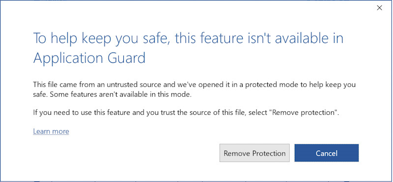

# <a name="application-guard-for-office-for-admins"></a><span data-ttu-id="036f9-105">Application Guard für Office für Administratoren</span><span class="sxs-lookup"><span data-stu-id="036f9-105">Application Guard for Office for admins</span></span>

<span data-ttu-id="036f9-106">**Gilt für:** Word, Excel und PowerPoint für Microsoft 365, Windows 10 Enterprise</span><span class="sxs-lookup"><span data-stu-id="036f9-106">**Applies to:** Word, Excel, and PowerPoint for Microsoft 365, Windows 10 Enterprise</span></span>

<span data-ttu-id="036f9-107">Microsoft Defender Application Guard für Office (Application Guard für Office) verhindert, dass nicht vertrauenswürdige Dateien auf vertrauenswürdige Ressourcen zugreifen, um Ihr Unternehmen vor neuen und neuen Angriffen zu schützen.</span><span class="sxs-lookup"><span data-stu-id="036f9-107">Microsoft Defender Application Guard for Office (Application Guard for Office) helps prevent untrusted files from accessing trusted resources, keeping your enterprise safe from new and emerging attacks.</span></span> <span data-ttu-id="036f9-108">Dieser Artikel führt Administratoren durch das Einrichten von Geräten für eine Vorschau von Application Guard für Office.</span><span class="sxs-lookup"><span data-stu-id="036f9-108">This article walks admins through setting up devices for a preview of Application Guard for Office.</span></span> <span data-ttu-id="036f9-109">Es enthält Informationen zu Systemanforderungen und Installationsschritten, um Application Guard für Office auf einem Gerät zu aktivieren.</span><span class="sxs-lookup"><span data-stu-id="036f9-109">It provides information about system requirements and installation steps to enable Application Guard for Office on a device.</span></span>

## <a name="prerequisites"></a><span data-ttu-id="036f9-110">Voraussetzungen</span><span class="sxs-lookup"><span data-stu-id="036f9-110">Prerequisites</span></span>

### <a name="minimum-hardware-requirements"></a><span data-ttu-id="036f9-111">Mindesthardwareanforderungen</span><span class="sxs-lookup"><span data-stu-id="036f9-111">Minimum hardware requirements</span></span>

* <span data-ttu-id="036f9-112">**CPU:** 64-Bit, 4 Kerne (physisch oder virtuell), Virtualisierungserweiterungen (Intel VT-x ODER AMD-V), Core i5-Äquivalent oder höher empfohlen</span><span class="sxs-lookup"><span data-stu-id="036f9-112">**CPU**: 64-bit, 4 cores (physical or virtual), virtualization extensions (Intel VT-x OR AMD-V), Core i5 equivalent or higher recommended</span></span>
* <span data-ttu-id="036f9-113">**Physischer Speicher**: 8 GB RAM</span><span class="sxs-lookup"><span data-stu-id="036f9-113">**Physical memory**: 8-GB RAM</span></span>
* <span data-ttu-id="036f9-114">**Festplatte:** 10 GB freier Speicherplatz auf dem Systemlaufwerk (SSD empfohlen)</span><span class="sxs-lookup"><span data-stu-id="036f9-114">**Hard disk**: 10 GB of free space on the system drive (SSD recommended)</span></span>

### <a name="minimum-software-requirements"></a><span data-ttu-id="036f9-115">Mindestanforderungen an die Software</span><span class="sxs-lookup"><span data-stu-id="036f9-115">Minimum software requirements</span></span>

* <span data-ttu-id="036f9-116">**Windows 10**: Windows 10 Enterprise Edition, Client Build Version 2004 (20H1) Build 19041 oder höher</span><span class="sxs-lookup"><span data-stu-id="036f9-116">**Windows 10**: Windows 10 Enterprise edition, Client Build version 2004 (20H1) build 19041 or later</span></span>
* <span data-ttu-id="036f9-117">**Office**: Office Current Channel Build Version 2011 16.0.13530.10000 oder höher.</span><span class="sxs-lookup"><span data-stu-id="036f9-117">**Office**: Office Current Channel Build version 2011 16.0.13530.10000 or later.</span></span> <span data-ttu-id="036f9-118">Sowohl 32-Bit- als auch 64-Bit-Versionen von Office werden unterstützt.</span><span class="sxs-lookup"><span data-stu-id="036f9-118">Both 32-bit and 64-bit versions of Office are supported.</span></span>
* <span data-ttu-id="036f9-119">**Updatepaket**: Kumulatives monatliches Sicherheitsupdate für Windows 10 [KB4571756](https://support.microsoft.com/help/4571756/windows-10-update-KB4571756)</span><span class="sxs-lookup"><span data-stu-id="036f9-119">**Update package**: Windows 10 cumulative monthly security update [KB4571756](https://support.microsoft.com/help/4571756/windows-10-update-KB4571756)</span></span>

<span data-ttu-id="036f9-120">Ausführliche Systemanforderungen finden Sie unter [System requirements for Microsoft Defender Application Guard](/windows/security/threat-protection/microsoft-defender-application-guard/reqs-md-app-guard).</span><span class="sxs-lookup"><span data-stu-id="036f9-120">For detailed system requirements, refer to [System requirements for Microsoft Defender Application Guard](/windows/security/threat-protection/microsoft-defender-application-guard/reqs-md-app-guard).</span></span> <span data-ttu-id="036f9-121">Weitere Informationen zu Office-Updatekanälen finden Sie [unter Übersicht über Updatekanäle für Microsoft 365](/deployoffice/overview-update-channels).</span><span class="sxs-lookup"><span data-stu-id="036f9-121">To learn more about Office update channels, see [Overview of update channels for Microsoft 365](/deployoffice/overview-update-channels).</span></span>

### <a name="licensing-requirements"></a><span data-ttu-id="036f9-122">Lizenzierungsanforderungen</span><span class="sxs-lookup"><span data-stu-id="036f9-122">Licensing requirements</span></span>

* <span data-ttu-id="036f9-123">Microsoft 365 E5 oder Microsoft 365 E5 Security</span><span class="sxs-lookup"><span data-stu-id="036f9-123">Microsoft 365 E5 or Microsoft 365 E5 Security</span></span>

## <a name="deploy-application-guard-for-office"></a><span data-ttu-id="036f9-124">Bereitstellen von Application Guard für Office</span><span class="sxs-lookup"><span data-stu-id="036f9-124">Deploy Application Guard for Office</span></span>

### <a name="enable-application-guard-for-office"></a><span data-ttu-id="036f9-125">Aktivieren von Application Guard für Office</span><span class="sxs-lookup"><span data-stu-id="036f9-125">Enable Application Guard for Office</span></span>

1. <span data-ttu-id="036f9-126">Herunterladen und Installieren **von kumulativen monatlichen Windows 10-Sicherheitsupdates KB4571756**.</span><span class="sxs-lookup"><span data-stu-id="036f9-126">Download and install **Windows 10 cumulative monthly security updates KB4571756**.</span></span>

2. <span data-ttu-id="036f9-127">Wählen **Sie Microsoft Defender Application Guard** unter Windows-Features aus, und wählen Sie OK **aus.**</span><span class="sxs-lookup"><span data-stu-id="036f9-127">Select **Microsoft Defender Application Guard** under Windows Features and  select **OK**.</span></span> <span data-ttu-id="036f9-128">Wenn Sie das Application Guard-Feature aktivieren, wird ein Systemneustart ausgeführt.</span><span class="sxs-lookup"><span data-stu-id="036f9-128">Enabling the Application Guard feature will prompt a system reboot.</span></span> <span data-ttu-id="036f9-129">Sie können jetzt oder nach Schritt 3 einen Neustart durchführen.</span><span class="sxs-lookup"><span data-stu-id="036f9-129">You can choose to reboot now or after step 3.</span></span>

   

   <span data-ttu-id="036f9-131">Das Feature kann auch durch Ausführen des folgenden PowerShell-Befehls als Administrator aktiviert werden:</span><span class="sxs-lookup"><span data-stu-id="036f9-131">The feature can also be enabled by running the following PowerShell command as administrator:</span></span>

   ```powershell
   Enable-WindowsOptionalFeature -online -FeatureName Windows-Defender-ApplicationGuard
   ```

3. <span data-ttu-id="036f9-132">Suchen Sie **im verwalteten Modus** nach Microsoft Defender Application Guard , einer Gruppenrichtlinie in **Computerkonfiguration Administrative Vorlagen \\ \\ Windows-Komponenten \\ Microsoft Defender Application Guard**.</span><span class="sxs-lookup"><span data-stu-id="036f9-132">Search for **Microsoft Defender Application Guard in Managed Mode**, a group policy in **Computer Configuration\\Administrative Templates\\Windows Components\\Microsoft Defender Application Guard**.</span></span> <span data-ttu-id="036f9-133">Aktivieren Sie diese Richtlinie, indem Sie den Wert unter Optionen **als 2** oder **3** festlegen und dann **OK** oder **Anwenden auswählen.**</span><span class="sxs-lookup"><span data-stu-id="036f9-133">Turn on this policy by setting the value under Options as **2** or **3**, and then selecting **OK** or **Apply**.</span></span>

   

   <span data-ttu-id="036f9-135">Stattdessen können Sie die entsprechende #A0 festlegen:</span><span class="sxs-lookup"><span data-stu-id="036f9-135">Instead, you can set the corresponding CSP policy:</span></span>

   > <span data-ttu-id="036f9-136">OMA-URI: **./Device/Vendor/MSFT/WindowsDefenderApplicationGuard/Settings/AllowWindowsDefenderApplicationGuard**</span><span class="sxs-lookup"><span data-stu-id="036f9-136">OMA-URI: **./Device/Vendor/MSFT/WindowsDefenderApplicationGuard/Settings/AllowWindowsDefenderApplicationGuard**</span></span> <br> <span data-ttu-id="036f9-137">Datentyp: **Integer**</span><span class="sxs-lookup"><span data-stu-id="036f9-137">Data type: **Integer**</span></span> <br> <span data-ttu-id="036f9-138">Wert: **2**</span><span class="sxs-lookup"><span data-stu-id="036f9-138">Value: **2**</span></span>

4. <span data-ttu-id="036f9-139">Starten Sie das System neu.</span><span class="sxs-lookup"><span data-stu-id="036f9-139">Restart the system.</span></span>

### <a name="set-diagnostics--feedback-to-send-full-data"></a><span data-ttu-id="036f9-140">Festlegen von Diagnosedaten & Feedback zum Senden vollständiger Daten</span><span class="sxs-lookup"><span data-stu-id="036f9-140">Set Diagnostics & feedback to send full data</span></span>

<span data-ttu-id="036f9-141">Dieser Schritt stellt sicher, dass die daten, die zum Identifizieren und Beheben von Problemen erforderlich sind, Microsoft erreichen.</span><span class="sxs-lookup"><span data-stu-id="036f9-141">This step ensures that the data necessary to identify and fix problems is reaching Microsoft.</span></span> <span data-ttu-id="036f9-142">Führen Sie die folgenden Schritte aus, um die Diagnose auf Ihrem Windows-Gerät zu aktivieren:</span><span class="sxs-lookup"><span data-stu-id="036f9-142">Follow these steps to enable diagnostics on your Windows device:</span></span>

1. <span data-ttu-id="036f9-143">Öffnen **Sie Einstellungen** im Startmenü.</span><span class="sxs-lookup"><span data-stu-id="036f9-143">Open **Settings** from the Start menu.</span></span>

   

2. <span data-ttu-id="036f9-145">Wählen **Sie unter Windows-Einstellungen** **die Option Datenschutz aus.**</span><span class="sxs-lookup"><span data-stu-id="036f9-145">On **Windows Settings**, select **Privacy**.</span></span>

   

3. <span data-ttu-id="036f9-147">Wählen Sie unter Datenschutz die Option **Diagnose & Feedback aus,** und wählen Sie **Optionale Diagnosedaten aus.**</span><span class="sxs-lookup"><span data-stu-id="036f9-147">Under Privacy, select **Diagnostics & feedback** and select **Optional diagnostic data**.</span></span>

   

<span data-ttu-id="036f9-149">Weitere Informationen zum Konfigurieren von Windows-Diagnoseeinstellungen finden Sie unter [Configuring Windows diagnostic data in your organization](/windows/privacy/configure-windows-diagnostic-data-in-your-organization#enterprise-management).</span><span class="sxs-lookup"><span data-stu-id="036f9-149">For more on configuring Windows diagnostic settings, refer to [Configuring Windows diagnostic data in your organization](/windows/privacy/configure-windows-diagnostic-data-in-your-organization#enterprise-management).</span></span>

### <a name="confirm-that-application-guard-for-office-is-enabled-and-working"></a><span data-ttu-id="036f9-150">Bestätigen, dass Application Guard für Office aktiviert und funktioniert</span><span class="sxs-lookup"><span data-stu-id="036f9-150">Confirm that Application Guard for Office is enabled and working</span></span>

<span data-ttu-id="036f9-151">Bevor Sie bestätigen, dass Application Guard für Office aktiviert ist, starten Sie Word, Excel oder PowerPoint auf einem Gerät, auf dem die Richtlinien bereitgestellt wurden.</span><span class="sxs-lookup"><span data-stu-id="036f9-151">Before confirming that Application Guard for Office is enabled, launch Word, Excel, or PowerPoint on a device where the policies have been deployed.</span></span> <span data-ttu-id="036f9-152">Stellen Sie sicher, dass Office aktiviert ist.</span><span class="sxs-lookup"><span data-stu-id="036f9-152">Make sure Office is activated.</span></span> <span data-ttu-id="036f9-153">Möglicherweise müssen Sie Ihre Arbeitsidentität verwenden, um das Office-Produkt zuerst zu aktivieren.</span><span class="sxs-lookup"><span data-stu-id="036f9-153">You may need to use your work identity to activate the Office product first.</span></span>

<span data-ttu-id="036f9-154">Um zu bestätigen, dass Application Guard für Office aktiviert ist, starten Sie Word, Excel oder PowerPoint, und öffnen Sie dann ein nicht vertrauenswürdiges Dokument.</span><span class="sxs-lookup"><span data-stu-id="036f9-154">To confirm that Application Guard for Office is enabled, launch Word, Excel, or PowerPoint, and then open an untrusted document.</span></span> <span data-ttu-id="036f9-155">Sie können beispielsweise ein Dokument öffnen, das aus dem Internet heruntergeladen wurde, oder eine E-Mail-Anlage von einer Person außerhalb Ihrer Organisation öffnen.</span><span class="sxs-lookup"><span data-stu-id="036f9-155">For example, you can open a document that was downloaded from the internet or an email attachment from someone outside your organization.</span></span>

<span data-ttu-id="036f9-156">Wenn Sie zum ersten Mal eine nicht vertrauenswürdige Datei öffnen, wird möglicherweise ein Office-Begrüßungsbildschirm wie im folgenden Beispiel angezeigt.</span><span class="sxs-lookup"><span data-stu-id="036f9-156">When you first open an untrusted file, you may see an Office splash screen like the following example.</span></span> <span data-ttu-id="036f9-157">Es wird möglicherweise einige Zeit angezeigt, während Application Guard für Office aktiviert wird und die Datei geöffnet wird.</span><span class="sxs-lookup"><span data-stu-id="036f9-157">It might be displayed for some time while Application Guard for Office is being activated and the file is being opened.</span></span> <span data-ttu-id="036f9-158">Nachfolgende Öffnungen nicht vertrauenswürdiger Dateien sollten schneller ausgeführt werden.</span><span class="sxs-lookup"><span data-stu-id="036f9-158">Subsequent openings of untrusted files should be faster.</span></span>


<span data-ttu-id="036f9-160">Beim Öffnen sollte die Datei einige visuelle Indikatoren anzeigen, dass die Datei in Application Guard für Office geöffnet wurde:</span><span class="sxs-lookup"><span data-stu-id="036f9-160">Upon being opened, the file should display a few visual indicators that the file was opened inside Application Guard for Office:</span></span>

* <span data-ttu-id="036f9-161">Eine Callout im Menüband</span><span class="sxs-lookup"><span data-stu-id="036f9-161">A callout in the ribbon</span></span>

  

* <span data-ttu-id="036f9-163">Das Anwendungssymbol mit einem Schild in der Taskleiste</span><span class="sxs-lookup"><span data-stu-id="036f9-163">The application icon with a shield in the taskbar</span></span>

  

## <a name="configure-application-guard-for-office"></a><span data-ttu-id="036f9-165">Konfigurieren von Application Guard für Office</span><span class="sxs-lookup"><span data-stu-id="036f9-165">Configure Application Guard for Office</span></span>

<span data-ttu-id="036f9-166">Office unterstützt die folgenden Richtlinien, mit denen Sie die Funktionen von Application Guard für Office konfigurieren können.</span><span class="sxs-lookup"><span data-stu-id="036f9-166">Office supports the following policies to enable you to configure the capabilities of Application Guard for Office.</span></span> <span data-ttu-id="036f9-167">Diese Richtlinien können über Gruppenrichtlinien oder über den Office-Cloudrichtliniendienst konfiguriert werden.</span><span class="sxs-lookup"><span data-stu-id="036f9-167">These policies can be configured through Group policies or through the Office cloud policy service.</span></span>

> [!NOTE]
> <span data-ttu-id="036f9-168">Durch das Konfigurieren dieser Richtlinien können einige Funktionen für Dateien deaktiviert werden, die in Application Guard für Office geöffnet wurden.</span><span class="sxs-lookup"><span data-stu-id="036f9-168">Configuring these policies can disable some functionalities for files opened in Application Guard for Office.</span></span>

|<span data-ttu-id="036f9-169">Richtlinie</span><span class="sxs-lookup"><span data-stu-id="036f9-169">Policy</span></span>|<span data-ttu-id="036f9-170">Beschreibung</span><span class="sxs-lookup"><span data-stu-id="036f9-170">Description</span></span>|
|---|---|
|<span data-ttu-id="036f9-171">Application Guard für Office nicht verwenden</span><span class="sxs-lookup"><span data-stu-id="036f9-171">Don't use Application Guard for Office</span></span>|<span data-ttu-id="036f9-172">Wenn Sie diese Richtlinie aktivieren, müssen Word, Excel und PowerPoint den Isolationscontainer geschützte Ansicht anstelle von Application Guard für Office verwenden.</span><span class="sxs-lookup"><span data-stu-id="036f9-172">Enabling this policy will force Word, Excel, and PowerPoint to use the Protected View isolation container instead of Application Guard for Office.</span></span> <span data-ttu-id="036f9-173">Diese Richtlinie kann verwendet werden, um Application Guard für Office vorübergehend zu deaktivieren, wenn Probleme beim Aktivieren für Microsoft Edge auftreten.</span><span class="sxs-lookup"><span data-stu-id="036f9-173">This policy can be used to temporarily disable Application Guard for Office when there are issues in leaving it enabled for Microsoft Edge.</span></span>|
|<span data-ttu-id="036f9-174">Konfigurieren der Vorerstellung von Application Guard für Office-Containern</span><span class="sxs-lookup"><span data-stu-id="036f9-174">Configure Application Guard for Office container pre-creation</span></span>|<span data-ttu-id="036f9-175">Diese Richtlinie bestimmt, ob der Application Guard für Office-Container zum Isolieren nicht vertrauenswürdiger Dateien für eine verbesserte Laufzeitleistung vorab erstellt wurde.</span><span class="sxs-lookup"><span data-stu-id="036f9-175">This policy determines if the Application Guard for Office container, for isolating untrusted files, is pre-created for improved run-time performance.</span></span> <span data-ttu-id="036f9-176">Wenn Sie diese Einstellung aktivieren, können Sie die Anzahl der Tage angeben, um mit dem Erstellen eines Containers fortzufahren, oder den Container vom office-integrierten heuristischen Vor erstellen zu lassen.</span><span class="sxs-lookup"><span data-stu-id="036f9-176">If you enable this setting, you can specify the number of days to continue pre-creating a container or let the Office built-in heuristic pre-create the container.</span></span>
|<span data-ttu-id="036f9-177">Kopieren/Einfügen für In Application Guard für Office geöffnete Office-Dokumente nicht zulassen</span><span class="sxs-lookup"><span data-stu-id="036f9-177">Don't allow copy/paste for Office documents opened in Application Guard for Office</span></span>|<span data-ttu-id="036f9-178">Wenn Sie diese Richtlinie aktivieren, wird verhindert, dass ein Benutzer Inhalte aus einem Dokument kopiert und einfügen kann, das in Application Guard für Office geöffnet wurde, in ein Dokument, das außerhalb des Dokuments geöffnet wurde.</span><span class="sxs-lookup"><span data-stu-id="036f9-178">Enabling this policy will prevent a user from copying and pasting content from a document opened in Application Guard for Office to a document opened outside of it.</span></span>|
|<span data-ttu-id="036f9-179">Deaktivieren der Hardwarebeschleunigung in Application Guard für Office</span><span class="sxs-lookup"><span data-stu-id="036f9-179">Disable hardware acceleration in Application Guard for Office</span></span>|<span data-ttu-id="036f9-180">Diese Richtlinie steuert, ob Application Guard für Office die Hardwarebeschleunigung zum Rendern von Grafiken verwendet.</span><span class="sxs-lookup"><span data-stu-id="036f9-180">This policy controls whether Application Guard for Office uses hardware acceleration to render graphics.</span></span> <span data-ttu-id="036f9-181">Wenn Sie diese Einstellung aktivieren, verwendet Application Guard für Office softwarebasiertes Rendering (CPU) und geladen keine Grafiktreiber von Drittanbietern oder interagiert mit verbundenen Grafikhardware.</span><span class="sxs-lookup"><span data-stu-id="036f9-181">If you enable this setting, Application Guard for Office uses software-based (CPU) rendering and won't load any third-party graphics drivers or interact with any connected graphics hardware.</span></span>
|<span data-ttu-id="036f9-182">Deaktivieren des Schutzes nicht unterstützter Dateitypen in Application Guard für Office</span><span class="sxs-lookup"><span data-stu-id="036f9-182">Disable unsupported file types protection in Application Guard for Office</span></span>|<span data-ttu-id="036f9-183">Diese Richtlinie steuert, ob Application Guard für Office das Öffnen nicht unterstützter Dateitypen blockiert oder ob die Umleitung zur geschützten Ansicht aktiviert wird.</span><span class="sxs-lookup"><span data-stu-id="036f9-183">This policy controls whether Application Guard for Office will block unsupported file types from being opened or if it will enable the redirection to Protected View.</span></span>
|<span data-ttu-id="036f9-184">Deaktivieren des Kamera- und Mikrofonzugriffs für Dokumente, die in Application Guard für Office geöffnet wurden</span><span class="sxs-lookup"><span data-stu-id="036f9-184">Turn off camera and microphone access for documents opened in Application Guard for Office</span></span>|<span data-ttu-id="036f9-185">Wenn Sie diese Richtlinie aktivieren, wird Office der Zugriff auf die Kamera und das Mikrofon in Application Guard for Office entfernt.</span><span class="sxs-lookup"><span data-stu-id="036f9-185">Enabling this policy will remove Office access to the camera and microphone inside Application Guard for Office.</span></span>|
|<span data-ttu-id="036f9-186">Einschränken des Druckens von Dokumenten, die in Application Guard für Office geöffnet wurden</span><span class="sxs-lookup"><span data-stu-id="036f9-186">Restrict printing from documents opened in Application Guard for Office</span></span>|<span data-ttu-id="036f9-187">Wenn Sie diese Richtlinie aktivieren, werden die Drucker, auf die ein Benutzer aus einer in Application Guard für Office geöffneten Datei drucken kann, begrenzt.</span><span class="sxs-lookup"><span data-stu-id="036f9-187">Enabling this policy will limit the printers that a user can print to from a file opened in Application Guard for Office.</span></span> <span data-ttu-id="036f9-188">Sie können diese Richtlinie beispielsweise verwenden, um Benutzer auf das Drucken in PDF zu beschränken.</span><span class="sxs-lookup"><span data-stu-id="036f9-188">For example, you can use this policy to restrict users to only print to PDF.</span></span>|
|<span data-ttu-id="036f9-189">Verhindern, dass Benutzer Application Guard for Office Protection für Dateien entfernen</span><span class="sxs-lookup"><span data-stu-id="036f9-189">Prevent users from removing Application Guard for Office protection on files</span></span>|<span data-ttu-id="036f9-190">Durch Aktivieren dieser Richtlinie wird die Option (innerhalb der Office-Anwendungserfahrung) zum Deaktivieren des Application Guard for Office-Schutzes oder zum Öffnen einer Datei außerhalb von Application Guard für Office entfernt.</span><span class="sxs-lookup"><span data-stu-id="036f9-190">Enabling this policy will remove the option (within the Office application experience) to disable Application Guard for Office protection or to open a file outside Application Guard for Office.</span></span> <p> <span data-ttu-id="036f9-191">**Hinweis:** Benutzer können diese Richtlinie weiterhin umgehen, indem sie die Mark-of-the-Web-Eigenschaft manuell aus der Datei entfernen oder ein Dokument an einen vertrauenswürdigen Speicherort verschieben.</span><span class="sxs-lookup"><span data-stu-id="036f9-191">**Note:** Users can still bypass this policy by manually removing the mark-of-the-web property from the file or by moving a document to a Trusted location.</span></span>|
|

> [!NOTE]
> <span data-ttu-id="036f9-192">Die folgenden Richtlinien erfordern, dass sich der Benutzer abmeldet und sich erneut bei Windows anmeldet, um wirksam zu werden:</span><span class="sxs-lookup"><span data-stu-id="036f9-192">The following policies will require the user to sign out and sign in again to Windows to take effect:</span></span>
>
> * <span data-ttu-id="036f9-193">Kopieren/Einfügen für Dokumente deaktivieren, die in Application Guard für Office geöffnet wurden</span><span class="sxs-lookup"><span data-stu-id="036f9-193">Disable copy/paste for documents opened in Application Guard for Office</span></span>
> * <span data-ttu-id="036f9-194">Einschränken des Druckens für Dokumente, die in Application Guard for Office geöffnet wurden</span><span class="sxs-lookup"><span data-stu-id="036f9-194">Restrict printing for documents opened in Application Guard for Office</span></span>
> * <span data-ttu-id="036f9-195">Deaktivieren des Kamera- und Mikrofonzugriffs auf Dokumente, die in Application Guard für Office geöffnet wurden</span><span class="sxs-lookup"><span data-stu-id="036f9-195">Turn off camera and mic access to documents opened in Application Guard for Office</span></span>

## <a name="submit-feedback"></a><span data-ttu-id="036f9-196">Feedback senden</span><span class="sxs-lookup"><span data-stu-id="036f9-196">Submit feedback</span></span>

### <a name="submit-feedback-via-feedback-hub"></a><span data-ttu-id="036f9-197">Senden von Feedback über den Feedbackhub</span><span class="sxs-lookup"><span data-stu-id="036f9-197">Submit feedback via Feedback Hub</span></span>

<span data-ttu-id="036f9-198">Wenn beim Starten von Application Guard für Office Probleme auftreten, werden Sie aufgefordert, Ihr Feedback über den Feedbackhub zu übermitteln:</span><span class="sxs-lookup"><span data-stu-id="036f9-198">If you encounter any issues when launching Application Guard for Office, you're encouraged to submit your feedback via Feedback Hub:</span></span>

1. <span data-ttu-id="036f9-199">Öffnen Sie die **Feedback Hub-App,** und melden Sie sich an.</span><span class="sxs-lookup"><span data-stu-id="036f9-199">Open the **Feedback Hub app** and sign in.</span></span>

2. <span data-ttu-id="036f9-200">Wenn beim Starten von Application Guard ein Fehlerdialogfeld angezeigt wird, wählen Sie im Fehlerdialogfeld Bericht an **Microsoft** aus, um eine neue Feedbackübermittlung zu starten.</span><span class="sxs-lookup"><span data-stu-id="036f9-200">If you get an error dialog while launching Application Guard, select **Report to Microsoft** in the error dialog to start a new feedback submission.</span></span> <span data-ttu-id="036f9-201">Navigieren Sie andernfalls zu, um die richtige Kategorie für Application Guard auszuwählen, und wählen Sie dann Neues Feedback <https://aka.ms/mdagoffice-fb> **+ &nbsp; hinzufügen** in der nähe der oberen rechten Seite aus.</span><span class="sxs-lookup"><span data-stu-id="036f9-201">Otherwise, navigate to <https://aka.ms/mdagoffice-fb> to select the correct category for Application Guard, then select **+&nbsp;Add new feedback** near the top right.</span></span>

3. <span data-ttu-id="036f9-202">Geben Sie eine Zusammenfassung in das **Feld Feedback zusammenfassen** ein, wenn sie noch nicht für Sie ausgefüllt ist.</span><span class="sxs-lookup"><span data-stu-id="036f9-202">Enter a summary in the **Summarize your feedback** box if it isn't already filled in for you.</span></span>

4. <span data-ttu-id="036f9-203">Geben Sie eine detaillierte Beschreibung des Problems ein, das Sie erfahren haben, und welche Schritte Sie im Feld **Ausführlicher** erklären unternommen haben, und wählen Sie dann **Weiter aus.**</span><span class="sxs-lookup"><span data-stu-id="036f9-203">Enter a detailed description of the issue that you experienced and what steps you took in the **Explain in more detail** box, then select **Next**.</span></span>

5. <span data-ttu-id="036f9-204">Wählen Sie die Blase neben **Problem aus.**</span><span class="sxs-lookup"><span data-stu-id="036f9-204">Select the bubble next to **Problem**.</span></span> <span data-ttu-id="036f9-205">Stellen Sie sicher, dass die ausgewählte Kategorie **Sicherheit und Datenschutz Microsoft Defender Application Guard – \> Office** ist, und wählen Sie dann **Weiter aus.**</span><span class="sxs-lookup"><span data-stu-id="036f9-205">Make sure the category selected is **Security and Privacy \> Microsoft Defender Application Guard – Office**, then select **Next**.</span></span>

6. <span data-ttu-id="036f9-206">Wählen **Sie Neues Feedback** und dann Weiter **aus.**</span><span class="sxs-lookup"><span data-stu-id="036f9-206">Select **New feedback**, then **Next**.</span></span>

7. <span data-ttu-id="036f9-207">Sammeln von Ablaufverfolgungen zu dem Problem:</span><span class="sxs-lookup"><span data-stu-id="036f9-207">Collect traces about the issue:</span></span>

   1. <span data-ttu-id="036f9-208">Erweitern Sie die **Kachel Mein Problem neu** erstellen.</span><span class="sxs-lookup"><span data-stu-id="036f9-208">Expand the **Recreate my problem** tile.</span></span>

   2. <span data-ttu-id="036f9-209">Wenn das Problem auftritt, das während der Ausführung von Application Guard auftritt, öffnen Sie eine Application Guard-Instanz.</span><span class="sxs-lookup"><span data-stu-id="036f9-209">If the issue you're experiencing occurs while Application Guard is running, open an Application Guard instance.</span></span> <span data-ttu-id="036f9-210">Durch das Öffnen einer Instanz können zusätzliche Ablaufverfolgungen im Application Guard-Container erfasst werden.</span><span class="sxs-lookup"><span data-stu-id="036f9-210">Opening an instance allows additional traces to be collected from within the Application Guard container.</span></span>

   3. <span data-ttu-id="036f9-211">Wählen **Sie Aufzeichnung starten** aus, und warten Sie, bis die Kachel nicht mehr dreht, und sagen Sie Aufzeichnung *beenden*.</span><span class="sxs-lookup"><span data-stu-id="036f9-211">Select **Start recording**, and wait for the tile to stop spinning and say *Stop recording*.</span></span>

   4. <span data-ttu-id="036f9-212">Reproduzieren Sie das Problem vollständig mit Application Guard.</span><span class="sxs-lookup"><span data-stu-id="036f9-212">Fully reproduce the issue with Application Guard.</span></span> <span data-ttu-id="036f9-213">Die Vervielfältigung kann den Versuch umfassen, eine Application Guard-Instanz zu starten und zu warten, bis ein Fehler auftritt, oder die Wiedergabe eines Problems in einer ausgeführten Application Guard-Instanz.</span><span class="sxs-lookup"><span data-stu-id="036f9-213">Reproduction might include attempting to launch an Application Guard instance and waiting until it fails, or reproducing an issue in a running Application Guard instance.</span></span>

   5. <span data-ttu-id="036f9-214">Wählen Sie die **Kachel Aufzeichnung beenden** aus.</span><span class="sxs-lookup"><span data-stu-id="036f9-214">Select the **Stop recording** tile.</span></span>

   6. <span data-ttu-id="036f9-215">Lassen Sie alle ausgeführten Application Guard-Instanzen geöffnet, auch für einige Minuten nach der Übermittlung, damit auch Containerdiagnosen erfasst werden können.</span><span class="sxs-lookup"><span data-stu-id="036f9-215">Keep any running Application Guard instance(s) open, even for a few minutes after submission, so that container diagnostics can also be collected.</span></span>

8. <span data-ttu-id="036f9-216">Fügen Sie alle relevanten Screenshots oder Dateien an, die mit dem Problem in Zusammenhang stehen.</span><span class="sxs-lookup"><span data-stu-id="036f9-216">Attach any relevant screenshots or files related to the problem.</span></span>

9. <span data-ttu-id="036f9-217">Wählen Sie **Senden** aus.</span><span class="sxs-lookup"><span data-stu-id="036f9-217">Select **Submit**.</span></span>

### <a name="submit-feedback-via-office-customer-voice"></a><span data-ttu-id="036f9-218">Senden von Feedback über Office Customer Voice</span><span class="sxs-lookup"><span data-stu-id="036f9-218">Submit feedback via Office Customer Voice</span></span>

<span data-ttu-id="036f9-219">Sie können auch Feedback von Office übermitteln, wenn das Problem eintritt, wenn Office-Dokumente in Application Guard geöffnet werden.</span><span class="sxs-lookup"><span data-stu-id="036f9-219">You may also submit feedback from within Office if the issue happens when Office documents are opened in Application Guard.</span></span> <span data-ttu-id="036f9-220">Informationen zum Übermitteln von Feedback finden Sie im [Office-Insider-Handbuch.](https://insider.office.com/handbook)</span><span class="sxs-lookup"><span data-stu-id="036f9-220">Refer to the [Office Insider Handbook](https://insider.office.com/handbook) for submitting feedback.</span></span>

## <a name="integration-with-microsoft-defender-for-endpoint-and-microsoft-defender-for-office-365"></a><span data-ttu-id="036f9-221">Integration in Microsoft Defender for Endpoint und Microsoft Defender für Office 365</span><span class="sxs-lookup"><span data-stu-id="036f9-221">Integration with Microsoft Defender for Endpoint and Microsoft Defender for Office 365</span></span>

<span data-ttu-id="036f9-222">Application Guard für Office ist in Microsoft Defender for Endpoint integriert, um Überwachung und Warnung bei bösartigen Aktivitäten in der isolierten Umgebung zu ermöglichen.</span><span class="sxs-lookup"><span data-stu-id="036f9-222">Application Guard for Office is integrated with Microsoft Defender for Endpoint to provide monitoring and alerting on malicious activity that happens in the isolated environment.</span></span>

<span data-ttu-id="036f9-223">Microsoft Defender for Endpoint ist eine Sicherheitsplattform, die Unternehmensnetzwerken dabei helfen soll, erweiterte Bedrohungen zu verhindern, zu erkennen, zu untersuchen und auf sie zu reagieren.</span><span class="sxs-lookup"><span data-stu-id="036f9-223">Microsoft Defender for Endpoint is a security platform designed to help enterprise networks prevent, detect, investigate, and respond to advanced threats.</span></span> <span data-ttu-id="036f9-224">Weitere Informationen zu dieser Plattform finden Sie unter [Microsoft Defender for Endpoint](https://www.microsoft.com/microsoft-365/windows/microsoft-defender-atp).</span><span class="sxs-lookup"><span data-stu-id="036f9-224">For more details about this platform, see [Microsoft Defender for Endpoint](https://www.microsoft.com/microsoft-365/windows/microsoft-defender-atp).</span></span> <span data-ttu-id="036f9-225">Weitere Informationen zum Onboarding von Geräten auf dieser Plattform finden Sie unter [Onboarding devices to the Microsoft Defender for Endpoint service](/windows/security/threat-protection/microsoft-defender-atp/onboard-configure).</span><span class="sxs-lookup"><span data-stu-id="036f9-225">To learn more about onboarding devices to this platform, see [Onboard devices to the Microsoft Defender for Endpoint service](/windows/security/threat-protection/microsoft-defender-atp/onboard-configure).</span></span>

<span data-ttu-id="036f9-226">Sie können Microsoft Defender für Office 365 auch für die Zusammenarbeit mit Defender for Endpoint konfigurieren.</span><span class="sxs-lookup"><span data-stu-id="036f9-226">You can also configure Microsoft Defender for Office 365 to work with Defender for Endpoint.</span></span> <span data-ttu-id="036f9-227">Weitere Informationen finden Sie unter [Integrate Defender for Office 365 with Microsoft Defender for Endpoint](integrate-office-365-ti-with-wdatp.md).</span><span class="sxs-lookup"><span data-stu-id="036f9-227">For more info, refer to [Integrate Defender for Office 365 with Microsoft Defender for Endpoint](integrate-office-365-ti-with-wdatp.md).</span></span>

## <a name="limitations-and-considerations"></a><span data-ttu-id="036f9-228">Einschränkungen und Überlegungen</span><span class="sxs-lookup"><span data-stu-id="036f9-228">Limitations and considerations</span></span>

* <span data-ttu-id="036f9-229">Application Guard für Office ist ein eingeschränkter Modus, der nicht vertrauenswürdige Dokumente isoliert, sodass sie nicht auf vertrauenswürdige Unternehmensressourcen, ein Intranet, die Identität des Benutzers und beliebige Dateien auf dem Computer zugreifen können.</span><span class="sxs-lookup"><span data-stu-id="036f9-229">Application Guard for Office is a restricted mode that isolates untrusted documents so that they can't access trusted corporate resources, an intranet, the user's identity, and arbitrary files on the computer.</span></span> <span data-ttu-id="036f9-230">Wenn ein Benutzer versucht, auf ein Feature zu zugreifen, das von einem solchen Zugriff abhängig ist (z. B. das Einfügen eines Bilds aus einer lokalen Datei auf dem Datenträger), führt der Zugriff zu einem Fehler und erzeugt eine Eingabeaufforderung wie im folgenden Beispiel.</span><span class="sxs-lookup"><span data-stu-id="036f9-230">As a result, if a user tries to access a feature that has a dependency on such access—for example, inserting a picture from a local file on disk—the access will fail and produce a prompt like the following example.</span></span> <span data-ttu-id="036f9-231">Damit ein nicht vertrauenswürdiges Dokument auf vertrauenswürdige Ressourcen zugreifen kann, müssen Benutzer den Application Guard-Schutz aus dem Dokument entfernen.</span><span class="sxs-lookup"><span data-stu-id="036f9-231">To enable an untrusted document to access trusted resources, users must remove Application Guard protection from the document.</span></span>

  

  > [!NOTE]
  > <span data-ttu-id="036f9-233">Raten Sie Benutzern, den Schutz nur zu entfernen, wenn sie der Datei und ihrer Quelle vertrauen oder woher sie stammt.</span><span class="sxs-lookup"><span data-stu-id="036f9-233">Advise users to only remove protection if they trust the file and its source or where it came from.</span></span>

* <span data-ttu-id="036f9-234">Aktive Inhalte in Dokumenten wie Makros ActiveX Steuerelementen sind in Application Guard für Office deaktiviert.</span><span class="sxs-lookup"><span data-stu-id="036f9-234">Active content in documents like macros and ActiveX controls are disabled in Application Guard for Office.</span></span> <span data-ttu-id="036f9-235">Benutzer müssen den Application Guard-Schutz entfernen, um aktive Inhalte zu aktivieren.</span><span class="sxs-lookup"><span data-stu-id="036f9-235">Users need to remove Application Guard protection to enable active content.</span></span>

* <span data-ttu-id="036f9-236">Nicht vertrauenswürdige Dateien aus Netzwerkfreigaben oder Von OneDrive, OneDrive for Business oder SharePoint Online freigegebenen Dateien aus einer anderen Organisation, die in Application Guard als schreibgeschützt geöffnet sind.</span><span class="sxs-lookup"><span data-stu-id="036f9-236">Untrusted files from network shares or files shared from OneDrive, OneDrive for Business, or SharePoint Online from a different organization open as read-only in Application Guard.</span></span> <span data-ttu-id="036f9-237">Benutzer können eine lokale Kopie dieser Dateien speichern, um im Container weiter zu arbeiten, oder den Schutz entfernen, um direkt mit der Ursprünglichen Datei zu arbeiten.</span><span class="sxs-lookup"><span data-stu-id="036f9-237">Users can save a local copy of such files to continue working in the container or remove protection to directly work with the original file.</span></span>

* <span data-ttu-id="036f9-238">Dateien, die durch die Verwaltung von Informationsrechten (Information Rights Management, IRM) geschützt sind, werden standardmäßig blockiert.</span><span class="sxs-lookup"><span data-stu-id="036f9-238">Files that are protected by Information Rights Management (IRM) are blocked by default.</span></span> <span data-ttu-id="036f9-239">Wenn Benutzer solche Dateien in der geschützten Ansicht öffnen möchten, muss ein Administrator Richtlinieneinstellungen für nicht unterstützte Dateitypen für die Organisation konfigurieren.</span><span class="sxs-lookup"><span data-stu-id="036f9-239">If users want to open such files in Protected View, an administrator must configure policy settings for unsupported file types for the organization.</span></span>

* <span data-ttu-id="036f9-240">Alle Anpassungen an Office-Anwendungen in Application Guard für Office werden nicht beibehalten, nachdem sich ein Benutzer ab- und erneut anmeldet oder nach dem Neustart des Geräts.</span><span class="sxs-lookup"><span data-stu-id="036f9-240">Any customizations to Office applications in Application Guard for Office won't persist after a user signs out and signs in again or after the device restarts.</span></span>

* <span data-ttu-id="036f9-241">Nur Barrierefreiheitstools, die das UIA-Framework verwenden, können für Dateien, die in Application Guard für Office geöffnet wurden, eine barrierefreie Benutzererfahrung bieten.</span><span class="sxs-lookup"><span data-stu-id="036f9-241">Only Accessibility tools that use the UIA framework can provide an accessible experience for files opened in Application Guard for Office.</span></span>

* <span data-ttu-id="036f9-242">Die Netzwerkkonnektivität ist für den ersten Start von Application Guard nach der Installation erforderlich.</span><span class="sxs-lookup"><span data-stu-id="036f9-242">Network connectivity is required for the first launch of Application Guard after installation.</span></span> <span data-ttu-id="036f9-243">Die Konnektivität ist für Application Guard erforderlich, um die Lizenz zu überprüfen.</span><span class="sxs-lookup"><span data-stu-id="036f9-243">Connectivity is required for Application Guard to validate the license.</span></span>

* <span data-ttu-id="036f9-244">Im Abschnitt "Informationen" des Dokuments zeigt die *Last Modified By-Eigenschaft* **möglicherweise WDAGUtilityAccount** als Benutzer an.</span><span class="sxs-lookup"><span data-stu-id="036f9-244">In the document's info section, the *Last Modified By* property may display **WDAGUtilityAccount** as the user.</span></span> <span data-ttu-id="036f9-245">WDAGUtilityAccount ist der anonyme Benutzer, der in Application Guard konfiguriert ist.</span><span class="sxs-lookup"><span data-stu-id="036f9-245">WDAGUtilityAccount is the anonymous user configured in Application Guard.</span></span> <span data-ttu-id="036f9-246">Die Identität des Desktopbenutzers wird nicht im Application Guard-Container freigegeben.</span><span class="sxs-lookup"><span data-stu-id="036f9-246">The desktop user's identity isn't shared inside the Application Guard container.</span></span>

## <a name="performance-optimizations-for-application-guard-for-office"></a><span data-ttu-id="036f9-247">Leistungsoptimierungen für Application Guard für Office</span><span class="sxs-lookup"><span data-stu-id="036f9-247">Performance optimizations for Application Guard for Office</span></span>

<span data-ttu-id="036f9-248">Dieser Abschnitt enthält eine Übersicht über die Leistungsoptimierungen, die in Application Guard für Office verwendet werden.</span><span class="sxs-lookup"><span data-stu-id="036f9-248">This section provides an overview of the performance optimizations used in Application Guard for Office.</span></span> <span data-ttu-id="036f9-249">Diese Informationen können Administratoren bei der Diagnose von Berichten von Benutzern im Zusammenhang mit der Leistung von Office oder dem Gesamtsystem helfen, wenn Application Guard aktiviert ist.</span><span class="sxs-lookup"><span data-stu-id="036f9-249">This information can help administrators diagnose reports from users related to the performance of Office or the overall system when Application Guard is enabled.</span></span>

<span data-ttu-id="036f9-250">Application Guard verwendet einen virtualisierten Container, um nicht vertrauenswürdige Dokumente vom System zu isolieren.</span><span class="sxs-lookup"><span data-stu-id="036f9-250">Application Guard uses a virtualized container to isolate untrusted documents away from the system.</span></span> <span data-ttu-id="036f9-251">Das Erstellen eines Containers und das Einrichten des Application Guard-Containers zum Öffnen von Office-Dokumenten hat einen Leistungsaufwand, der sich negativ auf die Benutzerfreundlichkeit auswirken kann, wenn Benutzer ein nicht vertrauenswürdiges Dokument öffnen.</span><span class="sxs-lookup"><span data-stu-id="036f9-251">The process of creating a container and setting up the Application Guard container to open Office documents has a performance overhead that might negatively affect user experience when users open an untrusted document.</span></span>

<span data-ttu-id="036f9-252">Um Benutzern die erwartete Dateiöffnungserfahrung zu bieten, verwendet Application Guard Logik, um einen Container vorab zu erstellen, wenn die folgende Heuristik auf einem System erfüllt ist: Ein Benutzer hat in den letzten 28 Tagen eine Datei in der geschützten Ansicht oder in Application Guard geöffnet.</span><span class="sxs-lookup"><span data-stu-id="036f9-252">To provide users with the expected file-opening experience, Application Guard uses logic to pre-create a container when the following heuristic is met on a system: A user has opened a file in either Protected View or Application Guard in the past 28 days.</span></span>

<span data-ttu-id="036f9-253">Wenn diese Heuristik erfüllt ist, erstellt Office nach der Anmeldung bei Windows einen Application Guard-Container für den Benutzer.</span><span class="sxs-lookup"><span data-stu-id="036f9-253">When this heuristic is met, Office will pre-create an Application Guard container for the user after they sign in to Windows.</span></span> <span data-ttu-id="036f9-254">Während dieser Vorgang vor dem Erstellen ausgeführt wird, tritt möglicherweise eine langsame Leistung auf, aber der Effekt wird behoben, sobald der Vorgang abgeschlossen ist.</span><span class="sxs-lookup"><span data-stu-id="036f9-254">While this pre-create operation is in progress, the system may experience slow performance, but the effect will resolve as soon as the operation completes.</span></span>

> [!NOTE]
> <span data-ttu-id="036f9-255">Die Hinweise, die für die Heuristik zum Vorab erstellen des Containers erforderlich sind, werden von Office-Anwendungen generiert, wenn sie von einem Benutzer verwendet werden.</span><span class="sxs-lookup"><span data-stu-id="036f9-255">The hints needed for the heuristic to pre-create the container are generated by Office applications as a user uses them.</span></span> <span data-ttu-id="036f9-256">Wenn ein Benutzer Office auf einem neuen System installiert, auf dem Application Guard aktiviert ist, erstellt Office den Container erst vor dem ersten Öffnen eines nicht vertrauenswürdigen Dokuments auf dem System.</span><span class="sxs-lookup"><span data-stu-id="036f9-256">If a user installs Office on a new system where Application Guard is enabled, Office will not pre-create the container until after the first time a user opens an untrusted document on the system.</span></span> <span data-ttu-id="036f9-257">Der Benutzer wird feststellen, dass das Öffnen dieser ersten Datei in Application Guard länger dauert.</span><span class="sxs-lookup"><span data-stu-id="036f9-257">The user will observe that this first file takes longer to open in Application Guard.</span></span>

## <a name="known-issues"></a><span data-ttu-id="036f9-258">Bekannte Probleme</span><span class="sxs-lookup"><span data-stu-id="036f9-258">Known issues</span></span>

* <span data-ttu-id="036f9-259">Wenn Sie Weblinks ( `http` `https` oder ) auswählen, wird der Browser nicht geöffnet.</span><span class="sxs-lookup"><span data-stu-id="036f9-259">Selecting web links (`http` or `https`) doesn't open the browser.</span></span>
* <span data-ttu-id="036f9-260">Das Pasting von Inhalten oder Bildern im Rich-Text-Format (Rich Text Format, RTF) in Office-Dokumenten, die mit Application Guard geöffnet wurden, wird derzeit nicht unterstützt.</span><span class="sxs-lookup"><span data-stu-id="036f9-260">Pasting rich text format (RTF) content or images in Office documents opened with Application Guard isn't supported at this time.</span></span>
* <span data-ttu-id="036f9-261">Updates für .NET führen dazu, dass Dateien in Application Guard nicht geöffnet werden.</span><span class="sxs-lookup"><span data-stu-id="036f9-261">Updates to .NET cause files to fail to open in Application Guard.</span></span> <span data-ttu-id="036f9-262">Als Problemumgehung können Benutzer ihr Gerät neu starten, wenn dieser Fehler vor sich geht.</span><span class="sxs-lookup"><span data-stu-id="036f9-262">As a workaround, users can restart their device when they come across this failure.</span></span> <span data-ttu-id="036f9-263">Weitere Informationen zum Problem finden Sie unter Empfangen einer Fehlermeldung beim Versuch, Windows Defender [Application Guard oder Windows Sandbox zu öffnen.](https://support.microsoft.com/help/4575917/receiving-an-error-message-when-attempting-to-open-windows-defender-ap)</span><span class="sxs-lookup"><span data-stu-id="036f9-263">Learn more about the issue at [Receiving an error message when attempting to open Windows Defender Application Guard or Windows Sandbox](https://support.microsoft.com/help/4575917/receiving-an-error-message-when-attempting-to-open-windows-defender-ap).</span></span>