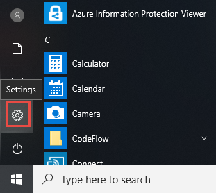

# <a name="application-guard-for-office-for-admins"></a>Application Guard für Office für Administratoren

**Gilt für:** Word, Excel und PowerPoint für Microsoft 365, Windows 10 Enterprise

Microsoft Defender Application Guard für Office (Application Guard für Office) verhindert, dass nicht vertrauenswürdige Dateien auf vertrauenswürdige Ressourcen zugreifen, um Ihr Unternehmen vor neuen und neuen Angriffen zu schützen. Dieser Artikel führt Administratoren durch das Einrichten von Geräten für eine Vorschau von Application Guard für Office. Es enthält Informationen zu Systemanforderungen und Installationsschritten zum Aktivieren von Application Guard für Office auf einem Gerät.

## <a name="prerequisites"></a>Voraussetzungen

### <a name="minimum-hardware-requirements"></a>Mindesthardwareanforderungen

* **CPU:** 64-Bit, 4 Kerne (physisch oder virtuell), Virtualisierungserweiterungen (Intel VT-x ODER AMD-V), Core i5-Äquivalent oder höher empfohlen
* **Physischer Arbeitsspeicher:** 8 GB RAM
* **Festplatte:** 10 GB freier Speicherplatz auf dem Systemlaufwerk (SSD empfohlen)

### <a name="minimum-software-requirements"></a>Mindestanforderungen an die Software

* **Windows 10**: Windows 10 Enterprise Edition, Client Build Version 2004 (20H1) Build 19041 oder höher
* **Office**: Office Current Channel Build Version 2011 16.0.13530.10000 oder höher
* **Updatepaket:** Kumulatives monatliches Sicherheitsupdate für Windows 10 [KB4571756](https://support.microsoft.com/help/4571756/windows-10-update-KB4571756)

Ausführliche Systemanforderungen finden Sie in den [Systemanforderungen für Microsoft Defender Application Guard](https://docs.microsoft.com/windows/security/threat-protection/microsoft-defender-application-guard/reqs-md-app-guard). Weitere Informationen zu Office-Updatekanälen finden Sie unter [Übersicht über Updatekanäle für Microsoft 365.](https://docs.microsoft.com/deployoffice/overview-update-channels)

### <a name="licensing-requirements"></a>Lizenzierungsanforderungen

* Microsoft 365 E5 oder Microsoft 365 E5 Security

## <a name="deploy-application-guard-for-office"></a>Bereitstellen von Application Guard für Office

### <a name="enable-application-guard-for-office"></a>Aktivieren von Application Guard für Office

1. Herunterladen und Installieren der kumulativen monatlichen **Sicherheitsupdates für Windows 10 KB4571756**.

2. Wählen **Sie Microsoft Defender Application Guard** unter "Windows-Features" aus, und wählen Sie **"OK" aus.** Wenn Sie das Application Guard-Feature aktivieren, wird ein Systemneustart aufgefordert. Sie können den Neustart jetzt oder nach Schritt 3 durchführen.

   

   Das Feature kann auch durch Ausführen des folgenden PowerShell-Befehls als Administrator aktiviert werden:

   ```powershell
   Enable-WindowsOptionalFeature -online -FeatureName Windows-Defender-ApplicationGuard
   ```

3. Suchen Sie nach Microsoft Defender Application Guard im verwalteten **Modus,** einer Gruppenrichtlinie in administrativen Vorlagen für computerkonfiguration **\\ \\ Windows-Komponenten \\ Microsoft Defender Application Guard**. Aktivieren Sie diese Richtlinie, indem Sie den Wert unter "Optionen" als **2** oder **3** festlegen und dann **"OK"** oder **"Übernehmen" auswählen.**

   

   Stattdessen können Sie die entsprechende #A0 festlegen:

   > OMA-URI: **./Device/Vendor/MSFT/WindowsDefenderApplicationGuard/Settings/AllowWindowsDefenderApplicationGuard** <br> Datentyp: **Integer** <br> Wert: **2**

4. Starten Sie das System neu.

### <a name="set-diagnostics--feedback-to-send-full-data"></a>Festlegen des Feedbacks & Diagnose, um vollständige Daten zu senden

Dieser Schritt stellt sicher, dass die zum Identifizieren und Beheben von Problemen erforderlichen Daten Microsoft erreichen. Führen Sie die folgenden Schritte aus, um die Diagnose auf Ihrem Windows-Gerät zu aktivieren:

1. Öffnen **Sie "Einstellungen"** im Startmenü.

   

2. Wählen **Sie unter "Windows-Einstellungen"** **"Datenschutz" aus.**

   

3. Wählen Sie unter **"Datenschutz" & "Diagnose" und** dann **"Optionale Diagnosedaten" aus.**

   

Weitere Informationen zum Konfigurieren von Windows-Diagnoseeinstellungen finden Sie unter ["Konfigurieren von Windows-Diagnosedaten in Ihrer Organisation".](https://docs.microsoft.com/windows/privacy/configure-windows-diagnostic-data-in-your-organization#enterprise-management)

### <a name="confirm-that-application-guard-for-office-is-enabled-and-working"></a>Bestätigen, dass Application Guard für Office aktiviert ist und funktioniert

Bevor Sie bestätigen, dass Application Guard für Office aktiviert ist, starten Sie Word, Excel oder PowerPoint auf einem Gerät, auf dem die Richtlinien bereitgestellt wurden. Stellen Sie sicher, dass Office aktiviert ist. Möglicherweise müssen Sie Ihre Arbeitsidentität verwenden, um das Office-Produkt zuerst zu aktivieren.

Um zu bestätigen, dass Application Guard für Office aktiviert ist, starten Sie Word, Excel oder PowerPoint, und öffnen Sie dann ein nicht vertrauenswürdiges Dokument. Sie können beispielsweise ein Dokument öffnen, das aus dem Internet heruntergeladen wurde, oder eine E-Mail-Anlage von einer Person außerhalb Ihrer Organisation öffnen.

Wenn Sie eine nicht vertrauenswürdige Datei zum ersten Mal öffnen, wird möglicherweise ein Office-Begrüßungsbildschirm wie im folgenden Beispiel angezeigt. Es wird möglicherweise eine Weile angezeigt, während Application Guard für Office aktiviert wird und die Datei geöffnet wird. Nachfolgende Öffnen von nicht vertrauenswürdigen Dateien sollten schneller sein.


Beim Öffnen sollte die Datei einige visuelle Indikatoren anzeigen, dass die Datei in Application Guard für Office geöffnet wurde:

* Eine Callout im Menüband

  

* Das Anwendungssymbol mit einem Schild in der Taskleiste

  

## <a name="configure-application-guard-for-office"></a>Konfigurieren von Application Guard für Office

Office unterstützt die folgenden Richtlinien, damit Sie die Funktionen von Application Guard für Office konfigurieren können. Diese Richtlinien können über Gruppenrichtlinien oder den Office-Cloudrichtliniendienst konfiguriert werden.

> [!NOTE]
> Durch das Konfigurieren dieser Richtlinien können einige Funktionen für Dateien deaktiviert werden, die in Application Guard für Office geöffnet werden.

|Richtlinie|Beschreibung|
|---|---|
|Verwenden Sie Application Guard nicht für Office.|Wenn Sie diese Richtlinie aktivieren, werden Word, Excel und PowerPoint dazu zwingen, den Isolationscontainer "Geschützte Ansicht" anstelle von Application Guard für Office zu verwenden. Diese Richtlinie kann verwendet werden, um Application Guard für Office vorübergehend zu deaktivieren, wenn probleme beim Aktivieren für Microsoft Edge auftreten.|
|Konfigurieren der Vorerstellung von Application Guard für Office-Container|Diese Richtlinie bestimmt, ob der Application Guard für Office-Container zum Isolieren nicht vertrauenswürdiger Dateien vorab erstellt wurde, um die Laufzeitleistung zu verbessern. Wenn Sie diese Einstellung aktivieren, können Sie die Anzahl der Tage angeben, um mit der Vorerstellung eines Containers fortzufahren oder den Container von der in Office integrierten Heuristik vorab erstellen zu lassen.
|Kopieren/Einfügen für In Application Guard für Office geöffnete Office-Dokumente nicht zulassen|Wenn Sie diese Richtlinie aktivieren, wird verhindert, dass ein Benutzer Inhalte aus einem In Application Guard für Office geöffneten Dokument in ein Außerhalb geöffnetes Dokument kopiert und einfügen kann.|
|Deaktivieren der Hardwarebeschleunigung in Application Guard für Office|Diese Richtlinie steuert, ob Application Guard für Office die Hardwarebeschleunigung zum Rendern von Grafiken verwendet. Wenn Sie diese Einstellung aktivieren, verwendet Application Guard für Office das softwarebasierte Rendering (CPU) und wird keine Grafiktreiber von Drittanbietern laden oder mit verbundener Grafikhardware interagieren.
|Deaktivieren des Schutzes nicht unterstützter Dateitypen in Application Guard für Office|Diese Richtlinie steuert, ob Application Guard für Office das Öffnen nicht unterstützter Dateitypen blockiert oder ob die Umleitung zur geschützten Ansicht aktiviert wird.
|Deaktivieren des Kamera- und Mikrofonzugriffs für Dokumente, die in Application Guard für Office geöffnet wurden|Wenn Sie diese Richtlinie aktivieren, wird der Zugriff von Office auf die Kamera und das Mikrofon in Application Guard für Office entfernt.|
|Einschränken des Druckens von Dokumenten, die in Application Guard für Office geöffnet werden|Durch Aktivieren dieser Richtlinie werden die Drucker, auf die ein Benutzer drucken kann, aus einer in Application Guard für Office geöffneten Datei begrenzt. Sie können diese Richtlinie beispielsweise verwenden, um Benutzer auf das Drucken in PDF zu beschränken.|
|Verhindern, dass Benutzer Application Guard for Office Protection für Dateien entfernen|Wenn Sie diese Richtlinie aktivieren, wird die Option (innerhalb der Office-Anwendungserfahrung) zum Deaktivieren des Application Guard für Office-Schutzes oder zum Öffnen einer Datei außerhalb von Application Guard für Office entfernt. <p> **Hinweis:** Benutzer können diese Richtlinie weiterhin umgehen, indem sie die Mark-of-the-Web-Eigenschaft manuell aus der Datei entfernen oder ein Dokument an einen vertrauenswürdigen Speicherort verschieben.|
|

> [!NOTE]
> Die folgenden Richtlinien erfordern, dass sich der Benutzer abmeldet und sich erneut bei Windows anmeldet, um wirksam zu werden:
>
> * Kopieren/Einfügen für Dokumente deaktivieren, die in Application Guard für Office geöffnet wurden
> * Einschränken des Druckens für Dokumente, die in Application Guard für Office geöffnet wurden
> * Deaktivieren des Kamera- und Mikrofonzugriffs auf Dokumente, die in Application Guard für Office geöffnet wurden

## <a name="submit-feedback"></a>Feedback senden

### <a name="submit-feedback-via-feedback-hub"></a>Senden von Feedback über den Feedbackhub

Wenn beim Starten von Application Guard für Office Probleme auftreten, wird empfohlen, Ihr Feedback über den Feedbackhub zu übermitteln:

1. Öffnen Sie die **Feedback-Hub-App,** und melden Sie sich an.

2. Wenn beim Starten von Application Guard ein Fehlerdialogfeld angezeigt wird, wählen Sie im Fehlerdialogfeld "An **Microsoft** melden" aus, um eine neue Feedbackübermittlung zu starten. Navigieren Sie andernfalls zur Auswahl der richtigen Kategorie für Application Guard, und wählen Sie dann rechts oben "Neues Feedback <https://aka.ms/mdagoffice-fb> **+ &nbsp;** hinzufügen" aus.

3. Geben Sie eine Zusammenfassung in das Feld **"Feedback** zusammenfassen" ein, wenn sie noch nicht ausgefüllt ist.

4. Geben Sie eine detaillierte Beschreibung des Problems ein, das aufting, und welche Schritte Sie **im** Detailfeld "Erläutern" unternommen haben, und wählen Sie dann **"Weiter" aus.**

5. Wählen Sie die Blase neben **Problem aus.** Stellen Sie sicher, dass die ausgewählte Kategorie "Sicherheit und **Datenschutz " Microsoft Defender Application Guard – \> Office"** ist, und wählen Sie dann **"Weiter" aus.**

6. Wählen **Sie "Neues Feedback"** und dann **"Weiter" aus.**

7. Erfassen Sie Ablaufverfolgungen zu dem Problem:

   1. Erweitern Sie die **Kachel "Mein Problem neu erstellen".**

   2. Wenn das Problem auftritt, das während der Ausführung von Application Guard auftritt, öffnen Sie eine Application Guard-Instanz. Durch das Öffnen einer Instanz können zusätzliche Ablaufverfolgungen aus dem Application Guard-Container gesammelt werden.

   3. Wählen **Sie "Aufzeichnung starten"** aus, und warten Sie, bis die Kachel sich nicht mehr dreht, und sagen Sie *"Aufzeichnung beenden".*

   4. Reproduzieren Sie das Problem vollständig mit Application Guard. Die Veröffentlichung kann den Versuch umfassen, eine Application Guard-Instanz zu starten und zu warten, bis sie fehlschlägt, oder das Produzieren eines Problems in einer ausgeführten Application Guard-Instanz.

   5. Wählen Sie die **Kachel "Aufzeichnung beenden"** aus.

   6. Lassen Sie alle ausgeführten Application Guard-Instanz(en) auch für einige Minuten nach der Übermittlung geöffnet, sodass auch containerdiagnosen erfasst werden können.

8. Fügen Sie alle relevanten Screenshots oder Dateien im Zusammenhang mit dem Problem an.

9. Wählen Sie **Senden** aus.

### <a name="submit-feedback-via-office-customer-voice"></a>Senden von Feedback über Office Customer Voice

Sie können auch Feedback von Office senden, wenn das Problem beim Öffnen von Office-Dokumenten in Application Guard eintritt. Informationen zum Senden von Feedback finden Sie [im Office-Insider-Handbuch.](https://insider.office.com/handbook)

## <a name="integration-with-microsoft-defender-for-endpoint-and-microsoft-defender-for-office-365"></a>Integration in Microsoft Defender for Endpoint und Microsoft Defender für Office 365

Application Guard für Office ist in Microsoft Defender for Endpoint integriert, um Überwachung und Warnung bei bösartigen Aktivitäten in der isolierten Umgebung zu ermöglichen.

Microsoft Defender for Endpoint ist eine Sicherheitsplattform, die Unternehmensnetzwerken dabei helfen soll, fortgeschrittene Bedrohungen zu verhindern, zu erkennen, zu untersuchen und darauf zu reagieren. Weitere Informationen zu dieser Plattform finden Sie unter [Microsoft Defender for Endpoint](https://www.microsoft.com/microsoft-365/windows/microsoft-defender-atp). Weitere Informationen zum Onboarding von Geräten auf dieser Plattform finden Sie unter ["Onboarding von Geräten im Microsoft Defender for Endpoint-Dienst".](https://docs.microsoft.com/windows/security/threat-protection/microsoft-defender-atp/onboard-configure)

Sie können Microsoft Defender für Office 365 auch für die Verwendung mit Defender for Endpoint konfigurieren. Weitere Informationen finden Sie unter "Integrieren von [Defender für Office 365 in Microsoft Defender for Endpoint".](integrate-office-365-ti-with-wdatp.md)

## <a name="limitations-and-considerations"></a>Einschränkungen und Überlegungen

* Application Guard für Office ist ein eingeschränkter Modus, der nicht vertrauenswürdige Dokumente isoliert, sodass sie nicht auf vertrauenswürdige Unternehmensressourcen, ein Intranet, die Identität des Benutzers und beliebige Dateien auf dem Computer zugreifen können. Wenn ein Benutzer also versucht, auf ein Feature zu zugreifen, das von einem solchen Zugriff abhängig ist, z. B. beim Einfügen eines Bilds aus einer lokalen Datei auf dem Datenträger, führt der Zugriff zu einem Fehler, und es wird eine Eingabeaufforderung wie im folgenden Beispiel angezeigt. Damit ein nicht vertrauenswürdiges Dokument auf vertrauenswürdige Ressourcen zugreifen kann, müssen Benutzer den Application Guard-Schutz aus dem Dokument entfernen.

  

  > [!NOTE]
  > Raten Sie Benutzern, den Schutz nur zu entfernen, wenn sie der Datei und ihrer Quelle vertrauen oder woher sie stammt.

* Aktive Inhalte in Dokumenten wie Makros und ActiveX sind in Application Guard für Office deaktiviert. Benutzer müssen den Application Guard-Schutz entfernen, um aktive Inhalte zu aktivieren.

* Nicht vertrauenswürdige Dateien aus Netzwerkfreigaben oder Dateien, die von OneDrive, OneDrive for Business oder SharePoint Online aus einer anderen Organisation freigegeben wurden, sind in Application Guard schreibgeschützt geöffnet. Benutzer können eine lokale Kopie dieser Dateien speichern, um weiterhin im Container zu arbeiten, oder den Schutz entfernen, um direkt mit der Originaldatei zu arbeiten.

* Dateien, die durch die Verwaltung von Informationsrechten (Information Rights Management, IRM) geschützt sind, werden standardmäßig blockiert. Wenn Benutzer solche Dateien in der geschützten Ansicht öffnen möchten, muss ein Administrator Richtlinieneinstellungen für nicht unterstützte Dateitypen für die Organisation konfigurieren.

* Alle Anpassungen an Office-Anwendungen in Application Guard für Office werden nicht beibehalten, nachdem sich ein Benutzer ab- und erneut anmeldet oder nachdem das Gerät neu gestartet wurde.

* Nur Barrierefreiheitstools, die das UIA-Framework verwenden, können eine barrierefreie Erfahrung für Dateien bereitstellen, die in Application Guard für Office geöffnet werden.

* Die Netzwerkkonnektivität ist für den ersten Start von Application Guard nach der Installation erforderlich. Die Konnektivität ist erforderlich, damit Application Guard die Lizenz überprüfen kann.

* Im Abschnitt "Informationen" des Dokuments zeigt die *Eigenschaft "Zuletzt* geändert von" möglicherweise **WDAGUtilityAccount** als Benutzer an. WDAGUtilityAccount ist der anonyme Benutzer, der in Application Guard konfiguriert ist. Die Identität des Desktopbenutzers wird nicht innerhalb des Application Guard-Containers freigegeben.

## <a name="performance-optimizations-for-application-guard-for-office"></a>Leistungsoptimierungen für Application Guard für Office

Dieser Abschnitt enthält eine Übersicht über die Leistungsoptimierungen, die in Application Guard für Office verwendet werden. Diese Informationen können Administratoren bei der Diagnose von Berichten von Benutzern im Zusammenhang mit der Leistung von Office oder dem gesamten System helfen, wenn Application Guard aktiviert ist.

Application Guard verwendet einen virtualisierten Container, um nicht vertrauenswürdige Dokumente vom System zu isolieren. Das Erstellen eines Containers und das Einrichten des Application Guard-Containers zum Öffnen von Office-Dokumenten hat einen Leistungsaufwand, der sich negativ auf die Benutzerfreundlichkeit auswirken kann, wenn Benutzer ein nicht vertrauenswürdiges Dokument öffnen.

Um Benutzern die erwartete Dateiöffnungserfahrung zu bieten, verwendet Application Guard Logik, um einen Container vorab zu erstellen, wenn die folgende Heuristik auf einem System erfüllt ist: Ein Benutzer hat in den letzten 28 Tagen eine Datei in der geschützten Ansicht oder in Application Guard geöffnet.

Wenn diese Heuristik erfüllt ist, erstellt Office nach der Anmeldung bei Windows vorab einen Application Guard-Container für den Benutzer. Während dieser Vorgang vor der Erstellung ausgeführt wird, kann die Leistung des Systems langsam sein, aber der Effekt wird behoben, sobald der Vorgang abgeschlossen ist.

> [!NOTE]
> Die Hinweise, die für die Heuristik zum Voraberstelle des Containers erforderlich sind, werden von Denkanwendungen generiert, wenn sie von einem Benutzer verwendet werden. Wenn ein Benutzer Office auf einem neuen System installiert, auf dem Application Guard aktiviert ist, erstellt Office den Container erst vor dem ersten Öffnen eines nicht vertrauenswürdigen Dokuments im System. Der Benutzer stellt fest, dass das Öffnen dieser ersten Datei in Application Guard länger dauert.

## <a name="known-issues"></a>Bekannte Probleme

* Durch Das Auswählen von Weblinks (oder `http` ) wird der Browser nicht `https` geöffnet.
* Das Pasting von Inhalten oder Bildern im Rich-Text-Format (Rich Text Format, RTF) in Office-Dokumenten, die mit Application Guard geöffnet wurden, wird derzeit nicht unterstützt.
* Updates für .NET führen dazu, dass Dateien in Application Guard nicht geöffnet werden. Um dieses Problem zu umgehen, können Benutzer ihr Gerät neu starten, wenn sie auf diesen Fehler kommen. Erfahren Sie mehr über das Problem beim Empfangen einer Fehlermeldung, wenn Sie versuchen, [Windows Defender Application Guard oder Windows Sandbox zu öffnen.](https://support.microsoft.com/help/4575917/receiving-an-error-message-when-attempting-to-open-windows-defender-ap)
