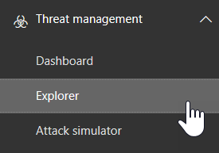

# Integration Office 365 Advanced Threat Protection mit Microsoft Defender Advanced Threat Protection

Wenn Sie Teil des Sicherheitsteams Ihrer Organisation sind, können Sie [Office 365 Advanced Threat Protection](office-365-atp.md) und zugehörige Ermittlungs-und Antwortfunktionen mit [Advanced Threat Protection von Microsoft Defender](https://docs.microsoft.com/windows/security/threat-protection/microsoft-defender-atp/microsoft-defender-advanced-threat-protection)integrieren. Dies kann Ihnen helfen, schnell zu verstehen, ob die Computer der Benutzer gefährdet sind, wenn Sie Bedrohungen in Office 365 untersuchen. Wenn die Integration beispielsweise aktiviert ist, können Sie eine Liste der Computer anzeigen, die von den Empfängern einer erkannten e-Mail-Nachricht verwendet werden, sowie die Anzahl der letzten Warnungen, die diese Computer in Microsoft Defender Advanced Threat Protection haben.
  
Die folgende Abbildung zeigt die Registerkarte **Geräte** , die angezeigt wird, wenn die Microsoft Defender ATP-Integration aktiviert ist:
  

  
In diesem Beispiel können Sie sehen, dass die Empfänger der e-Mail-Nachricht vier Geräte und eine Warnung besitzen. Wenn Sie auf den Link für ein Gerät klicken, wird seine Seite im Sicherheits Center von Microsoft Defender geöffnet.
  
## Anforderungen

- Ihre Organisation muss Office 365 ATP-Plan 2 (oder Office 365 E5) und Microsoft Defender ATP haben.
    
- Sie müssen ein globaler Administrator sein oder über eine Sicherheitsadministrator Rolle (wie etwa Sicherheitsadministrator) verfügen, die [im &amp; Security Compliance Center](https://protection.office.com)zugewiesen ist. (Siehe [Berechtigungen im Security &amp; Compliance Center](permissions-in-the-security-and-compliance-center.md))
    
- Sie müssen sowohl im Sicherheits & Compliance Center als auch im Sicherheitscenter von Microsoft Defender Zugriff auf beide [Explorer-(oder Echt Zeit Erkennungen)](threat-explorer.md) haben.
    
## So integrieren Sie Office 365 ATP mit Microsoft Defender ATP

Die Integration von Office 365 ATP mit Microsoft Defender ATP wird mithilfe des Security & Compliance Centers und des Sicherheitscenters von Microsoft Defender eingerichtet.
  
1. Wechseln Sie als globaler Administrator oder Sicherheitsadministrator zu [https://protection.office.com](https://protection.office.com) ihrem geschäftlichen oder Schulkonto, und melden Sie sich an.
    
2. Wählen Sie **Threat Management** \> **Explorer**aus.  
    
3. Wählen Sie in der oberen rechten Ecke des Bildschirms **Einstellungen für WDATP**aus.
    
4. Aktivieren Sie im Dialogfeld Microsoft Defender ATP Connection die Option **Connect to Windows ATP**.  
    
5. Aktivieren Sie die Verbindung im Sicherheits Center von Microsoft Defender ([https://securitycenter.windows.com](https://securitycenter.windows.com)).

## Verwandte Themen

[Funktionen für die Untersuchung und Reaktion auf Bedrohungen in Office 365](office-365-ti.md)
  
[Office 365 Advanced Threat Protection](office-365-atp.md)
  

