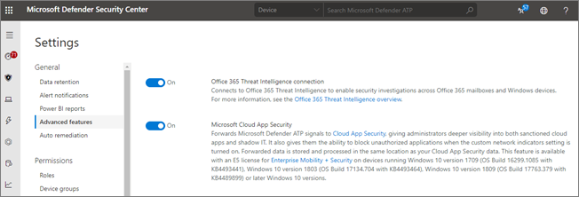

# Integration Office 365 Advanced Threat Protection mit Microsoft Defender Advanced Threat Protection

[!INCLUDE [Microsoft 365 Defender rebranding](../includes/microsoft-defender-for-office.md)]

[Office 365 Advanced Threat Protection](https://docs.microsoft.com/microsoft-365/security/office-365-security/office-365-atp?view=o365-worldwide) (Office 365 ATP) kann für die Zusammenarbeit mit [Microsoft Defender Advanced Threat Protection](https://docs.microsoft.com/windows/security/threat-protection) (Microsoft Defender ATP) konfiguriert werden.

Die Integration von Office 365 ATP mit Microsoft Defender ATP kann Ihren sicherheitsvorgängen helfen, das Team zu überwachen und schnell Maßnahmen zu ergreifen, wenn die Geräte der Benutzer gefährdet sind. Wenn die Integration beispielsweise aktiviert ist, kann Ihr Sicherheits Betriebsteam die Geräte anzeigen, die von einer erkannten e-Mail-Nachricht potenziell betroffen sind, sowie die Anzahl der letzten Warnungen, die diese Geräte in Microsoft Defender ATP haben. 

In der folgenden Abbildung wird dargestellt, wie die Registerkarte **Geräte** aussieht, wenn die ATP-Integration von Microsoft Defender aktiviert ist:
  

  
In diesem Beispiel können Sie sehen, dass die Empfänger der erkannten e-Mail-Nachricht vier Geräte und eine Warnung besitzen. Wenn Sie auf den Link für ein Gerät klicken, wird seine Seite im Sicherheits Center von Microsoft Defender geöffnet ( [https://securitycenter.windows.com](https://securitycenter.windows.com) ).

> [!TIP]
> **[Erfahren Sie mehr über das Microsoft Defender Security Center](https://docs.microsoft.com/windows/security/threat-protection/microsoft-defender-atp/use)** (auch als Microsoft Defender ATP-Portal bezeichnet).
  
## Anforderungen

- Ihre Organisation muss Office 365 ATP-Plan 2 (oder Office 365 E5) und Microsoft Defender ATP haben.
    
- Sie müssen ein globaler Administrator sein oder über eine Sicherheitsadministrator Rolle (wie etwa Sicherheitsadministrator) verfügen, die im [Security &amp; Compliance Center](https://protection.office.com)zugewiesen ist. (Siehe [Berechtigungen im Security &amp; Compliance Center](permissions-in-the-security-and-compliance-center.md))
    
- Sie müssen sowohl im Sicherheits & Compliance Center als auch im Sicherheitscenter von Microsoft Defender Zugriff auf beide [Explorer-(oder Echt Zeit Erkennungen)](threat-explorer.md) haben.
    
## So integrieren Sie Office 365 ATP mit Microsoft Defender ATP

Die Integration von Office 365 ATP mit Microsoft Defender ATP wird mithilfe des Security & Compliance Centers und des Sicherheitscenters von Microsoft Defender eingerichtet.
  
1. Wechseln Sie als globaler Administrator oder Sicherheitsadministrator zu und melden Sie sich an [https://protection.office.com](https://protection.office.com) . (Hiermit gelangen Sie zum Office 365 Security & Compliance Center.)
    
2. Wählen Sie im Navigationsbereich **Threat Management**  >  **Explorer**aus.  
    
3. Wählen Sie in der oberen rechten Ecke des Bildschirms **Einstellungen für WDATP**aus.
    
4. Aktivieren Sie im Dialogfeld Microsoft Defender ATP Connection die Option **Connect to Windows ATP**.  
    
5. Wechseln Sie zum Microsoft Defender-Sicherheits Center ( [https://securitycenter.windows.com](https://securitycenter.windows.com) ).

6. Klicken Sie in der Navigationsleiste auf **Einstellungen**. Wählen Sie dann unter **Allgemein**die Option **Erweiterte Funktionen**aus.

7. Scrollen Sie nach unten zu **Office 365 Threat Intelligence-Verbindung**, und schalten Sie die Verbindung ein.  

## Verwandte Artikel

[Funktionen für die Untersuchung und Reaktion auf Bedrohungen in Office 365](office-365-ti.md)
  
[Office 365 Advanced Threat Protection](office-365-atp.md)
  
[Microsoft Defender ATP](https://docs.microsoft.com/windows/security/threat-protection)
