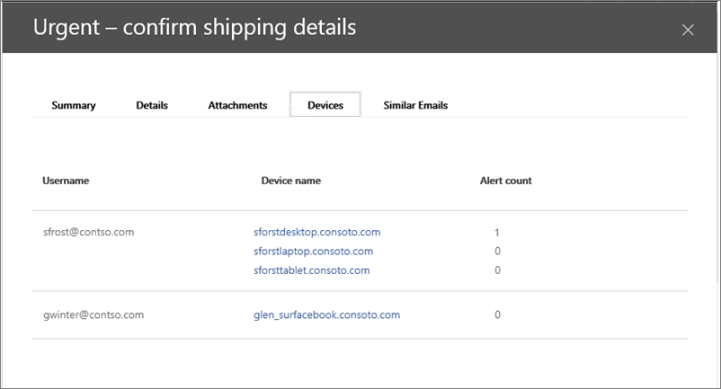

# Integration Office 365 Advanced Threat Protection mit Microsoft Defender Advanced Threat ProtectionIntegrate Office 365 Advanced Threat Protection with Microsoft Defender Advanced Threat Protection

[Office 365 Advanced Threat Protection](https://docs.microsoft.com/microsoft-365/security/office-365-security/office-365-atp?view=o365-worldwide) (Office 365 ATP) kann für die Zusammenarbeit mit [Microsoft Defender Advanced Threat Protection](https://docs.microsoft.com/windows/security/threat-protection) (Microsoft Defender ATP) konfiguriert werden.[Office 365 Advanced Threat Protection](https://docs.microsoft.com/microsoft-365/security/office-365-security/office-365-atp?view=o365-worldwide) (Office 365 ATP) can be configured to work with [Microsoft Defender Advanced Threat Protection](https://docs.microsoft.com/windows/security/threat-protection) (Microsoft Defender ATP).

Die Integration von Office 365 ATP mit Microsoft Defender ATP kann Ihren sicherheitsvorgängen helfen, das Team zu überwachen und schnell Maßnahmen zu ergreifen, wenn die Geräte der Benutzer gefährdet sind.Integrating Office 365 ATP with Microsoft Defender ATP can help your security operations team monitor and take action quickly if users' devices are at risk. Wenn die Integration beispielsweise aktiviert ist, kann Ihr Sicherheits Betriebsteam die Geräte anzeigen, die von einer erkannten e-Mail-Nachricht potenziell betroffen sind, sowie die Anzahl der letzten Warnungen, die diese Geräte in Microsoft Defender ATP haben.For example, once integration is enabled, your security operations team will be able to see the devices that are potentially affected by a detected email message, as well as how many recent alerts those devices have in Microsoft Defender ATP. 

In der folgenden Abbildung wird dargestellt, wie die Registerkarte **Geräte** aussieht, wenn die ATP-Integration von Microsoft Defender aktiviert ist:The following image depicts what the **Devices** tab looks like have Microsoft Defender ATP integration enabled:
  

  
In diesem Beispiel können Sie sehen, dass die Empfänger der erkannten e-Mail-Nachricht vier Geräte und eine Warnung besitzen.In this example, you can see that the recipients of the detected email message have four devices and one has an alert. Wenn Sie auf den Link für ein Gerät klicken, wird seine Seite im Sicherheits Center von Microsoft Defender geöffnet ( [https://securitycenter.windows.com](https://securitycenter.windows.com) ).Clicking the link for a device opens its page in the Microsoft Defender Security Center ([https://securitycenter.windows.com](https://securitycenter.windows.com)).

> [!TIP]
> **[Erfahren Sie mehr über das Microsoft Defender Security Center](https://docs.microsoft.com/windows/security/threat-protection/microsoft-defender-atp/use)** (auch als Microsoft Defender ATP-Portal bezeichnet).**[Learn more about the Microsoft Defender Security Center](https://docs.microsoft.com/windows/security/threat-protection/microsoft-defender-atp/use)** (also referred to as the Microsoft Defender ATP portal.)
  
## AnforderungenRequirements

- Ihre Organisation muss Office 365 ATP-Plan 2 (oder Office 365 E5) und Microsoft Defender ATP haben.Your organization must have Office 365 ATP Plan 2 (or Office 365 E5) and Microsoft Defender ATP.
    
- Sie müssen ein globaler Administrator sein oder über eine Sicherheitsadministrator Rolle (wie etwa Sicherheitsadministrator) verfügen, die im [Security &amp; Compliance Center](https://protection.office.com)zugewiesen ist.You must be a global administrator or have a security administrator role (such as Security Administrator) assigned in the [Security &amp; Compliance Center](https://protection.office.com). (Siehe [Berechtigungen im Security &amp; Compliance Center](permissions-in-the-security-and-compliance-center.md))(See [Permissions in the Security &amp; Compliance Center](permissions-in-the-security-and-compliance-center.md))
    
- Sie müssen sowohl im Sicherheits & Compliance Center als auch im Sicherheitscenter von Microsoft Defender Zugriff auf beide [Explorer-(oder Echt Zeit Erkennungen)](threat-explorer.md) haben.You must have access to both [Explorer (or real-time detections)](threat-explorer.md) in the Security & Compliance Center and the Microsoft Defender Security Center.
    
## So integrieren Sie Office 365 ATP mit Microsoft Defender ATPTo integrate Office 365 ATP with Microsoft Defender ATP

Die Integration von Office 365 ATP mit Microsoft Defender ATP wird mithilfe des Security & Compliance Centers und des Sicherheitscenters von Microsoft Defender eingerichtet.Integrating Office 365 ATP with Microsoft Defender ATP is set up by using both the Security & Compliance Center AND the Microsoft Defender Security Center.
  
1. Wechseln Sie als globaler Administrator oder Sicherheitsadministrator zu und melden Sie sich an [https://protection.office.com](https://protection.office.com) .As a global administrator or a security administrator, go to [https://protection.office.com](https://protection.office.com) and sign in. (Hiermit gelangen Sie zum Office 365 Security & Compliance Center.)(This takes you to the Office 365 Security & Compliance Center.)
    
2. Wählen Sie im Navigationsbereich **Threat Management**  >  **Explorer**aus.In the navigation pane, choose **Threat management** > **Explorer**.  
    
3. Wählen Sie in der oberen rechten Ecke des Bildschirms **Einstellungen für WDATP**aus.In the upper right corner of the screen, choose **WDATP Settings**.
    
4. Aktivieren Sie im Dialogfeld Microsoft Defender ATP Connection die Option **Connect to Windows ATP**.In the Microsoft Defender ATP connection dialog box, turn on **Connect to Windows ATP**.  
    
5. Wechseln Sie zum Microsoft Defender-Sicherheits Center ( [https://securitycenter.windows.com](https://securitycenter.windows.com) ).Go to the Microsoft Defender Security Center ([https://securitycenter.windows.com](https://securitycenter.windows.com)).

6. Klicken Sie in der Navigationsleiste auf **Einstellungen**.In the navigation bar, choose **Settings**. Wählen Sie dann unter **Allgemein**die Option **Erweiterte Funktionen**aus.Then, under **General**, choose **Advanced features**.

7. Scrollen Sie nach unten zu **Office 365 Threat Intelligence-Verbindung**, und schalten Sie die Verbindung ein.Scroll down to **Office 365 Threat Intelligence connection**, and turn the connection on.  

## Verwandte ArtikelRelated articles

[Funktionen für die Untersuchung und Reaktion auf Bedrohungen in Office 365Threat investigation and response capabilities in Office 365](office-365-ti.md)
  
[Office 365 Advanced Threat ProtectionOffice 365 Advanced Threat Protection](office-365-atp.md)
  
[Microsoft Defender ATPMicrosoft Defender ATP](https://docs.microsoft.com/windows/security/threat-protection)
