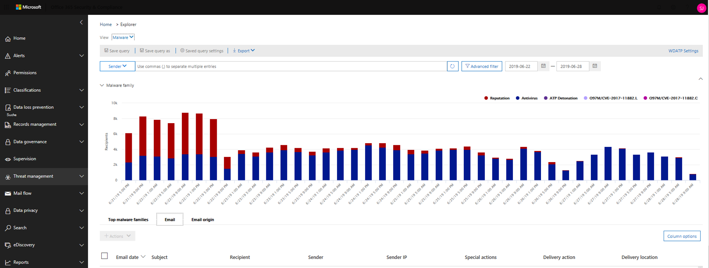
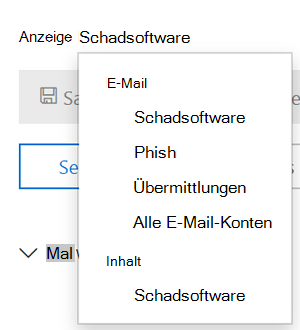

# Untersuchen bösartiger E-Mails, die in Office 365 zugestellt wurden

[!INCLUDE [Microsoft 365 Defender rebranding](../includes/microsoft-defender-for-office.md)]

**Gilt für**

- [Microsoft Defender für Office 365 Plan 1 und Plan 2](office-365-atp.md)
- [Microsoft 365 Defender](../mtp/microsoft-threat-protection.md)

[Mit Microsoft Defender für Office 365](office-365-atp.md) können Sie Aktivitäten untersuchen, die Personen in Ihrer Organisation gefährden, und Maßnahmen zum Schutz Ihrer Organisation ergreifen. Wenn Sie beispielsweise Teil des Sicherheitsteams Ihrer Organisation sind, können Sie verdächtige E-Mail-Nachrichten finden und untersuchen, die zugestellt wurden. Dazu können Sie den [Bedrohungs-Explorer (oder Echtzeiterkennungen) verwenden.](threat-explorer.md)

> [!NOTE]
> Wechseln Sie hier zum Artikel zur [Problembehebung.](remediate-malicious-email-delivered-office-365.md)

## Bevor Sie beginnen:

Stellen Sie sicher, dass folgende Anforderungen erfüllt sind:

- Ihre Organisation verfügt [über Microsoft Defender für Office 365,](office-365-atp.md) und Benutzern werden Lizenzen [zugewiesen.](../../admin/manage/assign-licenses-to-users.md)

- [Die Überwachungsprotokollierung](../../compliance/turn-audit-log-search-on-or-off.md) ist für Ihre Organisation aktiviert.

- In Ihrer Organisation sind Richtlinien für Antispam, Ansoftware, Antiphishing und andere Maßnahmen definiert. Siehe ["Schutz vor Bedrohungen in Office 365".](protect-against-threats.md)

- Sie sind ein globaler Administrator, oder Ihnen ist entweder der Sicherheitsadministrator oder die Rolle "Suchen und Löschen" im Security & Compliance Center zugewiesen. Siehe ["Berechtigungen" im Security & Compliance Center](permissions-in-the-security-and-compliance-center.md). Für einige Aktionen muss ihnen auch eine neue Vorschaurolle zugewiesen sein.

### Anzeigen einer Vorschau von Rollenberechtigungen

Um bestimmte Aktionen ausführen zu können, z. B. das Anzeigen von Nachrichtenkopfzeilen oder das Herunterladen von E-Mail-Nachrichteninhalten, muss eine neue Rolle namens *"Vorschau"* einer anderen geeigneten Rollengruppe hinzugefügt werden. In der folgenden Tabelle werden die erforderlichen Rollen und Berechtigungen erläutert.

****

|Aktivität|Rollengruppe|Vorschaurolle erforderlich?|
|---|---|---|
|Verwenden des Bedrohungs-Explorers (und Echtzeiterkennungen) zum Analysieren von Bedrohungen |Globaler Administrator 
 Sicherheitsadministrator 
 Sicherheitsleseberechtigter|Nein|
|Verwenden des Bedrohungs-Explorers (und Echtzeiterkennungen) zum Anzeigen von Kopfzeilen für E-Mail-Nachrichten sowie zum Anzeigen einer Vorschau und herunterladen von isolierten E-Mail-Nachrichten|Globaler Administrator 
 Sicherheitsadministrator 
 Sicherheitsleseberechtigter|Nein|
|Verwenden des Bedrohungs-Explorers zum Anzeigen von Kopfzeilen, Anzeigen einer Vorschau von E-Mails (nur auf der E-Mail-Entitätsseite) und Herunterladen von E-Mail-Nachrichten, die an Postfächer zugestellt werden|Globaler Administrator 
 Sicherheitsadministrator 
 Sicherheitsleseberechtigter 
 Vorschau|Ja|
|

> [!NOTE]
> *Die Vorschau* ist eine Rolle und keine Rollengruppe. Die Vorschaurolle muss einer vorhandenen Rollengruppe für Office 365 (at) hinzugefügt [https://protection.office.com](https://protection.office.com) werden. Wechseln Sie **zu "Berechtigungen",** und bearbeiten Sie dann entweder eine vorhandene Rollengruppe, oder fügen Sie eine neue Rollengruppe hinzu, der die **Vorschaurolle** zugewiesen ist.
> Der rolle "Globaler Administrator" wird das Microsoft 365 Admin Center ( ) zugewiesen, und die Rollen "Sicherheitsadministrator" und "Sicherheitsleseprogramm" werden im <https://admin.microsoft.com> Security & Compliance Center ( ) <https://protection.office.com> zugewiesen. Weitere Informationen zu Rollen und Berechtigungen finden Sie unter ["Berechtigungen"](permissions-in-the-security-and-compliance-center.md)im Security & Compliance Center.

Wir wissen, dass es sich bei der Vorschau und dem Herunterladen von E-Mails um vertrauliche Aktivitäten handelt, daher ist die Überwachung für diese aktiviert. Sobald ein Administrator diese Aktivitäten in E-Mails ausführt, werden Überwachungsprotokolle für dasselbe generiert und können im Office 365 Security & Compliance Center ( ) angezeigt [https://protection.office.com](https://protection.office.com) werden. Wechseln Sie **zur Suche im** Überwachungsprotokoll der Suche, und filtern Sie im Abschnitt  >   "Suche" nach dem Administratornamen. Die gefilterten Ergebnisse zeigen die Aktivität **AdminMailAccess an.** Wählen Sie eine Zeile aus, um Details im Abschnitt **"Weitere Informationen"** zu E-Mails in der Vorschau oder heruntergeladenen Vorschau anzuzeigen.

## Verdächtige E-Mails finden, die zugestellt wurden

Der Bedrohungs-Explorer ist ein leistungsstarker Bericht, der mehreren Zwecken dienen kann, z. B. dem Suchen und Löschen von Nachrichten, dem Identifizieren der IP-Adresse eines böswilligen E-Mail-Absenders oder dem Starten eines Vorfalls zur weiteren Untersuchung. Das folgende Verfahren konzentriert sich auf die Verwendung von Explorer zum Suchen und Löschen bösartiger E-Mails aus den Postfächern des Empfängers.

> [!NOTE]
> Standardsuchen im Explorer enthalten derzeit keine zappen Elemente.  Dies gilt für alle Ansichten, z. B. Schadsoftware- oder Phishingansichten. Wenn Sie zapptierte Elemente hinzufügen möchten, müssen Sie einen **Zustellungsaktionssatz** hinzufügen, der **von ZAP entfernt wurde.** Wenn Sie alle Optionen verwenden, werden alle Ergebnisse der Zustellungsaktion angezeigt, einschließlich der Zapped-Elemente.

1. **Navigieren Sie zu Bedrohungs-Explorer:** Wechseln Sie zu Und melden Sie sich mit Ihrem Geschäfts-, Schul- oder <https://protection.office.com> Schulkonto für Office 365 an. Dadurch werden Sie zum Security & Compliance Center um-

2. Wählen Sie im linken Navigations-Schnellstartmenü den **Bedrohungsverwaltungs-Explorer** \> **aus.**

    

    You may notice the new **Special actions** column. Mit diesem Feature sollen Administratoren über das Ergebnis der Verarbeitung einer E-Mail informiert werden. Auf **die Spalte "Sonderaktionen"** kann an derselben Stelle wie die **Zustellungsaktion** und der **Zustellungsspeicherort zugegriffen werden.** Spezielle Aktionen werden möglicherweise am Ende der E-Mail-Zeitachse des Bedrohungs-Explorers aktualisiert. Dabei handelt es sich um ein neues Feature, das darauf ausgerichtet ist, die Suche für Administratoren zu verbessern.

3. **Ansichten im Bedrohungs-Explorer:** Wählen Sie im **Menü** "Ansicht" **"Alle E-Mails" aus.**

    

    Die *Schadsoftwareansicht* ist derzeit die Standardeinstellung und erfasst E-Mails, bei denen eine Schadsoftwarebedrohung erkannt wird. Die *Phishingansicht* funktioniert auf die gleiche Weise, für Phishing.

    In der *E-Mail-Ansicht* werden jedoch alle von der Organisation empfangenen E-Mails aufgeführt, unabhängig davon, ob Bedrohungen erkannt wurden oder nicht. Wie Sie sich vorstellen können, handelt es sich dabei um eine große Menge von Daten, weshalb in dieser Ansicht ein Platzhalter angezeigt wird, der die Anwendung eines Filters fordert. (Diese Ansicht ist nur für Defender für Office 365 P2-Kunden verfügbar.)

    *Die Übermittlungsansicht* zeigt alle von einem Administrator oder Benutzer übermittelten E-Mails an, die an Microsoft gemeldet wurden.

4. **Suchen und Filtern im Bedrohungs-Explorer:** Filter werden oben auf der Seite in der Suchleiste angezeigt, um Administratoren bei ihren Untersuchungen zu unterstützen. Beachten Sie, dass mehrere Filter gleichzeitig angewendet werden können und mehrere durch Kommas getrennte Werte zu einem Filter hinzugefügt werden können, um die Suche zu einengt. Denken Sie daran:

    - Filter erfüllen bei den meisten Filterbedingungen den exakten Abgleich.
    - Der Betrefffilter verwendet eine CONTAINS-Abfrage.
    - URL-Filter funktionieren mit oder ohne Protokolle (z. B. https).
    - FÜR URL-Domänen-, URL-Pfad- und URL-Domänen- und -Pfadfilter ist kein Protokoll zum Filtern erforderlich.
    - Sie müssen jedes Mal auf das Symbol "Aktualisieren" klicken, wenn Sie die Filterwerte ändern, um relevante Ergebnisse zu erhalten.

5. **Erweiterte Filter:** Mit diesen Filtern können Sie komplexe Abfragen erstellen und Ihre Daten filtern. Wenn Sie auf *"Erweiterte Filter"* klicken, wird ein Flyout mit Optionen geöffnet.

   Die erweiterte Filterung ist eine hervorragende Ergänzung der Suchfunktionen. Ein boolescher **"NOT"-Filter** wurde für die Domäne *"Recipient",* *"Sender"* und *"Sender"* eingeführt, um Administratoren die Untersuchung durch Ausschließen von Werten zu ermöglichen. Diese Option wird unter auswahlparameter *enthält keines von* angezeigt.  Administratoren können Benachrichtigungspostfächer und Standardantwortpostfächer nicht von ihren Untersuchungen ausschließen. Dies ist nützlich für Fälle, in denen Administratoren nach einem bestimmten Betreff (subject="Attention") suchen, in dem der Empfänger auf keines der standardmäßigen E-Mail-Nachrichten *festgelegt \@ contoso.com*. Dies ist eine genaue Wertsuche.

   

   *Die Filterung nach Stunden* hilft dem Sicherheitsteam Ihrer Organisation, schnell einen Drilldown zu unternehmen. Die kürzeste zulässige Dauer beträgt 30 Minuten. Wenn Sie die verdächtige Aktion nach Zeitrahmen eingrenzn können (z. B. vor 3 Stunden), schränken Sie den Kontext ein und helfen, das Problem zu heften.

   

6. **Felder im Bedrohungs-Explorer:** Der Bedrohungs-Explorer macht viel mehr sicherheitsrelevante E-Mail-Informationen verfügbar, z. B. *Zustellungsaktion, Zustellungsspeicherort,* Spezielle *Aktion,* Direktionalität, Außerkraftsetzungen und *URL-Bedrohung.* Außerdem kann das Sicherheitsteam Ihrer Organisation mit höherer Sicherheit untersuchen.

    *Übermittlungsaktion* ist die Aktion, die aufgrund vorhandener Richtlinien oder Erkennungen für eine E-Mail-Nachricht ergriffen wird. Hier sind die möglichen Aktionen, die eine E-Mail ausführen kann:

    - **Zugestellt** – E-Mails wurden an den Posteingang oder Ordner eines Benutzers zugestellt, und der Benutzer kann direkt darauf zugreifen.
    - **Junk-E-Mails** (an Junk-E-Mails) – E-Mails wurden entweder an den Junk- oder den gelöschten Ordner des Benutzers gesendet, und der Benutzer hat Zugriff auf E-Mail-Nachrichten im Junk- oder Gelöschten Ordner.
    - **Blockiert** – alle E-Mail-Nachrichten, die sich in Quarantäne befinden, die fehlgeschlagen sind oder verworfen wurden. (Auf diese kann der Benutzer nicht mehr zugegriffen werden.)
    - **Ersetzt** – alle E-Mails, bei denen schädliche Anlagen durch TXT-Dateien ersetzt werden, in denen die Anlage als bösartig bezeichnet wird

    **Zustellungsort:** Der Filter für den Zustellungsort ist verfügbar, um Administratoren zu verstehen, wo mutmaßliche schädliche E-Mails enden und welche Aktionen dafür ergriffen wurden. Die resultierenden Daten können in eine Kalkulationstabelle exportiert werden. Mögliche Zustellungsorte sind:

    - **Posteingang oder Ordner** – Die E-Mail befindet sich gemäß Ihren E-Mail-Regeln im Posteingang oder in einem bestimmten Ordner.
    - **Lokal oder extern** – Das Postfach ist nicht in der Cloud vorhanden, sondern lokal.
    -  Junk-E-Mail-Ordner: Die E-Mail befindet sich im Junk-E-Mail-Ordner eines Benutzers.
    - **Ordner "Gelöschte** Elemente": Die E-Mail befindet sich im Ordner "Gelöschte Elemente" eines Benutzers.
    - **Quarantäne** – Die E-Mail in Quarantäne und nicht im Postfach eines Benutzers.
    - **Fehler** – Die E-Mail konnte das Postfach nicht erreichen.
    - **Dropped** – Die E-Mail wurde an einer Stelle im Nachrichtenfluss verloren.

    **Direktionalität:** Mit dieser Option kann Ihr Sicherheitsteam nach der "Richtung" filtern, von der eine E-Mail stammt oder gerade läuft. Directionality values are *Inbound*, *Outbound*, and *Intra-org* (corresponding to mail coming into your org from outside, being sent out of your org, or being sent internally to your org, respectively). Diese Informationen können Sicherheitsteams dabei helfen, Spoofing und Identitätswechsel zu erkennen, da ein Konflikt zwischen dem Directionality-Wert (z. B. *Eingehende )* und die Domäne des Absenders *(die* eine interne Domäne zu sein scheint) ist offensichtlich! Der Directionality -Wert ist getrennt und kann von der Nachrichtenverfolgung abweichen. Ergebnisse können in eine Kalkulationstabelle exportiert werden.

    Außerkraftsetzungen: Dieser Filter verwendet Informationen, die auf der Registerkarte "Details" der E-Mail angezeigt werden, und verwendet sie, um verfügbar zu machen, wo Organisations- oder Benutzerrichtlinien zum Zulassen und Blockieren von E-Mails außer Kraft *gesetzt wurden.* Der wichtigste Punkt bei diesem Filter ist, dass es dem Sicherheitsteam Ihrer Organisation hilft, zu sehen, wie viele verdächtige E-Mails aufgrund der Konfiguration zugestellt wurden. Dies gibt ihnen die Möglichkeit, die Zu- und Abr nung nach Bedarf zu ändern. Dieses Ergebnisset dieses Filters kann in eine Kalkulationstabelle exportiert werden.

    ****

    |Außerkraftsetzungen des Bedrohungs-Explorers|Was sie bedeuten|
    |---|---|
    |Zugelassen durch Organisationsrichtlinie|E-Mails wurden wie von der Organisationsrichtlinie an das Postfach gesendet.|
    |Blockiert durch Die Organisationsrichtlinie|Die Zustellung von E-Mails an das Postfach wurde wie durch die Organisationsrichtlinie verhindert.|
    |Durch die Organisationsrichtlinie blockierte Dateierweiterung|Die Zustellung der Datei an das Postfach wurde wie durch die Organisationsrichtlinie verhindert.|
    |Zulässig durch Benutzerrichtlinie|E-Mails wurden wie von der Benutzerrichtlinie an das Postfach gesendet.|
    |Durch Benutzerrichtlinie blockiert|Die Zustellung von E-Mails an das Postfach wurde wie durch die Benutzerrichtlinie verhindert.|
    |

    **URL-Bedrohung:** Das Feld "URL-Bedrohung" wurde auf der Registerkarte "Details" einer E-Mail angegeben, um die von einer URL dargestellte Bedrohung anzugeben.  Bedrohungen, die von einer URL dargestellt werden, können  *Schadsoftware,* Phishing oder *Spam* sein, und eine URL ohne Bedrohung wird im Abschnitt "Bedrohungen" "Keine" sagen.  

7. **Ansicht**"E-Mail-Zeitachse": Ihr Sicherheitsteam muss möglicherweise die E-Mail-Details untersuchen, um weitere Untersuchungen durchzuführen. Auf der E-Mail-Zeitachse können Administratoren Aktionen anzeigen, die für eine E-Mail von der Zustellung bis zur Postzustellung ergriffen wurden. Klicken Sie zum Anzeigen einer E-Mail-Zeitachse auf den Betreff einer E-Mail-Nachricht, und klicken Sie dann auf "E-Mail-Zeitachse". (Es wird unter anderen Überschriften im Bereich angezeigt, z. B. Zusammenfassung oder Details.) Diese Ergebnisse können in eine Kalkulationstabelle exportiert werden.

    Die E-Mail-Zeitachse wird zu einer Tabelle geöffnet, in der alle Übermittlungs- und Nachzustellungsereignisse für die E-Mail angezeigt werden. Wenn keine weiteren Aktionen für die E-Mail-Nachricht enthalten sind, sollte ein einzelnes Ereignis für die ursprüngliche Zustellung mit einem Ergebnis wie "Blockiert" mit einem Ergebnis wie *"Phishing" zu sehen sein.* Administratoren können die gesamte E-Mail-Zeitachse exportieren, einschließlich aller Details auf der Registerkarte und E-Mail (z. B. Betreff, Absender, Empfänger, Netzwerk und Nachrichten-ID). Die E-Mail-Zeitachse schneidet die Zufälligisierung ab, da weniger Zeit für die Überprüfung verschiedener Speicherorte zur Verfügung steht, um die Ereignisse zu verstehen, die seit dem Eintreffen der E-Mail passiert sind. Wenn mehrere Ereignisse gleichzeitig oder nah bei einer E-Mail auftreten, werden diese Ereignisse in einer Zeitachsenansicht angezeigt.

8. **Vorschau/Download:** Der Bedrohungs-Explorer bietet Ihrem Sicherheitsteam die Details, die sie zum Untersuchen verdächtiger E-Mails benötigen. Ihr Sicherheitsteam kann:

    - [Überprüfen Sie die Zustellungsaktion und den Ort.](#check-the-delivery-action-and-location)

    - [Zeigen Sie die Zeitachse Ihrer E-Mail an.](#view-the-timeline-of-your-email)

### Überprüfen der Zustellungsaktion und des Orts

Im [Bedrohungs-Explorer (und In-Echtzeit-Erkennungen)](threat-explorer.md)  verfügen Sie jetzt über Spalten für Zustellungsaktion und Zustellungsspeicherort anstelle der früheren **Spalte "Zustellungsstatus".**  Dies führt zu einem vollständigeren Bild, wo Ihre E-Mail-Nachrichten landen. Teil des Ziels dieser Änderung ist es, Untersuchungen für Sicherheitsteams zu vereinfachen, aber das Ergebnis ist, den Speicherort von problematischen E-Mail-Nachrichten auf einen Blick zu kennen.

Der Zustellungsstatus ist nun in zwei Spalten aufgeschlüsselt:

- **Zustellungsaktion** – Wie ist der Status dieser E-Mail?

- **Zustellungsort** – Wo wurde diese E-Mail-Nachricht als Ergebnis geroutet?

Übermittlungsaktion ist die Aktion, die aufgrund vorhandener Richtlinien oder Erkennungen für eine E-Mail-Nachricht ergriffen wird. Hier sind die möglichen Aktionen, die eine E-Mail ausführen kann:

- **Zugestellt** – E-Mails wurden an den Posteingang oder Ordner eines Benutzers zugestellt, und der Benutzer kann direkt darauf zugreifen.

- **Junk-E-Mails–** E-Mails wurden entweder an den Junk- oder den gelöschten Ordner des Benutzers gesendet, und der Benutzer hat Zugriff auf E-Mail-Nachrichten im Ordner "Junk" oder "Gelöscht".

- **Blockiert** – alle E-Mail-Nachrichten, die sich in Quarantäne befinden, die fehlgeschlagen sind oder verworfen wurden. (Auf diese kann der Benutzer nicht mehr zugegriffen werden.)

- **Ersetzt** – alle E-Mails, bei denen schädliche Anlagen durch TXT-Dateien ersetzt werden, in denen die Anlage als bösartig bezeichnet wird.

Der Zustellungsspeicherort zeigt die Ergebnisse von Richtlinien und Erkennungen an, die nach der Zustellung ausgeführt werden. Es ist mit einer Zustellungsaktion verknüpft. Dieses Feld wurde hinzugefügt, um Einen Einblick in die Aktion zu erhalten, die beim Aufgefunden einer problematischen E-Mail-Nachricht ergriffen wurde. Hier sind die möglichen Werte des Zustellungsorts:

- **Posteingang oder Ordner** – Die E-Mail befindet sich im Posteingang oder in einem Ordner (gemäß Ihren E-Mail-Regeln).

- **Lokal oder extern** – Das Postfach ist nicht in der Cloud vorhanden, sondern lokal.

- **Junk-Ordner:** Die E-Mail befindet sich im Junk-E-Mail-Ordner eines Benutzers.

- **Ordner "Gelöschte** Elemente": Die E-Mail befindet sich im Ordner "Gelöschte Elemente" eines Benutzers.

- **Quarantäne** – Die E-Mail in Quarantäne und nicht im Postfach eines Benutzers.

- **Fehler** – Die E-Mail konnte das Postfach nicht erreichen.

- **Dropped** – Die E-Mail geht irgendwo im Nachrichtenfluss verloren.

### Anzeigen der Zeitachse Ihrer E-Mail

**Die** E-Mail-Zeitachse ist ein Feld im Bedrohungs-Explorer, das die Suche für Ihr Sicherheitsteam erleichtert. Wenn mehrere Ereignisse in einer E-Mail gleichzeitig oder in der Nähe auftreten, werden diese Ereignisse in einer Zeitachsenansicht angezeigt. Einige Ereignisse, die nach der Zustellung an E-Mails auftreten, werden in der Spalte "Spezielle **Aktionen"** erfasst. Durch das Kombinieren von Informationen aus der Zeitachse einer E-Mail-Nachricht mit speziellen Aktionen, die nach der Zustellung ergriffen wurden, erhalten Administratoren Einblicke in Richtlinien und die Behandlung von Bedrohungen (z. B. wohin die E-Mail geroutet wurde und in einigen Fällen, was die endgültige Bewertung war).

> [!IMPORTANT]
> Wechseln Sie hier zu einem [Problembehebungsthema.](remediate-malicious-email-delivered-office-365.md)

## Verwandte Themen

[Behebung bösartiger E-Mails, die in Office 365 zugestellt wurden](remediate-malicious-email-delivered-office-365.md)

[Microsoft Defender für Office 365](office-365-ti.md)

[Schutz vor Bedrohungen in Office 365](protect-against-threats.md)

[Anzeigen von Berichten für Defender für Office 365](view-reports-for-atp.md)
