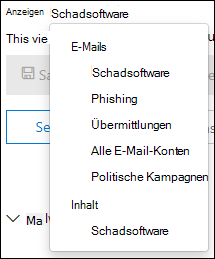

# Untersuchen schädlicher e-Mails, die in Office 365 bereitgestellt wurdenInvestigate malicious email that was delivered in Office 365

[!INCLUDE [Microsoft 365 Defender rebranding](../includes/microsoft-defender-for-office.md)]

[Microsoft Defender für Office 365](office-365-atp.md) ermöglicht es Ihnen, Aktivitäten zu untersuchen, mit denen Personen in Ihrer Organisation gefährdet werden, und Maßnahmen zum Schutz Ihrer Organisation zu ergreifen.[Microsoft Defender for Office 365](office-365-atp.md) enables you to investigate activities that put people in your organization at risk, and to take action to protect your organization. Wenn Sie beispielsweise Teil des Sicherheitsteams Ihrer Organisation sind, können Sie nach verdächtigen e-Mail-Nachrichten suchen und diese untersuchen, die übermittelt wurden.For example, if you are part of your organization's security team, you can find and investigate suspicious email messages that were delivered. Sie können dies mithilfe von [Threat Explorer (oder Echtzeiterkennung)](threat-explorer.md)durchführen.You can do this by using [Threat Explorer (or real-time detections)](threat-explorer.md).

> [!NOTE]
> Wechseln Sie [hier](remediate-malicious-email-delivered-office-365.md)zum Korrektur Artikel.Jump to the remediation article [here](remediate-malicious-email-delivered-office-365.md).

## Bevor Sie beginnenBefore you begin

Stellen Sie sicher, dass folgende Anforderungen erfüllt sind:Make sure that the following requirements are met:

- Ihre Organisation verfügt über [Microsoft Defender für Office 365](office-365-atp.md) und [Lizenzen werden Benutzern zugewiesen](../../admin/manage/assign-licenses-to-users.md).Your organization has [Microsoft Defender for Office 365](office-365-atp.md) and [licenses are assigned to users](../../admin/manage/assign-licenses-to-users.md).

- die [Überwachungsprotokollierung](../../compliance/turn-audit-log-search-on-or-off.md) ist für Ihre Organisation aktiviert.[audit logging](../../compliance/turn-audit-log-search-on-or-off.md) is turned on for your organization.

- Ihre Organisation verfügt über Richtlinien, die für Antispam-, Antischadsoftware-und Anti-Phishing-Maßnahmen und so weiter definiert sind.Your organization has policies defined for anti-spam, anti-malware, anti-phishing, and so on. Weitere Informationen finden Sie unter [Protect Against Threats in Office 365](protect-against-threats.md).See [Protect against threats in Office 365](protect-against-threats.md).

- Sie sind globaler Administrator oder haben im Security & Compliance Center entweder den Sicherheitsadministrator oder die Such-und Säuberungs Rolle zugewiesen.You are a global administrator, or you have either the Security Administrator or the Search and Purge role assigned in the Security & Compliance Center. Weitere Informationen finden Sie unter [Permissions in the Security & Compliance Center](permissions-in-the-security-and-compliance-center.md).See [Permissions in the Security & Compliance Center](permissions-in-the-security-and-compliance-center.md). Für einige Aktionen muss auch eine neue Vorschau Rolle zugewiesen sein.For some actions, you must also have a new Preview role assigned.

### Vorschau der Rollen BerechtigungenPreview role permissions

Um bestimmte Aktionen auszuführen, beispielsweise das Anzeigen von Nachrichtenkopfzeilen oder das Herunterladen von e-Mail-Nachrichteninhalten, müssen Sie eine neue Rolle namens " *Preview* " zu einer anderen entsprechenden Rollengruppe hinzufügen.To perform certain actions, such as viewing message headers or downloading email message content, you must have a new role called *Preview* added to another appropriate role group. In der folgenden Tabelle werden die erforderlichen Rollen und Berechtigungen erläutert.The following table clarifies required roles and permissions.

****

|AktivitätActivity|RollengruppeRole group|Vorschau-Rolle erforderlich?Preview role needed?|
|---|---|---|
|Verwenden von Threat Explorer (und Echtzeiterkennung) zum Analysieren von BedrohungenUse Threat Explorer (and real-time detections) to analyze threats |Globaler AdministratorGlobal Administrator 
 SicherheitsadministratorSecurity Administrator 
 SicherheitsleseberechtigterSecurity Reader|NeinNo|
|Verwenden Sie Threat Explorer (und Echtzeiterkennung), um Kopfzeilen für e-Mail-Nachrichten anzuzeigen sowie e-Mail-Nachrichten, die in Quarantäne verschoben wurden, anzuzeigen und herunterzuladen.Use Threat Explorer (and real-time detections) to view headers for email messages as well as preview and download quarantined email messages|Globaler AdministratorGlobal Administrator 
 SicherheitsadministratorSecurity Administrator 
 SicherheitsleseberechtigterSecurity Reader|NeinNo|
|Verwenden von Threat Explorer zum Anzeigen von Kopfzeilen, e-Mail-Vorschau (nur auf der Seite "e-Mail-Entität") und Herunterladen von e-Mails an PostfächerUse Threat Explorer to view headers, preview email (only in the email entity page) and download email messages delivered to mailboxes|Globaler AdministratorGlobal Administrator 
 SicherheitsadministratorSecurity Administrator 
 SicherheitsleseberechtigterSecurity Reader 
 VorschauPreview|JaYes|
|

> [!NOTE]
> *Vorschau* ist eine Rolle und keine Rollengruppe; die Vorschau Rolle muss einer vorhandenen Rollengruppe für Office 365 (at) hinzugefügt werden [https://protection.office.com](https://protection.office.com) .*Preview* is a role and not a role group; the Preview role must be added to an existing role group for Office 365 (at [https://protection.office.com](https://protection.office.com)). Wechseln Sie zu **Berechtigungen**, und bearbeiten Sie dann entweder eine vorhandene Rollengruppe, oder fügen Sie eine neue Rollengruppe mit der zugewiesenen **Vorschau** Rolle hinzu.Go to **Permissions**, and then either edit an existing role group or add a new role group with the **Preview** role assigned.
> Der globalen Administrator Rolle wird das Microsoft 365 Admin Center ( <https://admin.microsoft.com> ) zugewiesen, und die Rollen Sicherheitsadministrator und Sicherheits Leser werden im Security & Compliance Center zugewiesen ( <https://protection.office.com> ).The Global Administrator role is assigned the Microsoft 365 admin center (<https://admin.microsoft.com>), and the Security Administrator and Security Reader roles are assigned in the Security & Compliance Center (<https://protection.office.com>). Weitere Informationen zu Rollen und Berechtigungen finden Sie unter [Permissions in the Security & Compliance Center](permissions-in-the-security-and-compliance-center.md).To learn more about roles and permissions, see [Permissions in the Security & Compliance Center](permissions-in-the-security-and-compliance-center.md).

Wir verstehen, dass die Vorschau und das Herunterladen von e-Mails vertrauliche Aktivitäten sind, daher ist die Überwachung für diese aktiviert.We understand previewing and downloading email are sensitive activities, and so we auditing is enabled for these. Sobald ein Administrator diese Aktivitäten in e-Mails ausführt, werden Überwachungsprotokolle für dasselbe generiert und können im Office 365 Security & Compliance Center () angezeigt werden [https://protection.office.com](https://protection.office.com) .Once an admin performs these activities on emails, audit logs are generated for the same and can be seen in the Office 365 Security & Compliance Center ([https://protection.office.com](https://protection.office.com)). Wechseln Sie **zu Such**  >  **Überwachungsprotokoll-Suche** , und Filtern Sie nach dem admin-Namen im Abschnitt Suche.Go to **Search** > **Audit log search** and filter on the admin name in Search section. Die gefilterten Ergebnisse zeigen Aktivitäts **AdminMailAccess**.The filtered results will show activity **AdminMailAccess**. Wählen Sie eine Zeile aus, um Details im Abschnitt **Weitere Informationen** über eine Vorschau oder heruntergeladene e-Mails anzuzeigen.Select a row to view details in the **More information** section about previewed or downloaded email.

## Verdächtige e-Mails finden, die zugestellt wurdenFind suspicious email that was delivered

Threat Explorer ist ein leistungsfähiger Bericht, der mehrere Zwecke wie das Suchen und Löschen von Nachrichten, das Identifizieren der IP-Adresse eines böswilligen e-Mail-Absenders oder das Starten eines Vorfalls zur weiteren Untersuchung dienen kann.Threat Explorer is a powerful report that can serve multiple purposes, such as finding and deleting messages, identifying the IP address of a malicious email sender, or starting an incident for further investigation. Das folgende Verfahren konzentriert sich auf die Verwendung von Explorer zum Suchen und Löschen von böswilligen e-Mails aus Postfächern des Empfängers.The following procedure focuses on using Explorer to find and delete malicious email from recipient's mailboxes.

> [!NOTE]
> Standardsuch Vorgänge im Explorer enthalten derzeit keine gezappten Elemente.Default searches in Explorer don't currently include Zapped items.  Dies gilt für alle Ansichten, beispielsweise Schadsoftware oder Phishing-Ansichten.This applies to all views, for example malware or phish views. Um gezappte Elemente einzuschließen, müssen Sie einen **Zustellungs Aktionssatz** hinzufügen, der **von zap entfernt wurde**.To include Zapped items you need to add a **Delivery action** set to include **Removed by ZAP**. Wenn Sie alle Optionen einschließen, werden alle Ergebnisse der Übermittlungsaktion angezeigt, einschließlich zapped-Elementen.If you include all options, you'll see all delivery action results, including Zapped items.

1. **Navigieren Sie zu Threat Explorer**: Wechseln Sie zu, <https://protection.office.com> und melden Sie sich mit Ihrem Arbeits-oder Schulkonto für Office 365 an.**Navigate to Threat Explorer**: Go to <https://protection.office.com> and sign in using your work or school account for Office 365. Dadurch gelangen Sie zum Security & Compliance Center.This takes you to the Security & Compliance Center.

2. Klicken Sie in der linken Navigations Schnellstartleiste auf **Threat Management** \> **Explorer**.In the left navigation quick-launch, choose **Threat management** \> **Explorer**.

    

    Möglicherweise wird die Spalte neue **spezielle Aktionen** feststellen.You may notice the new **Special actions** column. Dieses Feature zielt darauf ab, den Administratoren das Ergebnis der Verarbeitung einer e-Mail mitzuteilen.This feature is aimed at telling admins the outcome of processing an email. Auf die Spalte **spezielle Aktionen** kann an derselben Stelle wie **Zustellungs Aktion** und **Zustellungs Speicherort** zugegriffen werden.The **Special actions** column can be accessed in the same place as **Delivery action** and **Delivery location**. Spezielle Aktionen können am Ende der e-Mail-Zeitachse von Threat Explorer aktualisiert werden, ein neues Feature, mit dem die Jagd Erfahrung für Administratoren besser gemacht werden soll.Special actions might be updated at the end of Threat Explorer's email timeline, which is a new feature aimed at making the hunting experience better for admins.

3. **Ansichten im Bedrohungs-Explorer**: Wählen Sie im Menü **Ansicht** die Option **alle e-Mails** aus.**Views in Threat Explorer**: In the **View** menu, choose **All email**.

    

    Die *Malware* -Ansicht ist derzeit die Standardeinstellung und erfasst e-Mails, bei denen eine Malwarebedrohung erkannt wird.The *Malware* view is currently the default, and captures emails where a malware threat is detected. Die *Phishing* -Ansicht funktioniert auf die gleiche Weise, für Phishing.The *Phish* view operates in the same way, for Phish.

    In der *e-Mail-* Ansicht werden allerdings alle von der Organisation empfangenen e-Mails aufgelistet, unabhängig davon, ob Bedrohungen erkannt wurden oder nicht.However, *All email* view lists every mail received by the organization, whether threats were detected or not. Wie Sie sich vorstellen können, handelt es sich dabei um viele Daten, weshalb in dieser Ansicht ein Platzhalter angezeigt wird, der die Anwendung eines Filters anfordert.As you can imagine, this is a lot of data, which is why this view shows a placeholder that asks a filter be applied. (Diese Ansicht ist nur für Defender für Office 365 P2-Kunden verfügbar.)(This view is only available for Defender for Office 365 P2 customers.)

    Ansicht " *Einsendungen* " zeigt alle e-Mails an, die von Administrator oder Benutzer übermittelt wurden, die an Microsoft gemeldet wurden.*Submissions* view shows up all mails submitted by admin or user that were reported to Microsoft.

4. **Suchen und Filtern in Threat Explorer**: Filter werden oben auf der Seite in der Suchleiste angezeigt, um Administratoren bei ihren Untersuchungen zu unterstützen.**Search and filter in Threat Explorer**: Filters appear at the top of the page in the search bar to help admins in their investigations. Beachten Sie, dass mehrere Filter gleichzeitig angewendet werden können, und mehrere durch trennzeichengetrennte Werte zu einem Filter hinzugefügt werden, um die Suche einzuschränken.Notice that multiple filters can be applied at the same time, and multiple comma-separated values added to a filter to narrow down the search. Denken Sie daran:Remember:

    - Filter führen bei den meisten Filterbedingungen eine exakte Übereinstimmung aus.Filters do exact matching on most filter conditions.
    - Der Antragsteller Filter verwendet eine Contains-Abfrage.Subject filter uses a CONTAINS query.
    - URL-Filter funktionieren mit oder ohne Protokolle (z. b.URL filters work with or without protocols (ex. HTTPS).https).
    - Für URL-Domäne, URL-Pfad und URL-Domänen-und Pfadfilter ist kein Protokoll zum Filtern erforderlich.URL domain, URL path, and URL domain and path filters don't require a protocol to filter.
    - Sie müssen jedes Mal, wenn Sie die Filterwerte ändern, auf das Symbol Aktualisieren klicken, um relevante Ergebnisse zu erhalten.You must click the Refresh icon every time you change the filter values to get relevant results.

5. **Erweiterte Filter**: mit diesen Filtern können Sie komplexe Abfragen erstellen und das Dataset filtern.**Advanced filters**: With these filters, you can build complex queries and filter your data set. Durch Klicken auf *Erweiterte Filter* wird ein Flyout mit Optionen geöffnet.Clicking on *Advanced Filters* opens a flyout with options.

   Die erweiterte Filterung ist eine hervorragende Ergänzung der Suchfunktionen.Advanced filtering is a great addition to search capabilities. Ein boolescher **Not** -Filter wurde für die *Empfänger*-, *Absender* -und *Absenderdomäne* eingeführt, um Administratoren die Untersuchung durch Ausschließen von Werten zu ermöglichen.A boolean **NOT** filter has been introduced on *Recipient*, *Sender* and *Sender domain* to allow admins to investigate by excluding values. Diese Option wird unter Selection Parameter *Contains None of* angezeigt.This option appears under selection parameter *Contains none of*. **Not** lässt zu, dass Administratoren Warnungs Postfächer, standardmäßige Antwort Postfächer aus ihren Untersuchungen ausschließen, und ist nützlich für Fälle, in denen Administratoren nach einem bestimmten Betreff suchen (Subject = "ATTENTION"), wobei der Empfänger auf *keines von defaultMail \@ contoso.com* festgelegt werden kann.**NOT** will let admins exclude alert mailboxes, default reply mailboxes from their investigations, and is useful for cases where admins search for a specific subject (subject="Attention") where the Recipient can be set to *none of defaultMail\@contoso.com*. Dies ist eine exakte Wert Suche.This is an exact value search.

   

   Das *Filtern nach Stunden* hilft dem Sicherheitsteam Ihres Unternehmens schnell.*Filtering by hours* will help your organization's security team drill down quickly. Die kürzeste zulässige Dauer beträgt 30 Minuten.The shortest allowed time duration is 30 minutes. Wenn Sie die verdächtige Aktion mit einem Zeitrahmen eingrenzen können (beispielsweise vor 3 Std.), wird dadurch der Kontext eingeschränkt und das Problem gezielt identifiziert.If you can narrow the suspicious action by time-frame (e.g. it happened 3 hours ago), this will limit the context and help pinpoint the problem.

   

6. **Fields in Threat Explorer**: Threat Explorer macht viel mehr sicherheitsbezogene e-Mail-Informationen wie *Zustellungs Aktionen*, *Zustellungsorte*, *spezielle Aktionen*, *Richtungs*-, *Außerkraftsetzungen* und *URL-Bedrohungen* verfügbar.**Fields in Threat Explorer**: Threat Explorer exposes a lot more security-related mail information such as *Delivery action*, *Delivery location*, *Special action*, *Directionality*, *Overrides*, and *URL threat*. Außerdem kann das Sicherheitsteam Ihrer Organisation mit höherer Sicherheit untersucht werden.It also allows your organization's security team to investigate with a higher certainty.

    *Zustellungs Aktion* ist die Aktion, die aufgrund vorhandener Richtlinien oder Erkennungen auf eine e-Mail angewendet wird.*Delivery action* is the action taken on an email due to existing policies or detections. Hier sind die möglichen Aktionen, die eine e-Mail ausführen kann:Here are the possible actions an email can take:

    - **Zugestellt** – e-Mails wurden im Posteingang oder Ordner eines Benutzers zugestellt, und der Benutzer kann direkt darauf zugreifen.**Delivered** – email was delivered to inbox or folder of a user and the user can directly access it.
    - **Junked** (zugestellt an Junk) – e-Mails wurden entweder an den Junk-Ordner des Benutzers oder den Ordner "gelöscht" gesendet, und der Benutzer hat Zugriff auf e-Mail-Nachrichten in seinem Junk-oder Deleted-Ordner.**Junked** (Delivered to junk)– email was sent to either user's junk folder or deleted folder, and the user has access to email messages in their Junk or Deleted folder.
    - **Blockiert** – alle e-Mail-Nachrichten, die unter Quarantäne gestellt, fehlerhaft oder gelöscht wurden.**Blocked** – any email messages that are quarantined, that failed, or were dropped. (Für den Benutzer ist vollständig kein Zugriff möglich.)(This is completely inaccessible by the user.)
    - **Ersetzt** – jede e-Mail-Nachricht, bei der böswillige Anlagen durch txt-Dateien ersetzt werden, die den Status der Anlage böswillig aufweisen**Replaced** – any email where malicious attachments are replaced by .txt files that state the attachment was malicious

    **Zustellungsort**: der Filter "Übermittlungsort" steht zur Verfügung, damit Administratoren verstehen, wo verdächtige böswillige e-Mails beendet wurden und welche Aktionen dazu unternommen wurden.**Delivery location**: The Delivery location filter is available in order to help admins understand where suspected malicious mail ended-up and what actions were taken on it. Die daraus resultierenden Daten können in das Arbeitsblatt exportiert werden.The resulting data can be exported to spreadsheet. Mögliche Zustellungsorte sind:Possible delivery locations are:

    - **Posteingang oder Ordner** – die e-Mail befindet sich im Posteingang oder in einem bestimmten Ordner, entsprechend Ihren e-Mail-Regeln.**Inbox or folder** – The email is in the Inbox or a specific folder, according to your email rules.
    - **On-Prem oder External** – das Postfach ist nicht in der Cloud vorhanden, sondern lokal.**On-prem or external** – The mailbox doesn't exist in the Cloud but is on-premises.
    - **Junk-Ordner** – die e-Mail befindet sich im Junk-e-Mail-Ordner eines Benutzers.**Junk folder** – The email is in a user's Junk mail folder.
    - **Ordner "Gelöschte Elemente"** – die e-Mail befindet sich im Ordner "Gelöschte Elemente" eines Benutzers.**Deleted items folder** – The email is in a user's Deleted items folder.
    - **Quarantine** – die e-Mail-Nachricht in Quarantäne und nicht im Postfach eines Benutzers.**Quarantine** – The email in quarantine, and not in a user's mailbox.
    - **Fehler** – die e-Mail konnte das Postfach nicht erreichen.**Failed** – The email failed to reach the mailbox.
    - **Fallen gelassen** – die e-Mail ging an einer beliebigen Stelle im Nachrichtenfluss verloren.**Dropped** – The email was lost somewhere in the mail flow.

    **Directional**: mit dieser Option können Ihre Sicherheits Betriebsteams nach der "Richtung" filtern, aus der eine e-Mail stammt, oder Sie wird ausgeführt.**Directionality**: This option allows your security operations team to filter by the 'direction' a mail comes from, or is going. Die Richtwerte sind *eingehend*, ausgehend und *Intra-org* (entsprechend zu e-Mails, die von außerhalb an Ihre Organisation gesendet *werden, die* aus Ihrer Organisation gesendet werden oder intern an Ihre org gesendet werden).Directionality values are *Inbound*, *Outbound*, and *Intra-org* (corresponding to mail coming into your org from outside, being sent out of your org, or being sent internally to your org, respectively). Diese Informationen können Sicherheitsteams beim spotten von Spoofing und Identitätswechsel helfen, da ein Missverhältnis zwischen dem Richtungswert (ex.This information can help security operations teams spot spoofing and impersonation, because a mismatch between the Directionality value (ex. *Eingehend*) und die Domäne des Absenders (die *scheinbar* eine interne Domäne ist) ist offensichtlich!*Inbound*), and the domain of the sender (which *appears* to be an internal domain) will be evident! Der Richtungswert ist getrennt und kann von der Nachrichtenablaufverfolgung abweichen.The Directionality value is separate, and can differ from, the Message Trace. Ergebnisse können in das Arbeitsblatt exportiert werden.Results can be exported to spreadsheet.

    **Außerkraftsetzungen**: dieser Filter enthält Informationen, die auf der Registerkarte Details der e-Mail angezeigt werden, und verwendet diese, um anzuzeigen, wo Organisations-oder Benutzerrichtlinien zum zulassen und Blockieren von e-Mails *außer Kraft gesetzt* wurden.**Overrides**: This filter takes information that appears on the mail's details tab and uses it to expose where organizational, or user policies, for allowing and blocking mails have been *overridden*. Das wichtigste an diesem Filter ist, dass es dem Sicherheitsteam Ihres Unternehmens hilft zu sehen, wie viele verdächtige e-Mails aufgrund der Konfiguration übermittelt wurden.The most important thing about this filter is that it helps your organization's security team see how many suspicious emails were delivered due to configuration. Dadurch erhalten Sie die Möglichkeit, nach Bedarf die zulässigen und blockierten zu ändern.This gives them an opportunity to modify allows and blocks as needed. Dieses Resultset dieses Filters kann in das Arbeitsblatt exportiert werden.This result set of this filter can be exported to spreadsheet.

    ****

    |Überschreibungen von Threat ExplorerThreat Explorer Overrides|BedeutungWhat they mean|
    |---|---|
    |Zulässig durch org-RichtlinieAllowed by Org Policy|E-Mail-Nachrichten wurden im Postfach gemäß der Organisationsrichtlinie zugelassen.Mail was allowed into the mailbox as directed by the organization policy.|
    |Durch org-Richtlinie blockiertBlocked by Org policy|E-Mail-Nachrichten wurden gemäß der Organisationsrichtlinie von der Zustellung an das Postfach blockiert.Mail was blocked from delivery to the mailbox as directed by the organization policy.|
    |Durch die org-Richtlinie blockierte DateierweiterungFile extension blocked by Org Policy|Die Datei wurde gemäß der Organisationsrichtlinie von der Zustellung an das Postfach blockiert.File was blocked from delivery to the mailbox as directed by the organization policy.|
    |Nach Benutzerrichtlinie zulässigAllowed by User Policy|E-Mail-Nachrichten wurden gemäß der Benutzerrichtlinie in das Postfach zugelassen.Mail was allowed into the mailbox as directed by the user policy.|
    |Durch Benutzerrichtlinie blockiertBlocked by User Policy|E-Mail-Nachrichten wurden gemäß der Benutzerrichtlinie von der Zustellung an das Postfach blockiert.Mail was blocked from delivery to the mailbox as directed by the user policy.|
    |

    **URL Threat**: das Feld URL-Bedrohung wurde auf der Registerkarte *Details* einer e-Mail angezeigt, um die von einer URL dargestellte Bedrohung anzugeben.**URL threat**: The URL threat field has been included on the *details* tab of an email to indicate the threat presented by a URL. Bedrohungen, die von einer URL dargestellt werden, können *Schadsoftware*, *Phishing* oder *Spam* sein, und eine URL *ohne Bedrohung* wird im Abschnitt "Bedrohungen" *keine Aussage geben* .Threats presented by a URL can include *Malware*, *Phish*, or *Spam*, and a URL with *no threat* will say *None* in the threats section.

7. **E-Mail-Zeitachsenansicht**: Ihr Sicherheits Betriebsteam muss möglicherweise tief in die e-Mail-Details eintauchen, um weiter zu untersuchen.**Email timeline view**: Your security operations team might need to deep-dive into email details to investigate further. Die e-Mail-Zeitachse ermöglicht Administratoren das Anzeigen von Aktionen, die in einer e-Mail von der Zustellung bis zur nach Zustellung vorgenommen wurden.The email timeline allows admins to view actions taken on an email from delivery to post-delivery. Klicken Sie zum Anzeigen einer e-Mail-Zeitachse auf den Betreff einer e-Mail-Nachricht, und klicken Sie dann auf e-Mail-Zeitplan.To view an email timeline, click on the subject of an email message, and then click Email timeline. (Es wird unter anderen Überschriften wie Zusammenfassung oder Details auf dem Panel angezeigt.) Diese Ergebnisse können in das Arbeitsblatt exportiert werden.(It appears among other headings on the panel like Summary or Details.) These results can be exported to spreadsheet.

    Die e-Mail-Zeitachse wird in einer Tabelle geöffnet, in der alle Zustellungs-und Post Zustell Ereignisse für die e-Mail angezeigt werden.Email timeline will open to a table that shows all delivery and post-delivery events for the email. Wenn die e-Mail keine weiteren Aktionen enthält, sollten Sie ein einzelnes Ereignis für die ursprüngliche Zustellung sehen, das ein Ergebnis wie " *blockiert*" mit einem Urteil wie " *Phishing*" angibt.If there are no further actions on the email, you should see a single event for the original delivery that states a result, such as *Blocked*, with a verdict like *Phish*. Administratoren können die gesamte e-Mail-Zeitachse exportieren, einschließlich aller Details auf der Registerkarte und der e-Mail-Adresse (wie Betreff, Absender, Empfänger, Netzwerk und Nachrichten-ID).Admins can export the entire email timeline, including all details on the tab and email (such as, Subject, Sender, Recipient, Network, and Message ID). Die e-Mail-Zeitachse schneidet nach dem Zufallsprinzip ab, da es bei der Überprüfung verschiedener Standorte kürzer ist, um zu versuchen, Ereignisse zu verstehen, die seit dem Eintreffen der e-Mail geschehen sind.The email timeline cuts down on randomization because there is less time spent checking different locations to try to understand events that happened since the email arrived. Wenn mehrere Ereignisse bei oder nahe gleichzeitig in einer e-Mail auftreten, werden diese Ereignisse in einer Zeitachsenansicht angezeigt.When multiple events happen at, or close to, the same time on an email, those events show up in a timeline view.

8. **Vorschau/Download**: Threat Explorer gibt Ihrem Security Operations-Team die Details, die Sie benötigen, um verdächtige e-Mails zu untersuchen.**Preview / download**: Threat Explorer gives your security operations team the details they need to investigate suspicious email. Ihr Sicherheits Betriebsteam kann entweder:Your security operations team can either:

    - [Überprüfen Sie die Zustellungs Aktion und den Speicherort](#check-the-delivery-action-and-location).[Check the delivery action and location](#check-the-delivery-action-and-location).

    - [Zeigen Sie die Zeitachse Ihrer e-Mail an](#view-the-timeline-of-your-email).[View the timeline of your email](#view-the-timeline-of-your-email).

### Überprüfen der Übermittlungsaktion und des SpeicherortsCheck the delivery action and location

In [Threat Explorer (und Echtzeiterkennung)](threat-explorer.md)haben Sie nun die Spalten **Zustellungs Aktion** und **Zustellungs Speicherort** anstelle der früheren Spalte **Zustellungs Status** .In [Threat Explorer (and real-time detections)](threat-explorer.md), you now have **Delivery Action** and **Delivery Location** columns instead of the former **Delivery Status** column. Dadurch wird ein vollständigeres Bild davon erzielt, wo Ihre e-Mail-Nachrichten landen.This results in a more complete picture of where your email messages land. Ein Teil des Ziels dieser Änderung besteht darin, Untersuchungen für Sicherheits Betriebsteams zu vereinfachen, aber das Ergebnis ist, dass der Speicherort der Problem-e-Mail-Nachrichten auf einen Blick zu erkennen ist.Part of the goal of this change is to make investigations easier for security operations teams, but the net result is knowing the location of problem email messages at a glance.

Der Zustellungs Status wird nun in zwei Spalten aufgeteilt:Delivery Status is now broken out into two columns:

- **Zustellungs Aktion** – wie lautet der Status dieser e-Mail?**Delivery action** - What is the status of this email?

- **Zustellungs Speicherort** – wohin wurde diese e-Mail weitergeleitet?**Delivery location** - Where was this email routed as a result?

Zustellungs Aktion ist die Aktion, die aufgrund vorhandener Richtlinien oder Erkennungen auf eine e-Mail angewendet wird.Delivery action is the action taken on an email due to existing policies or detections. Hier sind die möglichen Aktionen, die eine e-Mail ausführen kann:Here are the possible actions an email can take:

- **Zugestellt** – e-Mails wurden im Posteingang oder Ordner eines Benutzers zugestellt, und der Benutzer kann direkt darauf zugreifen.**Delivered** – email was delivered to inbox or folder of a user and the user can directly access it.

- **Junked** – e-Mails wurden entweder an den Junk-Ordner des Benutzers oder den Ordner "gelöscht" gesendet, und der Benutzer hat Zugriff auf e-Mail-Nachrichten in seinem Junk-oder Deleted-Ordner.**Junked** – email was sent to either user's junk folder or deleted folder, and the user has access to email messages in their Junk or Deleted folder.

- **Blockiert** – alle e-Mail-Nachrichten, die unter Quarantäne gestellt, fehlerhaft oder gelöscht wurden.**Blocked** – any email messages that are quarantined, that failed, or were dropped. (Für den Benutzer ist vollständig kein Zugriff möglich.)(This is completely inaccessible by the user.)

- **Ersetzt** – jede e-Mail-Nachricht, bei der böswillige Anlagen durch txt-Dateien ersetzt werden, in denen der Anhang als böswillig bezeichnet wird.**Replaced** – any email where malicious attachments are replaced by .txt files that state the attachment was malicious.

Der Übermittlungsort zeigt die Ergebnisse von Richtlinien und Erkennungen an, die nach der Zustellung ausgeführt werden.Delivery location shows the results of policies and detections that run post-delivery. Sie ist mit einer Zustellungs Aktion verknüpft.It's linked to a Delivery Action. Dieses Feld wurde hinzugefügt, um Einblicke in die Aktion zu geben, die ausgeführt wird, wenn ein Problem mit e-Mails gefunden wird.This field was added to give insight into the action taken when a problem mail is found. Im folgenden sind die möglichen Werte für den Zustellungs Speicherort zu finden:Here are the possible values of delivery location:

- **Posteingang oder Ordner** – die e-Mail befindet sich im Posteingang oder in einem Ordner (entsprechend Ihren e-Mail-Regeln).**Inbox or folder** – The email is in the inbox or a folder (according to your email rules).

- **On-Prem oder External** – das Postfach ist nicht in der Cloud vorhanden, sondern lokal.**On-prem or external** – The mailbox doesn't exist on cloud but is on-premises.

- **Junk-Ordner** – die e-Mail befindet sich im Junk-Ordner eines Benutzers.**Junk folder** – The email is in a user's Junk folder.

- **Ordner "Gelöschte Elemente"** – die e-Mail befindet sich im Ordner "Gelöschte Elemente" eines Benutzers.**Deleted items folder** – The email is in a user's Deleted items folder.

- **Quarantine** – die e-Mail-Nachricht in Quarantäne und nicht im Postfach eines Benutzers.**Quarantine** – The email in quarantine, and not in a user's mailbox.

- **Fehler** – die e-Mail konnte das Postfach nicht erreichen.**Failed** – The email failed to reach the mailbox.

- **Fallen gelassen** – die e-Mail wird irgendwo im Nachrichtenfluss verloren.**Dropped** – The email gets lost somewhere in the mail flow.

### Anzeigen der Zeitachse Ihrer e-MailView the timeline of your email

**E-Mail-Zeitachse** ist ein Feld in Threat Explorer, das die Suche für Ihr Sicherheitsteam erleichtert.**Email Timeline** is a field in Threat Explorer that makes hunting easier for your security operations team. Wenn mehrere Ereignisse bei oder nahe gleichzeitig in einer e-Mail auftreten, werden diese Ereignisse in einer Zeitachsenansicht angezeigt.When multiple events happen at or close to the same time on an email, those events show up in a timeline view. Einige Ereignisse, die nach der Zustellung an e-Mails geschehen, werden in der Spalte **spezielle Aktionen** erfasst.Some events that happen post-delivery to email are captured in the **Special actions** column. Durch das Kombinieren von Informationen aus der Zeitachse einer e-Mail-Nachricht mit speziellen Aktionen, die nach der Zustellung vorgenommen wurden, erhalten Administratoren Einblicke in Richtlinien und die Bedrohungsbehandlung (beispielsweise, wohin die e-Mail weitergeleitet wurde, und in einigen Fällen was die abschließende Bewertung war).Combining information from the timeline of an email message with any special actions that were taken post-delivery gives admins insight into policies and threat handling (such as where the mail was routed, and, in some cases, what the final assessment was).

> [!IMPORTANT]
> Wechseln Sie [hier](remediate-malicious-email-delivered-office-365.md)zu einem Korrektur Thema.Jump to a remediation topic [here](remediate-malicious-email-delivered-office-365.md).

## Verwandte ThemenRelated topics

[Beheben von in Office 365 zugestellten böswilligen e-MailsRemediate malicious email delivered in Office 365](remediate-malicious-email-delivered-office-365.md)

[Microsoft Defender für Office 365Microsoft Defender for Office 365](office-365-ti.md)

[Schutz vor Bedrohungen in Office 365Protect against threats in Office 365](protect-against-threats.md)

[Anzeigen von Berichten für Defender für Office 365View reports for Defender for Office 365](view-reports-for-atp.md)
