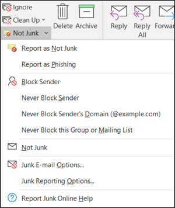
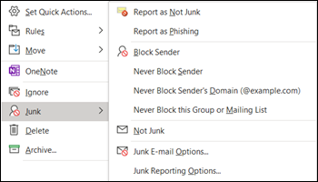
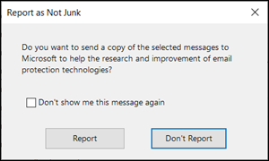

# <a name="install-and-use-the-junk-email-reporting-add-in-for-microsoft-outlook"></a>Installieren und Verwenden des Add-Ins für die Junk-e-Mail-Berichterstellung für Microsoft Outlook

> [!NOTE]
> Wenn Sie derzeit das Add-in "Junk-e-Mail-Berichterstellung" nicht verwenden, wird stattdessen das [Add-in "Berichtsnachricht](enable-the-report-message-add-in.md) " empfohlen. Weitere Informationen finden Sie unter [Melden von Nachrichten und Dateien an Microsoft](report-junk-email-messages-to-microsoft.md).

Mit dem Add-in "Junk-e-Mail-Berichterstellung" für Microsoft Outlook können Benutzer falsch positive Ergebnisse (gute e-Mail-Nachrichten als Spam gekennzeichnet), falsche Negative (ungültige e-Mail-Nachricht) und Phishing-Nachrichten an Microsoft senden. Wenn Ihre Organisation keinen Exchange Online Schutz verwendet (beispielsweise lokale Exchange-oder e-Mail-Dienste, die nicht Exchange Online sind), wirkt sich die Übermittlung des Junk-e-Mail-Berichts nicht auf Ihre Spamfilterung aus.

In diesem Thema wird erläutert, wie Sie das Add-in "Junk-e-Mail-Berichterstellung" installieren und verwenden.

## <a name="what-do-you-need-to-know-before-you-begin"></a>Was sollten Sie wissen, bevor Sie beginnen?

- Informationen zum Installieren des Junk-e-Mail-Berichts-Add-Ins finden Sie im Abschnitt [Installieren des Junk-e-Mail-Berichts-Add-ins](#install-the-junk-email-reporting-add-in) weiter unten in diesem Thema.

- Das Add-in "Junk-e-Mail-Berichterstellung" funktioniert mit den folgenden Versionen von Outlook:

  - Outlook 2013 oder höher
  - Outlook im Lieferumfang von Microsoft 365-Apps für Unternehmen

- Weitere Informationen zum Melden von Nachrichten an Microsoft finden Sie unter [Report Messages and files to Microsoft](report-junk-email-messages-to-microsoft.md).

## <a name="use-the-junk-email-reporting-add-in-to-report-spam-and-phishing-messages"></a>Verwenden des Add-Ins "Junk-e-Mail-Berichterstellung" zum Melden von Spam-und Phishing-Nachrichten

1. Verwenden Sie für Nachrichten im Posteingang oder in einem anderen e-Mail-Ordner außer Junk-e-Mails eine der folgenden Methoden, um Spam-und Phishing-Nachrichten zu melden:

   - Wählen Sie die Nachricht aus, oder öffnen Sie die Nachricht. Klicken Sie auf der Registerkarte **Start** oder **Nachricht** im Menüband auf **Junk**, und wählen Sie dann **als Junk melden** oder **als Phishing melden**aus.

     

   - Klicken Sie mit der rechten Maustaste auf die Nachricht, wählen Sie **Junk**aus, und wählen Sie dann **als Junk melden** oder **als Phishing melden**aus.

     

   - Wählen Sie mehrere Nachrichten aus, klicken Sie mit der rechten Maustaste, und wählen Sie dann **als Junk melden** oder **als Phishing melden**aus.

     

2. Lesen Sie im daraufhin angezeigten Dialogfeld die Informationen, und klicken Sie auf **Bericht**. Wenn Sie Ihre Meinung ändern, klicken Sie auf **nicht melden**.

   

   

3. Die ausgewählten Nachrichten werden zur Analyse an Microsoft gesendet und:

   - In den Junk-e-Mail-Ordner verschoben, wenn er als Spam gemeldet wurde.
   - Gelöscht, wenn es als Phishing gemeldet wurde.
   
   Wenn Sie überprüfen möchten, ob die Nachrichten gesendet wurden, öffnen Sie den Ordner **Gesendete Objekte**, in dem die gesendeten Nachrichten angezeigt werden sollten.

## <a name="use-the-junk-email-reporting-add-in-to-report-non-spam-and-phishing-messages-from-the-junk-email-folder"></a>Verwenden des Add-Ins "Junk-e-Mail-Berichterstellung" zum Melden von nicht-Spam-und Phishing-Nachrichten aus dem Junk-e-Mail

1. Verwenden Sie im Ordner Junk-e-Mail eine der folgenden Methoden, um Spam-falsch positive Ergebnisse oder Phishing-Nachrichten zu melden:

   - Wählen Sie die Nachricht aus, oder öffnen Sie die Nachricht. Klicken Sie auf der Registerkarte **Start** oder **Nachricht** im Menüband auf **kein Junk-e**-Mail, und wählen Sie dann als nicht-Junk-e- **Mail** melden oder **als Phishing melden**aus.

     

   - Klicken Sie mit der rechten Maustaste auf die Nachricht, klicken Sie auf **Junk**, und wählen Sie dann als **nicht-Junk-e-Mail** melden oder **als Phishing melden**aus.

     

   - Wählen Sie mehrere Nachrichten aus, klicken Sie mit der rechten Maustaste, und wählen Sie dann als **nicht-Junk-e-Mail** melden oder **als Phishing melden**aus.

     

2. Lesen Sie im daraufhin angezeigten Dialogfeld die Informationen, und klicken Sie auf **Bericht**. Wenn Sie Ihre Meinung ändern, klicken Sie auf **nicht melden**.

   

   

3. Die ausgewählten Nachrichten werden zur Analyse an Microsoft gesendet und:

   - In den Junk-e-Mail-Ordner verschoben, wenn er als Spam gemeldet wurde.
   - Gelöscht, wenn es als Phishing gemeldet wurde.

   Wenn Sie überprüfen möchten, ob die Nachrichten gesendet wurden, öffnen Sie den Ordner **Gesendete Objekte**, in dem die gesendeten Nachrichten angezeigt werden sollten.

## <a name="install-the-junk-email-reporting-add-in"></a>Installieren des Add-Ins für Junk-e-Mail-Berichte

- Sie benötigen Administratorrechte auf dem Computer, auf dem Sie das Add-in installieren.

- Wechseln Sie zu, <https://www.microsoft.com/download/details.aspx?id=18275> und laden Sie die entsprechende MSI-Datei für Ihre Office-Version an einen Speicherort, der leicht zu finden ist:

  - **32-Bit**: `Junk Reporting Add-in for Office 2007, 2010, 2013, and 2016 (32-bit).msi`
  - **64-Bit**: `Junk Reporting Add-in for Office 2007, 2010, 2013, and 2016 (64-bit).msi`

- Für Outlook 2013 oder höher ist die einzige Voraussetzung die Microsoft .NET Framework 2.0. In Windows 10 installieren Sie das .NET Framework 2,0 nicht aus einem Download.

### <a name="install-the-junk-email-reporting-add-in-using-the-setup-wizard"></a>Installieren des Junk-e-Mail-Berichts-Add-Ins mithilfe des Setup-Assistenten

1. Schließen Sie Outlook auf Ihrem Computer.

2. Überprüfen Sie in Windows 10, ob die .NET Framework 2,0 aktiviert ist. Anweisungen finden Sie unter [Aktivieren der Microsoft .NET Framework 3.5 in der System](https://docs.microsoft.com/dotnet/framework/install/dotnet-35-windows-10#enable-the-net-framework-35-in-control-panel)Steuerung.

3. Suchen Sie die heruntergeladene MSI-Datei, und doppelklicken Sie darauf.

4. Klicken Sie auf der Seite **Willkommen beim Setup des Microsoft-Add-Ins "Junk-E-Mail-Berichtsprogramm"** auf **Weiter**.

5. Lesen Sie den Lizenzvertrag, und klicken Sie auf **Ich stimme den Bedingungen des Lizenzvertrags** zu, wenn Sie den Bedingungen zustimmen, und klicken Sie dann auf **weiter**.

6. Klicken Sie nach Abschluss des Assistenten auf **Fertig stellen**.

Starten Sie Outlook.

Suchen Sie auf dem Outlook-Menüband nach der Schaltfläche **Junk** . Sie können Microsoft nun Junk-E-Mails melden, indem Sie die entsprechenden E-Mails im Posteingang auswählen und dann auf die Schaltfläche **Junk-E-Mails melden** klicken.

Wählen Sie den Pfeil nach unten neben **Junk** aus, um weitere Optionen anzuzeigen, z. B. **Als betrügerischen Phishing-Versuch melden**, wenn Sie Phishing-Scam-E-Mails an Microsoft melden möchten. In Ihrem Junk-E-Mailordner können Sie auch **Keine Junk-E-Mail** auswählen, wenn eine E-Mail-Nachricht fälschlicherweise als Junk-E-Mail gekennzeichnet wurde.

### <a name="install-the-junk-email-reporting-add-in-using-silent-mode"></a>Installieren des Add-Ins „Junk-E-Mail-Berichtsprogramm“ im unbeaufsichtigten Modus

1. Schließen Sie Outlook auf Ihrem Computer.

2. Installieren Sie in Windows 10 die .NET Framework 2,0, indem Sie den folgenden Befehl ausführen:

   ```dos
   DISM /Online /Enable-Feature /FeatureName:NetFx3 /All
   ```

3. Wenn Sie das Add-in ohne Benutzerinteraktion installieren möchten, öffnen Sie eine Eingabeaufforderung, und verwenden Sie die folgende Syntax:

   ```dos
   msiexec /qn /i "<PathToMSIFile>\<MSIFile>" [MaxMessageSelection=<1-50>] [BccEmailAddress="<EmailAddress1>; <EmailAddress2>"...]
   ```

   - `MaxMessageSelection` Gibt die maximale Anzahl von Nachrichten an, die Sie für eine einzelne Übermittlung auswählen können. Gültige Werte sind 1 bis 50. Der Standardwert ist 15.

   - `BccEmailAddress` Gibt zusätzliche Bcc-Empfänger an, die eine Kopie aller Übermittlungen von Benutzern erhalten sollen. Der Standardwert ist leer (keine zusätzlichen Bcc-Empfänger).

   In diesem Beispiel wird die 64-Bit-Version des Add-Ins aus dem angegebenen Pfad mit den Standardeinstellungen installiert.

   ```dos
   msiexec /qn /i "C:\Downloads\Junk Reporting Add-in for Office 2007, 2010, 2013, and 2016 (64-bit).msi"
   ```

   In diesem Beispiel wird die 32-Bit-Version des Add-Ins aus dem angegebenen Pfad mit den folgenden zusätzlichen Einstellungen installiert:

   - In einer einzigen Übermittlung können bis zu 20 Nachrichten ausgewählt werden.
   - junkreports@contoso.com und hollyd@treyresearch.net erhalten Bcc-Kopien aller Übermittlungen.

   ```dos
   msiexec /qn /i "C:\Downloads\Junk Reporting Add-in for Office 2007, 2010, 2013, and 2016 (32-bit).msi" MaxMessageSelection=20 BccEmailAddress="junkreports@contoso.com; hollyd@treyresearch.net"
   ```

### <a name="how-do-you-know-this-worked"></a>Woher wissen Sie, dass dieses Verfahren erfolgreich war?

Führen Sie die folgenden Schritte in Outlook aus, um zu überprüfen, ob Sie das Add-in "Junk-e-Mail-Berichterstellung" erfolgreich installiert haben:

- Wählen Sie die Nachricht aus, oder öffnen Sie die Nachricht. Klicken Sie auf der Registerkarte **Start** oder **Nachricht** im Menüband auf **Junk**, und vergewissern Sie sich, dass die folgenden Optionen verfügbar sind:

  - **Als Junk melden**
  - **Als Phishing melden**
  - **Optionen für Junk-Berichterstellung**
  - **Junk Online-Hilfe melden**

  

- Klicken Sie mit der rechten Maustaste auf die Nachricht, wählen Sie **Junk**aus, und stellen Sie sicher, dass die folgenden Optionen verfügbar sind:

  - **Als Junk melden**
  - **Als Phishing melden**
  - **Optionen für Junk-Berichterstellung**
  - **Junk Online-Hilfe melden**

  

- Wählen Sie mehrere Nachrichten aus, klicken Sie mit der rechten Maustaste, und stellen Sie sicher, dass die folgenden Optionen verfügbar sind:

  - **Als Junk melden**
  - **Als Phishing melden**

  

- Führen Sie die vorherigen Aktionen im Ordner **Junk-e-Mail** aus, und vergewissern Sie sich, dass die vorherigen **Junk** -Berichterstellungsoptionen jetzt **nicht Junk**sind.

  

  

  

## <a name="uninstall-the-junk-email-reporting-add-in"></a>Deinstallieren des Add-Ins "Junk-E-Mail-Berichtsprogramm"

Nachdem Sie Outlook geschlossen haben, verwenden Sie eines der folgenden Verfahren, um das Add-in "Junk-e-Mail-Berichterstellung" zu deinstallieren:

- **System**Steuerung: Drücken Sie die Windows-Taste + R. Geben Sie im daraufhin geöffneten Dialogfeld **Ausführen** die EINGABETASTE ein, `control appwiz.cpl` und klicken Sie dann auf **OK**.

  Suchen und wählen Sie **Microsoft Junk-e-Mail-Berichts-Add-in** in der Liste aus, und klicken Sie dann auf **deinstallieren**.

- **Windows Installer-Paket**: Suchen oder laden Sie die entsprechende MSI-Datei, und doppelklicken Sie darauf.

  - **32-Bit**: `Junk Reporting Add-in for Office 2007, 2010, 2013, and 2016 (32-bit).msi`

  - **64-Bit**: `Junk Reporting Add-in for Office 2007, 2010, 2013, and 2016 (64-bit).msi`

  Wählen Sie im daraufhin angezeigten Dialogfeld **Microsoft Junk-e-Mail-Berichts-Add-in für Outlook entfernen** aus, und klicken Sie dann auf **weiter**.

- **Automatischer Modus**: Suchen oder Herunterladen der entsprechenden MSI-Datei. Ersetzen Sie in einem Eingabeaufforderungsfenster \<PathToFile\> durch den Speicherort der MSI-Datei, und führen Sie einen der folgenden Befehle aus:

  - **32-Bit**:

    ```dos
    msiexec /x "<PathToFile>\Junk Reporting Add-in for Office 2007, 2010, 2013, and 2016 (32-bit).msi" /qn MSIRESTARTMANAGERCONTROL="DisableShutdown"
    ```

  - **64-Bit**:

    ```dos
    msiexec /x "<PathToFile>\Junk Reporting Add-in for Office 2007, 2010, 2013, and 2016 (64-bit).msi" /qn MSIRESTARTMANAGERCONTROL="DisableShutdown"
    ```

Wenn Sie Outlook nach der Deinstallation öffnen, sollten die Optionen Junk, not Junk und Phishing-Berichterstellung nicht mehr vorhanden sein.

## <a name="troubleshooting-the-junk-email-reporting-add-in"></a>Problembehandlung beim Add-in "Junk-e-Mail-Berichte"

Gelegentlich können Probleme mit Outlook auftreten, nachdem Sie das Add-in "Junk-e-Mail-Berichterstellung" hinzugefügt haben. In diesem Abschnitt werden Probleme beschrieben, die auftreten können, sowie Tipps zum Beheben dieser Probleme.

### <a name="troubleshooting-for-users"></a>Problembehandlung für Benutzer

Eines oder mehrere der folgenden Probleme können auftreten:

- Das Programm reagiert nicht, wenn Sie auf **Junk-E-Mail melden** klicken
- Outlook reagiert nicht mehr, wenn Sie eine E-Mail auswählen
- Gemeldete Junk-E-Mails können nicht übermittelt werden, und es wird eine Unzustellbarkeitsnachricht angezeigt

Um dieses Problem zu beheben, führen Sie die folgenden Schritte aus:

1. Schließen Sie Outlook, und starten Sie es neu.
2. Erstellen und senden Sie eine Testnachricht, und vergewissern Sie sich, dass der Empfänger die Nachricht erhalten hat.
3. Wenn das Problem fortbesteht, wenden Sie sich an Ihren Administrator.

Weitere Methoden, die Sie zum Übermitteln von Nachrichten an Microsoft verwenden können, finden Sie unter [Report Messages and files to Microsoft](report-junk-email-messages-to-microsoft.md).

### <a name="troubleshooting-for-admins"></a>Problembehandlung für Administratoren

#### <a name="problem-an-error-message-continually-appears-that-asks-users-to-contact-their-system-administrator"></a>Problem: Es wird ständig eine Fehlermeldung angezeigt, in der die Benutzer aufgefordert werden, Ihren System Administrator zu kontaktieren.

1. Überprüfen oder Festlegen des `LoggingLevel` Registrierungsschlüssels auf den Wert "Verbose":

   - **32-Bit-Outlook unter 32-Bit-Windows**:

     ```text
     Windows Registry Editor Version 5.00

     [HKEY_LOCAL_MACHINE\Software\Microsoft\Junk Email Reporting\Addins]
     "LoggingLevel"="Verbose"
     ```

   - **32-Bit-Outlook unter 64-Bit-Windows**:

     ```text
     Windows Registry Editor Version 5.00

     [HKEY_LOCAL_MACHINE\Software\Wow6432Node\Microsoft\Junk Email Reporting\Addins]
     "LoggingLevel"="Verbose"
     ```

   - **64-Bit-Outlook**:

     ```text
     Windows Registry Editor Version 5.00

     [HKEY_LOCAL_MACHINE\Software\Microsoft\Junk E-mail Reporting\Addins]
     "LoggingLevel"="Verbose"
     ```

2. Starten Sie Outlook neu, und fordern Sie die Benutzer auf, zurückgemeldet zu werden, wenn die Fehlermeldung angezeigt wird.

3. Erfassen Sie die Protokollinformationen am folgenden Speicherort:

   `%LOCALAPPDATA%\Microsoft\Junk Email Reporting Add-in\SpamReporterAddinLog.txt`

4. Kontaktieren Sie den technischen Support für Exchange Online Protection, und übergeben Sie den Mitarbeitern diese Protokollinformationen.

#### <a name="problem-users-selected-not-to-receive-a-confirmation-prompt-when-they-report-messages-and-now-they-want-the-prompt-back"></a>Problem: Benutzer haben ausgewählt, beim Melden von Nachrichten keine Bestätigungsaufforderung zu erhalten, und möchten nun die Eingabeaufforderung zurück

1. Erstellen Sie den `ConfirmReportJunk` Registrierungsschlüssel mit dem Wert "true":

   ```text
   Windows Registry Editor Version 5.00

   HKEY_CURRENT_USER\Software\Microsoft\Junk E-mail Reporting\Preferences]
   "ConfirmReportJunk"="True"
   ```

2. Starten Sie Outlook neu.
